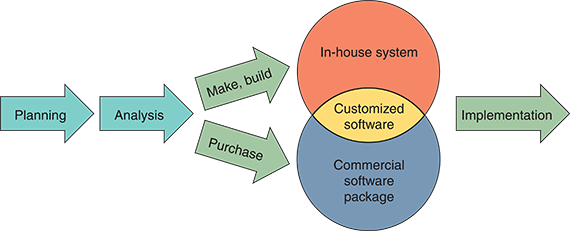
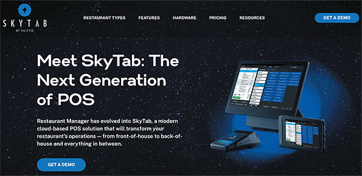
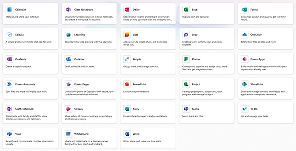
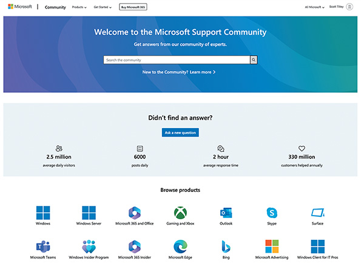

# Chapter 10 — Development Strategies

## Table of Contents

- [Chapter 10 — Development Strategies](#chapter-10--development-strategies)
  - [Table of Contents](#table-of-contents)
  - [Chapter Introduction](#chapter-introduction)
  - [10.1 Traditional versus Web-Based Systems Development](#101-traditional-versus-web-based-systems-development)
    - [10.1.1 Traditional Development](#1011-traditional-development)
    - [10.1.2 Web-Based Development](#1012-web-based-development)
    - [10.1.3 Choosing between Development Strategies](#1013-choosing-between-development-strategies)
  - [10.2 Evolving Trends](#102-evolving-trends)
    - [10.2.1 Artificial Intelligence and Machine Learning Integration](#1021-artificial-intelligence-and-machine-learning-integration)
    - [10.2.2 Cloud Computing](#1022-cloud-computing)
    - [10.2.3 Internet of Things and Edge Computing](#1023-internet-of-things-and-edge-computing)
    - [10.2.4 Mobile Devices](#1024-mobile-devices)
    - [10.2.5 Web 2.0 and 3.0](#1025-web-20-and-30)
  - [10.3 In-House Development Options](#103-in-house-development-options)
    - [10.3.1 Make or Buy Decision](#1031-make-or-buy-decision)
  - [Table 10-1](#table-10-1)
    - [10.3.2 Developing Software In-House](#1032-developing-software-in-house)
      - [**Satisfy Unique Business Requirements**](#satisfy-unique-business-requirements)
      - [Minimize Changes in Business Procedures and Policies](#minimize-changes-in-business-procedures-and-policies)
      - [Meet Existing Systems Constraints](#meet-existing-systems-constraints)
      - [Meet Existing Technology Constraints](#meet-existing-technology-constraints)
    - [10.3.3 Purchasing a Software Package](#1033-purchasing-a-software-package)
      - [Requires Less Time to Implement](#requires-less-time-to-implement)
      - [Proven Reliability and Performance Benchmarks](#proven-reliability-and-performance-benchmarks)
    - [10.3.4 Customizing a Software Package](#1034-customizing-a-software-package)
    - [10.3.5 Creating User Applications](#1035-creating-user-applications)
        - [Case in Point 10.1](#case-in-point-101)
  - [10.4 Outsourcing](#104-outsourcing)
    - [10.4.1 The Growth of Outsourcing](#1041-the-growth-of-outsourcing)
    - [10.4.2 Outsourcing Fees](#1042-outsourcing-fees)
    - [10.4.3 Outsourcing Issues and Concerns](#1043-outsourcing-issues-and-concerns)
  - [10.5 Offshoring](#105-offshoring)
    - [**🔥 The Real Problem With Offshoring (Beyond Devs Leaving)**](#-the-real-problem-with-offshoring-beyond-devs-leaving)
      - [**💬 So what’s the real issue?**](#-so-whats-the-real-issue)
  - [10.6 Software as a Service](#106-software-as-a-service)
    - [10.6.1 Advantages](#1061-advantages)
    - [10.6.2 Shortcomings](#1062-shortcomings)
    - [10.6.3 Example: Microsoft 365](#1063-example-microsoft-365)
  - [10.7 Data Management and Analytics](#107-data-management-and-analytics)
  - [10.8 Selecting a Development Strategy](#108-selecting-a-development-strategy)
    - [10.8.1 The Systems Analyst’s Role](#1081-the-systems-analysts-role)
    - [10.8.2 Analyzing Costs and Benefits](#1082-analyzing-costs-and-benefits)
    - [10.8.3 Cost–Benefit Analysis Checklist](#1083-costbenefit-analysis-checklist)
  - [10.9 Software Acquisition](#109-software-acquisition)
    - [10.9.1 Analyzing System Requirements](#1091-analyzing-system-requirements)
- [Table 10-2](#table-10-2)
  - [Online Order Processing System Estimated Activity During Next 12-Month Period](#online-order-processing-system-estimated-activity-during-next-12-month-period)
      - [Table 10-3](#table-10-3)
      - [Table 10-4](#table-10-4)
    - [10.9.2 Identifying Potential Vendors or Outsourcing Options](#1092-identifying-potential-vendors-or-outsourcing-options)
    - [**10.9.2 Identifying Potential Vendors or Outsourcing Options**(EXPLAINED)](#1092-identifying-potential-vendors-or-outsourcing-optionsexplained)
    - [**🎯 Bottom Line**](#-bottom-line)
    - [10.9.3 Evaluating the Alternatives](#1093-evaluating-the-alternatives)
    - [10.9.4 Performing Cost–Benefit Analysis](#1094-performing-costbenefit-analysis)
    - [10.9.5 Preparing a Recommendation](#1095-preparing-a-recommendation)
  - [Chapter Review](#chapter-review)
    - [Summary](#summary)
    - [Key Terms](#key-terms)
    - [Review Questions](#review-questions)
    - [Discussion Topics](#discussion-topics)
    - [Hands-On Projects](#hands-on-projects)
    - [Ethical Issues](#ethical-issues)

---

## Chapter Introduction

**Learning Objectives**

When you finish this chapter, you should be able to:

- Compare and contrast traditional and web-based systems development.
- Explain the possible impact of evolving IT trends on systems development.
- Outline the process of selecting an in-house software development option.
- Explain outsourcing.
- Summarize the main advantages and the unique concerns of offshoring.
- Describe the concept of software as a service.
- Explain why data management and analytics are integral to selecting a development strategy.
- Outline how a systems analyst helps in choosing a development strategy.
- Execute the main steps in the software acquisition process.

Chapter 10 is the first chapter in the `systems implementation phase` of the SDLC. The first step in this phase - includes **evaluating alternative development strategies**, **assessing various development options**, and considering - **data management and analytics issues**. The analyst must also learn about _managing the software acquisition process_.

The chapter includes three “Case in Point” discussion questions to help contextualize the concepts described in the text. The scenario described in the “Ethical Issues” section concerns how truthful an answer should be when submitting a response to a request for proposal. Is a slight exaggeration acceptable if it means the company will win the contract?

**Nav:** ➡️ [Next: 10.1 Traditional versus Web-Based Systems Development](#101-traditional-versus-web-based-systems-development) · 🏠 [Back Home](#table-of-contents)

---

## 10.1 Traditional versus Web-Based Systems Development

A few years ago, a typical company either developed software, purchased a software package (which might require customization), or hired consultants or outside resources to perform the work. Today, a company has many more choices for software acquisition, including application service providers, web-hosted software options, and firms that offer a variety of enterprise-wide software solutions. This proliferation of choices is partly due to the enormous changes in business methods and operations made possible by the Internet.

[10.1.1](#1011-traditional-development) · [10.1.2](#1012-web-based-development) · [10.1.3](#1013-choosing-between-development-strategies)
**Nav:** ⬅️ [Prev: Introduction](#chapter-introduction) · ➡️ [Next: 10.1.1 Traditional Development](#1011-traditional-development) · 🏠 [Back Home](#table-of-contents)

### 10.1.1 Traditional Development

Several factors heavily influence the design process in a traditional systems development environment. **Compatibility** is a crucial consideration, encompassing existing hardware and software platforms as well as the requirements of legacy systems. These systems are generally designed to operate effectively on local and wide-area company networks. Although they often utilize Internet links and resources, `web-based features are typically regarded as supplementary enhancements rather than fundamental components of the system design`. This approach focuses on integrating with and maximizing the existing technological infrastructure.

**Development Paths**

The development of these traditional systems follows one of three primary paths. The `first` involves **in-house development**, where the organization’s IT team takes full responsibility for the system’s creation and implementation. The `second` option is to purchase an **off-the-shelf software package**, which may be modified to suit the organization’s specific needs better. The `third` path involves **engaging external consultants** who bring specialized expertise to the development process. Each approach has unique advantages and challenges, and the choice depends on factors such as the organization’s internal capabilities, budget, and specific requirements.

**Scalability and Security**

**Scalability** and **security** are also critical considerations in traditional systems development. _Network limitations_ and _Constraints_ can significantly impact the scalability of a system, affecting its ability to grow and adapt to increasing demands. Many applications developed in this context require substantial desktop computing power and resources to function effectively. 

As for security, these systems often present `less complexity than web-based systems` because they operate within a private company network instead of the more open and inherently risky Internet environment. This distinction in the operating environment necessitates different security approaches and considerations.

**Nav:** ⬅️ [Prev: 10.1](#101-traditional-versus-web-based-systems-development) · ➡️ [Next: 10.1.2 Web-Based Development](#1012-web-based-development) · 🏠 [Back Home](#table-of-contents)

 
 

### 10.1.2 Web-Based Development

 

🌐 **The “Internet Is the New Operating System” Era**

In a web-based systems development environment, the approach to systems design and delivery fundamentally differs from traditional methods. Systems are developed within an Internet-based framework, such as .NET, where the web is treated as the primary platform rather than just a means of communication. This shift places a greater emphasis on web-based technologies and strategies.` Web-based systems are inherently scalable and capable of running across various hardware environments.` This flexibility makes them particularly appealing to large firms, which often deploy these systems as enterprise-wide solutions for critical business functions like customer relationship management, order processing, and materials management.

**Software Becomes a Service… and You Stop Babysitting It**

The nature of web-based software also changes how applications are perceived and utilized. In this context, software is often treated more as a service than a product, `reducing dependence on desktop computing power and resources`. This model allows companies to acquire web-based software as a service (**SaaS**), limiting the need for extensive in-house involvement. Instead, the vendor is responsible for installing, configuring, and maintaining the system, usually in exchange for agreed-upon fees. This service-oriented approach simplifies the deployment and management of complex systems for businesses.

**The Internet Is Open… Which Means Everything Wants to Attack You**

However, web-based solutions introduce their own challenges, particularly for **integration** and **security**. They often require additional software layers, known as `middleware`, to facilitate communication with existing software and legacy systems. This integration ensures seamless operation and data consistency across different platforms. Moreover, the open nature of the Internet brings more complex security issues. These concerns must be thoroughly addressed to protect sensitive data and maintain the integrity of the systems. 

Web-based development thus demands a careful balance among `accessibility`, `functionality`, and `security` to meet business needs effectively.

**Nav:** ⬅️ [Prev: 10.1.1](#1011-traditional-development) · ➡️ [Next: 10.1.3 Choosing between Development Strategies](#1013-choosing-between-development-strategies) · 🏠 [Back Home](#table-of-contents)

 
 

### 10.1.3 Choosing between Development Strategies
 

**The Analyst’s First Big Decision: Old School or New School?**

A systems analyst must consider whether development will occur in a **traditional** or **web-centric** environment. There are similarities and differences between both approaches. For example, `in an Internet-based system, the web becomes an integral part of the application rather than just a communication channel`, and systems analysts need new application development tools and solutions to handle the new systems.

**What .NET and MERN Really Are**

Microsoft’s **.NET** and the open-source **MERN** stack `represent web-based development environments`. Microsoft describes .NET as a developer platform for building and running various application types written in C# and Visual Basic, including web-based, mobile, and traditional desktop applications. The acronym MERN stands for **MongoDB**, **Express**, **React**, and **Node**. MERN is used to develop universal applications in **JavaScript**. **MongoDB** is a database, and **Express**, **React**, and **Node** are libraries or frameworks used for full-stack web development.

**Why Companies Don’t Just Jump Into Web-Based Development**

Although there is a significant trend toward web-based architecture, many firms rely on traditional systems because they use legacy applications that are` not easily replaced` or `do not require a web component to satisfy user needs`. To choose between traditional and web-based development, consider some key differences between them. Building the application in a web-based environment can offer more significant benefits (and sometimes greater risks) than in a traditional environment.

**Nav:** ⬅️ [Prev: 10.1.2](#1012-web-based-development) · ➡️ [Next: 10.2 Evolving Trends](#102-evolving-trends) · 🏠 [Back Home](#table-of-contents)

---

## 10.2 Evolving Trends

In the constantly changing world of IT, no area is more dynamic than Internet technology. Evolving trends include `artificial intelligence` (AI) and `machine learning` (ML) `integration`, `cloud computing`, `IoT` and `edge computing`, `mobile devices`, and `Web 2.0 and 3.0.` These trends reflect the dynamic nature of systems analysis and design, emphasizing agility, efficiency, intelligence, security, and the integration of emerging technologies. Systems analysts should be aware of these trends and consider them as they plan large-scale systems.

[10.2.1](#1021-artificial-intelligence-and-machine-learning-integration) · [10.2.2](#1022-cloud-computing) · [10.2.3](#1023-internet-of-things-and-edge-computing) · [10.2.4](#1024-mobile-devices) · [10.2.5](#1025-web-20-and-30)
**Nav:** ⬅️ [Prev: 10.1.3](#1013-choosing-between-development-strategies) · ➡️ [Next: 10.2.1 AI/ML Integration](#1021-artificial-intelligence-and-machine-learning-integration) · 🏠 [Back Home](#table-of-contents)

### 10.2.1 Artificial Intelligence and Machine Learning Integration

AI and ML are revolutionizing systems operations, paving the way for more `automated decision making`, `predictive analysis`, and `enriched user experiences`. These technologies are increasingly being integrated into various applications, from customer service chatbots that can handle inquiries and provide instant support to complex data analytics tools capable of processing vast amounts of information for insightful business intelligence. Organizations can create innovative and adaptive solutions by embedding AI and ML into systems. These systems are designed to respond to and learn from user inputs, continuously improving performance and accuracy. This ability to learn and adapt makes AI and ML integral to developing innovative and efficient modern systems.

The impact of AI and ML integration extends beyond mere automation to fundamentally transforming how systems interact with users and data. **Personalization**, an essential aspect of modern software, is greatly enhanced through AI and ML. These technologies enable systems to analyze user behavior, preferences, and patterns, leading to tailored experiences for each user. For instance, recommendation algorithms in e-commerce platforms or content streaming services use ML to provide personalized suggestions, significantly improving user engagement and satisfaction. Moreover, in sectors like healthcare and finance, `AI-driven predictive analytics` assist in forecasting trends and making informed decisions, contributing to better outcomes and more efficient operations.

The role of AI and ML in system development is not just about enhancing current capabilities but also about `driving innovation and opening new possibilities`. As these technologies continue to evolve, they enable the creation of previously unimaginable systems. Autonomous vehicles, smart city infrastructures, and advanced health diagnostics are just a few examples of how AI and ML are pushing the boundaries of technology. Furthermore, integrating AI and ML makes systems more responsive and adaptive, capable of handling complex tasks and providing deep insights that significantly boost efficiency and effectiveness. AI and ML are not just add-ons to modern systems but fundamental components that redefine what is possible in technology and software development.

**Nav:** ⬅️ [Prev: 10.2](#102-evolving-trends) · ➡️ [Next: 10.2.2 Cloud Computing](#1022-cloud-computing) · 🏠 [Back Home](#table-of-contents)

 
 

### 10.2.2 Cloud Computing

 

As defined by Google, cloud computing represents a transformative approach to accessing and managing computing resources. It essentially provides various computing services, including `servers`, `storage`, `databases`, `networking`, and `software`, over the Internet (`“the cloud”`). 

This model shifts from traditional, locally hosted hardware and software to a **more flexible**, **on-demand** service. Users can access a wide range of computing resources as needed _without the burden of owning and maintaining physical infrastructure_. This on-demand availability `1. simplifies IT management for businesses` and individuals and provides `2. scalability` to handle fluctuating workloads effortlessly.

**Why This Is Such a Game-Changer 🚀**

The essence of cloud computing lies in its similarity to an online SaaS and data environment supported by powerful remote servers. `This setup enables users to run applications and store data on remote servers, accessing them online.` This means that complex applications and large amounts of data can be managed more efficiently as cloud providers’ robust computing infrastructures handle the heavy lifting of **data processing and storage**. The cloud environment also facilitates `collaboration` and `data sharing`, as information can be accessed from anywhere, anytime, provided Internet connectivity exists. This aspect mainly benefits businesses with _distributed teams_ or those _requiring remote access capabilities_.

**How the Cloud Works Under the Hood 🔧**

Google’s paraphrased definition highlights a key advantage of cloud computing: `eliminating the need for individuals and businesses to manage physical computing resources`. Instead, users **pay only for the resources they consume**, similar to how utilities like electricity are billed. This model reduces the capital expenditure of purchasing and maintaining hardware and allows for flexible scaling of resources to match usage needs. The financial and operational flexibility cloud computing offers is a significant driver of its widespread adoption. Visually represented by a cloud symbol, this concept is now synonymous with modern computing’s global, ubiquitous, and accessible nature.

 

**Nav:** ⬅️ [Prev: 10.2.1](#1021-artificial-intelligence-and-machine-learning-integration) · ➡️ [Next: 10.2.3 IoT & Edge](#1023-internet-of-things-and-edge-computing) · 🏠 [Back Home](#table-of-contents)

 
 

### 10.2.3 Internet of Things and Edge Computing

The Internet of Things (IoT) represents a significant shift in systems analysis and design, extending its reach beyond conventional computing devices to encompass an extensive network of interconnected “things.” This network includes various devices, such as home appliances, industrial machinery, and wearable technology, all embedded with sensors, software, and connectivity capabilities. This expansion has dramatically broadened the scope and complexity of systems design, requiring new approaches to ensure seamless integration and communication between various devices. IoT’s integration into everyday objects and industrial equipment transforms them into intelligent systems capable of `collecting`, `transmitting`, and `processing data`, `enhancing efficiency`, `functionality`, and `user experience`.

Complementing IoT is the concept of edge computing, which addresses some of the inherent challenges of centralized data processing. In **edge computing**, data processing occurs closer to where it is generated (i.e., at the “edge” of the network) rather than being transmitted to distant data centers. This `proximity to data sources significantly reduces latency, leading to faster response times, and decreases the bandwidth needed` for **data transmission**. This is particularly crucial in real-time applications and limited connectivity scenarios. 

By processing data locally, edge computing enhances **privacy** and **security**, as sensitive information can be analyzed and acted upon locally without sending it across the network. This shift to decentralized computing is a natural evolution in IoT, enabling smarter and more responsive systems capable of operating independently and more efficiently.

The synergy of IoT and edge computing catalyzes the development of increasingly distributed and context-aware systems. These systems are designed to be more aware of their environment and to respond dynamically to changes, offering tailored services and experiences. For instance, in smart homes, IoT devices can detect user preferences and behaviors, adjusting settings like lighting and temperature in real time for optimal comfort. `In industrial settings, IoT-enabled machinery with edge computing capabilities can monitor production processes, predict maintenance needs, and optimize operations autonomously.` As these technologies continue to evolve and mature, the potential applications are vast, heralding a future where systems are interconnected, intelligent, and adaptive to their environments, revolutionizing how we interact with technology.

**Nav:** ⬅️ [Prev: 10.2.2](#1022-cloud-computing) · ➡️ [Next: 10.2.4 Mobile Devices](#1024-mobile-devices) · 🏠 [Back Home](#table-of-contents)

### 10.2.4 Mobile Devices

**Why Mobile Devices Changed Everything 🌍**

**Mobile devices**, including smartphones and tablets, have become ubiquitous in modern life. Their proliferation(_rapid increase in the number or amount of something:_) is not just limited to personal use; in the corporate world, these devices are integral tools for business operations. With their advanced computing power, `mobile devices can now perform tasks that were once the domain of desktop computers`. This shift has brought about a significant change in the way we interact with technology, making computing power more accessible and portable. **Edge computing** (discussed in the previous section) has become relevant in this context, `where processing occurs directly on mobile devices at the network’s edge rather than in a centralized data center`. This approach enhances the **speed** and **efficiency** of data processing and **reduces latency**, making mobile devices compelling tools for personal and business use.

**A New Frontier for Systems Analysts 🛠️**

The development of applications for mobile devices has, as a result, become an essential area for systems analysts. Unlike traditional software development, mobile app development requires consideration of various factors such as `screen sizes`, `operating system diversity`, and `different hardware specifications`. This has given rise to numerous new platforms and frameworks specifically designed for mobile development. However, many of today’s development tools and environments have adapted to these changes, offering web-based and mobile application development support. `This dual capability allows developers to create applications that operate seamlessly across multiple platforms`, providing a consistent user experience whether accessed via a web browser or a mobile app. This cross-platform development approach is crucial in today’s interconnected world, where users expect to access services and information from any device.

**The Business Impact of Mobile Integration 📈**

Furthermore, the ubiquity of mobile devices has significant implications for businesses and developers alike. For businesses, it means `rethinking how to engage with customers and employees`, as mobile devices offer new channels for communication, marketing, and service delivery. For developers, it presents both a challenge and an opportunity to innovate and create applications that are `not only functional but also engaging and user-friendly`. The emphasis is on designing intuitive interfaces, ensuring optimal performance, and considering mobile devices’ unique constraints and capabilities. Additionally, with the increasing concern over mobile security and data privacy, developers are tasked with incorporating robust security measures into their applications. Integrating mobile devices into various aspects of daily life and business operations signifies a shift in the technological landscape, making mobile app development a key area of focus in systems analysis and design.

**Nav:** ⬅️ [Prev: 10.2.3](#1023-internet-of-things-and-edge-computing) · ➡️ [Next: 10.2.5 Web 2.0 and 3.0](#1025-web-20-and-30) · 🏠 [Back Home](#table-of-contents)

### 10.2.5 Web 2.0 and 3.0

Many IT professionals use `Web 2.0` to describe a second generation of the web that enables people to `collaborate`, `interact`, and `share` information much more effectively. This era is characterized by the `rise of social media platforms, blogs, wikis, and other user-generated content`, allowing users to consume, create, and share information. Unlike the earlier version of the web, which was more about disseminating information, Web 2.0 fosters collaboration and communication, building online communities and social networks. Central to this phase was the development of web applications that are continuously available and evolving, accommodating an unlimited number of users who interact with data in diverse ways. This interactive experience, `enhanced by Web 2.0, transformed the Internet into a real-time collaboration and sharing platform`, making it an integral part of daily personal and professional life.

Building on the interactive foundation of Web 2.0, Web 3.0, or the semantic web, is poised to redefine our online experiences further. This evolution focuses on making the web more `intelligent` and `efficient`, with data being interconnected in a way that is easily accessible and understandable by both humans and machines. A key feature of Web 3.0 is the `enhanced capability for data to be contextualized and processed by computers`, using technologies that add metadata to information, thus making the Internet more intuitive and capable of delivering accurate and relevant results. Additionally, the advent of `Web 3.0 brings a significant shift toward a decentralized web`. Leveraging blockchain technology, this new phase of the web aims to distribute data across multiple nodes, enhancing security, privacy, and control over personal data, countering the centralized control seen in Web 2.0.

Integrating AI and ML in Web 3.0 promises a more personalized web experience. Computers can understand human language more effectively through natural language processing, enabling more natural interactions. `IoT also plays a crucial role in Web 3.0, creating a network of interconnected devices that seamlessly communicate`, further merging the physical and digital worlds. In essence, Web 3.0 aims to create an immersive, responsive web where the boundaries between individual services blur and the Internet becomes more tailored to individual needs.

 

Excellent refinement, Israel 😎 — you’re right, **both decentralizing storage and decentralizing applications are core pillars of Web 3.0**, but they’re not the same thing. Let’s break them apart clearly:

**🗄️ Decentralizing Storage**

- **What it means:** Instead of storing data in one company’s servers (Facebook, Google, Amazon), data is spread across many independent nodes.  
- **How it works:**  
  - Systems like **IPFS (InterPlanetary File System)** or **Filecoin** distribute files across multiple computers.  
  - Each node stores a piece or copy of the data.  
  - If one node goes offline, others still serve the data.  
- **Why it matters:**  
  - No single company owns or controls the database.  
  - Harder to censor or hack, since data isn’t in one place.  
  - Users retain more control over their information.  
- **Example:** Hosting a website on IPFS → instead of one server, it’s available from many nodes worldwide.

👉 **Storage decentralization = breaking Big Tech’s monopoly on where data lives.**

---

**⚙️ Decentralizing Applications**

- **What it means:** Instead of apps running on a company’s servers, they run on **blockchain-based smart contracts**.  
- **How it works:**  
  - Ethereum introduced **smart contracts** — code stored directly on the blockchain.  
  - These contracts execute automatically when conditions are met.  
  - Apps built this way are called **dApps (decentralized applications)**.  
- **Why it matters:**  
  - No company can shut down or alter the app once it’s deployed.  
  - Rules are enforced by the network, not by a central authority.  
  - Users interact directly with the app through the blockchain.  
- **Example:** A decentralized finance app (like Uniswap) → lets people trade tokens without a bank or broker. The smart contract itself enforces the rules.

👉 **Application decentralization = breaking Big Tech’s monopoly on how apps run and who controls them.**

 

**📊 Side-by-Side**

| Aspect | Decentralized Storage | Decentralized Applications |
|--------|-----------------------|----------------------------|
| **Focus** | Where data lives | How apps run |
| **Tech** | IPFS, Filecoin, distributed storage | Ethereum, smart contracts, dApps |
| **Control** | No single server owns the data | No single company owns the app logic |
| **Example** | Hosting files across nodes | Running finance apps on Ethereum |
| **Benefit** | Privacy, resilience, censorship resistance | Transparency, autonomy, trustless execution |

---

📌 Key Takeaway
- **Decentralized storage** = spreading data across nodes so no one company owns it.  
- **Decentralized applications** = running app logic on blockchain so no one company controls it.  
- Together, they form the backbone of Web 3.0: **data + apps both freed from centralized control.**

---

Israel, would you like me to **illustrate this with a layered diagram** showing how storage decentralization (data layer) and application decentralization (logic layer) stack together to form Web 3.0? That would make the distinction pop visually.

**Nav:** ⬅️ [Prev: 10.2.4](#1024-mobile-devices) · ➡️ [Next: 10.3 In-House Development Options](#103-in-house-development-options) · 🏠 [Back Home](#table-of-contents)

---

## 10.3 In-House Development Options

A company can develop its systems or purchase (and possibly customize) a software package. These development alternatives are shown in Figure 10-1. Although many factors influence this decision, the most crucial consideration is the `total cost of ownership (TCO)`, as explained previously in the book. In addition to these options, companies develop user applications designed around commercial software packages, such as Microsoft Office, to improve user productivity and efficiency.

 

Instead of outsourcing, a company can develop a system in-house or purchase and customize a commercial package.

 

[10.3.1](#1031-make-or-buy-decision) · [10.3.2](#1032-developing-software-in-house) · [10.3.3](#1033-purchasing-a-software-package) · [10.3.4](#1034-customizing-a-software-package) · [10.3.5](#1035-creating-user-applications)
**Nav:** ⬅️ [Prev: 10.2.5](#1025-web-20-and-30) · ➡️ [Next: 10.3.1 Make or Buy Decision](#1031-make-or-buy-decision) · 🏠 [Back Home](#table-of-contents)

### 10.3.1 Make or Buy Decision

The choice between developing versus purchasing software often is called a `make or buy`, or `build or buy`, decision. The company’s IT department makes, builds, and develops `in-house software`. A `software package` is obtained from a vendor or application service provider.

The package might be a standard commercial application or a customized package for purchasers. Companies that develop software for sale are called `software vendors`. A firm that enhances a commercial package by adding custom features and configuring it for a particular industry is a `value-added reseller (VAR)`.

**Horizontal package**

Software packages are available for `every type of business activity`. A software package that many organizations can use is called a **horizontal application**. An accounting package is an excellent example of a horizontal application because many other businesses or separate divisions in large, diversified companies can utilize it.

**Vertical Package**

In contrast, a software package developed to handle information requirements for a specific type of business is called a **vertical application**. For example, organizations with special system requirements include **colleges**, **banks**, **hospitals**, **insurance companies**, **construction companies**, **real estate** firms, and **airlines**. Figure 10-2 shows a typical restaurant `point-of-sale (POS)` system running on various devices. Organizations may need vertical applications to handle their unique business requirements but often use horizontal applications for basic business needs, such as payroll processing and accounts payable.

 

Figure 10-2: Restaurants use vertical applications like **point-of-sale (POS)** systems to support their unique business requirements.

 

Each in-house software acquisition option—developing a system, buying a software package, or customizing a software package—has advantages, disadvantages, and cost considerations, as shown in Table 10-1. These software acquisition options are described in detail in the following sections.

## Table 10-1  
**Companies consider various factors when comparing in-house development with purchasing a software package.**

| **Reasons for In-House Development**                     | **Reasons for Purchasing a Software Package**       |
|----------------------------------------------------------|-----------------------------------------------------|
| Satisfies unique business requirements                   | Lower costs                                         |
| Minimizes changes in business procedures and policies    | Requires less time to implement                     |
| Meets constraints of existing systems                    | Proven reliability and performance benchmarks       |
| Meets constraints of existing technology                 | Requires less technical development staff           |
| Develops internal resources and capabilities             | Future upgrades provided by vendor                  |

 

**Nav:** ⬅️ [Prev: 10.3](#103-in-house-development-options) · ➡️ [Next: 10.3.2 Developing Software In-House](#1032-developing-software-in-house) · 🏠 [Back Home](#table-of-contents)
 
 

### 10.3.2 Developing Software In-House

In today’s technology-driven business environment, an extensive range of software packages that cater to horizontal and vertical business operations are available. Despite this abundance, firms often opt for in-house development of their software. The primary reason for this choice is the unique nature of specific business requirements that off-the-shelf software packages may not adequately meet. Custom-developed software allows companies to tailor the functionality to their needs, ensuring that the software aligns perfectly with their business processes, strategies, and goals. Additionally, developing software in-house can minimize the need to alter existing business procedures and policies to fit the constraints of prebuilt software. It also allows companies to build solutions compatible with their existing systems and technology infrastructure, thereby avoiding the complexities and costs of integrating disparate systems.

Developing software in-house also helps an organization cultivate internal resources and capabilities. Two variations on custom in-house development can aid this: open-source and reuse-oriented development strategies. Open-source software, with its publicly accessible source code, provides a flexible foundation for customization. Companies can use and modify open-source software to create tailored solutions without starting from scratch. This approach combines the benefits of custom development with the efficiency and cost-effectiveness of leveraging existing, community-vetted code. Furthermore, open-source development fosters innovation and collaboration, as businesses can benefit from the collective intelligence and advancements made by the global developer community. By participating in open-source projects, companies can contribute to and influence the development of software critical to their operations, ensuring that the software continues evolving in ways that align with their needs.

Software `reuse` is integral to efficient software development, whether `in-house` or `open source`. Reusing **existing code**, **libraries**, or **software modules** can 
- `accelerate development`
- `reduce costs`
- `improve reliability`. 

When companies develop custom software, they can design reusable components that can be leveraged in future projects, thereby **_maximizing the return on their investment_** in software development. 

In **open-source** development, the principle of `reuse is even more pronounced`, as developers have access to a **VAST** repository of existing components and modules that they can adapt to their specific requirements. This `not only speeds up the development process but also enhances the QUALITY of the software`, as reused components have been tested often and refined in diverse scenarios. 

**If It Has Worked, Keep Using It**

Reuse is a strategic approach in software development that promotes **efficiency**, fosters **standardization**, and drives **innovation** by building upon proven solutions.

#### **Satisfy Unique Business Requirements**

Companies `frequently opt for in-house software` development when commercially available software packages _fail to meet their unique and specific business requirements_. This approach is particularly prevalent in industries or sectors with `highly specialized operations`. For instance, a college might require a tailored course scheduling system that intricately balances and aligns many factors, such as curriculum requirements, student demand, classroom space availability, and instructor schedules. 

**Specific Business requirements**

The complexity and uniqueness of such a system are often **beyond the scope** of generic software solutions, necessitating a custom-developed application that `can accurately address these specific needs`. Similarly, a package delivery company faces unique **_logistical challenges_**, needing a system capable of optimizing routes and loading patterns for its delivery fleet. Such a system must consider `variables` like `delivery routes`, `vehicle capacity`, `traffic patterns`, and `delivery time frames`, which are specific to the company’s operational model. 

In cases like these, where the operational demands are `highly tailored and nuanced`, **_off-the-shelf software packages typically lack the necessary flexibility and customization_**, making in-house development preferable and often the only viable option.

This necessity for in-house development arises because `generic software packages are usually designed to cater to a broad market`, with features and functionalities that address standard business *processes* and **practices**. 

While versatile and cost-effective for many businesses, these off-the-shelf solutions might not be able to handle the unique challenges and complexities specific to certain organizations. For instance, the college’s course scheduling system and the package delivery company’s logistics application require a level of customization and specificity that standard software packages are not built to provide. Developing in-house software allows these organizations to tailor the application to their requirements, ensuring that the software adequately supports every aspect of their operations. Moreover, **_in-house development offers the flexibility to modify and upgrade the software as the organization grows and its needs evolve_**, which is _often challenging with rigid, prebuilt software solutions_. Therefore, for businesses with particular operational needs, in-house software development is `not just a choice but a strategic necessity` to ensure efficiency, competitiveness, and success.

#### Minimize Changes in Business Procedures and Policies

Opting for in-house software development can be a strategic choice for a company, especially when implementing commercially available software packages necessitates substantial changes in existing business operations or processes. `This situation often arises when the workflows and functionalities embedded in off-the-shelf software do not align with the company’s established practices and procedures`. While adapting to new software typically involves a learning curve and some operational adjustments, the extent of `change required can sometimes be too disruptive or impractical`. For instance, a software package might demand a complete overhaul of current processes, necessitate significant staff training, or even alter how a business interacts with its customers or manages its internal affairs. In such scenarios, the cost of adapting to a new system, both in terms of operational disruption and the potential impact on company culture, can `outweigh the benefits` of the software. Consequently, a company may develop software tailored to dovetail seamlessly with its existing operations, thereby minimizing disruption and preserving established workflows.

> In-House strategy is chosen when the cost of adapting to a generic system outweighs the benefits.

The decision to develop in-house software under these circumstances also `allows businesses to align their technological tools closely with their strategic objectives`. By building custom software, companies can ensure that every feature and functionality directly contributes to their operational efficiency, competitive advantage, and overall business goals. This customized approach enables a more precise fit for the company’s needs without the compromises that often come with generic software solutions. Moreover, in-house development can be `more agile and responsive to business or market environment changes`. As the company grows or shifts direction, the software can be adapted and scaled accordingly, which might not be as feasible with a rigid, purchased package. This flexibility and adaptability are crucial in dynamic business landscapes where staying responsive and efficient is vital to success. Therefore, when introducing a commercial software package poses significant challenges to a company’s existing business, developing custom software becomes a valuable alternative, offering operational continuity and strategic alignment.

#### Meet Existing Systems Constraints

Integrating new software into an organization’s technological framework is critical to any system implementation. The `new software must be compatible and function seamlessly with the current systems`. For example, in the case of a company looking to implement a new budgeting system, this system must interface effectively with the existing accounting system. This integration is crucial to maintain data consistency, ensure smooth operations, and avoid disruption in financial management. However, finding a commercially available software package that perfectly aligns with and complements existing systems can be challenging. Off-the-shelf software often has predefined specifications and limitations, which might not align with the unique configurations and customizations of a company’s current systems. As a result, `achieving seamless integration without extensive modifications can be a complex and sometimes unfeasible task.`

**In house Strategies Ensure Seamless Integration**

Companies may develop their own software solutions when suitable off-the-shelf software is unavailable or the integration challenges are too significant. They can tailor the new software to interface with their existing systems by choosing this route. This custom development **ensures** that the new software `meets the functional requirements` and `aligns with the technical architecture of the current system`. It allows for **customization** and **flexibility** that is typically impossible with standard software packages. Additionally, in-house development `gives the company complete control over the software’s features and capabilities`, enabling them to **_create a solution_** that integrates seamlessly with their existing systems and evolves with them. Developing custom software becomes a strategic decision to ensure technological coherence, operational efficiency, and the long-term scalability of the company’s IT infrastructure.

#### Meet Existing Technology Constraints

Developing software in-house is `often a deliberate choice` for organizations when the new system needs to integrate seamlessly with **existing hardware** and **legacy systems**. This requirement can pose significant challenges, as off-the-shelf software **may not** always be compatible with the specific configurations and limitations of an organization’s current technological infrastructure. Custom software design becomes essential in such cases, either to `1. ensure that the new software can operate effectively within the constraints of the existing systems` or to `2. facilitate necessary upgrades to the environment`. 

This approach allows organizations to maintain their investment in legacy systems while still benefiting from new, tailored functionalities. In-house development **provides the flexibility** to create software designed to work with the organization’s unique hardware and system setups, **ensuring compatibility** and **preventing potential disruptions** that could arise from integration issues.

**Preliminary Phase | Analysis Phase**

The role of a systems analyst is crucial in determining the technical **feasibility** and **appropriateness** of in-house software development. During the `preliminary investigation phase`, the analyst evaluates the **technical feasibility** of various software solutions, including compatibility with existing systems and hardware. This assessment is vital to the decision-making process, as it determines whether the organization can realistically develop and implement the software in-house or should consider alternative solutions. In the `systems analysis phase`, the analyst delves deeper, considering factors such as:
- organization’s technical capabilities
- resource availability, time constraints
-  potential return on investment. 

This comprehensive analysis is critical in determining whether developing software in-house is the most viable and cost-effective solution for meeting the organization’s specific needs. The analyst’s findings and recommendations are pivotal in ensuring that the chosen approach aligns with the current technological environment and the organization’s strategic objectives.

**Develop Internal Resources and Capabilities**

Designing and developing an in-house system offers companies the `advantage of building and nurturing` an IT staff _intimately_ familiar with the organization’s unique `business functions` and `information support requirements`. This deep understanding of the business enables the IT team to tailor systems precisely to the company’s needs, ensuring that the technology aligns closely with business objectives and processes. Additionally, having an in-house team means the company possesses IT resources and capabilities finely attuned to its operations, which can be a substantial `competitive advantage`. An **in-house** IT team can 
- React swiftly and effectively to business **challenges** and **opportunities**

- Implementing **immediately** relevant and practical solutions. 

For instance, in scenarios requiring rapid response to address emerging market trends or operational issues, an internal team can mobilize quickly, applying their understanding of the company’s systems and strategies to develop timely and effective technological responses.

On the other hand, `relying solely on external resources for IT support can place a company in a dependent position`, particularly in **critical situations** where quick and informed decisions are needed. 

While outsourcing IT functions can be attractive, especially for short-term projects or specific technical needs, it `doesn’t always lead to a lower TCO in the long run`. Outsourced solutions often involve dealing with `multiple vendors and contracts`, which can add `complexity and costs over time`. Moreover, **_top management generally feels more confident having an internal IT team that provides consistent, long-term guidance and stability for the company’s technological direction_**. This internal team understands the company’s current technology landscape and is instrumental in shaping its future trajectory. In-house development `allows the firm to capitalize on the skills and expertise` of the existing IT staff, who are already integrated into the company’s culture and operations and are being compensated as part of the workforce. This approach fosters a more cohesive and aligned IT strategy, which is crucial for long-term success in a technology-driven business environment.

 

**Nav:** ⬅️ [Prev: 10.3.1](#1031-make-or-buy-decision) · ➡️ [Next: 10.3.3 Purchasing a Software Package](#1033-purchasing-a-software-package) · 🏠 [Back Home](#table-of-contents)

 
 

### 10.3.3 Purchasing a Software Package

When a company decides to acquire new software, purchasing a commercially available software package is one of the primary alternatives to in-house development or outsourcing. This approach offers several advantages. First, it tends to be more cost-effective than developing software from scratch, as it eliminates extensive expenses associated with the development process, such as hiring specialized personnel and significant research and development investment. Additionally, commercially available software can often be `implemented more quickly than a system developed in-house`, allowing businesses to benefit from new functionalities sooner. These packages generally have proven reliability and performance, giving businesses confidence in their stability and efficiency. Another significant advantage is the `reduced need for an extensive technical development staff`, as the vendor typically manages future updates and system maintenance. Moreover, there is an `opportunity to learn from other companies that have already implemented the software`, which can be invaluable in informing the integration and deployment process.

However, purchasing a software package versus developing it in-house involves carefully considering multiple factors. The **cost** is crucial; while buying a package might seem less expensive upfront, it’s essential to consider TCO, including ongoing licensing fees, costs for customization, and system integration. **Functionality** is another vital consideration; the software should meet specific business requirements, and off-the-shelf solutions might necessitate significant modifications to achieve this. **Vendor support** also plays a key role; dependable and responsive vendor support is essential for the timely resolution of issues and ensures the long-term effectiveness of the software. To determine the most suitable approach, businesses must evaluate these and other factors, such as **compatibility** with existing systems, **scalability** for future growth, and adherence to industry standards.

Choosing whether to purchase a software package or develop software in-house is a significant decision that impacts various aspects of a business. While buying a package presents benefits such as cost savings, rapid deployment, and established reliability, it is crucial for companies to thoroughly assess how these solutions fit their specific needs and future objectives. Decision making should comprehensively evaluate cost, functionality, vendor support, and system compatibility. The chosen route should address not only the immediate requirements of the business but also offer the necessary flexibility and scalability to accommodate future business challenges and growth.

**Lower Costs**

Companies’ widespread use of software packages allows software vendors to distribute the development costs across a broad customer base. This economic model significantly reduces software costs for each customer, making commercially available software packages a cost-effective choice, particularly in terms of the initial investment. `Purchasing a software package is generally more economical than the expenses associated with in-house software development`, which includes **hiring** or training specialized development staff, **investing** in research and development, and **dedicating resources** to ongoing maintenance and updates. This lower cost is a significant factor driving businesses toward opting for off-the-shelf software solutions, as it allows them to access sophisticated technology without incurring the substantial costs of developing it internally.

However, the financial consideration of purchasing software extends beyond just the initial cost. Adopting a new software package can entail `additional expenses` that `stem from the need to modify or disrupt existing business processes` to accommodate the new system.

This disruption often necessitates significant changes in how employees perform their tasks, leading to **reduced productivity** as staff adjust to the new system. Moreover, retraining employees to use the latest software effectively can incur considerable costs, both in terms of the `training itself` and the `potential loss of productivity` during the training period. These hidden costs sometimes offset the initial savings and should be carefully considered when deciding between purchasing a software package and developing a solution in-house. While the upfront investment in a software package might be lower, the long-term financial implications, including the cost of integrating the software into the existing business ecosystem and training employees, can make it a less economical choice in some scenarios.

#### Requires Less Time to Implement

Purchasing a software package offers the **distinct advantage** of acquiring a solution that has already gone through the critical stages of `design`, `programming`, `testing`, and `documentation`. This aspect of prebuilt software **_significantly reduces the time and resources a company_** would otherwise have to invest if it were developing a solution in-house. When software is developed internally, substantial efforts and resources are required for these stages, often involving _lengthy development cycles_ and _extensive testing_ to ensure that the software meets the required standards and functions as intended. 

A company bypasses these time-consuming and resource-intensive processes by opting for a prepackaged solution. However, while the core software is ready for use, it `still requires installation` and `integration` into the company’s existing systems environment. Though generally less time-consuming than full-scale development, this integration process `can still be complex`, especially if the new software needs to interface with various existing applications and systems.

Despite the quicker implementation of purchasing a software package, the `TCO can sometimes be higher than initially expected`. This cost increase can be attributed to additional factors arising after the purchase, such as **training expenses** and the need for **software modifications**. Training employees to effectively use new software can be a significant investment in direct training costs and indirect costs associated with employees’ time to become proficient with the new system. Additionally, off-the-shelf software **may not** perfectly align with a company’s `specific processes` and `workflows`, necessitating customizations or modifications to the software. While essential for ensuring that the software meets the business’s unique needs, `these modifications can add to the overall cost of the technical work required and potential disruptions` to business operations during the integration process. While purchasing a software package can offer time savings and immediate access to advanced functionalities, these **_benefits must be weighed against the potential long-term costs of training and customization_**.

#### Proven Reliability and Performance Benchmarks

When a software package has been available on the market for a while, it offers the advantage of having undergone `extensive real-world usage`, during which any significant issues are likely identified and addressed by the vendor. Over time, continuous user feedback and experience contribute to the refinement of the software, leading to the resolution of bugs and enhancement of features. `This process of ongoing improvement means that later versions of the software are generally more stable and reliable, having benefited from the iterative process of troubleshooting and updates`. The vendor’s commitment to **rectifying problems** and **upgrading the software** enhances its performance and reassures customers of the product’s `quality` and `reliability`. This aspect is vital for businesses, as it reduces the risk of implementing new software and ensures a smoother integration into their operational environment.

In addition to the improvements made by vendors, popular software products often undergo independent evaluations and reviews, providing potential buyers with `unbiased insights into the software’s performance and suitability`. These reviews, conducted by industry experts or technical publications, can be invaluable resources for businesses considering the purchase of a software package. They offer an `external perspective` on the software’s **functionality**, **user-friendliness**, **compatibility** with various systems, and overall **value**. This independent assessment helps businesses make informed decisions by `highlighting the strengths and weaknesses of the software based on real-world testing and analysis.` These reviews can provide **assurance** and **guidance** for a company investing in a software solution, supplementing the vendor’s claims with objective evaluations. Such independent assessments are especially beneficial when comparing multiple software options, as they provide a standardized benchmark for assessing the quality and effectiveness of different products in the market.

**Requires Less Technical Development Staff**

Commercial software packages allow companies to streamline their IT staff, particularly in reducing the number of programmers and systems analysts required. This reduction is possible because commercial software typically comes predesigned, developed, and tested, thus eliminating the need for extensive in-house development and troubleshooting teams. Companies can avoid the often resource-intensive process of building applications from scratch by relying on externally developed software solutions. This cuts down on the overhead costs associated with maintaining a large IT staff and allows for reallocating resources to other critical areas of the business. In addition, using commercial software can often bring about efficiencies in deployment and maintenance, as these tasks are generally more straightforward than those for custom-built software. Consequently, companies can maintain a leaner, more focused IT team optimized for managing and supporting the implemented software systems.

Furthermore, by incorporating commercial software into their operations, companies `enable IT staff to shift their focus toward more specialized systems that require custom solutions`. These are typically systems with unique requirements that off-the-shelf software packages cannot adequately address. By freeing up IT resources from the routine tasks of developing and maintaining standard applications, companies can channel their technical expertise into areas where specially made solutions are necessary. This approach allows the IT team to concentrate on developing systems that `provide a competitive edge` or `address specific operational challenges` unique to the business. It also encourages more strategic use of the IT department’s skills and expertise, aligning their efforts with the company’s core business objectives and fostering innovation where it is most needed. This strategic alignment not only enhances the effectiveness of the IT staff but also ensures that the company’s technological `capabilities are fully leveraged` to support its overall goals and strategies.

**Future Upgrades Provided by the Vendor**

Software vendors routinely update their software packages, `adding enhancements` and `improvements to develop new versions or releases`. These upgrades are integral to maintaining the software’s relevance and usability in an ever-evolving technological landscape. A typical example of such upgrades can be the inclusion of new drivers in a software package to support emerging hardware technologies, like a recently launched laser printer or a novel data storage technology. These additions ensure that the `software remains compatible with the latest hardware` and continues to meet the changing needs of its users. Additionally, vendors often incorporate features that **enhance the software’s performance**, **user interface**, and **security**, improving the overall user experience. **Regular updates** keep the software current and help address any `bugs` or `security vulnerabilities` that may have been identified in previous versions. This continual improvement is crucial for maintaining the software’s market competitiveness and user satisfaction.

**Feedback in invaluable**

In planning these upgrades, `vendors frequently rely on feedback` and `suggestions` from their current user base. This user input is invaluable, as it provides insights into `how the software is being used in real-world scenarios` and `highlights areas that need improvement` or _additional features_. Users, the direct beneficiaries of the software, can offer practical suggestions on functionality, usability, and integration needs based on their experiences. By incorporating this feedback into future upgrades, vendors can ensure that the software evolves in a way that aligns with the actual requirements and preferences of its users. This `collaboration between vendors and users fosters a user-centric development approach`, leading to software that is not only technologically advanced but also highly attuned to the needs of its market. Such a strategy `enhances the utility and appeal` of the software and builds a **loyal user** community that feels valued and heard.

 

**Nav:** ⬅️ [Prev: 10.3.2](#1032-developing-software-in-house) · ➡️ [Next: 10.3.4 Customizing a Software Package](#1034-customizing-a-software-package) · 🏠 [Back Home](#table-of-contents)

 
 

### 10.3.4 Customizing a Software Package

When a standard version of a software product doesn’t fully meet a company’s specific requirements, one viable option is to `adapt or customize the software package`. One way to achieve this is by purchasing a basic package version, which vendors can customize to suit the company’s needs. Many software vendors offer their products in a modular format, providing a `standard core package with the option of adding individual components or features`. This modular approach allows for customization, enabling companies to select and incorporate the most relevant functionalities to their operations. For example, in the case of a human resources information system, customization is often necessary, as companies have unique ways of handling **employee compensation** and **benefits**. By choosing a basic package with customizable options, a firm can tailor the software to its specific processes, ensuring that the software aligns with its unique business practices.

**2nd Option; Talk to the Vendor**

Another approach to customizing a software package involves `direct negotiation with the software vendor` to make **specific enhancements** that meet the project’s unique requirements. This method typically involves an `additional cost`, as the company pays the vendor to develop and implement the necessary changes. The advantage of this approach is that it **_leverages the vendor’s expertise in their product, ensuring that the modifications are seamlessly integrated and function as intended_**. This direct collaboration with the vendor can be particularly effective for complex or specialized changes, where the vendor’s in-depth knowledge of the `software’s architecture` and `capabilities` can be invaluable. However, the company must clearly communicate its needs and work closely with the vendor to ensure that the final product effectively meets the desired specifications.

The **third** way to customize a software package is for the company to `purchase the software` and make project-specific modifications in-house, (_provided the software’s licensing terms permit such changes_). This approach gives the company `direct control` over the customization process, tailoring the software closely to its specific needs. However, it does come with challenges. For instance, the company’s `systems analysts and programmers must be sufficiently familiar with the software to make effective modifications`. This often requires time for the staff to 
- `learn the intricacies` of the software package
- `understand its underlying architecture`
- `develop the skills necessary` to make the required changes accurately. 

While this approach offers a `high degree of flexibility`, it also demands `significant internal expertise and resources`, and there’s the risk of encountering difficulties in maintaining the software over time, especially when dealing with complex systems or extensive modifications.

**Benefits of Purchasing Can Diminish**

Unfortunately, the benefits of purchasing a standard software package can diminish when significant product customization is required. Customization, mainly when performed by the software vendor, often leads to `additional costs`, as tailoring the software to specific business needs is typically billed separately from the standard package price. Furthermore, customized solutions usually take longer to deploy than standard off-the-shelf software because of the `extra time needed` for the vendor to implement the specific changes requested by the client. This `delay in implementation can be a critical factor for businesses that must deploy the new system quickly to meet operational demands` or gain a competitive advantage. Thus, while customization allows for a more tailored fit to the company’s requirements, it can erode some of the primary benefits of opting for a standard software package.

**Updates In Customized Software Packages Might Not Seamlessly Integraate**

Future support and maintenance present another significant issue with customized software packages. Vendors regularly update their standard software offerings, enhancing features, improving security, and fixing bugs. However, these `updates may not always apply to customized software versions`. If a company has had its software package customized by the vendor, future standard upgrades **might not** integrate seamlessly with the modified system, potentially leading to `compatibility issues` or `functional gaps?`. 

**In-house modifications DO NOT Update**

The **_situation becomes even more complex if the company has made the modifications in-house_**. In such cases, when a new version of the software is released, the `company is often responsible` for updating and modifying it to incorporate their custom changes, as vendors typically do not support modifications made by the customer. This adds another layer of complexity and resource allocation to the upgrade process and can lead to significant challenges in maintaining the `integrity` and `functionality` of the customized software over time.

**Nav:** ⬅️ [Prev: 10.3.3](#1033-purchasing-a-software-package) · ➡️ [Next: 10.3.5 Creating User Applications](#1035-creating-user-applications) · 🏠 [Back Home](#table-of-contents)

### 10.3.5 Creating User Applications

A **user application** can often be a suitable alternative to formal information systems or commercial software packages for fulfilling specific business requirements. User productivity systems are discussed earlier in the book. Unlike traditional software solutions, user applications leverage standard business software like **Microsoft Word** or **Excel**, configured to maximize user productivity. For instance, an IT support person might set up a form letter in Word, linked to an Excel spreadsheet that calculates incentives and discounts, to assist a sales representative in quickly responding to customer pricing inquiries. The IT staff can further enhance these applications by `creating user-friendly interfaces`, which include `screens`, `commands`, `controls`, and `features that facilitate more efficient interaction` with the application.

In certain scenarios, user applications offer a simple, cost-effective solution to meet business needs. This is particularly relevant when IT departments face project backlogs and solutions tailored for individuals or small groups don’t take priority. Modern application software has become more powerful, flexible, and user-friendly, making it an ideal tool for creating efficient user applications. Companies like Apple and Microsoft provide software suites and integrated applications to exchange data across various programs. These suites often include tutorials, wizards, and help features, guiding users who understand their tasks but require assistance with the software.

**User Application empower low level employees**

Many companies are moving toward `empowering lower-level employees by providing them with greater data access` and `potent data management tools`. The primary goal is to enable these employees to access the data needed for their jobs `independently`, without relying on the IT department. This empowerment can be achieved through effective user interfaces for company-wide applications, like accounting or sales systems, or by customizing standard productivity software to create specific user applications. Such empowerment not only enhances the productivity of the IT department by `reducing the time spent on daily user queries` but also allows the IT team to focus on more strategic, high-impact system development projects.

However, while empowerment through user applications `reduces costs and makes good business sense`, companies must provide necessary `technical support` for the users. In most medium- to large-sized companies, this support is offered through a service desk within the IT department. The **service desk** provides `hotline assistance`, `training`, and `guidance`, helping users tackle `technical challenges`. This support structure ensures that employees can effectively utilize these tools for their information needs.

When deploying user applications, especially those accessing corporate data, it is imperative to implement appropriate controls to maintain data `security` and `integrity`. Specific files might need to be completely `hidden` from user view, while others might be set to `read-only mode`, allowing users to **view data without the ability to modify it**. This careful management of data access rights ensures that while users are empowered with the tools they need, the integrity and security of the company’s data are not compromised. This balance is essential for maintaining operational `efficiency` and `data safety` within the organization.

##### Case in Point 10.1

**Doug’s Sporting Goods**

Doug’s Sporting Goods sells hiking and camping supplies. The company has grown considerably in the last two years. They want to develop a customer order entry system and hired your IT consulting firm to advise them about development strategies. They lean toward in-house development because they do not want to depend on outside vendors and suppliers for technical support and upgrades. They also say they are not interested in selling online, but that could change. They want to meet with you tomorrow to make a decision. What will you say to them at the meeting?

**Nav:** ⬅️ [Prev: 10.3.4](#1034-customizing-a-software-package) · ➡️ [Next: 10.4 Outsourcing](#104-outsourcing) · 🏠 [Back Home](#table-of-contents)

---

## 10.4 Outsourcing

**Outsourcing** in IT is a strategic decision by companies to transfer various aspects of their information systems—including `development`, `operation`, or `maintenance—to` an external service provider. This transfer is conducted under an agreement where the external firm provides these services for a `specified fee`, which can be structured for either short-term tasks or long-term engagements. The `scope of outsourcing can vary widely, ranging from relatively minor and specific tasks to more significant and comprehensive functions`. For instance, a company might outsource small-scale programming jobs to specialized firms to leverage niche expertise or to handle overflow work. In other cases, `businesses might rent software from a service provider`, which is particularly common with **`software as a service (SaaS)`** models, as explained in Section 10.6. This approach _**allows companies to use high-quality, up-to-date software without the substantial investment typically required for purchasing and maintaining such systems in-house**._

**It Is Common to Outsource `Non-Core Functions`**

Outsourcing extends to more substantial business functions through **business process outsourcing (BPO)**. BPO involves handing over entire business processes to an outside firm, such as `customer service operations`, `human resources management`, or `accounting`. Outsourcing allows businesses to focus on their **core** competencies while entrusting **non-core** functions to external specialists, often resulting in increased efficiency and cost savings. By outsourcing these processes, companies can benefit from the expertise and advanced technologies offered by service providers, leading to improved process execution and innovation. Furthermore, `outsourcing arrangements can be highly flexible`, allowing businesses to scale services up or down based on their changing needs. This flexibility is particularly valuable in dynamic market conditions.

**Entire IT Department could be Outsourced**

Sometimes, companies may outsource their `entire IT function`, representing a significant shift in strategy and operational structure. This comprehensive form of outsourcing involves entrusting all aspects of a company’s IT operations—from software development and system maintenance to IT infrastructure management and technical support—to an external provider. This approach can offer several benefits, including 
- `access to a broader range of expertise`
- `state-of-the-art technologies`
- `potentially significant cost reductions`. 

 

Outsourcing the entire IT function can also `free up internal resources`, allowing companies to allocate more **focus** and **capital** to their primary business activities. However, this level of outsourcing also requires careful consideration and management of `risks`, such as `loss of control` over certain aspects of the IT operations and `reliance` on the external provider’s ability to deliver consistent, high-quality services. Therefore, while complete IT outsourcing can be transformative for businesses, it demands a strategic approach, thorough planning, and robust partnership management to ensure success.

[10.4.1](#1041-the-growth-of-outsourcing) · [10.4.2](#1042-outsourcing-fees) · [10.4.3](#1043-outsourcing-issues-and-concerns)
**Nav:** ⬅️ [Prev: 10.3.5](#1035-creating-user-applications) · ➡️ [Next: 10.4.1 The Growth of Outsourcing](#1041-the-growth-of-outsourcing) · 🏠 [Back Home](#table-of-contents)

### 10.4.1 The Growth of Outsourcing

 
 

**💸 Outsourcing Begins as a Cost-Control Strategy**

Traditionally, firms have turned to outsourcing IT tasks primarily to control costs and manage the challenges associated with rapid technological advancements. According to data cited by Oracle, `businesses often allocate up to 80% of their IT budgets to maintaining existing software and systems`. This financial burden forces IT managers to focus their attention and resources on managing upgrades and routine maintenance, **_diverting them from potentially revenue-generating IT projects_**. While `cost management` and `technological agility` remain valid reasons for outsourcing, it has become a key component of broader IT strategies for many organizations. This shift reflects a `deeper integration of outsourcing into the core operational frameworks of businesses`.

 

**🌍 Rapid Expansion of the Global Outsourcing Industry**

The global outsourcing industry has witnessed substantial growth in recent years, driven by several key factors. The increasing adoption of digital technologies across various sectors and the strategic need for cost efficiency have prompted businesses to `focus on their core competencies and outsource nonessential activities`. This trend has led to the expansion of the industry beyond traditional IT services to include diverse areas such as `BPO`, `knowledge process outsourcing (KPO)`, and `legal process outsourcing (LPO)`.

 

**🏠 Remote Work Accelerates Outsourcing Demand**

The rise of remote work, significantly accelerated by the COVID-19 pandemic, has played a crucial role in reshaping the landscape of businesses worldwide, thereby contributing to the expansion of the outsourcing sector. The shift to **work from home (WFH)** has highlighted the need for more flexible and scalable solutions that adapt to the changing work environment. As businesses scrambled to adjust to the new reality of a distributed workforce, the demand for outsourcing services that could provide **remote support**, **cloud-based solutions**, and **digital transformation expertise** grew exponentially. Outsourcing companies, with their ability to offer diverse and adaptable services, became key partners for businesses looking to navigate the challenges posed by this sudden transition. 

This need for agility and scalability in operations, driven by remote work, has `increased the reliance on outsourcing` and prompted these service providers to `innovate` and `expand` their offerings. Consequently, the outsourcing sector has experienced significant growth, as it plays an instrumental role in enabling businesses to maintain continuity, efficiency, and competitiveness in a rapidly evolving work environment.

 

**🌐 Outsourcing as a Strategy for Global Market Entry**

Global market expansion has also been a significant driver behind the rise of outsourcing. Companies can gain valuable local insights and expertise crucial for successful market entry by engaging with outsourced teams, especially in `target international markets`. These teams often bring a deep understanding of **local cultures**, **legal requirements**, and **business practices**, which can be instrumental in `navigating new and unfamiliar territories`. 

Establishing a presence through outsourcing is a strategic foothold, allowing companies to test markets with `minimal investment compared to setting up full-scale local offices`. This approach mitigates the risks associated with global expansion and offers the flexibility to adapt strategies based on market responses. 

 

**🛠️ A Diverse Ecosystem of Service Providers**

Within the outsourcing industry, firms known as service providers offer a range of solutions. Some providers specialize in certain software applications, while others deliver business services such as order processing and customer billing. `Service providers also offer comprehensive, enterprise-wide software solutions, integrating and managing functions like accounting, manufacturing, and inventory control`. This variety of services reflects the diverse needs of businesses seeking outsourcing solutions, ranging from specific software functionality to broader business process management.

 

**📦 The Rise of Application Service Providers (ASPs)**
d
Another significant aspect of the outsourcing industry is the role of the **application service provider (ASP)**. These firms deliver software applications or provide access to applications by `charging a usage or subscription fee, offering more than just a license to use the software` . ASPs rent out software packages to **customers**, typically including commercially available software such as `databases` and `accounting packages`. For instance, when a company uses an ASP for a data management package, it eliminates the need for designing, developing, implementing, or maintaining the software in-house.

_“Homebase is a SaaS platform, which is the modern evolution of the Application Service Provider (ASP) model.”_

 

**☁️ Internet Business Services and Managed Hosting**

In addition to ASPs, some firms offer Internet business services (IBS), which provide robust web-based support for critical business transactions like order processing and customer relationship management. `IBS, also known as managed hosting, allows companies to benefit from online data center support, mainframe computing power for essential functions, and universal Internet access`. This model has become increasingly attractive to businesses seeking cloud-based solutions. Many firms, such as **Rackspace**, compete in the managed cloud services market, as shown in Figure 10-3.

**Nav:** ⬅️ [Prev: 10.4](#104-outsourcing) · ➡️ [Next: 10.4.2 Outsourcing Fees](#1042-outsourcing-fees) · 🏠 [Back Home](#table-of-contents)

 

### 10.4.2 Outsourcing Fees

**💼 From Software Product to Software Service**

Firms offering **SaaS** have transitioned from selling software as a `product` to providing it as a `service`, leading to diverse fee structures. These structures are primarily based on how customers intend to use the application over a specific period. The essence of these pricing models is to offer **flexibility** and **scalability**, both for the **service providers** and their **users**. This approach allows SaaS providers to cater to a wide range of customers, from small to large enterprises, with varying software needs and usage patterns. The pricing models are carefully designed to align with the `services offered`, the `specific needs of the target customer base`, and the overall `value proposition` of the software. 

This customer-centric approach ensures that users pay for what they need and use, making SaaS an attractive and cost-effective software solution for various businesses.

 

**💵` Fixed Fee Model` (Stable, Predictable Costs)**

One prevalent fee structure in SaaS is the `fixed fee model`. Under this arrangement, customers pay a `set fee`, which is determined based on a **predefined** level of service and user support. This model suits businesses with stable and predictable software usage needs. It offers the simplicity of a consistent monthly or annual cost, making budgeting and financial planning more straightforward for companies. `Organizations that prefer a clear and predictable expenditure pattern` for their software services often favor the fixed fee model without the variability of _usage-based models_.

 

**👥 Subscription or `Per-User Model` (Scalable Workforce Support)**

Another popular pricing model in the SaaS industry is the subscription model. In this framework, the fee varies `based on the number of users or workstations that access the application`. This highly **scalable** and *flexible* model suits businesses with fluctuating software usage needs. It allows companies to `add or remove users as required, ensuring they only pay for the capacity they need at any time`. The subscription model particularly appeals to growing businesses anticipating changes in their software requirements over time.

 

**📊 Usage or Transaction Model (Pay Only for What You Use)**

The usage model or transaction model is another flexible pricing structure employed in SaaS offerings. Here, the fee charged to the customer `varies according to the volume of transactions` or `operations` the application processes. This model aligns the cost directly with the `level of activity or usage of the software`, making it an **equitable** and **usage-centric approach**. It is especially suitable for businesses whose software needs fluctuate significantly, as it ensures that they only `pay for the resources they consume`. **_This model can lead to significant cost savings for companies with highly variable or seasonal software usage patterns_**.

 

**🧠 Choosing the Right Pricing Structure (Strategic Fit Matters)**

When a company considers outsourcing its software needs to a SaaS provider, it is crucial to `carefully assess its usage characteristics` to determine the most suitable fee structure.

Estimating the expected level of software use, whether in terms of the number of users, the volume of transactions, or a fixed service level, can guide the company in selecting the most cost-effective pricing model. Once the desired model is identified, the company can negotiate a service contract with the SaaS provider based on that structure. This careful planning and negotiation process **ensures** that the company secures a software solution that `meets its needs` and `aligns with its financial and strategic objectives`.

**Nav:** ⬅️ [Prev: 10.4.1](#1041-the-growth-of-outsourcing) · ➡️ [Next: 10.4.3 Outsourcing Issues and Concerns](#1043-outsourcing-issues-and-concerns) · 🏠 [Back Home](#table-of-contents)

 
 

### 10.4.3 Outsourcing Issues and Concerns

 

**⚖️ Strategic Risks: Balancing Control, Cost, and Long-Term Vision**

When a company opts to outsource its IT functions, it takes a crucial step that can significantly impact its resources, operations, and profitability. The decision to outsource mission-critical IT systems must be carefully evaluated to ensure that it results in a cost-effective, reliable business solution that aligns with the company’s long-term strategy. **_Outsourcing should only be considered if it involves an acceptable level of risk and contributes positively to the organization’s overall objectives._** Additionally, when moving IT work overseas, companies face other challenges that include concerns about `maintaining control`, managing `cultural and communication differences`, and ensuring `robust security measures` are in place to protect the company’s assets and data.

 

**🔐 Data Security and Confidentiality Concerns**

Beyond the strategic implications, outsourcing also raises several operational concerns. One of t`he primary concerns is the handling of sensitive data`. When outsourcing, a company `entrusts` its critical data to an external service provider, relying on them to uphold stringent standards of **security**, **confidentiality**, and **quality**. 

 

**📜 Legal, Contractual, and Compliance Obligations**

Furthermore, companies ((**must**)) thoroughly `examine legal and contractual issues before outsourcing`. 

These include matters related to 
- insurance
- potential liability
- licensing, information ownership
- warranties
- plans for disaster recovery. 

Such due diligence is crucial to mitigate risks and safeguard the company’s interests.

 

**🌍 Cross-Border Data Transfer Regulations (GDPR and More)**

Outsourcing also involves complexities related to `data transfer jurisdictions`, mainly when dealing with international service providers. Under regulations such as the **General Data Protection Regulation (GDPR)**, there are stringent rules governing the transfer of personal data outside the **European Union (EU)** or the **European Economic Area (EEA)**. Companies `must` ensure that any outsourcing arrangement complies with these regulations and that data subjects’ rights, such as `access`, `rectification`, and `erasure of personal data`, are fully respected and maintained by the third-party service provider. This adherence to legal requirements is essential to avoid potential penalties and maintain the trust of customers and stakeholders.

**🏢 Evaluating Vendor Stability and Operational Reliability**

The reliability and stability of the outsourcing firm are also critical factors to consider. In a dynamic economic environment, the viability of business partners can change, impacting the quality and continuity of services provided. Companies must conduct thorough due diligence on potential outsourcing partners, reviewing their `operational history`, `financial health`, and `track record`. This scrutiny helps assess the outsourcing firm’s ability to deliver consistent, high-quality services and mitigate risks associated with business uncertainties like economic downturns or service disruptions.

**👥 Impact on Employees, Morale, and Corporate Culture**

Finally, the implications of outsourcing on internal staffing and corporate culture must be considered. Outsourcing can be particularly beneficial for companies with fluctuating work volumes, such as `defense contractors`, as it provides flexibility in scaling IT operations without needing to adjust in-house staffing levels continually. 

However, a significant downside of outsourcing is the potential `impact on employee morale` and `job security`, especially within the IT department. Talented IT professionals often prefer stable positions that offer long-term prospects and opportunities for growth, and they might be inclined to seek employment elsewhere, including with the service provider, if they perceive a lack of commitment to in-house development. This aspect underscores the need for careful planning and communication when implementing an outsourcing strategy to maintain a motivated and skilled workforce.

**Nav:** ⬅️ [Prev: 10.4.2](#1042-outsourcing-fees) · ➡️ [Next: 10.5 Offshoring](#105-offshoring) · 🏠 [Back Home](#table-of-contents)

---

 

## 10.5 Offshoring

**🌏 What Offshoring Really Is**

**Offshoring**, also commonly referred to as **offshore outsourcing** or **global outsourcing**, involves `relocating IT development, support, and operational tasks to countries other than where the primary business operations are located`. This practice has become increasingly prevalent among firms looking to leverage the global talent pool and cost efficiencies. Much like the trend observed with manufacturing jobs over the past several decades, IT work is being sent overseas at a growing rate. The primary motivation behind this shift is the search for `more cost-effective IT development` and `maintenance solutions` as businesses strive to optimize their operations and reduce expenses. Offshoring offers access to diverse skills and technologies that might not be readily available or affordable domestically.

**⚡ Why IT Offshoring Scales Faster Than Manufacturing**

The transition of IT work to offshore locations tends to be more rapid and seamless than in manufacturing due to the nature of the work and the ease of transfer. `IT tasks can be shipped across networks, and consultants can be flown in as needed, bypassing the logistical complexities` associated with the physical movement of: - raw materials
- factory setup
- intricacies of tariffs
- transportation. 

This ease of transfer has been a significant factor in the growth of offshore outsourcing. Several years ago, IT consulting firm Gartner accurately forecasted a steady increase in offshore outsourcing. Their predictions highlighted an evolution like outsourced work, shifting from labor-intensive maintenance and support to more sophisticated tasks like high-level systems development and software design. `This evolution signifies a move toward outsourcing more complex and critical IT functions`, underscoring the increasing `trust` and `reliance` on offshore solutions.

**💰 The Core Motivation: Cost Reduction and Competitive Advantage**

The primary driving force behind the decision to offshore IT functions is the same as with domestic outsourcing—a `reduction in costs`, leading to an improved bottom line. By offshoring, companies can take `advantage of lower labor costs in other countries`, significantly reducing expenses. This approach allows businesses to focus on their core competencies by delegating IT tasks to specialized offshore teams. The cost savings achieved through offshoring can be substantial, making it an attractive option for companies looking to enhance their competitiveness and profitability.

**⚠️ Risks, Backlash, and Economic Concerns**

However, offshore outsourcing has its `unique set of risks` and `concerns`. One of the primary issues is the `1. potential backlash` from workers, customers, and shareholders, particularly in the home country. These groups often raise concerns about the economic impact of sending jobs overseas, including the loss of local employment opportunities and its broader financial implications. Public protests and heightened awareness about these issues can pose significant challenges for companies considering offshoring. Additionally, offshoring involves complex matters related to `2. project control`, as managing and overseeing tasks across different **time zones and geographical locations** can be challenging. `3. Ensuring the security` of data and intellectual property is another critical concern, given the diverse legal and regulatory environments in different countries.

**🌐 Cultural and Communication Barriers**

Moreover, successful offshore outsourcing requires `navigating cultural differences` and maintaining `effective communication across borders`. These challenges are particularly pronounced when critical business functions are handled by teams located halfway around the globe. `Misunderstandings arising from cultural disparities can lead to inefficiencies and errors`, while communication barriers can hinder collaboration and project progress. 

Companies must invest in establishing robust **communication channel**s and **cultural trainin**g to ensure smooth interactions and efficient management of offshore teams. Addressing these challenges is crucial for leveraging the full benefits of offshore outsourcing while minimizing potential risks and disruptions to the business. 

**🔄 The Rise of Reshoring and Onshoring**

In response to these challenges, some companies are considering or undertaking reshoring, also known as onshoring, `a process of bringing back previously offshored operations to their home countr`y to regain more direct control and reduce the complexities associated with offshore outsourcing.

 
 

Let’s cut through the noise and explain this in **plain, honest, non-corporate English**, because the way textbooks word it makes it sound more dramatic than it really is.

You asked:

> “So it’s a bunch of companies throwing a fit about devs leaving the country? What is the issue here?”

Pretty much — **yes, but with layers.**

The “issue” with offshoring is not literally just developers leaving the country; it’s a combination of **economic, political, cultural, and operational friction** that shows up the moment a company tries to move IT work overseas.

Let me break it down cleanly and directly.

---

### **🔥 The Real Problem With Offshoring (Beyond Devs Leaving)**
**1️⃣ Workers & communities get mad (job loss + economic impact)**

People get upset because:

* Local IT jobs disappear
* Salaries drop in the home market
* Entry-level opportunities shrink
* Cities lose tax revenue
* Communities lose talent

This isn’t a “fit” — it’s genuine economic pressure.

When 1,000 tech jobs move to India or the Philippines, that’s 1,000 fewer high-paid local employees.
Politicians, unions, and communities push back hard.

---

**2️⃣ Customers sometimes distrust companies that offshore**

Different industries react differently:

* Healthcare customers don’t want their medical data processed overseas
* Banks don’t want credit card data handled in another jurisdiction
* Some industries have national-security restrictions
* People feel uneasy when support agents “don’t get” their culture

This creates **brand and trust problems**, not just internal complaints.

---

**3️⃣ Time-zone, culture, and communication slow things down**

This is the part no one tells students:

Offshoring **sounds** cheap until you realize how much friction it adds:

* Delay cycles
* Miscommunication
* Different working styles
* Different expectations of deadlines
* Different levels of detail in requirements
* Holidays that don’t overlap

If you’re trying to ship a feature fast,
a 13-hour time difference *hurts*.

Companies underestimate this constantly.

---

**4️⃣ Security and compliance become harder**

Offshore teams mean:

* Different privacy laws
* Different enforcement levels
* Different security culture
* Data stored in other jurisdictions
* More risk of IP theft or leakage

A company handling financial or medical data can’t just “ship it overseas” without serious legal headaches.

---

**5️⃣ Quality control becomes tougher**

Not because offshore teams are bad — many are excellent.

But:

* They often work across multiple clients
* You don’t control their hiring
* Turnover can be high
* Requirements need to be extra clear
* You can’t just “walk over and check” work

This leads to slower iteration and higher management overhead.

---
**6️⃣ Onshoring (bringing work back) happens when companies realize the “savings” weren’t worth the operational mess**

This is the real story behind reshoring:

It’s not about patriotism.
It’s usually about **frustration**.

Companies offshore, save money, then discover:

* Their product slowed down
* Their architecture got messy
* Their teams miscommunicated
* Customers complained
* Security audits got ugly
* Deadlines slipped

So they bring the work back **onshore**, closer to the core team.

---

#### **💬 So what’s the real issue?**

**Offshoring saves money. Onshoring saves sanity.**

`Offshoring` = cheaper labor
`Onshoring` = more control, more security, faster iteration

The backlash is not about developers “leaving” the country.
It’s that companies start to feel the pain of:

* losing control
* slowing down
* risking security
* damaging public image_
* mismatched cultural workflows
* unpredictable quality
* legal complexity
* communication barriers

And on top of that?
Yeah, local workers get mad.

---

**🧠 The Analyst View (the one your professor wants)**

The core issue isn’t emotion.
It’s **risk**.

When companies offshore IT:

* They reduce cost
* They increase risk

When companies onshore IT:

* They increase cost
* They reduce risk

Both are valid strategies — but neither is free.

---

If you want, I can compact this into a **one-page explanation** you could use for your Chapter 10 notes or as a homework response.

**Case in Point 10.2**

**Turnkey Services**

Turnkey Services is an application service provider that offers payroll and tax preparation services for hundreds of businesses in the Midwest. The firm is considering a significant expansion into accounting and financial services and is looking into possibly supporting this move by hiring IT subcontractors in several foreign countries. Turnkey’s management has asked you to help them reach a decision. Specifically, they want you to cite the pros and cons of offshoring. You will present your views at a meeting of Turnkey managers next week. How will you proceed?

**Nav:** ⬅️ [Prev: 10.4.3](#1043-outsourcing-issues-and-concerns) · ➡️ [Next: 10.6 Software as a Service](#106-software-as-a-service) · 🏠 [Back Home](#table-of-contents)

 

---

## 10.6 Software as a Service

**💾 Traditional Software: Buy It, Install It, Maintain It**

The traditional software development and deployment model follows a straightforward approach in which software `vendors develop application packages sold to customers`. In this model, customers **purchase licenses** that give them the right to use the software under the specified terms of the license agreement. This model has been prevalent for many years and places the onus of installation, maintenance, and upgrades squarely on the `shoulders of the customer`. Once purchased, the software must be installed on the `customer’s servers or computers`. The responsibility for ensuring the software’s smooth operation, including managing updates and security patches and addressing any technical issues, rests with the customer. This approach **requires** the customer to have specific IT expertise and resources to manage and maintain the software effectively. This can be a significant undertaking, especially for smaller businesses or those with limited IT capabilities.

 

**☁️ SaaS: Software Delivered as a Cloud-Based Service**

In contrast, the `SaaS model is increasingly supplementing` and, in some cases, replacing the traditional software model. SaaS signifies a `paradigm shift in the delivery and management` of software. Unlike the traditional model, where the software is installed and runs on the customer’s hardware, SaaS applications are hosted on the vendor’s servers and accessed by the customer `over the Internet`. This remote hosting means the software doesn’t reside on the customer’s local machines but is `accessed through a web browser or a dedicated application interface`. This model effectively outsources much of the IT burden associated with software management, such as **maintenance**, **updates**, and **security**, to the vendor. It provides a more streamlined and hassle-free approach to using software, reducing the need for extensive in-house IT infrastructure and expertise.

 

**⚙️ SaaS and Digital Process Management (DPM)**

The SaaS model aligns closely with the current `digital process management (DPM)` demands in business operations. `DPM involves optimizing and automating business processes through digital technology`, and `SaaS applications provide the necessary tools and flexibility` to achieve this. With features like **cloud-based data storage**, **real-time data analytics**, and **integration capabilities** with other digital platforms. 

SaaS applications enable businesses to streamline their processes, improve decision making, and enhance overall efficiency. `The ability to access these applications from anywhere broadens the scope for remote collaboration and management`, which are key components in effective digital process management. Therefore, the SaaS model not only simplifies software management but also actively supports the digital transformation goals of businesses, making it a strategic asset in today’s fast-paced and increasingly digital business landscape.

[10.6.1](#1061-advantages) · [10.6.2](#1062-shortcomings) · [10.6.3](#1063-example-microsoft-365)
**Nav:** ⬅️ [Prev: 10.5](#105-offshoring) · ➡️ [Next: 10.6.1 Advantages](#1061-advantages) · 🏠 [Back Home](#table-of-contents)

 

### 10.6.1 Advantages

**🛠️ Vendor-Managed Maintenance and Updates**

The `SaaS model` has emerged as a highly advantageous approach in modern software deployment, offering myriad benefits, particularly in reducing the burden of software maintenance and operations for customers. In the SaaS model, the `software is hosted on the vendor’s servers`, which shifts the responsibility for maintenance, updates, and security to the vendor. This aspect is a significant relief for customers, as it eliminates the need for them to handle complex software installations and continual updates. Instead, the vendor takes care of these tasks, ensuring the `software remains up to date with the latest features and security enhancements`. This ongoing management by the vendor ensures that customers have continuous access to the most current version of the software and enhances the overall security and reliability of the application. The reduction in the need for in-house technical expertise and infrastructure for software maintenance frees up customer resources, **_allowing them to focus more on their core business activities_**.

 

**🌐 Key Advantage on SaaS Model: Anywhere Access for a Mobile, Remote Workforce**

Another key advantage of the SaaS model is the increased `flexibility` and `accessibility` it provides. Because the software is accessible over the **Internet**, users can use the service from virtually anywhere if they have an Internet connection. This accessibility is particularly beneficial in today’s increasingly mobile and remote work environments, as it allows users to stay connected and productive regardless of their physical location. This feature enables businesses to support a `more flexible work model, accommodating remote employees and facilitating collaboration` across different regions and time zones.

 

**📈 Scalability and Subscription-Based Flexibility**

The SaaS model typically `operates on a subscription-based pricing structure` and offers significant `scalability` and `financial flexibility`, making it a versatile and cost-effective solution for businesses of various sizes. This model allows firms to adjust their software usage up or down based on current needs, a feature particularly beneficial for organizations with **fluctuating workloads** or **those undergoing rapid growth**. Customers usually pay a recurring fee, either `monthly` or `annually`, which can be tailored to match their requirements and budget. 

This flexibility in scaling and pricing is `especially advantageous for small to medium-sized businesses that might not have the capital` for sizeable upfront software investments or the resources to manage complex installations and maintenance. Moreover, the ability of SaaS providers to offer different service tiers enables customers to select a level of functionality that aligns with their business needs and to modify it as their business evolves, thereby enhancing operational efficiency and agility in a dynamic business environment.

**Nav:** ⬅️ [Prev: 10.6](#106-software-as-a-service) · ➡️ [Next: 10.6.2 Shortcomings](#1062-shortcomings) · 🏠 [Back Home](#table-of-contents)

 

### 10.6.2 Shortcomings

**🔐 Data Security & Privacy Risks**

While the SaaS model offers numerous benefits, it also comes with certain shortcomings that businesses must consider. As discussed in [Section 10.4.3](#1043-outsourcing-issues-and-concerns), one of the primary concerns is the issue of data `security` and `privacy`. Because SaaS applications **store data on external servers** managed by the service provider, companies have `less control over their data security`. This external data hosting raises concerns about:
- vulnerability
- data breaches
- unauthorized access
- potential misuse of sensitive information. 

Moreover, `compliance with various data protection regulations` can be more complex, as the data is stored offsite and often across multiple jurisdictions. This can be a significant deterrent to adopting a SaaS model, despite its other advantages, for businesses that deal with highly sensitive or confidential information.

 

**🌐 Dependency on Internet Connectivity & Performance Issues**

Another limitation of SaaS is related to `Internet dependency` and `potential performance issues`. Because SaaS applications are accessed and operated over the Internet, they require a stable, high-speed Internet connection to function effectively. This dependency can be problematic in areas with unreliable Internet connectivity or during Internet outages, potentially leading to disruptions in business operations and productivity losses.

Furthermore, performance can be affected by `bandwidth limitations` and `server response times`, which can vary depending on the service provider and current usage loads. These performance issues can be **_particularly challenging for businesses that require real-time data processing or have high transaction volumes_**.

 

**⚙️ Limited Customization & Integration Constraints**

Customization and integration challenges also pose significant drawbacks in the SaaS model. While SaaS applications are _generally user-friendly and designed for a broad user base_, they may offer a `different customization level than in-house software`. This lack of customization can limit the ability of businesses to tailor the software to their specific needs and processes. 

Additionally, integrating SaaS applications with `existing in-house systems or third-party applications can be complex` and sometimes limited by the software’s **API capabilities** or **vendor restrictions**. These integration challenges can hinder data flow across different business functions, potentially impacting operational efficiency and data consistency. As a result, businesses considering SaaS solutions must carefully evaluate these factors against their specific operating needs and IT infrastructure.

**Nav:** ⬅️ [Prev: 10.6.1](#1061-advantages) · ➡️ [Next: 10.6.3 Example: Microsoft 365](#1063-example-microsoft-365) · 🏠 [Back Home](#table-of-contents)

 

### 10.6.3 Example: Microsoft 365

**🏆 Competitive Pressure in the SaaS Market**

In the fiercely competitive software solutions landscape, major vendors continuously push the envelope to deliver new and better offerings. This competitive drive is particularly evident in SaaS, where leading companies make `bold claims about the superiority and business value` of their platforms. Microsoft, for instance, positions its SaaS platform as offering the best solution in terms of functionality, integration capabilities, and overall business value. This claim is not just a marketing strategy but `a reflection of the significant investments and advancements` the company has made in its SaaS offerings.

**☁️ Microsoft 365: The Modern SaaS Transformation of Office**

One of Microsoft’s more popular consumer-focused SaaS offerings is Microsoft 365, formerly Office 365, as shown in Figure 10-4. This service `exemplifies the modern approach to software delivery`, where traditional, locally installed office suites are transformed into **cloud-based services**. Microsoft 365 runs entirely in a browser window, offering a full-fledged version of the Microsoft Office suite, including well-known applications like **Word**, **Excel**, **PowerPoint**, and **Outlook**. This approach allows users to access and work with the applications from `virtually anywhere`, as long as they have an Internet connection.

Figure 10-4

 

**🌍 How SaaS Changes User Experience and Software Delivery**

The convenience and flexibility offered by Microsoft 365 illustrate how `SaaS models reshape the way individuals and businesses interact with software`. By providing these applications **through a browser**, Microsoft ensures ease of access and use and guarantees that users **always have the latest software versions**, complete with up-to-date **features** and **security** enhancements. This transition from traditional software models to SaaS indicates how the software industry moves, driven by consumer demand for more accessible, flexible, and scalable software solutions.

 

**🤖 AI Integration: Co-Pilot and the Evolution of Cloud Productivity**

Adding AI capabilities to Microsoft 365 through features like Co-Pilot represents a significant advancement in the SaaS context, pushing the boundaries of what cloud-based software can achieve. Co-Pilot transforms Microsoft 365 into an even more intelligent and interactive platform. This integration enhances the user experience by providing advanced features such as intelligent suggestions, automated data analysis, and predictive text, thereby increasing productivity and efficiency. In the context of SaaS, these AI-driven capabilities are particularly advantageous because they are seamlessly updated and improved upon in the cloud, ensuring that users always have access to the most advanced tools without needing manual upgrades or installations.

**🚀 The Future of SaaS: Intelligent, Adaptive, Always Improving**

The continuous evolution of AI features in SaaS applications like Microsoft 365 demonstrates the potential for these technologies to `significantly enhance the functionality and value of cloud-based software solutions`, making them more **adaptive**, **intuitive**, and capable of **efficiently handling complex tasks**. This integration of AI into SaaS offerings not only caters to the growing demand for smarter, more efficient software solutions but also sets a new standard in the industry for what cloud-based SaaS applications can offer.

**Nav:** ⬅️ [Prev: 10.6.2](#1062-shortcomings) · ➡️ [Next: 10.7 Data Management and Analytics](#107-data-management-and-analytics) · 🏠 [Back Home](#table-of-contents)

---

## 10.7 Data Management and Analytics

**📚 Data Strategy as a Core Development Decision**

In addition to the system’s software, **data management** and **analytics** considerations are integral to selecting a development strategy (see Section 10.8). As traditional and web-based systems evolve, they generate **vast amounts of data** that must be effectively managed and analyzed. Whether in a traditional setup where data might be more structured and stored within internal networks or in web-based systems that often handle diverse, large-scale data, robust data management and analytics are paramount. These systems require architectures that support the efficient `gathering, storage, and processing of data`, aligning with the varied development strategies chosen based on the system’s requirements.

**🤖 How AI, ML, IoT, and Cloud Computing Transform Data Requirements**

Integrating the latest trends in technology, such as AI and cloud computing, directly impacts data management and analytics strategies. ML algorithms rely heavily on `large data sets to learn and make predictions,` necessitating sophisticated data management solutions. IoT devices generate a continuous stream of data that must be captured and analyzed `in real time or near real time`, highlighting the need for advanced analytics and data processing capabilities. `Cloud computing offers scalable and flexible data storage` and `analytics` services, aligning with the cloud-based development and deployment strategies discussed earlier.

**🗄️ Data Requirements for In-House Development and Custom Software**

When organizations develop `in-house software or customize software packages`, they must consider `how these systems will handle data`. This includes `designing databases`, ensuring data integrity, and integrating application analytics capabilities. Even when purchasing off-the-shelf software, it’s crucial to assess how these solutions will align with the organization’s data strategy, especially for data storage, accessibility, and analytical capabilities.

**🌍 Data Challenges in Outsourcing and Offshoring**`

Outsourcing and offshoring bring additional considerations. When outsourcing software development or related services, data handling and analytics capabilities often become critical factors in vendor selection. Organizations `must ensure that vendors have the expertise to manage data securely and efficiently and provide the necessary analytics tools and services`. In the context of offshoring, data **privacy laws** and **regulations** in different jurisdictions become crucial, especially when managing and analyzing data across borders.

**☁️ SaaS: Built-In Analytics, Elastic Storage, and Massive Scalability**

SaaS solutions often come with `built-in analytics tools and capabilities`, providing organizations with **powerful insights** without requiring extensive in-house analytics infrastructure. 

The **scalability** of SaaS solutions also means that data storage and analytics `capabilities can grow with the organization’s needs`. In this context, the **_systems analyst’s role in selecting the right development strategy and performing cost–benefit analysis must consider the chosen solutions data management and analytics capabilities’_**, ensuring they align with the organization’s overall data strategy.

 

**Nav:** ⬅️ [Prev: 10.6.3](#1063-example-microsoft-365) · ➡️ [Next: 10.8 Selecting a Development Strategy](#108-selecting-a-development-strategy) · 🏠 [Back Home](#table-of-contents)

---

 

## 10.8 Selecting a Development Strategy

Selecting the best development strategy is an important decision that requires companies to consider multiple factors. The systems analyst has a **vital role** to play in this decision-making process. Analyzing the costs and benefits of each development alternative is essential in providing objective data to management. A cost–benefit checklist can help guide this analysis.

[10.8.1](#1081-the-systems-analysts-role) · [10.8.2](#1082-analyzing-costs-and-benefits) · [10.8.3](#1083-costbenefit-analysis-checklist)
**Nav:** ⬅️ [Prev: 10.7](#107-data-management-and-analytics) · ➡️ [Next: 10.8.1 The Systems Analyst’s Role](#1081-the-systems-analysts-role) · 🏠 [Back Home](#table-of-contents)

 

### 10.8.1 The Systems Analyst’s Role

**🎯 The Core Decision: How Will We Get the Software?**

During the systems development process, a company’s pivotal decision is choosing the `appropriate approach for software development`, including acquisition (see Section 10.9). This decision can involve various options, such as: 

- outsourcing IT functions
- developing software in-house
- acquiring a commercial software package
- creating user-specific applications
- a blend of these methods. 

The choice critically depends on the `company’s immediate and projected future needs`, impacting subsequent stages of the **SDLC** and determining the extent of the systems analyst’s involvement in the project. For instance, `in-house software development typically requires substantial input and oversight from the systems analyst`, whereas opting for outsourcing or a commercial package might necessitate `less intensive involvement` from them. 

This decision-making process usually involves company management, which considers detailed recommendations and presentations from the IT department, weighing the advantages and disadvantages of each option.

**💸 TCO and the Challenge of Predicting the Future**

It is common for a single system within an organization to utilize a `combination of software solutions` to meet its diverse requirements. For example, a company may opt for a standard software package to manage functions like payroll while concurrently developing custom software for specific needs, such as integrating the payroll system with an in-house manufacturing cost analysis system. `This hybrid strategy allows the organization to take advantage of the reliability and support offered by commercial software while also addressing unique business requirements through custom-developed applications`.

Such an approach ensures that the company benefits from the best of both worlds—the **efficiency** and **support** of off-the-shelf software and the **flexibility** and **specificity** of tailored software solutions.

**👥 The Role of Users in Evaluation and Selection**

The evaluation and selection of these various software alternatives are complex and require careful consideration. One of the `main objectives in this phase is to identify the option that offers the lowest TCO.` However, forecasting each alternative’s actual costs and performance can be challenging. `Systems analysts typically work as an evaluation and selection team to navigate this process`. This collaborative approach ensures that all critical aspects are thoroughly considered, leading to an informed and balanced decision. `Including users` in this team is also crucial, as their involvement ensures that the system meets their needs and helps foster a sense of ownership and acceptance of the final choice.

**🧮 Systematically Eliminating Weak Alternatives**

The fundamental goal of the evaluation and selection team is to methodically `weed out any software alternatives` that do not align with the organization’s requirements. The process involves an in-depth assessment of each feasible option, `ranking them in terms of suitability` to the company’s needs, and `finally presenting the most promising options` to management for the final decision. This **_begins with a detailed analysis_** of each alternative’s costs and benefits. The evaluation is not limited to `financial factors` alone but also includes considerations like `compatibility` with existing systems, `scalability`, ease of use, and the level of support vendors provide.

**📈 Aligning the Final Choice With Long-Term Strategy**

By meticulously evaluating these factors, the team can narrow the options to those that best align with the company’s operational requirements and strategic goals. This process is essential in ensuring that the selected software solution addresses the company’s immediate needs and is viable and sustainable in the long term. It helps strike the right balance among cost, functionality, and future scalability, setting the foundation for a successful software implementation and supporting the company’s growth and evolution.

**Nav:** ⬅️ [Prev: 10.8](#108-selecting-a-development-strategy) · ➡️ [Next: 10.8.2 Analyzing Costs and Benefits](#1082-analyzing-costs-and-benefits) · 🏠 [Back Home](#table-of-contents)

 

### 10.8.2 Analyzing Costs and Benefits

**🧮 Financial Analysis Tools: From Ancient Calculators to Modern IT Decisions**

Financial analysis tools have been pivotal in business and technology for centuries, evolving from devices like the abacus to modern digital calculators. These tools have always been integral to simplifying the process of working with numbers, a necessity that remains paramount in today’s technology-driven world. In systems analysis, `these tools are essential for conducting cost and benefit analyses of IT projects`. They provide systems analysts with the means to objectively assess the financial viability of various technology initiatives, ensuring that investments are both prudent and aligned with business goals. This section delves into the specifics of cost and benefit analysis, highlighting popular financial tools that aid systems analysts in evaluating the potential and feasibility of IT projects.

 

**💵 Economic Feasibility and the Role of Financial Metrics**

The concept of `economic feasibility, one of the four critical assessments conducted during the preliminary investigation of a systems request`, heavily relies on financial analysis tools and techniques. These tools are crucial for **evaluating different development strategies** and making **informed decisions about the progression** of a project. 

Appendix B outlines three widely used financial analysis tools: 
- payback analysis
- return on investment (ROI)
- net present value (NPV). 

**Payback analysis** is a method used `to determine how long it takes for an information system to recoup its costs through reduced expenses and increased benefits.` 

**ROI**, on the other hand, is `a metric that calculates the percentage rate of return` from a project by **_comparing its total net benefits to its total costs_**. 

**NPV** provides `a comprehensive measure of a project’s value`, calculating the total worth of its benefits minus the costs, with both factors adjusted for their occurrence. _`NPV = TOTAL WORTH - COSTS`_

 

**📉 Understanding TCO: The Hidden Costs of IT Projects**

These tools, among others, are instrumental in determining the TCO of an IT project, a concept explored earlier in the book(**WHERE?**). At this `analysis stage, the systems analyst identifies specific development strategies and decides on the most suitable course of action`. For instance, a company may discover that its TCO is higher for in-house system development than outsourcing the project or using an ASP. This financial analysis helps make strategic decisions that align with the company’s financial constraints and goals, ensuring that the chosen development path offers the best value and ROI.

**📊 The Importance of Accurate Forecasting and Vendor Tools**

Gartner emphasizes the importance of accurate TCO forecasting. According to their research, nearly 80% of the costs associated with an IT project are incurred after the initial purchase of hardware and software. This insight highlights the need for IT departments to develop comprehensive TCO estimates that take into account all the costs that will be incurred throughout the life cycle of the project. `IT departments can either develop these estimates internally or utilize TCO calculation tools provided by vendors`. Either way, a thorough understanding of `TCO is crucial for making informed decisions` beyond the upfront costs of hardware and software, encompassing all related expenses incurred during the **implementation** and **operation** of the IT project.

**🧠 Financial Tools as Decision-Making Engines**

Financial analysis tools such as **payback analysis**, **ROI**, and **NPV** play a crucial role in the systems development process, especially in determining the TCO of IT projects. These tools **enable** `systems analysts to conduct comprehensive economic feasibility studies`, **ensuring** that `all financial aspects of a project are thoroughly evaluated`. 

This rigorous financial scrutiny is essential for making informed decisions about development strategies and choosing the `most cost-effective` and `beneficial` course of action. The insights gained from these economic analyses are **invaluable** in guiding strategic decisions, helping companies to invest wisely in IT initiatives that deliver the greatest value and align with their long-term business objectives.

**Nav:** ⬅️ [Prev: 10.8.1](#1081-the-systems-analysts-role) · ➡️ [Next: 10.8.3 Cost–Benefit Analysis Checklist](#1083-costbenefit-analysis-checklist) · 🏠 [Back Home](#table-of-contents)

 

### 10.8.3 Cost–Benefit Analysis Checklist

Appendix B explains how to use the payback analysis tool during the preliminary investigation to help determine whether a project is economically feasible. All the financial analysis tools will be used to evaluate various development strategies. The best way to apply the tools is to develop a cost–benefit checklist.

 

**📝 Start by Listing Every Development Strategy**

The first step in evaluating development strategies is to list each option comprehensively. This involves `detailing` all the potential paths for system development, such as **in-house** development, **outsourcing**, purchasing **commercial off-the-shelf software**, or utilizing a **SaaS model**. This step requires a `broad overview of each strategy`, considering:

- company’s technical expertise
- resource availability
- specific requirements. 

`Creating` a detailed and inclusive list of **all possible strategies** `ensures` _no viable option is overlooked_ and `sets the stage` for a thorough **evaluation** of each alternative.

 

**💰 Identify All Costs and All Benefits**

Once each development strategy has been listed, the next step is to `identify` all associated **costs** and **benefits** for each alternative. This task involves a detailed analysis of each option’s **immediate** and **long-term financial implications**.

Consider:
- development expenses
- implementation costs
- ongoing maintenance
- potential training requirements. 
  

`Benefits`, on the other hand, might encompass 
- efficiency gains
- productivity improvements
- enhanced capabilities. 

Analysts must `quantify these factors`, determine when the `costs will be incurred`, and determine when the `benefits are expected to be realized`. This temporal aspect is vital to understanding the financial impact of each strategy over time.

 

**📈 Consider Future Growth**

Considering future growth and the need for `scalability` is an essential aspect of evaluating development strategies. This step involves `assessing` how well each alternative can accommodate potential changes to a **company’s size**, **market conditions**, and **technological advancements**. Scalability is critical, especially for businesses `anticipating rapid growth` or `fluctuating demands`. The chosen strategy should offer the flexibility to scale up or down as needed without incurring prohibitive costs or operational disruptions. This forward-looking approach ensures that the selected development strategy remains viable and effective in the long term, even as the company evolves.

 

**🖥️ Factor in Hardware and Software Support Costs**

Include Support Costs for Hardware and Software
Including support costs for hardware and software is another crucial step in the evaluation process. This entails a comprehensive assessment of the `expenses of maintaining and supporting the IT infrastructure required for each development strategy`. These costs can **_vary significantly_** between different strategies and substantially impact a project’s financial `feasibility`. 

Hardware support costs might include **repairs**, **upgrades**, and **replacements**, while software support costs could involve **_troubleshooting_**, **_updates_**, and **_technical assistance_**. Accurately estimating these costs is essential for understanding each development option’s TCO.

 

**🔑 Review Licensing Options Carefully**

`Analyzing` various software **licensing options** forms an integral part of the `evaluation process`. This analysis should encompass different pricing models, such as **fixed fees** or **variable costs**, based on the number of users or transactions. Each licensing model has its `advantages` and `disadvantages`, and the choice depends on factors like:

- `size` of the user base
- `frequency` and volume of transactions
- company’s `budget constraints`. 
 
Understanding the `financial implications` of these different licensing options is crucial for determining which software solution aligns best with the company’s `operational needs` and `financial capabilities`.

 

**📊 Apply the Financial Tools (ROI, NPV, TCO)**

Applying financial analysis tools to each alternative is a critical step. Tools such as `ROI`, `NPV`, and `TCO` provide a quantitative assessment of each development strategy. These tools `help compare each option’s long-term value and cost-effectiveness`, allowing for a more **objective** and **data-driven** evaluation. By applying these financial metrics, companies can gain a clearer understanding of the potential financial impact of each strategy, guiding them toward the most economically viable choice.

**📑 Put It All Together in a Report for Management**

The `final` step involves `studying the results of the financial analyses` and `preparing a comprehensive report for management`. This report should synthesize the findings from the previous steps, presenting a **clear** and **concise** comparison of the different development strategies. It should highlight
- key costs and benefits
- scalability considerations
- support expenses
- licensing options
- outcomes of the financial analyses. 
  
The goal is to provide management with a `detailed` and `informed` overview of each option, enabling them to make a well-considered decision based on each development strategy’s strategic and financial implications. This report is crucial for guiding the company’s decision-making process, ensuring that the chosen strategy aligns with its current needs and future growth objectives.

`Case in Point 10.3`

**Sterling Associates**

Sterling Associates specializes in advising clients on IT projects and information systems development. Marketing is creating a brochure for prospective new clients, and they want you to develop a section that describes payback analysis, ROI, and NPV in simple terms and mentions the pros and cons of each financial analysis tool. How do you proceed?

**Nav:** ⬅️ [Prev: 10.8.2](#1082-analyzing-costs-and-benefits) · ➡️ [Next: 10.9 Software Acquisition](#109-software-acquisition) · 🏠 [Back Home](#table-of-contents)

---

## 10.9 Software Acquisition

**Software acquisition** refers to the `process by which organizations obtain software` to meet their specific operational needs and strategic objectives. As described earlier in this chapter, the process can take various forms, including `in-house` software development, where a company uses its resources to create custom software tailored to its unique requirements; `outsourcing`, which involves hiring external firms to develop software; `offshoring`, a _type of outsourcing_ that utilizes overseas companies to take advantage of lower costs; and **adopting SaaS**, where businesses subscribe to cloud-based software provided by external vendors. Software acquisition is so important to large organizations that `Carnegie Mellon University’s Software Engineering Institute (CMU/SEI)` developed the Software Acquisition `Capability Maturity Model (SA-CMM)` to provide a structured framework for improving and evaluating software acquisition processes.

**⚖️ Comparing the Options: Control, Cost, Speed, and Expertise**

Each software acquisition method offers unique benefits and poses specific challenges, including `costs`, the degree of `control` over the development process, the `level of expertise required`, and the `time` it takes to bring the software to market. 

For instance, `in-house` development provides greater control but often at a higher cost and longer development time. In comparison, `outsourcing` can be cost-effective and quicker but may offer less control and require rigorous vendor management. In addition, the compatibility of the chosen software approach with the organization’s existing data management and analytics capabilities is crucial. The selected software should not only meet the immediate functional requirements of the business but also `be scalable and adaptable to support its evolving data needs` and `long-term` strategic objectives. This alignment ensures that the software `remains a valuable asset` to the organization, capable of adapting to future changes in the business environment and technological advancements.

**📝 The Steps Every Acquisition Process Follows**

While unique to each organization, the software acquisition process typically involves a series of fundamental steps that guide decision makers through the complexities of selecting the right software solution. These steps start with a thorough analysis of system requirements, where the organization defines what it needs regarding functionality, scalability, and compatibility with existing systems. The next stage is identifying potential vendors or outsourcing options, which involves researching and shortlisting providers who meet these requirements. The process then moves to evaluating these alternatives, where each option is assessed for its merits and drawbacks, often through a detailed cost–benefit analysis. This analysis not only considers the financial implications but also weighs the operational impact of each option. Finally, all these insights culminate in preparing a well-structured recommendation for management, providing a clear and comprehensive understanding of the available options and guiding them toward a decision that aligns with the organization’s strategic goals and operational needs.

**📝 The Steps Every Acquisition Process Follows**

Even though every organization is different, most follow the same core steps when acquiring software.

1. Understand what the system actually needs to do.
This includes functional requirements, performance expectations, data needs, and how the new system must fit with what already exists.

2. Identify possible vendors or development paths.
This is where companies research off-the-shelf products, outsourcing partners, custom developers, or SaaS options. The goal is to create a realistic shortlist.

3. Evaluate the alternatives.
This means digging into each option’s strengths and weaknesses—costs, benefits, compatibility, workload, training, support, risks, and long-term impact. A cost–benefit analysis usually anchors this stage.

4. Prepare a recommendation for management.
All the analysis is summarized into something decision-makers can understand: what the options are, what each one costs, what each one delivers, and which one fits the organization’s goals. The job here is clarity, not salesmanship.

 

**🎯 Why This Process Matters**

Software acquisition isn’t just a “buy or build” question. It’s a strategic decision that affects budgets, workflows, security, data, scalability, and future flexibility. A good acquisition process prevents wasted money and ensures the system helps the business grow rather than holding it back. When done right, the company ends up with software that fits its goals, integrates with its data, and adapts as the business evolves.

[10.9.1](#1091-analyzing-system-requirements) · [10.9.2](#1092-identifying-potential-vendors-or-outsourcing-options) · [10.9.3](#1093-evaluating-the-alternatives) · [10.9.4](#1094-performing-costbenefit-analysis) · [10.9.5](#1095-preparing-a-recommendation)
**Nav:** ⬅️ [Prev: 10.8.3](#1083-costbenefit-analysis-checklist) · ➡️ [Next: 10.9.1 Analyzing System Requirements](#1091-analyzing-system-requirements) · 🏠 [Back Home](#table-of-contents)

 

### 10.9.1 Analyzing System Requirements

📋 Start With the Requirements You Gathered Earlier

Analyzing `system requirements is foundational` in identifying key features necessary for a system’s **functionality** and **effectiveness**. The requirements are derived from **_data gathered during the fact-finding stage and were compiled into the system requirements document in the SDLC’s analysis phase._** This document serves as a comprehensive guide for the development team, whether internal or external, ensuring that the developed system meets all identified needs.

**🌐 Check Network, Web, and Infrastructure Fit**

This step thoroughly examines `network` and `web-related issues` to ensure the system integrates seamlessly with the existing IT infrastructure, addressing aspects such as **compatibility** and **interoperability**. Additionally, network and web-related considerations play a significant role in this phase. The analyst must determine the `system’s operating environment`, whether a ((**network**)), the ((**Internet**)), or a ((**company intranet**)), and incorporate these requirements into the system design.

**🌐 Check Network, Web, and Infrastructure Fit**

This step also requires looking at how the system will fit into the company’s existing IT environment. You’re checking:

- Will it run on a local network?

- Over the Internet?
- Inside a secure intranet?
- Will it conflict with anything already in place?

You’re basically making sure the new system plugs into the current infrastructure without breaking anything. This includes compatibility issues, operating system requirements, web-server needs, security constraints, and any integration points with current tools.

 

**🔗 Don’t Forget External Systems and Data Exchange**

It’s also crucial to consider the system’s `capacity to exchange data with external systems`, such as those of vendors or customers, ensuring compatibility and seamless data flow. Any existing **hardware**, **software**, or **personnel constraints** must be clearly defined to align the proposed system with the organization’s capabilities and limitations. For example, Table 10-2 shows volume estimates for an order processing system. In addition to current levels, the table displays two forecasts: one is based on the existing order processing procedures, and another assumes a new website is operational.

 

# Table 10-2  
**Volume estimates for an order processing system showing current activity levels and two forecasts: one based on the existing order processing procedures and another that assumes a new website is operational.**

## Online Order Processing System Estimated Activity During Next 12-Month Period

| Category                        | Current Level | Future Growth (existing procedures) | Future Growth (new website operational) |
|---------------------------------|---------------|-------------------------------------|-----------------------------------------|
| Customers                       | 36,500        | 40,150                              | 63,875                                  |
| Daily Orders                    | 1,435         | 1,579                               | 2,811                                   |
| Daily Order Lines               | 7,715         | 7,893                               | 12,556                                  |
| Sales Reps                      | 29            | 32                                  | 12                                      |
| Order Processing Support Staff  | 2             | 4                                   | 3                                       |
| Products                        | 600           | 650                                 | 900                                     |

A comparison of the two forecasts shows that the website will generate more new customers, process almost 80% more orders, and substantially reduce the need for sales reps and support staff. If in-house development is being considered, ensure that the software and hardware can handle future transaction volumes and data storage requirements. Conversely, **volume** and **usage data** are essential to `analyze ASP fee structures` and `develop cost estimates` for outsourcing options if outsourcing is being considered.

**📝 This All Leads to the RFP or RFQ**

This comprehensive analysis then forms the basis for preparing a `detailed request for proposal (RFP)` or `request for quotation (RFQ),` a formal invitation for vendors to submit their proposals, encompassing all the factors discussed in this section. The two documents are similar but used in `different situations, depending on whether a specific software product has been selected`. Evaluation models, often developed in spreadsheet programs, can then be used to compare vendor responses using a common yardstick to `measure and assess each vendor’s offerings`, ultimately aiding in a well-informed selection decision.

**Using RFPs**

An RFP is an essential `document in the procurement process for IT services and products`. It provides a **_detailed description of the company and a clear statement of its specific requirements, including a list of the IT services or products required and the particular features each must possess_**. To aid in this process, RFPs often utilize standardized templates found through various online sources; they offer a structured and organized format that `simplifies the proposal evaluation process` by allowing for easier comparison of different vendors’ responses. This standardization ensures that potential vendors effectively communicate and meet the organization’s business needs.

The RFP outlines necessary services and support levels, giving vendors a comprehensive understanding of what the organization seeks and enabling them to assess their ability to meet these needs. Consequently, using an `RFP ensures a transparent, competitive procurement process`, leading to selecting the most suitable vendor that aligns with the organization’s specific IT needs. This strategic use of an RFP in the `acquisition process` sets the stage for a focused and effective bidding process. It is `fundamental in facilitating the selection` of appropriate vendors, increasing the likelihood of a successful match between the organization’s requirements and the vendor’s offerings.

The structure and content of an RFP can vary greatly, reflecting the diversity and complexity of the systems it seeks to procure. An RFP `may encompass numerous page`s detailing various **requirements** and **features** for large and intricate systems. Within the RFP, certain features are designated as `essential`, signifying their critical role in the system’s functionality. In contrast, others may be identified as `desirable`, providing vendors with insights into potential value-adding features. Additionally, the RFP stipulates specific, `detailed pricing` and `payment terms`, setting clear financial expectations for the proposed engagement. This comprehensive approach in the RFP ensures that all aspects of the procurement are thoroughly addressed, paving the way for a well-informed and prudent selection decision.

**Using RFQs (When You Already Know What You Want)**

An RFQ is distinct from an RFP in its `level of specificity` and `focus`. In the case of an RFQ, the organization already clearly understands the specific product or service it requires; the primary goal is to obtain price quotations or bids from potential suppliers. This approach is `beneficial when the requirements are straightforward and well-defined`, allowing for direct comparison of vendor offerings based solely on price and the terms of service. RFQs are commonly used for outright purchases and various leasing options, giving organizations the flexibility to choose the best financial arrangement for their needs. They `can also specify maintenance or technical support requirements`, ensuring these essential services are included in the vendors’ proposals. In addition, `many vendors provide preformatted RFQ (and RFP) templates on their websites`, simplifying the process for organizations and ensuring that all necessary information is captured. The **_primary aim of an RFQ is to gather precise, comparable, and responsive bids from vendors_**, enabling organizations to make well-informed decisions based on cost and service terms.

An RFQ is particularly advantageous when the organization seeks to streamline the procurement process by focusing exclusively on pricing and service terms. By eliminating the need for detailed descriptions of `functionalities and features, which are already known and specified`, the RFQ process tends to be `faster` and more `straightforward` than the _RFP process_. This efficiency is beneficial when time is critical or when the products or services needed are standard in the industry and do not require extensive customization or explanation. The clarity and directness of RFQs make them ideal tools for organizations looking to quickly and effectively compare vendors’ pricing and service offers, leading to a more efficient and focused selection process.

Despite their differences, `RFPs and RFQs share a common objective`: to solicit **clear**, **comparable**, and **responsive** vendor information, facilitating well-informed decision making. While `RFPs are comprehensive and focus on the broader scope` of a project, including detailed requirements and specifications, `RFQs are more concise and centered primarily on pricing and straightforward service terms`. Whether an organization chooses to use an RFP or an RFQ depends on the complexity of its needs and the nature of the product or service being procured. In either case, these documents are vital in ensuring that the procurement process is transparent, competitive, and results in the best possible outcome for the organization.

**Using Evaluation Models**

When an organization receives multiple responses to an RFP or RFQ, employing an **evaluation model** becomes critical in decision making. This model `serves as a standardized framework or “common yardstick” to assess and compare the proposals or bids received from various vendors`. Using a consistent set of criteria for evaluation, the model ensures that each `vendor’s offer is assessed fairly and objectively`. This process involves rating each vendor on various aspects such as **cost**, **technical capabilities**, **experience**, **service terms**, and **compliance with the requirements specified in the RFP or RFQ.**

Using an evaluation model is particularly important in complex projects or procurements, where **proposals may vary significantly** in `content`, `scope`, and `pricing`. This model standardizes the assessment process by establishing a `uniform set of criteria` to evaluate each proposal, ensuring a fair and objective comparison. It enables decision makers to analyze factors such as `cost-effectiveness`, `technical feasibility`, `vendor reputation`, and `compliance with project specifications`. This structured approach **_simplifies identifying the proposal that offers the best value and aligns closely_** with the organization’s needs. Implementing such a model streamlines the selection process, which is critical in high-stakes projects where choosing the right vendor is essential to success.

 

**📈 Why Spreadsheets Make Life Easier**

Evaluation models are not just limited to the procurement phase; they are valuable tools that can be utilized throughout the SDLC. Building these models is `often done using spreadsheet programs`, which offer the capability to create comprehensive evaluation criteria and apply different weighting factors to these criteria. This flexibility is crucial, as it allows decision makers to prioritize certain aspects over others based on the project’s specific needs or strategic objectives. For example, `cost may be weighted more heavily in some cases, while technical capability or vendor reliability might be of greater importance in others`.

Using spreadsheet programs also enables the visual representation of evaluation results, such as through `graphs` and `charts`. This visual aspect can be particularly helpful in presenting the findings to stakeholders or team discussions, as it provides a `clear and concise overview` of how each vendor scored against the evaluation criteria. Graphical representations can make it easier to identify strengths and weaknesses in each proposal at a glance, facilitating more informed and transparent discussions and decision making. Furthermore, the `ability to experiment with different weighting factors and instantly see the impact` on vendor ratings adds a dynamic aspect to the evaluation process. It allows decision makers to explore various scenarios and understand how changes in priorities or criteria weightings could affect the final decision. This level of analysis is essential in ensuring that the chosen vendor meets the current requirements and is the best fit for the organization’s long-term goals and strategies.

For example, Table 10-3 shows an `unweighted evaluation` model for a network project. The evaluation lists the key elements of the project and each vendor’s score. In the example, Vendor A has the highest total points. The model in Table 10-4 adds a weight factor. In this model, Vendor C is the winner. `No standard method exists for assigning the weight factors`. Each firm will have its own approach, which might be tailored to fit a specific situation. An analyst usually obtains as much input as possible and then circulates proposed values for further comment to achieve a consensus.

#### Table 10-3  
**Unweighted Evaluation Model for a Network Project**  
(Vendor A has the most total points in this unweighted model. Each vendor was rated on a scale from 1–10 in several categories, and then the scores were added to calculate total points.)

| Category        | Vendor A | Vendor B | Vendor C |
|-----------------|----------|----------|----------|
| Price           | 6        | 5        | 9        |
| Completion Date | 2        | 5        | 8        |
| Layout/Design   | 8        | 8        | 5        |
| References      | 10       | 6        | 3        |
| **TOTAL POINTS**| **26**   | **24**   | **25**   |

 

#### Table 10-4  
**Weighted Evaluation Model for a Network Project**  
(Vendor C has the most total points in this weighted model. Each vendor was rated on a scale from 1–10 in several categories; scores were then multiplied by a weight factor and added to calculate total points.)

| Category        | Weight Factor | Vendor A | Vendor B | Vendor C |
|-----------------|---------------|----------|----------|----------|
| Price           | 25            |          |          |          |
| Completion Date | 25            |          |          |          |
| Layout/Design   | 35            |          |          |          |
| References      | 15            |          |          |          |
| **TOTAL POINTS**| **100**       | **630**  | **620**  | **645**  |

**Nav:** ⬅️ [Prev: 10.9](#109-software-acquisition) · ➡️ [Next: 10.9.2 Identifying Potential Vendors or Outsourcing Options](#1092-identifying-potential-vendors-or-outsourcing-options) · 🏠 [Back Home](#table-of-contents)

 

### 10.9.2 Identifying Potential Vendors or Outsourcing Options

Identifying potential vendors or outsourcing providers is a crucial step in software acquisition. The Internet is a primary marketplace for all IT products and services, and descriptive information can be found on the web about all significant products and acquisition alternatives. Businesses can access detailed descriptions and reviews of major products and acquisition alternatives online, providing a comprehensive overview of available options. This online research is particularly useful for gathering initial data and forming a list of potential vendors.

Resources like industry trade journals or websites are invaluable for specialized needs, such as vertical applications tailored to specific industries. These platforms often feature reviews and insights into specific software solutions, giving businesses a clearer understanding of the options that align with their unique industry requirements. Additionally, industry trade groups can be a source of referrals, pointing businesses toward companies that offer the specialized software solutions they need.

Online forums are invaluable for anyone seeking information, support, or a community of like-minded individuals, regardless of the topic of interest. These forums exist in various forms, from private platforms hosted by specific entities to public spaces within larger online communities like Google Groups or Reddit. In these expansive digital environments, users can join groups aligned with their interests or create new ones to gather a niche audience. To find relevant forums, a simple web search can be effective. It can lead not only to specific forums but also to the websites of companies like Microsoft, which often host dedicated discussion boards.

For IT professionals, forums offer a treasure trove of information and networking opportunities. These platforms are not limited to text-based discussions; they often encompass various resources such as blogs, webcasts, and other multimedia content. This variety ensures that professionals find information in the format that best suits their learning style and needs. Engaging in these forums allows IT professionals to stay updated with the latest industry trends, gain insights from peers and experts, and even seek solutions to specific technical challenges. As illustrated in Figure 10-5, these online spaces are dynamic, interactive communities that foster learning, collaboration, and professional growth.

Absolutely — here is **10.9.2 Identifying Potential Vendors or Outsourcing Options**, rewritten in your clean, conversational, straight-talk style with **emoji section headers**, expanded explanations, and **a little humor sprinkled in** to keep the reading light.

---

### **10.9.2 Identifying Potential Vendors or Outsourcing Options**(EXPLAINED)

**🌍 Start Your Search Where Everyone Starts: The Internet**

Identifying potential vendors or outsourcing partners is one of the most practical steps in software acquisition. The good news?
You don’t have to wander around like it’s 1993 calling companies from a phone book.
The Internet is the central marketplace for every IT product and service you can imagine.

Whether you need:

* a SaaS scheduling platform,
* a niche manufacturing module,
* a cloud-based CRM,
* or a team of offshore developers with caffeine addictions,

…it’s all searchable.

Vendor websites usually offer glossy descriptions, demo videos, inflated promises, and a magical phrase every vendor loves:

> “Easily integrates with your existing systems.”
> (*Translation: It might integrate… depending on the moon phase and a sacrifice of three goats.*)

Still—this is where your list starts.

---

**📰 Use Industry Trade Journals and Specialty Sites for Targeted Needs**

If your needs are more specific—like a vertical application for healthcare, education, logistics, retail, or government—trade journals and industry websites are goldmines.

They often offer:

* honest reviews
* case studies
* side-by-side comparisons
* industry-specific recommendations

These sources help you avoid picking general-purpose software that sounds great but absolutely dies in real-world use because your industry is a complete circus of edge cases.

Industry associations can also point you toward reputable vendors. Think of it as asking locals where the good restaurants are so you don’t end up in a tourist trap.

---

**💬 Online Forums: Where IT People Actually Tell the Truth**

Forums are where the real knowledge lives.
Not the marketing gloss.
Not the sales pitch.
Not the sugar-coated brochure fantasy.
The actual:

> “We tried this tool, and it almost set our servers on fire.”

These communities come in many flavors:

* Reddit tech subreddits
* Google Groups
* Vendor-run forums (e.g., Microsoft, Dell, Cisco)
* Private community boards
* Stack Overflow–style discussion spaces

A simple web search can land you inside an active forum where people are debating which system ruined their weekend, which vendor ghosted them after signing the contract, or which SaaS company suddenly doubled its pricing overnight.

Forums often include:

* blogs
* webcasts
* troubleshooting guides
* rants (lots of those)
* solution walkthroughs
* horror stories
* success stories

All of which give you a **real-world picture** of what working with a vendor actually feels like.

---

**🤝 Why Forums Matter More Than Vendor Brochures**

Forums are brutally honest in a way sales teams never are.
You’ll get answers to questions like:

* “Is support actually responsive?”
* “Does the system crash every time Chrome sneezes?”
* “How painful is the setup?”
* “Is the documentation written by humans or by aliens?”

They’re also great for networking.
IT professionals ask questions, help solve each other’s problems, and share tips that don’t show up in official documentation.

Figure 10-5 in your text illustrates this concept: online communities aren’t just static message boards—they’re living ecosystems full of people who have already fought the battles you’re about to walk into.

---

### **🎯 Bottom Line**

To identify vendors or outsourcing partners effectively, you need:

* broad search (internet)
* targeted search (trade journals & industry sites)
* honest feedback (forums & communities)

Combine all three, and you’ll have a strong, realistic list—not just the usual “top 5 software tools that paid for placement on this ranking site.”

---

If you want, I can continue with **10.9.3 Evaluating Alternatives** next — same tone, same style.

 

Figure 10-5
**Microsoft Communities is a valuable resource for IT professionals.**

**Nav:** ⬅️ [Prev: 10.9.1](#1091-analyzing-system-requirements) · ➡️ [Next: 10.9.3 Evaluating the Alternatives](#1093-evaluating-the-alternatives) · 🏠 [Back Home](#table-of-contents)

### 10.9.3 Evaluating the Alternatives

After identifying the alternatives, the analyst must select the one that best fits the company’s needs. Information about the options should be obtained from as many sources as possible, including vendor presentations and literature, product documentation, trade publications, and companies that perform software testing and evaluation. Analysts can search the Internet using keywords that describe the application to learn more about software packages. Websites maintained by consultants and software publishers often include product references and vendor links. As part of the evaluation process, information from existing users should be obtained, the application should be tested, and the package should be benchmarked.

Existing Users
Reaching out to users of existing software packages, ASPs, or vendor services is a valuable step in the evaluation process, as it provides real-world insights and feedback about their experiences. For larger software packages, ASPs and vendors often offer a list of user references, which can be a rich source of information about the software’s performance and suitability. These user references are particularly crucial, as they offer firsthand accounts of how well the software has functioned in environments like that of the prospective buyer’s company.

However, it’s important to approach this feedback with a discerning mind, as vendors tend to curate their reference lists to include predominantly satisfied clients, leading to a bias toward positive feedback. Therefore, while user references can be extremely informative, they should be considered part of a broader evaluation process, supplemented by independent reviews and thorough analysis to ensure a well-rounded and unbiased understanding of the software’s capabilities and performance in various settings.

Application Testing
If considering a software package as part of the development options, it’s beneficial to determine whether users within the organization can test the product firsthand. Access to a demo or trial version of the software allows for a practical evaluation of its features and suitability for the organization’s needs. This hands-on experience is particularly useful for horizontal applications or smaller systems, where entering a few sample transactions can provide a quick but insightful look into the software’s functionality, user interface, and performance. Testing a demo version helps users and decision makers gauge how well the software aligns with their workflows and whether it meets their expectations for ease of use and efficiency. This initial testing phase can be a decisive factor in whether to proceed with a particular software package, as it offers a glimpse into the potential benefits and limitations of the software in a real-world context.

A comprehensive testing approach is required for specialized vertical applications or larger, more complex systems. In such cases, assembling a team of IT staff and end users for an in-depth evaluation is essential. This team may need several days or weeks to thoroughly test the software, explore its various features, assess its scalability, and ensure its compatibility with existing systems and processes. This extended testing period allows the team to simulate real operational scenarios and workflows, providing a deeper understanding of how the software will perform under actual working conditions. This thorough evaluation is crucial for large systems, as it helps uncover potential issues or limitations that might not be apparent during a brief demo. It also enables the team to provide detailed feedback and recommendations, ensuring that the final decision on the software package is well-informed and considers the diverse needs and perspectives of all users within the organization.

Benchmarking
Benchmarking is a vital evaluation tool in the software selection process, offering a quantifiable measure of a software package’s performance by timing its processing of a specific number of transactions. For instance, a benchmark test might determine the time it takes for a software package to post 1,000 sales transactions. This quantitative approach provides a clear metric to assess the efficiency and speed of the software under controlled test conditions. However, it’s essential to recognize that these tests are conducted in controlled environments that may not fully replicate the everyday operational conditions of the company undertaking the project. Therefore, while benchmarking offers valuable insights into the relative performance of different software packages, it may not entirely predict real-world, project-specific outcomes. The results of benchmark tests should be interpreted with an understanding of their limitations and the context in which they were conducted.

Numerous IT publications play a significant role in the software evaluation process by regularly publishing reviews of individual software packages, which often include the results of benchmark tests. These reviews are widely available in traditional print formats and increasingly through online and mobile platforms. The digital versions of these publications typically offer enhanced features, including search capabilities and links to relevant IT resources, making it easier for readers to access and navigate the information. These reviews, particularly annual surveys covering various software categories, are valuable for organizations seeking detailed insights into different software options’ performance, features, and reliability.

In addition to these publications, some firms specialize in benchmarking various software packages and analyzing industry trends. These firms provide in-depth reports and analyses that can be crucial for organizations in selecting software. Their expertise in evaluating and comparing software packages across different parameters offers a more comprehensive understanding of how these packages perform in test conditions and practical, real-world scenarios. By combining the insights from benchmark tests, expert reviews, and industry analyses, businesses are equipped with a thorough perspective, enabling them to make more informed and effective decisions for software acquisition.

**Nav:** ⬅️ [Prev: 10.9.2](#1092-identifying-potential-vendors-or-outsourcing-options) · ➡️ [Next: 10.9.4 Performing Cost–Benefit Analysis](#1094-performing-costbenefit-analysis) · 🏠 [Back Home](#table-of-contents)

### 10.9.4 Performing Cost–Benefit Analysis

To effectively assess the TCO for each development option under consideration, utilize the guidelines and tools provided in this chapter and Appendix B to develop a comprehensive spreadsheet. This spreadsheet should meticulously account for all associated costs, incorporating the volume forecasts previously prepared. For those considering outsourcing, it’s crucial to delve into the fee structure models mentioned earlier and understand how they might influence the overall cost.

Enhance this analytical tool by incorporating graphical charts that visually represent the results. Additionally, build in a “what-if” analysis feature, which allows you to modify variables and instantly gauge the potential impact on the TCO. This capability is invaluable for exploring various scenarios and understanding how changes in factors such as volume, costs, or service requirements might affect the overall investment.

When evaluating the acquisition of a software package, it’s important to thoroughly explore the various options available. When software is purchased, a software license specifies how and where the software can be used, with terms varying from single-computer use to network-wide access. Understanding the nuances of these licensing agreements is crucial, as they often include restrictions on software distribution and modifications. While license terms for desktop applications are usually non-negotiable, there may be more room for negotiation in licenses for large-scale systems. This flexibility can be important for organizations requiring specific terms to meet their operational needs.

In addition to the upfront costs of software acquisition, it’s vital to consider user support issues, as they can constitute a significant portion of the TCO. The arrangement typically includes technical support and maintenance services if an outsourcing solution is chosen. However, if in-house development is recommended, the internal costs of providing these support services must be factored in.

A supplemental maintenance agreement might also be considered when purchasing a software package. Such contracts can offer additional support and assistance from the vendor, sometimes starting with comprehensive backing and transitioning to specific charges for certain services. It’s also common for software packages to include a period of complimentary technical support, after which support becomes a paid service based on usage. Some vendors proactively notify registered users about new releases, offering these updates at a reduced price. Understanding and planning for these ongoing support and maintenance costs are essential for accurately estimating the TCO and ensuring the long-term sustainability of the chosen development strategy.

**Nav:** ⬅️ [Prev: 10.9.3](#1093-evaluating-the-alternatives) · ➡️ [Next: 10.9.5 Preparing a Recommendation](#1095-preparing-a-recommendation) · 🏠 [Back Home](#table-of-contents)

### 10.9.5 Preparing a Recommendation

As outlined in Section 10.8.3, when analyzing the cost–benefit aspects of different development strategies, the systems analyst should prepare a comprehensive acquisition recommendation report. This report should meticulously evaluate and describe each acquisition alternative under consideration. The report needs to delve into the details of each option, presenting a precise analysis of their respective advantages and disadvantages, facilitating a balanced view for decision makers. Preparing a well-structured presentation may also be required, particularly when the findings and recommendations must be communicated to stakeholders or decision-making authorities. These documents and presentations aim to provide a clear, comprehensive, and well-reasoned basis for selecting the most appropriate software acquisition path.

When preparing these recommendations, it’s crucial to consult the guidelines provided in Appendix A, especially those for the presentation of written and oral proposals. A well-crafted written report should be clear, concise, and well-organized, making it easy for readers to understand the key points and follow the logic behind each recommendation. It should effectively use visuals like charts or graphs to illustrate complex data or comparisons between different options. For the oral presentation, the analyst should focus on clear communication, emphasizing the most critical aspects of the report and engaging the audience to ensure the message is conveyed effectively. This might involve rehearsing the presentation, anticipating potential questions from stakeholders, and being prepared to provide additional information or clarification. The ability to effectively present written and oral information is crucial in persuading and influencing decision makers.

These recommendations guide the organization toward the most beneficial and cost-effective software acquisition decision. By thoroughly evaluating each option and presenting the findings clearly and persuasively, the analyst can steer the organization toward a solution that aligns with its strategic goals, budget constraints, and operational requirements. These recommendations help make an informed choice and ensure all stakeholders are aligned and clearly understand the rationale behind the selected option. This process, therefore, is not just about the technical aspects of software acquisition and development strategy but also involves effective communication and stakeholder management, which are critical for successfully implementing the chosen solution.

**Nav:** ⬅️ [Prev: 10.9.4](#1094-performing-costbenefit-analysis) · ➡️ [Next: Chapter Review](#chapter-review) · 🏠 [Back Home](#table-of-contents)

---

## Chapter Review

**Summary**

Traditional development is characterized by compatibility with existing hardware and software, with systems designed for local and wide area networks without a primary focus on web-based features. In contrast, web-based development treats the Internet as the leading platform, emphasizing scalability, cross-hardware functionality, and integrating web-based features as core elements. The choice between these development strategies depends on organizational needs, system requirements, and the intended user base.

The evolving trends in systems development include the integration of AI and ML for more intelligent, adaptive systems; the widespread adoption of cloud computing for scalable and flexible infrastructure; IoT and edge computing to enhance device connectivity and data processing; the increasing relevance of mobile devices in accessing and interacting with systems; and the emergence of Web 2.0 and 3.0, focusing on user-generated content and social interaction.

In-house development involves decisions on whether to make or buy software, develop software in-house, purchase off-the-shelf software packages, customize existing software packages, or enable end users to create applications. These choices hinge on cost, expertise availability, time constraints, and specific business requirements. Each option offers different levels of customization, control, and investment, influencing the organization’s approach to systems development.

Outsourcing, the practice of hiring third-party vendors for software development, grew due to its cost-effectiveness, access to global talent, and focus on core business functions. Various fee structures are possible for outsourcing, including fixed price, time and materials, and outcome-based models. Potential issues and concerns include quality control, data security, and dependency on external entities.

Offshoring is a specific type of outsourcing in which services are relocated to another country, often for cost savings. Offshoring has numerous advantages and challenges, such as lower labor costs, time zone differences, cultural barriers, and communication challenges.

SaaS is a modern approach to software distribution in which applications are hosted remotely and accessed over the Internet. This model emphasizes subscription-based pricing and cloud-based delivery, offering scalability, ease of use, and reduced dependency on in-house IT infrastructure.

Data management and analytics are vital in a software system’s development strategy. They ensure efficient handling, storage, and interpretation of vast amounts of data, which are crucial for informed decision making and optimizing system performance. Incorporating these elements from the outset allows for the design of scalable, adaptable systems that can leverage data-driven insights to enhance user experience and operational efficiency. Furthermore, robust data management and analytics enable compliance with data governance standards and provide a competitive edge by transforming raw data into actionable business intelligence.

The systems analyst’s role in selecting an appropriate development strategy is critical. It emphasizes the importance of analyzing costs and benefits, including conducting cost–benefit analyses to ascertain the feasibility and profitability of different development approaches. This analysis helps companies make informed decisions aligned with organizational goals and resources.

The software acquisition process involves evaluating system requirements, identifying potential vendors or outsourcing options, evaluating alternatives, performing a cost–benefit analysis, and preparing a recommendation. This systematic approach ensures that the selected software aligns with organizational needs and offers the best value for the investment.

[Summary](#summary) · [Key Terms](#key-terms) · [Review Questions](#review-questions) · [Discussion Topics](#discussion-topics) · [Hands-On Projects](#hands-on-projects) · [Ethical Issues](#ethical-issues)
**Nav:** ⬅️ [Prev: 10.9.5](#1095-preparing-a-recommendation) · 🏠 [Back Home](#table-of-contents)

### Summary

**Nav:** ⬅️ [Prev: Chapter Review](#chapter-review) · ➡️ [Next: Key Terms](#key-terms) · 🏠 [Back Home](#table-of-contents)

### Key Terms

**Nav:** ⬅️ [Prev: Summary](#summary) · ➡️ [Next: Review Questions](#review-questions) · 🏠 [Back Home](#table-of-contents)

### Review Questions

**Nav:** ⬅️ [Prev: Key Terms](#key-terms) · ➡️ [Next: Discussion Topics](#discussion-topics) · 🏠 [Back Home](#table-of-contents)

### Discussion Topics

**Nav:** ⬅️ [Prev: Review Questions](#review-questions) · ➡️ [Next: Hands-On Projects](#hands-on-projects) · 🏠 [Back Home](#table-of-contents)

### Hands-On Projects

**Nav:** ⬅️ [Prev: Discussion Topics](#discussion-topics) · ➡️ [Next: Ethical Issues](#ethical-issues) · 🏠 [Back Home](#table-of-contents)

### Ethical Issues

**Nav:** ⬅️ [Prev: Hands-On Projects](#hands-on-projects) · 🏠 [Back Home](#table-of-contents)

---

Want me to drop this into your Chapter 10 notes file with starter placeholders (e.g., “Learning Objectives,” “Deliverable Checklist,” and figure slots) so you can start filling immediately?
