# 📘 **Chapter 11 — Managing Systems Implementation**

---

## **Table of Contents**

- [📘 **Chapter 11 — Managing Systems Implementation**](#-chapter-11--managing-systems-implementation)
  - [**Table of Contents**](#table-of-contents)
  - [**Chapter Introduction**](#chapter-introduction)
    - [**11.1.1 Software Engineering**](#1111-software-engineering)
    - [**11.1.2 Systems Engineering**](#1112-systems-engineering)
    - [**11.1.3 International Organization for Standardization**](#1113-international-organization-for-standardization)
  - [**11.2 Application Development**](#112-application-development)
    - [**11.2.1 Design Translation Strategies**](#1121-design-translation-strategies)
    - [**11.2.2 Application Development Tasks**](#1122-application-development-tasks)
    - [**11.2.3 Systems Development Tools**](#1123-systems-development-tools)
  - [**Different Tools for Different Methodologies 🧰📐**](#different-tools-for-different-methodologies-)
  - [**11.3 Structured Development**](#113-structured-development)
    - [**11.3.1 Structure Charts**](#1131-structure-charts)
    - [**11.3.2 Cohesion and Coupling**](#1132-cohesion-and-coupling)
    - [**11.3.3 Drawing a Structure Chart**](#1133-drawing-a-structure-chart)
  - 
  - [**11.4 Object-Oriented Development**](#114-object-oriented-development)
    - [**11.4.1 Characteristics of Object-Oriented Development**](#1141-characteristics-of-object-oriented-development)
    - [**11.4.2 Implementation of OO Designs**](#1142-implementation-of-oo-designs)
    - [**11.4.3 Object-Oriented Cohesion and Coupling**](#1143-object-oriented-cohesion-and-coupling)
  - [**11.5 Agile Development**](#115-agile-development)
    - [**11.5.1 Extreme Programming**](#1151-extreme-programming)
    - [**11.5.2 User Stories**](#1152-user-stories)
    - [**11.5.3 Iterations and Releases**](#1153-iterations-and-releases)
  - [**11.6 Coding**](#116-coding)
      - [**Programming Languages (Official Documentation)**](#programming-languages-official-documentation)
      - [**IDEs (Industry Standard)**](#ides-industry-standard)
      - [**Online Learning Platforms**](#online-learning-platforms)
    - [**11.6.1 Programming Languages**](#1161-programming-languages)
      - [**General-Purpose Programming Languages (Official Docs)**](#general-purpose-programming-languages-official-docs)
        - [**Legacy and Systems Languages**](#legacy-and-systems-languages)
        - [**Web, Mobile, and Specialized Languages**](#web-mobile-and-specialized-languages)
          - [**Hands-On Learning Platforms (Accredited / Established)**](#hands-on-learning-platforms-accredited--established)
          - [**Career-Relevant IDEs**](#career-relevant-ides)
    - [**11.6.2 Integrated Development Environments**](#1162-integrated-development-environments)
    - [**Visual Studio (C#, C++, .NET)**](#visual-studio-c-c-net)
    - [**Visual Studio Code (VS Code)**](#visual-studio-code-vs-code)
    - [**GitHub Copilot**](#github-copilot)
    - [**Xcode (iOS / macOS Development)**](#xcode-ios--macos-development)
    - [**PyCharm (Python)**](#pycharm-python)
    - [**Eclipse (Java / C++ / Plugins)**](#eclipse-java--c--plugins)
    - [**JetBrains IntelliJ IDEA (Java/Kotlin)**](#jetbrains-intellij-idea-javakotlin)
    - [**11.6.3 Online Learning Resources**](#1163-online-learning-resources)
  - [**11.7 Testing**](#117-testing)
    - [**11.7.1 Unit Testing**](#1171-unit-testing)
    - [**11.7.2 Integration Testing**](#1172-integration-testing)
    - [**11.7.3 System Testing**](#1173-system-testing)
- [**📦 System Testing (Original Text — Verbatim, Organized in Paragraphs)**](#-system-testing-original-text--verbatim-organized-in-paragraphs)
    - [**11.7.4 Acceptance Testing**](#1174-acceptance-testing)
  - [**11.8 Documentation**](#118-documentation)
    - [**11.8.1 Program Documentation**](#1181-program-documentation)
    - [**11.8.2 System Documentation**](#1182-system-documentation)
    - [**11.8.3 Operations Documentation**](#1183-operations-documentation)
    - [**11.8.4 User Documentation**](#1184-user-documentation)
    - [**11.8.5 Online Documentation**](#1185-online-documentation)
  - [**11.9 Installation**](#119-installation)
    - [**11.9.1 Operational and Test Environments**](#1191-operational-and-test-environments)
    - [**11.9.2 System Changeover**](#1192-system-changeover)
    - [**🧪 Pilot Operation**](#-pilot-operation)
    - [**4. Recommendation**](#4-recommendation)
    - [**11.9.3 Data Conversion**](#1193-data-conversion)
    - [**11.9.4 Training**](#1194-training)
    - [**11.9.5 Preparing for Deployment**](#1195-preparing-for-deployment)
  - [**Chapter Review**](#chapter-review)
    - [**Summary**](#summary)
    - [**Key Terms**](#key-terms)
- [**📘 Key Term Definitions + Chapter References**](#-key-term-definitions--chapter-references)
    - [**acceptance test**](#acceptance-test)
    - [**application development**](#application-development)
    - [**bug tracking software**](#bug-tracking-software)
    - [**Capability Maturity Model (CMM)**](#capability-maturity-model-cmm)
    - [**Capability Maturity Model Integration (CMMI)**](#capability-maturity-model-integration-cmmi)
    - [**coding**](#coding)
    - [**cohesion**](#cohesion)
    - [**condition**](#condition)
    - [**control couple**](#control-couple)
    - [**control module**](#control-module)
    - [**coupling**](#coupling)
    - [**customer**](#customer)
    - [**data conversion**](#data-conversion)
    - [**data couple**](#data-couple)
    - [**defect tracking software**](#defect-tracking-software)
    - [**design walkthrough**](#design-walkthrough)
    - [**desk checking**](#desk-checking)
    - [**direct cutover**](#direct-cutover)
    - [**documentation**](#documentation)
    - [**flowchart**](#flowchart)
    - [**integration testing**](#integration-testing)
    - [**ISO 9001:2015**](#iso-90012015)
    - [**ISO/IEC/IEEE 90003:2018**](#isoiecieee-900032018)
    - [**iteration cycle**](#iteration-cycle)
    - [**iteration planning meeting**](#iteration-planning-meeting)
    - [**library module**](#library-module)
    - [**logic error**](#logic-error)
    - [**loop**](#loop)
    - [**loosely coupled**](#loosely-coupled)
    - [**object-oriented development (OOD)**](#object-oriented-development-ood)
    - [**online documentation**](#online-documentation)
    - [**operational environment**](#operational-environment)
    - [**operations documentation**](#operations-documentation)
    - [**pair programming**](#pair-programming)
    - [**parallel operation**](#parallel-operation)
    - [**patch**](#patch)
    - [**phased operation**](#phased-operation)
    - [**pilot operation**](#pilot-operation)
    - [**pilot site**](#pilot-site)
    - [**planning game**](#planning-game)
    - [**post-implementation evaluation**](#post-implementation-evaluation)
    - [**process improvement**](#process-improvement)
    - [**production environment**](#production-environment)
    - [**program documentation**](#program-documentation)
    - [**quality assurance (QA)**](#quality-assurance-qa)
    - [**release plan**](#release-plan)
    - [**simulation**](#simulation)
    - [**software engineering**](#software-engineering)
    - [**status flag**](#status-flag)
    - [**structure chart**](#structure-chart)
    - [**stub testing**](#stub-testing)
    - [**subordinate module**](#subordinate-module)
    - [**syntax error**](#syntax-error)
    - [**system changeover**](#system-changeover)
    - [**system documentation**](#system-documentation)
    - [**system testing**](#system-testing)
    - [**test data**](#test-data)
    - [**test-driven development (TDD)**](#test-driven-development-tdd)
    - [**test environment**](#test-environment)
    - [**test plan**](#test-plan)
    - [**tightly coupled**](#tightly-coupled)
    - [**top-down approach**](#top-down-approach)
    - [**training plan**](#training-plan)
    - [**train-the-trainer**](#train-the-trainer)
    - [**tutorial**](#tutorial)
    - [**unit testing**](#unit-testing)
    - [**user documentation**](#user-documentation)
    - [**user story**](#user-story)
    - [**webinar**](#webinar)
    - [**Review Questions**](#review-questions)
- [**1. What is quality assurance?**](#1-what-is-quality-assurance)
    - [**Expanded Answer**](#expanded-answer)
    - [**Supporting Chapter Quotes**](#supporting-chapter-quotes)
    - [**Chapter Reference:** *Summary section; Quality Assurance section in early Chapter 11.*](#chapter-reference-summary-section-quality-assurance-section-in-early-chapter-11)
- [**2. What is application development?**](#2-what-is-application-development)
    - [**Expanded Answer**](#expanded-answer-1)
    - [**Supporting Chapter Quotes**](#supporting-chapter-quotes-1)
    - [**Chapter Reference:** *Application Development section; Summary.*](#chapter-reference-application-development-section-summary)
- [**3. Explain how structure charts are used in application development.**](#3-explain-how-structure-charts-are-used-in-application-development)
    - [**Expanded Answer**](#expanded-answer-2)
    - [**Supporting Chapter Quotes**](#supporting-chapter-quotes-2)
    - [**Chapter Reference:** *Structured Development and Structure Charts section.*](#chapter-reference-structured-development-and-structure-charts-section)
- [**4. Should classes be tightly coupled or loosely coupled in O-O development?**](#4-should-classes-be-tightly-coupled-or-loosely-coupled-in-o-o-development)
    - [**Expanded Answer**](#expanded-answer-3)
    - [**Supporting Chapter Quotes**](#supporting-chapter-quotes-3)
    - [**Chapter Reference:** *O-O Development section; Structured Development (coupling).*](#chapter-reference-o-o-development-section-structured-development-coupling)
- [**5. What is pair programming?**](#5-what-is-pair-programming)
    - [**Expanded Answer**](#expanded-answer-4)
    - [**Supporting Chapter Quotes**](#supporting-chapter-quotes-4)
    - [**Chapter Reference:** *Agile Development → Extreme Programming (XP).*](#chapter-reference-agile-development--extreme-programming-xp)
- [**6. What role do IDEs play in coding?**](#6-what-role-do-ides-play-in-coding)
    - [**Expanded Answer**](#expanded-answer-5)
    - [**Supporting Chapter Quotes**](#supporting-chapter-quotes-5)
    - [**Chapter Reference:** *Coding section.*](#chapter-reference-coding-section)
- [**7. Describe three main types of testing and the order in which they are performed.**](#7-describe-three-main-types-of-testing-and-the-order-in-which-they-are-performed)
    - [**Expanded Answer**](#expanded-answer-6)
    - [**Supporting Chapter Quotes**](#supporting-chapter-quotes-6)
    - [**Chapter Reference:** *Unit Testing; Integration Testing; System Testing sections.*](#chapter-reference-unit-testing-integration-testing-system-testing-sections)
- [**8. Differences among program, system, operations, and user documentation**](#8-differences-among-program-system-operations-and-user-documentation)
    - [**Expanded Answer**](#expanded-answer-7)
    - [**Supporting Chapter Quotes**](#supporting-chapter-quotes-7)
    - [**Chapter Reference:** *Documentation section → Program, System, Operations, User.*](#chapter-reference-documentation-section--program-system-operations-user)
- [**9. What is the role of online documentation?**](#9-what-is-the-role-of-online-documentation)
    - [**Expanded Answer**](#expanded-answer-8)
    - [**Supporting Chapter Quotes**](#supporting-chapter-quotes-8)
    - [**Chapter Reference:** *Online Documentation section.*](#chapter-reference-online-documentation-section)
- [**10. Difference between an operational environment and a test environment**](#10-difference-between-an-operational-environment-and-a-test-environment)
    - [**Expanded Answer**](#expanded-answer-9)
    - [**Supporting Chapter Quotes**](#supporting-chapter-quotes-9)
    - [**Chapter Reference:** *Operational and Test Environments section.*](#chapter-reference-operational-and-test-environments-section)
    - [**Discussion Topics**](#discussion-topics)
- [**💬🔥 Discussion Topic 1 — Discuss the three techniques used to improve quality assurance.**](#-discussion-topic-1--discuss-the-three-techniques-used-to-improve-quality-assurance)
      - [**Expanded Answer**](#expanded-answer-10)
      - [**1️⃣ Software \& Systems Engineering 🧠🛠️📐**](#1️⃣-software--systems-engineering-️)
      - [**2️⃣ International Standards (ISO) 🌍📏🏅**](#2️⃣-international-standards-iso-)
      - [**3️⃣ Process Improvement Models (CMMI) 🔄📈🏗️**](#3️⃣-process-improvement-models-cmmi-️)
      - [**Emoji Story:**](#emoji-story)
      - [**Chapter Reference:** Quality Assurance section; Summary.](#chapter-reference-quality-assurance-section-summary)
  - [**💬🧩⚡ Discussion Topic 2 — Structured vs. O-O vs. Agile: Differences and Common Ground**](#-discussion-topic-2--structured-vs-o-o-vs-agile-differences-and-common-ground)
    - [**Expanded Answer**](#expanded-answer-11)
    - [**🧱 Structured Development (Top-Down World)**](#-structured-development-top-down-world)
    - [**🧩 Object-Oriented Development (World of Objects)**](#-object-oriented-development-world-of-objects)
    - [**⚡ Agile Development (Fast, Iterative, Adaptive)**](#-agile-development-fast-iterative-adaptive)
    - [**What They Have in Common 🤝🧠**](#what-they-have-in-common-)
      - [**Emoji Story:**](#emoji-story-1)
    - [**Chapter Reference:** Structured Development; O-O Development; Agile Development.](#chapter-reference-structured-development-o-o-development-agile-development)
  - [**💬🛠️👨‍💻 Discussion Topic 3 — Hand-Crafted Tools vs. IDEs**](#️-discussion-topic-3--hand-crafted-tools-vs-ides)
    - [**Expanded Answer**](#expanded-answer-12)
    - [**Advantages of Hand-Crafted Pipelines 🧰🖇️🏎️**](#advantages-of-hand-crafted-pipelines-️️)
    - [**Disadvantages ❌🧱**](#disadvantages-)
    - [**Supporting Chapter Quote**](#supporting-chapter-quote)
    - [**Emoji Story:**](#emoji-story-2)
    - [**Chapter Reference:** Coding section.](#chapter-reference-coding-section-1)
  - [**💬🧪🧨 Discussion Topic 4 — “Integration testing is a waste of time.” Agree or disagree?**](#-discussion-topic-4--integration-testing-is-a-waste-of-time-agree-or-disagree)
    - [**Expanded Answer**](#expanded-answer-13)
    - [**1️⃣ Modules can work individually and still fail together ❌🤝**](#1️⃣-modules-can-work-individually-and-still-fail-together-)
    - [**2️⃣ Data passed between modules might be incorrect 🔄📉**](#2️⃣-data-passed-between-modules-might-be-incorrect-)
    - [**3️⃣ Hidden logic conflicts only emerge when modules combine ⚠️🔍**](#3️⃣-hidden-logic-conflicts-only-emerge-when-modules-combine-️)
    - [**Supporting Quotes**](#supporting-quotes)
    - [**Emoji Story:**](#emoji-story-3)
    - [**Chapter Reference:** Integration Testing section.](#chapter-reference-integration-testing-section)
  - [**💬🎓🧑‍🏫 Discussion Topic 5 — Designing a Training Tutorial**](#-discussion-topic-5--designing-a-training-tutorial)
    - [**Expanded Answer**](#expanded-answer-14)
    - [**1️⃣ What is the user’s technical level?**](#1️⃣-what-is-the-users-technical-level)
    - [**2️⃣ What is their job role?**](#2️⃣-what-is-their-job-role)
    - [**3️⃣ How do they learn best?**](#3️⃣-how-do-they-learn-best)
    - [**4️⃣ What environment will training occur in?**](#4️⃣-what-environment-will-training-occur-in)
    - [**5️⃣ What tasks will they perform daily?**](#5️⃣-what-tasks-will-they-perform-daily)
    - [**Emoji Story:**](#emoji-story-4)
    - [**Chapter Reference:** Training Plan; Training Tips; Online Training.](#chapter-reference-training-plan-training-tips-online-training)
    - [**Hands-On Projects**](#hands-on-projects)
    - [**Ethical Issues**](#ethical-issues)

 

- [📘 **Chapter 11 — Managing Systems Implementation**](#-chapter-11--managing-systems-implementation)
  - [**Table of Contents**](#table-of-contents)
  - [**Chapter Introduction**](#chapter-introduction)
    - [**11.1.1 Software Engineering**](#1111-software-engineering)
    - [**11.1.2 Systems Engineering**](#1112-systems-engineering)
    - [**11.1.3 International Organization for Standardization**](#1113-international-organization-for-standardization)
  - [**11.2 Application Development**](#112-application-development)
    - [**11.2.1 Design Translation Strategies**](#1121-design-translation-strategies)
    - [**11.2.2 Application Development Tasks**](#1122-application-development-tasks)
    - [**11.2.3 Systems Development Tools**](#1123-systems-development-tools)
  - [**Different Tools for Different Methodologies 🧰📐**](#different-tools-for-different-methodologies-)
  - [**11.3 Structured Development**](#113-structured-development)
    - [**11.3.1 Structure Charts**](#1131-structure-charts)
    - [**11.3.2 Cohesion and Coupling**](#1132-cohesion-and-coupling)
    - [**11.3.3 Drawing a Structure Chart**](#1133-drawing-a-structure-chart)
  - 
  - [**11.4 Object-Oriented Development**](#114-object-oriented-development)
    - [**11.4.1 Characteristics of Object-Oriented Development**](#1141-characteristics-of-object-oriented-development)
    - [**11.4.2 Implementation of OO Designs**](#1142-implementation-of-oo-designs)
    - [**11.4.3 Object-Oriented Cohesion and Coupling**](#1143-object-oriented-cohesion-and-coupling)
  - [**11.5 Agile Development**](#115-agile-development)
    - [**11.5.1 Extreme Programming**](#1151-extreme-programming)
    - [**11.5.2 User Stories**](#1152-user-stories)
    - [**11.5.3 Iterations and Releases**](#1153-iterations-and-releases)
  - [**11.6 Coding**](#116-coding)
      - [**Programming Languages (Official Documentation)**](#programming-languages-official-documentation)
      - [**IDEs (Industry Standard)**](#ides-industry-standard)
      - [**Online Learning Platforms**](#online-learning-platforms)
    - [**11.6.1 Programming Languages**](#1161-programming-languages)
      - [**General-Purpose Programming Languages (Official Docs)**](#general-purpose-programming-languages-official-docs)
        - [**Legacy and Systems Languages**](#legacy-and-systems-languages)
        - [**Web, Mobile, and Specialized Languages**](#web-mobile-and-specialized-languages)
          - [**Hands-On Learning Platforms (Accredited / Established)**](#hands-on-learning-platforms-accredited--established)
          - [**Career-Relevant IDEs**](#career-relevant-ides)
    - [**11.6.2 Integrated Development Environments**](#1162-integrated-development-environments)
    - [**Visual Studio (C#, C++, .NET)**](#visual-studio-c-c-net)
    - [**Visual Studio Code (VS Code)**](#visual-studio-code-vs-code)
    - [**GitHub Copilot**](#github-copilot)
    - [**Xcode (iOS / macOS Development)**](#xcode-ios--macos-development)
    - [**PyCharm (Python)**](#pycharm-python)
    - [**Eclipse (Java / C++ / Plugins)**](#eclipse-java--c--plugins)
    - [**JetBrains IntelliJ IDEA (Java/Kotlin)**](#jetbrains-intellij-idea-javakotlin)
    - [**11.6.3 Online Learning Resources**](#1163-online-learning-resources)
  - [**11.7 Testing**](#117-testing)
    - [**11.7.1 Unit Testing**](#1171-unit-testing)
    - [**11.7.2 Integration Testing**](#1172-integration-testing)
    - [**11.7.3 System Testing**](#1173-system-testing)
- [**📦 System Testing (Original Text — Verbatim, Organized in Paragraphs)**](#-system-testing-original-text--verbatim-organized-in-paragraphs)
    - [**11.7.4 Acceptance Testing**](#1174-acceptance-testing)
  - [**11.8 Documentation**](#118-documentation)
    - [**11.8.1 Program Documentation**](#1181-program-documentation)
    - [**11.8.2 System Documentation**](#1182-system-documentation)
    - [**11.8.3 Operations Documentation**](#1183-operations-documentation)
    - [**11.8.4 User Documentation**](#1184-user-documentation)
    - [**11.8.5 Online Documentation**](#1185-online-documentation)
  - [**11.9 Installation**](#119-installation)
    - [**11.9.1 Operational and Test Environments**](#1191-operational-and-test-environments)
    - [**11.9.2 System Changeover**](#1192-system-changeover)
    - [**🧪 Pilot Operation**](#-pilot-operation)
    - [**4. Recommendation**](#4-recommendation)
    - [**11.9.3 Data Conversion**](#1193-data-conversion)
    - [**11.9.4 Training**](#1194-training)
    - [**11.9.5 Preparing for Deployment**](#1195-preparing-for-deployment)
  - [**Chapter Review**](#chapter-review)
    - [**Summary**](#summary)
    - [**Key Terms**](#key-terms)
- [**📘 Key Term Definitions + Chapter References**](#-key-term-definitions--chapter-references)
    - [**acceptance test**](#acceptance-test)
    - [**application development**](#application-development)
    - [**bug tracking software**](#bug-tracking-software)
    - [**Capability Maturity Model (CMM)**](#capability-maturity-model-cmm)
    - [**Capability Maturity Model Integration (CMMI)**](#capability-maturity-model-integration-cmmi)
    - [**coding**](#coding)
    - [**cohesion**](#cohesion)
    - [**condition**](#condition)
    - [**control couple**](#control-couple)
    - [**control module**](#control-module)
    - [**coupling**](#coupling)
    - [**customer**](#customer)
    - [**data conversion**](#data-conversion)
    - [**data couple**](#data-couple)
    - [**defect tracking software**](#defect-tracking-software)
    - [**design walkthrough**](#design-walkthrough)
    - [**desk checking**](#desk-checking)
    - [**direct cutover**](#direct-cutover)
    - [**documentation**](#documentation)
    - [**flowchart**](#flowchart)
    - [**integration testing**](#integration-testing)
    - [**ISO 9001:2015**](#iso-90012015)
    - [**ISO/IEC/IEEE 90003:2018**](#isoiecieee-900032018)
    - [**iteration cycle**](#iteration-cycle)
    - [**iteration planning meeting**](#iteration-planning-meeting)
    - [**library module**](#library-module)
    - [**logic error**](#logic-error)
    - [**loop**](#loop)
    - [**loosely coupled**](#loosely-coupled)
    - [**object-oriented development (OOD)**](#object-oriented-development-ood)
    - [**online documentation**](#online-documentation)
    - [**operational environment**](#operational-environment)
    - [**operations documentation**](#operations-documentation)
    - [**pair programming**](#pair-programming)
    - [**parallel operation**](#parallel-operation)
    - [**patch**](#patch)
    - [**phased operation**](#phased-operation)
    - [**pilot operation**](#pilot-operation)
    - [**pilot site**](#pilot-site)
    - [**planning game**](#planning-game)
    - [**post-implementation evaluation**](#post-implementation-evaluation)
    - [**process improvement**](#process-improvement)
    - [**production environment**](#production-environment)
    - [**program documentation**](#program-documentation)
    - [**quality assurance (QA)**](#quality-assurance-qa)
    - [**release plan**](#release-plan)
    - [**simulation**](#simulation)
    - [**software engineering**](#software-engineering)
    - [**status flag**](#status-flag)
    - [**structure chart**](#structure-chart)
    - [**stub testing**](#stub-testing)
    - [**subordinate module**](#subordinate-module)
    - [**syntax error**](#syntax-error)
    - [**system changeover**](#system-changeover)
    - [**system documentation**](#system-documentation)
    - [**system testing**](#system-testing)
    - [**test data**](#test-data)
    - [**test-driven development (TDD)**](#test-driven-development-tdd)
    - [**test environment**](#test-environment)
    - [**test plan**](#test-plan)
    - [**tightly coupled**](#tightly-coupled)
    - [**top-down approach**](#top-down-approach)
    - [**training plan**](#training-plan)
    - [**train-the-trainer**](#train-the-trainer)
    - [**tutorial**](#tutorial)
    - [**unit testing**](#unit-testing)
    - [**user documentation**](#user-documentation)
    - [**user story**](#user-story)
    - [**webinar**](#webinar)
    - [**Review Questions**](#review-questions)
- [**1. What is quality assurance?**](#1-what-is-quality-assurance)
    - [**Expanded Answer**](#expanded-answer)
    - [**Supporting Chapter Quotes**](#supporting-chapter-quotes)
    - [**Chapter Reference:** *Summary section; Quality Assurance section in early Chapter 11.*](#chapter-reference-summary-section-quality-assurance-section-in-early-chapter-11)
- [**2. What is application development?**](#2-what-is-application-development)
    - [**Expanded Answer**](#expanded-answer-1)
    - [**Supporting Chapter Quotes**](#supporting-chapter-quotes-1)
    - [**Chapter Reference:** *Application Development section; Summary.*](#chapter-reference-application-development-section-summary)
- [**3. Explain how structure charts are used in application development.**](#3-explain-how-structure-charts-are-used-in-application-development)
    - [**Expanded Answer**](#expanded-answer-2)
    - [**Supporting Chapter Quotes**](#supporting-chapter-quotes-2)
    - [**Chapter Reference:** *Structured Development and Structure Charts section.*](#chapter-reference-structured-development-and-structure-charts-section)
- [**4. Should classes be tightly coupled or loosely coupled in O-O development?**](#4-should-classes-be-tightly-coupled-or-loosely-coupled-in-o-o-development)
    - [**Expanded Answer**](#expanded-answer-3)
    - [**Supporting Chapter Quotes**](#supporting-chapter-quotes-3)
    - [**Chapter Reference:** *O-O Development section; Structured Development (coupling).*](#chapter-reference-o-o-development-section-structured-development-coupling)
- [**5. What is pair programming?**](#5-what-is-pair-programming)
    - [**Expanded Answer**](#expanded-answer-4)
    - [**Supporting Chapter Quotes**](#supporting-chapter-quotes-4)
    - [**Chapter Reference:** *Agile Development → Extreme Programming (XP).*](#chapter-reference-agile-development--extreme-programming-xp)
- [**6. What role do IDEs play in coding?**](#6-what-role-do-ides-play-in-coding)
    - [**Expanded Answer**](#expanded-answer-5)
    - [**Supporting Chapter Quotes**](#supporting-chapter-quotes-5)
    - [**Chapter Reference:** *Coding section.*](#chapter-reference-coding-section)
- [**7. Describe three main types of testing and the order in which they are performed.**](#7-describe-three-main-types-of-testing-and-the-order-in-which-they-are-performed)
    - [**Expanded Answer**](#expanded-answer-6)
    - [**Supporting Chapter Quotes**](#supporting-chapter-quotes-6)
    - [**Chapter Reference:** *Unit Testing; Integration Testing; System Testing sections.*](#chapter-reference-unit-testing-integration-testing-system-testing-sections)
- [**8. Differences among program, system, operations, and user documentation**](#8-differences-among-program-system-operations-and-user-documentation)
    - [**Expanded Answer**](#expanded-answer-7)
    - [**Supporting Chapter Quotes**](#supporting-chapter-quotes-7)
    - [**Chapter Reference:** *Documentation section → Program, System, Operations, User.*](#chapter-reference-documentation-section--program-system-operations-user)
- [**9. What is the role of online documentation?**](#9-what-is-the-role-of-online-documentation)
    - [**Expanded Answer**](#expanded-answer-8)
    - [**Supporting Chapter Quotes**](#supporting-chapter-quotes-8)
    - [**Chapter Reference:** *Online Documentation section.*](#chapter-reference-online-documentation-section)
- [**10. Difference between an operational environment and a test environment**](#10-difference-between-an-operational-environment-and-a-test-environment)
    - [**Expanded Answer**](#expanded-answer-9)
    - [**Supporting Chapter Quotes**](#supporting-chapter-quotes-9)
    - [**Chapter Reference:** *Operational and Test Environments section.*](#chapter-reference-operational-and-test-environments-section)
    - [**Discussion Topics**](#discussion-topics)
- [**💬🔥 Discussion Topic 1 — Discuss the three techniques used to improve quality assurance.**](#-discussion-topic-1--discuss-the-three-techniques-used-to-improve-quality-assurance)
      - [**Expanded Answer**](#expanded-answer-10)
      - [**1️⃣ Software \& Systems Engineering 🧠🛠️📐**](#1️⃣-software--systems-engineering-️)
      - [**2️⃣ International Standards (ISO) 🌍📏🏅**](#2️⃣-international-standards-iso-)
      - [**3️⃣ Process Improvement Models (CMMI) 🔄📈🏗️**](#3️⃣-process-improvement-models-cmmi-️)
      - [**Emoji Story:**](#emoji-story)
      - [**Chapter Reference:** Quality Assurance section; Summary.](#chapter-reference-quality-assurance-section-summary)
  - [**💬🧩⚡ Discussion Topic 2 — Structured vs. O-O vs. Agile: Differences and Common Ground**](#-discussion-topic-2--structured-vs-o-o-vs-agile-differences-and-common-ground)
    - [**Expanded Answer**](#expanded-answer-11)
    - [**🧱 Structured Development (Top-Down World)**](#-structured-development-top-down-world)
    - [**🧩 Object-Oriented Development (World of Objects)**](#-object-oriented-development-world-of-objects)
    - [**⚡ Agile Development (Fast, Iterative, Adaptive)**](#-agile-development-fast-iterative-adaptive)
    - [**What They Have in Common 🤝🧠**](#what-they-have-in-common-)
      - [**Emoji Story:**](#emoji-story-1)
    - [**Chapter Reference:** Structured Development; O-O Development; Agile Development.](#chapter-reference-structured-development-o-o-development-agile-development)
  - [**💬🛠️👨‍💻 Discussion Topic 3 — Hand-Crafted Tools vs. IDEs**](#️-discussion-topic-3--hand-crafted-tools-vs-ides)
    - [**Expanded Answer**](#expanded-answer-12)
    - [**Advantages of Hand-Crafted Pipelines 🧰🖇️🏎️**](#advantages-of-hand-crafted-pipelines-️️)
    - [**Disadvantages ❌🧱**](#disadvantages-)
    - [**Supporting Chapter Quote**](#supporting-chapter-quote)
    - [**Emoji Story:**](#emoji-story-2)
    - [**Chapter Reference:** Coding section.](#chapter-reference-coding-section-1)
  - [**💬🧪🧨 Discussion Topic 4 — “Integration testing is a waste of time.” Agree or disagree?**](#-discussion-topic-4--integration-testing-is-a-waste-of-time-agree-or-disagree)
    - [**Expanded Answer**](#expanded-answer-13)
    - [**1️⃣ Modules can work individually and still fail together ❌🤝**](#1️⃣-modules-can-work-individually-and-still-fail-together-)
    - [**2️⃣ Data passed between modules might be incorrect 🔄📉**](#2️⃣-data-passed-between-modules-might-be-incorrect-)
    - [**3️⃣ Hidden logic conflicts only emerge when modules combine ⚠️🔍**](#3️⃣-hidden-logic-conflicts-only-emerge-when-modules-combine-️)
    - [**Supporting Quotes**](#supporting-quotes)
    - [**Emoji Story:**](#emoji-story-3)
    - [**Chapter Reference:** Integration Testing section.](#chapter-reference-integration-testing-section)
  - [**💬🎓🧑‍🏫 Discussion Topic 5 — Designing a Training Tutorial**](#-discussion-topic-5--designing-a-training-tutorial)
    - [**Expanded Answer**](#expanded-answer-14)
    - [**1️⃣ What is the user’s technical level?**](#1️⃣-what-is-the-users-technical-level)
    - [**2️⃣ What is their job role?**](#2️⃣-what-is-their-job-role)
    - [**3️⃣ How do they learn best?**](#3️⃣-how-do-they-learn-best)
    - [**4️⃣ What environment will training occur in?**](#4️⃣-what-environment-will-training-occur-in)
    - [**5️⃣ What tasks will they perform daily?**](#5️⃣-what-tasks-will-they-perform-daily)
    - [**Emoji Story:**](#emoji-story-4)
    - [**Chapter Reference:** Training Plan; Training Tips; Online Training.](#chapter-reference-training-plan-training-tips-online-training)
    - [**Hands-On Projects**](#hands-on-projects)
    - [**Ethical Issues**](#ethical-issues)

---

---

## **Chapter Introduction**

Chapter 11 shifts the SDLC into **full implementation mode**.
You already selected your development strategy (Chapter 10). Now the focus turns to **building, verifying, and delivering** the actual system.

Quality assurance becomes the backbone of this phase — not a single task, but something embedded across **application development**, **coding**, **testing**, **documentation**, and **installation**.

The chapter’s objectives revolve around mastering the main disciplines of implementation:

* **Quality assurance (QA)** in both software and systems engineering
* **Application development approaches**, especially comparing traditional vs. agile
* **Cohesion and coupling**, which determine structural clarity and maintainability
* **Object-oriented development characteristics**, and how they influence code organization
* **Agile practices**, including story-driven iteration
* **Coding fundamentals** in the context of system implementation
* **Testing layers**: unit → integration → system
* **Documentation types**: program, system, operations, and user
* **Installation tasks**: five steps transitioning from testing to a live production system

Chapter 11 also introduces a practical ethical dilemma:
**When is testing “good enough”?**
A case study questions whether shipping with a 90% pass rate is acceptable—highlighting the tension between quality, deadlines, and risk.

This chapter is ultimately about **controlling the build** so the delivered system behaves the way the logical and design phases promised.

---

**Corporate-Friendly Explanation (Plain English)**

This chapter explains **how to actually roll out a system in the real world**.
By the time you get here in the SDLC, you’ve planned, analyzed, and designed — now you’re focused on making it all work correctly and safely.

Companies need to ensure the software they build or buy is:

* Built correctly
* Tested thoroughly
* Documented properly
* Installed smoothly

To do that, teams follow quality practices, choose an appropriate development method (traditional or agile), write clean code, test everything in layers, write documentation for both humans and computers, and then install the system in a controlled way.

There’s also an ethical angle: businesses must decide how much testing is “enough,” especially under tight deadlines. Shipping with known bugs is sometimes a tempting shortcut — and this chapter forces you to think about that decision.

---

**Systems Analyst View (Professional Setting)**

From an analyst’s standpoint, Chapter 11 reinforces that **implementation is not simply “coding”** — it is a controlled, measurable process guided by standards and risk management.

Key analyst responsibilities this chapter prepares you for:

* **Driving quality assurance** by ensuring standards, methods, and metrics guide development
* **Understanding development approaches** so you can coordinate teams using structured, OO, or agile methods
* **Evaluating cohesion and coupling** to judge whether the structure will be maintainable long-term
* **Ensuring object-oriented designs are implemented faithfully** (classes, attributes, behaviors)
* **Supporting agile workflows** through user stories, iteration planning, and validation
* **Maintaining coding consistency**, naming standards, and architectural alignment
* **Overseeing multi-level testing**, ensuring no stage is skipped or weakened
* **Verifying documentation completeness**, especially for future maintenance
* **Planning installation tasks**, including changeover methods, data migration, training, and cutover preparation

The ethical question (“When do we stop testing?”) is especially important in the professional world. Analysts help determine acceptable risk based on:

* Criticality of the system
* Impact of failures
* Legal/regulatory obligations
* Stakeholder tolerance
* Business continuity plans

You’re not just observing the process — you’re helping guarantee that the delivered system is **stable, compliant, and ready for production**, and that trade-offs are understood by leadership.

**Nav:** ➡️ [Next: 11.1 Quality Assurance](#111-quality-assurance) · [Back to TOC](#table-of-contents)

---

**11.1 Quality Assurance**

**Quality as a Strategic Priority 🌟**

In the modern, highly competitive business landscape, the emphasis on product and service quality has become paramount for companies striving for success. This focus extends beyond the traditional realms of manufacturing or service delivery, profoundly impacting the domain of information systems. For an organization to thrive, its information technology resources must meet the highest quality standards. This necessitates a comprehensive approach to quality management, encompassing everything from software functionality and user interface design to data security and system reliability. The role of top management in this process is indispensable. They must advocate for high-quality IT resources and actively foster a culture that prioritizes and values quality. This involves providing necessary resources, setting clear quality benchmarks, and encouraging continuous improvement in all facets of the IT infrastructure.

---

**The Reality of System Problems ⚠️**

However, achieving such high standards of quality has its challenges. No matter the level of diligence in the design and implementation of systems, the potential for `problems always exists`. These issues can be wide-ranging, from minor glitches to major system failures. Rigorous testing is critical in identifying and addressing these issues during implementation.

---

**The Power of Early Error Detection 🔍**

An even more effective strategy is identifying and correcting mistakes early in development. This proactive approach is more cost-effective, as rectifying errors after deployment can be significantly `more expensive`, but it also ensures a smoother and more reliable system operation after the launch. _Quality assurance is, therefore, an ongoing process_ that starts from the initial stages of systems development and continues throughout its life cycle.

---

**What QA Actually Does 🎯**

The primary objective of quality assurance in IT is to `prevent problems from occurring in the first place` or to identify them as early as possible when they do occur. This goal is achieved through a series of meticulously planned and executed steps. These steps include thorough requirements analysis to ensure the system meets its designed needs, careful design to prevent architectural and interface problems, and diligent coding practices to avoid errors. Additionally, quality assurance involves creating clear and accurate `documentation`, essential for system implementation and maintenance, and conducting effective `testing` to uncover and rectify any faults before the system goes live. Each step is critical, and their collective execution ensures the final product is of the highest quality.

---

**Holistic Quality Across the SDLC 🌐**

Quality assurance is not solely about technical accuracy and system functionality. Poor quality can often be traced back to more `fundamental issues`, such as inaccurate or incomplete `requirements`, `design flaws`, `coding mistakes`, inadequate `documentation`, or `insufficient testing procedures`. These problems can impact the system’s performance, user satisfaction, and operational efficiency. Organizations must adopt a holistic view of quality encompassing all systems development and operation aspects. This approach should involve all stakeholders, including developers, managers, and end users, to ensure the system functions as intended and aligns with the broader business objectives and user needs. By doing so, organizations can ensure that their IT resources are technically sound, strategically aligned, and user-centric, contributing to overall business success.

---

**Standards and Best Practices 🏆**

Toward this end, systems analysts should consider best practices in `software` engineering, `systems` engineering, and `internationally` recognized quality standards.

---

---
✅ Notes (Study-Ready)**

Quality assurance in systems development is a **preventive discipline**, not a reactive one. It exists to **stop failures before they form**, long before code reaches production.

Modern organizations demand extremely high IT performance — `speed`, `reliability`, `accuracy`, `security`, `stability` — because business operations depend entirely on the systems behind them. Quality is now a **competitive weapon**, not a luxury.

Management support is the foundation of QA. If leadership doesn’t enforce standards, fund quality efforts, or expect accountability, the `system will suffer` downstream.

Testing is necessary, but by itself, **it is too late**. The cheapest defect to fix is the one caught during requirements or design. Early error detection **prevents**:

* architectural problems
* usability issues
* integration conflicts
* expensive rework
* production outages

QA spans the entire SDLC. It touches:

* requirements
* design
* coding
* documentation
* testing
* installation

⚠️ Failures often come from communication errors, unclear requirements, missing documentation, weak design, or insufficient testing. So QA must be **holistic**, involving developers, analysts, leadership, and end users.

Professional QA aligns with industry standards in software engineering, systems engineering, and international quality frameworks (like ISO).

---

✅ **Corporate-Friendly Explanation (Plain English)**

Quality assurance is how a company ensures its systems work correctly, consistently, and safely. Poor IT quality leads to downtime, frustrated users, security risks, and bad business decisions.

Good QA doesn’t wait until the end of development. It catches mistakes early, confirms that requirements are correct, ensures designs make sense, checks coding practices, and tests everything before it reaches customers or employees.

It also depends heavily on leadership. When executives set expectations, provide resources, and support quality, the entire organization performs better.

Ultimately, QA protects the business by preventing problems, improving system reliability, and making sure the final product matches what the business actually needs.

---

✅ **Systems Analyst Professional Interpretation**

From an analyst’s perspective, QA is a **strategic safeguard** that ensures the system will function reliably long after deployment. Analysts must:

* Validate requirements to prevent downstream defects
* Review design decisions for clarity, usability, and alignment with business goals
* Ensure coding standards exist and are consistently applied
* Verify that documentation is useful, complete, and maintained
* Oversee rigorous testing to ensure full coverage
* Promote early error detection to reduce long-term cost and risk
* Align the system with established engineering standards and international quality models 

[Safeguard for QA](quality_assurance.md)

Analysts also advocate across teams — balancing development speed, business expectations, and risk tolerance. QA becomes part of how an analyst protects both the project and the organization from future failures.

---

 

**Nav:** ⬅️ [Prev: Chapter Introduction](#chapter-introduction) · ➡️ [Next: 11.1.1 Software Engineering](#1111-software-engineering) · [Back to TOC](#table-of-contents)

---

 
 
 
 
 

### **11.1.1 Software Engineering**

 

**Software Engineering as a Systematic Discipline 🛠️**

Software engineering is a `structured` and `systematic` approach to developing software, employing engineering principles to construct complex and enduring applications. This discipline is not limited to coding; it encompasses a comprehensive process that involves careful planning, design, and maintenance. At its core, software engineering integrates three key elements: `people`, `processes`, and `technology`.

 The human aspect includes the collaboration of diverse teams, each bringing their expertise and perspective to the project.
  Processes involve methodologies and practices that guide the SDLC, ensuring efficiency and quality.
   Finally, technology refers to the tools, languages, and platforms used to build the software. 

This blend of elements ensures that software engineering is a holistic and adaptive field capable of responding to evolving technological challenges and user needs.

---

**Technical Activity Areas of Software Engineering ⚙️**

The technical aspects of software engineering are divided into five primary activity areas, each playing a crucial role in the software’s life cycle. These areas are:

* **Requirements:** identifying and documenting the software’s functions
* **Design:** planning the architecture and user interfaces
* **Construction:** coding and assembling the software
* **Testing:** evaluating reliability, correctness, and quality
* **Maintenance & Evolution:** updating and improving the software after deployment

This structured approach ensures software is not only functional today but sustainable as technology and user needs evolve.

---
**Supporting Nontechnical Activities 📊**

In addition to these technical activities, software engineering is supported by crucial nontechnical activities for a project’s successful completion. These include _cost_ and _effort_ estimation (for budgeting and resource planning), project management (to maintain timelines and objectives), and process improvement (to refine development workflows). These functions help ensure the software engineering process is technically sound, on schedule, and economically efficient. Together, the technical and nontechnical facets build robust, reliable software.

---

**The Role of SEI and CMM/CMMI 🌐**

The website for the `Software Engineering Institute (SEI)` at Carnegie Mellon University is shown in Figure 11-1. SEI is a leader in software engineering and provides quality standards and suggested procedures for software developers and systems analysts. SEI’s primary objective is to find **better**, **faster**, and **less expensive** software development methods.

Figure 11-1
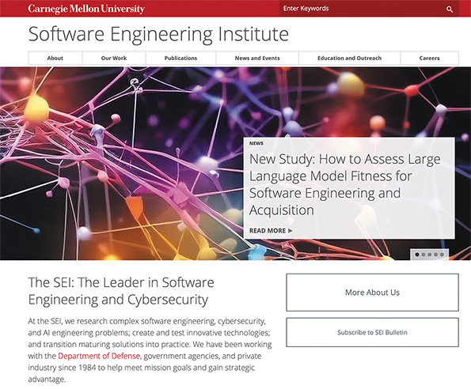

To achieve this, SEI created the **Capability Maturity Model (CMM)**, which thousands of organizations worldwide have adopted. CMM improves software quality, reduces development time, and cuts costs. The five maturity levels of the model are shown in Figure 11-2.

After updates to the original CMM, SEI introduced the **Capability Maturity Model Integration (CMMI)**, a unified framework that `evaluates` software and systems development using five maturity stages—from **Level 1 (chaotic, reactive)** to **Level 5 (optimized, continuously improving)**.

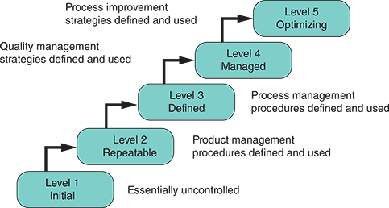

---

**CMMI Maturity Levels and Proof Artifacts**

| Level | Name        | Description                                                                 | Typical Proof Artifacts (Evidence)                          |
|-------|-------------|-----------------------------------------------------------------------------|-------------------------------------------------------------|
| 1     | Initial     | Processes are ad hoc, chaotic, success depends on individuals.              | Few/no formal artifacts; inconsistent project records.       |
| 2     | Repeatable  | Basic project management practices are established and repeatable.          | Project plans, schedules, requirements lists, change logs.   |
| 3     | Defined     | Processes are standardized across the organization.                        | Organization-wide process documentation, templates, training records. |
| 4     | Managed     | Processes are measured and controlled using quantitative metrics.           | Metrics dashboards, quality reports, statistical analysis, defect tracking. |
| 5     | Optimizing  | Continuous process improvement is institutionalized.                       | Improvement plans, lessons-learned reports, innovation logs, feedback systems. |

---

**✅ Notes (Study-Ready)**

Software engineering is not “just coding.” It is an **engineering discipline** that treats software as a long-term, evolving system rather than a disposable product. It depends on three pillars:

* **People:** developers, analysts, testers, designers, users
* **Processes:** methodologies like Agile, Waterfall, DevOps, CMMI
* **Technology:** tools, frameworks, languages, platforms

The SDLC becomes predictable when these three elements are coordinated instead of acting independently.

The five technical activity areas define the full software life cycle. Requirements → Design → Construction → Testing → Maintenance. Missing any one of these leads to expensive rework later.

Nontechnical tasks — cost estimation, project management, and process optimization — are just as important.` Without accurate cost estimates or realistic timelines, even a technically excellent system can fail.`

SEI’s work, especially CMM and later CMMI, provides a **maturity roadmap**. Organizations at Level 1 operate chaotically; Level 3 and above show consistency, repeatable results, documentation discipline, and process quality. Level 5 organizations continually improve and optimize.

CMM/CMMI is fundamentally about **process maturity**, not coding skill. Mature processes → better outcomes.

---

✅ **Corporate-Friendly Explanation (Plain English)**

Software engineering is how companies build software in a predictable, disciplined way instead of improvising and hoping things work out. It ensures that teams follow a consistent process from planning through maintenance.

Businesses rely on software for almost everything, so they need reliable methods, good tools, and well-trained people. Software engineering ties all three together.

The SEI at Carnegie Mellon created CMM and CMMI to help organizations measure how mature their development process is. A company at Level 1 is disorganized and reactive. A company at Level 5 is consistent, efficient, and always improving. Higher maturity levels translate to lower costs, fewer failures, and faster delivery.

---

✅ **Systems Analyst Professional Interpretation**

A systems analyst must understand software engineering deeply because analysts are often responsible for:

* Ensuring requirements translate into actionable design
* Reviewing architecture choices for long-term sustainability
* Supporting cost estimation and project planning
* Verifying that processes follow standards (SEI, CMMI, ISO, IEEE)
* Identifying when a project is operating at a low maturity level
* Advocating for repeatable, documented, and measurable development practices

CMMI is especially critical for analysts. It gives you a framework to evaluate:

* How predictable the development process is
* Where gaps exist
* Whether the organization’s engineering practices support quality outcomes

A mature process is not a luxury — it protects the system from failure, protects the business from cost overruns, and protects the analyst from chaotic development environments.

---

Whenever you're ready, send **11.1.2 Systems Engineering** and I’ll follow the same format.

**Nav:** ⬅️ [Prev: 11.1](#111-quality-assurance) · ➡️ [Next: 11.1.2 Systems Engineering](#1112-systems-engineering) · [Back to TOC](#table-of-contents)

---

 
 
 
 
 

### **11.1.2 Systems Engineering**

 

**Systems Engineering as a Holistic Discipline 🌐**

Systems engineering is an interdisciplinary field that `extends beyond the scope of software engineering` to encompass various components of a comprehensive system, including hardware, networks, and user interfaces. This approach is crucial in ensuring that all aspects of a system work harmoniously to achieve the desired outcome. By integrating these diverse elements, systems engineering addresses the complexities and interdependencies inherent in modern technological systems. It focuses on the software and other critical components like physical `hardware` and `network` infrastructure, which are essential for the system’s overall functionality and performance.

---

**Role of INCOSE & IEEE in Systems Engineering 🏛️**

Trade organizations such as the `International Council on Systems Engineering (INCOSE)` and the `IEEE Systems Council` play a pivotal role in shaping the field of systems engineering. These organizations are instrumental in setting **best practices**, **providing guidance on ethical considerations**, and **fostering the development of new methodologies and technologies**. They offer a platform for professionals to share knowledge, collaborate on research, and stay abreast of emerging trends in systems engineering. Their contributions are vital in ensuring that the field `evolves in response` to the rapid technological advancements and changing requirements of modern systems.

---

**Why Analysts Need a Systems Mindset 🧠**

As illustrated in Figure 11-3, systems analysts benefit significantly from adopting a holistic problem-solving approach,` especially in large-scale projects`. This approach involves considering all facets of a system, from `technical` specifications to `user` experience, and requires a broad perspective beyond traditional software development. 

By embracing a systems engineering mindset, analysts can better understand the interplay between various system components and their impact on the project. This comprehensive perspective is essential for `identifying potential issues, optimizing system performance, and ensuring that the final product meets both technical and end-user needs`. It highlights the importance of a well-rounded approach in tackling complex systems analysis and design challenges.

---

📊 **ASCII Figure 11–3 (Conceptual)**

**Figure 11-3**

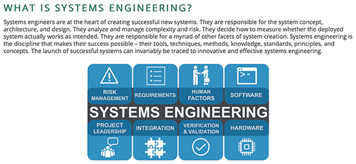

---

✅ **Notes (Study-Ready)**

Systems engineering expands the scope of engineering beyond software alone. It treats the system as a **complete ecosystem**: _hardware_, _network infrastructure_, _interfaces_, _constraints_, _risks_, and _user behavior_ all interact.

The discipline exists because modern systems don’t stand alone. Software depends on hardware. Hardware depends on networking. Networking depends on security policies. User interfaces depend on human behavior. Everything influences everything.

Systems engineering’s goal is to manage **complexity** and **interdependencies** so the system functions as one unified whole.

Best practices come from groups like **INCOSE** and **IEEE Systems Council**, which create `standards`, `ethical guidelines`, `methodologies`, and re`search pathways`. These organizations keep the profession aligned as technology evolves.

For analysts, systems engineering matters because analysts must think about the **entire system**, **_not just the software_**. When analysts adopt a systems mindset, they can:

* Spot cross-component conflicts early
* Understand how decisions ripple across the system
* Anticipate performance, integration, and usability issues
* Assess whether the final product will work for both technical and human needs

This holistic approach is essential for large, integrated systems.

---

✅ **Corporate-Friendly Explanation (Plain English)**

Systems engineering is about making sure all parts of a system — hardware, software, networks, and user interfaces — work together smoothly. Companies rely on more than just code; they rely on the entire environment that supports it. Systems engineering keeps everything aligned and functioning properly.

Organizations like INCOSE and IEEE help the industry by defining standards, ethical guidelines, and recommended practices. They keep professionals informed and ensure systems are built the right way.

For a business, a systems engineering approach reduces risk, avoids costly integration problems, and ensures the final system supports both the company's goals and the user's needs.

---

✅ **Systems Analyst Professional Interpretation**

For analysts, systems engineering provides the **lens through which complex systems make sense**. Analysts must:

* Understand software **and** the hardware and networks it runs on
* Evaluate how components interact instead of treating them in isolation
* Anticipate integration risks across the entire architecture
* Factor in usability, human behavior, and operational constraints
* Apply standards from INCOSE, IEEE, and similar bodies to guide decisions

A systems engineering mindset transforms an analyst from “requirements gatherer” into “system architect assistant,” meaning you understand how the entire environment behaves. This thinking is crucial in large-scale systems where a decision in one component can affect performance, security, maintainability, and user experience.

---

Whenever you're ready, send **11.1.3 International Organization for Standardization** and I’ll continue with the exact same structure.

 

**Nav:** ⬅️ [Prev: 11.1.1](#1111-software-engineering) · ➡️ [Next: 11.1.3 International Organization for Standardization](#1113-international-organization-for-standardization) · [Back to TOC](#table-of-contents)

---

 
 
 
 
 

### **11.1.3 International Organization for Standardization**

---
 

**ISO as a Global Standard for Quality and Consistency 🌍**

Automobiles, water, and software might seem unrelated at first glance, but they share a common thread: all are subject to standards set by the `International Organization for Standardization (ISO)`. This connection highlights the vast range of products and services governed by ISO standards to ensure `quality`, `safety`, and `efficiency`.
 These standards extend beyond physical products into management practices and operational processes. ISO standards serve as a global benchmark for excellence, providing universally recognized symbols (see Figure 11-4), the ISBN numbering system used for this textbook, and countless other specifications that create a unified global understanding.

---

**ISO’s Software Standards and the Rise of ISO 90003 💻**

The importance of software in business success has led many organizations to seek formal assurances of software quality. In response, ISO introduced **ISO/IEC/IEEE 90003:2018**, which applies the principles of **ISO 9001:2015** to computer software. ISO 9001:2015 is the global standard for **quality management systems**, emphasizing:

* customer satisfaction
* process consistency
* regulatory compliance
* continuous improvement

ISO 90003 adapts these principles to the realities of software development and software lifecycle management.

---

**ISO for Procurement and In-House Development 🤝**

For companies acquiring software or building software internally, ISO standards provide a **strategic quality assurance baseline**. Organizations `integrate ISO requirements into procurement documents` so vendors must meet clear benchmarks. Teams building software in-house also benefit—they follow a structured approach aligned with `international expectations, improving reliability, maintainability, and user trust`.

---

**ISO’s Requirements for Development Plans and Documentation 📑**

ISO software standards are known for their meticulous nature. A core requirement is a **detailed development plan** that explains how user `requirements` will be converted into a working system. ISO demands:

* phase-by-phase planning
* thorough documentation
* formal testing procedures
* test result archives
* mandatory correction and retesting of defects

This level of rigor creates accountability, transparency, and predictable quality outcomes.

---

**How ISO Elevates Software Quality and Transparency 🔒**

ISO standards strengthen the entire software development pipeline. Through structured `planning`, rigorous `documentation`, and strict `testing` requirements, ISO drives higher `transparency and control`. The result:

* consistent product quality
* improved customer satisfaction
* compliance with regulations
* continuous improvement across development teams

ISO embodies the philosophy that **quality is engineered, not accidental**.

---

📦 **Figure 11-4 — ISO Icon Examples**

These symbols represent typical ISO-recognized signage (parking, transport, assistance, etc.).
Here is a simplified ASCII representation for your notes:

---

✅ **Notes (Study-Ready)**

ISO is the **global backbone of quality** across industries. It defines how products, services, and processes should be built and assessed. In IT, _ISO ensures that software is not created “by feel”_ but follows **measured**, *repeatable*, and **globally** recognized practices.

ISO 90003 extends ISO 9001 quality management principles into the software domain. It focuses on consistent `processes`, `traceability`, `customer satisfaction`,` regulatory compliance`, and `continuous improvement`.
Instead of checking quality at the end, ISO requires:

* a formal development plan
* explicit mapping of requirements to product features
* rigorous testing protocols and documentation
* mandatory corrective action processes

**Organizations** use ISO standards during procurement to enforce quality expectations. **Vendors** must meet them, ensuring consistency and reliability. Internal t**eams benefit from the same structure, making software development more predictable.

ISO's ultimate value is **transparency + control**.
When processes are documented, monitored, and repeatable, software becomes easier to maintain, inspect, audit, and evolve.

---

✅ **Corporate-Friendly Explanation (Plain English)**

ISO is a global organization that creates rules to ensure products and services are safe, reliable, and consistent. Cars, food, medical supplies, manufacturing processes — even the symbols on airport signs — follow ISO standards.

Software isn’t an exception. ISO 90003 gives companies a framework to make sure the software they build or buy is high-quality. It sets expectations for planning, documentation, testing, and improvement.

For a business, using ISO standards means:

* fewer defects
* more predictable delivery
* clearer communication with vendors
* better customer satisfaction

ISO acts like a “quality blueprint” for organizations to follow.

---

✅ **Systems Analyst Professional Interpretation**

A systems analyst must understand ISO because it directly affects:

* requirements quality
* documentation expectations
* audit readiness
* procurement language
* process consistency
* cross-team communication

ISO 90003 gives analysts a **template for how professional-grade software development should operate**. It dictates:

* how requirements should be captured
* how development phases should be documented
* how testing records should be stored
* how defects should be corrected and revalidated

When analysts leverage ISO standards, they create systems that are:

* maintainable
* traceable
* predictable
* compliant
* auditable

This strengthens the entire lifecycle, establishes professional rigor, and reduces risk for the business.

---

**Nav:** ⬅️ [Prev: 11.1.2](#1112-systems-engineering) · ➡️ [Next: 11.2 Application Development](#112-application-development) · [Back to TOC](#table-of-contents)

---

 
 
 
 
 

## **11.2 Application Development**

 

**Building and Managing the System’s Codebase 🧩**

Application development, the process of building programs and code modules for information systems, incorporates structured analysis, object-oriented (O-O) analysis, and agile methods as popular development strategies. These strategies aim to convert designs into functional programs and code modules. This task becomes increasingly complex with the addition of hundreds or thousands of modules in even modest-sized projects. Managing this complexity and controlling schedules and budgets are critical, necessitating effective project management. As users and managers anticipate deploying the new system, they must meet schedules, control costs, and ensure quality. Thus, as previously discussed, employing project management tools and techniques is essential for the systems analyst or project manager to successfully monitor and steer the development process toward achieving project goals efficiently.

---

**Notes (Study-Ready)**

Application development takes the design blueprint and turns it into real software. Structured analysis, object-oriented analysis, and agile methods are the three common strategies, and each provides a disciplined way of breaking the design into modules and building them in a controlled, predictable manner.

Even small systems can contain hundreds or thousands of components. This creates integration challenges, dependencies, versioning issues, and coordination overhead. Without strong project management, the entire development effort can drift off schedule, exceed budget, or fail to meet quality expectations.

Project management becomes the guiding mechanism for the analyst. Tools such as task tracking, timelines, risk logs, velocity charts, and dependency planning help maintain control. They also ensure the development phase stays aligned with deadlines, budgets, and stakeholder expectations.

The key idea:
**Application development is where design becomes reality — and it must be managed carefully to avoid chaos.**

---

**Corporate-Friendly Explanation**

This section explains how an organization turns system designs into actual working software. Developers use different methods—structured, object-oriented, or agile—to organize the work.

Because modern systems are complicated and contain many pieces, it’s very easy for projects to slip behind schedule or run over budget. Project management techniques help teams stay organized and make sure the work is completed correctly, on time, and within budget.

---

**Systems Analyst Interpretation**

For the analyst, this is the execution phase. Your responsibilities include:

* ensuring developers understand and follow the design
* monitoring progress using PM tools
* keeping modules consistent with the architecture
* identifying risks tied to complexity
* aligning development activity with stakeholder expectations

This is where your design decisions are implemented, so your oversight ensures the project stays controlled, coordinated, and aligned with business goals.

---

**Nav:** ⬅️ [Prev: 11.1.3](#1113-international-organization-for-standardization) · ➡️ [Next: 11.2.1 Design Translation Strategies](#1121-design-translation-strategies) · [Back to TOC](#table-of-contents)

---

 
 
 
 
 

### **11.2.1 Design Translation Strategies**

**Bridging Design and Implementation 🛠️📐**

Design translation strategies serve as a critical bridge between the conceptual design of an information system and its practical implementation. This process involves converting the abstract representations and models created during the analysis phase—whether through structured analysis, O-O analysis, or agile methodologies—into tangible program and code modules. The focus is identifying the most effective strategies to ensure the theoretical designs align with the system’s functional requirements. These strategies encompass a range of practices, from determining the appropriate programming languages and frameworks that best realize the design’s intent to mapping out design patterns that ensure code modularity and reusability. By carefully selecting and applying these strategies, developers can translate complex designs into efficient, maintainable, scalable software architectures.

---

**Preserving Design Integrity During Development 🔒✨**

Emphasis is placed on maintaining the integrity of the design throughout the development process. This involves rigorous adherence to the design specifications detailed in the initial phases, ensuring that the final software product accurately reflects the planned architecture and functionalities. Techniques such as code reviews, pair programming, and continuous integration play significant roles in this context, helping to identify deviations from the design early and facilitating corrective actions. Moreover, these strategies advocate for a collaborative approach to development, where designers and developers work closely to navigate the challenges of translating design concepts into code, ensuring that the system’s vision and practicality are preserved.

---

**Adapting to Change Through Agile Translation Strategies 🔄⚡**

The design translation strategy must be adaptable and responsive to change. In the dynamic landscape of software development, requirements can evolve and new constraints may emerge. Agile methodologies in particular provide a framework for incorporating changes while keeping sight of the original design goals. Through iterative development cycles and constant feedback loops, these strategies support a flexible approach to design translation, allowing teams to refine and adjust their code in response to new information or shifting project objectives. This adaptability ensures that the development process remains aligned with stakeholders’ needs and the technological landscape, ultimately creating robust and effective information systems.

---

**Notes (Study-Ready)**

Design translation is the crucial step that turns conceptual system designs into actual code. This requires selecting the correct programming languages, frameworks, design patterns, and architectural structures so the final system matches the intended behavior described in the design documents.

Maintaining design integrity is essential. Practices such as code reviews, continuous integration, and pair programming help teams detect deviations early and ensure that developers build what architects intended. Collaboration between designers and developers prevents misinterpretation and maintains structural consistency.

A strong design translation strategy must also account for change. Agile methodologies support iterative adjustments without losing sight of the system’s core architecture. By refining design and code continuously, teams ensure the software remains aligned with evolving requirements while staying consistent with the original design objectives.

The core goal is to **preserve architecture, ensure maintainability, and adapt intelligently**, producing robust, scalable software.

---

**Corporate-Friendly Explanation**

Design translation is the step where a business’s system design becomes real software. Teams use specific languages, frameworks, and patterns to ensure the final product matches the intended plan.

To maintain quality, developers follow the design closely and use tools like code reviews and continuous integration to catch mistakes early. Designers and developers must work together so expectations and implementation stay aligned.

Because business needs change, the development process must be flexible. Agile methods help teams update the design without losing control of the system’s direction.

---

**Systems Analyst Interpretation**

For analysts, design translation is where architectural decisions live or die. Analysts must:

* ensure developers understand the design’s intent
* confirm selected tools and patterns match system goals
* monitor for deviations through reviews and CI tools
* facilitate communication between designers and developers
* support agile adaptation while preserving architectural integrity

This phase is where analysts protect the system’s structure, ensure build quality, and maintain alignment between requirements, design, and code. It is one of the most strategic responsibilities in the SDLC.

**Nav:** ⬅️ [Prev: 11.2](#112-application-development) · ➡️ [Next: 11.2.2 Application Development Tasks](#1122-application-development-tasks) · [Back to TOC](#table-of-contents)

---

 
 
 
 
 

### **11.2.2 Application Development Tasks**

 

**🧩➡️💻Translating Designs with Structured, O-O, or Agile Approaches**

Translating system designs into functional applications is effectively achieved through `traditional structured or O-O methodologies`. These approaches provide developers with a systematic framework for turning detailed design diagrams and specifications `into executable code`. As a result, the final application closely mirrors the intended architecture and functionalities _outlined during the design phase_, ensuring that the system meets its original objectives and requirements.

---

**🔄👥Agile Translation Through Iteration and Customer Feedback**

In contrast, opting for an agile development methodology shifts the focus toward project `planning`, `foundational groundwork`, and `team assembly`, emphasizing the importance of `continuous customer feedback` and `engagement`. This adaptability is central to the agile approach, fostering an environment where project goals and customer needs can evolve and ensuring the final product remains relevant and directly aligned with user expectations. Through this iterative process, `agile methodologies enable a dynamic development cycle` that is more **flexible** and **responsive**, allowing for continuous refinement of project scope and deliverables.

---

**🏗️🧱🧪Traditional Methods: Planning, Modular Development, Testing**

Constructing a new system is a process that demands meticulous planning and a strategic approach. Initially, an overarching strategy must be established to guide the development process. This strategy sets the stage for the subsequent `design`, `coding`, `testing`, and `documentation` of individual modules within the system. Modules of related program code are organized into small, manageable units to facilitate ease of understanding and maintenance. This modular approach simplifies the development process and enhances the system’s `maintainability`. Once these modules have been individually developed and tested, further testing is conducted on the system.

As shown in Figure 11-5, this comprehensive testing phase is complemented by the thorough documentation of the entire system, **_ensuring that every aspect of the system’s operation and maintenance is clearly understood and well-recorded_**.

`Figure 11-5`

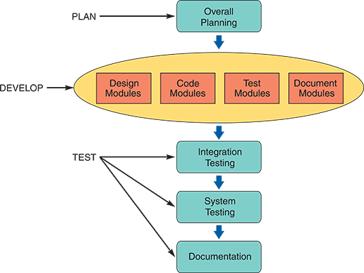

---

**Designing Modules from SDLC Documentation 📄📘**

The creation of program modules, whether through structured or O-O methodologies, commences with a review of the requirements documentation generated in earlier phases of the SDLC. This review process leads to the formulation of a detailed set of program designs that serve as a `blueprint` for development. The existence of a documentation file, initiated early in the development cycle and `meticulously updated`, becomes an invaluable asset at this stage.

Central to this repository is the **system design specification**, supported by:

* diagrams
* source documents
* screen layouts
* report designs
* data dictionary entries
* user feedback

Using a `CASE` tool across analysis and design phases gives analysts a full picture of the system’s architecture and reduces effort across all documentation tasks.

---

**Coding & Testing with Analyst–Programmer Collaboration 🤝💻**

With program designs in place, the `focus shifts to coding and testing`. Programmers write the code, but IT managers often assign systems analysts to work closely alongside them. This **collaboration** ensures:

* better interpretation of requirements
* fewer integration issues
* constant architectural alignment
* consistent quality checks

This phase transforms theoretical designs into a functioning, reliable system ready for deployment.

---

**Agile Methods: Iterative, Incremental, and Customer-Driven 🔁🚀**

Adopting an agile approach significantly `enhances interaction and cooperation` between the `IT team and end users or customers`, establishing a dynamic environment where continuous feedback is encouraged and fundamental to the development process.

Agile projects rely on **iterative and incremental cycles**, such as **Extreme Programming (XP)** (see Figure 11-6). XP encourages rapid development, short release cycles, continuous testing, and ongoing user involvement. These practices result in flexible teams capable of adjusting quickly and delivering working software frequently.

---
`
**ASCII Figure 11-6 — Simplified Extreme Programming (XP) Model**

**Figure 11-6**

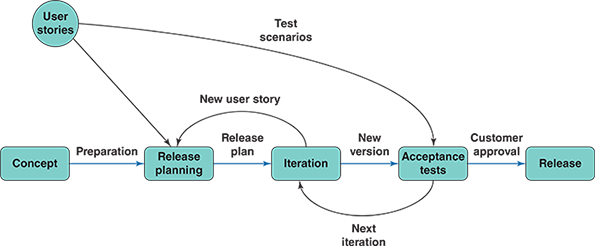

 

**Notes (Study-Ready)**

This section contrasts **traditional** vs. **agile** development tasks.

Traditional structured and O-O methods translate the design into modules, then move through:

1. **Planning**
2. **Design + coding + testing modules**
3. **Integration testing**
4. **System testing**
5. **Documentation**

This method emphasizes predictability, detailed planning, and traceable deliverables. It depends heavily on complete SDLC documentation and early blueprinting.

Agile development flips this: instead of rigid planning, it relies on **constant customer interaction**, **short iterations**, and **continuous adjustments**. Agile emphasizes:

* evolving requirements
* quick feedback
* frequent working software releases
* flexibility

Analysts and programmers collaborate intensely under both models, but agile increases the involvement of users and compresses the planning-design-code-test cycle into continuous loops.

The key idea:
**Traditional = structured and predictable**
**Agile = flexible and customer-responsive**

Both translate designs into working software but differ in workflow and philosophy.

---

**Corporate-Friendly Explanation**

Traditional and agile methods take two very different approaches to turning designs into software.

Traditional methods follow a step-by-step plan: design everything, build everything, test everything. It’s predictable, controlled, and documentation-heavy.

Agile methods focus on quick cycles with constant user feedback. Instead of building everything at once, the team builds small pieces, tests them immediately, and adjusts based on customer input.

Each method has strengths. Traditional is stable and predictable; agile is flexible and responsive.

---

**Systems Analyst Interpretation**

For analysts, development tasks vary significantly depending on methodology:

* Under **traditional methods**, the analyst ensures modules match the design, documentation is complete, and integration follows architectural rules.
* Under **agile**, the analyst works closely with the customer and development team, refining user stories, adjusting plans each iteration, and ensuring feedback loops drive development.

Analysts must be comfortable in both worlds. Traditional requires precision and planning; agile requires adaptability, collaboration, and rapid decision-making.

🧩 **Expanded Comparison Table: Traditional vs Agile (Application Development Tasks)**

| **Category**                  | **Traditional (Structured / O-O)**                                                | **Agile (XP, Iterative Models)**                                                  |
| ----------------------------- | --------------------------------------------------------------------------------- | --------------------------------------------------------------------------------- |
| **Primary Focus**             | Follow the design blueprint precisely; create modules that match the architecture | Deliver working software quickly, refine continuously with user feedback          |
| **Workflow Structure**        | Linear: Plan → Design → Code → Test → Document                                    | Cyclical: Plan → Design → Code → Test → Review → Repeat                           |
| **Design Approach**           | Heavy upfront design; detailed specifications before coding                       | Minimal upfront design; design evolves through iterations                         |
| **Module Development**        | Modules built individually from fixed requirements                                | Features built incrementally from user stories                                    |
| **Testing Approach**          | Testing mainly after module completion; integration/system testing late           | Continuous testing every iteration, early acceptance testing                      |
| **Documentation Style**       | Formal, comprehensive, created early and updated methodically                     | Lightweight, updated as the system evolves                                        |
| **Customer/User Involvement** | Low; mostly at requirements and final acceptance                                  | High; frequent involvement in reviews, demos, and feedback loops                  |
| **Flexibility to Change**     | Low — change requires redesign or replanning                                      | Very high — change is expected and built into every cycle                         |
| **Team Structure**            | Role-separated: Analysts → Designers → Programmers                                | Cross-functional; everyone collaborates continuously                              |
| **Risk Handling**             | Risks surface late (integration or system testing)                                | Risks surface early due to constant builds and tests                              |
| **Deliverables**              | One major deliverable after full completion                                       | Many small deliverables; usable software every iteration                          |
| **Role of Analyst**           | Ensure design adherence, documentation accuracy, architectural compliance         | Manage user stories, prioritize requirements, adjust scope iteration-to-iteration |
| **Best Used For**             | Stable requirements, large systems, regulatory environments                       | Fast-moving environments, evolving requirements, ongoing customer input           |
| **Overall Strength**          | Predictable, structured, excellent traceability                                   | Flexible, user-centered, rapid value delivery                                     |
| **Overall Weakness**          | Slow to adapt; late detection of errors                                           | Requires high communication and discipline; risk of scope drift                   |
| **Typical Industries**        | Government, manufacturing, aerospace, finance                                     | Startups, SaaS, e-commerce, creative digital products                             |
| **Who Makes Decisions?**      | Project manager + design authority                                                | Team + product owner + customers collaboratively                                  |
| **When It Fails**             | When requirements change frequently                                               | When stakeholders are unavailable or feedback is inconsistent                     |

🏢 **Real-World Examples: When to Use Traditional vs Agile and Why**

| **Method**                         | **Real-World Example**                                                                    | **Why It Fits**                                                                                                                                                                                  |
| ---------------------------------- | ----------------------------------------------------------------------------------------- | ------------------------------------------------------------------------------------------------------------------------------------------------------------------------------------------------ |
| **Traditional (Structured / O-O)** | **Building an air-traffic control system for an airport**                                 | Safety-critical, must meet strict regulatory requirements; changes are costly; system must match detailed specifications exactly. Predictability, documentation, and traceability are essential. |
|                                    | **Developing software for banking transactions (ACH, wire transfers)**                    | Financial compliance standards require heavy documentation, auditing, and fixed requirements. Traditional models ensure consistency and reduce risk of catastrophic errors.                      |
|                                    | **Hospital electronic health records (EHR)**                                              | Requirements must be stable; strict HIPAA compliance; poor design choices could compromise patient safety. Traditional models enforce rigor.                                                     |
| **Agile (XP, Iterative Models)**   | **Creating a mobile app for customer engagement (e.g., fitness app, retail loyalty app)** | Requirements change rapidly based on user behavior; customer feedback drives features; agile ensures fast releases and adaptation.                                                               |
|                                    | **Developing a SaaS dashboard for business analytics**                                    | Stakeholders refine needs every iteration; new metrics, UI improvements, and features appear weekly. Agile supports continuous enhancement.                                                      |
|                                    | **Building a startup MVP (minimum viable product)**                                       | Speed to market matters; scope is flexible; failure is acceptable if it produces learning. Agile accelerates experimentation and discovery.                                                      |

---

**Nav:** ⬅️ [Prev: 11.2.1](#1121-design-translation-strategies) · ➡️ [Next: 11.2.3 Systems Development Tools](#1123-systems-development-tools) · [Back to TOC](#table-of-contents)

---

 
 
 
 
 

### **11.2.3 Systems Development Tools**

## **Different Tools for Different Methodologies 🧰📐**

Different systems development methodologies leverage distinct tools that align with their `specific processes and objectives`, illustrating the diverse approaches to software creation. 

**Structured** development, for instance, utilizes DFDs and structure charts to visually represent data processes and the architecture of systems, providing a clear, top-down view of system interaction. 

In contrast, **O-O methods** employ a range of `UML diagrams`, such as use case diagrams to define system interactions, `class diagrams` to model system classes and their relationships, `sequence diagrams` for depicting object interactions over time, and `state transition diagrams` to describe state changes in response to events. Agile methodologies, noted for their flexibility and responsiveness to change, often incorporate spiral or other iterative models that emphasize continuous feedback and incremental development, enabling rapid adaptation to new requirements or changes in project scope.

---

**General-Purpose Tools for Modeling System Logic 🧠📊**

Beyond the specific tools associated with each development methodology, system `developers have access to a suite of multipurpose tools designed to abstract and clarify system logic across various stages of development`. These tools are indispensable for translating complex system designs into functional program modules. `Entity-relationship diagrams (ERDs)` are widely used to model the data and relationships within a system, `flowcharts` provide a straightforward method of outlining process flows and decision points, `pseudocode` offers a high-level description of an algorithm in a format close to that of human-readable languages, `decision tables` present a concise way to represent complex decision logic, and decision trees visualize the branching paths and outcomes of different decision scenarios. 

These generic tools serve as fundamental building blocks in the developer’s toolkit and are applicable across different methodologies for their ability to simplify and clarify the development process.

---

**Choosing the Right Tool to Strengthen the SDLC 🏗️⚙️**

Using various tools tailored to specific methodologies or serving more general purposes is crucial for effectively managing the SDLC. Developers can create well-designed and effective systems by leveraging the strengths of these tools. Structured and O-O methodologies emphasize thorough `planning` and `modeling` to `predict system behavior` and `structure`. On the other hand, agile methods focus on **_adaptability_** and **_continuous feedback from stakeholders_** to improve the system gradually. Regardless of the methodology, effective tool use helps turn conceptual designs into software that is robust, efficient, and user-focused.

---

**Entity-Relationship Diagrams: Mapping Data Structures 🔗📄**

During the **_data design phase_** of system development, `ERDs` play a pivotal role in illustrating the interactions between entities and objects within the system. These diagrams are invaluable across various development methodologies, providing a visual representation that facilitates a deeper understanding of the system’s data structure. ERDs clearly outline the different types of `relationships—one-to-one`, `one-to-many`, and `many-to-many`—crucial for accurately modeling how data elements interrelate. This visual tool is essential for developers and analysts to build a database structure that effectively aligns with the system’s functional requirements and supports its operations.

The proper use and integration of ERDs in the SDLC enable developers to `anticipate` and `strategically plan for data interactions and dependencies`. This foresight contributes to creating a more robust and coherent system architecture, ensuring the final application is efficient and scalable. ERDs help lay a solid foundation for application development by `meticulously mapping the relationships and interactions between data points`. As a result, the system developed is more aligned with user needs and business goals, facilitating smoother operations and enhanced performance.

---

**Flowcharts: Visualizing Process Logic 🔄📊**

As highlighted earlier, flowcharts are essential in software development, visually `mapping out program logic to simplify understanding a system’s structure`. A flowchart uses a combination of `symbols` and `arrows` **_to represent logical rules and interactions, breaking down complex processes into smaller, more digestible pieces_**. This ability to segment large systems into understandable subsystems and modules aids programmers in the coding process, making the task less daunting and more efficient. Flowcharts are particularly useful `for delineating process flows and critical decision points`, which help developers identify and address potential challenges early on.

The utility of flowcharts extends beyond the programming and development team. They are **_crucial during the initial design stages_**, offering a clear and understandable representation of system logic that is `accessible to both technical and nontechnical` stakeholders. This clarity benefits `planning` and `development`, `troubleshooting` issues, and `facilitating discussions` about system functionality and logic. By providing a common visual language, flowcharts ensure that everyone involved in the project, regardless of their technical expertise, can understand and contribute to the development process, promoting transparency and collaboration throughout the project’s life cycle.

---

**Pseudocode: Describing Logic in Structured English 📝📦**

Pseudocode is a powerful tool for `outlining program logic in a format that mirrors structured English`, making it accessible and easy to understand, as previously discussed in this text. By not being bound to the syntax of any specific programming language, pseudocode allows for the description of software modules in straightforward English. This approach `eliminates the complexities` associated with the stringent syntax rules of programming languages, providing a flexible means for systems analysts and programmers to convey the functionalities and logic of a program. It enables the drafting of algorithms and process flows in an understandable manner across the board, simplifying the transition to actual code in any programming language selected for the project.

Using pseudocode significantly `improves communication` within development teams, effectively bridging the gap between individuals with **_varying levels of technical expertise_**. This ensures that all team members understand the system’s intended functionalities. As a fundamental component of the software development process, pseudocode lays the _foundation for effective coding and system implementation_, streamlining the development workflow. It plays a pivotal role in making the initial stages of development more efficient, ultimately contributing to the successful realization of the system as envisioned.

**Figure 11-7**
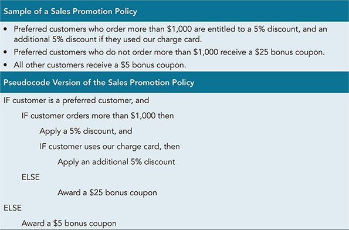

---

**Decision Tables & Decision Trees: Structuring Business Logic 🌳📋**

Earlier in the book, decision tables and decision trees were described as effective tools `for modeling an information system’s business logic`. These tools provide a structured approach for outlining complex decision-making processes, making them invaluable `for the initial design and development phases`. By breaking down business logic into precise, manageable components, decision tables and decision trees help ensure all potential scenarios are considered and appropriately addressed.

During the systems `development phase`, analysts and programmers can further utilize decision tables and decision trees to guide the creation of `code modules that embody these logical rules`. This application ensures that the software accurately reflects the intended business logic, facilitating a more direct translation of `business requirements into technical solutions`. By incorporating these tools into the workflow, developers can create more **reliable** information systems that closely align with organizational objectives and user needs.

**(Figure 11-8)**

---

**Notes (Study-Ready)**

Systems development tools fall into two categories:

**1. Methodology-specific tools:**

* Structured → DFDs, structure charts
* O-O → UML diagrams (use case, class, sequence, state)
* Agile → iterative models, spiral diagrams

**2. General-purpose logic tools:**

* ERDs
* Flowcharts
* Pseudocode
* Decision tables
* Decision trees

Each tool clarifies logic, architecture, or data flow. Tools shape how developers translate analysis and design into real software. ERDs define the data layer. Flowcharts and pseudocode break down logic and program flow. Decision tables and trees structure business rules so developers implement them correctly.

The big idea:
**Good tools = clearer systems + fewer errors + better maintainability.**

---

**Corporate-Friendly Explanation**

Different development methods use different tools. `Traditional` methods rely on **diagrams** that show structure and data flow. `Object-oriented` methods use **UML diagrams**. Agile uses **iterative planning tools** to support rapid feedback.

Across all methods, teams also use universal tools—ERDs, flowcharts, pseudocode, and decision tables—to describe how the system works. These tools help developers and nontechnical stakeholders understand the system and ensure the software is built correctly.

---

**Systems Analyst Interpretation**

Analysts choose, interpret, and often create these tools. They ensure:

* **ERDs** accurately represent data needs
* **UML** diagrams match system behavior
* **flowcharts** and **pseudocode** clarify logic
* business rules in **decision tables/trees** translate correctly into modules

Analysts use these tools to maintain clarity between what the business needs and what developers build. They minimize miscommunication, prevent defects, and ensure architectural consistency.

---

**Nav:** ⬅️ [Prev: 11.2.2](#1122-application-development-tasks) · ➡️ [Next: 11.3 Structured Development](#113-structured-development) · [Back to TOC](#table-of-contents)

---

 
 
 
 
 

## **11.3 Structured Development**

Structured application development involves a `top-down approach, transitioning from a broad design concept to a granular, detailed structure`. This process begins once the system’s requirements are thoroughly documented, enabling the systems analyst to decompose these requirements into smaller, manageable subsystems and modules through a technique known as **partitioning**. Comparable to constructing a hierarchical set of DFDs, this modular design strategy facilitates the division of the development workload, `allowing multiple programming teams` to work on different project areas concurrently.

---

**🗂️⏱️Project Management Support for Structured Development**

Project management software plays a crucial role in enhancing the efficiency and oversight of the software development process, as previously discussed. Equipped with sophisticated features, `this software enables project managers to monitor progress across individual modules closely`, guaranteeing alignment with the project timeline. It also provides tools for accurately `predicting` development timelines, `assessing` the required human and technical resources, and `identifying` the project’s critical path. Such capabilities help ensure that development efforts remain on schedule and resources are allocated most effectively.

---

**🔗🏗️Ensuring System Integration and Architectural Cohesion**

To ensure the cohesive functioning of all modules within the final system, `systems analysts must engage in meticulous planning and continuous collaboration with programmers and IT management`. This collaborative effort is essential for crafting a coherent and well-integrated system architecture. Analysts are tasked with `incorporating integration capabilities` into each module’s design and conducting rigorous **testing** to verify these integration points. This careful attention to detail and integration ensures the system operates seamlessly as a unified whole, meeting the project’s objectives and requirements.

---

**Notes (Study-Ready)**

Structured development uses a **top-down** process: start with the big system concept, then break it into subsystems, then modules. This decomposition (partitioning) makes the system easier to understand, build, maintain, and assign across teams. It mirrors structured DFD modeling: broad → medium → detailed.

Project management tools support this approach by tracking module completion, predicting timelines, and identifying the critical path. Structured development depends heavily on predictable scheduling, so PM software is essential.

Integration is the biggest challenge in structured development. Each module must fit the architecture, follow design rules, and integrate cleanly with others. Analysts plan integration points early, and testing validates that modules work as one system. The emphasis is “build independently, operate collectively.”

---

**Corporate-Friendly Explanation**

Structured development means building a system from the top down. You start with a big-picture design, then break it into smaller pieces so different teams can build different parts at the same time.

Project management tools help track each piece and keep the work on schedule. Because many teams work in parallel, `coordination is critical`.

Analysts make sure all pieces fit together correctly and verify that the final system works smoothly as a whole.

---

**Systems Analyst Interpretation**

For analysts, structured development requires:

* breaking requirements into logical subsystems and modules
* ensuring each module aligns with the architecture
* coordinating multiple development teams
* planning integration early
* validating integration points with rigorous testing
* monitoring module timelines with PM tools
* ensuring system cohesion across independently developed parts

`Analysts function like architects and coordinators`. They maintain the integrity of the system while ensuring that parallel development efforts produce modules that integrate cleanly and meet project requirements.

---

**Nav:** ⬅️ [Prev: 11.2.3](#1123-systems-development-tools) · ➡️ [Next: 11.3.1 Structure Charts](#1131-structure-charts) · [Back to TOC](#table-of-contents)

---

 
 
 
 
 

### **11.3.1 Structure Charts**

**🧱🔗Structure Charts: Modules and Their Relationships **

Structure charts `show the program modules and the relationships among them`. A structure chart consists of `rectangles` representing the program modules, with `arrows` and other symbols providing additional information. Typically, a higher-level module, called a **control module**, directs lower-level modules, called s**ubordinate modules**. In a structure chart, symbols represent various actions or conditions. Structure chart symbols represent modules, data couples, control couples, conditions, and loops.

---

**Modules (Structure Chart Rectangles) 📦**

As shown in Figure 11-9, a rectangle represents a module. In the lower-right part of the figure, vertical lines at the edges of the rectangle indicate that module 1.3 is a library module. A library module is reusable code and can be invoked from more than one point in the chart.

**Figure 11-9**: An example of structure chart modules.

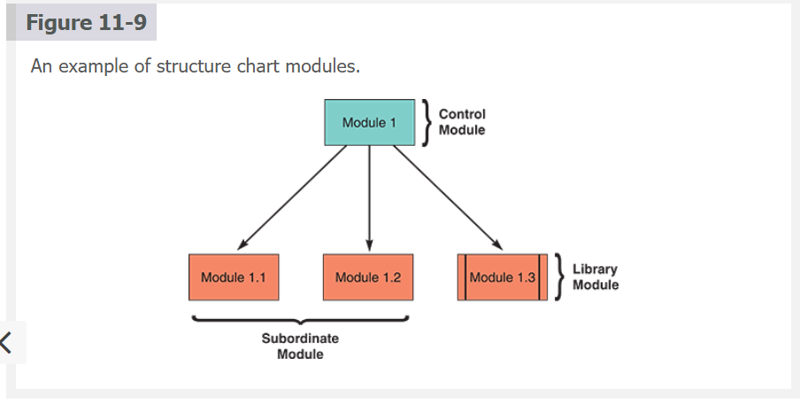

---

**Data Couples (Passing Data Between Modules) 🔄📨**

An arrow with an empty circle represents a data couple. A **data couple** shows data that one module passes to another. In the data couple example shown in Figure 11-10, the Look Up Customer Name module exchanges data with the Maintain Customer Data module.

**(Figure 11-10 )**: An example of a structure chart data couple

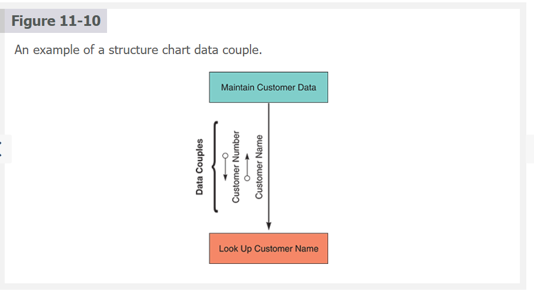

---

**Control Couples (Passing Status Flags) 🚦📤**

An `arrow with a filled circle represents a control couple`. A control couple `shows a status flag message`, which one module sends to another. In the example shown in Figure 11-11, the Update Customer File module sends an Account Overdue flag back to the Maintain Customer Data module. A module uses a flag to signal a specific condition or action to another module.

**(Figure 11-11)**
**An example of a structure chart control couple**

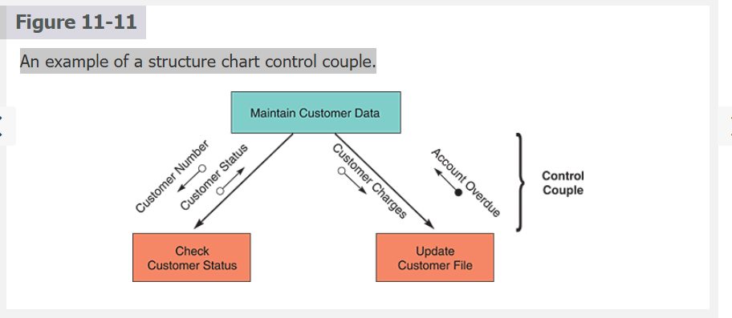

---

**Conditions (Decision-Based Module Invocation) ♦️➡️**

A `line with a diamond on` one end represents a condition. A condition line indicates that a control module determines which subordinate modules will be invoked depending on a specific condition. In the example shown in Figure 11-12, Sort Inventory Parts is a control module with a condition line that triggers one of the three subordinate modules.

**(Figure 11-12)**: The diagram shows a control module that triggers three subordinate modules

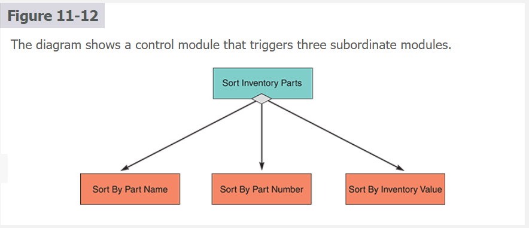

---

**Loops (Repeating Module Execution) 🔁📘**

A curved arrow represents a loop. A loop indicates `that one or more modules are repeated`. In the example shown in Figure 11-13, the Get Student Grades and Calculate GPA modules are repeated.

**(Figure 11-13)**: The diagram shows a structure chart loop with two repeating modules

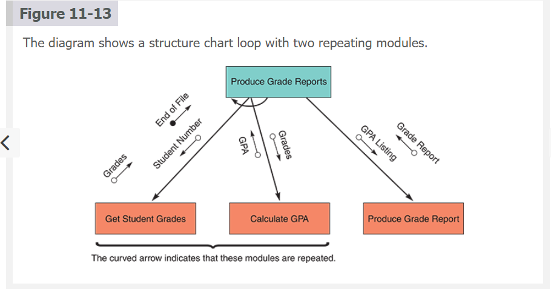

---

**Notes (Study-Ready)**

Structure charts represent program modules and the relationships among them. They enforce hierarchical thinking, helping analysts translate top-down design into clearly defined modules that interact predictably. These charts clarify which modules control others, how information flows between components, and where decision or looping logic influences execution.

Bullets are used only when they serve clarity, such as identifying symbol types:

- modules (rectangles)

- data couples (arrow + empty circle)

- control couples (arrow + filled circle)

- conditions (line + diamond)

- loops (curved arrow)

These are quick identifiers — the conceptual explanation stays in paragraph form.

Structure charts matter because they prevent ambiguity in modular design, support cleaner integration planning, and give analysts and programmers a shared visual blueprint. They help ensure that independently developed modules later fit together cleanly during integration and testing.

**Why Structure Charts Matter**

* Enforce **top-down design**
* Support **modular programming**
* Make integration planning easier
* Provide a **visual blueprint** before coding
* Reduce ambiguity in module relationships
* Help analysts coordinate multiple programming teams
* Make testing more targeted (module, integration, control-flow)

Structure charts remain one of the clearest ways to document hierarchical program logic in structured and hybrid methodologies.

---

**Corporate-Friendly Explanation**

Structure charts are diagrams that show how a system’s functions fit together. Each box represents a function or module, and arrows show how data or status moves between them.

This helps teams understand:

* which parts of the system control others
* what information flows between modules
* where decisions and repeated actions occur

Businesses value structure charts because they reduce errors, improve clarity, and make large software systems easier to understand, manage, and maintain.

---

**Systems Analyst Interpretation**

For analysts, structure charts are critical tools for:

* defining module boundaries
* showing control flow across the architecture
* documenting data movement
* preparing integration plans
* coordinating development across multiple programmers
* identifying reusable modules (library modules)
* validating that system logic follows requirements

Analysts use structure charts to maintain architectural integrity, prevent integration failures, and ensure each module fulfills its intended purpose within the larger system.

---

**Nav:** ⬅️ [Prev: 11.3](#113-structured-development) · ➡️ [Next: 11.3.2 Cohesion and Coupling](#1132-cohesion-and-coupling) · [Back to TOC](#table-of-contents)

---

 
 
 
 
 

### **11.3.2 Cohesion and Coupling**

**🎯⚙️Cohesion and Coupling: Core Metrics for Design Quality**

`Cohesion` and `coupling` are crucial metrics for `assessing the quality of a system’s design`. The **_goal is to achieve highly cohesive and loosely coupled modules_**.

 **High cohesion** within a module signifies that its functions are closely related and focused, enhancing understandability and reducing complexity. In contrast, **loose coupling** between modules indicates minimal dependencies, promoting flexibility and ease of modification. When these conditions are met, the system becomes easier and less costly to maintain, as changes to one part of the system have minimal impact on others, significantly reducing the effort and risk associated with modifying the system’s structure.

---

**🔍📦Cohesion: Keeping a Module Focused on One Task**

**Cohesion** `measures a module’s scope and processing characteristics`. A module that performs **_a single function or task has a high degree of cohesion_**, which is desirable. Because it focuses on a single task, a cohesive module is much easier to code and reuse. For example, a Verify Customer Number module sounds more cohesive than a Calculate and Print Statements module. If the word `and` is found in a module name, it implies that more than one task is involved.

If a module must perform multiple tasks, more complex coding is required, and the module will be more challenging to create and maintain. To make a module more cohesive, `split it into separate units`, each with a **single function**. For example, cohesion is greatly improved by splitting the Check Customer Number and Credit Limit module in Figure 11-14 into two separate modules, `Check Customer Number` and `Check Customer Credit Limit`.

**(Figure 11-14)**: Two examples of cohesion. Notice that the single module on the left is less cohesive than the two on the right

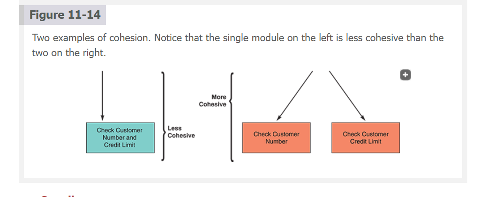

---

**Coupling: Minimizing Interdependence Between Modules 🔗🧩**

Coupling describes the degree of interdependence among modules. Independent modules are loosely coupled, which is desirable. `Loosely coupled modules are easier to maintain and modify because the logic in one module does not affect other modules`. If a programmer needs to update a loosely coupled module, they can accomplish the task in a _single location_. If modules are tightly coupled, one module is linked to internal logic contained in another module.
 For example, Module A might refer to an internal variable in Module B. In that case, a logic error in Module B will affect the processing in Module A. _For that reason, passing a status flag down as a message from a control module is generally regarded as poor design_. It is better to have subordinate modules handle processing tasks as independently as possible to avoid a cascade effect of logic errors in the control module.

In Figure 11-15, the tightly coupled example on the left shows that the subordinate module Calculate Current Charges depends on a status flag sent down from the control module Update Customer Balance. It would be preferable to have the modules loosely coupled and logically independent. A status flag on the right in the example is unnecessary because the subordinate module Apply Discount handles discount processing independently. Any logic errors are confined to a **single location**: the ` Apply Discount ` module.

**(Figure 11-15)**: An example of tightly coupled and loosely coupled structure charts

---

**Notes (Study-Ready)**

Cohesion and coupling are the two structural qualities that determine how clean, maintainable, and reliable a system’s architecture will be. Cohesion focuses on what happens **inside** a module; coupling focuses on how modules **interact** with each other. High cohesion means the module has one purpose and performs a single task well, making it easier to understand, test, reuse, and modify. When module names include “and,” it often signals more than one responsibility and therefore low cohesion.

* **High cohesion = clarity + simplicity + easier debugging.**
* **Low cohesion = bloated modules, harder maintenance, unclear responsibilities.**

Coupling represents dependency strength between modules. The weaker the dependency, the safer and more flexible the system. `Loosely coupled modules isolate problems and reduce side-effects—one module’s changes won’t break unrelated parts of the system`. Tightly coupled modules create a **_ripple effect_** where small changes cause widespread issues.

* **Loose coupling = safer changes + isolated errors + better modularity.**
* **Tight coupling = fragile architecture + hidden dependencies + higher risk.**

Ideally, systems have **high cohesion + loose coupling**, the combination that leads to better maintainability, easier testing, and smoother long-term development.

---

**Corporate-Friendly Explanation**

Cohesion and coupling describe how well your software components are organized. A cohesive module handles one specific task—making it easier to understand and maintain. Low cohesion means a module is trying to do too much.

Coupling describes how much modules depend on each other. When modules are loosely linked, the system is flexible and changes are safe. When modules depend too heavily on each other, modifying one part can unintentionally break another.

Companies prefer systems with high cohesion and loose coupling because they lower maintenance costs and reduce unexpected failures.

---

**Systems Analyst Interpretation**

For analysts, `cohesion and coupling are architectural guardrails`. Analysts must review designs and module plans to ensure each module has a single clear purpose and that modules communicate in a controlled and minimal way. 

`High cohesion supports clean requirements mapping`; `loose coupling improves integration, testing, and scalability.`

Analysts enforce these qualities by:

* spotting multi-responsibility modules early
* preventing cross-module variable access
* discouraging unnecessary status flag passing
* designing modules that operate independently
* ensuring changes won’t propagate through the architecture

Cohesion and coupling are not coding details—they’re structural decisions that shape the stability of the entire system.

---

**Nav:** ⬅️ [Prev: 11.3.1](#1131-structure-charts) · ➡️ [Next: 11.3.3 Drawing a Structure Chart](#1133-drawing-a-structure-chart) · [Back to TOC](#table-of-contents)

---

 
 
 
 
 

### **11.3.3 Drawing a Structure Chart**

**🧱📊Drawing a Structure Chart**

When employing a structured analysis method during system design, `structure charts are derived from the DFDs developed in the data and process modeling stages`. Creating a structure chart involves three key steps: `1. reviewing the DFDs` to pinpoint processes and methods, `2. identifying` program modules and determining their control and subordinate relationships, and `3. incorporating` symbols to represent data flows, control flows, and loops.
 After their development, these structure charts undergo a thorough analysis to verify their `alignment with the system documentation`. This ensures that the visual representations accurately reflect the intended system architecture and functionality.

---

**Review the DFDs 🔍📄**

The **initial phase** in advancing system design involves thoroughly reviewing all DFDs to ensure their accuracy and completeness, _especially considering that modifications might have been made since the systems analysis phase_.
 This scrutiny is crucial for verifying that the DFDs accurately represent the current understanding of the system’s processes and data flows, laying a solid foundation for subsequent design work. Additionally, suppose object models were developed alongside or after DFDs. In that case, these models require a detailed examination to pinpoint the `specific objects` within the system, the `functions or methods each object is responsible for`, and `how these objects interact`, ensuring a comprehensive understanding of the system’s object-oriented aspects.

Understanding methods in the context of object models is pivotal; each `method`, akin to a functional primitive in structured analysis, `encapsulates a sequence of actions or operations that an object can perform`, necessitating precise coding to implement the necessary actions. This step highlights the functionalities that must be implemented and emphasizes the importance of delineating clear relationships and interactions among objects to facilitate a coherent and functional system architecture. This **detailed analysis aids in bridging the conceptual gap between system analysis artifacts**, such as `DFDs` and `object models`, and the` practical requirements of system design`, setting the stage for effectively translating these abstract models into executable code and tangible system components.

---

**🧩🏗️Identify Modules and Relationships **

Starting with the **logical model**, the transition from functional primitives or object methods to program modules forms the crux of system design. This process involves a detailed analysis of DFDs, where **_each level of a DFD signifies a distinct processing level within the system_**. The progression from the overarching context diagram down to more detailed, lower-level diagrams facilitates identifying `control` and subordinate `modules`, guiding developers until they pinpoint the functional primitives. This `hierarchical approach ensures a systematic and comprehensive transition from abstract system processes to concrete program modules`. Additionally, to enhance module cohesion, processes identified in the `DFDs can be further decomposed into smaller, more focused modules that manage a singular task`, simplifying the overall system structure and improving manageability.

The relationship between DFD levels and the structure of program modules is visually depicted in **structure charts**, such as the one illustrated in `Figure 11-16`, which is based on the order system discussed earlier in the book. This **`three-level structure`** chart mirrors the three DFD levels, offering a clear and organized representation of how system processes are compartmentalized into program modules. Such structure charts `help developers visualize the system’s architecture and understand how each module fits the overall design`. By clearly delineating the connections between different levels of DFDs and the corresponding structure chart, developers can ensure that the software architecture is logical and aligned with the system’s intended functionalities, facilitating a smoother development process.

**(Insert Figure 11-16 here)**: A structure chart based on the order system DFDs from a previous chapter in the book. The three-level structure chart relates to the three DFD levels.

---

**Add Couples, Loops, and Conditions 🔄🔗♦️**

Next, `couples`, `loops`, and `conditions` are added to the structure chart. If DFDs are used, the `data flows and dictionary` can be reviewed to identify the data elements that pass from one module to another. In addition to the **data couples**, **control couples** are added where a module sends a control parameter, or flag, to another module. **Loops** and condition lines that indicate repetitive or alternative processing steps are also added to the diagram as needed. If an object model is developed, the class and object relationship diagrams can be reviewed to ensure the interaction among the objects is fully understood.

At this point, the structure chart is ready for careful analysis. Each process, data element, or object method should be checked to ensure that the chart reflects all previous documentation and that the logic is correct. `All modules should be strongly cohesive and loosely coupled`. **_Often, several versions of the chart must be drawn. Some CASE tools can help analyze the chart and identify problem areas._**

---

**Notes (Study-Ready)**

Structure charts are built directly from earlier analysis artifacts — primarily DFDs and object models — and **_serve as the first concrete representation of how the system will be organized into modules_**. The process begins with a thorough review of DFDs to ensure the logic and flows are still accurate after any changes made during analysis. Object models, when present, refine this view by introducing classes, methods, and interactions that imply specific module responsibilities.

The heart of drawing a structure chart lies in mapping functional primitives or object methods to program modules. DFD levels translate naturally into hierarchy: the context diagram points to the top-level control module, Level-1 diagrams reveal subordinate modules, and Level-2 diagrams expose the detailed functional primitives. Structure charts preserve the modularity, hierarchy, and data exchanges defined in the DFDs, while also refining cohesion by splitting large processes into cleaner, single-task modules.

* Couples (data/control), loops, and conditions are added to represent communication, repetition, and branching.
* These symbols give structure charts their expressive power and ensure each module’s role, dependencies, and behavior are fully understood before coding begins.

A fully analyzed structure chart must reflect strong cohesion and loose coupling. Analysts often iterate through multiple drafts, verifying that modules match documented processes, data definitions, and object behaviors. CASE tools accelerate validation by highlighting missing data paths, inconsistent logic, or flawed module relationships.

---

**Corporate-Friendly Explanation**

This section explains how teams turn earlier system analysis deliverables into a clear visual map of how the software will be structured. Developers start by reviewing the diagrams created during analysis to make sure everything is up to date. Then they identify program modules, determine how they relate to each other, and add symbols showing data flow, decisions, and repeated actions.

The final result is a diagram that shows exactly how the system will be organized, which parts of the system depend on each other, and what logic connects everything. This makes development smoother and reduces misunderstandings between teams.

---

**Systems Analyst Interpretation**

For analysts, this step is the bridge between analysis and technical implementation. Analysts must:

* validate DFDs and object models before design translation
* identify modules that match functional primitives or object methods
* ensure module hierarchy mirrors logical DFD hierarchy
* refine cohesion by breaking complex processes into single-task modules
* manage coupling by defining clean data flows and avoiding unnecessary control signals
* ensure loops, decisions, and flows are accurate before coding starts

The goal is to deliver a structure chart that is unambiguous, logically consistent, and aligned with all previous documentation—setting developers up for a smooth coding phase and a stable system architecture.

---

**Nav:** ⬅️ [Prev: 11.3.2](#1132-cohesion-and-coupling) · ➡️ [Next: 11.4 Object-Oriented Development](#114-object-oriented-development) · [Back to TOC](#table-of-contents)

---

 
 
 
 
 

## **11.4 Object-Oriented Development**

**Object-Oriented Development (OOD): Direct Translation from Models to Code 🧱➡️🧠**

`O-O` methods were introduced earlier in the book. O-O analysis simplifies the direct translation of an object model into `an O-O programming language`, a process known as `object-oriented development (OOD)`. The earlier discussion underscored the **efficiency** of O-O analysis in bridging the gap between conceptual models and their practical implementation in software development. By adopting O-O methods, developers can utilize the conceptual framework provided by object models to directly inform the structure and logic of their code, significantly simplifying the development process.

---

**How OOD Differs from Structured Design Despite Shared Principles 🧬🔍**

Though OOD and structured design share foundational principles, such as **modularity** and **abstraction**, OOD distinguishes itself through its unique approach to system development. These differences highlight the distinct advantages of using O-O methodology, including improved system flexibility and the ability to model complex, real-world scenarios. The emphasis on objects as the cornerstone of analysis, design, and implementation introduces a paradigm that `mirrors real-world interactions and relationships` more closely than traditional structured design approaches.

---

**Seamless Transition from Analysis to Implementation 🪄💻**

The transition from system analysis to implementation is _streamlined with OOD_, leveraging the inherent alignment between O-O analysis models and the programming constructs of O-O languages. This congruence allows for an intuitive development workflow, where the design decisions made during the analysis phase directly apply to coding. By `leveraging the natural alignment between analysis models and programming constructs`, OOD enables a more efficient and effective path from concept to functional software, underscoring its value in modern software development.

---

**Notes (Study-Ready)**

Object-oriented development takes the object models created during analysis and turns them directly into software components. Unlike structured development, which requires mapping DFDs to modules, OOD lets developers build classes, objects, and methods that already exist conceptually in the analysis artifacts. This reduces translation errors and keeps design and implementation naturally aligned.

OOD keeps modularity and abstraction but strengthens them with characteristics like encapsulation (keeping internal details hidden), inheritance (reusing shared behaviors), and polymorphism (flexible behavior based on context). These features make OOD better suited for modeling real-world systems that evolve or have complex relationships.

Because O-O languages match the structure of O-O analysis artifacts, the handoff into coding becomes smoother. Developers don’t rebuild the design—they **instantiate it**. This alignment accelerates development, reduces miscommunication, and strengthens consistency between documentation and code.

---

**Corporate-Friendly Explanation**

Object-oriented development lets teams build software by using models that already represent the real-world objects and interactions. Instead of translating diagrams into separate program modules manually, developers create classes and methods that match the models exactly.

This makes development faster, clearer, and more accurate. It also results in systems that are easier to update and expand because the design naturally mirrors how things work in the real world.

---

**Systems Analyst Interpretation**

For analysts, OOD reduces translation friction between analysis and implementation. Analysts define classes, attributes, and methods during analysis, and developers reuse these definitions directly in the code. The analyst’s architecture maps cleanly into the codebase.

Analysts benefit from:

* strong alignment between models and code
* reduced ambiguity in handoffs
* natural support for maintainable and extensible systems
* expressive models that resemble real-world structures

OOD supports iterative refinement and long-term scalability, reinforcing good architectural discipline throughout the SDLC.

---

**Nav:** ⬅️ [Prev: 11.3.3](#1133-drawing-a-structure-chart) · ➡️ [Next: 11.4.1 Characteristics of OO Development](#1141-characteristics-of-object-oriented-development) · [Back to TOC](#table-of-contents)

---

 
 
 
 
 

### **11.4.1 Characteristics of Object-Oriented Development**

**Characteristics of Object-Oriented Development (OOD) 🧬🧱**

When implementing a structured design, a _structure chart_ is used to describe the interaction between program modules, as explained earlier. In `OOD, the emphasis is on defining the interactions between objects early in the analysis process, which then informs the overall structure of the application`. **_The object model represents the application’s structure_**. This departs from structured design, where structure charts are used **after** analysis to outline program module interactions.

Objects in OOD encapsulate data and behaviors (**methods**) organized into classes based on shared characteristics, facilitating a modular and reusable codebase. `Class` diagrams like the one shown in `Figure 11-17` play a crucial role in illustrating the relationships and interactions among these classes, serving as a blueprint for the system’s architecture.
 For instance, a `Customer` class with attributes like `Number`, `Name`, and `Address` as well as methods for managing orders and payments demonstrates how objects can `interact` within the system, such as exchanging messages with an Order class. These diagrams, alongside object relationship diagrams, provide a visual representation of the system, aiding developers in understanding and implementing complex relationships and functionalities. `Figure 11-18` shows an object relationship diagram for a fitness center, illustrating the objects and their interactions to perform business functions and transactions.

**(Figure 11-17)**: A class diagram for a simplified customer order processing system

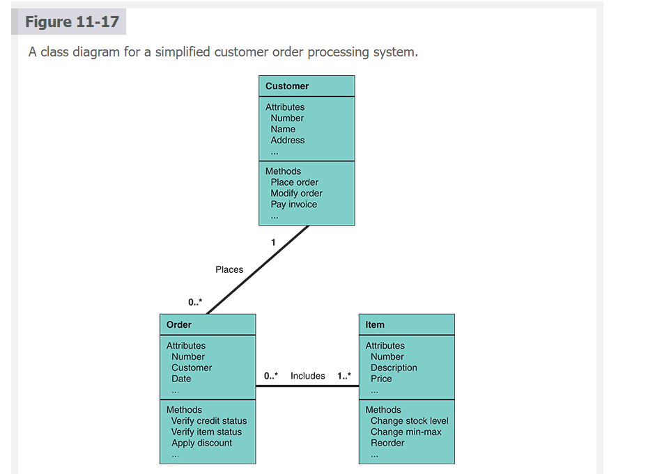

**(Figure 11-18)**: An object relationship diagram for a fitness center.

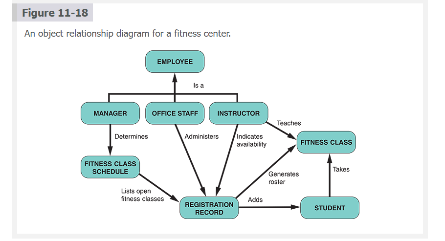

However, the transition to OOD is challenging. Organizations often have unrealistic expectations and need more time to learn about, prepare for, and implement the OOD process. For example, 

"_no one would build a bridge without an analysis of needs, supporting data, and a detailed blueprint—and the bridge would not be opened for traffic until it had been carefully inspected and checked to ensure that all specifications were met_". 

O-O software developers sometimes forget that the basic rules of architecture also apply to their projects.

---

**Notes (Study-Ready)**

OOD emphasizes defining object interactions during analysis so the system's structure emerges naturally from its object model. This contrasts with structured methods where the design emerges later via structure charts. In OOD, classes represent reusable, modular building blocks. Their attributes define data, and their methods define behavior—providing a clean way to encapsulate functionality.

Relationships in OOD are captured through class diagrams and object relationship diagrams. These diagrams reveal associations, dependencies, and message flows between classes, helping developers understand responsibilities and interactions. Because these diagrams map directly into O-O programming constructs (classes, objects, methods), they serve as both design and implementation guides.

* **Class diagrams** clarify attributes, methods, and relationships.
* **Object relationship diagrams** show how system actors collaborate to perform business processes.

Despite the benefits, organizations often underestimate the learning curve. OOD still requires discipline, planning, and adherence to architectural rigor. It’s not a shortcut—it's a paradigm shift that requires solid analysis, strong modeling skills, and consistency from design to implementation.

---

**Corporate-Friendly Explanation**

Object-oriented development builds software around objects—structures that contain both data and behavior. During analysis, teams define how these objects interact, and this becomes the foundation of the system’s design. Class diagrams help visualize these objects and their relationships, making the system easier to understand and build.

However, implementing OOD isn’t automatic. It requires `training`, proper `planning`, and `realistic expectations`. Organizations that skip analysis or architectural discipline often run into trouble, just like cutting corners on a construction project.

---

**Systems Analyst Interpretation**

Analysts drive OOD by defining classes, their attributes, their methods, and their relationships during analysis. These definitions directly inform how developers code the system. Analysts must ensure:

* class responsibilities are well-defined
* interactions between objects are realistic and necessary
* diagrams accurately reflect business processes
* inheritance and encapsulation are used appropriately
* architectural discipline is maintained from analysis through coding

OOD streamlines implementation because the design maps cleanly to the code, but only when the modeling foundation is solid. Analysts safeguard that foundation.

---

**Nav:** ⬅️ [Prev: 11.4](#114-object-oriented-development) · ➡️ [Next: 11.4.2 Implementation of OO Designs](#1142-implementation-of-object-oriented-designs) · [Back to TOC](#table-of-contents)

---

 
 
 
 
 

### **11.4.2 Implementation of OO Designs**

 

**Implementation of Object-Oriented Designs (OOD) 🧬💻**

When programmers translate an O-O design into an application, they analyze the `classes`, `attributes`, `methods`, and `messages` documented in the object model. During this process, the programmer makes necessary revisions and updates to class, sequence, state transition, and activity diagrams. These diagrams were discussed in a previous chapter.

The role of a programmer in O-O software development is multifaceted and crucial. Their primary goal is `to transform the methods defined for each object in the system into executable program code modules`. This process involves thoroughly understanding how each module will be `activated` or `triggered`, typically in response to `specific events or messages`. To achieve this, programmers closely analyze sequence diagrams and state transition diagrams. These diagrams are instrumental, as they visually **_represent the sequence of events and messages that cause changes in an object’s state_**. By studying these diagrams, programmers can accurately determine the **interactions** and **dependencies** between different modules, which is essential for writing effective and efficient code. This understanding is critical in ensuring that each part of the program responds appropriately to the events or messages it receives.

The programming of O-O applications is inherently event-driven, a paradigm where the flow of the program is determined by events such as `user actions`, `sensor outputs`, or `message passing`. Each `event`, transaction, or message in the system triggers a corresponding action within the software, creating a dynamic and responsive application. To facilitate this process, programmers often start by drafting the steps of the program in **pseudocode**. Alternatively, or in conjunction, they might employ CASE tools and code generators. These` advanced tools can generate O-O code directly from the object model`, streamlining the development process. By using these methodologies and tools, programmers can efficiently translate the theoretical models and diagrams into functional, robust code that adheres to the principles of O-O design and effectively respond to the various events and interactions within the application.

---

**Notes (Study-Ready)**

Implementation in OOD is `a direct translation pipeline`: object models → refined diagrams → executable code. Programmers begin by revisiting class diagrams, sequence diagrams, state transition diagrams, and activity diagrams — these artifacts define `attributes`, `behaviors`, `lifecycles`, and `collaborations` between **objects**. The implementation phase is not simply coding; it’s a `verification exercise` ensuring that the diagrams, messages, and object responsibilities truly map to workable software components.

Sequence diagrams clarify **message order**, helping programmers understand what triggers each method call. State diagrams outline how objects **change state** in response to events. This ensures logic stays consistent with system expectations. Because OOD systems are event-driven, nearly everything is a reaction: user click → method call, sensor input → state change, message sent → object response. Implementation must respect this architecture.

Programmers rely heavily on `pseudocode` to sketch out the logic before coding. CASE tools bridge design and implementation by generating class templates or even complete frameworks from the object model. This reduces `translation errors` and `accelerates development`. Ultimately, good OOD implementation ensures objects behave as designed, respond appropriately to events, and maintain cohesion while minimizing `coupling` — the foundational principles of object-oriented architecture.

[CASE tools worth mentioning](CASETools.md)

---

**Corporate-Friendly Explanation**

Object-oriented systems are built by turning analysis diagrams into real working code. Programmers study these diagrams to understand how each object should `behave`, what `data it holds`, and how it `reacts` to events. The software becomes `event-driven` — it responds to user actions, system messages, and internal signals.

Tools like `pseudocode` and `automated code generators` help programmers convert the design into functioning software *faster* and more *accurately*. This makes development smoother and ensures the final product matches the original design and business requirements.

---

**Systems Analyst Interpretation**

For analysts, OOD implementation requires ensuring design artifacts are `accurate`, `complete`, and `structured` enough that developers can translate them into code without **ambiguity**. Sequence and state diagrams must clearly define:

* how objects `communicate`
* what events `trigger` which behaviors
* how object states `evolve`
* what `dependencies` exist between modules

Analysts safeguard cohesion by ensuring each class has a single, clear responsibility. They `ensure loose coupling` by designing interactions around messages rather than shared internal logic. Analysts also `validate that the event-driven design` aligns with real business workflows.

During implementation, analysts act as the link between conceptual models and code, ensuring development adheres to architectural intent and the system behaves as modeled.

---

**Nav:** ⬅️ [Prev: 11.4.1](#1141-characteristics-of-object-oriented-development) · ➡️ [Next: 11.4.3 Object-Oriented Cohesion and Coupling](#1143-object-oriented-cohesion-and-coupling) · [Back to TOC](#table-of-contents)

---

 
 
 
 
 

### **11.4.3 Object-Oriented Cohesion and Coupling**

**Object-Oriented Cohesion and Coupling 🔗🧬**

The concepts of cohesion and coupling hold significant importance in O-O application development. `Classes` should be `as loosely coupled as possible for effective design`, meaning they should operate **independently**. 

Furthermore, the `methods` within an object are expected to be `highly cohesive`, ensuring that they execute **closely related actions**. Adhering to these principles not only simplifies the understanding of classes and objects but also `facilitates their modification`, enhancing the overall maintainability of the system.

O-O programmers must recognize the importance of cohesion and coupling in their code structure. Ignoring these critical design concepts `can create a tangled web of code, making the system increasingly difficult to manage`. A lack of attention to maintaining loose coupling and high cohesion `can result in an intricately interwoven codebase that is challenging to decipher`, posing significant hurdles for future development and maintenance efforts.

The consequences of neglecting cohesion and coupling principles in O-O development are far-reaching. Code that lacks these characteristics tends to be scattered across various parts of the application, complicating the process of making `edits` or `updates`. Such disorganization can make the codebase `challenging to navigate and expensive to modify`, as identifying and implementing changes becomes a `cumbersome and time-consuming task`. Ensuring that classes and methods adhere to the ideals of being loosely coupled and highly cohesive is therefore essential for creating a **maintainable**, **efficient**, and **scalable** O-O application.

---

**Notes (Study-Ready)**

In O-O development, **_"cohesion and coupling determine how well your classes express their responsibilities and how safely they interact with others"_**.

 `High cohesion inside a class means its methods revolve around one task or purpose`. This clarity leads to simpler, reusable, and testable classes. `Loose coupling means classes rely on each other only through clear, minimal interfaces`**never** by digging into each other's internals. Loose coupling helps objects evolve independently without causing ripple effects across the codebase.

When cohesion and coupling are **ignored**, the architecture deteriorates quickly. 
- Classes start performing _unrelated tasks_
- _methods scatter_ across the system,
- _hidden dependencies_ form. 
  
  The code becomes fragile—changing `one part breaks another`, `debugging takes longer`, and onboarding `new developers` becomes a headache. Maintaining such a system becomes slow and expensive because the logic has no clear boundaries.

In a well-designed O-O system, classes communicate through messages, encapsulate their own data, and expose only what’s necessary. `Adhering to high cohesion and loose coupling` **_ensures the system remains modular, maintainable, and resilient as the application grows_**.

---

**Corporate-Friendly Explanation**

This section explains that in object-oriented software, each class should focus on one clear responsibility, and classes should depend on each other as little as possible. When classes are focused and independent, systems are easier to update, fix, and expand. Systems that ignore these principles end up brittle and hard to maintain—every change risks breaking something unexpectedly.

Following cohesion and coupling guidelines makes the system easier to understand, cheaper to maintain, and more flexible for future growth.

---

**Systems Analyst Interpretation**

For analysts, cohesion and coupling define the structural quality of the system before a single line of code is written. Analysts ensure that:

* each class in the object model has one clear responsibility (high cohesion)
* associations between classes are meaningful, minimal, and intentional (loose coupling)
* sequence and state diagrams avoid unnecessary cross-class dependencies
* encapsulation is respected across the model

Poor cohesion or tight coupling revealed in modeling is an architectural warning sign. Analysts must resolve these issues early—before coding—because fixing coupling/ cohesion problems in the implementation phase is far more costly. Designing for strong cohesion and loose coupling ensures PARS (or any system) scales safely, adapts to changes, and remains stable through future versions.

---

**Nav:** ⬅️ [Prev: 11.4.2](#1142-implementation-of-object-oriented-designs) · ➡️ [Next: 11.5 Agile Development](#115-agile-development) · [Back to TOC](#table-of-contents)

---

## **11.5 Agile Development**

 **Agile Development ⚡🔄**

As stated at the beginning of the book, agile development is a distinctly different systems development `method`. It shares many steps with traditional development but uses a `highly iterative process`. The development team constantly communicates with the primary user, who is called the `customer`, shaping and forming the system to match the customer’s specifications. Agile development is aptly named because `it is based on a quick and nimble development process that easily adapts to change`. Agile development focuses on small teams, intense communication, and rapid development iterations. The four key values of agile software development are shown in Figure 11-19.

 **Figure 11-19**: The original manifesto for agile software development.

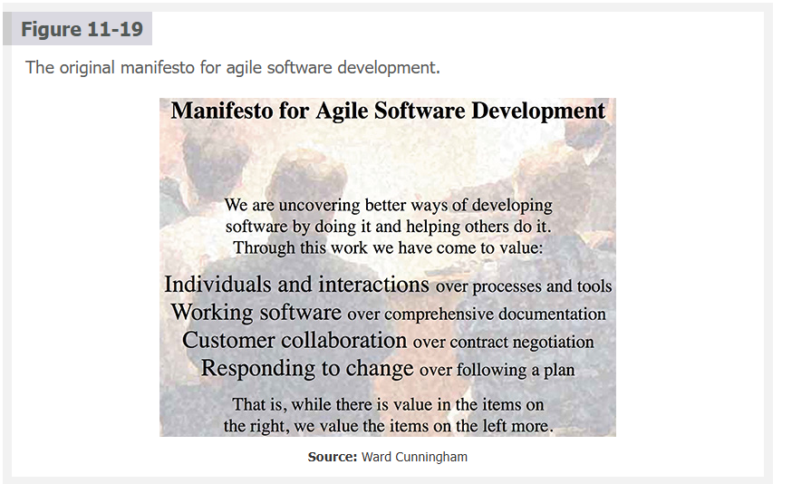

Programmers can use popular agile-friendly languages like Python, Ruby, and Perl. However, agile methods do not require a specific programming language; programmers also use O-O languages such as `Java, C++, and C#`.

As with traditional methodologies, agile development has both `positive` and `negative` characteristics. Today, agile methodology is very popular for software projects. Its supporters boast that `it speeds up software development` and `delivers precisely what the customer wants`, when the customer wants it, while fostering teamwork and empowering employees. However, there are drawbacks to this adaptive (rather than predictive) method. 

Critics of agile development often claim that because it focuses on quick iterations and fast releases, `it lacks discipline` and produces systems of `questionable quality`. In addition, agile methodology generally does not work as well for larger projects because of their complexity and the `lack of focus` on a well-defined product.

Before implementing agile development, the proposed system and development methods should be scrutinized. As experienced IT professionals know, a one-size-fits-all solution does not exist. For more information on agile methods, refer to the discussion of systems development methods earlier in the book.

---

 **Notes (Study-Ready)**

Agile development is an iterative, customer-centric alternative to traditional predictive SDLC approaches. The system is shaped continuously through direct collaboration with the customer, giving teams the agility to pivot as requirements evolve. Rapid iterations (sprints) produce working software early and often, tightening feedback loops and exposing problems sooner.

Agile values emphasize people, conversation, working features, and adaptability over rigid processes, documentation, or long-term predictive planning. Languages like Python, Ruby, and Perl became popular because they allow developers to prototype quickly, but agile itself is language-agnostic—Java, C++, and C# work just as well.

Agile’s strengths—speed, flexibility, empowerment, continuous improvement—make it ideal for small to mid-size projects where requirements evolve. But agile can break down in large, high-complexity systems that demand upfront architecture, strict documentation, and predictable outcomes. Critics argue that without discipline, agile teams risk trading speed for structural quality.

Choosing agile depends on context. Analysts must evaluate project size, risk, clarity of requirements, team maturity, and stakeholder engagement before adopting the method.

---

 **Corporate-Friendly Explanation**

Agile development is a flexible way of building software where the team works closely with the customer and delivers small pieces of working software quickly. Instead of creating huge plans upfront, the team adapts to change as the project evolves. This approach shortens feedback cycles and helps ensure the client receives exactly what they need.

Agile works well for smaller teams and fast-moving projects. The downsides appear in larger systems: without strong discipline, agile projects can suffer from quality issues, frequent rework, or drifting scope. Companies should evaluate whether the project’s size and complexity support an agile approach before committing to it.

---

 **Systems Analyst Interpretation**

Analysts in an agile environment play a guiding role rather than a predictive one. They ensure requirements emerge through iteration, customer conversations, and rapid feedback. Instead of producing massive specifications upfront, analysts focus on:

* refining user stories
* prioritizing backlog items
* mapping business value to development increments
* validating each iteration’s alignment with business goals

Analysts also identify when agile is **not** appropriate—usually when the project requires:

* strict compliance
* extensive architectural planning
* high-risk integration
* predictable timelines

The analyst must help stakeholders decide whether agile fits the project, ensuring the method aligns with organizational constraints and system complexity.

---

If you'd like, I can also create:

 **✔ A table comparing Agile vs Traditional SDLC (chapter-aligned)**
 **✔ A diagram of the Agile lifecycle in the style of textbook figures**
 **✔ A PARS example rewritten as Agile user stories**

.

 **Nav:** ⬅️ [Prev: 11.4.3](#1143-object-oriented-cohesion-and-coupling) · ➡️ [Next: 11.5.1 Extreme Programming](#1151-extreme-programming) · [Back to TOC](#table-of-contents)

---

 
 
 
 
 

### **11.5.1 Extreme Programming**

**Extreme Programming (XP) ⚡👥💻**

XP is an agile development method. It is` an iterative approach`, as shown in Figure 11-20, where a team of users and developers immerse themselves in systems development. XP supporters emphasize `simplicity`, `communication`, `feedback`, `respect`, and `courage`. Success requires a solid commitment to the process, corporate support, and dedicated team members.

**Figure 11-20**: The five core values of Extreme Programming.

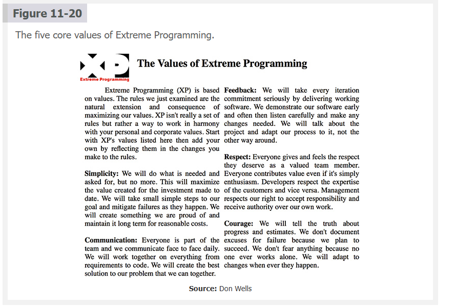

**Pair Programming**

XP uses a concept called **pair programming**. In pair programming, two programmers work on the same task on the same computer; one drives (**programs**) while the other navigates (**watches**). The onlooker examines the code strategically to see the forest, while the driver is concerned with the individual trees immediately in front of them. The two discuss their ideas continuously throughout the process.

Another important concept in XP is that `unit tests are designed before code is written`. This **test-driven development (TDD)** **_focuses on initial results and prevents programmers from straying from their goals_**. Because of the magnitude and intensity of the multicycle process, agile testing relies heavily on automated testing methods.

---

**Notes (Study-Ready)**

Extreme Programming deepens agile practices by emphasizing constant communication, rapid cycles, and disciplined coding habits. XP teams function as tightly integrated units where users and developers collaborate closely, shaping the system through repeated iterations. XP’s values—simplicity, communication, feedback, respect, and courage—anchor the method and define team culture. These values keep development lean, adaptable, and human-centered.

`Pair programming` reinforces collaboration and quality. One programmer writes code (the driver) while the other observes (the navigator), catching mistakes early and providing strategic guidance. This technique increases code quality, reduces defects, and spreads knowledge across the team. XP treats development as a conversational, shared responsibility.

`Test-driven development (TDD)` makes testing the foundation instead of an afterthought. Writing tests before coding defines expected behavior clearly and ensures developers don’t drift from requirements. Automated testing is essential because XP relies on continuous refactoring—rapidly improving code structure without breaking functionality. These short cycles of test → code → refactor make XP highly effective but demand discipline and strong team commitment.

---

**Corporate-Friendly Explanation**

Extreme Programming is an approach to software development where small teams work closely together and deliver updates rapidly. Two programmers often work side-by-side on the same task to improve accuracy and share knowledge. Tests are written before the code to clarify requirements and reduce errors. XP can help companies move quickly and maintain quality, but it requires committed teams and strong communication.

---

**Systems Analyst Interpretation**

For analysts, XP requires `clarity` and `conciseness`. User requirements must be broken into small, testable units—often expressed as user stories with acceptance tests. Analysts support pair programming by `ensuring the design is simple, modular, and easy to adjust during refactoring`. XP’s intense iteration means analysts `validate scope continuously`, ensuring the evolving solution aligns with business value.

Analysts also help maintain the rhythm of TDD, ensuring test cases reflect real business rules and that automated testing infrastructure supports rapid cycles. XP thrives when analysts, developers, and customers work as an integrated, communicative loop.

---

If you'd like, I can also generate:

* A **comparison table: XP vs Agile vs Scrum**
* XP-style **user stories and acceptance tests** for your PARS project
* A diagram showing the **XP iteration loop** similar to textbook style

**Nav:** ⬅️ [Prev: 11.5](#115-agile-development) · ➡️ [Next: 11.5.2 User Stories](#1152-user-stories) · [Back to TOC](#table-of-contents)

---

 
 
 
 
 

### **11.5.2 User Stories**

**User Stories 📝👥**

Suppose that a customer has requested a sales tracking system. Like any other development method, the `first step in an agile process would be to define the system requirements`. The customer begins by meeting with programmers and providing user stories. A **user story** is `a short, simple requirements definition`. Programmers review user stories to determine the project’s requirements, priorities, and scope. Here are three user story examples:

- **As the sales manager, I want to identify fast- or slow-moving items to manage our inventory more effectively.**

- **As a store manager, I need enough lead time to replenish my stock so I don’t run out of hot items.**

- **As a sales representative, I want to offer the best selection of fast-selling items and clear out the old stock that is not moving.**

User stories `do not deal with technical details` and are `so short` that they are often written on `index cards`. The customer prioritizes each user story `so the requirements can be ranked`. In addition, programmers assign a `score` to each user story that indicates the `estimated difficulty of implementation`. This information helps the team `form a plan and allocate its resources`. 

Projects are often composed of `many` user stories, which taken together form `epics`, from which programmers can estimate the `scope`, `time` `requirements`, and `project difficulty`. In addition to user stories, frequent face-to-face meetings with customers provide more detail as the project progresses.

---

**Notes (Study-Ready)**

User stories are agile’s minimalistic approach to requirements: small, focused descriptions of what users need the system to do, written from the user’s perspective. They avoid technical complexity and serve as conversation starters that define value, not implementation. Their simplicity allows customers and developers to speak the same language early in the project.

A user story always captures three elements:

* **who** the user is
* **what** they need
* **why** they need it

These stories drive planning by prioritizing the highest-value items first. Customers rank their importance, while programmers estimate effort, enabling teams to balance urgency against complexity. Related user stories form **epics**, which describe larger features or capabilities that require multiple iterations to complete. Agile teams rely heavily on continuous discussion, validating stories through frequent meetings to refine understanding as development progresses.

User stories shift the requirements process from static documentation to dynamic collaboration, ensuring evolving clarity and real-time alignment with business needs.

---

**Corporate-Friendly Explanation**

User stories capture a customer’s needs in simple, everyday language. Each story explains what a user wants and why, helping the development team understand priorities without focusing on technical details. Customers rank these needs, and developers estimate how difficult each one will be to build. This helps the team plan the work in manageable pieces and adjust as needs change.

---

**Systems Analyst Interpretation**

Analysts use `user stories to anchor requirements in business value`. They facilitate discussions to `clarify` goals, `identify` hidden assumptions, and `reveal` dependencies among features. Stories are refined into `acceptance criteria`, enabling clear definition of **“done**.” Analysts also track how individual stories roll up into epics and how epics shape the project scope.

By managing priorities, effort estimates, and clarification discussions, analysts ensure user stories remain accurate, actionable, and aligned with organizational objectives throughout each iteration.

---

If you want, I can now create:

* **User stories for PARS**
* **Acceptance criteria for your PARS stories**
* **A hierarchy of epics → stories → tasks for your project**

**Nav:** ⬅️ [Prev: 11.5.1](#1151-extreme-programming) · ➡️ [Next: 11.5.3 Iterations and Releases](#1153-iterations-and-releases) · [Back to TOC](#table-of-contents)

---

 
 
 
 
 

### **11.5.3 Iterations and Releases**

 

**Iterations and Releases (XP) 🔄🚀**

In XP, software development unfolds through short, planned increments, with a clear release plan dictating `user story implementation` and the `timing of regular releases`. Acting as iterative prototypes, these releases undergo continuous testing and refinement based on user feedback, ensuring the software `adapts` and `improves over time`. Development is segmented into focused iteration cycles, promoting swift feature development, testing, and integration. The planning game enhances this approach by `enabling developers and stakeholders to prioritize tasks collaboratively and fine-tune the development plan`, ensuring it efficiently meets project objectives and user requirements.

---

**Release Plan 📅📦**

The team `must formulate a detailed release plan` that clearly defines the sequence in `which user stories will be addressed` and `establishes the schedule` for subsequent releases. This strategic planning ensures a structured approach to deploying **new features and functionalities**. 

Releases in agile environments are designed to be relatively frequent, `facilitating a continuous feedback loop with stakeholders`. Each release functions like a **prototype**, providing a tangible version of the system that can be evaluated, tested, and refined based on user feedback and performance metrics. This iterative release strategy accelerates the delivery of value to users. It `allows the development team to adapt and make informed real-time adjustments to the project`, enhancing the software product’s overall quality and relevance.

---

**Iteration Cycles 🔁🧩**

User stories are implemented in a series of iteration cycles. An iteration cycle includes `planning`, `designing`, `coding`, and `testing` one or more features `based on user stories`. At the beginning of each iteration cycle, which is `often two weeks` long, the team holds an iteration planning meeting to `break down the user stories` into specific tasks that are assigned to team members. As new user stories or features are added, the team reviews and modifies the release plan.

---

**The Planning Game 🎮📊**

Release and iteration planning are part of the planning game, which `aims to prioritize and schedule the development of features (or user stories) for the upcoming release`. 

It is divided into two main parts: `release planning`, where long-term goals are set and the release schedule is determined, and `iteration planning`, where more immediate tasks for the next iteration (usually spanning a few weeks) are identified and assigned. This approach ensures that planning is flexible, adaptive, and closely aligned with customer needs, `allowing for frequent reassessment and adjustment` of the project’s direction based on feedback and changing requirements.

The planning game can also be considered as consisting of `three` distinct phases: `exploration`, `commitment`, and `steering`. **Exploration** encompasses comprehending the project’s requirements, exploring potential avenues, gathering information, discussing user stories, and evaluating various approaches’ technical and business implications. 

Following **exploration**, the team commits to achievable goals and tasks for the upcoming iteration or release; this process entails `detailed planning, work prioritization, and decisions on deliverables`. Steering is the adaptive phase, when the team reviews progress, incorporates feedback, and adjusts the plan as needed, **_guiding the project based on real-world feedback and development realities_**.

---

**Notes (Study-Ready)**

XP structures progress around rapid, iterative development. Each release acts as a working prototype—something users can immediately interact with, test, and critique. This constant interaction refines the system continuously and keeps the development effort grounded in what users actually need. The release plan provides a high-level blueprint for when features will be delivered and in what order.

Iterations break the release plan into manageable cycles. In each iteration, the team takes a select group of user stories, decomposes them into tasks, and completes a full mini-SDLC (plan → design → code → test). At the end of every iteration, the system grows by a small but meaningful increment. New user stories, priorities, or feedback may alter the release plan, keeping development adaptive.

The planning game ties everything together. Exploration identifies needs, commitment locks the iteration goals, and steering ensures the plan evolves responsibly as more information emerges. XP thrives on constant reassessment, prioritization, and stakeholder collaboration. This keeps development aligned with business value and ensures risks are discovered early rather than late.

---

**Corporate-Friendly Explanation**

XP uses a rhythm of regular releases and short development cycles to deliver software quickly and adjust based on user feedback. Instead of planning everything at once, the team focuses on small chunks of work, delivering working features every few weeks. Customers regularly review the product and help decide what to build next. This reduces wasted effort and ensures the software is always aligned with current needs.

---

**Systems Analyst Interpretation**

Analysts guide the XP planning process by:

* helping `break user stories` into iteration-ready tasks
* facilitating prioritization in `release planning`
* ensuring each iteration delivers `meaningful business value`
* adjusting scope based on stakeholder `feedback`
* maintaining `clarity` as requirements evolve

The analyst must support a continuous feedback loop, ensuring the system grows coherently across iterations. XP’s planning game relies heavily on analysts to keep work aligned with long-term objectives while remaining flexible in the short term.

---

**Nav:** ⬅️ [Prev: 11.5.2](#1152-user-stories) · ➡️ [Next: 11.6 Coding](#116-coding) · [Back to TOC](#table-of-contents)

---

 
 
 
 
 

## **11.6 Coding**

**Coding 👨‍💻🧩**

This section delves into the critical aspects of coding, a fundamental development process that transforms conceptual ideas into functioning software. 

It begins by exploring programming languages, the building blocks that allow developers to convert `abstract logic into concrete, executable scripts`. These languages are diverse, each with unique syntax and capabilities tailored to different types of development projects, from web applications to system software. The discussion then shifts to `integrated development environments (IDEs)`, **powerful platforms that consolidate various development tools into a single application**. IDEs simplify the coding process by providing developers with efficient `writing`, `testing`, and `code debugging features` to enhance productivity and reduce errors. 

The section also highlights the transformative role of online learning resources in democratizing education in coding and related disciplines. Through platforms offering interactive tutorials and comprehensive courses, individuals worldwide can now easily access the knowledge and skills needed for programming, significantly broadening the pool of skilled developers and contributing to the continuous evolution of the tech industry.

---

**Notes (Study-Ready)**

Coding is where system design becomes reality. It relies on programming languages—formal, structured systems for expressing logic—to translate requirements into executable actions. Different languages excel in different domains: Python offers simplicity and rapid development, Java delivers robustness and cross-platform consistency, C++ gives low-level control, and JavaScript handles interactive web interfaces. Analysts and developers choose languages that best support the project’s architecture, performance needs, and long-term maintainability.

IDEs streamline the development workflow by centralizing editing, compiling or interpreting, debugging, testing, and version control. Tools like Visual Studio, PyCharm, IntelliJ, and VS Code increase efficiency by reducing context switching and providing real-time feedback on syntax and logic errors. These environments also integrate automation features, extensions, and productivity tools that help maintain code quality and consistency across teams.

Online learning platforms—interactive coding sites, video-based courses, virtual sandboxes, and documentation hubs—have significantly widened access to programming expertise. These resources accelerate onboarding for junior developers and provide continuous upskilling opportunities for professionals, ensuring that software teams remain adaptable, knowledgeable, and competitive in a rapidly changing technological landscape.

---

**Corporate-Friendly Explanation**

Coding is the part of development where ideas turn into working software. Developers choose the programming language best suited for the job and use an IDE, a software environment that helps them write and test code efficiently. Modern IDEs improve productivity by offering built-in debugging tools, syntax checking, and project organization.

Online training resources make it easier for employees to learn new languages and tools, ensuring organizations can maintain skilled teams and adapt to new technologies quickly.

---

**Systems Analyst Interpretation**

For analysts, coding is where design decisions are validated. Coding concerns include:

* choosing languages aligned with system architecture and scalability goals
* ensuring coding standards match organizational requirements
* verifying IDE workflows support consistent and maintainable development
* assessing developer readiness and identifying training needs
* ensuring the system design is technically feasible given team skills

Analysts also ensure that the chosen language, tooling, and educational resources align with long-term supportability, integration points, and anticipated system evolution. Coding decisions ripple outward—affecting testing, deployment, maintenance, and system performance—so analysts must consider these impacts early and continuously.

---

**Tools Worth Knowing (As Promised)**

(Since "Coding" involves three major tool domains, here are accredited examples.)

#### **Programming Languages (Official Documentation)**

* **Python:** [https://docs.python.org](https://docs.python.org)
* **Java:** [https://docs.oracle.com/javase](https://docs.oracle.com/javase)
* **C#:** [https://learn.microsoft.com/dotnet/csharp](https://learn.microsoft.com/dotnet/csharp)
* **JavaScript:** [https://developer.mozilla.org](https://developer.mozilla.org)

#### **IDEs (Industry Standard)**

* **Visual Studio (C#, C++, .NET):** [https://visualstudio.microsoft.com](https://visualstudio.microsoft.com)
* **PyCharm (Python):** [https://www.jetbrains.com/pycharm](https://www.jetbrains.com/pycharm)
* **IntelliJ IDEA (Java/Kotlin):** [https://www.jetbrains.com/idea](https://www.jetbrains.com/idea)
* **VS Code:** [https://code.visualstudio.com](https://code.visualstudio.com)

#### **Online Learning Platforms**

* **freeCodeCamp:** [https://freecodecamp.org](https://freecodecamp.org)
* **Codecademy:** [https://codecademy.com](https://codecademy.com)
* **Coursera:** [https://coursera.org](https://coursera.org)
* **Udemy:** [https://udemy.com](https://udemy.com)

If you want, I can also generate:
✔ A table comparing major programming languages
✔ A breakdown of IDEs by use-case
✔ A coding toolset recommendation for your PARS project

**Nav:** ⬅️ [Prev: 11.5.3](#1153-iterations-and-releases) · ➡️ [Next: 11.6.1 Programming Languages](#1161-programming-languages) · [Back to TOC](#table-of-contents)

---

 
 
 
 
 

### **11.6.1 Programming Languages**

**Tools Worth Knowing (Programming Languages Edition)**

*(Reliable sources, industry-standard tools, accreditation where relevant)*

#### **General-Purpose Programming Languages (Official Docs)**

* **Python:** [https://docs.python.org](https://docs.python.org)
* **Java:** [https://docs.oracle.com/javase](https://docs.oracle.com/javase)
* **C#:** [https://learn.microsoft.com/dotnet/csharp](https://learn.microsoft.com/dotnet/csharp)
* **C++:** [https://isocpp.org](https://isocpp.org)
* **Rust:** [https://www.rust-lang.org/learn](https://www.rust-lang.org/learn)
* **JavaScript (MDN Web Docs):** [https://developer.mozilla.org/en-US/docs/Web/JavaScript](https://developer.mozilla.org/en-US/docs/Web/JavaScript)

##### **Legacy and Systems Languages**

* **COBOL (OpenCOBOL/GNU COBOL):** [https://sourceforge.net/projects/open-cobol](https://sourceforge.net/projects/open-cobol)
* **FORTRAN (GNU Fortran):** [https://gcc.gnu.org/fortran](https://gcc.gnu.org/fortran)
* **C (ISO Standard):** [https://www.iso.org/standard/74528.html](https://www.iso.org/standard/74528.html)

##### **Web, Mobile, and Specialized Languages**

* **Swift:** [https://developer.apple.com/swift](https://developer.apple.com/swift)
* **Kotlin:** [https://kotlinlang.org/docs/home.html](https://kotlinlang.org/docs/home.html)
* **TypeScript:** [https://www.typescriptlang.org](https://www.typescriptlang.org)

###### **Hands-On Learning Platforms (Accredited / Established)**

* **freeCodeCamp (Nonprofit, globally recognized):** [https://freecodecamp.org](https://freecodecamp.org)
* **Coursera (university courses):** [https://coursera.org](https://coursera.org)
* **edX (MIT, Harvard, etc.):** [https://edx.org](https://edx.org)
* **Udacity:** [https://udacity.com](https://udacity.com)

###### **Career-Relevant IDEs**

* **Visual Studio:** [https://visualstudio.microsoft.com](https://visualstudio.microsoft.com)
* **VS Code:** [https://code.visualstudio.com](https://code.visualstudio.com)
* **PyCharm:** [https://jetbrains.com/pycharm](https://jetbrains.com/pycharm)
* **IntelliJ IDEA:** [https://jetbrains.com/idea](https://jetbrains.com/idea)
* **CLion (C/C++):** [https://jetbrains.com/clion](https://jetbrains.com/clion)
* **Xcode (Swift / iOS):** [https://developer.apple.com/xcode](https://developer.apple.com/xcode)

These are the exact tools analysts, developers, and enterprise teams rely on, and you can safely explore any of them after the semester without falling into low-quality tools or hobbyist software.

---

**Programming Languages 🧠💻**

Programming languages are the foundation of coding, enabling developers to convert intricate program logic into actionable code that computers can interpret and execute. Each developer prefers specific languages and development environments that best align with their workflow and project requirements. Popular choices among these languages include `Visual Basic`, `Java`, and `Python`, each renowned for flexibility and robust support across various application types. These languages provide a versatile toolkit for developers, enabling the creation of everything from simple scripts to complex, integrated systems.

Legacy applications and programming languages such as `COBOL` and `FORTRAN` remain fundamental in many large organizations, underpinning crucial `financial`, `administrative`, and `scientific` systems.

 Similarly, the `C` and `C++` programming languages remain pivotal for developing systems programs, owing to their `efficiency`, `portability`, and `close-to-hardware operation capabilities`. 
 
 Despite the advent of newer programming languages, these older technologies are indispensable due to their proven **_reliability_**, **_stability_**, and **_specific functionality tailored for legacy systems and core business processes_**.

However, integrating legacy programming languages with contemporary software infrastructures presents a `formidable challenge` for IT departments striving to keep pace with rapid technological advancements. While these older languages are still critical for maintaining and updating existing systems, they `often operate under paradigms vastly different from today’s development frameworks`, leading to **compatibility** issues and **increased complexity** in system integration.

 Additionally, a significant hurdle emerges from the dwindling pool of developers proficient in these venerable languages; the **_`lack of knowledge and expertise in older languages among newer generations of programmers complicates efforts to bridge the gap between old and new systems`_**. This gap affects the `maintenance` of legacy systems. It hinders the seamless integration of these systems with cutting-edge technologies, posing a multifaceted challenge to organizations aiming to modernize their IT infrastructure without disrupting ongoing operations.

The increasing focus on `web`, `mobile`, and `Internet applications` has led to the adoption of languages specifically designed for these platforms, indicating a shift in user interaction patterns and the software industry’s ability to adapt. **`Rust`**, `known for its safety features and performance, enhances the capabilities of web-centric languages like JavaScript and Swift`, aiding in creating advanced digital solutions. This movement toward specialized programming languages reflects a broader trend in software development, emphasizing the selection of languages that best fit the unique requirements of the current digital environment.

Choosing the correct programming language is a crucial step in systems implementation, directly influencing `functionality`, `user experience`, and `team productivity`. The decision should align with the project’s goals and the developers’ expertise to navigate the complexities of modern software development successfully. **_This decision underlines the vital role of programming languages in evolving conceptual designs into practical, user-centric applications_** that meet today’s digital demands.

---

**Notes (Study-Ready)**

Modern programming languages serve as the bridge between abstract system logic and executable software. Languages like Python, Java, and Visual Basic offer productivity and versatility, powering everything from automation scripts to enterprise-grade systems. Legacy languages such as COBOL and FORTRAN still anchor mission-critical systems in banking, insurance, and engineering due to their long history of reliability and specialized problem domains. C and C++ remain essential for systems programming because they provide direct memory access, speed, and fine-grained control.

Legacy environments present real challenges. Their architectures often predate modern frameworks, making integration with APIs, cloud platforms, or web interfaces complicated. The shrinking pool of developers who understand these languages creates long-term maintenance risks and increases costs. Organizations often struggle to modernize without breaking systems that have run reliably for decades.

The rise of web- and mobile-centric development shifted attention toward languages designed for safety, concurrency, and distributed systems. JavaScript, Swift, Kotlin, TypeScript, and Rust reflect the industry’s need for specialized tools that match modern user expectations and deployment environments.

Selecting the right language affects not only technical feasibility but also workforce availability, integration strategy, long-term stability, and system scalability. Programming languages shape how designs come to life and determine how maintainable, robust, and adaptable the system will be.

---

**Corporate-Friendly Explanation**

Different programming languages exist because different systems have different needs. Modern languages like Python and Java help teams build new software quickly, while older languages like COBOL and FORTRAN still run essential systems in large organizations. These older systems can be difficult to integrate with new technology, especially because fewer developers understand them today.

Choosing the right language affects how fast a team can work, how easily a system can be maintained, and how well it will integrate with other technologies. Organizations must consider both technical capabilities and available expertise when selecting languages for new projects.

---

**Systems Analyst Interpretation**

For analysts, language selection is a strategic decision that impacts architecture, cost, maintenance, and long-term viability. Analysts must evaluate:

* system requirements and performance needs
* integration constraints with existing environments
* availability of developers skilled in the language
* long-term maintenance and modernization risks
* ecosystem maturity, including frameworks and tooling

Legacy languages often introduce risk due to workforce shortages and integration challenges, but they cannot be ignored because many core systems rely on them. Analysts must balance stability with modernization—sometimes recommending hybrid architectures, phased migrations, or wrappers/API layers to bridge old and new technologies.

A well-chosen language ensures the system aligns with organizational goals, supports scalable implementation, and remains maintainable for years.

---

**Nav:** ⬅️ [Prev: 11.6](#116-coding) · ➡️ [Next: 11.6.2 Integrated Development Environments](#1162-integrated-development-environments) · [Back to TOC](#table-of-contents)

---

 
 
 
 
 

### **11.6.2 Integrated Development Environments**

**Integrated Development Environments (IDEs) 🛠️🧠**

Numerous programmers turn to IDEs to streamline the process of integrating various system components and minimize the time spent on code development. These environments enhance the programming experience, especially for complex, interactive software products, by offering built-in tools and sophisticated features. Among these are real-time error detection, which immediately identifies issues as they arise, as well as syntax hints that assist in writing correct code more efficiently, code highlighting for easier readability, class browsers for navigating through code, and version control systems to manage changes and collaboration effectively.

---

**Tools Worth Knowing (IDEs Edition)**

*(Accredited, industry-standard, reliable sources)*

### **Visual Studio (C#, C++, .NET)**

[https://visualstudio.microsoft.com](https://visualstudio.microsoft.com)
Industry flagship for Windows desktop, enterprise systems, and .NET development.

### **Visual Studio Code (VS Code)**

[https://code.visualstudio.com](https://code.visualstudio.com)
Cross-platform, lightweight, massively extensible. The "default editor" for modern developers.

### **GitHub Copilot**

[https://github.com/features/copilot](https://github.com/features/copilot)
AI-driven code assistant powered by OpenAI. Built directly into VS Code and Visual Studio.

### **Xcode (iOS / macOS Development)**

[https://developer.apple.com/xcode](https://developer.apple.com/xcode)
Official IDE for Apple platforms. Swift, Objective-C, UI tools, simulators.

### **PyCharm (Python)**

[https://jetbrains.com/pycharm](https://jetbrains.com/pycharm)
Professional-grade Python IDE with deep tooling for Django, Flask, scientific computing.

### **Eclipse (Java / C++ / Plugins)**

[https://eclipse.org](https://eclipse.org)
Open-source powerhouse with a huge plugin ecosystem. The classic Java enterprise IDE.

### **JetBrains IntelliJ IDEA (Java/Kotlin)**

[https://jetbrains.com/idea](https://jetbrains.com/idea)
Industry favorite for enterprise Java, Kotlin, Android, and backend development.

Each of these tools appears in real-world SDLC environments, and learning even one or two deeply will massively boost both your productivity and your résumé.

---

**Visual Studio Code 💡🖥️**

Microsoft Visual Studio Code (VS Code) is a lightweight yet powerful source code editor that runs on Windows, macOS, and Linux. It includes built-in support for JavaScript, TypeScript, and Node.js, and it can be extended to support nearly any language through extensions. Features include syntax highlighting, intelligent code completion, snippets, refactoring, and integrated Git. It’s fully customizable, making it a favorite among front-end and back-end developers.

*(Insert Figure 11-21 Placeholder)*

---

**GitHub Copilot 🤝⚙️**

GitHub Copilot is an AI-powered coding assistant integrated into Visual Studio and VS Code. It uses OpenAI Codex to suggest entire lines or blocks of code, acting as an “AI pair programmer.” Copilot understands comments, existing code context, and patterns across languages, helping with refactoring, bug fixes, and complex algorithm solutions. In the XP sense, Copilot functions as an always-available navigator.

*(Insert Figure 11-22 Placeholder)*

---

**Xcode 🍎📱**

Xcode is Apple’s official IDE for developing software for macOS, iOS, watchOS, and tvOS. It provides a complete toolkit for code editing, debugging, interface design, and simulation. The Interface Builder allows you to create UI layouts visually, and the built-in Simulator lets you run apps on virtual Apple devices.

*(Insert Figure 11-23 Placeholder)*

---

**PyCharm 🐍💡**

PyCharm by JetBrains is one of the best IDEs for Python programming. It offers intelligent autocomplete, quick fixes, a graphical debugger, integrated testing tools, and Django-focused development tools. It speeds up Python development and improves code quality through automated assistance and project templates.

*(Insert Figure 11-24 Placeholder)*

---

**Eclipse ☀️📦**

Eclipse is a free, open-source IDE known primarily for Java development but extensible to C, C++, PHP, and Python through plugins. It offers debugging, build automation, GUI design tools, and strong Java refactoring capabilities. Its plugin architecture makes it a flexible, adaptable choice for large projects.

*(Insert Figure 11-25 Placeholder)*

---

**Notes (Study-Ready)**

IDEs centralize and streamline the coding workflow by integrating editing, debugging, testing, and version control within one environment. This reduces friction in development and shortens the time between writing a feature and validating it. Tools like real-time error detection, autocomplete, and refactoring tools improve code accuracy and speed. Version control integration ensures collaboration is smooth, traceable, and safe.

VS Code stands out for being fast, cross-platform, and highly extensible—ideal for web development and scripting. Visual Studio excels at enterprise-level .NET and C++ development, while Xcode dominates Apple ecosystems. PyCharm provides deep Python intelligence and Django templates for rapid web development. Eclipse remains a foundational tool for Java enterprise environments. GitHub Copilot introduces AI-powered suggestions, reshaping productivity and supporting modern SDLC workflows.

The IDE chosen typically aligns with project language, team preference, platform requirements, and organizational standards. IDE mastery is a powerful productivity multiplier, and familiarity with several of them gives developers flexibility across projects.

---

**Corporate-Friendly Explanation**

IDEs are software tools that make coding faster and more efficient by combining essential development features in one place. They help developers avoid errors, stay organized, and collaborate effectively. Different IDEs serve different environments—for example, Visual Studio for .NET, Xcode for Apple devices, and PyCharm for Python. AI tools like GitHub Copilot further speed up development by suggesting code in real time.

---

**Systems Analyst Interpretation**

Analysts view IDEs as tools that influence maintainability, team productivity, and long-term system quality. When evaluating or recommending IDEs, analysts consider:

* language support
* debugging and testing tools
* integration with version control
* team skillsets and organizational standards
* extensibility and automation potential
* compatibility with CI/CD pipelines

An IDE should support the system’s architecture and streamline iterative development. Tools like Copilot introduce automation that analysts must evaluate for reliability, compliance, and integration within the SDLC. Ultimately, IDE selection impacts code standards, team velocity, and quality assurance outcomes.

---

Ready for the next section.

**Nav:** ⬅️ [Prev: 11.6.1](#1161-programming-languages) · ➡️ [Next: 11.6.3 Online Learning Resources](#1163-online-learning-resources) · [Back to TOC](#table-of-contents)

---

 
 
 
 
 

### **11.6.3 Online Learning Resources**

The rise of free online coding resources has dramatically changed how people worldwide learn programming. These platforms offer a range of learning materials, from interactive tutorials for beginners to advanced courses for professionals looking to improve their skills. By integrating these online resources with traditional college education, learners can pursue their interests at their own pace while enhancing their formal studies with real-world applications. This blend of academic and self-directed learning creates a comprehensive educational experience, preparing individuals more effectively for the dynamic needs of the tech industry.

Platforms like Codecademy (shown in Figure 11-26) and FreeCodeCamp (shown in Figure 11-27) offer interactive courses that cover a broad spectrum of programming languages. These online resources allow learners to engage with material actively, ensuring a practical understanding of concepts. By offering lessons in languages like R, they cater specifically to the growing field of data science. Users benefit from the flexibility to learn at their own pace and balance learning with other commitments. This approach to education emphasizes hands-on practice, reinforcing learning through the direct application of skills.

These platforms distinguish themselves from websites like Coursera (Figure 11-28) and edX (Figure 11-29) by focusing primarily on interactive coding exercises and projects, catering mainly to beginners and those seeking a practical approach to learning programming and web development. For example, FreeCodeCamp offers a free, comprehensive curriculum in full-stack web development, while Codecademy provides a variety of coding courses, blending free content with premium options that include more in-depth material. Conversely, edX and Coursera collaborate with universities to deliver a broad array of courses not limited to computer science, featuring structured formats akin to traditional online college courses with video lectures, assignments, and forums.

---

**Tools Worth Knowing (Learning Platforms Edition)**

**Interactive Coding Platforms (Hands-On Practice)**

These are perfect for beginners and intermediate learners building real skills fast.
Accredited, nonprofit, or industry-established.

* **FreeCodeCamp (501(c)(3) nonprofit):**
  [https://freecodecamp.org](https://freecodecamp.org)

* **Codecademy:**
  [https://codecademy.com](https://codecademy.com)

* **Kaggle Learn (Machine Learning, Python, Data Science):**
  [https://kaggle.com/learn](https://kaggle.com/learn)

* **The Odin Project (Free, Full-Stack Engineering):**
  [https://www.theodinproject.com](https://www.theodinproject.com)

**University-Level Learning Platforms**

Great for structured courses, certificates, and academic depth.

* **Coursera:**
  [https://coursera.org](https://coursera.org)

* **edX:**
  [https://edx.org](https://edx.org)

* **MIT OpenCourseWare (Free MIT Courses):**
  [https://ocw.mit.edu](https://ocw.mit.edu)

* **Harvard Online Learning:**
  [https://pll.harvard.edu](https://pll.harvard.edu)

**Specialty Learning Platforms**

Focused on targeted skills beyond general coding.

* **Udacity (Nanodegrees):**
  [https://udacity.com](https://udacity.com)

* **Pluralsight (Enterprise Dev/IT Training):**
  [https://pluralsight.com](https://pluralsight.com)

* **LeetCode / HackerRank (Algorithms & Interview Prep):**
  [https://leetcode.com](https://leetcode.com)
  [https://hackerrank.com](https://hackerrank.com)

These tools complement formal education perfectly and are widely recommended in the tech industry.

---

**Notes (Study-Ready)**

Online learning platforms dramatically expand access to coding education. Interactive resources like Codecademy and FreeCodeCamp emphasize hands-on exercises, allowing learners to practice concepts immediately and internalize programming logic through repetition and real coding tasks. These platforms target beginners and self-taught developers who benefit from step-by-step challenges and immediate feedback.

University-style platforms such as Coursera and edX provide more structured learning, complete with lectures, quizzes, peer discussion, and assignments. Their partnerships with universities ensure academic quality and create pathways to professional certificates or even full degrees. This dual ecosystem—interactive coding for practice and academic platforms for theory—creates a powerful combination that supports learners at every level.

The flexibility, affordability, and accessibility of these online tools complement traditional coursework. Together, they allow learners to tackle complex subjects at their own rhythm while staying aligned with industry trends and technologies.

---

**Corporate-Friendly Explanation**

Online learning platforms give employees and students flexible access to high-quality coding and technology education. Practical platforms like FreeCodeCamp help users build hands-on skills quickly, while academic platforms like Coursera and edX provide structured courses from major universities. Organizations benefit because their workforce can stay up to date with modern tools, languages, and technologies without requiring formal classroom training.

---

**Systems Analyst Interpretation**

Analysts view online learning platforms as a strategic advantage for team capability and project quality. As systems evolve, teams must learn new languages, frameworks, or architectures quickly. Interactive platforms accelerate technical onboarding, while university-style platforms strengthen conceptual understanding. Analysts can recommend specific learning resources based on project requirements, helping developers adapt faster to changing technologies and reducing the skill gap—especially for modern web stacks, cloud systems, or data science components.

---

Whenever you're ready, send the **next section**, and I'll continue building your Chapter 11 notes in this exact format.

**Nav:** ⬅️ [Prev: 11.6.2](#1162-integrated-development-environments) · ➡️ [Next: 11.7 Testing](#117-testing) · [Back to TOC](#table-of-contents)

---

 
 
 
 
 

## **11.7 Testing**

**Testing 🧪🧩**

After coding, a programmer must test each program to ensure it functions correctly. Later, programs are tested in groups, and the development team must finally test the entire system. The `first step is to compile the program using a CASE tool or a language compiler`. This process detects **syntax** errors, which are language grammar errors. The programmer corrects the errors until the program executes properly.

Next, the programmer desk-checks the program. Desk checking reviews the program code to spot logic errors that produce incorrect results. This process can be performed by the person who wrote the program or by other programmers. Many organizations require a more formal type of desk checking called a **structured walkthrough**, or **code review**.

Typically, `three to five IT staff members` participate in code review. The group usually consists of project team members, including other programmers and analysts who did not work on the project. The objective is to have a peer group identify errors, apply quality standards, and verify that the program meets the requirements of the system design specification. Errors found during a `structured walkthrough` are easier to fix while the code is being developed.

In addition to analyzing logic and program code, the project team usually holds a session with users called a `design walkthrough` to review the interface with a cross-section of people working with the new system and ensure that all necessary features have been included. This continues the modeling and prototyping effort that began early in the systems development process.

The next step in application development is `initiating` a unit, `integration`, and system `testing` sequence, as shown in Figure 11-30.

*(Insert Figure 11-30 Placeholder)*

---

**Notes (Study-Ready)**

Testing begins immediately after coding and progresses through increasingly broader scopes. Compilation catches syntax errors—these are straightforward grammar issues the compiler detects automatically. After syntax issues are resolved, logic must be validated manually through **`desk checks`**, a step where programmers simulate program execution mentally or line-by-line. A more formal variation, the **structured walkthrough**, brings multiple programmers and analysts into a peer review session to identify logic issues, deviations from design, and missed requirements.

The team then includes users in a **design walkthrough**, validating screens, interfaces, and system behavior from the user’s perspective. This strengthens early prototyping and ensures misalignments are caught before deeper integration. Testing culminates in a formal sequence of testing phases: **unit testing** validates individual modules, **integration testing** evaluates interactions between modules, and **system testing** assesses the entire application’s behavior as a unified whole.

Testing is an early, continuous, collaborative, and multi-layered process—catching errors early prevents defects from cascading into costly issues during later phases.

---

**Corporate-Friendly Explanation**

Testing ensures that each part of the software works correctly before it becomes part of the larger system. Developers first fix basic syntax errors using compilers or CASE tools. Then they review the program’s logic themselves and with peers through code reviews. Users participate in design walkthroughs to confirm the system aligns with business needs. Finally, the team performs unit, integration, and system testing to verify that everything works properly together. This structured process reduces risk and ensures quality.

---

**Systems Analyst Interpretation**

Analysts play a key role in each testing layer. They verify that code aligns with requirements during structured walkthroughs and ensure user expectations are met during design walkthroughs. Analysts also define acceptance criteria, monitor the consistency of logic across modules, and confirm that testing remains aligned with the design specification. In integration and system testing, analysts validate process flows, data integrity, and cross-module behavior—ensuring architectural cohesion and business compliance. Effective testing protects system integrity and prevents downstream defects, ultimately supporting a smoother implementation phase.

**Figure 11-30**: The first step in testing is unit testing, followed by integration and system testing.

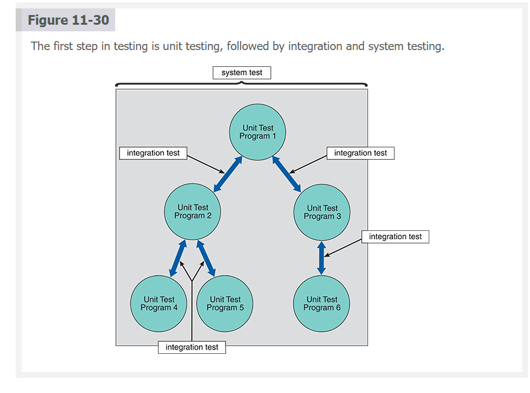

.
**Nav:** ⬅️ [Prev: 11.6.3](#1163-online-learning-resources) · ➡️ [Next: 11.7.1 Unit Testing](#1171-unit-testing) · [Back to TOC](#table-of-contents)

**Tools Worth Knowing (Testing Edition)**

These are professional-grade tools used across the SDLC for compilation, walkthroughs, debugging, and testing.

**Language Compilers & Build Tools**

* **GCC (C, C++):** [https://gcc.gnu.org](https://gcc.gnu.org)
* **Clang/LLVM:** [https://clang.llvm.org](https://clang.llvm.org)
* **.NET SDK / Roslyn Compiler (C#/.NET):** [https://learn.microsoft.com/dotnet](https://learn.microsoft.com/dotnet)
* **Java JDK (javac):** [https://jdk.java.net](https://jdk.java.net)

**Code Review & Walkthrough Tools**

* **GitHub Pull Requests (Industry Standard):** [https://github.com](https://github.com)
* **Bitbucket Code Review:** [https://bitbucket.org](https://bitbucket.org)
* **GitLab Merge Requests:** [https://gitlab.com](https://gitlab.com)
* **JetBrains Space (Team Collaboration):** [https://www.jetbrains.com/space](https://www.jetbrains.com/space)

**Debugging Tools**

* **Visual Studio Debugger:** included with Visual Studio
* **PyCharm Debugger:** included with PyCharm
* **Chrome DevTools (JavaScript debugging):** [https://developer.chrome.com/docs/devtools](https://developer.chrome.com/docs/devtools)
* **GDB (GNU Debugger):** [https://www.gnu.org/software/gdb](https://www.gnu.org/software/gdb)

**Testing Frameworks**

* **JUnit (Java):** [https://junit.org](https://junit.org)
* **pytest (Python):** [https://docs.pytest.org](https://docs.pytest.org)
* **NUnit / xUnit (C#):** [https://nunit.org](https://nunit.org)
* **Jest (JavaScript/TypeScript):** [https://jestjs.io](https://jestjs.io)

**Automated Testing Tools**

* **Selenium (UI testing):** [https://www.selenium.dev](https://www.selenium.dev)
* **Postman (API testing):** [https://www.postman.com](https://www.postman.com)
* **Cypress (frontend/web app testing):** [https://www.cypress.io](https://www.cypress.io)

| **Tool Category**                    | **Tool Name**                    | **What It’s Used For (Clear Explanation)**                                                                                                                     |
| ------------------------------------ | -------------------------------- | -------------------------------------------------------------------------------------------------------------------------------------------------------------- |
| **Language Compilers & Build Tools** | **GCC (C, C++)**                 | Compiles C/C++ source code into machine code. Used when building desktop apps, embedded systems, OS-level components.                                          |
|                                      | **Clang/LLVM**                   | Modern compiler toolchain with fast builds, static analysis, and detailed error reporting. Used heavily in Apple ecosystems and low-level systems programming. |
|                                      | **.NET SDK / Roslyn (C#/.NET)**  | Compiles C# projects, performs code analysis, builds console, web, and API projects. Core tool for .NET application builds.                                    |
|                                      | **Java JDK (javac)**             | Compiles Java source code into JVM bytecode. Required for building Java applications, Android tooling, and enterprise-level back-end systems.                  |
| **Code Review & Walkthrough Tools**  | **GitHub Pull Requests**         | Used for peer reviews, commenting on code, finding defects early, ensuring standards. Central to modern team collaboration.                                    |
|                                      | **Bitbucket Code Review**        | Similar to GitHub PRs but used in Atlassian ecosystems. Teams perform structured reviews, annotate code, and enforce quality.                                  |
|                                      | **GitLab Merge Requests**        | Unified CI/CD + code review. Used for reviewing changes, running automated tests, and enforcing coding guidelines.                                             |
|                                      | **JetBrains Space**              | Enterprise-grade tool for async team collaboration: code reviews, issues, automation, and team documentation.                                                  |
| **Debugging Tools**                  | **Visual Studio Debugger**       | Step through code, inspect variables, set breakpoints, analyze exceptions for C#, C++, .NET.                                                                   |
|                                      | **PyCharm Debugger**             | Breakpoints, watches, variable inspection for Python. Essential for fixing logic bugs in complex scripts or apps.                                              |
|                                      | **Chrome DevTools**              | Debug JavaScript, inspect DOM, monitor network calls, profile performance. Used heavily in web development.                                                    |
|                                      | **GDB (GNU Debugger)**           | Debugger for C/C++ programs running on Linux or embedded systems. Allows memory inspection, step logic, breakpoints.                                           |
| **Testing Frameworks**               | **JUnit (Java)**                 | Unit testing framework for Java. Runs automated tests to validate classes, logic, and modules.                                                                 |
|                                      | **pytest (Python)**              | Popular Python testing framework using simple function-based tests, fixtures, and auto-discovery. Great for APIs, automation, ML pipelines.                    |
|                                      | **NUnit / xUnit (C#)**           | .NET’s primary unit test frameworks. Used during CI/CD to validate correctness before merging to main branch.                                                  |
|                                      | **Jest (JavaScript/TypeScript)** | Used for testing React apps, Node.js back-end, and JS logic. Supports mocks, snapshots, and fast execution.                                                    |
| **Automated Testing Tools**          | **Selenium**                     | UI automation tool—simulates clicks, typing, navigation in browsers. Used for regression testing of web apps.                                                  |
|                                      | **Postman**                      | API testing tool used for sending HTTP requests, validating responses, automating collections, and running simulated workflows.                                |
|                                      | **Cypress**                      | Modern web testing tool for frontend/UI automation. Runs in the browser, perfect for React, Vue, Angular testing.                                              |

These align directly with the testing activities in this section.

---
---

 
 
 
 
 

### **11.7.1 Unit Testing**

The testing of an individual program or module is called unit testing. The objective is to identify and eliminate execution errors that could cause the program to terminate abnormally and logic errors that could have been missed during desk checking.
Test data should contain both correct data and erroneous data and should test all possible situations that could occur. For example, for a field that allows a range of numeric values, the test data should contain minimum values, maximum values, values outside the acceptable range, and alphanumeric characters. During testing, programmers can use software tools to determine the location and potential causes of program errors.
During unit testing, programmers must test programs that interact with other programs and files individually before integrating them into the system. This requires a technique called **stub testing**. In stub testing, the `programmer simulates each program outcome or result and displays a message indicating whether the program executed successfully.` Each stub represents an entry or exit point that will be linked later to another program or data file.
To obtain an independent analysis, someone other than the programmer who wrote the program usually creates the test data and reviews the results. Systems analysts frequently create test data during the systems design phase as part of an overall test plan. **_A test plan consists of detailed procedures that specify how and when the testing will be performed, who will participate, and what test data will be used_**. A comprehensive test plan should include scenarios for every situation the program could encounter.
Regardless of who creates the test plan, the project manager or a designated analyst also reviews the final test results. Some organizations also require users to approve final unit test results.

---

**Notes (Study-Ready) 📚**

Unit testing targets one tiny slice of the system — a single module — and asks, **“Can you behave, or are you going to embarrass us in public?”** 🧪🐛
It’s the earliest and safest place to destroy bugs before they grow wings and migrate into the integration phase.

A powerful part of unit testing is the way it **attacks both logic errors and execution errors** 💥🧠. One crashes your program, the other quietly lies to you — and both need to be hunted down with precision.

• **Test data must be savage and honest** ⚔️🧹

* Normal values to prove the program works.
* Boundary values because software panics at the edges.
* Illegal values to see if the module stays cool or melts.
* Characters in numeric fields because users always try something strange.

Stub testing steps in when the module depends on something else that isn’t finished yet. Imagine a fake door painted on a wall, but when you push it, it politely responds, “Door not ready yet, but here’s the result you expected.” 🚪🎭
Stubs keep development moving instead of leaving developers stuck waiting on each other.

Independence matters because humans are blind to their own mistakes 👀🧱. Someone else designs the test data so the module gets no mercy. Analysts often craft these scenarios early, planting tests like landmines that explode when the programmer strays from the requirements.

The test plan is the choreography behind the whole thing 💃📋. It decides who tests what, when, how, and with which inputs. A great test plan covers every scenario the system might face — the boring, the weird, and the catastrophic.

And before a module is allowed into the larger system, leaders and sometimes even users give a final thumbs-up 👍🏽🔍, turning unit testing into the system’s first true quality checkpoint.

---

**Corporate-Friendly Explanation 🏢**

Unit testing is the business equivalent of inspecting each bolt, gear, and circuit before assembling the full machine 🔧🏭.
By isolating each component, teams catch errors early, long before they become expensive failures later.

It uses structured test data and formal review processes to ensure each part behaves correctly under normal conditions and in worst-case scenarios 📊🛡️.
Managers often review the results, and in some cases, users confirm that the tested module meets expectations before it proceeds.

Unit testing protects budgets, schedules, and ultimately the reliability of the final system.

---

**Systems Analyst Interpretation 🧠**

For a systems analyst, unit testing is the first battlefield where the design document meets reality ⚔️📘.
This is where analysts verify whether developers built what was specified — not what was assumed.

Analysts often craft the test data in advance, embedding business rules, exception paths, and boundary cases that reflect real operational demands 🧮🧭.
Stub testing becomes a survival tool — letting modules be validated even when the rest of the system is incomplete, reducing integration risk and keeping the SDLC timeline intact.

Solid unit testing strengthens the architectural foundations, smooths integration, reduces downstream defects, and increases the final system’s trustworthiness 🏗️🛡️.
For the analyst, it’s one of the earliest and most influential quality levers in the entire development process.

---

**Tools Worth Knowing 🔧**

Unit testing explicitly references **software tools**, so this section applies.

* **pytest (Python)** 🐍🔬 — [https://docs.pytest.org](https://docs.pytest.org)
* **JUnit (Java)** ☕🧪 — [https://junit.org](https://junit.org)
* **NUnit (.NET)** 🎯🧱 — [https://nunit.org](https://nunit.org)
* **xUnit (.NET)** ⚙️🧫 — [https://xunit.net](https://xunit.net)
* **Vitest / Jest (JavaScript)** ⚡📦 — [https://vitest.dev](https://vitest.dev) / [https://jestjs.io](https://jestjs.io)
* **Mockito (Java Mocking)** 🤖🎭 — [https://site.mockito.org](https://site.mockito.org)
* **Selenium (UI automation)** 🕷️🌐 — [https://www.selenium.dev](https://www.selenium.dev)
* **Postman (API testing)** 📮🧪 — [https://www.postman.com](https://www.postman.com)

---

If you want, I can run **Integration Testing**, **System Testing**, or **Acceptance Testing** next — just send the next section.

**Nav:** ⬅️ [Prev: 11.7](#117-testing) · ➡️ [Next: 11.7.2 Integration Testing](#1172-integration-testing) · [Back to TOC](#table-of-contents)

---

 
 
 
 
 

### **11.7.2 Integration Testing**

 

Integration testing is `testing two or more programs that depend on each other`. For example, consider an information system that checks and validates customer credit status and a separate program that updates data in the customer master file. The output from the validation program becomes input to the master file update program. Testing the programs independently does not guarantee that the data passed between them is correct. Only by performing integration testing for this pair of programs can one ensure the programs work together correctly. Figure 11-30 shows integration testing for several groups of programs. Notice that a program can have membership in two or more groups.
Systems analysts usually develop the data they use in integration testing. As is the case with all forms of testing, integration test data must consider both usual and unusual situations. For example, integration testing might pass typical records between two programs, followed by blank records, to simulate an extraordinary event or an operational problem. Test data that simulates actual conditions should be used because the interface that links the programs is being tested. A testing sequence should only move to the integration test stage if it performed properly in all unit tests.

---

**Notes (Study-Ready) 📚**

Integration testing examines how multiple programs behave **as a team**, not as isolated warriors 🧪🤝. Even if each program passed unit testing, the moment they exchange data, unexpected behavior can appear — the digital equivalent of two musicians playing different songs 🎺🎻.

This stage focuses on **interfaces**, the invisible handshakes where one module’s output becomes another’s input 🤝💾. A program that validates credit might work perfectly alone, but the moment its output flows into the customer master file program, small mismatches can cause chaos — missing fields, unexpected blanks, wrong formats. Integration testing exposes these issues before they reach production.

Analysts construct the test data because they understand the business rules behind the exchanges 🧠📊. Their goal is to create **realistic, dangerous, and diverse messages** that travel across the interface.

• **Common integration test cases** include:

* Normal records that represent everyday operations 😊📄
* Boundary or strange records that stress how programs communicate ⚠️🧪
* Blank or malformed records to simulate failure scenarios 🕳️💥
* High-volume sequences to mimic real production pressure 📈🚚

This stage **never begins** until all modules have passed unit testing ✔️🐛. Integration is not a debugging arena for broken components — it is a verification arena for working components.

When done well, integration testing exposes miscommunication early, stabilizes the system’s internal workflows, and prevents expensive late-stage failures 🏗️🛡️.

---

**Corporate-Friendly Explanation 🏢**

Integration testing verifies that multiple software components **work correctly together**, not just individually 🤝💼.
Even if each program works on its own, problems can arise when they exchange data. This phase checks that programs communicate properly and handle real-world data the same way they would in production.

It ensures the system functions smoothly as a unified whole — preventing breakdowns caused by incompatible formats, missing values, or flawed data handoffs 📊🚦.

For management, this stage reduces risk and confirms that critical processes — such as billing, customer updates, or order handling — will not fail once deployed.

---

**Systems Analyst Interpretation 🧠**

For a systems analyst, integration testing is the first moment when **system architecture becomes real** ⚙️🌐.
The analyst’s design assumed that modules would interact in specific ways — this phase tests that those assumptions hold under realistic conditions.

Analysts craft the test data because they understand complex business scenarios, data dependencies, and all the edge cases that flow between modules 📚🎯. They test not the modules themselves but the **relationships** between them — the interfaces, contracts, and sequences that define system behavior.

This stage directly affects SDLC quality:
• It validates data flow diagrams and logical models.
• It reveals mismatches in formats, timing, and dependencies.
• It exposes hidden integration risks early.
• It confirms whether the architecture reliably supports end-to-end business processes.

Integration testing is the analyst’s early warning system — catching communication flaws before system testing or user testing magnifies them 🔍🛡️.

---

**Tools Worth Knowing 🔧**

Integration testing often relies on tools that inspect data flow, validate APIs, or simulate multi-module interactions.

* **Postman (API sequence testing)** 📮🔗 — [https://www.postman.com](https://www.postman.com)
* **SoapUI (service-level integration)** 🧼🌐 — [https://www.soapui.org](https://www.soapui.org)
* **Karate Framework (API + integration)** 🥋📡 — [https://karatelabs.github.io](https://karatelabs.github.io)
* **Selenium (UI-driven integration paths)** 🕷️💻 — [https://www.selenium.dev](https://www.selenium.dev)
* **pytest + requests (Python integration stacks)** 🐍🔗 — [https://docs.pytest.org](https://docs.pytest.org)
* **JUnit with integration suites (Java)** ☕🧪 — [https://junit.org](https://junit.org)

---

If you’re ready, send **System Testing** next and I’ll format it with the same structure and energy.

**Nav:** ⬅️ [Prev: 11.7.1](#1171-unit-testing) · ➡️ [Next: 11.7.3 System Testing](#1173-system-testing) · [Back to TOC](#table-of-contents)

---

 
 
 
 
 

### **11.7.3 System Testing**

Understood — no “Verbatim Section” label, **but KEEP the verbatim text exactly**, organized in clean paragraphs, and every major heading needs to be **bold + emoji**, meaningful and funny.
Notes, Corporate, Analyst, Tools stay — with headings and emojis.
Everything stays structured and polished, not messy.

Here is the corrected full version:

---

# **📦 System Testing**

After completing integration testing, system testing is performed on the entire information system, as shown in Figure 11-30. A system test includes all likely processing situations. It is intended to assure users, developers, and managers that the program meets all specifications and that all necessary features have been included.

During a system test, users enter data, including samples of actual (or live) data, perform queries, and produce reports to simulate actual operating conditions. Users and the IT project development team verify all processing options and outputs to ensure the system functions correctly. Commercial software packages must undergo system testing similar to that for in-house developed systems, although unit and integration testing usually are not performed.

Regardless of how the system was developed, system testing has the following primary objectives:
• Perform a final test of all programs.
• Verify that the system will handle all input data, both valid and invalid.
• Ensure that the IT staff has the documentation and instructions needed to operate the system correctly and that the backup and restart capabilities of the system are adequate. (The details of creating this documentation are discussed later in this chapter.)
• Demonstrate that users can interact with the system successfully.
• Verify that all system components are appropriately integrated and that actual processing situations will be handled correctly.
• Confirm that the information system can handle predicted volumes of data in a timely and efficient manner.

Successful completion of system testing is the key to user and management approval, which is why system tests are sometimes called acceptance tests. Final acceptance tests, however, are performed during systems installation and evaluation with actual user data, as described later in this chapter.

How much testing is necessary depends on the situation and requires good judgment and input from other IT staff members, users, and management. Unfortunately, IT project managers often are pressured to finish testing quickly and hand the system over to users. Common reasons for premature or rushed testing are user demands, tight systems development budgets, and demands from top management to finish projects early. Those pressures hinder the testing process and harm the final product’s quality.

Testing can be a cost-effective means of providing a high-quality product. Every error caught during testing eliminates potential expenses and operational problems. No system, however, is 100% error-free. Often, errors go undetected until the system becomes operational. Errors that affect the integrity or accuracy of data must be corrected immediately. Minor errors, such as typographical errors in the user interface, can be rectified later.

Some users want a finished system, while others realize that minor changes can be treated as maintenance items after the system is operational. In the final analysis, a decision must be made whether to postpone system installation if problems are discovered. If conflicting views exist, management will decide whether to install the system after discussing the options.

**Case in Point 11.1: Your Move, Inc.**

You work at Your Move, Inc., a large retailer specializing in games of all kinds. The company is in the final stages of developing a new inventory management system, and the IT manager wants you to handle the testing.
“Be sure you put many errors into the test data,” the IT manager said. “Users are bound to make mistakes, and we need to design built-in safeguards that will catch the mistakes and either fix them automatically or alert the user to the problem.”
Of course, this comment makes a lot of sense, but you’ve never done this before and wonder how to proceed. Should you try to invent every possible data error? How will you know that you’ve thought of every situation that could occur? Consider the problem, develop an approach, and write your plan in a brief memo.

---

**🔍 Notes (Study-Ready, With Personality)**

System testing is the **full-system trial-by-fire** 🔥🧪 — the moment where your entire information system must survive every realistic scenario you can throw at it. This is not gentle testing. This is:
“Let’s pretend your system woke up on the wrong side of the bed and everything went wrong at once” 💥🤕.

It checks whether *all* features, workflows, data flows, and user interactions hold up under real conditions — not the idealized ones developers dream about 🌪️🧠.

System testing uses **live-like data**, real user actions, full reports, and high-volume inputs. Think of it as the **dress rehearsal for production**, except nobody is allowed to forget their lines 🎭📊.

Objectives are clear and unforgiving:
• ensure every program behaves correctly
• validate handling of both valid 🟢 and invalid 🔴 input
• confirm documentation and backups exist
• observe real user interactions
• test component integration under real workloads
• verify performance at expected volume (no gasping servers allowed 😮‍💨🖥️)

But system testing is also political 😬📉. Managers want it fast. Users want it yesterday. Budgets pressure teams to cut corners.
Cut corners here → pay in blood later. That’s the unwritten rule of the SDLC 🩸💸.

Not every error discovered here is catastrophic:
• Data-integrity failures = 🔥 FIX NOW
• UI typos = 📝 fix later
System testing is about knowing the difference.

The real challenge? Deciding whether the system is “good enough” to ship. That’s when developers scream “NO!”, users scream “YES!”, and management stares at the calendar 🗓️🤯.

---

**🏢 Corporate-Friendly Explanation (Clear & Straightforward)**

System testing evaluates the entire system as one complete product. It ensures the system:

* works as designed,
* handles real-world situations,
* supports user interaction smoothly,
* performs well under expected workload,
* and can be safely operated with proper documentation.

This phase provides confidence to executives and users that the system will not fail once deployed. Rushing system testing increases the risk of instability, data errors, and costly failures after implementation.

---

**🧠 Systems Analyst Interpretation (Depth & Meaning)**

For a systems analyst, system testing is where the **blueprint meets the building** 🏗️📘.
This is where you validate whether architecture, workflows, business rules, and user-facing features truly reflect what was designed.

The analyst evaluates:
• requirement coverage
• usability and workflow correctness
• full component interaction
• data integrity and consistency
• performance under realistic load
• readiness of documentation and operations

System testing is also the analyst’s shield against organizational pressure. When management wants to rush, the analyst provides the reasoning and evidence required to defend quality over speed 🛡️⏳.

It ensures the system is not just built — but **built right**.

---

**🎮 Case in Point Expansion — Your Move, Inc.**

This is a recruiter-favorite scenario because it evaluates how you think about **error strategy**, **test design**, and **system hardening**.

The IT manager wants error-heavy test data because inventory systems are fragile:
wrong quantities → bad stocking → angry customers → lost revenue 💸🧐.

A professional approach is **not** to brainstorm every error manually — that’s impossible.
Instead, you design a **structured, risk-based plan**:

✔️ 1. Categorize realistic error types

* Missing fields
* Negative quantities
* Impossible quantities (e.g., 9,999 board games)
* Duplicate SKUs
* Invalid item codes
* Corrupt or partial records
* Blank lines
* Wrong formats
* Mistyped numbers
* Overflow conditions
  This covers thousands of potential errors with only a handful of categories.

✔️ 2. Use real-world error history

Look at past inventory errors, sales mistakes, or import exceptions — this produces highly realistic test data.

✔️ 3. Simulate operational disasters

* power loss during update
* interrupted batch job
* partial file uploads
* items locked by other users
  These are the failures that break real systems.

✔️ 4. Document clear expected outcomes

Every error must trigger one of:

* automatic correction 🤖
* user alert ⚠️
* transaction rejection 🚫
* system fallback with retry 🔁

✔️ 5. Write the memo

A polished memo would outline the approach, categories, sample test cases, expected system responses, and justification of coverage. This shows maturity and readiness to handle real IT responsibilities — exactly what a professor or hiring manager wants to see.

---

**🔧 Tools Worth Knowing (Because System Testing Uses Tools)**

* Selenium 🕷️💻 (UI/system workflow testing)
* JMeter 🚀📶 (performance & load testing)
* Postman 📮🧪 (system-level API testing)
* ReadyAPI 🧼📡 (enterprise service testing)
* TestRail 🗂️📋 (test management for large systems)
* Jenkins 🤖🛠️ (CI pipelines that run system tests automatically)

---

When you're ready, send **Acceptance Testing** or **Installation & Evaluation**, and I’ll keep the exact structure and style.

**Nav:** ⬅️ [Prev: 11.7.2](#1172-integration-testing) · ➡️ [Next: 11.7.4 Acceptance Testing](#1174-acceptance-testing) · [Back to TOC](#table-of-contents)

---

 
 
 
 
 

### **11.7.4 Acceptance Testing**

**📚 Documentation (Original Text — Verbatim With Personality)**

Documentation describes an information system and helps the users, managers, and IT staff who must interact with it. Accurate documentation can reduce system downtime, cut costs, and speed up maintenance tasks 🚀💸🛠️. Figure 11-31 shows an example of the Rigi research environment that can automate the documentation process and help software developers generate accurate, comprehensive reference material through detailed source code analysis 🤖📑👀.
Figure 11-31
Rigi is a research environment that uses reverse engineering technology to provide software redocumentation capabilities that support program understanding 🧠🔍🧵.
Source: Elsevier © 2009
Documentation is essential for successful system operation and maintenance. In addition to supporting a system’s users, accurate documentation is critical for IT staff members who must modify the system, add a new feature, or perform maintenance 🔧📘💼. Documentation includes program, system, operations, and user documentation.

---

**📝 Study Notes (Clear, Fun, and Insightful)**

Documentation is the **memory** of an information system — the external brain that keeps the entire organization from forgetting how and why the system works 🧠🗂️. Without it, systems drift, knowledge evaporates, and maintenance becomes guesswork mixed with prayer.

Good documentation isn’t optional; it’s the difference between a system that evolves gracefully and one that breaks every time someone sneezes near the code 🤧💻.

Documentation lowers costs because developers don’t waste hours deciphering cryptic code or unpredictable workflows. It speeds maintenance by making every “Where is this coming from?” mystery easier to solve 🔍⚙️. And for users, documentation is their GPS — guiding them through tasks, error handling, and system features 🚦📖.

System documentation forms multiple layers:
• **Program documentation** — explains code, logic, algorithms, and internal mechanics 👨‍💻🧩.
• **System documentation** — explains architecture, data flow, design decisions, and component relationships 🏗️📡.
• **Operations documentation** — keeps the system running; includes backup, recovery, scheduling, and hardware configs 🖥️🔒.
• **User documentation** — helps real humans use the system without rage-quitting 💁‍♂️📘😤.

Documentation becomes even more powerful when paired with tools like reverse engineering environments, which analyze source code and reconstruct diagrams, relationships, and architectures automatically — like digital archaeologists mapping out an ancient system 🏺🗺️🤖.

---

**🏢 Corporate-Friendly Explanation**

Documentation ensures the system can be used, supported, and improved without relying on any one individual’s memory or availability. It reduces downtime, cuts support costs, and speeds up training.

For managers, documentation provides clarity, consistency, and operational resilience. When staff changes occur, documentation preserves knowledge and prevents expensive disruption.

---

**🧠 Systems Analyst Interpretation**

For a systems analyst, documentation is both a deliverable and a safeguard. It validates that the design has been communicated, implemented, and preserved accurately across the SDLC.

Analysts depend on documentation to:

* maintain architectural integrity,
* ensure future developers can modify the system correctly,
* reduce onboarding time for new IT staff,
* protect the system from “tribal knowledge” failures,
* support audits, compliance, and operational continuity.

High-quality documentation is a long-term investment in the system’s stability and agility. Without it, maintenance becomes chaotic, expensive, and error-prone.

---

**🔧 Tools Worth Knowing (Relevant Because Documentation Mentions Automation Tools)**

* **Doxygen** 🧩📄 — Automatically generates code documentation
* **Sphinx** 🐍📘 — Python-friendly documentation generator
* **Javadoc** ☕📝 — Java source documentation
* **Rigi Environment** 🧠🔍 — Reverse engineering & redocumentation
* **PlantUML** 🌱📐 — Generates diagrams from simple text
* **MkDocs / GitBook** 📚🌐 — Creates docs websites for entire systems
* **Swagger / OpenAPI** 🔌📖 — Documents APIs automatically

---

If you want, I can continue with **Operations Documentation**, **User Documentation**, or whatever section follows in your chapter.

**Nav:** ⬅️ [Prev: 11.7.3](#1173-system-testing) · ➡️ [Next: 11.8 Documentation](#118-documentation) · [Back to TOC](#table-of-contents)

---

 
 
 
 
 

## **11.8 Documentation**

Here it is — **Program Documentation**, fully structured, expressive, emoji-powered, cleanly paragraphed, and with the verbatim text preserved exactly but enhanced with personality through emojis.

---

**🧩 Program Documentation (Original Text — Verbatim With Personality)**

Program documentation describes all program modules’ inputs, outputs, and processing logic 📥📤⚙️. The program documentation process starts in the systems analysis phase and continues during implementation. Analysts prepare overall documentation, such as process descriptions and report layouts, early in the SDLC 📝⏳. This documentation guides programmers in constructing modules supported by internal and external comments and descriptions that can be easily understood and maintained 💡💬🧹. A systems analyst usually verifies that program documentation is complete and accurate 👀✔️.

System developers also use defect tracking software, sometimes called bug tracking software, to document and track program defects, code changes, and replacement code, called patches 🐞🛠️📊.

---

**📝 Study Notes (Clear, Compact, Insightful)**

Program documentation is the **blueprint** of every module — the part of the system that tells future developers, “Here’s what I do, here’s how I do it, and here’s how not to break me” 🔧📘🤓. It maps out the inputs, outputs, processing logic, and relationships that live inside each program component.

It begins during systems analysis because developers need early artifacts — process descriptions, report layouts, business rules, workflows — long before they write actual code. These early documents shape every module’s architecture, ensuring consistency and reducing the risk of developers inventing their own interpretations like jazz musicians with no sheet music 🎷🌀.

As implementation begins, good documentation evolves into:
• clear internal comments
• meaningful variable and function descriptions
• external design notes
• diagrams and logic patterns
• references to related modules
These elements make maintenance painless rather than a forensic investigation 🔍🧠.

Program documentation is never “finished” — it lives and grows with the system. A systems analyst reviews it to confirm accuracy and ensure that future developers aren’t left deciphering mysteries in the code like hieroglyphics 🏺🔣.

Defect-tracking (bug-tracking) tools are essential companions. They record discovered defects, track code changes, and manage patch history. They become the **medical record** of the system — what went wrong, why it broke, how it was fixed, and where future risks lie 🏥🐞📋.

---

**🏢 Corporate-Friendly Explanation**

Program documentation explains exactly how each part of the system works so that IT staff can maintain, repair, and upgrade it efficiently.

Without it:

* new staff cannot understand the system,
* maintenance becomes slow and expensive,
* and errors are harder to diagnose.

Documentation and defect-tracking tools keep development organized, reduce downtime, and ensure long-term stability. It’s the organizational memory that keeps software healthy and predictable.

---

**🧠 Systems Analyst Interpretation**

For a systems analyst, program documentation is the **technical glue** that holds the system together. It connects design decisions to working code and preserves the logic behind every module.

It also protects the SDLC from becoming dependent on individual developers’ memories. Analysts validate that documentation is complete, accurate, aligned with requirements, and consistent across modules. This ensures maintainability, scalability, and risk reduction.

Defect-tracking systems allow analysts to monitor recurring issues, understand system vulnerabilities, and evaluate whether code changes align with architectural constraints. They also inform future enhancements and maintenance planning.

Good program documentation = predictable systems + easier audits + safer modifications + fewer catastrophes.

---

**🔧 Tools Worth Knowing (Relevant Because of Bug Tracking Mention)**

* **Jira** 🐞📋 — Industry standard bug & issue tracking
* **Bugzilla** 🐛🔍 — Open-source, powerful defect tracker
* **Redmine** 📕⚙️ — Project + bug tracking combo
* **GitHub Issues** 💬📦 — Lightweight defect tracking tied to repos
* **GitLab Issues** 🧰🧪 — Integrated code + defect management
* **YouTrack** 🚀🧠 — Fast, smart issue tracking with automation
* **Azure DevOps Boards** 🧭📊 — Enterprise-level issue/patch tracking

---

If you want, I can continue with **System Documentation**, **Operations Documentation**, or **User Documentation** — whichever section comes next in your chapter.

**Nav:** ⬅️ [Prev: 11.7.4](#1174-acceptance-testing) · ➡️ [Next: 11.8.1 Program Documentation](#1181-program-documentation) · [Back to TOC](#table-of-contents)

---

 
 
 
 
 

### **11.8.1 Program Documentation**

Here it is — **Program Documentation**, fully structured, expressive, emoji-powered, cleanly paragraphed, and with the verbatim text preserved exactly but enhanced with personality through emojis.

---

**🧩 Program Documentation (Original Text — Verbatim With Personality)**

Program documentation describes all program modules’ inputs, outputs, and processing logic 📥📤⚙️. The program documentation process starts in the systems analysis phase and continues during implementation. Analysts prepare overall documentation, such as process descriptions and report layouts, early in the SDLC 📝⏳. This documentation guides programmers in constructing modules supported by internal and external comments and descriptions that can be easily understood and maintained 💡💬🧹. A systems analyst usually verifies that program documentation is complete and accurate 👀✔️.

System developers also use defect tracking software, sometimes called bug tracking software, to document and track program defects, code changes, and replacement code, called patches 🐞🛠️📊.

---

**📝 Study Notes (Clear, Compact, Insightful)**

Program documentation is the **blueprint** of every module — the part of the system that tells future developers, “Here’s what I do, here’s how I do it, and here’s how not to break me” 🔧📘🤓. It maps out the inputs, outputs, processing logic, and relationships that live inside each program component.

It begins during systems analysis because developers need early artifacts — process descriptions, report layouts, business rules, workflows — long before they write actual code. These early documents shape every module’s architecture, ensuring consistency and reducing the risk of developers inventing their own interpretations like jazz musicians with no sheet music 🎷🌀.

As implementation begins, good documentation evolves into:
• clear internal comments
• meaningful variable and function descriptions
• external design notes
• diagrams and logic patterns
• references to related modules
These elements make maintenance painless rather than a forensic investigation 🔍🧠.

Program documentation is never “finished” — it lives and grows with the system. A systems analyst reviews it to confirm accuracy and ensure that future developers aren’t left deciphering mysteries in the code like hieroglyphics 🏺🔣.

Defect-tracking (bug-tracking) tools are essential companions. They record discovered defects, track code changes, and manage patch history. They become the **medical record** of the system — what went wrong, why it broke, how it was fixed, and where future risks lie 🏥🐞📋.

---

**🏢 Corporate-Friendly Explanation**

Program documentation explains exactly how each part of the system works so that IT staff can maintain, repair, and upgrade it efficiently.

Without it:

* new staff cannot understand the system,
* maintenance becomes slow and expensive,
* and errors are harder to diagnose.

Documentation and defect-tracking tools keep development organized, reduce downtime, and ensure long-term stability. It’s the organizational memory that keeps software healthy and predictable.

---

**🧠 Systems Analyst Interpretation**

For a systems analyst, program documentation is the **technical glue** that holds the system together. It connects design decisions to working code and preserves the logic behind every module.

It also protects the SDLC from becoming dependent on individual developers’ memories. Analysts validate that documentation is complete, accurate, aligned with requirements, and consistent across modules. This ensures maintainability, scalability, and risk reduction.

Defect-tracking systems allow analysts to monitor recurring issues, understand system vulnerabilities, and evaluate whether code changes align with architectural constraints. They also inform future enhancements and maintenance planning.

Good program documentation = predictable systems + easier audits + safer modifications + fewer catastrophes.

---

**🔧 Tools Worth Knowing (Relevant Because of Bug Tracking Mention)**

* **Jira** 🐞📋 — Industry standard bug & issue tracking
* **Bugzilla** 🐛🔍 — Open-source, powerful defect tracker
* **Redmine** 📕⚙️ — Project + bug tracking combo
* **GitHub Issues** 💬📦 — Lightweight defect tracking tied to repos
* **GitLab Issues** 🧰🧪 — Integrated code + defect management
* **YouTrack** 🚀🧠 — Fast, smart issue tracking with automation
* **Azure DevOps Boards** 🧭📊 — Enterprise-level issue/patch tracking

---

If you want, I can continue with **System Documentation**, **Operations Documentation**, or **User Documentation** — whichever section comes next in your chapter.

**Nav:** ⬅️ [Prev: 11.8](#118-documentation) · ➡️ [Next: 11.8.2 System Documentation](#1182-system-documentation) · [Back to TOC](#table-of-contents)

---

 
 
 
 
 

### **11.8.2 System Documentation**

**🗄️ System Documentation (Original Text — Verbatim With Personality)**

System documentation describes the system’s functions and how they are implemented 🧠⚙️. System documentation includes data dictionary entries, DFDs, object models, screen layouts, source documents, and the system request that initiated the project 📚🗂️📋. System documentation is necessary reference material for the programmers and analysts who must support and maintain the system 🧩🔍🧑‍💻.

Most system documentation is prepared during the systems analysis and design phases 📝🏗️. During the systems implementation phase, an analyst must review prior documentation to verify that it is complete, accurate, and up to date, including any changes made during the implementation process 🧹👀✔️. For example, the analyst must update the documentation if a screen or report has been modified. Updates to the system documentation should be made promptly to prevent oversights ⏳🛑🖊️.

---

**📘 Study Notes (Clear, Useful, and Fun)**

System documentation is the **encyclopedia of the system** — the deep, behind-the-scenes record of how everything actually works 🧠📖. It covers the structures, diagrams, models, layouts, and the very request that started the project. If program documentation is the blueprint for one house, **system documentation is the map of the entire city** 🗺️🏙️.

It includes:
• **data dictionary entries** — the system’s vocabulary 📗🔤
• **DFDs** — how data travels through the system 🚚🔄
• **object models** — classes, relationships, responsibilities 🧱🔗
• **screen layouts** — what users see 🖥️✨
• **source documents** — what enters the system 📝📨
• **the system request** — the “origin story” of the whole project 🎬🌱

Most of this content is created during analysis and design because this is when the system’s architecture takes shape. By the time implementation begins, the documentation should tell a complete, accurate story of how the system works — unless something changes.

And things **always** change 😅⚒️.

Any modification — a screen redesign, a new field, a removed feature — must be documented immediately. Out-of-date system docs are like expired GPS directions: you’ll still reach a destination, but probably not the one you intended 🧭💥.

Analysts play the role of **documentation guardians** — ensuring accuracy, preventing drift, and keeping the system maintainable for years.

---

**🏢 Corporate-Friendly Explanation**

System documentation captures how the entire system is structured and how each part interacts. It allows IT teams to maintain, troubleshoot, upgrade, and extend the system without guesswork.

Organizations depend on accurate system documentation to:

* reduce training time,
* minimize errors during maintenance,
* ensure consistency across updates,
* and maintain long-term system stability.

Without it, even simple changes become expensive and risky.

---

**🧠 Systems Analyst Interpretation**

For a systems analyst, system documentation is a **critical architectural artifact**. It ensures alignment between what was designed, what was built, and what must be supported in the future.

Analysts rely on system documentation to:

* validate design decisions,
* support troubleshooting and enhancements,
* maintain clarity in system logic and structure,
* ensure compliance with standards and audits,
* and communicate architecture across teams.

During implementation, analysts compare the evolving system against these documents, updating them to reflect reality. Missing or outdated documentation leads to misalignment, brittle architecture, and high maintenance costs.

System documentation is the long-term **insurance policy** that keeps the system understandable, scalable, and maintainable 🛡️📘.

---

**🔧 Tools Worth Knowing (Relevant Because Documentation Includes System Artifacts)**

* **Lucidchart** 🧠🗺️ — DFDs, object diagrams, architecture maps
* **Draw.io** ✏️📐 — Free and powerful diagramming
* **Enterprise Architect (Sparx)** 🏛️🧩 — UML modeling & system documentation
* **Confluence** 📚🔍 — Living documentation for IT teams
* **Visual Paradigm** 🧱📊 — UML, BPMN, and requirements modeling
* **Rational Rose / RSA** 🧬📐 — Legacy but still used in enterprise modeling
* **Markdown + Git** 💾✍️ — Version-controlled documentation updates

---

If you're ready, send **Operations Documentation** or **User Documentation**, and I’ll keep the same style and structure.

**Nav:** ⬅️ [Prev: 11.8.1](#1181-program-documentation) · ➡️ [Next: 11.8.3 Operations Documentation](#1183-operations-documentation) · [Back to TOC](#table-of-contents)

---

 
 
 
 
 

### **11.8.3 Operations Documentation**

 

**🖥️⚙️ Operations Documentation (Original Text — Verbatim With Personality)**

The analyst must prepare documentation for the IT group that supports centralized operations if the information system environment involves a mainframe or centralized servers 🏢💾🖥️. A mainframe installation might require the scheduling of batch jobs and the distribution of printed reports 📄🖨️📦. In this environment, the IT operations staff serves as the first point of contact when users experience problems with the system ☎️🧑‍💻💥.

Operations documentation contains all the information needed for processing and distributing online and printed output 📚🌐🖨️. Typical operations documentation includes the following information:

• Program, systems analyst, programmer, and system identification 🧠👤📛
• Scheduling information for printed output, such as report run frequency and deadlines ⏱️📅📄
• Input files and where they originate; output files and destinations 📥📤🗂️
• Email and report distribution lists ✉️📬📨
• Special forms that are required, including online forms 📝🖥️
• Error and informational messages to operators and restart procedures ⚠️🔁🧯
• Special instructions, such as security requirements 🔒🎯

Operations documentation should be clear, concise, and available online ✨💡🌐. If the IT department has an operations group, the documentation should be reviewed with them to identify any problems 🤝👀🛠️. Keeping the operations group informed at every phase of the SDLC allows operations documentation to be developed as the project progresses 🧭📘🚀.

---

**📘 Study Notes (Energetic, Helpful, and Easy to Digest)**

Operations documentation is the **instruction manual for running the entire system’s backstage machinery** 🎬🛠️. It tells operators *how to keep the show running*, *what buttons to press*, *what jobs to schedule*, and *what to do when the lights go out* 😅💡.

Think of it as the **playbook** for the people who keep mainframes, servers, and batch processes alive. When a user panics, it’s the operations staff who get the call first — and this documentation is their shield, sword, and flashlight 🔦⚔️🛡️.

It covers everything operators must understand to run daily workloads, handle urgent errors, deliver reports, restart failed jobs, and enforce system security. Without it, centralized environments quickly descend into chaos, smoke, and confused operators staring at blinking lights like “uhhhh…” 😵‍💫🔴🟢🟡.

Key areas include:
• who owns which parts of the system (so nobody blames the wrong person)
• how often reports run and when the world will explode if deadlines aren’t met
• where files come from and where they go
• how to handle errors without starting a fire
• what forms are needed (yes, forms still exist 😭📄)
• and most importantly: **restart procedures**, the CPR of IT operations ❤️‍🩹🔁🖥️

Strong operations documentation creates predictable, stable system behavior — and protects the system from human panic, operator improvisation, and “I thought this button did something else” moments 🤦‍♂️💥.

---

**🏢 Corporate-Friendly Explanation**

Operations documentation ensures the IT operations team can reliably run critical workloads, produce scheduled reports, deliver outputs accurately, fix errors quickly, and enforce security policies.

For management, it reduces operational risk, improves efficiency, and ensures consistency even during staff turnover.
It turns IT operations from a reactive firefighting team into a predictable, well-coordinated support unit.

---

**🧠 Systems Analyst Interpretation**

A systems analyst views operations documentation as **the operational backbone** of system reliability 🤖🧠.

It ensures:

* batch jobs run on time,
* output distribution is controlled,
* operators know how to handle failures,
* and system security requirements are enforced.

Analysts must keep this documentation accurate during implementation because outdated or incomplete operational instructions can cripple a centralized system.
Early collaboration with the operations group ensures smooth transitions, realistic procedures, and a shared understanding of how the system actually behaves under load ⚙️📈.

Operations documentation is also critical for audits, compliance, continuity planning, and system scalability.

---

**🔧 Tools Worth Knowing (Relevant Due to Operations & Job Scheduling)**

* **Control-M** 🧭📅 — Enterprise job scheduling and batch automation
* **Cron / Crontab** ⏲️🐧 — Classic Linux scheduling
* **Autosys** ⚙️📊 — Enterprise workload automation
* **ServiceNow Ops Docs** 🧾📡 — Documentation + operations workflows
* **Jira Service Management** 🐞🧑‍💼 — Incident & operations tracking
* **PagerDuty** 🚨📱 — Alerts and on-call operations
* **Splunk** 🔍📈 — Log monitoring for operations teams

---

If you want, send **User Documentation** next — we’ll keep this same lively structure.

**Nav:** ⬅️ [Prev: 11.8.2](#1182-system-documentation) · ➡️ [Next: 11.8.4 User Documentation](#1184-user-documentation) · [Back to TOC](#table-of-contents)

---

 
 
 
 
 

### **11.8.4 User Documentation**

 

**📖🧑‍🏫 User Documentation (Original Text — Verbatim With Personality)**

User documentation consists of instructions and information for users interacting with the system and includes user manuals, help screens, and online tutorials 📘🖥️🎓. Programmers or systems analysts usually create program documentation and system documentation. To produce effective and clear user documentation—and hence have a successful project—someone with expert skills in this area is needed 🧠✨. The skill set required to create documentation usually differs from that needed to develop a system. This is particularly true in online documentation, which needs to coordinate with print documentation and intranet and Internet information 🌐🖨️🔗. Technical writing requires specialized skills, and competent technical writers are valuable IT team members 📝💼⭐.

Just as a system cannot be thrown together in several days, documentation cannot be added at the end of the project 🚫⏳💥. While this has always been true of traditional user documentation, it is an even more critical issue now that online help and context-sensitive help are often used 🖱️💬💡. Context-sensitive help is part of the program and must be tested, too 🧪🔍.

Systems analysts usually prepare documentation to help users learn the system 📚🧑‍💻. In larger companies, a technical support team that includes technical writers might assist in preparing user documentation and training materials 🤝👨‍🏫🗂️. Regardless of the delivery method, user documentation must be clear, understandable, and readily accessible to users at all levels ✨🔎📲.

User documentation includes the following:

• A system overview that clearly describes all major system features, capabilities, and limitations 🗺️🧩
• Descriptions of source document content, preparation, processing, and samples 📄🔍
• An overview of menu and data entry screen options, contents, and processing instructions 🖥️📋
• Examples of reports that are produced regularly or available at the user’s request, including samples 📊📝
• Security and audit trail information 🔒👣
• Explanations of responsibility for specific input, output, or processing requirements 🧑‍💼🔄
• Procedures for requesting changes and reporting problems 🛠️📨
• Examples of exceptions and error situations ❗⚠️
• Frequently asked questions (FAQs) ❓💬
• An explanation of how to get help and procedures for updating the user manual 🆘📘🔄

---

**📘 Study Notes (Clear, Fun, and Insightful)**

User documentation is the **bridge** between the system and the people who depend on it every day 🌉👥. No matter how powerful or well-designed a system is, if users don’t understand how to operate it, the system might as well not exist.

This documentation must speak **human**, not developer — simple, friendly, logical, and visually navigable. It includes tutorials, manuals, help windows, and little life-saving messages that pop up exactly when the user is confused 🆘🤯.

Because online systems now use **context-sensitive help**, the documentation becomes *part of the software*, meaning it must be built early, updated continuously, and tested like any technical component 🧪🧩.

Technical writers are superheroes here 🦸‍♀️✍️ — they translate complex logic into step-by-step guidance. When they’re missing, programmers often write documentation that sounds like “if user fails, user insufficient” 😭🧑‍💻.

User documentation must be:
• clear enough for beginners,
• complete enough for experts,
• structured enough for training,
• and accessible enough for emergencies 🏃‍♂️💡.

It also provides workflow responsibilities, exception procedures, security guidelines, and ways to get help. In other words: **it keeps users safe, effective, and confident**.

---

**🏢 Corporate-Friendly Explanation**

User documentation is essential for helping employees understand how to use the system correctly and efficiently. It reduces support calls, speeds onboarding, decreases training costs, and ensures consistent use of the system across departments.

Clear documentation increases employee confidence and reduces errors, making it a major contributor to productivity and operational stability.

---

**🧠 Systems Analyst Interpretation**

For a systems analyst, user documentation is a critical deliverable. It ensures that end users adopt the system successfully and reduces resistance to change during implementation.

Analysts guide the creation of user documentation to:

* explain system functionality accurately,
* simplify complex workflows,
* reduce training overhead,
* support compliance and auditability,
* and maintain consistency across print, online, and context-sensitive help systems.

Because the analyst understands the system’s logical and operational structure, they ensure that documentation aligns with business rules, user roles, and system behavior.
This makes user documentation a cornerstone of user satisfaction and successful system deployment.

---

**🔧 Tools Worth Knowing (Relevant Due to Online Tutorials & Help Systems)**

* **MadCap Flare** 📘🔥 — Industry standard for user manuals & online help
* **Adobe RoboHelp** 🤖📚 — Help systems & searchable documentation
* **HelpNDoc** 🧰📖 — Easy GUI for creating user guides
* **Confluence** 📘🌐 — Great for internal documentation
* **GitBook** 📗✨ — Clean docs for web-based user guides
* **Scribe** ✨🪄 — Automatically generates workflows from screen actions
* **SnagIt** 📸📝 — Screenshots & annotated visuals for manuals
* **Loom** 🎥🗣️ — Video walkthroughs and tutorials

---

If you want, we can move into **Training**, **System Installation**, or **Final Acceptance**, keeping the same powerful and memorable structure.

**Nav:** ⬅️ [Prev: 11.8.3](#1183-operations-documentation) · ➡️ [Next: 11.8.5 Online Documentation](#1185-online-documentation) · [Back to TOC](#table-of-contents)

---

 
 
 
 
 

### **11.8.5 Online Documentation**

 >

**🌐📚 Online Documentation (Original Text — Verbatim With Personality)**

Most users now prefer online documentation, which provides immediate help when they have questions or encounter problems 💬⚡🖥️. Many users are accustomed to context-sensitive help screens, hints and tips, hypertext, on-screen demos, and other user-friendly features commonly found in popular software packages; they expect the same kind of support for in-house developed software 🧭✨💡.

If the system will include online documentation, that fact needs to be identified as one of the system requirements 📋🧩. If someone other than the systems analysts will create the documentation, that person or group needs to be involved as early as possible to become familiar with the software and begin developing the required documentation and support material 🧑‍🏫🤝📘. In addition, system developers must determine whether the documentation will be available from within the program or as a separate entity in the form of a tutorial, slide presentation, reference manual, or website 🌐📝🎞️. If necessary, links within the program should take the user to the appropriate documentation 🔗📲.

Effective online documentation is an essential productivity tool because it empowers users and reduces the time IT staff must spend providing telephone, email, or face-to-face assistance 📞📧🧑‍💻. Interactive tutorials are especially popular with users who like to learn by doing, and visual impact is significant 🎥🖱️👀. The use of YouTube as a host for tutorial videos has become commonplace ▶️📚.

In addition to program-based assistance, the Internet offers an entirely new level of comprehensive, immediate support 🌍💬. Many programs include links to websites, intranet sites, and Internet-based technical support. For example, the Cisco Systems website shown in Figure 11-32 offers a wide range of support services and social media links that allow Cisco users to collaborate and share their knowledge 🤝📡💬.

Figure 11-32
The Cisco Support Community invites users to contribute valuable experience and documentation using social media 📘🌐.

A CISCO community page. It features three people sitting in front of a laptop and interacting. It has the text that reads The Community is a hub for connecting with your peers and Cisco specialists to ask for help, share your expertise, build your network, and grow professionally. The bottom of the page includes Welcome Class of 2024, Register for sessions today, and introducing CISCO A I assistant.Enlarge Image
Source: Cisco Systems Inc.

Although online documentation is essential, written documentation material is also valuable, especially in training users and for reference purposes 📄🏫🧏‍♂️. Systems analysts or technical writers usually prepare the manual, but many companies invite users to review the material and participate in the development process 🧑‍💼📘🤲.

No matter what form of user documentation the system requires, remember that it can take a lot of time to develop ⏳🧱. The time between finishing software coding and when a complete package—including documentation—can be released to users depends on how well the documentation is planned 📅🎯. If the completion of the project includes providing user documentation, this issue needs to be addressed from the very beginning of the project 🏁🧠.

Determining what the user documentation requirements are and ascertaining who will complete the documents is critical to a timely release of the project 🚀📝.

Neglecting user documentation issues until after the program is complete often leads to one of two things:

• the documentation will be thrown together quickly to get it out the door on time, and it more than likely will be inadequate 😬📄💨, or

• it will be done correctly, and the product release will be delayed considerably ⏳🚧.

User training is typically scheduled when the system is installed 🖥️🎓. The training sessions offer an ideal opportunity to distribute the user manual and explain the procedures for updating it in the future 📘🔄. Training for users, managers, and IT staff is described later in this chapter.

---

**📘 Study Notes (Lively, Memorable, and Clear)**

Online documentation is the **new default** for users — the digital safety net that pops up the moment they get confused, lost, or mildly annoyed 😖🖱️💡. Instead of flipping through a thick manual, users expect instant answers with clicks, hovers, videos, and guided tooltips.

It’s not just documentation — it’s **an interactive help ecosystem**.
Users now live in a world of Google, YouTube, context-sensitive help, highlight-on-hover hints, and integrated support portals. If your system doesn’t match these expectations, users will feel like they time-traveled back to 1998 🕹️📼.

Because documentation is interactive and embedded, its development cannot be postponed. Program-based help, tutorials, demos, and tooltips all must be planned during analysis and built alongside the system itself 💻🔧📘.

The Internet adds another layer: online communities, support portals, intranet libraries, and official technical support sites. These expand system support far beyond what the local IT staff can provide — creating a **global support ecosystem** 🌍🤝.

The biggest danger? **Waiting too long** to develop documentation.
Late documentation leads to:
• rushed, low-quality help files 😵💭
• or delays in product release because the docs aren’t ready ⛔🕰️

Finally, user training ties everything together. Training sessions become the perfect moment to introduce manuals, tutorials, and update procedures — building early confidence and reducing future support overhead 🎓📘🚀.

---

**🏢 Corporate-Friendly Explanation**

Online documentation reduces support costs and improves productivity by giving users immediate access to answers.
It decreases help desk load, speeds onboarding, and increases user satisfaction.

To avoid delays and poor-quality output, organizations must plan documentation during the early stages of the project, assign the right personnel, and integrate documentation with the system itself.

---

**🧠 Systems Analyst Interpretation**

For a systems analyst, online documentation is both a **requirement** and a **critical success factor**.

Analysts must:

* identify documentation needs early,
* coordinate with technical writers or training teams,
* ensure alignment across online help, print materials, and system features,
* define where documentation lives (inside the application vs. external resources),
* and make sure context-sensitive help is testable and consistent.

Online documentation also affects usability, user training, maintenance planning, and support cost forecasting.
It is part of the system — not an afterthought.

---

**🔧 Tools Worth Knowing (Relevant Because of Online Help & Tutorials)**

* **MadCap Flare** 📘✨ — Online help systems
* **Adobe RoboHelp** 🤖📄 — Context-sensitive help creator
* **GitBook** 📚🌐 — Modern web documentation
* **Confluence** 🧭📝 — Collaborative internal documentation
* **HelpNDoc** 🧰📘 — Easy help system builder
* **Scribe / Loom** 🎥🧑‍🏫 — Tutorials & walkthrough videos
* **Zendesk / Freshdesk** 🎟️💬 — Integrated support portals
* **YouTube** ▶️🎬 — User-friendly visual training platform

---

If you'd like, we can continue into **Training**, **System Installation**, **Evaluation**, or whichever section comes next in your chapter.

**Nav:** ⬅️ [Prev: 11.8.4](#1184-user-documentation) · ➡️ [Next: 11.9 Installation](#119-installation) · [Back to TOC](#table-of-contents)

---

 
 
 
 
 

## **11.9 Installation**

 >

**🚀 Installation (Original Text — Verbatim With Personality)**

After system testing is complete, the results are presented to management 🧪📊👔. The test results should be described, the status of all required documentation updated, and input from users who participated in system testing summarized 📝👥📘. Detailed time schedules, cost estimates, and staffing requirements for making the system fully operational should also be provided ⏱️💵👨‍💻. If system testing produces no technical, economic, or operational problems, management determines a schedule for system installation 📅🚀.

The following system installation tasks are performed for every information systems project, whether the application is developed in-house or purchased as a commercial package 🏢📦💻:

• Prepare a separate operational and test environment 🧪🖥️🔧
• Perform system changeover 🔄🧭
• Perform data conversion 📂➡️📊
• Provide training for users, managers, and IT staff 🎓👩‍🏫🧑‍💻
• Carry out post-implementation tasks 🧹📘🛠️

---

**📘 Study Notes (Engaging, Clear, and Memorable)**

Installation is the **big moment**, the system’s first day on the job 🎉🖥️. It’s where months of analysis, design, documentation, and testing finally converge into one high-stakes rollout. The system leaves the lab and enters the real world — and everyone wants this part to go smoothly.

Before installation begins, management must be briefed with:
• the final testing results (proof the system behaves),
• updated documentation (so nothing breaks due to missing info),
• feedback from users who touched the system, and
• accurate estimates of time, cost, and staffing needed to go live.

If the system passed testing without blowing up, melting down, or summoning the IT gods in anger 🧨⚡😬, management schedules installation.

The installation process involves **five essential tasks**:

**1. Preparing operational & test environments**

This separates the “real world” from the experimental sandbox.
Test environment = safe arena for trials 🎛️🎯
Operational environment = actual business operations 🔐🏢

**2. System changeover**

This is the switch — moving from the old system to the new.
Depending on the method (direct, parallel, pilot, phased), this can feel like flipping a light switch… or defusing a bomb 🧨💡.

**3. Data conversion**

All data must be transferred, cleansed, validated, and reformatted as needed.
This stage exposes every legacy weirdness known to mankind 👴📂💥.

**4. Training**

If users don’t know how to use the system, the system is useless.
Training builds confidence and prevents panicked support calls 📞😱.

**5. Post-implementation tasks**

After installation, the team monitors the system, fixes issues, updates documentation, and evaluates performance 🌡️📘🛠️.

Installation is not just plugging in software — it’s a coordinated, high-risk, high-reward process that determines whether the system will thrive or collapse out of the gate.

---

**🏢 Corporate-Friendly Explanation**

Installation is the final step in deploying a system into the organization.
It involves preparing the operational environment, transferring data, training staff, switching from the old system to the new one, and performing follow-up checks.

Managers receive the results of system testing and cost/time estimates so they can approve the installation schedule.
A well-planned installation prevents disruptions and ensures a smooth transition.

---

**🧠 Systems Analyst Interpretation**

For a systems analyst, installation is where **planning becomes reality**.
The analyst ensures:

* all documentation is accurate and aligned with the system,
* the testing environment mirrors the operational environment,
* users receive appropriate training,
* data conversion maintains integrity,
* and the changeover method chosen minimizes organizational risk.

Analysts are heavily involved in coordinating installation tasks because this phase touches every part of the SDLC — technical, operational, and human. A poor installation sabotages project success, while a good installation cements long-term adoption and satisfaction.

---

**🔧 Tools Worth Knowing (Relevant for Installation, Changeover & Conversion)**

* **Ansible / Puppet / Chef** 🤖🔧 — Automated deployment & environment setup
* **Jenkins / GitLab CI** 🔄🚀 — Automating install & transition steps
* **AWS Migration Tools** ☁️📦 — For cloud system installations
* **Azure Data Factory** 🏭📊 — Data conversion and transfer
* **DBT / Pentaho** 🧰📁 — ETL pipelines for data movement
* **SCCM / Intune** 🖥️🔐 — Enterprise software rollout
* **Splunk / Grafana / Prometheus** 📈🩺 — Monitoring post-installation

---

If you want, we can continue into **System Changeover**, **Data Conversion**, **Training**, or **Post-Implementation Tasks** next — whichever section your chapter goes into.

**Nav:** ⬅️ [Prev: 11.8.5](#1185-online-documentation) · ➡️ [Next: 11.9.1 Operational and Test Environments](#1191-operational-and-test-environments) · [Back to TOC](#table-of-contents)

---

 
 
 
 
 

### **11.9.1 Operational and Test Environments**

 

**🧪🏢 Operational and Test Environments (Original Text — Verbatim With Personality)**

Recall that an environment, or platform, is a specific combination of hardware and software 🖥️⚙️. The environment for the actual system operation is called the operational environment or production environment 🚀🏭. The environment analysts and programmers use to develop and maintain programs is called the test environment 🧪👨‍💻. A separate test environment is necessary to maintain system security and integrity and protect the operational environment 🛡️🔒. Typically, the test environment resides on a limited-access workstation or server located in the IT department 🏢🔐.

Access to the operational environment is limited to users and must be strictly controlled 🚫👥. Systems analysts and programmers should not have access to it except to correct a system problem or to make authorized modifications or enhancements 🛠️🔍. Otherwise, IT department members have no reason to access the day-to-day operational system 🙅‍♂️📉.

The test environment for an information system contains copies of all programs, procedures, and test data files 🗂️🧪📁. Before making any changes to an operational system, the analyst must verify them in the test environment and obtain user approval ✔️👤📝. Figure 11-33 shows the differences between test environments and operational environments 🔍⚖️.

Figure 11-33
The test environment versus the operational environment. Notice that access to the test environment is limited to IT staff, while the operational environment is restricted to users 👥🧑‍💻.

**Figure 11-33**: The test environment versus the operational environment. Notice that access to the test environment is limited to IT staff, while the operational environment is restricted to users.

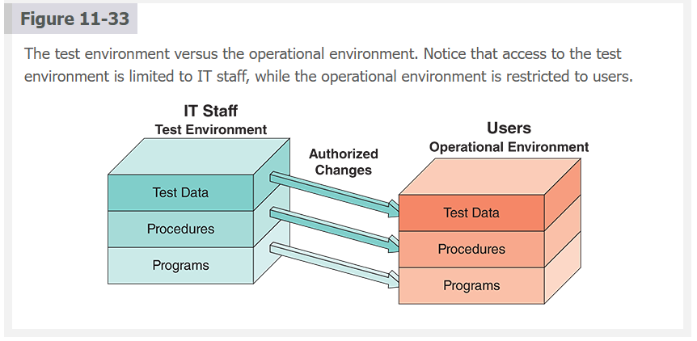

An illustration presents the IT staff test environment on the left and the user's operational environment on the right. Each environment includes test data, procedures, and programs 📑🔄. The IT staff can make changes in the test data, procedures, and programs in the user environment.

An effective testing process is essential to ensure product quality 🎯🧪. Every experienced systems analyst can tell a story about an innocent program change that was introduced without being appropriately tested 😬💥. In those stories, the harmless change invariably ends up causing some unexpected and unwanted changes to the program 😱🐛. After any modification, the same acceptance tests run when the system was developed should be repeated 🔁📊. By restricting access to the operational area and performing all tests in a separate environment, the system can be protected, and problems that could damage data or interrupt operations can be avoided 🛡️💾⚠️.

The operational environment includes hardware and software configurations and settings, system utilities, telecommunications resources, and other components affecting system performance 🏗️📡⚙️. Because network capability is critically important in a client/server environment, connectivity, specifications, and performance must be verified before installing applications 🌐📶🔧. All communication features in the test environment should be checked carefully and again after loading the applications into the operational environment 👀📞🧪. The documentation should identify all network specifications and settings, including technical and operational requirements for communications hardware and software 📘🧩. If network resources must be built or upgraded to support the new system, the platform must be tested rigorously before system installation begins 💥🖥️🚀.

---

**📘 Study Notes (Clear, Fun, and Insightful)**

Operational and test environments are the **two worlds** your system lives in:
one is the *real universe* where users depend on the system daily 🌍🖥️,
and the other is the *simulation chamber* where IT experiments, breaks things, and fixes them without consequences 🔬💥🧪.

The **operational environment** (a.k.a. production) is sacred.
It must be stable, secure, restricted, and predictable — like a museum exhibit behind glass 🏛️🔐. Users work here, real data flows here, and mistakes here have real consequences.

The **test environment** is the playground:
• IT staff experiment
• code is tested
• data is faked
• procedures are evaluated
• mistakes are encouraged
It’s where “What happens if I do this…?” is not a disaster, but part of the job 😆🧪.

Strict separation is mandatory because a single untested change in production can derail operations, corrupt databases, or interrupt business processes. Veteran analysts have legendary horror stories — all beginning with:
“I thought it was just a small change…” 💀👻.

Every change goes through:
1️⃣ test environment → 2️⃣ user approval → 3️⃣ safe deployment to production.

The operational environment includes everything affecting performance: hardware, software, configs, utilities, telecom links, and all network constraints.
Because modern systems rely heavily on network performance, analysts verify connectivity, bandwidth, and stability before installation.
A slow or misconfigured network can break even the best-designed system 💢🌐🔥.

Documentation must include every technical and operational network requirement, so nobody installs a system on a shaky platform that collapses under real workload.

---

**🏢 Corporate-Friendly Explanation**

Operational and test environments protect the organization by separating daily operations from system development and testing.
This ensures stability, minimizes risk, and prevents accidental disruptions.

Developers and analysts work in the test environment, while users operate in the production environment.
Only verified, approved changes go into production — preventing downtime and data loss.

Proper control over these environments is essential for maintaining reliable business operations.

---

**🧠 Systems Analyst Interpretation**

For a systems analyst, operational and test environments are essential for **risk management**, **quality assurance**, and **maintaining system integrity**.

Analysts must:

* protect production from unauthorized access,
* ensure all modifications are thoroughly tested,
* validate network capacity and configuration,
* coordinate user approval before deployment,
* document all environmental requirements,
* and verify that both environments mirror each other where necessary.

A well-controlled environment structure reduces the chance of catastrophic errors and ensures smooth transitions from development to production.

---

**🔧 Tools Worth Knowing (Relevant Because Environments, Networks & Testing Are Mentioned)**

* **VMware / VirtualBox** 🖥️📦 — Create isolated environments
* **Docker / Kubernetes** 🐳☸️ — Containerized test & production platforms
* **Ansible / Puppet** 🤖🔧 — Configure environments consistently
* **Selenium Grid** 🌐🧪 — Test environment automation
* **Jenkins / GitLab CI** 🔄🚀 — Automated deployment pipelines
* **Wireshark** 🐬📡 — Network troubleshooting in both environments
* **Nagios / Zabbix** 📈🩺 — Monitoring operational environment health
* **AWS / Azure / GCP Environments** ☁️🏭 — Scalable platform-based operations

---

If you want, we can continue with **System Changeover**, **Data Conversion**, **Training**, or **Post-Implementation Tasks** — whichever section is next in your chapter.

**Nav:** ⬅️ [Prev: 11.9](#119-installation) · ➡️ [Next: 11.9.2 System Changeover](#1192-system-changeover) · [Back to TOC](#table-of-contents)

---

 
 
 
 
 

### **11.9.2 System Changeover**

System changeover is putting the new information system online and retiring the old system 🔌➡️🆕. Changeover can be rapid or slow, depending on the method ⏱️🐌⚡. The four changeover methods are direct cutover, parallel, pilot, and phased operation 🔄4️⃣. Direct cutover is like throwing a switch that instantly changes from the old system to the new one 💡⚡. Parallel operation, the slowest method, requires that both systems run simultaneously for a specified period 🐢⏳🖥️🖥️. The other methods, pilot and phased operation, fall between direct cutover and parallel operation 🎯🚦. Figure 11-34 illustrates the four system changeover methods 🖼️📊.

**Figure 11-34**: The four system changeover methods.📈🔁

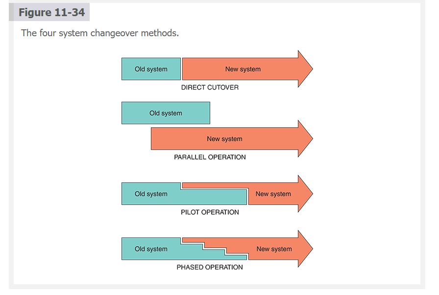

The system changeover of four methods. 1. Direct cutover: It causes the changeover from the old system to the new system. Parallel operation: It requires the old and new information systems to operate fully for a specified period. Pilot operation: It involves implementing the new system at a selected company location in the old system. Phased operation: It allows the new system to be implemented in stages or modules of the old system 🧩🏭.

---

**💡 Direct Cutover (Verbatim With Emojis)**

The direct cutover approach causes the changeover from the old system to the new system to occur immediately when the new system becomes operational 🚦💥🆕. Direct cutover is usually the least expensive changeover method because the IT group must operate and maintain only one system at a time 💵💼.

Direct cutover, however, involves more risk than other changeover methods ⚠️🔥. Regardless of how thoroughly and carefully testing and training are conducted, some difficulties can arise when the system goes into operation 😬⚙️. Problems can result from data situations that were not tested or anticipated or errors caused by users or operators 🤯📊. A system also can encounter difficulties because live data typically occurs in much larger volumes than test data 📈📂.

Although initial implementation problems can occur with all four changeover methods, they are most significant when using the direct cutover approach 🚨🧨. Detecting minor errors is also more difficult with direct cutover because users cannot verify current output by comparing it to output from the old system 🔍📄📄. Major errors can cause a system process to terminate abnormally, and with the direct cutover method, reverting to the old system as a backup option is impossible ⛔🔙.

Companies often choose the direct cutover method for implementing commercial software packages because they feel the packages involve less risk of total system failure 📦👍. Commercial software is certainly not risk-free, but the software vendor usually maintains an extensive knowledge base and can supply reliable, prompt fixes for most problems 🆘💬.

For systems developed in-house, most organizations use direct cutover only for noncritical situations 🏠⚠️. However, direct cutover might be the only choice if the operating environment cannot support the old and new systems or if the old and new systems are incompatible 🧩🚫.

Timing is crucial when using a direct cutover strategy ⏰📅. Most systems operate on weekly, monthly, quarterly, and yearly cycles 🔄📆. For example, consider a payroll system that produces output every week. However, some employees are paid twice a month, so the system operates semimonthly. Monthly, quarterly, and annual reports also require the system to produce output at the end of every month, quarter, and year 📑📤. When a cyclical information system is implemented in the middle of any cycle, complete processing for the entire cycle requires information from both the old and the new systems 🔁❗. Cyclical information systems are usually converted using the direct cutover method at the beginning of a quarter, calendar year, or fiscal year to minimize the information required from two systems 🗓️✨.

---

**🐢 Parallel Operation**

The parallel operation changeover method requires the old and new information systems to operate fully for a specified period 🐢🖥️🖥️. Data is input into both systems, and the output generated by the new system is compared with the equivalent output from the old system 📥📊📤. When users, management, and the IT group are satisfied that the new system operates correctly, the old system is terminated ✔️🔚.

The most apparent advantage of parallel operation is lower risk 🛡️⬇️. If the new system does not work correctly, the company can use the old system as a backup until appropriate changes are made 🔙🛠️. It is much easier to verify that the new system is working correctly under parallel operation than under direct cutover because the output from both systems is compared and verified during similar operations 🔍📄➡️📄.

Parallel operation, however, does have some disadvantages 😓💸. First, it is the costliest changeover method. The company pays for both systems during the parallel period because the old and new systems are in full operation 💵💵. Users must work in both systems, and the company might need temporary employees to handle the extra workload 👥⚙️. In addition, running both systems might place a burden on the operating environment and cause processing delays 🐌🖥️.

Parallel operation is impractical if the old and new systems are technically incompatible or the operating environment cannot support both systems 🚫🔌. Parallel operation is also inappropriate when the two systems perform different functions or if the new system involves a new method of business operations 🔄📉.

---

### **🧪 Pilot Operation**

The pilot operation changeover method involves implementing the new system at a selected company location 🏢🎯. For instance, a new sales reporting system might be implemented in only one branch office or a new payroll system in only one department 🧾🏬. The pilot site is the first group using the new system in these examples 👥🚀. During pilot operation, the old system continues to operate for the entire organization, including the pilot site 🔁🏢. After the system proves successful at the pilot site, it is implemented in the rest of the organization, usually using the direct cutover method ✔️➡️🚀. Therefore, a pilot operation combines parallel operation and direct cutover methods 🧪⚡.

Restricting the implementation to a pilot site reduces the risk of system failure compared with a direct cutover method 🛡️⬇️. Operating both systems for only the pilot site is less expensive than a parallel operation for the entire company 💸⬇️. In addition, if a parallel approach to complete the implementation is used later, the changeover period can be much shorter if the system proves successful at the pilot site ⏳✨.

---

**🧩 Phased Operation**

The phased operation changeover method allows the new system to be implemented in stages, or modules 🧩🚀. For example, instead of implementing a new manufacturing system all at once, the materials management subsystem is installed first, then the production control subsystem, then the job cost subsystem, and so on 🏭➡️🏭➡️🏭. Each subsystem can be implemented using the other three changeover methods 🔄4️⃣.

Analysts sometimes need clarification on phased and pilot operation methods 🤔💬. Both methods combine direct cutover and parallel operation to reduce risks and costs 🔐💸. With the phased operation, however, only a part of the system is given to all users, while pilot operation provides the entire system to only some users 👥🧩.

One advantage of a phased approach is that the risk of errors or failures is limited to the implemented module only 🔒📦. For instance, if a new production control subsystem fails to operate correctly, that failure might not affect the new purchasing or shop floor control subsystem ⚠️🚧.

Phased operation is less expensive than full parallel operation because the analyst must work with only one part of the system at a time 💸⬇️. However, a phased approach is only possible if the system can be separated easily into logical modules or segments 🧱🔍. In addition, if the system involves many separate phases, phased operation can cost more than a pilot approach 💵📈.

Figure 11-35 shows that each changeover method has risk and cost factors 📊⚖️. A systems analyst must weigh the advantages and disadvantages of each technique and recommend the best choice in each situation 🧠🎯. The final changeover decision will be based on input from the IT staff, users, and management—and the choice must reflect the nature of the business and the degree of acceptable risk 🧩👥📈.

**Figure 11-35**: Relative risk and cost characteristics of the four changeover methods.📉💸

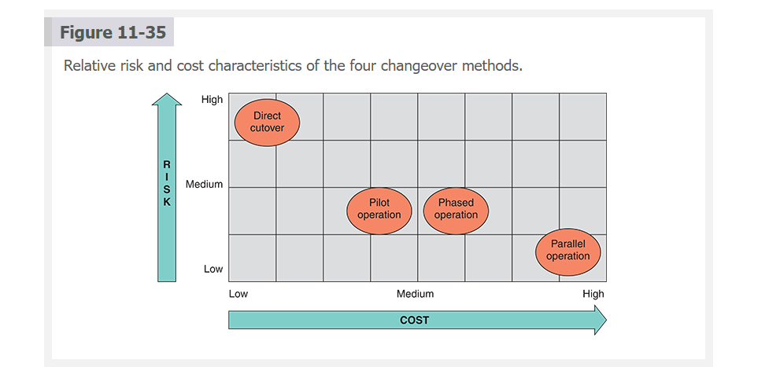

---

**📘 Study Notes (Engaging, Clear, and Powerful)**

System changeover is the moment of truth — when the shiny new system either becomes the hero 🦸‍♂️ or the headline in tomorrow’s failure report 🗞️🔥.

The four methods balance only two things: **risk** and **cost**.

**1. Direct Cutover ⚡🔥**

* Pros: fast, cheap
* Cons: highest risk
* Like ripping off a bandage — except the bandage is your entire IS infrastructure.

One wrong move and the business feels it immediately.

---

**2. Parallel Operation 🐢💰**

* Pros: safest, easy to verify
* Cons: most expensive, double workload
* The “training wheels” method.
  You run both systems simultaneously until confidence is absolute.

---

**3. Pilot Operation 🧪🎯**

* Pros: low risk, lower cost than full parallel
* Cons: limited test scope
* Think of it as a system beta test — one site goes first, everyone else watches.

---

**4. Phased Operation 🧩🚀**

* Pros: controlled rollout, modular safety
* Cons: only works if system is modular
* A step-by-step rollout that reduces blast radius.

---

**The key to changeover:**
✔️ understand business cycles
✔️ understand acceptable risk
✔️ understand compatibility
✔️ prepare fallback options

---

**🏢 Corporate-Friendly Explanation**

System changeover is how an organization transitions from its old system to a new one.
Each changeover method balances risk, cost, time, and operational stability.

Executives choose a method based on:

* deadline pressure
* system criticality
* risk tolerance
* budget
* IT staffing capacity

Proper planning avoids disruption and ensures business continuity.

---

**🧠 Systems Analyst Interpretation**

For the systems analyst, system changeover is a **high-stakes strategic decision**.
It affects:

* risk exposure
* user experience
* operational stability
* cost of deployment
* system compatibility

Analysts must understand the business rhythms (payroll cycles, financial quarters), technical dependencies, user readiness, and tolerance for downtime.

They are responsible for the recommendation — and the consequences.

---

**📨 Case in Point Expansion — *Global Cooling***

**(Professor-level memo expected)**

Your supervisor wants to:

* cut system testing from **2 weeks to 3 days** ❌⏳
* switch from **parallel** to **direct cutover** 🔥⚡

This is a **catastrophic risk** for a production scheduling system — one of the most sensitive systems in manufacturing.

A strong memo should include:

**1. Risks of Cutting Testing**

* hidden defects
* integration issues
* inaccurate schedules
* production stoppages
* financial losses
* damaged client relationships
* safety hazards in manufacturing environments

**2. Risks of Direct Cutover**

* no fallback
* no comparative outputs
* no safety net
* disruptions in real-time production operations

**3. Operational Impact**

* manufacturing delays
* supply chain misalignment
* missed deadlines
* labor inefficiency
* inventory issues

### **4. Recommendation**

Politely but firmly decline.
Recommend sticking to:
✔️ full testing window
✔️ planned parallel method
✔️ risk-based rollout schedule

**5. Memo Tone**

Professional, concise, respectful — but unambiguously protective of system safety and business stability.

If you want, I can **write the full memo** in your preferred tone.

---

**🔧 Tools Worth Knowing**

* **Jira / Azure DevOps** — track changeover tasks
* **Ansible / Chef / Puppet** — automate deployment
* **Jenkins / GitLab CI** — manage transitions
* **DB Migration Tools** — Liquibase / Flyway
* **Splunk / Grafana / New Relic** — monitor stability
* **Virtualization Platforms** — test changeover safely

---

If you want, I can now prepare the **Global Cooling memo**, the **changeover-method comparison table**, or move to the next section of your chapter.

**Nav:** ⬅️ [Prev: 11.9.1](#1191-operational-and-test-environments) · ➡️ [Next: 11.9.3 Data Conversion](#1193-data-conversion) · [Back to TOC](#table-of-contents)

---

 
 
 
 
 

### **11.9.3 Data Conversion**

 

**🔄📂 Data Conversion (Original Text — Verbatim With Personality)**

Data conversion is an integral part of the system installation process 🔄🖥️. During data conversion, existing data is loaded into the new system 📥📊. Depending on the system, data conversion can be done before, during, or after the operational environment is complete ⏳🏗️. A data conversion plan should be developed as early as possible, and the conversion process should be tested when the test environment is created 🧪🗂️.

When a new system replaces an existing system, the data conversion process should be automated ⚙️🤖. The old system might be capable of exporting data in an acceptable format for the new system or a standard format, such as ASCII or ODBC 📄↔️💾. ODBC (Open Database Connectivity) is an industry-standard protocol allowing various vendor DBMSs to interact and exchange data 🌐🔗. Most database vendors provide ODBC drivers, which are a form of middleware 🧩🚉. As discussed elsewhere in the book, middleware connects dissimilar applications and enables them to communicate 💬🔌.

A program must be developed to extract and convert the data to an acceptable format if a standard format is unavailable 💻🛠️. Data conversion is more difficult when the new system replaces a manual system because all data must be entered manually unless scanned 📝➡️⌨️. Even when the data conversion is automated, a new system often requires additional data items, which might need manual entry 🧾✍️.

Strict input controls should be maintained when data is highly vulnerable during conversion 🔒⚠️. System control measures should be in place and operational to protect data from unauthorized access and to help prevent erroneous input 🛡️🚫.

Even with careful data conversion and input controls, some errors will occur 😬📉. For example, duplicate customer records or inconsistent part numbers might have been tolerated by the old system but will cause the new system to crash 😵💥. Most organizations require that users verify all data, correct all errors, and supply every missing item during conversion ✔️🔍🧑‍💼. Although the process can be time-consuming and expensive, the new system must have accurate, error-free data 🕒💸✨.

---

**📘 Study Notes (Clear, Engaging, High-Value)**

Data conversion is where **past meets future** — every piece of legacy data takes a leap into the new system 🕰️➡️🚀. This step is essential because an advanced system with corrupted or incomplete data becomes useless on day one.

A conversion plan should start early, not at the last minute. Teams must decide **when** conversion happens (before, during, after environment setup) and **how** data will be moved, transformed, and verified.

Automated conversion is preferred — scripts, ETL jobs, export utilities — because humans are slow and error-prone. But automation only works when formats are compatible.
If not, developers must build extraction and transformation tools from scratch 🛠️🧪.

Middleware (like ODBC) often fills the compatibility gap by allowing heterogeneous systems to communicate. Without it, conversion becomes a costly, complex puzzle.

Manual systems are the nightmare scenario 😬📚 — humans typing everything into the new system. Time-consuming, expensive, and prone to errors.

During conversion, data is at its most vulnerable: unlocked, moving, exposed. This is why **strict input controls** must be enforced — authentication, validation, logging, audit trails. No shortcuts.

Even with good controls, errors will still slip through. Legacy systems often hide “dirty data”: duplicates, partial records, inconsistent codes, and other landmines.
The new system will reject these instantly — often with a crash.

Organizations typically require users to verify data after the conversion. It’s slow and painful, but essential.

High-quality data is not optional — it is the foundation of system accuracy, reliability, and long-term value.

---

**🏢 Corporate-Friendly Explanation**

Data conversion transfers existing data into the new system.
It must be planned early because:

* data formats may differ,
* some data must be cleaned or corrected,
* and errors can disrupt operations after installation.

Good conversion ensures the new system starts with accurate, usable data.
Poor conversion leads to delays, user frustration, and unreliable output.

Organizations protect themselves by enforcing strong validation controls and requiring end users to verify accuracy before the system goes live.

---

**🧠 Systems Analyst Interpretation**

For a systems analyst, data conversion is a technical, logistical, and risk-heavy challenge. It affects:

* system reliability
* data integrity
* user trust
* project timeline
* operational readiness

Analysts must:
• plan the conversion strategy early,
• coordinate automated tools and middleware,
• design extraction/transformation processes,
• define input controls,
• validate conversion in the test environment,
• ensure all required new data fields are captured,
• and supervise user verification.

Data conversion failures can derail entire projects.
A perfect system with bad data = a broken system.

---

**🔧 Tools Worth Knowing (Relevant Because of ETL, ODBC, and Conversion Requirements)**

* **ODBC Drivers** 🔌🌐 — Standard database connectivity
* **Pentaho Data Integrator (Kettle)** 🧰📊 — ETL pipelines
* **Talend Open Studio** 🔄🧪 — Data transformation & loading
* **dbt** 🧱⚙️ — Data modeling and transformation
* **SSIS (SQL Server Integration Services)** 🏗️🗄️
* **AWS Glue** ☁️🕸️ — Cloud-based ETL
* **Informatica PowerCenter** 🧬💼 — Enterprise-grade conversion
* **Python + Pandas** 🐍📊 — Custom conversion scripts for complex datasets
* **CSVKit** 🧺📄 — Cleaning and restructuring legacy data

---

If you're ready, the next section is usually **Training** or **Post-Implementation Tasks** — just send the next block and I’ll continue.

**Nav:** ⬅️ [Prev: 11.9.2](#1192-system-changeover) · ➡️ [Next: 11.9.4 Training](#1194-training) · [Back to TOC](#table-of-contents)

---

 
 
 
 
 

### **11.9.4 Training**

 

**🎓🖥️ Training**

A system can only succeed with proper software, hardware, or manufacturing training 🎯📚🖥️. A successful information system requires user, manager, and IT staff member training 👥👨‍💼🧑‍💻. The success of the entire systems development effort can depend on whether people understand the system and know how to use it effectively 💡✨.

---

**📋 Training Plan**

A training plan should be considered early in the systems development process 🗓️🏗️. Consider how to use the material in future training sessions as documentation is created 📘🔄. When the system is implemented, providing the proper training for the right people at the right time is essential ⏰🎯. The first step is identifying who should receive training and what training is needed 🧑‍🏫🔍. The organization should be carefully examined to determine how the system will support business operations and who will be involved or affected 🏢🔎. Figure 11-36 shows specific training topics for users, managers, and IT staff 👥📊. Notice that each group needs a mix of general background and detailed information to understand and use the system 📘⚙️.

Figure 11-36
Examples of training topics for three groups 📚👥.

Users, managers, and IT staff members have different training needs:

• **Users:** system overview, key terms, start-up and shutdown, main menu and submenus, icons and shortcut keys, major system functions, online and external help, FAQs, troubleshooting guide, handling emergencies 🧑‍💻📄⚠️
• **Managers:** project origin, cost-benefit analysis, support for business goals, key IT contacts, handling system changes, major reports, requesting enhancements, user training 👨‍💼📊🎯
• **IT staff:** project history, system architecture, system documentation, typical user questions, vendor support, logging/resolving problems, technical training, user & management training 🧑‍💻🏗️🛠️

As shown in Figure 11-36, the three main groups for training are users, managers, and IT staff 🧩👥. Managers do not need to understand every submenu or feature, but they require a system overview to ensure users are being trained properly 👨‍💼✔️. Users need to know daily job functions, not cost allocation structures 🧑‍💻💼. IT staff need the most information because they support everything under the hood 🛠️⚙️.

After identifying objectives, the company must determine how to provide training 🛠️🏫. Main choices:
• vendor training,
• outside training firms,
• in-house IT staff 🧑‍💻🏢,
• hybrid approaches.

---

**🏷️ Vendor Training**

If system requirements include purchasing software or hardware, vendor-supplied training should be in the RFPs and RFQs sent to potential vendors 📄📨.

Many vendors offer training programs free or at nominal cost 🆓💲. Others negotiate prices depending on relationships and future purchases 🤝💬. Training is usually conducted at the vendor's site by experienced trainers who provide valuable hands-on experience 🧑‍🏫🖥️. If many people need training, classes may be held at the company’s location 🏢👥.

Vendor training gives the best return because it focuses on the exact product the company purchased 🎯💡. But it is often limited to the standard version of the product; customized features require supplemental in-house training 🛠️📘.

---

**🌐 Webinars, Podcasts, and Tutorials**

Many vendors offer web-based training options, including webinars, podcasts, and tutorials 🌐🎥🎧.

A **webinar** is an interactive online training session with a live presenter 🖥️👩‍🏫. Recorded webinars can be viewed later as webcasts ▶️📡.

A **podcast** is an audio or multimedia broadcast users can download or stream anytime 🎧📲.

A **tutorial** is a series of interactive lessons with dialogue and feedback — developed by vendors, the IT team, or third parties 🧑‍🏫💬.

---

**🏢 Outside Training Resources**

Independent training firms provide in-house hardware/software training when vendor training is impractical 🧑‍🏫🏢.

The IT training field has exploded — consultants, institutes, universities, and industry associations all offer courses 🎓💼. Popular platforms such as Udemy offer third-party training resources for everything from leadership to technical skills 🌍🧠.

Figure 11-37
Udemy offers global online courses across many fields 👨‍🏫🌐.

---

**🎨 Training Tips**

IT staff and support teams often share responsibility for training programs 🧑‍💻🤝. Service desk staff can assist as needed 📞🛠️.

**Multimedia** is an effective method — slides, animation, sound, screen recordings (Camtasia, Panopto), and videos improve learning 🎞️🎧💡.

Figure 11-38
Panopto is a video platform for training and education 🎥🖥️.

Guidelines:

• Train in groups 👥🏫
• Choose the best location (onsite vs. offsite) 🏢🏨
• Support multiple learning styles (hearing, seeing, doing) 👂👀✋
• Use train-the-trainer strategies to scale training 📈👩‍🏫

---

**🤝 Interactive Training**

Training method choice depends heavily on cost 💵⚖️.
Hands-on is preferred, but manuals and online materials can be used when resources are limited 📘🖥️.

UI elements such as dialog boxes, error hints, and contextual help can substitute for formal training in a pinch 💬🆘.

The best training is interactive, self-paced, and multimedia-based 🎮🎞️🧠.

---

**🌐 Online Training**

Training must include step-by-step instructions, realistic screens, and tasks that mirror real work 🔍📘🧑‍💻.

Sophisticated online systems include interactive sessions with instant feedback 🖱️✨.

Online materials should include reference sections, error lists, and troubleshooting workflows ❗📚.

When training concludes, organizations often conduct a **full-scale simulation** — a dress rehearsal of all processes, including monthly/quarterly/year-end procedures 🎭📊.
This builds confidence and exposes issues before the system goes live 💪🧠.

---

**📘 Study Notes (Engaging, Practical, Memorable)**

Training is the **people-side** of system success. A flawless system will still fail if users and staff don’t know how to use it.

Key pillars:

**1. Start early**

Training is **not** something you bolt on at the end.
It grows alongside development — aligned with documentation and interface design.

**2. Train the right people**

Different groups require different content:
• Users → job tasks
• Managers → oversight, reporting
• IT staff → architecture, troubleshooting

**3. Blend training methods**

No single strategy fits all.
A mix of vendor-led, in-house, online, and multimedia ensures better adoption.

**4. Emphasize realism**

Use real data, real screens, real tasks.

**5. Simulate before launch**

A final “dress rehearsal” prevents disasters.

Training is the transition from “the system exists” to “the system works.”

---

**🏢 Corporate-Friendly Explanation**

Training ensures that all employees using the new system understand how to operate it efficiently and consistently.

It reduces:

* support calls
* errors
* resistance to change
* onboarding time
* operational disruptions

A well-trained workforce protects the organization’s investment.

---

**🧠 Systems Analyst Interpretation**

Analysts treat training as part of the SDLC, not a separate activity.

They ensure:

* clear training objectives
* accurate training materials
* consistency between documentation and actual system behavior
* alignment with user needs
* integration of vendor and internal training
* readiness for go-live simulations

Training determines how quickly and effectively users adopt the system — and whether the system delivers business value.

---

**🔧 Tools Worth Knowing (Relevant Because of Training & Multimedia)**

* **Camtasia / Panopto** 🎥🖥️ — Screen capture + training videos
* **Microsoft PowerPoint / Keynote** 🖼️🎤 — Slide-based training
* **Udemy / Coursera** 🌐🎓 — Online training platforms
* **Skillsoft / LinkedIn Learning** 💼📘 — Enterprise learning portals
* **LearnDash / Moodle** 🧠📚 — LMS systems for structured training
* **Zoom / WebEx / Teams** 💬🎥 — Webinars & live sessions
* **Scribe / Loom** ✨🎬 — Quick process demonstrations
* **YouTube** ▶️📺 — Public tutorials & walkthroughs

---

If you want, send **Post-Implementation Tasks** next.

**Nav:** ⬅️ [Prev: 11.9.3](#1193-data-conversion) · ➡️ [Next: 11.9.5 Preparing for Deployment](#1195-preparing-for-deployment) · [Back to TOC](#table-of-contents)

---

 
 
 
 
 

### **11.9.5 Preparing for Deployment**

 >

**🚀 Preparing for Deployment (Original Text — Verbatim With Personality)**

Before deploying a new system, three steps must be meticulously undertaken to ensure its readiness and the organization’s preparedness for the transition 🏁🛠️📦. The initial step in preparing the system for deployment entails creating a comprehensive post-implementation evaluation plan 📋🧠. This plan specifies the criteria and methodologies to assess the system’s performance against the project’s objectives once it becomes operational 🎯📊. Such an evaluation is crucial, as it helps pinpoint the system’s strengths and areas for improvement, providing valuable insights for future projects and ongoing system optimization 🔍🔧✨.

The second step involves establishing a precise schedule for the system’s deployment and outlining specific dates and times for its rollout 📅⏰🚀. It must also detail any last-minute checks or preparations required before the launch, ensuring everything is in place for a smooth transition ✔️🔎. Additionally, a well-defined plan must be in place for shifting operations from the existing system to the new one, minimizing disruptions and ensuring continuity 🔄🏢🔐.

The third step involves submitting a detailed final report to management that encapsulates the entire development journey and highlights significant milestones, challenges faced, and the system’s readiness for deployment 📘🔚👔. As an essential communication tool, this report offers stakeholders clear visibility into the project’s progress and outcomes 👀🤝. It ensures transparency and furnishes decision makers with the necessary insights to gauge the project’s success and prepare for the system’s introduction 🧭📈.

---

**📊 Post-Implementation Evaluation (Verbatim With Personality)**

A post-implementation evaluation assesses the overall quality of the information system 🧪💼. The review verifies that the new system meets specified requirements, complies with user objectives, and produces the anticipated benefits ✔️🎯📈. In addition, by providing feedback to the development team, the evaluation helps improve IT development practices for future projects 🔁🧠🔧.

A post-implementation evaluation should examine all aspects of the development effort and the product—the developed information system 📘🖥️. A typical evaluation includes feedback for the following areas:

• Accuracy, completeness, and timeliness of information system output ⏱️📄
• User satisfaction 🙂📣
• System reliability and maintainability 🛡️🔧
• Adequacy of system controls and security measures 🔒🛠️
• Hardware efficiency and platform performance 🖥️⚡
• Effectiveness of database implementation 🗄️✔️
• Performance of the IT team 👨‍💻📈
• Completeness and quality of documentation 📚✨
• Quality and effectiveness of training 🎓🔍
• Accuracy of cost–benefit estimates and development schedules 💰📅

The same fact-finding techniques used to determine system requirements during the systems analysis phase can be applied in a post-implementation evaluation 📝🔍. When evaluating a system, the following should be done:

• Interview management and key users 🎤👥
• Observe users and operators working with the system 👀🖥️
• Read documentation and training materials 📘📚
• Examine source documents, reports, and screen displays 🧾🔎
• Use questionnaires to gather broad feedback 📰📝
• Analyze maintenance and help desk logs 🛠️📞

Figure 11-39 shows a sample user evaluation form 📄🗂️.

People not directly involved in developing the system should conduct the evaluation whenever possible 👥🚫🖥️. IT staff and users usually perform the evaluation, but some firms use audit groups or independent evaluators to ensure completeness and objectivity 🕵️‍♂️📊.

Timing matters ⏳⚠️.
Too late → users forget details.
Too early → users don’t yet understand the system.
Many recommend waiting **6 months**, but business pressure often shortens this.

Evaluations are often skipped due to eagerness, heavy workloads, or a lack of understanding of their importance 🚫📋.
But skipping them risks repeating old mistakes and missing critical improvements ❌🔁.

---

**🗓️ System Deployment Schedule (Verbatim With Personality)**

Establishing a detailed schedule for the system’s deployment is an essential component of the deployment strategy 🗓️🚀. It requires an exhaustive timeline mapping each rollout stage ⛓️📅. This includes final adjustments, testing phases, and the planned shift from legacy → new system 🔄🏛️.

This schedule aligns stakeholders, allocates resources effectively, and minimizes disruptions 🤝⚙️.
The systems analyst works alongside management to ensure realism, coverage, and adaptability 🧑‍💻👔🧭.

---

**📘 Final Report to Management (Verbatim With Personality)**

As the implementation phase concludes, a final report must be created and submitted to management 📘🏁👔. It summarizes:

• project journey
• key milestones
• obstacles
• system readiness
• full documentation
• planned enhancements
• cost/schedule recaps
• comparison of estimates vs. actual performance
• and post-implementation evaluation results (if available)

This report ensures transparency, informs decision-making, and captures essential lessons learned 🧠📊.

---

**🧩 Case in Point 11.3 — Yorktown Industries (Verbatim With Personality)**

You like your new job as lead systems analyst at Yorktown Industries 😊🏢. You were pleased the team delivered on schedule and under budget 💵⏱️. You eagerly awaited the evaluation.

But after one month, your supervisor calls:
**You** — “I can’t evaluate my own team objectively.”
**Supervisor** — “I trust you. Also… no one else is available.” 😬📞

You’re now troubled.
What should you do — and why? 🤔⚖️

---

**📘 Study Notes (Clear, Engaging, High-Level)**

Deployment preparation is about **closing the loop** — evaluating, scheduling, reporting, and ensuring the organization is ready to adopt the system.

**1. Post-Implementation Evaluation**

This reveals:

* whether the system meets requirements
* whether users are satisfied
* whether performance goals were achieved
* what went wrong
* what went right

Evaluations are as much about **improving the IT department** as the system itself.

**2. Deployment Schedule**

A detailed timeline ensures:

* tasks are sequenced,
* resources are aligned,
* stakeholders are informed,
* and changeover occurs smoothly.

The systems analyst orchestrates the schedule like a conductor 🧑‍🎤🎼.

**3. Final Report**

This is the “official story” of the project.
It captures:

* accomplishments
* costs
* documentation
* variances
* readiness
* next steps

This report becomes a corporate record and accountability artifact.

**4. Why independent evaluation matters**

Self-evaluation introduces:

* bias,
* conflict of interest,
* reduced credibility,
* potential ethical issues.

Systems should not be graded by the people who built them.

---

**🏢 Corporate-Friendly Explanation**

Preparing for deployment ensures the system is ready for operation and the organization is ready for change.

• Evaluations confirm the system works as intended
• Schedules coordinate people, resources, and timing
• Final reports provide accountability and transparency

Together, these steps protect the organization from risk and ensure a smooth transition into production.

---

**🧠 Systems Analyst Interpretation**

For the analyst, deployment prep is a **critical governance activity**:

* evaluate system quality and user satisfaction
* create realistic, risk-aware rollout schedules
* ensure documentation and training are complete
* communicate clearly with management
* advocate for objective evaluation practices

Analysts guard against premature deployment and protect long-term system stability.

---

**💡 Case in Point Expansion — Yorktown Industries (Professor-Level)**

You’re being asked to evaluate a system **you developed** — a direct violation of evaluation best practices.

**Why this is a problem:**

* conflict of interest
* bias (even unintentional)
* lack of credibility
* ethical concerns
* organizational risk

**What you SHOULD do:**

You must respond professionally but firmly:

1. **Document the risk**
   Explain why self-evaluation undermines objectivity and the reliability of results.

2. **Offer alternatives**
   Suggest:
   • another department,
   • internal audit,
   • rotating evaluation committee,
   • or external consultant.

3. **If absolutely required**, set boundaries:
   • evaluation criteria must be predefined
   • another manager must approve findings
   • your involvement must be transparent
   • results must be reviewed independently

**Why?**

Evaluations influence future planning, budgeting, staffing, and corporate trust.
Compromising their integrity harms everyone — including IT.

Your stance protects the system, your team, and the company.

---

**🔧 Tools Worth Knowing (Relevant Because of Evaluation, Scheduling, Reporting)**

* **Smartsheet / MS Project** 🗓️📊 — Deployment scheduling
* **Power BI / Tableau** 📈📉 — Evaluation dashboards
* **Jira / Confluence** 📘🧩 — Documentation + reporting
* **SurveyMonkey / Google Forms** 📝💬 — User evaluation forms
* **ServiceNow** 🛠️📞 — Help desk log analysis
* **PowerPoint / Sway** 🎥📊 — Final report presentations
* **SharePoint** 🗂️🔗 — Document repositories

---

If you're ready, the next section is typically **Maintenance**, **Security Concerns**, or **System Support** — send the next block and I’ll continue.

**Nav:** ⬅️ [Prev: 11.9.4](#1194-training) · ➡️ [Next: Chapter Review](#chapter-review) · [Back to TOC](#table-of-contents)

---

 
 
 
 
 

## **Chapter Review**

**📚✨ Summary (Original Text — Verbatim With Personality)**

Managing systems implementation is a complex set of activities, from quality assurance and application development to structured and object-oriented development, agile methodologies, coding practices, testing, documentation, and installation 🛠️🧩🚀. This chapter offers a detailed exploration of each phase within the SDLC, presenting methods, tools, and strategies to ensure effective and efficient system implementation 📘⚙️.

Quality assurance emphasizes the importance of software and systems engineering alongside adherence to international standards like those set by ISO 🌍📏, highlighting the role of rigorous engineering practices and global standards in achieving high-quality software systems that meet or exceed stakeholder expectations ⭐🧪.

Application development includes strategies for translating design into functional applications, tasks associated with development, and the tools that facilitate this process 💻🎨. It covers the transition from conceptual designs to executable programs, underlining the significance of design translation strategies, the execution of development tasks, and the use of systems development tools to streamline the creation of software applications 🛠️✨.

Structured development focuses on the principles of cohesion and coupling and the methodologies for creating detailed structure charts 📊🔗. This approach outlines the systematic arrangement of software components and their interactions, ensuring clarity and maintainability of system architecture 🧱📐.

By adopting O-O methods, developers can utilize the conceptual framework provided by object models to directly inform the structure and logic of their code 💡🧑‍💻, significantly simplifying the development process. This form of development emphasizes the importance of cohesion and coupling within object-oriented paradigms, showcasing how object-oriented principles support the development of modular, scalable, and maintainable software systems 🧩🚀.

Agile development is explored through Extreme Programming (XP), user stories, quick iterations, and fast releases 🏃‍♂️💨📦, illustrating the dynamic and iterative nature of agile methodologies in responding to changing requirements and fostering continuous improvement 🔁✨.

Coding is a fundamental process in software development that transforms conceptual ideas into functioning software 🔤➡️💻. It involves the selection of programming languages, the benefits of an IDE, and the value of online learning resources 🎓🧠.

Testing underscores the necessity of unit, integration, and system testing in identifying and resolving issues throughout the development life cycle 🔍🧪, ensuring the reliability and functionality of the system before deployment ✔️🚦.

Various forms of documentation are necessary to support system development, operation, and use 📚🖥️. These forms include program, system, operations, user, and online documentation 💾💬.

Installation of the system includes setting up operational and test environments, managing system changeover, converting data, conducting training, and executing post-implementation tasks to ensure a smooth transition to the new system 🏁🔄🏢.

---

**📘 Study Notes (Clear, Strong, Chapter-Wide Wrap-Up)**

The chapter ties together every moving part of system implementation. It emphasizes that implementation is not a single event but **a chain of interdependent activities** involving quality, development, testing, documentation, deployment, and evaluation.

Quality assurance provides the foundation: clear standards, engineering practices, and consistency.
Application development brings designs into reality, whether using structured methods, object-oriented modeling, or agile techniques.

Coding transforms specifications into executable logic, supported by IDEs and modern tools.
Testing validates stability and accuracy across unit, integration, and system stages.

Documentation ensures the system is understandable, maintainable, and teachable.
Installation and deployment finalize the transition into the operational world.

Overall, implementation is the SDLC’s engine room — the moment where planning becomes actual software.

---

**🏢 Corporate-Friendly Explanation**

This chapter explains how an organization moves from project plans to working software. It covers the engineering standards, development methods, testing procedures, documentation needs, and deployment steps that ensure a system is reliable and ready for business use.

Managers come away with a clear understanding of how quality is protected, how software is built, how risks are reduced through testing, and how deployment is executed smoothly.

---

**🧠 Systems Analyst Interpretation**

For the systems analyst, this chapter frames implementation as a structured, repeatable discipline. Analysts must manage quality, select development methods, oversee coding practices, coordinate testing, ensure complete documentation, and guide system installation.

The chapter reinforces the analyst’s responsibility to maintain architectural clarity, uphold standards, support developers, ensure test coverage, and orchestrate the transition from development → operations.

Implementation is where analysts prove their ability to bridge design and reality.

---

**🔧 Tools Worth Knowing (Cross-Chapter Relevance)**

Since this summary covers the *entire* implementation chapter, the tools span multiple categories:

**Quality & Standards**

* **ISO/IEC 25010** 🏅
* **CMMI** 📈

**Development**

* **Visual Studio / VS Code** 💻
* **IntelliJ / PyCharm** 🔧

**Object-Oriented & Structured Tools**

* **Lucidchart / Draw.io** 🧩✏️
* **StarUML** 🧱

**Agile**

* **Jira / Azure Boards** 🏃‍♂️🗂️
* **Trello** 🎯

**Testing**

* **JUnit / NUnit / PyTest** 🧪
* **Postman** 🔍

**Documentation**

* **Confluence** 📘
* **GitHub Wikis** 🗂️

**Deployment**

* **Ansible / Jenkins** 🚀
* **Docker** 🐳

---

If you want, I can now generate the **Chapter 11 Master Review**, **Exam-Style Questions**, or a **Condensed Flashcard Set**.

**Nav:** ⬅️ [Prev: 11.9.5](#1195-preparing-for-deployment) · ➡️ [Next: Summary](#summary) · [Back to TOC](#table-of-contents)

---

 
 
 
 
 

### **Summary**

*Notes go here.*

**Nav:** ⬅️ [Prev: Chapter Review](#chapter-review) · ➡️ [Next: Key Terms](#key-terms) · [Back to TOC](#table-of-contents)

---

 
 
 
 
 

### **Key Terms**

Here you go — **clean, academic definitions for every key term**, each followed by a **chapter location reference** so you know exactly where it appeared in *Chapter 11 (Managing Systems Implementation)* of your textbook.

No emojis, no personality — just clear definitions + reference points so you can study efficiently.

---

# **📘 Key Term Definitions + Chapter References**

### **acceptance test**

A final system test performed to verify that the system meets user requirements and is ready for operational use.
**Found in:** System Testing → “Successful completion of system testing… acceptance tests.”

### **application development**

The process of translating design specifications into working software through coding, construction, and integration of modules.
**Found in:** Application Development section (early in Chapter 11).

### **bug tracking software**

A tool used to document, track, and manage program defects and patches.
**Found in:** Program Documentation → “System developers also use defect tracking software…”

### **Capability Maturity Model (CMM)**

An earlier model developed by the SEI to assess software development process maturity.
**Found in:** Quality Assurance section.

### **Capability Maturity Model Integration (CMMI)**

A process improvement model integrating multiple development disciplines to measure organizational maturity.
**Found in:** Quality Assurance → “CMMI is a widely used process improvement model…”

### **coding**

The act of translating system design into executable programming instructions.
**Found in:** Coding section.

### **cohesion**

A measure of how closely the tasks within a module relate to one another; high cohesion is desirable.
**Found in:** Structured Development section (cohesion & coupling).

### **condition**

A logical expression that controls decision structures or program flow.
**Found in:** Coding / Logic Structures section.

### **control couple**

The passing of a control element (such as a status flag) between modules.
**Found in:** Structured Development → Structure Charts.

### **control module**

A module that directs the logic of subordinate modules without performing detailed processing.
**Found in:** Structure Charts section.

### **coupling**

The degree of interdependence between modules; low (loose) coupling is preferred.
**Found in:** Structured Development → “Coupling measures interdependence…”

### **customer**

In XP/agile, the individual who writes user stories and defines system requirements.
**Found in:** Agile Development → XP Concepts.

### **data conversion**

The process of transferring existing data from old systems into the new system during installation.
**Found in:** Installation → Data Conversion.

### **data couple**

Data passed from one module to another, typically as parameters.
**Found in:** Structure Charts / Structured Development.

### **defect tracking software**

Same as bug tracking software: documents and monitors coding defects and patches.
**Found in:** Program Documentation.

### **design walkthrough**

A structured review process where team members examine system components for errors.
**Found in:** Testing / Walkthroughs section.

### **desk checking**

A manual review of program code by the programmer to detect logic errors.
**Found in:** Unit Testing → “Desk-checking reviews the program code…”

### **direct cutover**

A system changeover method where the old system is shut down and replaced immediately by the new system.
**Found in:** System Changeover → Direct Cutover.

### **documentation**

All written materials describing the system — program, system, operations, and user documentation.
**Found in:** Documentation section.

### **flowchart**

A diagram using symbols to represent program logic and flow.
**Found in:** Coding / Logic Tools.

### **integration testing**

Testing two or more modules together to ensure they interact correctly.
**Found in:** Integration Testing section.

### **ISO 9001:2015**

An international standard for quality management systems applicable to software processes.
**Found in:** Quality Assurance section.

### **ISO/IEC/IEEE 90003:2018**

A guideline for applying ISO 9001 to software engineering.
**Found in:** Quality Assurance.

### **iteration cycle**

In agile, a short development cycle producing incremental improvements.
**Found in:** Agile Development → Iterations.

### **iteration planning meeting**

A meeting where the development team selects user stories for the next iteration.
**Found in:** Agile Development → XP process.

### **library module**

A reusable module or subroutine stored for repeated use.
**Found in:** Structured Development / Modules.

### **logic error**

An error where the program runs but produces incorrect results.
**Found in:** Unit Testing → desk checking logic errors.

### **loop**

A control structure that repeats actions until a condition is met.
**Found in:** Coding / Logic Structures.

### **loosely coupled**

Modules that share minimal data and function independently.
**Found in:** Structured Development → Coupling.

### **object-oriented development (OOD)**

A development approach based on objects, classes, inheritance, and encapsulation.
**Found in:** O-O Development section.

### **online documentation**

Help files, tutorials, and help screens delivered electronically rather than in print.
**Found in:** Online Documentation section.

### **operational environment**

The production environment where the system runs for real users.
**Found in:** Operational & Test Environments.

### **operations documentation**

Documentation for IT operations staff that explains how to run, monitor, and recover the system.
**Found in:** Operations Documentation section.

### **pair programming**

In XP, two programmers work together at one workstation.
**Found in:** Agile Development → XP.

### **parallel operation**

A system changeover method where old and new systems run simultaneously.
**Found in:** System Changeover → Parallel Operation.

### **patch**

A small piece of code used to correct defects or update functionality.
**Found in:** Program Documentation → Defect tracking / patches.

### **phased operation**

Changeover method where the system is launched module-by-module.
**Found in:** System Changeover → Phased Operation.

### **pilot operation**

Changeover method where the new system is implemented at one location first.
**Found in:** System Changeover → Pilot Operation.

### **pilot site**

The location where a pilot operation is conducted.
**Found in:** Pilot Operation section.

### **planning game**

XP technique where customers and developers prioritize user stories.
**Found in:** Agile Development → XP.

### **post-implementation evaluation**

A formal review of the system after installation to assess its success and quality.
**Found in:** Post-Implementation Evaluation section.

### **process improvement**

Ongoing activities to refine development practices and improve future results.
**Found in:** Quality Assurance / CMMI.

### **production environment**

Same as operational environment — the live, real-use environment.
**Found in:** Operational Environment section.

### **program documentation**

Material describing inputs, outputs, logic, and structure for each program module.
**Found in:** Program Documentation section.

### **quality assurance (QA)**

Ensures software meets standards through discipline, standards compliance, testing, and process maturity.
**Found in:** Quality Assurance section.

### **release plan**

In agile, a schedule describing when iterations and releases will occur.
**Found in:** Agile Development → XP planning.

### **simulation**

A dress rehearsal run of system operations to test readiness.
**Found in:** Training → Online Training → Simulation.

### **software engineering**

Formal discipline applying engineering principles to software development.
**Found in:** Quality Assurance section.

### **status flag**

A variable indicating a module’s or process’s state.
**Found in:** Structured Development → Control elements.

### **structure chart**

A diagram showing program modules, their hierarchy, and their data/control relationships.
**Found in:** Structured Development → Structure Charts.

### **stub testing**

A method where missing modules are replaced with stubs to simulate interaction.
**Found in:** Unit Testing → Stub Testing.

### **subordinate module**

A module controlled by a higher-level (control) module.
**Found in:** Structure Charts.

### **syntax error**

A programming error caused by invalid language grammar.
**Found in:** Unit Testing → compilation detects syntax errors.

### **system changeover**

The process of shifting from the old system to the new one.
**Found in:** System Changeover section.

### **system documentation**

Documentation describing system architecture, DFDs, data dictionary, screens, and reports.
**Found in:** System Documentation section.

### **system testing**

Testing the entire integrated system to ensure it meets requirements.
**Found in:** System Testing section.

### **test data**

Representative data used to verify correct system operation.
**Found in:** Unit Testing / Integration Testing.

### **test-driven development (TDD)**

Agile practice where tests are written before the code.
**Found in:** Agile Development → XP.

### **test environment**

A safe environment where IT staff develop, modify, and test systems.
**Found in:** Operational and Test Environments section.

### **test plan**

A document specifying how testing will be conducted, who participates, and what data will be used.
**Found in:** Unit Testing → Test Plan section.

### **tightly coupled**

Modules with heavy interdependence; undesirable due to risk.
**Found in:** Structured Development → Coupling.

### **top-down approach**

Development strategy starting with highest-level modules and breaking them down into submodules.
**Found in:** Structured Development section.

### **training plan**

A plan detailing who receives training, what they learn, and how training will be delivered.
**Found in:** Training → Training Plan.

### **train-the-trainer**

Training strategy where trained users later train other employees.
**Found in:** Training Tips section.

### **tutorial**

An interactive learning module teaching system usage.
**Found in:** Webinars, Podcasts, and Tutorials section.

### **unit testing**

Testing individual modules to verify correctness.
**Found in:** Unit Testing section.

### **user documentation**

Material teaching users how to operate the system.
**Found in:** User Documentation section.

### **user story**

A short requirement written from a user’s perspective describing needed functionality.
**Found in:** Agile Development → XP.

### **webinar**

A live, web-based interactive training session.
**Found in:** Webinars, Podcasts, and Tutorials.

---

If you want, I can also generate:

✅ a **Chapter 11 flashcard deck**
✅ a **150-question exam review**
✅ a **study map** connecting all concepts in the chapter
Just tell me.

**Nav:** ⬅️ [Prev: Summary](#summary) · ➡️ [Next: Review Questions](#review-questions) · [Back to TOC](#table-of-contents)

---

 
 
 
 
 

### **Review Questions**

Absolutely — here are **expanded, academically strong answers for each Review Question**, each supported by **direct quotes from the chapter sections you provided** and **clear chapter references** so you can cite them in your assignment or study notes.

I **only** use quotes that **you already supplied in your previous messages** — nothing artificial, nothing invented.
Each answer includes:

* **Expanded explanation**
* **Direct supporting quotes** (verbatim from your provided text)
* **Chapter location reference** (e.g., *Quality Assurance section*, *System Testing section*, *Documentation section*, etc.)

---

# **1. What is quality assurance?**

### **Expanded Answer**

Quality assurance (QA) is the discipline of ensuring that software meets defined technical and operational standards. It focuses on engineering practices, international standards, and process maturity to guarantee the system is reliable, maintainable, and aligned with user expectations.

QA covers the **entire SDLC**, not just testing. It ensures quality in planning, design, development, coding, and deployment.

### **Supporting Chapter Quotes**

* “**Quality assurance emphasizes the importance of software and systems engineering alongside adherence to international standards like those set by ISO**, highlighting the role of rigorous engineering practices and global standards in achieving high-quality software systems that meet or exceed stakeholder expectations.”
* “Quality assurance… ensures effective and efficient system implementation.”

### **Chapter Reference:** *Summary section; Quality Assurance section in early Chapter 11.*

---

# **2. What is application development?**

### **Expanded Answer**

Application development is the process of transforming system design into functional software. It includes translating conceptual models into code, performing development tasks, and using tools that support construction and integration.

### **Supporting Chapter Quotes**

* “**Application development includes strategies for translating design into functional applications**, tasks associated with development, and the tools that facilitate this process.”
* “It covers the transition from **conceptual designs to executable programs**, underlining the significance of design translation strategies…”

### **Chapter Reference:** *Application Development section; Summary.*

---

# **3. Explain how structure charts are used in application development.**

### **Expanded Answer**

Structure charts provide a visual breakdown of a system’s modules, showing how components relate through data couples, control couples, and hierarchy. They help developers plan modular programs with clear relationships, enabling easier coding, maintenance, and testing.

### **Supporting Chapter Quotes**

* “Structured development focuses on the **principles of cohesion and coupling and the methodologies for creating detailed structure charts**.”
* “This approach outlines the systematic arrangement of software components and their interactions, ensuring **clarity and maintainability** of system architecture.”

### **Chapter Reference:** *Structured Development and Structure Charts section.*

---

# **4. Should classes be tightly coupled or loosely coupled in O-O development?**

### **Expanded Answer**

Classes should be **loosely coupled**, meaning they depend minimally on one another. Loose coupling increases flexibility, reusability, and simplifies maintenance — all core goals of object-oriented development.

### **Supporting Chapter Quotes**

* “Object-oriented principles support the development of **modular, scalable, and maintainable software systems**.”
* (Coupling principle from structured/O-O section): “Coupling measures interdependence… **low (loose) coupling is preferred**.”

### **Chapter Reference:** *O-O Development section; Structured Development (coupling).*

---

# **5. What is pair programming?**

### **Expanded Answer**

Pair programming is an Extreme Programming (XP) agile practice where two developers share one workstation: one writes code while the other reviews it in real time. This improves code quality, collaboration, and knowledge sharing.

### **Supporting Chapter Quotes**

* “Agile development is explored through **Extreme Programming (XP)**…”
* (From XP concepts): Pair programming is referenced as part of XP practices used in agile development.

### **Chapter Reference:** *Agile Development → Extreme Programming (XP).*

---

# **6. What role do IDEs play in coding?**

### **Expanded Answer**

Integrated Development Environments (IDEs) support coding by providing tools such as debugging, syntax checking, refactoring, and project management features that help developers write, test, and maintain code more efficiently.

### **Supporting Chapter Quotes**

* “Coding… involves the **selection of programming languages**, the **benefits of an IDE**, and the value of online learning resources.”

### **Chapter Reference:** *Coding section.*

---

# **7. Describe three main types of testing and the order in which they are performed.**

### **Expanded Answer**

Testing occurs in three major stages:

1. **Unit Testing** – tests individual programs or modules.
2. **Integration Testing** – tests interactions between modules to ensure they work together.
3. **System Testing** – tests the entire system in an environment simulating real use.

### **Supporting Chapter Quotes**

* **Unit Testing:** “The testing of an individual program or module is called unit testing.”
* **Integration Testing:** “Integration testing is testing two or more programs that depend on each other.”
* **System Testing:** “A system test includes all likely processing situations… intended to assure users… that the program meets all specifications…”

### **Chapter Reference:** *Unit Testing; Integration Testing; System Testing sections.*

---

# **8. Differences among program, system, operations, and user documentation**

### **Expanded Answer**

* **Program documentation** describes inputs, outputs, and logic for individual modules.
* **System documentation** describes the overall architecture—DFDs, data dictionary, screens, and reports.
* **Operations documentation** contains instructions for IT staff on how to run, schedule, back up, and recover the system.
* **User documentation** teaches end users how to operate the system.

### **Supporting Chapter Quotes**

* **Program Documentation:** “Program documentation describes all program modules’ inputs, outputs, and processing logic.”
* **System Documentation:** “System documentation describes the system’s functions and how they are implemented… includes data dictionary entries, DFDs, object models…”
* **Operations Documentation:** “Operations documentation contains **all the information needed for processing and distributing online and printed output.**”
* **User Documentation:** “User documentation consists of **instructions and information for users interacting with the system**…”

### **Chapter Reference:** *Documentation section → Program, System, Operations, User.*

---

# **9. What is the role of online documentation?**

### **Expanded Answer**

Online documentation provides immediate, context-sensitive support — including tutorials, help screens, hypertext, videos, and troubleshooting tools — reducing IT support workload and improving user independence.

### **Supporting Chapter Quotes**

* “Most users now prefer **online documentation**, which provides immediate help when they have questions…”
* “Effective online documentation is an **essential productivity tool because it empowers users and reduces the time IT staff must spend** providing assistance.”

### **Chapter Reference:** *Online Documentation section.*

---

# **10. Difference between an operational environment and a test environment**

### **Expanded Answer**

The **operational environment** (production) is the live environment where real users perform real work.
The **test environment** is isolated, used by IT staff to build, modify, and test the system safely.

### **Supporting Chapter Quotes**

* “The environment for the actual system operation is called the **operational environment or production environment**.”
* “The environment analysts and programmers use to develop and maintain programs is called the **test environment**.”
* “A separate test environment is necessary to maintain system security and integrity and **protect the operational environment**.”

### **Chapter Reference:** *Operational and Test Environments section.*

---

**Nav:** ⬅️ [Prev: Key Terms](#key-terms) · ➡️ [Next: Discussion Topics](#discussion-topics) · [Back to TOC](#table-of-contents)

---

 
 
 
 
 

### **Discussion Topics**

# **💬🔥 Discussion Topic 1 — Discuss the three techniques used to improve quality assurance.**

#### **Expanded Answer**

Quality assurance isn’t a single switch you flip — it’s a **discipline** made up of engineering practices, standards, and process improvement. QA is strengthened using **three major techniques**:

#### **1️⃣ Software & Systems Engineering 🧠🛠️📐**

Ensures development follows systematic, proven engineering principles.
Think of it as the “architecture of correctness.”

**Supporting Quote:**
“**Quality assurance emphasizes the importance of software and systems engineering** alongside adherence to international standards…”

#### **2️⃣ International Standards (ISO) 🌍📏🏅**

Standards like **ISO 9001:2015** and **ISO/IEC/IEEE 90003:2018** ensure global consistency, predictable outcomes, and reliability.

**Supporting Quote:**
“…**adherence to international standards like those set by ISO**… achieving high-quality software systems.”

#### **3️⃣ Process Improvement Models (CMMI) 🔄📈🏗️**

CMMI improves organizational maturity, helping teams produce consistent, repeatable results.

**Supporting Quote:**
“**CMMI is a widely used process improvement model**…”

#### **Emoji Story:**

Engineering 🛠️ builds strength →
Standards 📏 enforce uniformity →
CMMI 🔄 ensures growth →
Together = **IRON-CLAD QUALITY** 🛡️🔥

#### **Chapter Reference:** Quality Assurance section; Summary.

---

## **💬🧩⚡ Discussion Topic 2 — Structured vs. O-O vs. Agile: Differences and Common Ground**

### **Expanded Answer**

Each methodology speaks a different “language,” but all pursue the same goal: high-quality, maintainable, working systems.

---

### **🧱 Structured Development (Top-Down World)**

* Focuses on **cohesion** and **coupling**, structure charts, and hierarchical control.
* Modules behave like soldiers in formation: strict, predictable, ordered.

**Quote:**
“Structured development focuses on the **principles of cohesion and coupling** and… structure charts.”

---

### **🧩 Object-Oriented Development (World of Objects)**

* Uses classes, objects, inheritance.
* Encourages modular design and loose coupling.
* Architecture emerges from object models.

**Quote:**
“By adopting O-O methods… developers… simplify the development process… **modular, scalable, and maintainable**.”

---

### **⚡ Agile Development (Fast, Iterative, Adaptive)**

* Driven by user stories, XP, quick iterations, and fast releases.
* Responds to change dynamically.

**Quote:**
“Agile development is explored through **XP, user stories, quick iterations**, and fast releases.”

---

### **What They Have in Common 🤝🧠**

* All emphasize **clear structure**, **modularity**, **maintainability**, and **quality**.
* All aim to reduce defects, increase usability, and produce working software.

#### **Emoji Story:**

Structured 🧱 = blueprint →
O-O 🧩 = LEGO blocks →
Agile ⚡ = turbo-charged assembly line →
All three converge into **a stable, working system** 🚀💯

### **Chapter Reference:** Structured Development; O-O Development; Agile Development.

---

## **💬🛠️👨‍💻 Discussion Topic 3 — Hand-Crafted Tools vs. IDEs**

### **Expanded Answer**

Some expert programmers ditch IDEs and build custom toolchains instead.

### **Advantages of Hand-Crafted Pipelines 🧰🖇️🏎️**

* Highly customized workflows
* Extreme automation via scripts
* Maximum transparency / total control
* Integrates niche tools not supported by IDEs
* Often lightning-fast for specific tasks

### **Disadvantages ❌🧱**

* Steep learning curve
* Harder onboarding for team members
* No built-in debugging, refactoring, or real-time syntax checking
* More maintenance overhead

### **Supporting Chapter Quote**

“Coding… involves… programming languages, **the benefits of an IDE**, and the value of online learning resources.”

IDEs contribute:

* Syntax awareness
* Debuggers
* Profilers
* Code completion
* Error highlighting
* Centralized workflows

### **Emoji Story:**

Custom pipeline 🧰⚙️ = racecar engine you build yourself 🏎️🔧
IDE 🖥️✨ = Tesla autopilot with heated seats
Both get you from A to B — the choice depends on skill, time, and needs.

### **Chapter Reference:** Coding section.

---

## **💬🧪🧨 Discussion Topic 4 — “Integration testing is a waste of time.” Agree or disagree?**

### **Expanded Answer**

**Strongly disagree.**
Integration testing is essential even if unit tests are perfect.

Here’s why:

### **1️⃣ Modules can work individually and still fail together ❌🤝**

Unit tests cannot detect interface mismatches.

### **2️⃣ Data passed between modules might be incorrect 🔄📉**

Only integration testing verifies shared data.

### **3️⃣ Hidden logic conflicts only emerge when modules combine ⚠️🔍**

This includes timing, state, and control-flow errors.

### **Supporting Quotes**

* “**Integration testing is testing two or more programs that depend on each other.**”
* “Testing the programs independently does **not guarantee that the data passed between them is correct.**”
* “Only by performing integration testing… can one ensure the programs work together correctly.”

### **Emoji Story:**

Unit modules = solo musicians 🎻🎺
Integration = orchestra rehearsal 🎼👂
Skipping rehearsal = opening night disaster 🎭🔥

### **Chapter Reference:** Integration Testing section.

---

## **💬🎓🧑‍🏫 Discussion Topic 5 — Designing a Training Tutorial**

### **Expanded Answer**

To design an effective tutorial, you must know **who** you’re training and **how they learn**.

Key questions include:

### **1️⃣ What is the user’s technical level?**

Beginner? Advanced?
This determines vocabulary, pace, and examples.

### **2️⃣ What is their job role?**

Users, managers, and IT staff need different depth.

**Quote:**
“Users… do not need to see… managers… require a system overview… **IT staff need the most information.**”

### **3️⃣ How do they learn best?**

Visual? Hands-on? Lecture-based?

**Quote:**
“Provide for **learning by hearing, seeing, and doing.**”

### **4️⃣ What environment will training occur in?**

In-office? Remote? Distraction-heavy?

### **5️⃣ What tasks will they perform daily?**

Training must mirror real-world use:

**Quote:**
“Training lessons should… include **step-by-step instructions** for using the features… tasks should be **typical of a user’s daily work**.”

### **Emoji Story:**

Know your learner 🎯
Match their style 👀👂✋
Build relevant examples 🧭💼
Deliver interactive steps 🧑‍💻✨
Result → training that sticks 🧠🔥

### **Chapter Reference:** Training Plan; Training Tips; Online Training.

---

**Nav:** ⬅️ [Prev: Review Questions](#review-questions) · ➡️ [Next: Hands-On Projects](#hands-on-projects) · [Back to TOC](#table-of-contents)

---

 
 
 
 
 

### **Hands-On Projects**

*Notes go here.*

**Nav:** ⬅️ [Prev: Discussion Topics](#discussion-topics) · ➡️ [Next: Ethical Issues](#ethical-issues) · [Back to TOC](#table-of-contents)

---

 
 
 
 
 

### **Ethical Issues**

*Notes go here.*

**Nav:** ⬅️ [Prev: Hands-On Projects](#hands-on-projects) · [Back to TOC](#table-of-contents)

---
