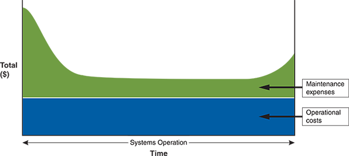
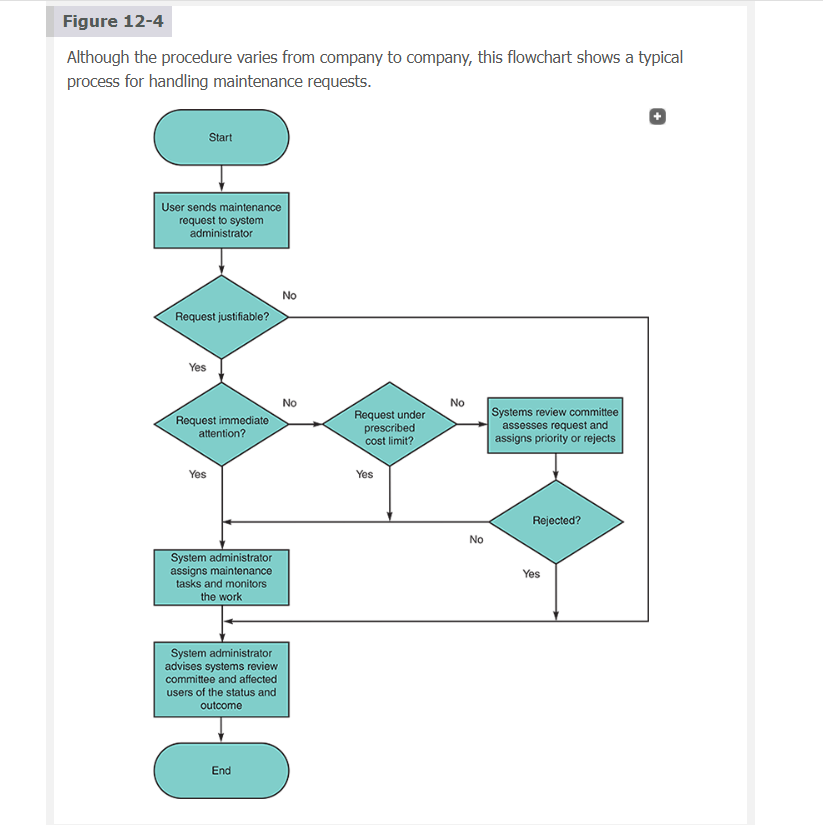
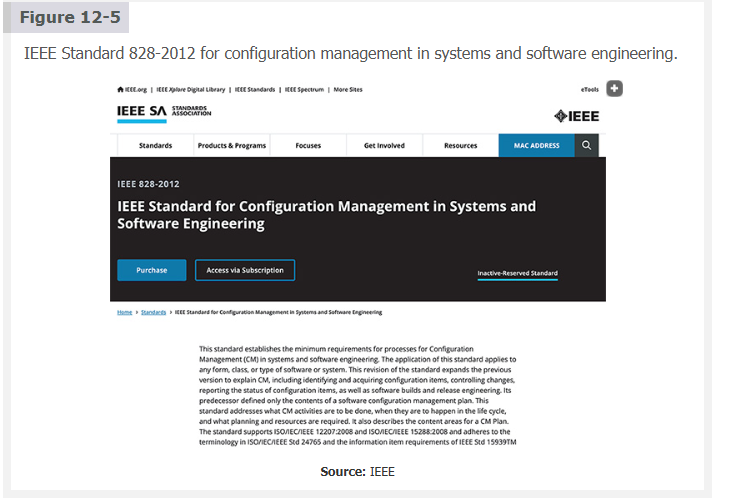
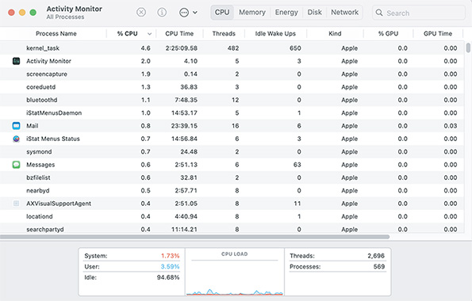
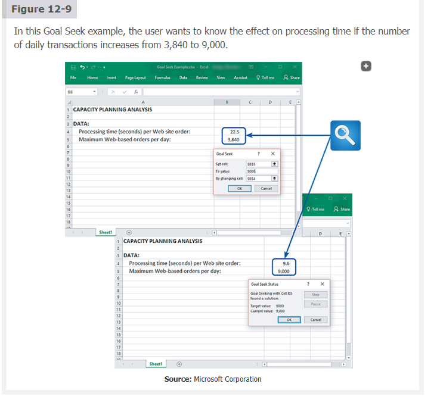
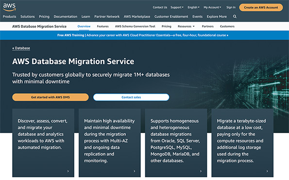

# 📘 **Chapter 12 — Maintenance and Support**

# **Table of Contents (TOC)**

- [📘 **Chapter 12 — Maintenance and Support**](#-chapter-12--maintenance-and-support)
- [**Table of Contents (TOC)**](#table-of-contents-toc)
  - [**Chapter Introduction**](#chapter-introduction)
    - [**🦾📚 “Here’s What You’ll Be Capable of After This Chapter”**](#-heres-what-youll-be-capable-of-after-this-chapter)
    - [**🛠️🚀 “Welcome to the Operations Phase, Where Systems Either Shine or Fall Apart Dramatically”**](#️-welcome-to-the-operations-phase-where-systems-either-shine-or-fall-apart-dramatically)
    - [**⚖️🤯 “The Ethical Dilemma: Ship the Patch or Break the System?”**](#️-the-ethical-dilemma-ship-the-patch-or-break-the-system)
    - [**🔍 Explanation (Straight Talk)**](#-explanation-straight-talk)
    - [**🧠 Notes (Clear \& Study-Ready)**](#-notes-clear--study-ready)
  - [](#)
  - [**12.1 User Support and Training**](#121-user-support-and-training)
    - [**🧑‍🏫💡 “Why Users Treat the Systems Analyst Like Their Personal Tech Guru”**](#-why-users-treat-the-systems-analyst-like-their-personal-tech-guru)
    - [**🏢🔥 “IT Departments Spend Half Their Time Keeping Existing Systems Alive”**](#-it-departments-spend-half-their-time-keeping-existing-systems-alive)
    - [**🧩🌍 “Support Can Be `In-House`, `Outsourced`, or a Power `Combo` of Both”**](#-support-can-be-in-house-outsourced-or-a-power-combo-of-both)
    - [**🔍 Explanation (Sharp \& Straightforward)**](#-explanation-sharp--straightforward)
    - [**🧠 Notes (Clean \& Study-Ready)**](#-notes-clean--study-ready)
    - [**12.1.1 Training Programs**](#1211-training-programs)
      - [**🎓🚀 “Training Programs Turn Regular Users Into System Superheroes”**](#-training-programs-turn-regular-users-into-system-superheroes)
      - [**👩‍🏫📘 “User Training Is Never One-and-Done — It’s a Lifelong Subscription”**](#-user-training-is-never-one-and-done--its-a-lifelong-subscription)
      - [**🧠⚡ “Advanced Training Turns Power Users Into In-House Wizards”**](#-advanced-training-turns-power-users-into-in-house-wizards)
      - [**📚🌱 “Continuous Learning Keeps an Organization Smart, Flexible, and Future-Proof”**](#-continuous-learning-keeps-an-organization-smart-flexible-and-future-proof)
      - [**🔍 Explanation (Clear + Engaging)**](#-explanation-clear--engaging)
      - [**🧠 Notes (Readable, Smooth, Useful)**](#-notes-readable-smooth-useful)
    - [**12.1.2 Support Services**](#1212-support-services)
      - [**🛟💬 “Support Services: The Lifeline Between Humans and Their Misbehaving Technology”**](#-support-services-the-lifeline-between-humans-and-their-misbehaving-technology)
      - [**☎️🧑‍🔧 “Help Desks: The Front-Line Heroes of User Chaos Management”**](#️-help-desks-the-front-line-heroes-of-user-chaos-management)
      - [**🌐📚 “Online Support Portals: The 24/7 Self-Service Library of User Wisdom”**](#-online-support-portals-the-247-self-service-library-of-user-wisdom)
      - [**👥💡 “Community Forums: Where Users Become Mentors, Advisors, and Problem-Solving Ninjas”**](#-community-forums-where-users-become-mentors-advisors-and-problem-solving-ninjas)
      - [**🔍 Explanation (Straight and Lively)**](#-explanation-straight-and-lively)
      - [**🧠 Notes (Clean, Clear, Minimal Bullets Where Needed)**](#-notes-clean-clear-minimal-bullets-where-needed)
    - [**12.1.3 Managing Outsourcing**](#1213-managing-outsourcing)
      - [**🤝🌐 “Managing Outsourcing: When Your Support Team Lives Across the Map”**](#-managing-outsourcing-when-your-support-team-lives-across-the-map)
      - [**💸⚠️ “Outsourcing Issues: Saving Money Without Losing Your Mind (or Your Data)”**](#️-outsourcing-issues-saving-money-without-losing-your-mind-or-your-data)
      - [**📑🤝 “Vendor Management: Choosing Good Partners and Keeping Them Good”**](#-vendor-management-choosing-good-partners-and-keeping-them-good)
      - [**🧪🌟 “Quality Assurance: Keeping Outsourced Services from Going Rogue”**](#-quality-assurance-keeping-outsourced-services-from-going-rogue)
      - [**🔍 Explanation (Straight Talk)**](#-explanation-straight-talk-1)
      - [**🧠 Notes (Clear, Balanced, Bullet-Assisted for Structure)**](#-notes-clear-balanced-bullet-assisted-for-structure)
  - [**12.2 Maintenance Tasks**](#122-maintenance-tasks)
    - [**🛠️📉 “Maintenance Tasks: Where Costs, Time, and Sanity Intersect”**](#️-maintenance-tasks-where-costs-time-and-sanity-intersect)
    - [**🔍 Explanation (Clear, Direct, and Fun)**](#-explanation-clear-direct-and-fun)
    - [**🧠 Notes (Clear, Study-Ready, Light Bullets Where Helpful)**](#-notes-clear-study-ready-light-bullets-where-helpful)
    - [**12.2.1 Types of Maintenance**](#1221-types-of-maintenance)
      - [**🔍 Explanation (Clear and Engaging)**](#-explanation-clear-and-engaging)
      - [**🧠 Notes (Clear, Smooth, Light Bullets)**](#-notes-clear-smooth-light-bullets)
    - [**12.2.2 Corrective Maintenance**](#1222-corrective-maintenance)
      - [**🔍 Explanation**](#-explanation)
      - [**🧠 Notes (Clear + Light Bulleting)**](#-notes-clear--light-bulleting)
    - [**12.2.3 Adaptive Maintenance**](#1223-adaptive-maintenance)
      - [**🔍 Explanation (Direct + Engaging)**](#-explanation-direct--engaging)
      - [**🧠 Notes (Clear, Smooth, Light Bullets Where Helpful)**](#-notes-clear-smooth-light-bullets-where-helpful)
    - [**12.2.4 Perfective Maintenance**](#1224-perfective-maintenance)
      - [**🔍 Explanation (Clear + Practical)**](#-explanation-clear--practical)
      - [**🧠 Notes (Smooth + Light Bullets)**](#-notes-smooth--light-bullets)
    - [**12.2.5 Preventive Maintenance**](#1225-preventive-maintenance)
      - [**📘💡 Explanation**](#-explanation-1)
      - [**🧠✨ Notes**](#-notes)
  - [**12.3 Maintenance Operations Management**](#123-maintenance-operations-management)
    - [**📘💡 Explanation**](#-explanation-2)
    - [**🧠✨ Notes**](#-notes-1)
    - [**12.3.1 The Maintenance Team**](#1231-the-maintenance-team)
- [**🖥️🔐 System Administrator**](#️-system-administrator)
- [**🧠🕵️ Systems Analysts**](#️-systems-analysts)
- [**💻⚙️ Programmers**](#️-programmers)
- [**📘💡 Explanation**](#-explanation-3)
- [**🧠✨ Notes**](#-notes-2)
    - [**12.3.2 Roles and Responsibilities**](#1232-roles-and-responsibilities)
      - [**🏗️📡 Team Structure**](#️-team-structure)
      - [**🤝🔗 Collaboration and Coordination**](#-collaboration-and-coordination)
      - [**📚💡 Skill Development**](#-skill-development)
      - [**📘💡 Explanation**](#-explanation-4)
      - [**🧠✨ Notes**](#-notes-3)
    - [**12.3.3 Handling Maintenance Requests**](#1233-handling-maintenance-requests)
  - [](#-1)
    - [**📥🔧 Request Intake Process**](#-request-intake-process)
      - [**🔺📊 Prioritization Criteria**](#-prioritization-criteria)
      - [**📊📈 Tracking and Reporting**](#-tracking-and-reporting)
      - [**📘💡 Explanation**](#-explanation-5)
      - [**🧠✨ Notes**](#-notes-4)
    - [**12.3.4 Prioritizing Maintenance Work**](#1234-prioritizing-maintenance-work)
      - [**📌📊 Establishing Priorities**](#-establishing-priorities)
      - [**🧩📉 Impact Analysis**](#-impact-analysis)
      - [**📣🤝 Stakeholder Communication**](#-stakeholder-communication)
      - [**📘💡 Explanation**](#-explanation-6)
      - [**🧠✨ Notes**](#-notes-5)
    - [**12.3.5 Maintenance Process Improvement**](#1235-maintenance-process-improvement)
      - [**📊🧠 Analytical Review and Feedback**](#-analytical-review-and-feedback)
      - [**🤖🚀 Technological Integration and Innovation**](#-technological-integration-and-innovation)
      - [**🌱🔄 Cultivating Continuous Improvement**](#-cultivating-continuous-improvement)
      - [**📘💡 Explanation**](#-explanation-7)
      - [**🧠✨ Notes**](#-notes-6)
  - [**12.4 Configuration Management**](#124-configuration-management)
      - [**📘💡 Explanation**](#-explanation-8)
      - [**🧠✨ Notes**](#-notes-7)
    - [**12.4.1 Maintenance Releases**](#1241-maintenance-releases)
      - [**📘💡 Explanation**](#-explanation-9)
      - [**🧠✨ Notes**](#-notes-8)
    - [**12.4.2 Version Control**](#1242-version-control)
      - [**📘💡 Explanation**](#-explanation-10)
      - [**🧠✨ Notes**](#-notes-9)
    - [**12.4.3 Baselines**](#1243-baselines)
      - [**📘💡 Explanation**](#-explanation-11)
      - [**🧠✨ Notes**](#-notes-10)
  - [](#-2)
  - [**12.5 System Performance Management**](#125-system-performance-management)
      - [**📘💡 Explanation**](#-explanation-12)
      - [**🧠✨ Notes**](#-notes-11)
    - [**12.5.1 Fault Management**](#1251-fault-management)
      - [**📘💡 Explanation**](#-explanation-13)
      - [**🧠✨ Notes**](#-notes-12)
    - [**12.5.2 Performance and Workload Measurement**](#1252-performance-and-workload-measurement)
      - [**⏱️🖱️ Response Time**](#️️-response-time)
      - [**📡📶 Bandwidth and Throughput**](#-bandwidth-and-throughput)
      - [**📊📈 Additional Performance Metrics**](#-additional-performance-metrics)
      - [**🔁📮 Turnaround Time**](#-turnaround-time)
      - [**📘💡 Explanation**](#-explanation-14)
      - [**🧠✨ Notes**](#-notes-13)
    - [**12.5.3 Capacity Planning**](#1253-capacity-planning)
      - [**📘💡 Explanation**](#-explanation-15)
      - [**🧠✨ Notes**](#-notes-14)
  - [**12.6 Quality Assurance in System Support**](#126-quality-assurance-in-system-support)
    - [**📘💡 Explanation**](#-explanation-16)
    - [**🧠✨ Notes**](#-notes-15)
    - [**12.6.1 QA Strategies**](#1261-qa-strategies)
      - [**🛠️🔐 QA in Maintenance**](#️-qa-in-maintenance)
      - [**🙋‍♂️💬 QA in User Support**](#️-qa-in-user-support)
      - [**🔄🚀 Continuous Improvement Processes**](#-continuous-improvement-processes)
      - [**📘💡 Explanation**](#-explanation-17)
      - [**🧠✨ Notes**](#-notes-16)
    - [**12.6.2 Testing Practices**](#1262-testing-practices)
      - [**🔧🧪 Maintenance Testing**](#-maintenance-testing)
      - [**🔁🧩 Regression Testing**](#-regression-testing)
      - [**⚡📈 Performance Testing**](#-performance-testing)
      - [**📘💡 Explanation**](#-explanation-18)
      - [**🧠✨ Notes** (light bulleting as you asked)](#-notes-light-bulleting-as-you-asked)
    - [**12.6.3 Feedback and Improvement**](#1263-feedback-and-improvement)
      - [**📝💡 Collecting User Feedback**](#-collecting-user-feedback)
      - [**📊🧠 Feedback Analysis**](#-feedback-analysis)
      - [**⚙️🚀 Implementing Improvements**](#️-implementing-improvements)
      - [**📘💡 Explanation**](#-explanation-19)
      - [**🧠✨ Notes**](#-notes-17)
  - [**12.7 Security Management in Maintenance**](#127-security-management-in-maintenance)
    - [**📘💡 Explanation**](#-explanation-20)
    - [**🧠✨ Notes**](#-notes-18)
    - [**12.7.1 Security Updates**](#1271-security-updates)
      - [**🔍⚠️ Identifying Security Risks**](#️-identifying-security-risks)
      - [**🛠️🩹 Patch Management**](#️-patch-management)
      - [**📜🛡️ Compliance and Standards**](#️-compliance-and-standards)
      - [**🩸🚨 Case in Point 12.2 — HealthFirst Clinics**](#-case-in-point-122--healthfirst-clinics)
      - [**📘💡 Explanation**](#-explanation-21)
      - [**🧠✨ Notes**](#-notes-19)
    - [**12.7.2 Security Audits**](#1272-security-audits)
      - [**📑🧪 Audit Procedures**](#-audit-procedures)
      - [**🛰️⚠️ Vulnerability Scanning**](#️️-vulnerability-scanning)
      - [**🛠️🚧 Mitigation Strategies**](#️-mitigation-strategies)
      - [**📘💡 Explanation**](#-explanation-22)
      - [**🧠✨ Notes**](#-notes-20)
    - [**12.7.3 Data Protection**](#1273-data-protection)
      - [**🗄️🔄 Backup Strategies**](#️-backup-strategies)
      - [**♻️🧰 Data Recovery Processes**](#️-data-recovery-processes)
      - [**🕵️‍♂️🔒 Privacy Considerations**](#️️-privacy-considerations)
      - [**📘💡 Explanation**](#-explanation-23)
      - [**🧠✨ Notes**](#-notes-21)
  - [](#-3)
  - [**12.8 Documentation and Knowledge Management**](#128-documentation-and-knowledge-management)
    - [**📘💡 Explanation**](#-explanation-24)
    - [**🧠✨ Notes**](#-notes-22)
  - [12.8.1 Comprehensive Documentation Strategy](#1281-comprehensive-documentation-strategy)
    - [**📏🧩 Setting Documentation Standards**](#-setting-documentation-standards)
    - [**📚🙋 Developing User Manuals and Guides**](#-developing-user-manuals-and-guides)
    - [**🛠️📘 Technical Documentation for Maintenance**](#️-technical-documentation-for-maintenance)
    - [**📘💡 Explanation**](#-explanation-25)
    - [🧩 Documentation Standards](#-documentation-standards)
    - [📚 User Manuals \& Guides](#-user-manuals--guides)
    - [🛠️ Technical Documentation](#️-technical-documentation)
    - [**🧠✨ Notes**](#-notes-23)
  - [12.8.2 Knowledge Base and Content Accessibility](#1282-knowledge-base-and-content-accessibility)
    - [**🏗️📖 Building a Knowledge Base**](#️-building-a-knowledge-base)
    - [**🗂️✨ Content Management Strategies**](#️-content-management-strategies)
    - [**🔐🛡️ Access Control and Security**](#️-access-control-and-security)
    - [**📘💡 Explanation**](#-explanation-26)
    - [**🧠✨ Notes**](#-notes-24)
  - [12.8.3 Enhancing Support through Documentation](#1283-enhancing-support-through-documentation)
    - [**🙋‍♀️📘 Self-Service Support through Documentation**](#️-self-service-support-through-documentation)
    - [**🤝📚 Integrating Documentation with Help Desks**](#-integrating-documentation-with-help-desks)
    - [**🔄🧠 Feedback Loops for Continuous Improvement**](#-feedback-loops-for-continuous-improvement)
    - [**📘💡 Explanation**](#-explanation-27)
    - [**🧠✨ Notes**](#-notes-25)
  - [**12.9 System Retirement and Transition**](#129-system-retirement-and-transition)
    - [🌈🔥 Quick Breakdown \& Explanation](#-quick-breakdown--explanation)
    - [🌄 1. Planning for Retirement](#-1-planning-for-retirement)
    - [🚚 2. Data Migration](#-2-data-migration)
    - [🧹 3. Decommissioning Procedures](#-3-decommissioning-procedures)
    - [🚀 4. Transition to New Systems](#-4-transition-to-new-systems)
    - [📦 5. Archiving + Documentation](#-5-archiving--documentation)
    - [🔥💡 Why This Matters](#-why-this-matters)
    - [**12.9.1 Planning for Retirement**](#1291-planning-for-retirement)
      - [🏁📉 **Identifying Retirement Criteria**](#-identifying-retirement-criteria)
      - [🗺️🔧 **Retirement Planning Process**](#️-retirement-planning-process)
      - [🗣️🤝 **Stakeholder Communication**](#️-stakeholder-communication)
      - [⭐ **Explanation**](#-explanation-28)
      - [**1. Identifying retirement criteria**](#1-identifying-retirement-criteria)
      - [**2. Retirement planning process**](#2-retirement-planning-process)
      - [**3. Stakeholder communication**](#3-stakeholder-communication)
- [📝 **Notes (Light Bullets, Clear \& Readable)**](#-notes-light-bullets-clear--readable)
    - [**12.9.2 Data Migration**](#1292-data-migration)
      - [🔍 **Assessing Data Migration Needs**](#-assessing-data-migration-needs)
      - [🛠️📤 **Planning and Executing Data Migration**](#️-planning-and-executing-data-migration)
      - [✔️📊 **Data Integrity and Validation**](#️-data-integrity-and-validation)
      - [🧠⭐ **Explanation (Expanded + Emoji Energy)**](#-explanation-expanded--emoji-energy)
      - [**1. Assessment = What stays, what goes, what dies**](#1-assessment--what-stays-what-goes-what-dies)
      - [**2. Planning + Execution = The choreography**](#2-planning--execution--the-choreography)
    - [**3. Validation = Trust but verify**](#3-validation--trust-but-verify)
      - [📝 **Notes (Light Bullets)**](#-notes-light-bullets)
    - [**12.9.3 Decommissioning Procedures**](#1293-decommissioning-procedures)
      - [🧾🔍 **Decommissioning Steps**](#-decommissioning-steps)
      - [🌎♻️ **Environmental Considerations for Hardware Disposal**](#️-environmental-considerations-for-hardware-disposal)
      - [⚖️🛡️ **Legal and Compliance Issues**](#️️-legal-and-compliance-issues)
      - [⭐🧠 **Explanation (Expanded + Humor + Emoji Energy)**](#-explanation-expanded--humor--emoji-energy)
      - [**1. Decommissioning is not “just turn it off.”**](#1-decommissioning-is-not-just-turn-it-off)
      - [**2. E-waste is a *serious* problem.**](#2-e-waste-is-a-serious-problem)
      - [**3. Compliance is EVERYTHING.**](#3-compliance-is-everything)
      - [📝 **Notes (Light Bullets Only)**](#-notes-light-bullets-only)
    - [**12.9.4 Transition to New Systems**](#1294-transition-to-new-systems)
      - [🧭📌 **Transition Planning**](#-transition-planning)
      - [🧯🕒 **Minimizing Disruption to Operations**](#-minimizing-disruption-to-operations)
      - [🎓🧑‍💻 **Training Users on New Systems**](#-training-users-on-new-systems)
      - [⭐🧠 **Explanation (Expanded — playful, clear, technical, emoji-rich)**](#-explanation-expanded--playful-clear-technical-emoji-rich)
      - [⚙️ 1. Transitions break things.](#️-1-transitions-break-things)
      - [👥 2. Humans resist change.](#-2-humans-resist-change)
      - [🧪 3. Phased rollouts save careers.](#-3-phased-rollouts-save-careers)
      - [🧠 4. Communication is the glue.](#-4-communication-is-the-glue)
      - [📝 **Notes (small bullets, max value)**](#-notes-small-bullets-max-value)
    - [**12.9.5 Archiving and Documentation**](#1295-archiving-and-documentation)
      - [📦📌 **Archiving Important Data and Documentation**](#-archiving-important-data-and-documentation)
      - [🔓🗂️ **Maintaining Access to Archived Information**](#️-maintaining-access-to-archived-information)
      - [📜🏁 **Closing Documentation and Final Reporting**](#-closing-documentation-and-final-reporting)
      - [**Expanded Explanation**](#expanded-explanation)
      - [🧟‍♂️ **1. Archiving is literally giving your old system a funeral… but keeping the body.**](#️-1-archiving-is-literally-giving-your-old-system-a-funeral-but-keeping-the-body)
      - [🗄️ **2. Documentation is that coworker who always wants receipts.**](#️-2-documentation-is-that-coworker-who-always-wants-receipts)
      - [🧙‍♂️ **3. Archiving decisions = sorting Hogwarts artifacts.**](#️-3-archiving-decisions--sorting-hogwarts-artifacts)
      - [👨‍💻 **4. Maintaining access is basically IT gatekeeping.**](#-4-maintaining-access-is-basically-it-gatekeeping)
      - [🏁 **5. Final reporting = the credits scene nobody stays for but everyone needs.**](#-5-final-reporting--the-credits-scene-nobody-stays-for-but-everyone-needs)
      - [📝 **Notes**](#-notes-26)
- [**Chapter Review**](#chapter-review)
  - [**Summary**](#summary)
  - [**Key Terms**](#key-terms)
  - [**Review Questions**](#review-questions)
  - [**Discussion Topics**](#discussion-topics)
  - [**Hands-On Projects**](#hands-on-projects)
  - [**Ethical Issues**](#ethical-issues)


---

## **Chapter Introduction**


### **🦾📚 “Here’s What You’ll Be Capable of After This Chapter”**

Learning Objectives
When you finish this chapter, you should be able to:
Describe the role of user support and training in system usability and user satisfaction.
Define the purpose of the different maintenance tasks in IT system upkeep.
Outline organizing maintenance operations: forming teams and setting task priorities.
Explain how configuration management ensures IT system stability during updates.
Describe how fault management and capacity planning enhance IT system efficiency.
List quality assurance components in system support and their service impact.
Explain how regular security updates and audits secure IT systems.
Identify the benefits of updated documentation and knowledge bases for users.
Outline the steps for planning and executing IT system retirement and transition.

---

### **🛠️🚀 “Welcome to the Operations Phase, Where Systems Either Shine or Fall Apart Dramatically”**

Chapter 12 is the first chapter in the operations phase of the SDLC. The first step in this phase is maintenance and support, which emphasizes the essential practices and strategies for ensuring IT systems operate efficiently, securely, and in alignment with user needs. It covers a broad spectrum of activities, from user training and technical support to regular maintenance tasks, system performance management, the careful planning required for system updates, security management, and the eventual retirement and transition to new technologies.

---

### **⚖️🤯 “The Ethical Dilemma: Ship the Patch or Break the System?”**

The chapter includes three “Case in Point” discussion questions to help contextualize the concepts described in the text. The “Ethical Issues” scenario concerns a directive to skip regression testing for a critical security patch due to tight deadlines. The ethical dilemma revolves around balancing the urgency of security improvements against the potential risk of introducing new system issues.

---

### **🔍 Explanation (Straight Talk)**

This intro sets the tone for the most **thankless but absolutely critical** phase of the SDLC: operations. Everything you built in Chapters 1–11? This is where you find out whether it holds up under real people doing real chaotic things.

The chapter’s objectives highlight the real purpose of this phase:
keeping a system usable, stable, secure, and—ideally—unbroken.

Maintenance isn’t one thing. It’s user training, troubleshooting, performance monitoring, updates, patches, risk management, documentation cleanup, and ultimately system retirement. In other words, it’s the everyday grind that determines whether a system becomes legendary or infamous.

The ethical dilemma is classic IT whiplash:
urgent patch → skip testing → pray nothing breaks.
It highlights the constant tension between **speed** and **safety**, and the reality that quick solutions often become long-term disasters if you’re not careful.

This chapter asks you to think like someone responsible for the health and survival of the system—not just its creation.

---

### **🧠 Notes (Clear & Study-Ready)**

Maintenance is the marathon phase of the SDLC. Once a system goes live, the real work begins. Operations is where performance issues surface, users need help, updates introduce risks, and security must be constantly reinforced. Training matters because a knowledgeable user base cuts down on errors and reduces support load. Maintenance tasks come in several flavors—fixing bugs, adapting to new environments, improving speed, and preventing future failures. Configuration management ensures updates don’t create chaos or break other components. Performance and capacity monitoring help detect strain early so the system stays responsive. Quality assurance remains active even after deployment, keeping service reliability consistent. Security is an ongoing battle, requiring regular patches and audits. Documentation must stay current to support both technical staff and end users. When a system reaches the end of its useful life, careful planning ensures a smooth transition, safe data migration, and clean decommissioning.

---

**Nav:** ➡️ [Next: 12.1 User Support and Training](#121-user-support-and-training) · 🏠 [Back to TOC](#chapter-12--maintenance-and-support)

<br>
<br>
<br>
---


## **12.1 User Support and Training**


### **🧑‍🏫💡 “Why Users Treat the Systems Analyst Like Their Personal Tech Guru”**

A systems analyst functions similarly to an in-house consultant, offering users essential **guidance**, **support**, and **training**. Interestingly, the most successful systems often require the greatest level of support. This is because users are eager to explore and master the system’s features, fully leverage its capabilities, and understand how it can enhance their work performance.

---

### **🏢🔥 “IT Departments Spend Half Their Time Keeping Existing Systems Alive”**

In a typical organization, over half of the IT department’s efforts are dedicated to supporting existing systems, underscoring the critical nature of this support. This significant investment highlights the importance of maintaining and enhancing system functionality to meet evolving user needs and organizational goals. Companies implement `various user support mechanisms` to fulfill these needs, including comprehensive user training programs and help desks that provide technical support and assistance.

---

### **🧩🌍 “Support Can Be `In-House`, `Outsourced`, or a Power `Combo` of Both”**

This support infrastructure can be managed internally or through outsourcing, depending on the organization’s **resources** and strategic **priorities**. Leveraging external expertise through outsourcing can often complement internal efforts, providing scalability and specialized skills that enhance overall support quality. Such arrangements ensure that users receive the help they need to utilize the systems effectively, thereby maximizing the investment in technology.

---

### **🔍 Explanation (Sharp & Straightforward)**

This section highlights one universal truth: **a system is only as good as the support behind it**. Users will always have questions, always explore features you didn’t expect them to notice, and always need guidance to become effective with new tools. That’s why the systems analyst isn’t just a designer—they become a coach, translator, firefighter, and sometimes therapist for confused users.

The text also emphasizes how much energy IT organizations spend on support. New projects might feel exciting, but day-to-day stability is what keeps the business running. Training programs, help desks, and support channels exist because users need ongoing reinforcement long after installation day.

Finally, it explains that support strategy depends on the organization. Some companies keep everything in-house, others outsource, and many mix both to get flexibility and deeper expertise. The goal is always the same: make sure users feel empowered, confident, and capable of using the systems the organization invested in.

---

### **🧠 Notes (Clean & Study-Ready)**

User support is a major part of IT operations, often consuming more than half of a department’s workload. Successful systems attract more user engagement, which increases the demand for guidance and training. Analysts act as internal consultants, helping users navigate features, solve problems, and build confidence. Organizations rely on structured programs—training sessions, documentation, help desks, and technical support—to maintain productivity. Support can be handled internally or outsourced to bring in scalability and specialized skills. Effective support ensures users fully benefit from the system and improves the return on technological investment.

---


### **12.1.1 Training Programs**

#### **🎓🚀 “Training Programs Turn Regular Users Into System Superheroes”**

Training programs are pivotal in empowering users to harness the full capabilities of a system, `ensuring they can navigate its complexities and utilize its features` to enhance their work efficiency. Starting with user training, these programs lay the groundwork for all users, acquainting them with the system’s basic functionalities and interface. The curriculum then proceeds to advanced training for `power users`, where more sophisticated features and customization options are explored ✨, catering to users who seek to leverage the system for complex tasks and optimization. Finally, `continuous learning and development` 📈 keeps users abreast of new updates and best practices, adapting to the evolving nature of technology and business needs. By covering these key areas, training programs aim to build a proficient user base capable of maximizing the system’s potential to drive organizational success.

---

#### **👩‍🏫📘 “User Training Is Never One-and-Done — It’s a Lifelong Subscription”**

Within the broader framework of user training, it’s crucial to `recognize that the learning process is both an initial and an ongoing endeavor`. The importance of foundational training during the rollout of a new system was underscored earlier in the book, setting the stage for users to understand and embrace the technology from day one 🌅.

However, the IT department’s responsibility extends far beyond this initial phase. As new employees join the organization 🚶‍♂️🚶‍♀️, they too require comprehensive training to familiarize themselves with the company’s information systems.

Moreover, the evolution of technology and business processes necessitates periodic system updates 🔄. Significant modifications or new versions prompt the development of specialized training packages tailored to the changes. These often include online help tools 💬, support websites 🌐, updated guides 📚, supplemental manuals 📝, or even formal training sessions 🧑‍🏫.

The essence of training on system changes mirrors initial rollout training: show users how updates make their work easier, faster, or more effective 💪.

---

#### **🧠⚡ “Advanced Training Turns Power Users Into In-House Wizards”**

Advanced training for power users takes system mastery to the next level. It focuses on users who don’t just use the system — they push it, stretch it, and occasionally try to break it on purpose 🔍💥 (for science).

This training uncovers advanced features, customization options 🛠️, automation capabilities, and deeper integration tools. It empowers users who want to excel beyond routine workflows and optimize their department’s operations.

Power users become internal champions 🏆 — the people coworkers go to when something confusing pops up. They troubleshoot, mentor, and even influence the system’s future development by providing expert-level feedback. Their hands-on experience makes them valuable partners for analysts and developers alike.

---

#### **📚🌱 “Continuous Learning Keeps an Organization Smart, Flexible, and Future-Proof”**

Continuous learning and development embraces the reality that technology evolves nonstop 🔧➡️🤖. New features roll out. Interfaces change. Best practices shift. Users need regular updates to stay effective.

This component of training delivers workshops 🧑‍🏫, system-update briefings 📣, and online resource libraries 📂 full of tutorials and knowledge articles. It ensures that beginners, intermediates, and power users all have access to up-to-date information.

Ongoing education reinforces organizational competency and keeps the workforce agile and adaptable. It fosters a culture of curiosity 💡, innovation 🚀, and self-improvement. Access to continuously updated resources empowers users to learn at their own pace 🕒, deepening their skills in areas relevant to their roles.

Ultimately, continuous learning unlocks the full return on technology investments, ensuring that systems remain fully utilized and capable of supporting the organization’s strategic goals 🎯.

---

#### **🔍 Explanation (Clear + Engaging)**

This section lays out the three pillars of user education: **foundational training**, **advanced training** for power users, and **ongoing development**. It recognizes that users need different kinds of instruction depending on experience, role, and ambition.

The `first` layer — basic training — is about getting everyone up and running confidently. It’s essential for onboarding new hires and establishing comfort with a new system.

The `second` layer focuses on the curious and the ambitious: users who want to master advanced workflows, custom settings, and integrations. These users become invaluable teammates because they help support others and provide deep insights into how the system is used day to day.

The `final` layer — continuous learning — treats training as a long-term investment. Systems evolve, so user knowledge must evolve with them. Regular updates keep the organization aligned, reduce frustration, and ensure the system continues to deliver value.

Overall, training isn’t a checkbox — it’s a strategic practice that turns technology from a tool into a competitive advantage.

---

#### **🧠 Notes (Readable, Smooth, Useful)**

Training programs shape how effectively users interact with a system. Foundational training equips new and existing employees with the essentials needed to use the system confidently. As the system evolves and updates roll out, recurring training packages ensure users stay aligned with new features and improvements.

Advanced training creates a layer of expert users who can support others, troubleshoot issues, and influence the system’s ongoing evolution. These individuals become internal specialists who enhance organizational knowledge.

Continuous learning close the loop by recognizing that user education never stops. Workshops, online resources, and update sessions maintain organizational competence and encourage innovation. This ongoing investment ensures that the system delivers long-term value and empowers users to work efficiently and adapt to new technologies.

---


### **12.1.2 Support Services**

#### **🛟💬 “Support Services: The Lifeline Between Humans and Their Misbehaving Technology”**

**Support services** are an essential pillar of user satisfaction and system efficiency, `a bridge 🌉 between the technical complexities of a system and its everyday users`. By offering a robust framework of assistance through help desks 💻, online support portals 🌐, and community forums 👥, organizations can significantly enhance the user experience, ensuring that help is readily available whenever needed.

A **help desk** becomes the **first stop for users** needing answers, fixes, or reassurance that their computer isn’t actually possessed 👻. Online portals provide self-service options packed with FAQs, guides, and troubleshooting tips 📚. Community forums turn users into mentors, coaches, and occasional comedians as they share tips, hacks, and “you won’t believe what just happened” stories 😂.

Together, these support channels create an ecosystem of assistance, helping users navigate the system effectively while cultivating efficiency, collaboration, and continuous improvement.

---

#### **☎️🧑‍🔧 “Help Desks: The Front-Line Heroes of User Chaos Management”**

A help desk—also called a `service desk`—is the front line of user support, offering quick access to human assistance. Staffed with skilled technicians 🧑‍💻, it resolves issues, answers questions, and guides users through all kinds of technical tangles. Whether via phone 📞, email ✉️, or live chat 💬, help desks make sure support is never more than a few taps away.

Because they interact with nearly every branch of the organization, help desk staff need strong interpersonal skills 🤝, solid technical knowledge 🛠️, and—most importantly—the patience of a saint. Proper documentation of every case builds a valuable knowledge base 📘 and reveals trends that help the IT team improve the system and training materials.

Help desks also act as early-warning systems 🚨, spotting recurring issues and user pain points. Remote access tools like GoToMyPC 🖥️➡️📱 allow staff to jump directly into a user’s screen and solve problems instantly. Add in video chat and screen-sharing and suddenly troubleshooting becomes faster, clearer, and way less frustrating for both sides.

On any given day, help desk staff might:

* Show a user how to create a custom report 📊
* Reset passwords 🔐
* Demonstrate advanced system features 🧩
* Recover damaged data 🩹
* Teach someone how to use the intranet 🌐
* Walk through hardware setup 🖨️📡
* Provide software licensing info 🧾
* Troubleshoot software issues using remote utilities 🛜

Help desks are the communication hub 🚏 connecting users to IT. Because a frustrated user who knows more than the support rep is a recipe for disaster 😬, organizations must hire sharp, well-trained staff who can solve problems quickly and confidently. Empowerment is key — reps must be able to act without waiting for three layers of approval.

---

#### **🌐📚 “Online Support Portals: The 24/7 Self-Service Library of User Wisdom”**

Online support portals offer round-the-clock access to resources that help users solve problems on their own. FAQs ❓, step-by-step guides 📘, video tutorials 🎥, and diagnostic tools 🛠️ make these portals the self-serve buffet of user assistance.

These portals reduce help desk load by making it easy for users to handle simple issues independently. They also support **continuous learning**, letting users dig into advanced features, explore updates, or refine their skills at their own pace ⏳.

Most portals include feedback features ✍️ where users can suggest new topics or rate existing guides, giving IT clarity on what’s working and what needs improvement. This turns users into collaborators and co-architects of the support ecosystem.

---

#### **👥💡 “Community Forums: Where Users Become Mentors, Advisors, and Problem-Solving Ninjas”**

Community forums create a collaborative environment where users help each other, share experiences, and offer solutions. This peer support model taps into **collective intelligence** 🧠, providing perspectives and workarounds that formal documentation may overlook.

Forums also function as a `living archive` 📜. Past discussions become searchable wisdom for anyone facing similar issues. Expert moderators keep conversations organized, respectful, and constructive.

Beyond immediate help, forums build **community loyalty**, **engagement**, and **a sense of belonging** 🤝. Organizations also gain access to unfiltered user feedback, which can drive meaningful system refinement and innovation.

---

#### **🔍 Explanation (Straight and Lively)**

This section highlights why `support services are the nervous system of the entire IT ecosystem`. 

- Help desks answer questions and fix issues directly
- Portals empower users to solve problems independently
- Community forums allow everyone to learn from shared experiences

Together, they create a layered support structure that reduces downtime, improves user satisfaction, and increases system adoption. The text also emphasizes that `support is not just reactive — it’s strategic`. Proper **documentation**, **trend analysis**, and **user insights** help IT departments improve the system, refine training, and identify gaps in usability. Support services aren’t “extra”—they’re essential to keeping a system functional, efficient, and evolving.

---

#### **🧠 Notes (Clean, Clear, Minimal Bullets Where Needed)**

Support services form a multi-layered ecosystem that connects users with the assistance they need. 

**Help desks** provide direct, real-time support for technical problems and system questions. Because they interact with every department, help desk staff must combine technical strength with strong communication and patience. Their detailed documentation of requests helps identify trends and common issues, guiding improvements to the system and training.

 Remote access tools enhance help desk efficiency by letting technicians see and control a user’s screen directly, improving accuracy and speeding up resolution. 

**Online support portals** offer a comprehensive self-service library, reducing help desk load while enabling continuous user learning.

**Community forums** extend support through peer collaboration, giving users a space to share solutions, best practices, and feedback. These forums promote knowledge-sharing and build a sense of community around the system.


* Help desks = direct human support (phone, email, chat)
* Online portals = self-service resources
* Community forums = peer-to-peer collaboration

Together, they create a support network that improves user satisfaction, reduces downtime, and contributes to ongoing system refinement.

---


### **12.1.3 Managing Outsourcing**


#### **🤝🌐 “Managing Outsourcing: When Your Support Team Lives Across the Map”**

Managing outsourced services is a strategic approach that `helps organizations ensure the quality and efficiency of user support and training delivered by external vendors`. This involves navigating the challenges 🌪️ of relying on third parties for crucial support functions, practicing strong vendor management 🤝 to keep services aligned with organizational goals, and applying quality assurance 🔍 to ensure that outsourced providers meet the high standards users expect.

With effective outsourcing management, organizations can leverage outside expertise 🎓, expand their support capacity, and improve infrastructure without losing control of quality. This delicate balance lets companies offer timely, effective user assistance — boosting satisfaction and productivity across the board.

---

#### **💸⚠️ “Outsourcing Issues: Saving Money Without Losing Your Mind (or Your Data)”**

Outsourcing IT support and help desks is a widely adopted strategy because it can **dramatically reduce costs 💵**, **freeing up resources** for **innovation and development**. But outsourcing is not a magic wand — it introduces risks that must be actively managed.

Organizations must ensure their outsourced providers uphold **internal quality standards** 🎯, match operational needs, and fit the company’s culture. While outsourcing provides access to specialized talent ✨ and global flexibility 🌍, it also risks user frustration if quality slips or expectations aren’t met.

**Security** and **confidentiality** 🚨 are especially critical. Giving external teams access to sensitive systems and data requires strong protections: due diligence, regulatory compliance, airtight security protocols, and regular audits. Companies must weigh the benefits of cost efficiency against the potential costs of data breaches, damaged reputation, or decreased customer trust.

Ultimately, outsourcing works when oversight is active, communication is strong, SLAs are enforced, and performance is constantly monitored 👀.

---

#### **📑🤝 “Vendor Management: Choosing Good Partners and Keeping Them Good”**

Effective vendor management starts with smart vendor selection — evaluating providers based on expertise 🧠, reliability 🛡️, scalability 📈, and alignment with organizational needs. Once selected, vendors should become collaborative partners, not distant contractors.

Strong partnerships rely on:

* consistent **communication** 💬
* joint **planning** sessions 📅
* ongoing **feedback** loops 🔄
* clearly **defined SLAs(service-level agreement)** that outline responsibilities and expectations 📜

Once work begins, ongoing management is essential. Organizations must monitor performance using agreed metrics, address problems early, and collaborate on improvements. SLAs may need updates as technology evolves or needs change.

Well-managed vendors evolve with the organization, continuously improving their service quality and adapting to new goals.

---

#### **🧪🌟 “Quality Assurance: Keeping Outsourced Services from Going Rogue”**

Quality assurance in outsourced services ensures support and training standards remain high. When support quality dips — long wait times ⏳, weak troubleshooting 🤦‍♂️, poor online tools — users lose confidence fast.

A strong QA program includes:

* clear, measurable performance indicators 📊
* regular audits and compliance checks 🔍
* user surveys and feedback loops 🗣️
* continuous monitoring of response times, resolution rates, and accuracy

This proactive approach identifies problems early and keeps vendors accountable.

Continuous improvement is also essential:

* training vendor staff regularly 🎓
* updating support materials and documentation 📘
* integrating innovative support tools 💡

Strong QA ensures outsourcing enhances — not degrades — user experience and keeps support both effective and future-ready.

---

#### **🔍 Explanation (Straight Talk)**

This section explains why outsourcing is both powerful and risky. Companies outsource support to reduce costs and gain specialized expertise, but doing so requires close oversight. The text stresses that outsourcing is not a “set it and forget it” solution — organizations must manage vendors actively through SLAs, performance monitoring, and continuous feedback.

Vendor management is presented as a partnership. Clear expectations, collaborative planning, and frequent communication keep outsourced services aligned with business needs. Quality assurance ensures service standards never drift and lets companies detect issues before they impact users.

Security concerns remain a major theme. Any time sensitive data leaves internal systems, companies must exercise strict vigilance to protect themselves and their customers.

Overall, outsourcing works when organizations stay present, informed, and engaged.

---

#### **🧠 Notes (Clear, Balanced, Bullet-Assisted for Structure)**

Outsourcing can reduce costs and expand expertise, but it introduces risks that must be actively managed. Vendor selection and oversight ensure external providers meet quality and performance expectations. Strong SLAs, regular communication, and collaborative planning are essential to maintaining alignment.

Security and confidentiality concerns require due diligence, regulatory compliance, and frequent audits. Quality assurance must remain active, with performance metrics, audits, and feedback mechanisms used to monitor and improve service levels.

**Key points to remember:**

* Outsourcing offers **cost savings**, **scalability**, and **specialized expertise**.
* Risks include **loss of control**, **quality inconsistency**, and **security vulnerabilities**.
* Effective control requires **SLAs**, **audits**, **performance metrics**, and **constant communication**.
* QA and continuous improvement ensure outsourced support strengthens user experience rather than weakening it.

---


**Nav:** ⬅️ [Prev](#chapter-introduction) · ➡️ [Next: 12.2 Maintenance Tasks](#122-maintenance-tasks) · 🏠 [TOC](#chapter-12--maintenance-and-support)

<br>
<br>
<br>


## **12.2 Maintenance Tasks**


### **🛠️📉 “Maintenance Tasks: Where Costs, Time, and Sanity Intersect”**

The operations phase is essential to TCO because ongoing `maintenance expenses can determine a system’s economic life`. Figure 12-2 shows a typical pattern of operational and maintenance expenses during a system’s useful life. Operational costs include `supplies`, `equipment` rental, and `software` leases. Notice that the lower area shown in Figure 12-2 represents fixed **operational** expenses, while the upper area represents **maintenance** expenses.

**Figure 12-2**
The total cost of operating an information system includes operational and maintenance costs. Operational costs (blue) are relatively constant, while maintenance costs (green) vary over time.



A graph plots the total cost of operating an information system. The y-axis is labeled total in dollars and the x-axis is labeled time. It plots the constant shaded portion for the operational cost of the system, while the maintenance expenses vary from time to time. At the initial point, the maintenance expense of the system is maximum, decreases rapidly becomes constant in the middle, and again increases.

`Maintenance expenses vary significantly during the system’s operational life, including spending to support maintenance activities`. 

Maintenance activities include: *changing programs*, *procedures*, or *documentation* to ensure correct system performance, adapting the system to the evolving requirements, and making the system operate more efficiently. Different types of maintenance meet those needs.

---

### **🔍 Explanation (Clear, Direct, and Fun)**

This section introduces how maintenance shapes the **true cost** and **lifespan** of a system. The graph describes what every IT team already knows: maintenance costs behave like a roller coaster 🎢 — high at launch, stable in the middle, then rising again as the system ages. The fixed operational costs stay steady, but maintenance spikes whenever updates, fixes, or optimizations are needed.

The text also emphasizes that maintenance isn’t just “fixing bugs.” It includes updating documentation, refining procedures, optimizing performance, and adapting to new business requirements. As the environment changes — new tech, new policies, new users — the system must evolve too.

Because maintenance costs shift over time, they influence decisions like:
Is the system still worth maintaining?
Should we modernize it?
Is it time to retire it?

Maintenance is both a financial and operational heartbeat of the system.

---

### **🧠 Notes (Clear, Study-Ready, Light Bullets Where Helpful)**

Maintenance is a major part of the system’s total cost of ownership. While operational costs remain steady, maintenance expenses fluctuate — highest at rollout, lower in the middle, and rising again as the system ages. These costs include updates to programs, procedures, documentation, and performance improvements.

Maintenance ensures the system stays correct, adapts to new requirements, and operates efficiently.

**Maintenance tasks generally include:**

* **Corrective work:** fixing errors to restore proper operation.
* **Adaptive changes:** modifying the system for new rules, tech, or environments.
* **Perfective improvements:** increasing efficiency and usability.
* **Preventive work:** reducing future failures through proactive updates.

These tasks keep the system aligned with business needs and extend its economic life.

---


### **12.2.1 Types of Maintenance**

**🔧📊 “Types of Maintenance: The Four Forces That Shape a System’s Lifespan”**

Although some overlap exists, four types of maintenance tasks can be identified, as shown by the examples in Table 12-1. Corrective maintenance is performed to fix errors, adaptive maintenance adds new capabilities and enhancements, perfective maintenance improves efficiency, and preventive maintenance reduces the possibility of future system failure. Some analysts use the term maintenance to describe only corrective maintenance that fixes problems. It is helpful, however, to view the maintenance concept more broadly and identify the different types of tasks.

```cs
Table 12-1
Corrective maintenance fixes errors and problems. Adaptive maintenance enhances a system. Perfective maintenance improves a system’s efficiency, reliability, or maintainability. Preventive maintenance avoids future problems.

Examples of Maintenance Tasks

Corrective Maintenance
• Diagnose and fix logic errors
• Replace defective network cabling
• Restore proper configuration settings
• Debug program code
• Update drivers
• Utilize remote control software for problem diagnosis and resolution

Adaptive Maintenance
• Add online capability
• Add support for mobile devices
• Add new data entry field to input screen
• Install links to website
• Create employee portal

Perfective Maintenance
• Upgrade or replace outdated hardware
• Write macros to handle repetitive tasks
• Compress system files
• Optimize user desktop settings
• Upgrade wireless network capability
• Install more powerful network server

Preventive Maintenance
• Install new antivirus software
• Develop standard backup schedule, including off-site and cloud-based strategies
• Implement regular defragmentation process
• Analyze problem report for patterns
• Tighten all cable connections
• Develop user guide covering confidentiality rules and unauthorized use of company IT resources
```

Maintenance expenses are usually high when a system is implemented because **corrective maintenance** must detect, investigate, and resolve problems. Costs remain low once the system becomes stable and minor adaptive maintenance is involved. Eventually, both **adaptive** and **perfective** maintenance activities increase in a dynamic business environment.

**Near the end of a system’s useful life**, **adaptive** and **corrective** maintenance `expenses increase rapidly`,

 but **perfective** maintenance `typically decreases when it becomes clear that the company plans to replace the system`. Table 12-2 shows the typical patterns for each of the four classifications of maintenance activities over a system’s lifespan.

<br>

| Maintenance Type                        | Immediately After Implementation | Early Operational Life | Middle Operational Life | Later Operational Life |
|-----------------------------------------|----------------------------------|-------------------------|--------------------------|-------------------------|
| **Corrective Maintenance**              | High                             | Low                     | Low                      | High                    |
| **Adaptive Maintenance (Minor Enh.)**   | None                             | Medium                  | Medium                   | Medium                  |
| **Adaptive Maintenance (Major Enh.)**   | None                             | None                    | Medium to High           | Medium to High          |
| **Perfective Maintenance**              | Low                              | Low to Medium           | Medium                   | Low                     |
| **Preventive Maintenance**              | Low                              | Medium                  | Medium                   | Low                     |


---


<br>
<br>

#### **🔍 Explanation (Clear and Engaging)**

This section organizes maintenance into four categories so analysts can better understand how systems evolve and how costs shift over time.

Corrective maintenance focuses on fixing problems — the classic bugs, misconfigurations, broken connections, or software failures that emerge when a system first goes live. Adaptive maintenance responds to change: new devices, fields, features, or updated business processes. Perfective maintenance improves performance and efficiency, making the system smoother and more user-friendly. Preventive maintenance focuses on avoiding future failures by strengthening the system with updates, antivirus tools, backups, and routine maintenance practices.

The tables illustrate how costs fluctuate over the system’s lifetime. Early on, corrective costs dominate because new systems reveal hidden issues. As things stabilize, corrective costs drop, while adaptive and perfective maintenance take the lead as the business grows and evolves. In the later years, corrective and adaptive costs spike again as the system ages, breaks more often, and struggles to adapt. Perfective maintenance decreases because organizations typically stop investing heavily in improvements once a replacement becomes likely.

This breakdown helps analysts forecast maintenance workloads, budgeting, and system life cycle planning.

---

#### **🧠 Notes (Clear, Smooth, Light Bullets)**

Maintenance divides into four functional areas that support a system throughout its lifespan.
Corrective maintenance resolves errors that emerge during and after implementation. Adaptive maintenance adjusts the system to new requirements and business needs. Perfective maintenance improves efficiency and usability, while preventive maintenance reduces the risk of future issues.

**Maintenance cost patterns:**

* **Early life:** high corrective costs as issues surface.
* **Stable middle years:** adaptive and perfective tasks increase to support new processes and performance improvements.
* **End of life:** corrective and adaptive costs spike due to system aging; perfective tasks decline as the system approaches replacement.

These patterns help organizations plan budgets, understand resource needs, and determine when a system is nearing the end of its economic life.

<br>


### **12.2.2 Corrective Maintenance**


**🛠️🚨 “Corrective Maintenance: Putting Out Fires Without Starting New Ones”**

`Corrective maintenance` diagnoses and corrects errors in an operational system. To avoid introducing new problems, all maintenance work requires careful analysis before making changes. The ***best maintenance approach is a scaled-down version of the SDLC, where investigation, analysis, design, and testing are performed before implementing any solution***.
 Recall from earlier in the book the differences between a test environment and an operational environment. Any maintenance work that could affect the system must first be performed in the test environment and then migrated to the operational system.

IT support staff respond to errors in various ways, depending on the nature and severity of the problem. Most organizations have standard procedures for handling minor mistakes, such as an *incorrect report* title or an *improper format* for a data element. In a typical procedure, a user submits a system request that is evaluated, prioritized, and scheduled by the system administrator or the systems review committee. If the request is approved, the maintenance team designs, tests, documents, and implements a solution.

**could be email**

Many organizations use a standard online form for systems requests. In smaller firms, the process might be an informal email message. A user submits a system request with supporting evidence for more severe situations, such as incorrect report totals or inconsistent data. Those requests are prioritized, and a maintenance team begins work on the problem immediately.

The worst-case situation is a system failure. If an emergency occurs, the maintenance team bypasses the initial steps and tries to correct the problem immediately. This often requires a patch, a specially written software module that provides temporary repairs to resume operations. Meanwhile, a written systems request is prepared by a user or a member of the IT department and added to the maintenance log. When the system is operational again, the maintenance team determines the cause, analyzes the problem, and designs a permanent solution. The IT response team updates the test data files, thoroughly tests the system, and prepares complete documentation. Regardless of the priorities, a standard ranking method can be helpful. For example, Table 12-3 shows a three-level framework for IT support, given the potential impact on operations.


Table 12-3

| Priority Level | Impact                                                                                              | Time Frame                                                |
|----------------|------------------------------------------------------------------------------------------------------|------------------------------------------------------------|
| **Level 1**    | Significant impact on IT operations, security, or business activity that requires immediate attention. | Implement patch as soon as possible.                      |
| **Level 2**    | Some impact on IT operations, security, or business activity. Operations can continue but need prompt attention. | Patch as necessary and begin implementation prior to next release. |
| **Level 3**    | Little or no impact on current IT operations, security, or business activity.                        | Implement in the next release.                            |


---

#### **🔍 Explanation**

This section outlines how corrective maintenance repairs issues in a live system while preventing accidental new problems. The chapter emphasizes that corrective work **must follow a mini-SDLC process**: `identify` the issue, `analyze` it, `design` the fix, `test` it safely, `migrate` it into production, and only then declare victory.

The text clarifies how organizations process different types of errors. Small issues follow formal request procedures and go through scheduling. Large errors — like incorrect totals or corrupted data — trigger immediate work. The most **extreme** case is full system failure, where the `team deploys a temporary patch first, then circles back to diagnose and implement a permanent fix once stability is restored`.

The included table offers a standard priority model. Level 1 causes major operational harm and must be addressed immediately. Level 2 affects operations but isn’t catastrophic. Level 3 can wait for the next release. This ensures the IT team reacts proportionally and efficiently.

---

#### **🧠 Notes (Clear + Light Bulleting)**

Corrective maintenance focuses on resolving issues that disrupt system accuracy or stability. It requires careful analysis before applying fixes, ideally following a shortened SDLC process. Maintenance work must occur in the test environment first to avoid new failures.

Organizations categorize issues by severity:

* **Minor errors** follow standard request procedures.
* **Serious issues** trigger immediate maintenance team action.
* **System failures** require emergency patches, then permanent solutions afterward.

**Priority levels help guide urgency:**

* **Level 1** — mission-critical disruptions; must patch immediately.
* **Level 2** — moderate impact; fix soon but operations can continue.
* **Level 3** — low impact; bundle with next scheduled release.

Corrective maintenance costs are `highest` *early* and *late* in the system’s life, when bugs emerge or the system becomes outdated.


### **12.2.3 Adaptive Maintenance**

**🔄✨ “Evolving the System to Keep Up With the World”**

`Adaptive` maintenance enhances an operational system and makes it easier to use. An `enhancement is a new feature or capability`. The need for adaptive maintenance *usually arises from business environment changes such as new products or services*, new manufacturing *technology*, or *support* for a new web-based operation.

The procedure for minor adaptive maintenance is `similar to that for routine corrective maintenance`. A user submits a system request that is evaluated and prioritized by the systems review committee. A maintenance team then analyzes, designs, tests, and implements the enhancement. Although the procedures for the two types of maintenance are alike, ***adaptive maintenance requires more IT department resources than minor corrective maintenance***.

"*A major adaptive maintenance project is like a small-scale SDLC project because the development procedure is similar. Adaptive maintenance can be more complicated than new systems development because the enhancements must work within the constraints of an existing system*".

---

#### **🔍 Explanation (Direct + Engaging)**

This section focuses on how systems evolve after deployment. Adaptive maintenance is all about adjusting the system to new business needs: new regulations, new services, new technologies, or new user expectations. Instead of repairs, this is evolution — making the system more capable and more aligned with the changing environment.

Minor adaptive maintenance feels similar to routine corrective work: users submit requests, committees prioritize them, and the maintenance team designs and implements the changes. But adaptive tasks usually demand more time and technical effort because you're adding new behaviors, not just fixing existing ones.

Major adaptive maintenance resembles a mini-SDLC. It requires `analysis`, `design`, and `full-scale testing` because these enhancements must integrate with an existing system — which can be more restrictive and complex than building something new. You’re essentially renovating a house while people are still living inside it.

---

#### **🧠 Notes (Clear, Smooth, Light Bullets Where Helpful)**

Adaptive maintenance adds new features or capabilities in response to business changes. It improves usability and ensures the system stays aligned with evolving organizational needs.

* **Minor adaptive maintenance** follows a similar process to minor corrective maintenance, but requires more IT effort because it introduces new functionality.
  
* **Major adaptive maintenance** mirrors a scaled-down SDLC and is often more complex than new development because enhancements must fit within the limitations of an existing system.

***Adaptive maintenance grows in importance as businesses evolve***, making it essential for long-term system relevance and performance.

---


### **12.2.4 Perfective Maintenance**

**⚙️🚀 “Perfective Maintenance: Making Good Systems Faster, Smarter, and Easier to Love”**

`Perfective maintenance` involves changing an operational system to make it more efficient, reliable, or maintainable.
 *Requests* for **corrective** and **adaptive** maintenance typically come from *users*,
  while the IT department usually initiates `perfective` maintenance.

Changes in `user activity` or `data patterns` during system operation `can cause efficiency to decline`,
 and perfective maintenance might be needed to restore performance. When users are concerned about performance, it should be determined if a perfective maintenance project could improve response time and system efficiency.

Perfective maintenance can also improve system reliability. For example, input problems might cause a program to terminate abnormally. By modifying the data entry process, errors can be highlighted and users can be notified that they must enter proper data. Support is less costly and less risky when a system is easier to maintain. 

In many cases, a complex program can be simplified to improve maintainability.

In many organizations, `perfective maintenance needs to be performed more frequently`. Companies with limited resources often consider new systems development, **adaptive** maintenance, and **corrective** maintenance `more critical` than *perfective* maintenance. Managers and users constantly request new projects, so few resources are available for perfective maintenance work. As a practical matter, perfective maintenance can be performed as part of another project.
- For example, if a new function must be added to a program, perfective maintenance can be included in the adaptive maintenance project.

Perfective maintenance is usually `cost-effective during the middle of the system’s operational life`. Early in systems operation, perfective maintenance is usually not needed. Later, perfective maintenance might be necessary but have a `high cost`.
 Perfective maintenance is less important if the company plans to discontinue the system.

When performing perfective maintenance, analysts often use a technique called `software reengineering`. Software reengineering `uses analytical techniques to identify an information system’s potential quality and performance improvements`. Software reengineering is *similar to business process reengineering*, which seeks to simplify operations, reduce costs, and improve quality.

Programs that need `many maintenance changes are usually good candidates for reengineering`. The more a program changes, the more likely it becomes inefficient and difficult to maintain. Detailed records of maintenance work can identify systems with a history of frequent corrective, adaptive, or perfective maintenance.

---

#### **🔍 Explanation (Clear + Practical)**

This section explains that perfective maintenance focuses on **improving** a system, not fixing it or adapting it. It’s about tuning the engine, cleaning the code, optimizing workflow, and making the system easier to maintain.

 **Corrective** and **adaptive** requests usually come from users, but ***perfective*** maintenance is often initiated internally by IT because they have the best view of where performance or maintainability is slipping.

Performance degradation naturally happens over time as more users join, data volume grows, or business processes evolve. ***Perfective maintenance restores speed, reduces unnecessary complexity, and increases system reliability by redesigning weak points*** — like preventing input errors that could crash programs.

The text highlights a major challenge: perfective maintenance is often neglected because new features, bug fixes, and adaptive changes take priority. As a workaround, organizations often bundle perfective enhancements into other projects, improving maintainability while already working on related code.

Timing matters. Perfective maintenance is most cost-effective during the **middle** of the system’s life, when performance needs rise but replacing the system is not yet necessary. Early on, it’s pointless; late in life, it’s too expensive.

The section also introduces **software reengineering**, used to analyze and redesign systems that have become inefficient due to constant changes. Frequent patching and adapting make systems messy — reengineering helps clean them up and future-proof them.

---

#### **🧠 Notes (Smooth + Light Bullets)**

Perfective maintenance improves system efficiency, reliability, and maintainability. IT typically initiates these improvements, which target performance declines caused by increased usage or outdated processes.

* It boosts performance when user activity or data patterns cause slowdowns.
* It strengthens reliability by redesigning weak input or processing steps.
* It enhances maintainability by simplifying complex code or workflows.

Organizations often underfund perfective maintenance because new feature requests and corrective tasks take priority. For efficiency, perfective tasks are frequently bundled with adaptive maintenance.

Perfective maintenance is most effective during the middle of a system’s life, when improvements can significantly extend usefulness. Late in the system's life, the cost may outweigh the benefit if the system is near retirement.

Software reengineering becomes important when programs undergo frequent changes and grow increasingly inefficient. Maintenance logs help identify systems with heavy modification histories — these are prime candidates for reengineering.


### **12.2.5 Preventive Maintenance**

**🛡️🔧 Preventive Maintenance**

`Preventive maintenance` requires `analyzing areas where trouble is likely to occur to avoid problems`. Like perfective maintenance, the IT department typically initiates preventive maintenance. Preventive maintenance often increases user satisfaction, decreases downtime, and reduces TCO. However, it competes for IT resources with other projects and sometimes does not receive the high priority it deserves.

Regardless of the type of maintenance, trained professionals must support computer systems, just as skilled technicians must service the particle detector at CERN, as shown in Figure 12-3. In both cases, the quality of the maintenance will directly affect the organization’s success.

Figure 12-3
Technicians use a motorized lift to get into position by the ATLAS particle detector at CERN. Regardless of the type of system, trained professionals must perform high-quality maintenance.


Two trained professionals use a motorized lift to reach the position to service the particle detector, surrounded by several other components.
Source: Anna Pantelia/CERN

**Case in Point 12.1** NovaTech Solutions

You are a systems analyst for NovaTech Solutions, a company that has recently embraced cloud computing and is revolutionizing its IT infrastructure. This transition to the cloud has introduced new dynamics and dependencies that challenge traditional maintenance routines. How would you adapt your existing maintenance tasks to ensure seamless operation and security in this cloud-centric environment, primarily focusing on adaptive and preventive maintenance strategies?

---

#### **📘💡 Explanation**

Preventive maintenance is the “fix it **before** it breaks” strategy — the digital equivalent of checking your car’s oil before the engine melts down 🚗🔥. The idea is simple but powerful: look for weak `signals`, `bottlenecks`, `outdated components`, `suspicious behavior`, or `system trends` 📉👀 and address them ***before*** they become full-blown outages.

Like perfective maintenance, preventive work is usually initiated by IT professionals 🧑‍💻 because users don’t usually see the underlying risks — they only feel the explosion when something finally breaks. Preventive maintenance boosts uptime ⏫, keeps users happy 😀, and reduces the long-term cost of ownership 💰 by avoiding expensive emergency repairs.

The CERN example is perfect: you don’t want the ATLAS particle detector going offline because someone forgot routine care 🛠️. Whether it’s a scientific machine or the billing system for a company, high-stakes systems need high-quality, proactive maintenance.

The Case in Point pushes you into the cloud ☁️ — a world where preventive maintenance is less about hardware and more about monitoring cloud services, validating configurations, enforcing security baselines 🔐, managing identity and access, and staying ahead of provider updates. In a cloud world, you prevent problems by staying aware, staying patched, and staying vigilant.

---

#### **🧠✨ Notes**

Preventive maintenance is all about foresight 👁️‍🗨️, stability 🏛️, and long-term savings 💵. It reduces risk, improves user confidence, and keeps systems smooth and predictable.

Key insights:

* Preventive maintenance is proactive 🔮 — fixing problems *`before`* they surface.
* It `increases uptim`e 📈 and `reduces downtime`-related frustration.
* It `improves TCO by` preventing expensive emergencies 💸.
* It` competes for IT resources` because it is not “urgent,” even though it's extremely valuable.
* High-complexity systems (like CERN’s detector) rely on expert preventive work 👨‍🔧👩‍🔧.
* Cloud environments demand preventive focus on configuration drift, identity management, logging, monitoring, and security posture ☁️🔐.
* Preventive maintenance becomes a strategic advantage when performed consistently and by trained professionals.

---


**Nav:** ⬅️ [Prev](#121-user-support-and-training) · ➡️ [Next: 12.3 Maintenance Operations Management](#123-maintenance-operations-management)
<br>
<br>
<br>


## **12.3 Maintenance Operations Management**


**🧭⚙️ Maintenance Operations Management**

Maintenance operations management is a comprehensive approach encompassing the strategic oversight and execution of maintenance activities to ensure information systems operate at peak efficiency and align with business goals. This section delves into the critical components of effective maintenance management, including the structuring and roles of the maintenance team, the process for handling maintenance requests, and the methodologies for establishing priorities among various maintenance tasks. By focusing on these areas, organizations can optimize their maintenance efforts, reduce downtime, and continuously ensure that their information systems meet user and business needs.

---

### **📘💡 Explanation**

Maintenance operations management is essentially the “control tower” ✈️ of the entire IT maintenance universe. Instead of reacting to issues randomly, organizations use structure, strategy, and disciplined processes to keep systems healthy and users productive.

This section sets the stage for what’s coming next: how to build a maintenance team, how to route and process support requests, and how to prioritize tasks so the IT department doesn’t collapse under a mountain of tickets. Strong maintenance operations management ensures systems stay efficient ⚡, support stays consistent, and upgrades or fixes go through the proper flow — not rushed, not chaotic, but controlled and predictable.

The core idea: good maintenance isn’t just technical, it’s organizational. Clear roles, defined workflows, and structured prioritization transform maintenance from a firefighting exercise 🔥🧯 into a well-run, stable, user-focused operation.

---

### **🧠✨ Notes**

Maintenance operations management provides the structure needed to coordinate all maintenance tasks and ensure alignment with business needs. It involves strategic planning, clear team roles, standardized request-handling processes, and robust prioritization methods.

Key ideas:

* Maintenance operations require both **technical execution** and **strategic oversight**.
* Clear team structure and defined responsibilities make maintenance predictable and efficient.
* Request handling must be organized so issues are tracked, evaluated, and routed correctly.
* Prioritizing maintenance tasks prevents resource overload and focuses efforts where they matter most.
* Effective maintenance operations management reduces downtime, improves system reliability, and supports ongoing business goals.

---


### **12.3.1 The Maintenance Team**

**👥🛠️ The Maintenance Team**

The maintenance team is the backbone of any successful maintenance strategy. It comprises individuals with diverse skills and roles dedicated to the upkeep of information systems. The team typically includes a **system administrator** and one or more **systems analysts** and **programmers**. The system administrator should have solid technical expertise and experience in troubleshooting and configuring operating systems and hardware. Successful analysts need a strong IT background, solid analytical abilities, good communication skills, and an overall understanding of business operations.

In many IT departments, managers traditionally segregate teams into those focusing on **new system development** and those dedicated to **maintenance tasks**, creating distinct organizational roles. However, a growing number of organizations are adopting a more dynamic approach by **integrating these functions**, allowing the same team that develops a system also to be responsible for its maintenance. This integrated model promotes a deeper understanding of the system, reduces the need for additional training or expenses, and fosters a strong sense of ownership among team members from the beginning. The developers’ familiarity with the system’s intricacies simplifies troubleshooting and enhances the maintenance process, making it a more efficient and cohesive operation.

Despite these benefits, there exists a perception among some analysts that maintenance work **lacks the creativity** and excitement found in developing new systems, often due to the challenges associated with deciphering and supporting systems that need to be better documented and organized by others. To combat this and enhance skill sets, some organizations practice **rotating** their staff between maintenance and development roles, ensuring a versatile workforce capable of adapting to the organization’s evolving needs. While analysts gain valuable insights into the importance of creating maintainable systems and appreciating the nuances of system development through this rotation, it is not without drawbacks—primarily the **loss of productivity** as individuals transition between roles, hindering the opportunity to specialize deeply in one area. Moreover, assigning **new or less experienced IT staff** to maintenance projects, though seen as a valuable learning experience, can be daunting compared to the collaborative and supportive environment of a development team, highlighting the need for a balanced approach in task assignments to nurture development and maintain effectiveness.

---

# **🖥️🔐 System Administrator**

A system administrator plays a crucial role in organizations, managing computer and network systems to ensure smooth and efficient operation. This position demands high proficiency and flexibility, as the administrator must effectively work under pressure, demonstrating exceptional organizational and communication skills. The ability to quickly understand and resolve complex technical issues within tight deadlines is fundamental to the role, ensuring that system disruptions are minimized and productivity remains high. In many organizations, the system administrator is primarily responsible for the IT infrastructure’s operational integrity, configuration, and security. This encompasses various tasks, from overseeing server performance to ensuring network security protocols are up to date and effective against potential threats.

Beyond these responsibilities, the system administrator plays a vital role in the **routine maintenance** of systems, proactively identifying and addressing potential issues before they escalate into critical problems. This often includes the authority to implement **preventive measures**, such as updating software to patch known vulnerabilities, upgrading hardware components to improve system performance, or restructuring network configurations to enhance security and efficiency. The system administrator’s ability to **anticipate and avert crises**, such as server crashes, network outages, security breaches, or hardware failures, is invaluable to maintaining organizational continuity. Their actions prevent operational downtime and safeguard the organization’s data and technology assets, highlighting system administrators’ pivotal role in the modern digital workplace.

---

# **🧠🕵️ Systems Analysts**

Systems analysts specializing in maintenance teams embody the role of astute detectives, delving deep into complex IT environments to pinpoint and rectify issues that disrupt system functionality. This task demands a high degree of **analytical** and **synthetic** thinking; analysts dissect the system to understand its constituent elements (analysis) and then piece together these insights to grasp the system’s holistic operation (synthesis). Their work is crucial in ensuring the continuous, efficient, and secure operation of IT systems that businesses rely on. Beyond mere technical prowess, these analysts must comprehensively understand the **business landscape** in which these systems operate. This includes knowing how different processes interlink and how technology supports these processes, ensuring that solutions are technically viable and align with business goals and strategies.

The role of a systems analyst in maintenance goes beyond technical and business acumen to encompass strong interpersonal and communication skills. These professionals often serve as the **bridge** between the IT department and business units, translating complex technical issues into understandable terms for nontechnical stakeholders. Creativity, energy, and an insatiable appetite for learning are essential as technology and business environments constantly evolve. Analysts must stay abreast of the latest technological advancements, industry trends, and business practices to recommend and implement solutions that keep systems current and competitive. Their ability to innovate, communicate effectively, and understand the broader business context makes them invaluable in maintaining the vitality and resilience of IT systems within any organization.

---

# **💻⚙️ Programmers**

In smaller organizations, the scope of a programmer’s responsibilities often spans multiple domains due to the compact size of the IT team. This multifaceted role requires programmers to juggle various tasks ranging from software development and system maintenance to troubleshooting and user support. The nature of these organizations necessitates a versatile skill set, allowing programmers to adapt to the diverse needs of the business, whether that involves writing code, configuring systems, or even participating in strategic planning sessions. However, as organizations grow in size and complexity, the demand for **specialization** within the programming domain increases. Larger firms typically have the resources and scale to segment programming roles according to specific functions or technologies, allowing for a deeper focus and expertise in particular areas of the IT landscape.

For instance, in these larger settings, job titles reflect the specialization and concentrated focus areas of programming roles. An **applications programmer** might dedicate their expertise to developing and maintaining tailored software solutions that address specific business needs. In contrast, a **systems programmer** could focus on the foundational operating system software and utilities, ensuring the infrastructure’s efficiency and reliability. Similarly, a **database programmer** specializes in developing and supporting large-scale database systems, which is crucial for managing the vast amounts of data modern businesses accumulate. Additionally, the role of a **programmer/analyst** emerges in environments that value a hybrid skill set, combining the analytical prowess to assess and design system solutions with the technical capability to implement those solutions. This blend of analysis and programming is particularly valuable in dynamic IT departments aiming for agile response capabilities and integrated system development practices. It highlights the evolving nature of programming roles in response to organizational needs and technological advancements.

---

# **📘💡 Explanation**

This section introduces the *entire ecosystem* of the maintenance team — the people who keep systems alive, stable, efficient, and evolving. The highlight here is that maintenance isn’t just “fixing things”; it’s a **full-fledged discipline** requiring diverse skills, teamwork, and strategic thinking.

The text emphasizes several major ideas:

* A **maintenance team** has multiple roles — system administrators, analysts, and programmers — each carrying a different piece of the operational puzzle.
* Some organizations **separate development and maintenance** teams, while others **combine them**, giving the developers long-term ownership.
* Rotating staff keeps skills flexible but can disrupt productivity.
* New or inexperienced staff may struggle in maintenance because it demands independence and strong problem-solving.
* System administrators are the **guardians of infrastructure**, analysts are the **detectives**, and programmers are the **builders and fixers** who keep code evolving.

Modern maintenance isn’t passive — it’s fast-moving, human-centered, and strategically vital.

---

# **🧠✨ Notes**

* The **maintenance team** includes system administrators, systems analysts, and programmers.
* Integrated development+maintenance teams increase ownership and reduce training needs.
* Rotational staffing builds versatile talent but may hurt productivity.
* A **system administrator** focuses on infrastructure stability, security, and proactive prevention.
* **Systems analysts** blend technical, business, and communication skills; they diagnose system issues and align solutions to business goals.
* **Programmers** may be generalists in small firms or specialists (applications, systems, database, programmer/analyst) in large organizations.
* Maintenance work is challenging but essential for the health, longevity, and adaptability of systems.

---

Send the next section — **Roles and Responsibilities**, **Handling Maintenance Requests**, or wherever you're headed — and I’ll keep this vibrant, structured energy going.


### **12.3.2 Roles and Responsibilities**

**🧩🤝 Roles and Responsibilities**

Clarifying the roles and responsibilities within the maintenance team is essential for delineating clear lines of accountability and facilitating the efficient distribution of tasks. This delineation becomes crucial in the team structure where the organization is optimized, including roles such as **systems analysts**, **developers**, **testers**, and **support personnel**. Each member is assigned distinct tasks, from identifying problems to executing solutions and liaising with end users. Defining these responsibilities enhances the maintenance workflow through collaboration and coordination, promoting seamless interaction among team members. This clarity accelerates the maintenance process and ensures that each individual understands their role in the system’s upkeep. Additionally, this structure supports skill development by identifying areas for individual growth and learning, ensuring team members have the necessary skills to meet their responsibilities and contribute effectively to the team’s success. 🌱📈💼

---

#### **🏗️📡 Team Structure**

Team Structure
The effectiveness of a maintenance team is heavily dependent on its structural organization. A well-structured team with clearly defined roles and efficient communication pathways is more likely to excel in coordination and expedite the decision-making process. The organization’s size and the intricacy of its systems often dictate the team’s configuration, ranging from a **centralized approach**—where a single team manages all maintenance activities—to a **decentralized structure** that allocates specific tasks to various specialized teams. The optimal structure is determined by balancing the organization’s unique requirements and the characteristics of its information systems, ensuring that the maintenance team can operate effectively and respond promptly to issues. ⚖️🏢🛠️

Choosing between a centralized or decentralized model involves weighing each option’s benefits against its potential drawbacks. Centralized models can streamline processes and simplify oversight, making them ideal for smaller organizations with less complex systems. In contrast, decentralized structures offer greater flexibility and allow for a more specialized focus on distinct maintenance areas, which is suited for larger organizations with diverse and complex systems. This flexibility can enhance problem-solving efficiency and adaptability to changing technological landscapes. Ultimately, the decision on the team structure should align with the organization’s operational goals, the nature of its IT infrastructure, and its capacity to support effective maintenance workflows, ensuring the longevity and reliability of its systems. 🔄🧠🔧

---

#### **🤝🔗 Collaboration and Coordination**

Collaboration and Coordination
Effective collaboration and coordination within the maintenance team and across different organizational departments are crucial for the seamless management and resolution of maintenance issues. The success of maintenance operations hinges not just on the cohesiveness of the maintenance team but also on their ability to engage constructively with other departments, stakeholders, and external partners. By instituting regular channels for communication, setting up collaborative problem-solving sessions, and forming cross-functional teams, the organization can significantly improve its capacity to tackle complex system issues holistically. Utilizing collaboration tools and platforms further streamlines this process, promoting knowledge sharing and aligning efforts across various parts of the organization. This concerted effort fosters a culture of cooperation and enhances the efficiency and effectiveness of maintenance activities. 💬🛠️🤗

Adopting an integrated approach to maintenance tasks allows the team to draw on a wide range of experts, reduces overlap in efforts, and ensures that all maintenance actions align with the organization’s strategic objectives. Leveraging insights from different departments and specialists contributes to a more comprehensive understanding of system issues, leading to more effective and sustainable solutions. Moreover, this collaborative model ensures that maintenance efforts are not siloed but are instead part of a broader organizational framework, optimizing resource use and contributing to the overall health and performance of the IT infrastructure. Fostering an environment that values collaboration and coordination improves the outcomes of maintenance activities and supports the organization’s long-term success and adaptability. 🔍🏆🌐

---

#### **📚💡 Skill Development**

Skill Development
For the maintenance team to effectively navigate the rapidly evolving landscape of technology and maintenance methodologies, ongoing skill development is essential. Committing resources to training and professional growth guarantees the team’s up-to-date knowledge of the newest tools and techniques, boosting their competency in swiftly identifying and fixing problems. This investment in skill enhancement equips the team with the necessary capabilities to maintain system efficiency and ensures they can leverage cutting-edge solutions to address maintenance tasks. 🚀📘🧠

Cultivating an environment that prioritizes learning and exchanging ideas among team members can significantly impact the team’s innovation ability. Such a culture encourages the exploration of creative approaches to overcome maintenance hurdles, leading to the development of more effective and efficient solutions. This emphasis on continuous learning and collaboration elevates the team’s standard of system support. It contributes to a more dynamic and adaptable maintenance operation that is prepared to meet the demands of current and future technological challenges. 💭⚙️🌟

---

#### **📘💡 Explanation**

This section establishes why **clear roles**, **strong team structure**, **active collaboration**, and **ongoing skill development** form the backbone of effective maintenance operations.

* Defining **roles and responsibilities** ensures everyone knows what they own, what they support, and how they contribute to system stability.
* Choosing between **centralized** or **decentralized** structures affects communication, efficiency, and specialization.
* **Collaboration and coordination** prevent silos, encourage knowledge sharing, and ensure system-wide understanding.
* **Skill development** keeps the team prepared for rapidly evolving technologies, enabling them to adapt, innovate, and maintain system quality.

Effective maintenance isn’t just technical — it’s organizational, cultural, and strategic.

---

#### **🧠✨ Notes**

* **Roles and responsibilities** clarify accountability and streamline task distribution.
* **Team structure** can be centralized (simpler oversight) or decentralized (more specialization).
* **Collaboration and coordination** increase efficiency and prevent duplicated effort.
* **Skill development** ensures adaptability and prepares the team for future challenges.
* An integrated maintenance culture improves system longevity, performance, and organizational resilience.

---


### **12.3.3 Handling Maintenance Requests**

**📨🛠️ Handling Maintenance Requests**

As shown in Figure 12-4, handling maintenance requests necessitates the creation of a well-defined process that encompasses the receipt 📥, evaluation 🔍, and resolution ✔️ of issues, whether they are flagged by users 🧑‍💻 or detected through systematic system monitoring 📡. This process typically involves a **ticketing system** 🎟️ where problems are logged, categorized according to severity and impact ⚠️📊, and then assigned to the appropriate maintenance personnel 🧑‍🔧 for action. Organizations can ensure timely and effective responses ⏱️ to system issues by standardizing the approach to managing these requests, minimizing downtime ⬇️, and maintaining optimal system performance ⚙️💨.

**Figure 12-4**
Although the procedure varies from company to company, this flowchart shows a typical process for handling maintenance requests ➡️🔧.


---

### **📥🔧 Request Intake Process**

Developing an efficient request intake process is essential for managing the flow of maintenance requests effectively. This process often involves using a **ticketing system** 🎫 in which users can report issues 🗣️, which are categorized 🗂️, prioritized 🔺, and assigned to the appropriate team members 👨‍🔧. An effective intake process ensures that all requests are **documented** 📝, **tracked** 📊, and **resolved promptly** ⏳, minimizing disruptions to business operations 💼.

Users submit most requests for **corrective** and **adaptive** maintenance when the system is not performing correctly ❌ or if they want new features ➕. IT staff members usually initiate requests for **perfective** and **preventive** maintenance. To keep a complete **maintenance log** 📚, all work must be covered by a specific request that users submit in writing ✉️ or by email 📧.

---

#### **🔺📊 Prioritization Criteria**

Establishing clear **prioritization criteria** for maintenance requests ensures that critical issues are addressed promptly ⚠️ while effectively managing the team’s workload 📅. Factors such as the **impact on business operations** 💼, the **severity** of the issue 🔥, and the **resources required** for resolution 🧰 play a key role in determining the priority of each request. By adhering to these criteria, the maintenance team can ensure a balanced approach ⚖️ to handling requests, focusing on urgent issues 🚨 without neglecting long-term system improvements 📈.

When a user submits a maintenance request, the **system administrator** conducts an initial assessment 🧪 to determine the severity and justifiability of the issue. If the request involves a **critical problem** 🚨 that demands immediate attention, action is taken promptly. The administrator evaluates whether the issue falls within a **preauthorized cost limit** 💵 for non-emergency requests. Requests exceeding this cost threshold are forwarded to a **systems review committee** 🧑‍⚖️, which decides whether to approve (assigning a priority) 👍 or reject 👎 the request based on its merits and cost implications. Following this evaluation, the system administrator **communicates the decision** 📢 to the affected users, ensuring transparency in the maintenance process. For approved requests within the cost limit, the administrator **coordinates the necessary maintenance tasks** 🛠️ and oversees their execution to resolution ✔️.

---

#### **📊📈 Tracking and Reporting**

Maintaining a **detailed record** 🧾 of maintenance requests and their resolution status ensures **transparency** 🔍 and **accountability** 🤝 throughout the maintenance process. This practice facilitates the effective management of maintenance tasks and builds trust between the IT department 👨‍💻 and the system users 🧑‍💼. By systematically tracking each request from inception to resolution, organizations can provide real-time updates 🕒 and maintain a clear line of communication 📢 with all stakeholders. This level of oversight allows for immediate identification of **bottlenecks** 🛑 or delays ⏳ in the maintenance workflow, enabling timely interventions to address any issues.

Regularly compiling and analyzing data 📊 on key performance metrics such as **resolution times** ⏱️, the **volume of pending requests** 📂, and **user satisfaction levels** 😊 offers valuable insights into the efficiency and effectiveness of the maintenance team. This analysis can highlight strengths 💪 and pinpoint areas for improvement 🛠️, guiding strategic decisions about process optimizations 🔧 and resource allocations. Furthermore, sharing these insights through periodic reports 📰 with stakeholders reinforces the maintenance team’s commitment to **continuous improvement** 🔄 and ensures that all parties are informed of progress. This constant feedback loop is essential for refining maintenance strategies over time, ensuring that the team can adapt to changing needs and maintain high levels of service quality 🌟.

---

#### **📘💡 Explanation**

This section outlines the **entire lifecycle of a maintenance request**, from intake to prioritization to tracking and reporting. It highlights why structure and consistency matter: without a clear workflow, maintenance becomes chaotic, slow, and unpredictable.

Key takeaways:

* A **ticketing system** provides structure and visibility.
* Categorizing and prioritizing requests ensures the team tackles what matters most first.
* Having all work tied to a **formal request** maintains accountability and documentation.
* System administrators act as the “first triage,” determining urgency and whether requests stay internal or escalate to a review committee.
* Tracking and reporting create transparency, strengthen trust, and improve long-term performance through data-driven insights.

The idea is simple: **a well-managed request process keeps systems stable and users happy**.

---

#### **🧠✨ Notes**

* Handling requests is a structured process involving **receipt**, **evaluation**, **assignment**, and **resolution**.
* A **ticketing system** ensures consistency, documentation, and visibility.
* **Corrective/adaptive** requests come from users; **perfective/preventive** requests usually come from IT.
* Prioritization considers **impact**, **severity**, and **required resources**.
* The **system administrator** performs initial triage and routes requests appropriately.
* Tracking and reporting enable transparency, highlight bottlenecks, and support continuous improvement.
* Strong request handling reduces **downtime**, builds trust, and enhances system stability.

---


### **12.3.4 Prioritizing Maintenance Work**

**🎯⚙️ Prioritizing Maintenance**

Prioritizing maintenance involves a **strategic assessment** 🎯 that directs resources toward the most pressing issues, ensuring that the most **critical tasks** 🚨 are addressed first to maintain **system stability** 🧱 and **performance** ⚡. This prioritization process is essential for achieving an optimal **balance** ⚖️ between addressing **immediate technical concerns** 🔧 and implementing **enhancements** that contribute to the system’s **long-term resilience** 🛡️ and **efficiency** 🚀. By carefully evaluating the **urgency** ⏱️ and **impact** 📊 of each maintenance task, organizations can allocate their technical and human resources effectively, ensuring that **short-term fixes** 🔨 and **strategic system improvements** 🧠 are managed effectively to support overall **business objectives** 💼.

The **systems review committee** 🧑‍⚖️ in many companies separates maintenance and new development requests when setting priorities. In other organizations, all requests are considered together, and the **most critical project** 🔝 gets top priority, whether it is maintenance or new development. The most important objective is a procedure that best balances **new development** 🧩 and **necessary maintenance work** 🛠️ to support business requirements and priorities.

Some IT managers believe evaluating all projects together leads to the **best possible decisions** ⭐ because maintenance and new development require similar IT department resources. It might be better to assess requests separately in IT departments where maintenance and new development are separate. Another advantage of an individual approach is that maintenance is more likely to receive a proportional share of IT department resources.

---

#### **📌📊 Establishing Priorities**

Setting **priorities** 🔺 for maintenance work is a critical component of effective systems management, necessitating a thorough evaluation of each task’s **urgency** ⏳ and potential **impact** 📈 on the organization’s operations and strategic goals. This evaluative process allows for a nuanced understanding of **immediate needs** versus **longer-term improvements**, guiding decision makers in identifying which maintenance activities demand **prompt action** 🚨 due to their critical nature and which can be **deferred** with minimal risk to business continuity. By doing so, organizations ensure that resources are strategically deployed to address the most pressing issues first, **mitigating disruptions** 🛑 and maintaining essential services.

Moreover, a systematic approach ensures maintenance activities are not just **reactive** but **proactively aligned** 🔮 with business objectives. This alignment is crucial for optimizing **system performance** ⚙️ and **reliability** 🔐 over time, enabling the organization to leverage its IT infrastructure as a **strategic asset** rather than a passive tool. Through structured prioritization, maintenance directly supports adaptability, strategic initiatives, and long-term **competitive advantage** 🏆.

---

#### **🧩📉 Impact Analysis**

Conducting an **impact analysis** 📉 for each maintenance task is pivotal in prioritization, serving as a foundational activity that informs the **maintenance strategy**. By carefully assessing how each maintenance activity could affect **system functionality** ⚙️, **user experience** 🙂, and **business operations** 💼, organizations can gauge the **severity** 🔥 and **implications** of issues within their IT infrastructure. This analysis helps categorize tasks based on urgency and impact, enabling maintenance teams to allocate resources efficiently. It ensures that tasks critical to **stability** and **continuity** are addressed promptly, preventing system failures that could disrupt operations and damage the bottom line.

Furthermore, understanding broader implications supports a more **strategic approach** to system management. It allows maintenance teams to consider not only immediate fixes but also **long-term performance** 🚀, **security enhancements** 🔐, and overall **productivity gains** 📈. By integrating impact analysis into prioritization, organizations create a **balanced maintenance schedule** that supports immediate needs and future growth, strengthening the entire IT ecosystem.

---

#### **📣🤝 Stakeholder Communication**

Effective **communication with stakeholders** 📣 is pivotal in maintenance prioritization, serving as the cornerstone of a successful maintenance strategy. By maintaining **open lines of communication** 🗣️, the maintenance team ensures stakeholders understand maintenance schedules, expected **downtime** ⏳, system impacts, and rationale behind decisions. This transparency helps stakeholders plan ahead and minimizes operational disruptions.

Clear, consistent communication also helps **preempt concerns**, reassure users of the maintenance team’s capability, and build trust 🤝 in the team’s ability to protect system health. When stakeholders understand the importance of maintenance and see how it enhances **reliability** 🔐 and **performance** ⚡, they are more willing to support necessary activities—even if they temporarily interrupt workflow.

This collaborative relationship encourages a positive perception of maintenance: not as a nuisance, but as an **investment** 💡 in the system’s stability, value, and alignment with business goals. Effective stakeholder communication strengthens cooperation, boosts system adoption, and ensures maintenance work contributes to long-term strategic success.

---

#### **📘💡 Explanation**

This section explains how organizations decide **what to fix first**, how to assign resources, and how to communicate decisions clearly.
The chapter emphasizes:

* **Critical vs. non-critical tasks** — organizations must evaluate urgency and impact.
* The role of the **systems review committee** in triaging requests.
* The debate between **combined evaluation** (maintenance + development together) vs. **separate evaluation** (each gets its own resource bucket).
* **Establishing priorities** means aligning tasks with business strategy, not just reacting to emergencies.
* **Impact analysis** helps predict system-wide consequences and guides smart allocation of resources.
* **Stakeholder communication** builds trust, reduces friction, and increases cooperation during disruptions.

The core theme: **prioritization is strategy, not guesswork**.

---

#### **🧠✨ Notes**

* **Prioritization** ensures the most important issues get attention first.
* It requires evaluating **urgency**, **impact**, and **resource availability**.
* Approaches vary: some organizations treat maintenance and new projects together; others separate them to ensure fairness.
* **Establishing priorities** aligns tasks with business goals and protects system stability.
* **Impact analysis** reveals how tasks affect performance, security, and user experience.
* **Stakeholder communication** improves transparency, trust, and readiness for downtime.
* A strong prioritization process supports both short-term stability and long-term system evolution.


### **12.3.5 Maintenance Process Improvement**

**🔧📈 Maintenance Process Improvement**

Maintenance process improvement is a critical component of a comprehensive maintenance management strategy. It focuses on enhancing maintenance practices to ensure they remain **effective** 💡, **efficient** ⚡, and aligned with the organization’s evolving needs 🔄. This process unfolds through a harmonious blend of evaluating existing activities for **optimization** 🧩, integrating **cutting-edge technology** 🤖, and fostering an environment of **perpetual learning** 📚 and **innovation** 💡. At the heart ❤️ of this endeavor lies the **analytical review and feedback**, where maintenance metrics and **key process indicators (KPIs)** 📊, along with input from **system users** 🧑‍💻 and **stakeholders** 🏢, guide the identification of areas within the maintenance workflow primed for enhancement. By weaving together the threads 🧵 of **technological integration** 🤖 and **innovation** 💡 with a culture that champions **continuous improvement** 🔄, the strategy embarks on a multifaceted approach to elevate maintenance practices. This unified methodology seeks to **streamline operations** 🛠️, **reduce costs** 💰, and **enhance overall system performance** ⚙️ by leveraging the latest technological advancements and nurturing a **proactive**, solution-oriented mindset 💭 within the maintenance team.

---

#### **📊🧠 Analytical Review and Feedback**

The foundation of maintenance process improvement is the **analytical review and feedback**, which comprehensively examines current maintenance practices 🔍. This review harnesses data from various sources, including **performance metrics** 📈, **user feedback** 📨, and **direct observations** 👀, to identify inefficiencies and areas ripe for enhancement. By systematically analyzing this information, maintenance managers can understand the workflow’s strengths 💪 and weaknesses 🐌, allowing targeted interventions to **streamline processes** 🛠️, **enhance system reliability** 🔐, and **elevate user satisfaction** 🙂.

Building on this analysis, the **feedback mechanism** is crucial in driving improvements. Encouraging **open and ongoing communication** 💬 among maintenance staff, system users, and other stakeholders ensures a broad perspective is considered when evaluating maintenance activities. This feedback informs immediate improvement actions and fosters a **culture of transparency** 🔍 and **collaboration** 🤝, which is essential for sustaining long-term enhancements in maintenance practices.

---

#### **🤖🚀 Technological Integration and Innovation**

The adoption of advanced tools and methodologies significantly propels maintenance process improvement. **Automation technologies** ⚙️🤖, **predictive analytics** 📡, and state-of-the-art **maintenance management systems** 💻 offer new avenues for reducing manual labor, anticipating system issues before they manifest 🔮, and optimizing resource allocation. The strategic incorporation of these technologies into maintenance operations boosts efficiency ⚡ and enhances the team’s ability to **respond to and prevent system failures** 🚨.

Continuous education on **industry trends** 📚 and exploring new technological solutions are vital for keeping the maintenance team at the forefront of innovation. Investing in **training and development** 🎓 ensures that team members are well-equipped to leverage these advanced tools and integrate **best practices** into their routines. This commitment to technological advancement and skill enhancement underscores the importance of staying **adaptive** 🔄 and **competitive** 🏆 in an ever-evolving technological landscape, ensuring maintenance strategies remain **robust** and **forward-thinking** 🚀.

---

#### **🌱🔄 Cultivating Continuous Improvement**

Cultivating continuous improvement within the maintenance team and the broader organization is essential for nurturing an environment where **innovation** 💡 and **proactive problem solving** 🧠 thrive. Encouraging team members to voice improvement suggestions 🗣️ and engaging stakeholders in the refinement process guarantees that maintenance strategies are **comprehensive** and garner widespread support 🤝. Regularly scheduled **review sessions** 📅 to evaluate the effectiveness of implemented changes, celebrate achievements 🎉, and pinpoint new areas for improvement are crucial for keeping the momentum of process enhancement.

This culture of **continuous improvement** 🔄 emphasizes the value of iterative learning and adaptation, ensuring that maintenance practices evolve in concert with **organizational needs** 🏢 and **technological advancements** 🤖. It promotes a **proactive stance** toward maintenance management in which every team member is empowered to contribute to the system’s betterment. Through this ongoing evaluation cycle ♻️, organizations can achieve superior maintenance outcomes, bolstering **operational excellence** ⭐ and ensuring **resilience** 🛡️ in changing business dynamics.

---

#### **📘💡 Explanation**

This section covers how organizations push their maintenance workflows to the next level using **data**, **feedback**, **technology**, and **continuous learning**.

Core themes:

* **Maintenance Process Improvement** isn't optional — it's how IT stays effective as systems grow more complex.
* **Analytical review** provides a data-driven view of what’s working and what isn’t.
* **Feedback loops** ensure the team learns from users, stakeholders, and each other.
* **Technological integration** (automation, predictive analytics, modern systems) reduces manual work and anticipates issues.
* **Continuous improvement** cultures prevent stagnation and build long-term resilience.

The bigger message:
**Maintenance must evolve constantly — or the system will fall behind.**

---

#### **🧠✨ Notes**

* Maintenance improvement relies on **KPIs**, **metrics**, and **user feedback**.
* Analytical review identifies **inefficiencies** and strengthens weak points.
* Feedback loops encourage **communication**, **openness**, and **collaboration**.
* Technology (automation, predictive analytics, modern tools) is essential to improving efficiency.
* Continuous training keeps staff aligned with industry innovations.
* Continuous improvement builds a **proactive**, adaptable maintenance culture.
* Improving maintenance processes improves reliability, lowers costs, and strengthens overall system performance.

---


**Nav:** ⬅️ [Prev](#122-maintenance-tasks) · ➡️ [Next: 12.4 Configuration Management](#124-configuration-management)
<br>
<br>
<br>


## **12.4 Configuration Management**

**🗂️🔧 Configuration Management (CM)**

Configuration management (CM), sometimes called **change control (CC)** 🔄, is a process for **controlling changes** 🔧 in system requirements during software development. Configuration management is also essential for managing **system changes** 🔁 and **costs** 💰 after a system becomes operational. Most companies establish a specific **process** 📝 that describes how system changes must be **requested** 🙋‍♂️ and **documented** 🗃️.

As enterprise-wide information systems grow more **complex** 🧩, configuration management becomes **critical** 🚨. Industry standards such as the **IEEE’s Standard 828-2012** 📘 for configuration management in systems and software engineering have emerged, as shown in Figure 12-5.

Figure 12-5
IEEE Standard 828-2012 for configuration management in systems and software engineering.



Source: IEEE

CM is essential if a system has **multiple versions** 🧬 that run in different **hardware** 🖥️ and **software environments** 💻. Configuration management also helps to **organize and handle documentation** 📚. An operational system has extensive documentation that covers **development**, **modification**, and **maintenance** for all versions of the installed system. Most documentation material is stored in the **IT department** 🏢, including the initial **systems request** ✉️, **project management data** 📊, **end-of-phase reports** 📄, the **data dictionary** 📘, and the **IT operations and user manuals** 📕.

Keeping track of all documentation 🗄️ and ensuring that updates are correctly **distributed** 📤 are essential aspects of configuration management.

---

#### **📘💡 Explanation**

This section introduces **Configuration Management (CM)** — the discipline that prevents systems from collapsing into chaos as changes accumulate. CM ensures that every change to requirements, software, documentation, or hardware is **tracked**, **approved**, **versioned**, and **controlled**.

Why it matters:

* Without CM, even small changes can conflict, break environments, or confuse teams.
* CM keeps multiple versions synchronized across different hardware/software setups.
* CM protects documentation integrity, so teams always work from accurate sources.
* CM reduces cost overruns by preventing uncontrolled or duplicate changes.
* Industry standards like **IEEE 828-2012** establish consistent best practices for CM.

In short: **Configuration management keeps your system stable, your documentation accurate, and your versions under control.**

---

#### **🧠✨ Notes**

* **Configuration Management (CM)** = the discipline of controlling system changes.
* Also known as **Change Control (CC)**.
* CM continues after deployment to manage operational changes and costs.
* It maintains order across **multiple versions** and **environments**.
* CM ensures documentation stays accurate, updated, and accessible.
* Documentation includes:

  * system requests
  * project management data
  * end-of-phase reports
  * data dictionary
  * user and operations manuals
* IEEE **Standard 828-2012** defines best practices for CM.
* CM prevents confusion, version drift, and operational breakdowns.

---


### **12.4.1 Maintenance Releases**

**📦🔁 Maintenance Releases**

Keeping track of **maintenance changes** and **updates** 🔧📥 can take time and effort, especially for a **complex system** 🧩. When a **maintenance release methodology** is used, all **noncritical changes** ⏳ are held until they can be implemented **simultaneously** 🤝. Each change is **documented** 📝 and installed as a new version of the system called a **maintenance release** 📦.

The time between releases for a system developed in-house usually depends on the level of **maintenance activity** 📊. However, a new release to correct a **critical error** 🚨 might be implemented immediately rather than saved for the next scheduled release.

A **numbering pattern** 🔢 distinguishes the different releases when a release method is used. In a typical system, the initial version is **1.0**, and the release containing the first set of maintenance changes is **1.1**. A change from **1.4 → 1.5** indicates relatively **minor enhancements** ✨, while whole-number changes such as **1.0 → 2.0** or **3.4 → 4.0** signal a **significant upgrade** 🚀.

The release methodology offers several **advantages**, especially if **two teams** 👥👥 perform maintenance on the same system. When a release methodology is used, all changes are **tested together** 🧪 before a new version is released. This approach results in:

* **fewer versions** 📉
* **lower expenses** 💰
* **less user interruption** 🙌

Using a release methodology also reduces the **documentation burden** 📚 because all changes are coordinated and become effective at the same time.

A release methodology also has potential **disadvantages** ⚠️. Users expect a **rapid response** 🏃‍♂️ to their problems and requests, but new features or upgrades are available **less often** ⌛. Even changes that would improve **efficiency** ⚙️ or **productivity** 📈 must wait until the next release, potentially increasing **operational costs** 💸.

Commercial software suppliers also provide **maintenance releases**, often called **service packs** 💿, as shown in Figure 12-6. As Microsoft explains, a service pack contains **all the fixes and enhancements** made available since the last program version or service pack.

---

#### **📘💡 Explanation**

This section explains how organizations manage updates by bundling them into **maintenance releases** instead of pushing individual fixes continuously.

The core idea:
Instead of deploying updates one by one — which is chaotic, expensive, and disruptive — the maintenance team collects all noncritical changes and deploys them **as a batch**.

Why this matters:

* **Predictability**: fewer releases mean easier scheduling and testing.
* **Stability**: bundled changes reduce compatibility issues.
* **Efficiency**: documentation and testing happen once per release instead of repeatedly.
* **User focus**: fewer interruptions for users and less downtime.

Version numbers signal the **scale** of the update:

* **1.1 → 1.2** = minor enhancements
* **1.x → 2.0** = major upgrade

But there’s a trade-off:

* Users might not like waiting for the next scheduled release.
* Valuable improvements may be delayed, which can raise costs or hurt productivity.

Commercial vendors follow the same model (service packs, patches), proving how universal the release methodology is.

---

#### **🧠✨ Notes**

* A **maintenance release methodology** bundles noncritical changes into scheduled updates.
* **Critical fixes** bypass the schedule and are released immediately.
* **Version numbering** indicates scope:

  * X.x = small enhancement
  * X.0 = major upgrade
* Advantages:

  * fewer releases
  * reduced testing/documentation workload
  * less user disruption
  * coordinated updates
* Disadvantages:

  * slower delivery of improvements
  * delayed efficiency gains
  * users may expect quicker fixes
* Commercial vendors like Microsoft use **service packs** to distribute large batches of updates.

---


### **12.4.2 Version Control**

**🗃️🔄 Version Control**

Version control is the process of **tracking system releases**, or **versions** 🔢. When a new system version is installed, the prior release is **archived** 🗄️ or stored. If a new version causes a system to **fail** ❌, a company can reinstall the **previous version** 🔙 to restore operations.

In addition to tracking system versions, the IT staff is responsible for **configuring systems** 🛠️ with several **modules** 📦 at various **release stages**. For example, an accounting system might have a **one-year-old accounts receivable module** 🧾 that must interface with a **brand-new payroll module** 💵.

Many firms use **commercial applications** 💼 to manage version control for complex systems. However, there are also numerous **free and open-source alternatives** 🌐. For example, one of the most popular version control systems is **git** 🐙, shown in Figure 12-7. Git is a **free**, **open-source** program designed for **distributed systems** 🌍. It is relatively **easy to use** 🙂, available across most major platforms 🖥️💻, and supported by the **developer community** 👨‍💻👩‍💻.

---

#### **📘💡 Explanation**

This section explains why **version control** is fundamental to system stability, maintainability, and disaster recovery.

Core ideas:

* Every time a system is updated, the **old version** must be preserved so it can be restored quickly if the new release breaks something.
* Version control isn’t just about entire systems; it also tracks **modules** that evolve at different speeds.

  * Example: an older A/R module connecting to a newer payroll module.
* Version control tools help IT teams track these moving pieces, prevent compatibility issues, and guarantee a reliable rollback strategy.
* Git is highlighted as a top-tier version control system for its power, simplicity, and widespread adoption.

In essence:
**Version control keeps your system history safe, your modules compatible, and your rollback path ready.**

---

#### **🧠✨ Notes**

* **Version control** tracks every system version so organizations can roll back if needed.
* Previous versions must be **archived** for recovery and auditing.
* Systems often have **multiple modules** at different lifecycle stages requiring careful configuration.
* Tools used for version control include:

  * **Commercial platforms** for enterprise systems.
  * **Open-source options** like **git**, which is free and widely supported.
* Git supports **distributed development**, making it ideal for teams working remotely or across platforms.
* Version control increases **stability**, **traceability**, and **risk management**.

---


### **12.4.3 Baselines**

**📏🧱 Baselines**

Baselines
A **baseline** is a formal **reference point** 📏 that measures **system characteristics** ⚙️ at a specific time 🕒. Systems analysts use baselines as **yardsticks** 📐 to document features and performance during the systems development process. The three types of baselines are **functional**, **allocated**, and **product** 🧱.

The **functional baseline** is the **system configuration** documented at the **beginning of the project** 🚀. It consists of all the necessary **system requirements** 📄 and **design constraints** 🚧.

The **allocated baseline** documents the system at the **end of the design phase** 🎨 and identifies any **changes** 🔄 since the functional baseline. It includes **testing** 🧪 and **verification** ✔️ of all system requirements and features.

The **product baseline** describes the system at its **beginning of operation** 🏁. It incorporates any **changes** made since the allocated baseline and includes the results of **performance** ⚡ and **acceptance tests** 🎯 for the operational system.

---

#### **📘💡 Explanation**

This section explains how **baselines** act as crucial check-in points during the system’s lifecycle, allowing analysts to track progress, compare expectations to reality, and control changes.

* A **functional baseline** defines *what the system must be* before any construction begins.
* An **allocated baseline** captures the system *after design*, ensuring all requirements have been mapped and validated.
* A **product baseline** captures the *actual running system* at deployment.

Baselines protect the system from uncontrolled drift, miscommunication, and undocumented changes.
They also anchor **configuration management**, testing, documentation, and acceptance.

Think of them as the **save points** in a massive game project — if something goes wrong, you always know where you started, what changed, and what the final delivered product looks like.

---

#### **🧠✨ Notes**

* A **baseline** = a frozen reference snapshot used to measure changes.
* Baselines help track requirements, performance, and configuration over time.
* **Three types of baselines:**

  * **Functional baseline** — initial requirements + constraints (project kickoff).
  * **Allocated baseline** — after design; includes testing + verification.
  * **Product baseline** — at system deployment; includes performance + acceptance results.
* Baselines maintain **control**, **consistency**, and **traceability** throughout the SDLC.
* They support both **configuration management** and **quality assurance**.

---


**Nav:** ⬅️ [Prev](#123-maintenance-operations-management) · ➡️ [Next: 12.5 System Performance Management](#125-system-performance-management)
<br>
<br>
<br>
---
---

## **12.5 System Performance Management**

**🚀📊 System Performance Management**

System performance management has evolved into a **critical component** 🚨 for ensuring an organization’s IT infrastructure satisfies current **operational requirements** 📋 and is equipped to handle **future growth** 🌱 and emerging **challenges** ⚠️. In the past, with organizations typically relying on a **single central computer** 🖥️ for data processing, monitoring and optimizing system efficiency was a more straightforward task. However, the modern business landscape has shifted toward utilizing **intricate networks** 🌐, **client/server architectures** 🖧, and **cloud computing solutions** ☁️ to fulfill complex business operations.

This shift means that a user at a **client workstation** 🧑‍💻 is often engaging with an information system that relies on a **diverse array of clients, servers, networks, and data repositories** 🗂️ spread across various locations 📍. Therefore, today’s system performance is no longer determined by the capacity of a **single machine** but by the **seamless integration** 🤝 and collective **efficiency** ⚡ of all these interconnected components.

This intricate **ecosystem** 🌎 requires a sophisticated approach to performance management that can address the **complexities** of modern IT environments and ensure they operate at **peak efficiency** 🚀 while remaining **agile** 🦾 and **scalable** ↗️ in the face of technological advancements and changing business demands. Organizations can identify potential **bottlenecks** 🛑, anticipate system requirements 🔮, and implement **strategic improvements** 📈 by focusing on key areas such as **fault management**, **performance and workload measurement**, and **capacity planning**. Through continuous assessment 🔁 and adjustment, organizations can maintain **optimal system performance**, adapt to evolving technological landscapes 🌐, and meet the ever-changing needs of their business environment.

To ensure satisfactory support for business operations, the IT department must manage **system faults** ⚠️ and **interruptions** ⛔, measure **system performance** 📊 and **workload** 📈, and **anticipate future needs** 🔭. IT managers use **automated software** 🤖 and **CASE tools** 🧰 to help with these tasks in many situations. Automated tools can provide valuable assistance during the system operation and support phases. Many CASE tools include system evaluation and maintenance features, such as:

* **Performance monitors** 🖥️ that provide data on program execution times
* **Program analyzers** 🔍 that scan source code, provide data element cross-reference information, and help evaluate the impact of a program change
* **Interactive debugging analyzers** 🐞 that locate the source of a programming error
* **Reengineering tools** 🛠️
* **Automated documentation capabilities** 📚
* **Network activity monitors** 📡
* **Workload forecasting tools** 📈🧮

In addition to CASE tools, **spreadsheet** and **presentation software** 🧮📊 can calculate trends, perform **what-if analyses** ❓➡️📈, and create attractive **charts and graphs** 📉🎨 to display the results. **IT planning** is an essential part of the **business planning process** and often part of the presentations 🎤📑 made to management.

---

#### **📘💡 Explanation**

This section explains how system performance management has transformed from something simple and centralized into something **highly distributed, complex, and strategic**.

**Key themes:**

* Modern IT systems depend on **many interconnected components** (clients, servers, cloud services, networks) — not a single machine.
* System performance today reflects the **combined efficiency** of the entire architecture.
* Performance management must identify:

  * **faults** (problems that break things)
  * **workload and performance patterns** (bottlenecks, slowdowns)
  * **capacity needs** (future growth, scaling)
* Organizations use **automated tools** and **CASE tools** to monitor performance, debug issues, analyze code, forecast workload, and maintain documentation.
* Performance management is part of **strategic IT planning**, not just technical support.

The big idea:
**Performance management ensures the system runs fast, runs reliably, and is always ready for what comes next.**

---

#### **🧠✨ Notes**

* System performance management ensures IT systems meet **current needs** and support **future growth**.
* Modern architecture is **distributed** across clients, servers, networks, and cloud systems.
* Performance depends on the **integration** of multiple components, not a single machine.
* Key focus areas:

  * **Fault management** (handling failures)
  * **Performance measurement** (execution times, load)
  * **Workload analysis** (current and forecasted demand)
  * **Capacity planning** (scaling for the future)
* Tools involved:

  * **Performance monitors**
  * **Debugging analyzers**
  * **Program analyzers**
  * **Reengineering tools**
  * **Network monitors**
  * **Forecasting tools**
* Additional support: spreadsheets + presentation software for trend analysis and reporting.
* Performance management drives **business planning** and IT strategy.

---


### **12.5.1 Fault Management**

**⚠️🛠️ Fault Management**

No matter how well it is designed, every system will experience **problems** ⚠️, such as **hardware failures** 💥, **software errors** 🐞, **user mistakes** 🙃, and **power outages** 🔌❌. A system administrator must **detect** 👀 and **resolve operational issues** as quickly as possible ⏱️. That task, often called **fault management**, includes **monitoring the system** 📡 for signs of trouble, **logging all system failures** 🗄️, **diagnosing** the problem 🔍, and applying **corrective action** 🛠️.

The more **complex** 🧩 the system, the more difficult it can be to analyze symptoms and **isolate a cause** 🎯. In addition to addressing the immediate problem, evaluating **performance patterns** 📈 and **trends** 🔁 is essential. For example, the **Activity Monitor** application shown in Figure 12-8 runs on Apple’s macOS 🍏 to display all running applications’ **CPU**, **memory**, **energy**, **disk**, and **network activity** ⚙️📊 in real time. Similar programs, such as **Resource Monitor**, are available on Windows 🪟. Fault management software can help identify underlying causes 🧠, **speed up response time** ⏩, and **reduce service outages** 🚫📉.

Figure 12-8
The Activity Monitor application on Apple’s macOS displays the CPU, memory, energy, disk, and network activity of all running applications in real time.
Source: Apple Inc.



Although system administrators must deal with system **faults** 💣 and **interruptions** ⛔ as they arise, the best strategy is to **prevent problems** 🛡️ by monitoring **system performance** and **workload** 📉.

---

#### **📘💡 Explanation**

This section drills down into how organizations detect, respond to, and prevent system failures.

Key ideas:

* Systems fail for many reasons: hardware defects, software bugs, user errors, and external interruptions.
* **Fault management** is the discipline of watching, detecting, diagnosing, resolving, and preventing such problems.
* As systems become more distributed and complex, identifying the exact cause becomes harder — symptoms appear in one place while the real fault may be elsewhere.
* Tools like **Activity Monitor** (macOS) and **Resource Monitor** (Windows) help visualize real-time CPU, memory, disk, and network usage to pinpoint misbehaving processes.
* The most effective fault management strategy is **proactive monitoring** — preventing outages before they occur.

In other words: **Fixing issues is good, but preventing them is elite.**

---

#### **🧠✨ Notes**

* Fault management = detecting, diagnosing, logging, and fixing system issues.
* Common causes: hardware failures, software errors, user mistakes, power outages.
* System complexity increases the difficulty of isolating root causes.
* Real-time monitoring tools (Activity Monitor, Resource Monitor) help visualize resource usage.
* Fault management tools improve:

  * response time
  * problem isolation
  * reliability
  * uptime
* Prevention > reaction: monitor performance and workload to avoid faults.

---


### **12.5.2 Performance and Workload Measurement**

**📊⚡ Performance and Workload Measurement**

Performance and Workload Measurement
In e-business, **slow performance** 🐌 can be as devastating as **no performance** ❌. **Network delays** 🌐⏳ and **application bottlenecks** 🛑 affect **customer satisfaction** 😊, **user productivity** 👩‍💻, and **business results** 💼💸. Many IT managers believe network delays do more damage than actual stoppages because they occur more frequently and are difficult to **predict** 🔮, **detect** 🔍, and **prevent** 🛡️. Customers expect **reliable, fast response** ⚡ 24 hours a day, seven days a week 🕒🌍. To support that level of service, companies use **performance management software** 🖥️📈.

Many firms use **benchmark testing** 🧪 to measure system performance, which utilizes a set of **standard tests** to evaluate system performance and capacity. In addition to benchmark testing, performance measurements called **metrics** 📊 can monitor the **number of transactions processed** 🧾 in a given period, the **number of records accessed** 📚, and the **volume of online data** 🌐. **Network performance metrics** include **response time**, **bandwidth**, **throughput**, and **turnaround time** 🔁.

---

#### **⏱️🖱️ Response Time**

Response Time
Response time is the overall time between a **request** for system activity and the **delivery** of the response 📥➡️📤. In the typical online environment, response time is measured from when the user presses the **Enter key** ⌨️ or clicks a **mouse button** 🖱️ until the requested screen display appears or printed output is ready. Response time is affected by the **system design**, **capabilities**, and **processing methods** ⚙️. If the request involves **network or Internet access** 🌐, response time is affected by **data communication factors** 📡.

Online users expect an **immediate response** ⚡ and are frustrated 😤 by any lag or delay. Of all performance measurements, **response time** is the one users **notice** 👀 and **complain** about most.

---

#### **📡📶 Bandwidth and Throughput**

Bandwidth and Throughput
**Bandwidth** and **throughput** are closely related terms, and many analysts use them interchangeably 🔁.

* **Bandwidth** describes the **quantity of data** the system can transfer in a fixed period 📦⏳.

  * Measured in **Kbps**, **Mbps**, **Gbps** 📶.
  * Similar to forecasting the number of cars 🚗 on a highway to determine the number of lanes.

* **Throughput** measures **system performance under specific conditions** and is affected by **network loads** 🧳 and **hardware efficiency** 💻.

  * Also measured in **Kbps**, **Mbps**, **Gbps**.
  * Like highway traffic jams 🚦 delaying movement, throughput limits can slow **system performance** and **response time** ⏱️.
  * Especially problematic for **graphics-intensive** 🎨 and **web-based systems** 🌐 subject to Internet conditions.

---

#### **📊📈 Additional Performance Metrics**

In addition to the performance metrics explained above, system administrators measure many other performance characteristics. Although no standard set of metrics exists, several typical examples are:

* **Arrivals** — number of items arriving during a time period 🚚🕒
* **Busy** — how long a resource is unavailable 🛑
* **Completions** — number of arrivals processed 📦✔️
* **Queue length** — number of requests waiting 📚⏳
* **Service time** — time to process a task ⏱️🔧
* **Think time** — time between user requests 🤔⌛
* **Utilization** — % of a resource used 🔋
* **Wait time** — time requests wait for a resource 🕒🧍

---

#### **🔁📮 Turnaround Time**

Turnaround Time
Turnaround time is a crucial metric in **centralized batch processing** 🗃️ operations, such as **customer billing** 🧾 or **credit card statement processing** 💳. It refers to the duration from when a **request** is submitted to when it is **completely fulfilled** ✔️.

Turnaround time is also a key indicator of **IT support or service quality** 📞⭐.

Within the IT department, performance metrics such as **response time**, **bandwidth**, **throughput**, and **turnaround time** are meticulously tracked to assess system performance. This evaluation is critical **before and after system changes** 🔧 and when adjusting to **new information requirements**.

Performance data helps conduct **cost–benefit analyses** 💲⚖️ for maintenance projects and assess the **economic value** of older systems nearing the end of life 🪦💻.

Finally, **current performance and workload data** are indispensable for **capacity planning** 🔮📈. Management uses this data to scale IT infrastructure and meet **future business demands**. This proactive approach identifies **bottlenecks** early and ensures IT remains aligned with **business objectives** 🎯.

---

#### **📘💡 Explanation**

This section explains how organizations measure and understand system performance, because **slow = broken** in e-business.

Key ideas:

* Slow performance hurts customer satisfaction and business outcomes as much as downtime.
* Metrics allow companies to measure performance, identify bottlenecks, and track system health.
* Network delays are often *worse* than outages because they’re unpredictable and constant.
* Metrics include:

  * **Response time** (the #1 user complaint)
  * **Bandwidth** (capacity)
  * **Throughput** (actual performance)
  * **Turnaround time** (batch processing efficiency)
  * Additional indicators like queue length, utilization, and service time
* Companies use metrics before and after changes to validate improvements.
* Performance data feeds **capacity planning** and helps decide when to upgrade, replace, or redesign systems.

In short:
**Performance metrics tell you where the system is struggling, where money should be invested, and whether users are truly being served well.**

---

#### **🧠✨ Notes**

* Performance issues directly impact **customer satisfaction** and **business success**.
* **Benchmark testing** and **metrics** help measure system health.
* **Response time** is the most visible and most complained-about metric.
* **Bandwidth** = theoretical capacity; **Throughput** = real-world performance.
* Other metrics: arrivals, queue length, utilization, wait time, think time.
* **Turnaround time** is key for batch-processing tasks.
* Metrics are tracked before/after changes to determine improvement.
* Metrics support **cost–benefit analysis**, **system lifecycle decisions**, and **capacity planning**.
* Data allows forecasting future system demand and identifying bottlenecks early.

---


### **12.5.3 Capacity Planning**

**📈🧩 Capacity Planning**

Capacity planning is a process that **monitors current activity** 📊 and **performance levels** ⚡, **anticipates future activity** 🔮, and **forecasts the resources** 🧱 needed to provide **desired levels of service** ⭐.

The first step in capacity planning is to develop a **current model** 🧠 based on the system’s **present workload** 📂 and **performance specifications** 🖥️. Future demand and **user requirements** 🧑‍💼 are projected over **one to three years** 📅. The model is analyzed to determine what is needed to maintain **satisfactory performance** 🙂 and meet requirements. A technique called **what-if analysis** ❓➡️📊 can assist in the process.

**What-if analysis** varies one or more elements in a model to measure the effect on other elements. For example, what-if analysis might be used to answer questions such as:

* How will **response time** ⏱️ be affected if more **client workstations** 🖥️ are added to the network?
* Will the **client/server system** 🖧 be able to handle the **growth in sales** 💵 from the new website?
* What will be the effect on **server throughput** 📶 if more **memory** 🧠 is added?

Powerful **spreadsheet tools** 📊🧮 can also assist in performing what-if analyses. For example, Microsoft Excel contains a **Goal Seek** 🎯 feature that determines what changes are necessary for one value to produce a specific result for another. In the example shown in Figure 12-9, a capacity planning worksheet indicates that the system can handle **3,840 web-based orders per day** 📦 at **22.5 seconds each** ⏱️. Excel calculates this value automatically using the formula `=86400/B4` for cell B5. (There are **86,400 seconds** in a 24-hour day.) The user wants to know the effect on processing time if the number of transactions increases to **9,000**. As the Goal Seek solution in the bottom screen shows, **order processing must be performed in 9.6 seconds** ⚡ to achieve that goal.

Figure 12-9
In this Goal Seek example, the user wants to know the effect on processing time if the number of daily transactions increases from 3,840 to 9,000.
Source: Microsoft Corporation



During capacity planning, **detailed information** 📚 is needed about the **number of transactions**, the **daily/weekly/monthly patterns** 📅, **queries**, and the **number, type, and size** of all generated reports 📄. If the system involves a **LAN**, network **traffic levels** 🚦 must be estimated to determine whether the existing **hardware and software** 🖥️💽 can handle the load. If the system uses a **client/server design**, performance and **connectivity specifications** 🔗 must be examined for each platform.

Most importantly, an **accurate forecast** 🔮 of **future business activities** is needed. If new **business functions** 🧩 or requirements are predicted, **contingency plans** 📝 should be developed based on input from users and management. The main objective is ensuring the system meets **all future demands** 📈 and effectively supports **business operations** 💼. Some firms handle capacity planning themselves, while others purchase software such as **Idera’s Uptime Infrastructure Monitor** 🖥️📈, shown in Figure 12-10.

Figure 12-10
Idera’s Uptime Infrastructure Monitor is a capacity planning application.
Source: Idera

---

#### **📘💡 Explanation**

This section explains how organizations ensure their systems can handle **today’s workload** AND **tomorrow’s growth**. Capacity planning is essentially the IT version of forecasting traffic before building more lanes.

**Key ideas:**

* Capacity planning predicts **future resource needs** (CPU, memory, disk, bandwidth, servers, network capacity).
* The process begins with a **current performance model**, then projects requirements for the next 1–3 years.
* **What-if analysis** simulates hypothetical scenarios like increased users, transactions, or system growth.
* Tools like **Excel Goal Seek** automate calculations for complex projections.
* Capacity planning requires detailed data: transaction volumes, peak usage times, report sizes, LAN traffic, and platform-specific performance specs.
* The goal is **zero surprises** — ensuring the system can handle future demand without performance crashes.
* Some organizations perform it manually; others use professional tools like **Idera’s Uptime Infrastructure Monitor** to automate forecasting.

In short:
**Capacity planning ensures your system is ready for the future before the future arrives.**

---

#### **🧠✨ Notes**

* Capacity planning = monitoring now + forecasting later.
* Start with a **current workload model**, then project 1–3 years out.
* **What-if analysis** helps visualize impacts of:

  * more users
  * more transactions
  * more network traffic
  * memory/CPU upgrades
* Excel Goal Seek makes resource forecasting easier.
* Requires detailed data:

  * transaction counts
  * patterns (daily/weekly/monthly)
  * report volume/size
  * network traffic
  * performance specs per platform
* Forecast future business functions and create **contingency plans**.
* Goal = ensure system can meet **future demand** and support operations efficiently.
* Tools like **Idera Uptime Infrastructure Monitor** automate capacity forecasting.

---


**Nav:** ⬅️ [Prev](#124-configuration-management) · ➡️ [Next: 12.6 QA in System Support](#126-quality-assurance-in-system-support)
<br>
<br>
<br>


## **12.6 Quality Assurance in System Support**

**🛡️✨ Quality Assurance in System Support**

Quality Assurance in System Support
QA in system support is a **multifaceted approach** 🔷 designed to ensure that IT systems within an organization operate **reliably** 🔒, **efficiently** ⚡, and in alignment with **user expectations** 🙂 and **business objectives** 🎯. It involves a **rigorous framework** 🧱 integrating **QA strategies** 📘 for establishing standards and protocols, **testing practices** 🧪 for identifying and resolving issues, and **mechanisms for incorporating user feedback** 💬 for continuous system improvement 🔄. This structured approach ensures that **every facet of IT support** — from **initial design and development phases** 🧩 to ongoing **maintenance** 🔧 and **user interaction** 👥 — adheres to **high-quality standards** ⭐, aligning IT operations with **current user needs** and **long-term business goals** 📈.

---

### **📘💡 Explanation**

This section explains how **Quality Assurance (QA)** ensures IT systems remain stable, effective, and aligned with what users and the business actually need.

**Key ideas:**

* QA isn’t just testing — it is a **full framework** of standards, procedures, checks, and feedback loops.
* QA ensures reliability, efficiency, and alignment with user expectations and business goals.
* The QA process spans **every phase** of the system lifecycle:

  * design
  * development
  * deployment
  * maintenance
  * user support
* Testing practices help reveal hidden issues before they affect users.
* User feedback creates a **feedback loop** that keeps the system aligned with real-world needs.
* The ultimate purpose of QA is to ensure **consistent, predictable system behavior** and long-term dependability.

In short:
**QA is the guardian of system reliability and the voice making sure IT stays aligned with people and business.**

---

### **🧠✨ Notes**

* QA ensures system **reliability**, **efficiency**, and **alignment** with user/business needs.
* It uses a structured framework including:

  * **QA strategies** (standards + protocols)
  * **testing practices** (find + fix problems)
  * **feedback mechanisms** (continuous improvement)
* QA spans **all phases**: design → development → maintenance → support.
* It creates high-quality IT operations that support both **current needs** and **future goals**.
* QA is essential for reducing failures, avoiding costly downtime, and improving user satisfaction.

---


### **12.6.1 QA Strategies**

**🛡️📘 QA Strategies**

QA Strategies
QA strategies emphasize developing and implementing **overarching strategies** 🧭 that guide QA activities across the **entire life cycle** 🔄 of IT systems. These strategies establish a **foundation** 🧱 for maintaining **high-quality standards** ⭐ by applying **best practices**, **policies**, and **procedures** 📑. QA strategies focus on **embedding quality** 💎 into every aspect of system support, from **initial design** ✏️ and **development** 🛠️ to ongoing **maintenance** 🔧 and **user support** 👥. By setting clear **quality objectives** 🎯 and **methodologies** 🧬, organizations can **proactively address** potential issues, ensuring systems are **robust**, **secure**, and capable of meeting **evolving needs** 🔮.

---

#### **🛠️🔐 QA in Maintenance**

QA in Maintenance
QA in maintenance is an essential activity that focuses on the **ongoing upkeep** 🔧 and **enhancement** of IT systems to ensure they function **optimally** ⚡ and **securely** 🔐 over time. This involves **regular checks** 📝, **updates** 🔄, and the application of **patches** 🩹 to address vulnerabilities, alongside the **systematic identification** 🔍 and **rectification** of any **defects** 🐞 or **performance issues** 📉 that may arise.

By incorporating QA practices into maintenance routines, organizations can **prevent performance deterioration** 🛑, **reduce system failures** 💣, and ensure the IT infrastructure remains **robust** 💪 and **reliable** 📈. This **proactive approach** extends the **lifespan** of IT systems 🕒 and ensures they adapt to **evolving business needs** 🧩 and technological advancements 🚀, maintaining their **relevance** and **effectiveness** in supporting organizational objectives 🎯.

---

#### **🙋‍♂️💬 QA in User Support**

QA in User Support
QA in user support emphasizes the importance of delivering **high-quality support services** 💬⭐ to users, ensuring their interactions with IT systems are **seamless**, **efficient**, and **satisfactory** 🙂. This dimension of QA involves establishing clear **standards** 📏 for **response times** ⏱️, the **accuracy** ✔️ of information provided, and the overall **user experience** during support interactions. By implementing QA measures in user support, organizations can enhance the effectiveness of their **help desks** ☎️, **support portals** 🌐, and **troubleshooting services** 🧯, increasing **user satisfaction** 😊 and **confidence** in the IT infrastructure 🔒.

Effective QA in user support is a pivotal mechanism for **swiftly addressing** 🚀 and **resolving user issues** 🔧 and systematically **gathering feedback** 🗳️ that informs future improvements. This **feedback loop** 🔁 is integral to the process, enabling **continuous enhancement** of the support experience by identifying trends 📊, pinpointing areas for improvement 🎯, and implementing targeted solutions 🎛️ based on **actual user experiences**. Over time, this iterative process of **collecting feedback**, **analyzing insights**, and **making informed adjustments** ensures that user support evolves to **meet and exceed** 🌟 user expectations, fostering a culture of **excellence** 🏆 and **responsiveness** within the organization’s IT support services.

---

#### **🔄🚀 Continuous Improvement Processes**

Continuous Improvement Processes
Continuous improvement is at the **heart** ❤️ of a dynamic QA system, fostering an environment where **feedback**, **performance data**, and **user experiences** are continuously analyzed 🔍 to identify **system** and **process enhancement** opportunities 📈. This ongoing cycle of **evaluation**, **learning**, and **improvement** 🔄 ensures that IT systems and support services remain aligned with **current user needs** and **business goals** 🎯 while being flexible enough to adapt to **future challenges** 🔮.

Through continuous improvement, organizations can **incrementally enhance** system functionality ⚙️, **efficiency** ⚡, and **user satisfaction** 😊, ensuring that their IT infrastructure evolves with **technological advancements** 🤖 and **changing market demands**. This proactive approach optimizes **IT performance** and supports **strategic business objectives** 🏢 by ensuring the organization’s technology resources are always at the **forefront of innovation** ✨ and **quality**.

---

#### **📘💡 Explanation**

This section breaks QA into **four major angles**, each ensuring that IT systems stay stable, reliable, user-friendly, and future-proof:

🔹 QA Strategies

Set the **blueprint** for quality. Policies, standards, and best practices ensure all future work is done at a high level.

🔹 QA in Maintenance

Ensures systems stay **secure**, **updated**, **reliable**, and **optimized** through ongoing fixes, patches, and checks.

🔹 QA in User Support

Focuses on **support quality**, making sure users receive fast, accurate, friendly help and that support teams gather the feedback needed for system growth.

🔹 Continuous Improvement

Creates a **feedback loop** where systems and processes continually evolve based on real data, user behavior, and performance indicators.

Put simply:
**QA is not a single action — it's a culture.**

---

#### **🧠✨ Notes**

* **QA Strategies** establish the overall framework (standards, objectives, procedures).
* **QA in Maintenance** ensures system health through patches, checks, and proactive fixes.
* **QA in User Support** improves help desk performance and user satisfaction via standards and feedback loops.
* **Continuous Improvement** keeps systems aligned with new needs and technologies.
* QA supports **reliability**, **security**, **efficiency**, **user satisfaction**, and **strategic alignment**.
* QA affects the entire lifecycle: design → development → maintenance → user interaction.

---


### **12.6.2 Testing Practices**

**🧪🐛 Testing Practices**

**Testing Practices**
Testing practices are an essential component of **QA (quality assurance)** in system support, serving as the **cornerstone** 🧱 for ensuring that IT systems are **robust** 💪, **secure** 🔐, and capable of meeting the **demands of users and the business environment** 🏢👥. By implementing a comprehensive testing strategy supported by tools such as **TestRail** 🧪📊, shown in Figure 12-11, organizations can identify potential issues **before they impact users** ⛔, optimize **system performance** ⚡, and ensure that **changes or updates do not introduce new problems** 🐛➡️🐛. Effective testing practices help minimize **system errors** ❌ and **downtime** ⏳, enhance **user satisfaction** 😄, and ensure system updates and enhancements do not introduce new issues.

---

#### **🔧🧪 Maintenance Testing**

**Maintenance Testing**
Maintenance testing ensures systems remain **functional** ⚙️ and **efficient** 🚀 after routine **updates or modifications**. This type of testing is focused on verifying that maintenance activities — such as **patch installations** 🩹, **configuration changes** 🛠️, or **software updates** 🔄 — do **not adversely affect** system performance or introduce new issues. By thoroughly testing systems after maintenance, organizations can confirm that all components continue to operate **as expected** 🎯, maintaining the **integrity** 🧬 and **reliability** 🔒 of the IT infrastructure. This reassurance is vital for minimizing downtime and ensuring the system supports **continuous business operations** 🏃‍♂️💼.

Furthermore, maintenance testing plays a pivotal role in **detecting problems** 🚨 arising from routine maintenance tasks. Identifying and addressing these issues promptly prevents them from escalating into more significant problems that could **disrupt business processes** 🏭⚠️ and degrade **user satisfaction** 😕. As such, maintenance testing is an integral part of a **proactive maintenance strategy** 🛡️, ensuring that systems are up to date and continue to meet the **operational** and **performance standards** required by the organization.

---

#### **🔁🧩 Regression Testing**

**Regression Testing**
Regression testing is an indispensable testing practice designed to ensure that new **code changes**, **updates**, or **enhancements** do **not negatively impact** the system’s existing functionality ⚠️. This type of testing is crucial whenever modifications are made to the IT system, as it confirms that introducing new features or bug fixes does **not introduce unintended consequences** elsewhere 🔄🐞. By systematically retesting the **unchanged parts** of the system, organizations can ensure that updates **enhance** the system without compromising its existing capabilities 💪, maintaining a consistent and reliable user experience 😌.

The importance of regression testing extends beyond maintaining system functionality; it also **reinforces user confidence** 💙 in the IT system. When users are assured that system updates will not disrupt their workflows or introduce new issues, their trust in the IT infrastructure and the team managing it **increases** 📈. This trust is crucial for fostering a positive relationship between IT departments and end users, encouraging open communication and feedback that can lead to further system improvements 💬🔧. Thus, regression testing safeguards **system integrity** 🛡️ and plays a crucial role in building a **collaborative and user-centric IT culture** 🤝💡.

---

#### **⚡📈 Performance Testing**

**Performance Testing**
Performance testing is essential for assessing the **efficiency** ⚡ and **scalability** 📈 of IT systems under various conditions. It evaluates the system’s **speed**, **responsiveness**, and **stability** under a specific workload, providing valuable insights into system **capacity limits** and overall performance. Through performance testing — aided by tools such as **BlazeMeter** 🔥📊 (see Figure 12-12) — organizations can identify **bottlenecks** 🚧 and areas requiring optimization, ensuring the system can handle expected user loads without performance degradation 🧍‍♂️🧍‍♀️🧍. This testing is crucial for maintaining a seamless **user experience** 😎, especially in applications where performance is vital to business operations.

Additionally, performance testing helps organizations **plan for future growth** 🌱 and scalability. By understanding their IT systems’ current performance capabilities and limitations, decision makers can make **informed investments** 💰 in infrastructure upgrades or optimizations to support increased demand. This foresight is invaluable for **strategic planning** 🧠📊, allowing organizations to address potential performance issues **before** they impact users or hinder business growth 🚀. In this way, performance testing ensures systems **meet current demands** and prepares organizations to adapt to **future challenges** 🔮, supporting long-term operational and strategic goals.

---

#### **📘💡 Explanation**

Your system support strategy uses **three powerful testing pillars**:

🧪 Maintenance Testing

Keeps the system healthy after tweaks, patches, updates, and configuration changes.

🔁 Regression Testing

Ensures **new changes don’t break old functionality**.
This is the “please don’t create a new problem while fixing another” test.

⚡ Performance Testing

Stress-tests the system to reveal bottlenecks, capacity limits, and scaling requirements.

Collectively, they prevent outages, maintain stability, and build trust between **users** and **IT**.

---

#### **🧠✨ Notes** (light bulleting as you asked)

* **Testing practices** protect system reliability, security, and performance.
* **Maintenance testing** ensures updates don't break normal operations.
* **Regression testing** confirms new changes don’t damage existing features.
* **Performance testing** measures speed, responsiveness, throughput, and capacity.
* Tools mentioned: **TestRail (test management)** and **BlazeMeter (performance testing)**.
* Testing boosts **system integrity**, **user satisfaction**, and **operational continuity**.

---


### **12.6.3 Feedback and Improvement**

**💬🔄 Feedback and Improvement**

**Feedback and Improvement**
This component underscores the critical role of **user feedback** 🗣️✨ in the continuous evolution and enhancement of IT systems. It ensures that systems meet current **operational** ⚙️ and **user needs** 👥 and are refined and adapted over time to address **emerging requirements** and **challenges** 🔮⚔️. By carefully **gathering**, **analyzing**, and **acting** on feedback 📊➡️🛠️, organizations can create a **dynamic IT environment** 💻⚡ that aligns with **user expectations** and **business objectives** 🧭🏢, fostering a culture of **continuous improvement** 🔄🌱.

---

#### **📝💡 Collecting User Feedback**

**Collecting User Feedback**
Collecting user feedback is the **foundational step** 🧱 in the feedback and improvement cycle and is essential for understanding how end users interact with the IT system 🧑‍💻🔍. This phase involves a **systematic approach** to gathering insights about user experiences, their challenges 😕, their suggestions for system enhancements 💡, and their overall satisfaction levels 🙂. Organizations employ various methods, including **surveys** 📝, **interviews** 🎤, **help desk reports** ☎️, participation in **user forums** 🗨️, and tools such as **UserVoice** 📬 (Figure 12-13). Such active solicitation of feedback is crucial for acquiring a **comprehensive, user-centric perspective** on the system’s performance and usability 🎯.


The direct input obtained from users through these feedback mechanisms is **invaluable** 💎. It enables organizations to pinpoint areas within the IT system that require **improvement** 🔧, aligning the system more closely with **user needs** and **expectations**. This feedback highlights immediate issues 🚨 that may affect user satisfaction and offers suggestions for enhancing the system’s **functionality** ⚙️ and overall **user experience** 🌟. By leveraging this wealth of information, organizations can make **informed decisions** 🧠📊 about where to focus their improvement efforts, ensuring that the IT system evolves to continually **meet and exceed** user requirements 🚀.

---

#### **📊🧠 Feedback Analysis**

**Feedback Analysis**
Feedback analysis is a **pivotal step** ⭐ that entails meticulously examining the collected feedback, identifying **prevailing trends** 📈, pinpointing **specific issues** 🎯, and discovering opportunities for **enhancing the system** 🛠️. This phase converts **raw feedback** into **actionable insights** 💡➡️✔️ that guide improvement. By applying **quantitative** 📊 and **qualitative** 🧩 analysis techniques, analysts sift through feedback, prioritizing it based on **frequency** 🧮, **impact** 💥, and **practicality** 🧰 of proposed changes. This rigorous analysis distills the vast array of user input into a focused set of **improvement priorities** 🔥.

Analyzing feedback allows organizations to deeply understand the **needs and expectations** of their users 🎧, ensuring that every piece of feedback is given due consideration. By systematically evaluating user input, organizations can identify the **most critical areas** for enhancement, aligning their efforts with the aspects of the system users feel **most strongly** about ❤️. This structured approach ensures that improvement initiatives are directed toward changes that significantly boost **user satisfaction** 😄 and **system performance** ⚡. Consequently, this analysis helps allocate resources wisely and fosters a **responsive, user-centered IT environment** 👥💻.

---

#### **⚙️🚀 Implementing Improvements**

**Implementing Improvements**
Implementing improvements marks the crucial phase in which insights derived from user feedback and analysis are translated into **tangible actions** 🔧✨. This stage might include modifying existing systems 🛠️, bolstering support services 🛟, or rolling out **new features** 🌟 tailored to user needs. Implementation is inherently **collaborative**, requiring coordinated effort among **IT**, **development**, and **user support teams** 🤝💼. This teamwork ensures that user feedback becomes meaningful system enhancements that address real concerns and suggestions.

This phase completes the **feedback loop** 🔄, showing users that their contributions are **acknowledged** and **impactful** 🙌. By openly communicating the changes implemented in response to user input 📣, organizations demonstrate that they **value user participation** and cultivate an environment that encourages continuous collaboration. This cycle — **collect → analyze → improve** — keeps IT systems evolving dynamically 💻⚡, ensuring they consistently support user requirements and organizational goals. Through this process, organizations enhance system functionality, elevate the user experience ✨, and strengthen relationships with users built on **trust** and **mutual respect** 🤝❤️.

---

#### **📘💡 Explanation**

This section describes *the engine that keeps IT systems improving over time*:

🔹 Collecting User Feedback

Gathering raw, honest user input so we know what’s working and what’s painful.

🔹 Feedback Analysis

Turning data into strategy — spotting patterns, prioritizing, and planning.

🔹 Implementing Improvements

Turning insight into action and closing the loop.

Together, these form the **continuous improvement cycle** that keeps systems aligned with reality rather than going stale.

---

#### **🧠✨ Notes**

* **User feedback** is the fuel driving system improvement.
* Feedback must be **collected**, **analyzed**, and **implemented** — all three matter.
* Tools like **UserVoice** help gather structured, trackable input.
* Proper analysis converts scattered comments into **prioritized improvements**.
* Implementation must be collaborative across **IT, dev, and support teams**.
* Closing the loop (informing users about changes) boosts **trust** and **engagement**.
* Continuous improvement ensures the system evolves with **business needs** and **user expectations**.

---


**Nav:** ⬅️ [Prev](#125-system-performance-management) · ➡️ [Next: 12.7 Security Management](#127-security-management-in-maintenance)
<br>
<br>
<br>


## **12.7 Security Management in Maintenance**

**🛡️🔧 Security Management in Maintenance**

**Security Management in Maintenance**
Security management in maintenance integrates three essential components—**security updates** 🔄🛡️, **security audits** 🔍🔐, and **data protection** 🗄️🧱—into a cohesive strategy to **safeguard IT systems** during maintenance activities. By regularly applying **security updates** 🩹⚙️, organizations proactively **close vulnerabilities** 🕳️🚫 to prevent cyber threats 🦠💀, ensuring systems remain **robust against attacks** 🛡️🔥. Concurrently, **security audits** provide a thorough examination of the IT infrastructure 🏗️🧐, identifying potential **weaknesses** ⚠️ and evaluating the **efficacy of current security measures** ✔️🧪, thereby guiding the enhancement of security protocols.

The emphasis on **data protection** 🔒📦 ensures sensitive information is **shielded from unauthorized access** 🚫👀 and breaches, maintaining **data integrity** 🧬 and compliance with **regulatory standards** 📜⚖️. This comprehensive approach **fortifies systems** against immediate threats 🛡️⚔️ and establishes a **proactive security posture** 🤖🚨 that is essential for the **long-term resilience** ⏳💪 and **trustworthiness** 🤝✨ of the organization’s IT infrastructure amidst an **ever-evolving cybersecurity landscape** 🌐⚡, as discussed in more detail in the next chapter.

---

### **📘💡 Explanation**

This section focuses on **how security is woven directly into maintenance**, not treated as an afterthought. It explains that strong IT environments rely on:

🔹 Security Updates

Fixing vulnerabilities before attackers find them.

🔹 Security Audits

Actively checking the organization’s defenses, configs, and policies.

🔹 Data Protection

Ensuring information stays private, intact, and compliant.

Together, these form the **triple-lock system** for keeping maintenance activities safe, stable, and aligned with organizational risk management.

---

### **🧠✨ Notes**

* Security management in maintenance is built on **three pillars**:

  * 🔄 **Security updates** close vulnerabilities.
  * 🔍 **Security audits** evaluate and improve defenses.
  * 🔒 **Data protection** ensures privacy, integrity, and compliance.

* A proactive approach prevents breaches rather than reacting *after* damage occurs.

* Security within maintenance supports **system resilience**, **organizational trust**, and the ability to survive evolving cyber threats.

* This section sets the tone for the next chapter, where security becomes the **main event**.

---


### **12.7.1 Security Updates**

**🛡️🩹 Security Updates**

**Security Updates**
Security updates are integral to maintaining the **integrity** 🧬 and **resilience** 💪 of IT systems within an organization. They involve the systematic **identification**, **assessment**, and **application of patches** 🩹 to software and hardware vulnerabilities that, if left unaddressed, could serve as potential gateways 🚪💀 for cyber threats and attacks. This process is essential for safeguarding **sensitive data** 🔒 and **system operations** ⚙️ and ensuring the organization’s IT infrastructure complies with evolving **security standards** 📜🛡️ and regulations. By prioritizing security updates, organizations can significantly **reduce their exposure** to cyber risks 🚫🦠, enhance their defense mechanisms 🛡️⚔️ against potential security breaches, and maintain the **trust** 🤝 of stakeholders and customers.

---

#### **🔍⚠️ Identifying Security Risks**

**Identifying Security Risks**
The first step in the security update process involves proactively **identifying security risks** 🕵️‍♂️ that threaten the organization’s IT systems. This entails a comprehensive **assessment** 🔎 of the IT environment to pinpoint vulnerabilities, from **outdated software** 🧓💻 to flaws in **system configurations** ⚙️. IT security teams use tools such as **vulnerability scanners** 🛰️ and **threat intelligence feeds** 📡 to detect existing and emerging threats. This ongoing vigilance is crucial for staying **ahead of potential attackers** 🏃‍♂️💨💀 by understanding the landscape of vulnerabilities that could be exploited.

Once risks are identified, the critical task of **prioritizing** them begins. Prioritization is based on the potential **impact** 💥 on operations and **data integrity** 🧬, helping allocate resources effectively. By systematically addressing the most critical vulnerabilities first, organizations can better manage their **cybersecurity posture** 💂‍♀️ and reduce the likelihood of **significant disruptions** 🛑⚡.

---

#### **🛠️🩹 Patch Management**

**Patch Management**
Patch management is a core component of implementing security updates and involves systematically **deploying patches** 🩹 to fix vulnerabilities within software and systems. This process requires a well-structured approach to apply patches **promptly** ⏱️ and **efficiently** 🧠 without disrupting system operations. Effective patch management includes **testing patches** 🧪 in a controlled environment to verify compatibility before widespread deployment, minimizing the risk of unintended issues ⚠️. Tools such as **SolarWinds Patch Manager** 🛰️ (Figure 12-14) can aid in the process.

Maintaining an organized **schedule** 📅 for patch updates and closely **monitoring** 👀 the patching process are essential to ensure no vulnerability is overlooked. **Communication** 📣 between IT teams and system users is also crucial to prepare for potential downtime or performance changes. Through diligent patch management, organizations can safeguard their systems against **known vulnerabilities** 🛡️ and keep their IT infrastructure **secure and operational** ⚙️🏢.

---

#### **📜🛡️ Compliance and Standards**

**Compliance and Standards**
Adhering to **compliance** and **standards** is a significant aspect of the security update process, ensuring that organizations meet legal, regulatory, and industry-specific **security requirements** ⚖️. Regular updates and patches often include enhancements that address **new compliance mandates** 📢, helping organizations avoid potential **fines** 💸 and legal complications. Keeping systems aligned with these standards is both a **legal obligation** and a **best practice** for maintaining high levels of **security** 🔐 and **data protection** 🧱.

Staying informed about the latest security standards necessitates a collaborative effort among **compliance officers** 🧑‍⚖️, **IT security teams** 🛡️, and **organizational leadership** 🎩📊. Implementing a framework for **continuous compliance monitoring** 🔄 ensures organizations can integrate new standards seamlessly. By prioritizing compliance within the security update process, organizations bolster their defenses against cyber threats while maintaining **regulatory good standing** 🏛️👌.

---

#### **🩸🚨 Case in Point 12.2 — HealthFirst Clinics**

**Case in Point 12.2
HealthFirst Clinics**
You are a systems analyst at HealthFirst Clinics, and you’ve been alerted to a **zero-day vulnerability** ⚡🕳️ impacting a critical component of your organization’s IT infrastructure. You know that a **zero-day exploit** is an attack that targets previously **unknown vulnerabilities** 🕵️‍♀️ in software or hardware, executed before developers can create a fix ⏳🛠️. This unforeseen flaw poses an **immediate risk** 🚨 to system integrity and the confidentiality of **sensitive data** 🔒🩺.

Faced with the urgency, your task is to **develop and implement a comprehensive response strategy** 🧠🛡️ to protect your infrastructure—even **before a patch becomes available**. This means activating your **rapid mitigation plan**, isolating affected systems 🧱, enhancing monitoring 🛰️, applying temporary workarounds 🩹, and coordinating with security vendors and internal teams 🤝 to stay ahead of potential exploits.

---

#### **📘💡 Explanation**

This section explains how **security updates form the first line of defense** in maintenance:

🔹 Identifying risks

Spotting vulnerabilities before attackers do.

🔹 Patch management

Deploying fixes safely, quickly, and systematically.

🔹 Compliance

Staying aligned with laws, regulations, and security frameworks.

Together, they build a **resilient security posture** that protects the organization even as threats evolve.

---

#### **🧠✨ Notes**

* Security updates protect system **integrity**, **availability**, and **confidentiality** (the CIA triad 🔐).
* Vulnerability identification relies on scanners, intelligence feeds, and environmental review.
* Patch management requires **testing**, **scheduling**, **monitoring**, and **communication**.
* Compliance ensures updates meet **legal and industry requirements**.
* Zero-day scenarios demand **proactive defense**, **temporary mitigations**, and **rapid response plans**.

---


### **12.7.2 Security Audits**

**🛡️🔍 Security Audits**

**Security Audits**
Security audits are a critical component of an organization’s **cybersecurity strategy** 🛡️📘, offering a comprehensive evaluation of its **information systems** to ensure they are protected against potential **threats** ⚠️ and **vulnerabilities** 🕳️. These audits involve systematically reviewing **security policies** 📜, **procedures** 🧭, and **technical controls** 🧰 to identify weaknesses that cyber attackers could exploit 💀. By conducting regular security audits, organizations gain valuable insights into their **security posture** 🧠🛡️, uncovering gaps in their defenses and areas needing improvement. This proactive approach helps safeguard **sensitive data** 🔒 and systems and ensures **compliance** ✔️ with industry regulations and standards, strengthening the organization’s **security framework** 🏗️.

---

#### **📑🧪 Audit Procedures**

**Audit Procedures**
Audit procedures form the **backbone** 🦴 of the security audit process, providing a structured approach to evaluating the effectiveness of an organization’s **cybersecurity measures** 🔐. These procedures involve a thorough examination of **security policies**, **access controls** 🔑, **network configurations** 🌐, and other critical components of the IT infrastructure. By systematically assessing these areas, auditors can identify **inconsistencies** 🔄, unnecessary exposures 🚪⚠️, and practices that fail to align with **best security practices** or **compliance requirements** 📜✔️. This comprehensive review helps organizations understand the **robustness** 💪 of their security measures and identify areas for enhancement.

The execution of audit procedures requires **meticulous planning** 🗺️ and **coordination** 🤝, ensuring that all aspects of the organization’s IT environment are scrutinized. Auditors employ various tools and methodologies, from **interviews** 🎤 to reviewing **system logs** 📁 and examining **configurations** 🧩. This detailed investigation paints a complete picture of the organization’s security practices, facilitating the identification of **vulnerabilities** that must be addressed to fortify its defenses against **cyber threats** ⚔️.

---

#### **🛰️⚠️ Vulnerability Scanning**

**Vulnerability Scanning**
Vulnerability scanning is an essential technique used in security audits to automatically identify and report potential **vulnerabilities** 🔍🕳️ within an organization’s **network** and **systems**. This process uses specialized tools—such as **PortSwigger’s Burp Scanner** 🕷️🧪 (Figure 12-15)—that scan the IT infrastructure to detect **known vulnerabilities**, including **outdated software** 💽, **misconfigurations** 🔧, and **weak passwords** 🔓. By providing a snapshot of the organization’s **vulnerability landscape** 🗺️⚠️, these scans enable IT security teams to **prioritize risks** based on their **severity** 💥 and potential **impact** on the organization.

Regular vulnerability scanning is crucial for maintaining an **up-to-date understanding** 🧠📡 of the organization’s security posture. As new vulnerabilities are continually discovered, frequent scans ensure emerging threats are identified promptly, allowing for **timely remediation** ⏱️🛠️. Additionally, vulnerability scanning results guide the development of **mitigation strategies** 🎯, focusing efforts on areas posing the greatest risk to the organization’s **security** and **compliance status**.

---

#### **🛠️🚧 Mitigation Strategies**

**Mitigation Strategies**
Developing and implementing effective **mitigation strategies** is fundamental to the security audit process. Once vulnerabilities and security gaps are identified through audit procedures and vulnerability scanning, organizations must take **decisive action** ⚔️ to address these issues. Mitigation strategies may include **deploying patches** 🩹, changes to **access controls** 🔑, enhancements to **network security** 🛡️, or updates to **security policies** 📜 and **training programs** 🎓. These strategies are tailored to address identified vulnerabilities, reducing the risk of **exploitation** 💀 and improving the organization’s **security posture**.

Formulating mitigation strategies requires a **collaborative effort** 🤝 across departments, ensuring remediation efforts are comprehensive and aligned with **business objectives** 🧭. Prioritization is key—resources must be directed first toward the most **critical vulnerabilities** 🔥. Moreover, the effectiveness of these strategies must be continually assessed through **follow-up audits** 🔁 and reviews, ensuring the measures implemented are effectively reducing the organization’s exposure to **cyber risks**. This **iterative cycle** of assessment → mitigation → review is essential for maintaining a **robust**, **responsive**, and **adaptive** 🔄 security framework that evolves with the cyber threat landscape.

---

#### **📘💡 Explanation**

This section shows how **security audits strengthen defenses** through:

🔹 Audit Procedures

Structured, detailed examinations of policies, controls, and configurations.

🔹 Vulnerability Scanning

Automated tools to spot weaknesses before attackers do.

🔹 Mitigation Strategies

Taking action, prioritizing fixes, and reassessing continuously.

Security audits ensure the organization sees its **true security posture**, not just the one it *assumes* it has.

---

#### **🧠✨ Notes**

* Security audits are essential for **risk reduction**, **visibility**, and **compliance**.
* Audit procedures evaluate **policies**, **controls**, **configs**, and **access**.
* Vulnerability scanners automate discovery of weaknesses.
* Mitigation requires **patching**, **policy changes**, **network-hardening**, and **training**.
* Continuous reassessment ensures protection keeps pace with evolving threats.

---


### **12.7.3 Data Protection**

**🔐💾 Data Protection**

**Data Protection**
Data protection is crucial to **cybersecurity** 🛡️ and **IT management** 🖥️, focusing on safeguarding **sensitive information** from **loss** 🗑️, **corruption** 🧬⚠️, and **unauthorized access** 🚫👀. It encompasses a range of practices and strategies designed to ensure **data integrity** 🧬✔️, **confidentiality** 🔒, and **availability** 🌐🟢. As organizations increasingly rely on **digital information** 💻 to conduct their operations, implementing robust data protection measures has never been more critical 🔥. These measures help organizations comply with **legal** ⚖️ and **regulatory requirements**, maintain **customer trust** 🤝, and protect the organization’s **reputation** ⭐. Effective data protection strategies involve comprehensive **backup and recovery processes** 🔄🗄️ and meticulous attention to **privacy considerations** 🕵️‍♀️. These processes ensure that data is **secure** and **recoverable** in the event of an incident 🚨 and used in compliance with **privacy laws** and expectations 📜.

---

#### **🗄️🔄 Backup Strategies**

**Backup Strategies**
Backup strategies are essential for data protection, providing a **safety net** 🛟 against **data loss** caused by system failures 💥, cyberattacks 🦠, or human error 🙈. A well-designed backup strategy involves regularly creating **data copies** 📀 stored securely in separate locations from the primary data 🗃️➡️🌐. This redundancy allows organizations to **restore data quickly** ⏱️ and efficiently, minimizing downtime and impacts on operations 🏭.

The choice of **backup frequency** (daily/weekly/etc.) 📅, **storage media** (cloud, tape, disk) 💽☁️, and the **scope of data** to be backed up should be tailored to the organization’s **specific needs** and **risk profile** 🎯. Critical information must be prioritized so backup procedures align with **business continuity objectives** 🧭.

Testing backup systems regularly is crucial 🧪 to ensure they work as expected when needed. This includes verifying **data integrity** 🧬 and practicing the **restoration process** 🔄 to ensure that data can be quickly and accurately recovered. By establishing rigorous backup strategies, organizations safeguard against data loss and demonstrate their commitment to **data integrity** and **operational resilience** 💪.

---

#### **♻️🧰 Data Recovery Processes**

**Data Recovery Processes**
Data recovery processes are a critical component of data protection, detailing the steps to **restore data** from backups in case of **loss** or **corruption**. Effective recovery processes have **clearly defined procedures** 📋, **roles** 🎭, and **responsibilities** 🧑‍💼, ensuring data can be restored **swiftly** and with **minimal errors** ⚡. These processes must align with the organization’s **RTOs (Recovery Time Objectives)** ⏱️ and **RPOs (Recovery Point Objectives)** 📍, which dictate maximum acceptable downtime and data loss.

Success often depends on **regular training and drills** 🧑‍🏫🧪 for the IT staff responsible for executing them. Simulated data loss scenarios — including those built using tools such as **Articulate Storyline 360** 🎨💡 (Figure 12-16) — help identify bottlenecks and prepare staff for real incidents. Continuous improvement of recovery processes, based on lessons learned from drills and real events, is essential for maintaining an effective strategy.

This **iterative approach** 🔄 ensures organizations remain prepared to respond to data loss incidents, minimizing operational impact and maintaining the **trust of stakeholders** 🤝.

---

#### **🕵️‍♂️🔒 Privacy Considerations**

**Privacy Considerations**
Privacy considerations are increasingly at the forefront of data protection strategies, driven by a complex landscape of privacy laws and regulations such as **GDPR (General Data Protection Regulation)** 🇪🇺 and **CCPA (California Consumer Privacy Act)** 🇺🇸. Organizations must ensure that their data protection practices **comply** with these regulations, which often require measures to protect **personal data** from unauthorized access and to ensure data is processed **lawfully**, **transparently**, and for **legitimate purposes** 🔍.

This includes implementing **strong access controls** 🔑, **data encryption** 🔐, and **privacy by design** principles — integrating privacy into the development and operation of IT systems 🧩💡.

Beyond legal compliance, fostering a culture of **privacy awareness** 💭 among employees is essential. Regular training and awareness programs📚 help staff understand their **data privacy responsibilities** and the importance of adhering to organizational policies. By prioritizing privacy alongside security, organizations protect sensitive information, reduce breach risks, and build stronger relationships with customers based on **trust** and **respect** ❤️.

---

#### **📘💡 Explanation**

This section breaks down **data protection** into three powerful pillars:

🗄️ Backup Strategies

Prevent data loss and ensure copies exist elsewhere.

♻️ Data Recovery

Restore data quickly and accurately to maintain business continuity.

👁️‍🗨️ Privacy Considerations

Ensure data is used lawfully, ethically, and transparently.

Together, these form the organization's **data resilience shield**, protecting against loss, corruption, breaches, and legal consequences.

---

#### **🧠✨ Notes**

* Data protection = **integrity**, **confidentiality**, **availability**.
* Backups require redundancy, testing, security, and alignment with business goals.
* Recovery processes depend on clear roles, RTO/RPO alignment, and regular drills.
* Privacy laws (GDPR, CCPA) demand encryption, access control, and privacy by design.
* Culture matters — employee awareness strengthens the entire privacy posture.

---


**Nav:** ⬅️ [Prev](#126-quality-assurance-in-system-support) · ➡️ [Next: 12.8 Documentation](#128-documentation-and-knowledge-management)
<br>
<br>
<br>
---
---

## **12.8 Documentation and Knowledge Management**

**📚🧠 Documentation and Knowledge Management**

**Documentation and Knowledge Management**
Documentation and knowledge management within an IT framework are essential for **capturing** ✍️, **maintaining** 🗂️, and **disseminating information** 📤 crucial to **system support** 🛠️ and **user engagement** 👥. This broad domain is restructured into three refined subsections to streamline the approach to effectively **creating**, **managing**, and **utilizing** documentation and knowledge resources 📘💡.

---

### **📘💡 Explanation**

This short intro sets up the next three subsections that detail:

🔹 Creating Documentation

How organizations produce clear, accurate, maintainable documentation.

🔹 Managing Documentation

How versions, updates, and distribution are controlled and tracked.

🔹 Using Documentation & Knowledge Bases

How organizations ensure users and IT staff can access the right information at the right time.

This section serves as the **bridge** between the system’s technical foundation and its **human usability**, ensuring knowledge is captured, shared, and never lost.

---

### **🧠✨ Notes**

* Documentation supports **maintenance**, **support**, **training**, **audits**, and **knowledge transfer**.
* Knowledge management ensures information remains **organized**, **accessible**, and **up to date**.
* This section will likely expand into:

  * Creating documentation 📝
  * Maintaining and updating documentation 🔄
  * Delivering knowledge through manuals, portals, and knowledge bases 🌐
* Strong documentation reduces support load, increases user independence, and improves overall **system reliability**.

<br>
<br>


## 12.8.1 Comprehensive Documentation Strategy

**🧾✨ Comprehensive Documentation Strategy**

**Comprehensive Documentation Strategy**
Creating effective documentation encompasses setting **standards** 📏 that ensure **consistency** and **clarity** across all materials. This strategy includes the development of **user manuals and guides** 📚✨ that provide end users with easy-to-understand instructions and insights into the system’s functionalities. Moreover, **technical documentation** 🛠️📘 for maintenance is crafted to help IT professionals maintain, troubleshoot, and enhance the system. This comprehensive approach ensures that all **stakeholders** 👥 have access to the necessary information tailored to their specific needs and roles, facilitating smoother **operations** ⚙️ and system **mastery** 🧠🌟.

---

### **📏🧩 Setting Documentation Standards**

**Setting Documentation Standards**
Establishing clear and consistent **documentation standards** is vital for creating a unified approach to managing and disseminating information within an organization. These standards act as a **blueprint** 🧱🗺️ for all documentation efforts, ensuring a cohesive format, structure, and style ✍️🎨 regardless of the document type—user manuals, technical guides, or maintenance protocols. This uniformity enhances both the **professional presentation** 🧑‍💼 and **functional accessibility** 🧭 of documents.

Standards make navigation easier 🚦, allowing users to locate what they need quickly while reducing **cognitive load** 🧠💡. For IT staff, such guidelines eliminate formatting guesswork 🔍, speeding up document creation and ensuring uniformity across an organization’s entire knowledge base. This systematic approach guarantees that all information—user-facing or technical—is accessible, understandable, and genuinely **valuable** 🎯.

By adhering to standards, organizations produce documentation that users actually want to read 📚😄 — improving engagement, reducing support calls, and boosting overall system effectiveness.

---

### **📚🙋 Developing User Manuals and Guides**

**Developing User Manuals and Guides**
User manuals and guides facilitate the effective use of IT systems by providing end users with comprehensive **instructions** 👣 and **information** ℹ️. Crafted with the end user in mind, these documents bridge the gap between **complex IT functions** 🖥️⚙️ and user **proficiency** 🎓. They rely on **clear, nontechnical language** 🗣️ and a navigation-friendly structure 🧭 so users of varying skill levels can succeed.

Visual aids—**diagrams**, **flowcharts**, **screenshots** 🖼️—play a crucial role in boosting comprehension, transforming complicated processes into manageable steps. Organizations rely on standards from groups such as **ACM SIGDOC** 🧪📘 (Figure 12-17) to guide effective documentation practices.

The goal? **Empower users** 💪🤓 to solve common issues independently, reducing dependency on the help desk and boosting overall user confidence. This reduces support workload 🧑‍💻🔥, enhances satisfaction 😎, and strengthens user engagement with the system.

High-quality manuals =
💡 fewer tickets
💡 faster learning
💡 lower frustration
💡 higher system adoption

It’s an organizational power move.

---

### **🛠️📘 Technical Documentation for Maintenance**

**Technical Documentation for Maintenance**
Technical documentation is a critical resource for IT staff, offering an in-depth view of an organization’s **system architecture** 🏛️, **codebase** 💻, **APIs (application programming interfaces)** 🔌, and **integration points** 🔗. This documentation details **SOPs (standard operating procedures)** for maintenance, updates, troubleshooting, and incident resolution.

It exists for one purpose:
👉 **give IT professionals the knowledge to diagnose and fix system issues quickly** ⚡🛠️.

Technical documentation is pivotal for minimizing **downtime** ⏳, enhancing system **robustness** 🧱, and improving **security** 🛡️. When maintained diligently and updated regularly, it provides the foundation IT teams need to upgrade systems, implement new features, and respond to incidents with confidence.

This proactive approach supports:

* 📈 continuous improvement
* 🔄 scalability
* 🛡️ long-term infrastructure resilience
* 🧠 organizational knowledge retention

Well-maintained technical documentation = a **strong, future-proof IT department** 💼🚀.

---

### **📘💡 Explanation**

This section expands the **documentation strategy** into three pillars:

### 🧩 Documentation Standards

The rules and structures that make all documents consistent and readable.

### 📚 User Manuals & Guides

User-centered materials that empower non-technical staff and reduce support load.

### 🛠️ Technical Documentation

Deep technical references that guide IT professionals through maintenance, updates, and troubleshooting.

Together, these build an organization’s **knowledge backbone**, supporting every phase of maintenance, support, and future development.

---

### **🧠✨ Notes**

* Documentation must be **consistent**, **clear**, and **organized**.
* User manuals aim for **accessibility**, **simplicity**, and **self-service empowerment**.
* Technical documentation must be **thorough**, **accurate**, and **regularly updated**.
* Good documentation = fewer errors, faster onboarding, reduced support burden.
* Standards prevent chaos and create a **professional, user-friendly experience**.

---


## 12.8.2 Knowledge Base and Content Accessibility

**🧠📚 Knowledge Base Development**

**Knowledge base development** goes beyond merely compiling information; it involves creating a **structured** 🗂️ and **searchable repository** 🔍 that houses a wealth of knowledge, from **troubleshooting articles** 🛠️ to **best practices** 🌟. **Content management strategies** are employed to organize this information effectively, ensuring that users can find what they need **quickly and efficiently** ⚡. **Access control** and **security measures** 🔒 are paramount in protecting sensitive information while making the knowledge base accessible to **authorized users** 🧑‍💼. The goal is to create a **robust knowledge base** and ensure that the content within is **accessible**, **secure**, and **up to date** 🔄, serving as a vital resource for both **self-service support** 🙋 and **IT staff training** 🧑‍💻.

---

### **🏗️📖 Building a Knowledge Base**

**Building a Knowledge Base**
The construction of a knowledge base represents a **strategic initiative** 🧭 by organizations to **centralize** and **systematize essential information**, streamlining access for users and IT staff 🔧. This digital repository — housing FAQs ❓, troubleshooting guides 🛠️, and detailed system explanations 🧬 — becomes a pivotal tool in the **IT support ecosystem**.

By categorizing and assembling this wealth of information, organizations empower users with **self-service capabilities** 🚀— enabling them to resolve issues independently without contacting the help desk. This independence boosts user confidence 👍 and reduces help desk workload 💼, freeing staff for more complex tasks.

A **well-curated knowledge base** is not static — it is a **living, evolving entity** 🌱. It grows with new updates, fixes, and best practices to remain **current and relevant**. This ongoing expansion requires continuous improvement, reflecting new technologies, user feedback, and operational changes.

As it evolves, the knowledge base becomes increasingly **comprehensive** and **valuable**, fostering a culture of **learning**, **sharing**, and **knowledge empowerment** throughout the organization 🧠💡. It equips both users and IT staff with actionable insights, ensuring readiness for today’s demands and tomorrow’s challenges.

---

### **🗂️✨ Content Management Strategies**

**Content Management Strategies**
Implementing effective **content management strategies** is vital for the knowledge base’s **relevance** and **usability**. These strategies keep content **organized**, **easy to navigate**, and **current** 🔄. Categorizing information clearly helps users locate what they need without wading through irrelevant data 🧭.

Routine **reviews and updates** ensure obsolete content is removed 🗑️ and new insights or system updates are added 🆕, keeping the repository aligned with the current state of the system.

A robust content management strategy also embraces **multiple formats**:

* **Written text** 📝 for detailed explanations
* **Diagrams & visuals** 🖼️ for visual learners
* **Video tutorials** 🎥 for hands-on, step-by-step learning

This multi-format approach ensures the knowledge base is **user-centric**, adapting to diverse learning styles and maximizing accessibility 💡.

Content management tools such as **Drupal** 🧱 (Figure 12-18) support these efforts by providing infrastructure for structured content, media diversity, and collaborative updates.

---

### **🔐🛡️ Access Control and Security**

**Access Control and Security**
Access control and security are **critical pillars** in managing a knowledge base, ensuring it remains a **trusted** and **secure** resource. In an age of frequent data breaches 🕳️💀, protecting sensitive information is non-negotiable.

Effective access control requires **granular role configurations** 🧑‍💻🔑, determining who can **view**, **edit**, or **manage** specific content. This ensures:

* Sensitive information stays protected 🔒
* Users only access what is relevant to their role 🎯
* The knowledge base remains structured and secure

However, security is **not a one-time effort**. It demands **continuous monitoring**, **regular audits** 📝🔍, and updates to address new vulnerabilities. These audits allow organizations to evaluate existing controls, identify weaknesses, and improve security measures proactively.

Strong access control and security bolster **user confidence** 💙, demonstrating that their data is handled with the utmost care and professionalism. This protects against data breaches, ensures compliance with organizational policies and regulations ⚖️, and strengthens the organization's reputation as a responsible steward of sensitive information 🏆.

---

### **📘💡 Explanation**

This section breaks knowledge base management into three powerful components:

🧱 Building the Knowledge Base

Centralizes critical knowledge, empowers self-service, reduces help desk burden.

🗂️ Content Management Strategies

Keeps information organized, current, multi-format, and user-friendly.

🔐 Access Control & Security

Protects sensitive information and ensures only the right people access the right content.

Together, these create a **living knowledge ecosystem** that grows with the organization and strengthens both user independence and IT operational excellence.

---

### **🧠✨ Notes**

* A knowledge base is a **centralized, searchable repository** of organizational wisdom.
* Must be **regularly updated** to reflect changes in systems and processes.
* Content must be well-organized, categorized, and delivered in **multiple formats**.
* Strong **access controls** prevent unauthorized access to sensitive information.
* A well-managed knowledge base boosts **self-service**, **reduces ticket volume**, and **improves IT efficiency**.

---


## 12.8.3 Enhancing Support through Documentation

**📚🚀 Enhancing Support through Documentation**

**Enhancing Support through Documentation**
Support can be enhanced by using the **knowledge base** 🧠📘 and existing documentation to empower users with **self-service capabilities** 🙋‍♂️💡, reducing the reliance on direct **help desk interactions** ☎️. Integrating documentation with help desk operations enhances the **support quality** 🏅 provided, allowing for quicker resolution of user issues ⚡. **Feedback loops** 🔄 are crucial in this process, enabling continuous documentation improvement based on user experiences and needs.

---

### **🙋‍♀️📘 Self-Service Support through Documentation**

**Self-Service Support through Documentation**
Enhancing support and learning through documentation is a strategic approach that capitalizes on **structured** 🗂️ and **easily accessible documentation** 📖✨ to boost the efficiency of support services and the quality of teaching resources across an organization. By weaving comprehensive documentation into the fabric of self-service support systems 🧵📚 and aligning it closely with help desk operations 🤝🎧, organizations grant users the power to **troubleshoot issues autonomously** 🛠️.

This integration facilitates a **seamless support experience** 🌊 where users can swiftly find solutions to common problems 🔍, reducing reliance on direct help desk intervention. Furthermore, establishing **feedback loops** 🔄 for continuous documentation improvement ensures that materials evolve in response to user feedback and changing system functionalities 🆕.

This methodology alleviates the burden on support teams 🧑‍💻📉, cultivates an environment where users are encouraged to learn and solve problems independently 💡, and transforms documentation into a **living, breathing educational tool** 🌱📘. Through proactive engagement with documentation, users enhance their understanding and proficiency with IT systems 🧠🔧, increasing satisfaction and enriching their overall experience ⭐. In this way, effective documentation practices significantly enhance user experience and satisfaction, demonstrating the critical role of well-managed documentation in modern organizations’ support and educational ecosystems.

---

### **🤝📚 Integrating Documentation with Help Desks**

**Integrating Documentation with Help Desks**
Integrating documentation with help desk operations enhances the **efficiency** ⚙️ of the support process and ensures a **unified experience** 🎯 for users seeking assistance. Support teams can provide more **accurate** and **consistent guidance** 📏✨ by granting help desk personnel direct access to the same extensive documentation users consult.

This alignment allows for a seamless flow of information 💬➡️🧠 between users and support staff, reducing misunderstandings 🙃 and ensuring users receive help promptly 🙌. It also fosters a synergistic relationship between documentation and help desk teams 🤝📘, enabling support staff to flag deficiencies in the documentation based on real-world interactions.

By reviewing user inquiries and feedback systematically 🔍🗂️, help desk teams can identify patterns and common issues not covered adequately in the documentation. This insight empowers the documentation team to **tailor updates** 📝 and create new content that addresses these gaps. Over time, the knowledge base becomes increasingly **relevant**, **accurate**, and **helpful**, enhancing both self-service success and overall user satisfaction ⭐.

---

### **🔄🧠 Feedback Loops for Continuous Improvement**

**Feedback Loops for Continuous Improvement**
Incorporating **feedback loops** into the documentation process is essential for fostering **continuous improvement** 🔄 and adaptation. Actively soliciting and analyzing user feedback about documentation’s **utility**, **clarity**, and **comprehensiveness** helps organizations pinpoint where improvements are needed 🎯.

This might involve updating outdated content 📅, expanding sparse topics ➕, or correcting inaccuracies ❌. This iterative refinement ensures documentation remains **relevant**, **reliable**, and aligned with **evolving user needs** 🧬.

By communicating changes transparently 📣 and acknowledging user contributions, organizations reinforce a collaborative relationship and strengthen user trust 🤝💙. Feedback loops ensure the knowledge base evolves in harmony with user experiences 🧭, maximizing its effectiveness as both a **support tool** and a **learning resource**.

The result?
📚 More accurate & helpful content
🙂 Happier users
💡 Smarter systems
🚀 Stronger organizational knowledge

---

### **📘💡 Explanation**

This section demonstrates how documentation is not merely a passive resource — it is an **active support mechanism**:

🔹 Self-Service Support

Empowers users, reduces dependency on help desks, and boosts confidence.

🔹 Help Desk Integration

Support staff and documentation teams work together, creating a tightly aligned ecosystem.

🔹 Feedback Loops

Documentation continuously evolves based on real user needs, ensuring accuracy and relevance.

Together, these practices **transform documentation from static text into a living support engine** powering organizational knowledge and user satisfaction.

---

### **🧠✨ Notes**

* Documentation boosts **self-service success**, reducing help desk burden.
* Integrated systems → support teams use the same info users do = consistency.
* Feedback loops enable **iterative improvement** and rapid updates.
* Strong documentation culture → smarter users, faster issue resolution, better system adoption.
* Documentation is both a **support tool** and a **learning tool**, raising organization-wide proficiency.

---


**Nav:** ⬅️ [Prev](#127-security-management-in-maintenance) · ➡️ [Next: 12.9 System Retirement](#129-system-retirement-and-transition)

<br>
<br>
<br>


## **12.9 System Retirement and Transition**

**🌅⚙️ System Retirement and Transition**

**System retirement and transition** is a nuanced process requiring detailed planning and execution across **five key stages** 🖐️📊 to ensure a smooth shift from outdated systems 🧓💾 to advanced technologies 🤖⚡ while preserving **data integrity** 🔐📁 and minimizing **disruptions** 🛑💼. The process begins with **planning for retirement** 📝🎯, where **criteria for system decommissioning** are established, a **retirement plan** is developed 📘, and **stakeholders** are kept informed 🗣️, ensuring alignment and readiness for the transition.

This phase seamlessly leads into **data migration** 🚚💽, a crucial step where **data migration needs** are assessed, the migration is meticulously planned and executed 🛠️, and **data integrity is validated** ✔️📊 to guarantee accuracy and accessibility in the new system. Following this, **decommissioning procedures** 🧹💻 address the careful shutdown of the old system, handling **environmental considerations** 🌱 for hardware disposal, and navigating **legal and compliance issues** ⚖️ related to the decommissioning process.

Concurrently, the **transition to new systems** 🚀💼 focuses on **minimizing disruptions** through strategic planning, **training users on new systems** 🧑‍🏫💻 to ensure proficiency, and providing **support** to adapt to the new operational environment. Finally, **archiving and documentation** 📦📚 play a critical role in preserving essential data and documentation for future reference, ensuring ongoing access to historical information 🕰️ and completing the retirement process with thorough **final reporting** 🧾🔍.

Together, these stages encompass a **comprehensive approach** to system retirement and transition, safeguarding the organization’s assets 🛡️💼 and facilitating a seamless move toward more efficient, modern IT solutions ⚡🏢✨.

---

### 🌈🔥 Quick Breakdown & Explanation

Let’s give this section some depth so you can **see the gears turning behind the scenes**.

### 🌄 1. Planning for Retirement

This is the **“we should break up”** phase between you and the old system.
Key goals:

* Define **why** the system should retire (cost, risk, inefficiency 🚫⚙️).
* Draft a **retirement plan** (timeline, risks, responsibilities 📅📑).
* Notify and align **stakeholders** (users, IT, leadership 🧑‍💼🔔).

This phase sets the tone for the entire transition — no surprises, no chaos.

### 🚚 2. Data Migration

This is the **heart transplant** of the process.
You must:

* Identify what data moves, where it goes, and in what format 📂➡️📂.
* Develop a migration plan (tools, schedule, fallbacks 🛠️📘).
* Validate **data integrity** so nothing breaks or disappears ✔️🧩.

Data migration is always the riskiest part — even small errors can have big consequences.

### 🧹 3. Decommissioning Procedures

This is where you shut the old system down — *gracefully*.
Includes:

* Turning off services and hardware in the right order 🔌.
* Environmentally safe disposal (e-waste compliance ♻️).
* Legal + compliance duties (data retention, destruction, logs ⚖️).

Think of it as **cleaning the campsite** before leaving.

### 🚀 4. Transition to New Systems

This is the **lift-off**.
You minimize downtime and help humans adapt by:

* Planning a smart transition (phased rollout, dual systems, big-bang 🔄).
* Training users 🧑‍🏫⚙️.
* Providing support as they switch (FAQ, help desk, knowledge base 🛎️).

Successful transitions depend on **people**, not just technology.

### 📦 5. Archiving + Documentation

This is the **long-term memory** stage.
You:

* Archive important data for audits and future analytics 🗄️📜.
* Store system docs so future developers aren’t blindfolded 🤕📘.
* Write final reports summarizing the entire process 🧾🖊️.

This ensures you can prove compliance, revisit old data, and remember what was done.

---

### 🔥💡 Why This Matters

System retirement is not about flipping a switch. It’s about:

* Protecting data integrity
* Minimizing business disruption
* Ensuring regulatory compliance
* Helping users embrace new systems
* Documenting everything to prevent future headaches

Handled correctly, retirement/transition becomes a **strategic advantage** — not a crisis.

Handled poorly?
You get outages, lost data, angry users, compliance penalties, and sleepless nights.

---


### **12.9.1 Planning for Retirement**

🧓📉🖥️ **Planning for Retirement**

Planning for retirement is a critical phase in the life cycle management of IT systems, marking the transition from **active use** 🚀 to **decommissioning** 🛑. This process requires **careful consideration** 🤔 and **strategic planning** 🧠📘 to ensure that system retirement aligns with **organizational goals**, minimizes **disruptions** 💥 to business operations, and maintains **data integrity** 🔐 and **security** 🛡️. Effective retirement planning involves several key activities: identifying **retirement criteria** 🏁📉 to determine when a system should be phased out, establishing a detailed **retirement planning process** 🔧🗺️ to guide the transition, and engaging in **stakeholder communication** 🗣️🤝 to ensure all parties are informed and prepared for the changes. By addressing these components, organizations can create a clear **roadmap** 🛣️ for retiring outdated systems, facilitating a smooth transition to newer, more efficient technologies.

---

#### 🏁📉 **Identifying Retirement Criteria**

Identifying retirement criteria is the first step in planning an IT system’s retirement. This involves setting clear, **measurable benchmarks** 📏✔️ that signal when a system is no longer viable or beneficial to the organization. Criteria may include increased **maintenance costs** 💸🔥, decreased **performance** 🐌 and **reliability**, and the availability of more **advanced technologies** 🤖⚡ that offer enhanced capabilities. There is also an **aging workforce** 👴👩‍💼🧓 to consider, as shown in Figure 12-19. By establishing these criteria upfront, organizations can make objective decisions about when to retire a system, avoiding the pitfalls of prolonged use of outdated technologies that can lead to security vulnerabilities and inefficiencies.

🖼️ **Figure 12-19**
*The retirement of legacy coders presents significant risks and workforce management challenges for large organizations dependent on outdated applications.*
Source: Deloitte

Identifying retirement criteria helps organizations proactively **plan and budget** system replacement or upgrades. Organizations can allocate resources more effectively, ensuring a minimal gap between the retirement of the old system and the deployment of the new solution. This foresight reduces the risk of disruptions and allows for a smoother transition, ensuring business processes run efficiently throughout the change.

---

#### 🗺️🔧 **Retirement Planning Process**

*(VERBATIM — emojis added)*

The retirement planning process outlines the steps and considerations involved in transitioning from an outdated system. It encompasses assessing the current system’s **architecture**, **data**, and **dependencies** 🧩 to understand the scope of the retirement project. This assessment helps identify the **resources required**, potential **risks**, and the **timeline** for retirement. A well-defined process ensures that all technical and logistical aspects of system retirement are addressed, from **data migration** to the **decommissioning** of hardware and software.

This planning process also involves developing **contingency plans** 🛡️ to address potential challenges that may arise during the transition. By anticipating these challenges, organizations can implement measures to mitigate risks, such as **data loss** or **system downtime**. Effective retirement planning ensures that the organization remains agile and responsive, minimizing the impact on business operations and maintaining **continuity of service** for users and customers.

---

#### 🗣️🤝 **Stakeholder Communication**

*(VERBATIM — emojis added)*

Stakeholder communication is vital to the success of the system retirement process. It involves informing and engaging all parties affected by the retirement, including **IT staff**, **end users**, and **business leaders**. Clear, consistent communication helps manage expectations, reduce uncertainty, and garner support for the transition. By providing **regular updates** and involving stakeholders in the planning process, organizations can ensure a collaborative approach to system retirement, addressing concerns and leveraging insights from different perspectives.

Effective communication facilitates **feedback**, allowing stakeholders to voice their needs and preferences for transitioning to new systems. This feedback can be invaluable in tailoring the retirement process to suit the needs of the organization and its users, enhancing the project’s overall outcome. Through proactive and open communication, organizations can foster a sense of **ownership** and **buy-in** among stakeholders, paving the way for a smooth and successful system retirement.

---

#### ⭐ **Explanation**

This section is about treating system retirement like a **major operation**, not an afterthought.
Retiring a system incorrectly can derail business operations faster than a corrupted database on Monday morning.

Three major ideas drive this section:

#### **1. Identifying retirement criteria**

The org must define **objective triggers** that say:
“Yeah… this system has lived a good life. Let’s put it out to pasture.”
Examples:

* exploding **maintenance costs**
* terrible **performance**
* no longer secure
* no workforce left who understands COBOL 😬

This prevents “let’s just keep using the 20-year-old system until it catches fire.”

#### **2. Retirement planning process**

This is where the real project management happens:

* architecture review
* data mapping
* resource planning
* risk assessment
* contingency planning

This is not optional.
Retirement without planning is how companies end up losing data or interrupting business.

#### **3. Stakeholder communication**

This is the “human glue.”
Without communication, users panic, managers overreact, and everyone blames IT.

Good communication → smooth transition
Bad communication → chaos 🤡🔥

---

# 📝 **Notes (Light Bullets, Clear & Readable)**

* Retirement = planned **end-of-life** stage.
* Must protect:

  * **data integrity**
  * **security**
  * **continuity**
* Retirement criteria determine **when** a system should be retired.
* Planning includes:

  * system assessment
  * risk identification
  * timeline creation
  * contingency plans
* Communication ensures:

  * alignment
  * reduced resistance
  * stakeholder readiness
* Goal: smooth migration, zero surprises, zero data loss.


### **12.9.2 Data Migration**

🔄💾🚚 **Data Migration**

Data migration is a pivotal phase in the system retirement process, involving carefully transferring data from the old system to a new environment 📦💻. This operation ensures that valuable information is not lost during the transition, allowing businesses to maintain continuity and access to historical data 📚. Effective data migration requires meticulous planning, execution, and validation 🧠🧪 to safeguard data integrity and minimize disruptions to operations. The process comprises several key steps: **assessing data migration needs** 🔍, **planning and executing the migration** 🛠️, and **validating the migrated data** ✔️ to confirm its integrity and completeness. Tools such as **AWS Database Migration Service**, shown in Figure 12-20, support this process.

🖼️ ****
AWS Database Migration Service helps your organization move its database and analytics workloads to the AWS platform.
Source: Amazon Web Services, Inc.



---

#### 🔍 **Assessing Data Migration Needs**

Assessing data migration needs is the foundational step in the data migration process 🧱. Organizations determine the scope and requirements of the migration project by identifying which data sets are **critical to business operations** 📊 and need to be migrated while recognizing data that may be **obsolete** or no longer necessary 🗑️. By evaluating the **relevance** and **sensitivity** of the data, organizations can prioritize their migration efforts, focusing on valuable and legally required data and deciding on the appropriate treatment for less critical information. This strategic approach helps optimize the migration process, ensuring resources are allocated efficiently and reducing the risk of data overload in the new system 💼→💼.

This assessment phase also allows organizations to identify potential **challenges** ⚠️ and **risks** associated with migrating specific data types or volumes. Understanding these challenges early enables planning appropriate **mitigation strategies**, such as employing specialized migration tools or techniques for high-volume or sensitive data. By thoroughly assessing data migration needs, organizations can develop a clear, targeted migration strategy that aligns with their requirements and strategic objectives, setting the stage for a successful transition 🎯.

---

#### 🛠️📤 **Planning and Executing Data Migration**

Planning and executing data migration involves developing a detailed **plan** 🗺️ that outlines the methods, tools, and timelines for moving data to the new system. This plan should account for technical complexities, including the **compatibility** 🔗 of data formats and the need for data **transformation** or **cleansing** 🧽. Effective planning ensures that all aspects of the migration are considered—from technical execution to the potential impact on users and business operations. Assigning clear **roles and responsibilities** 👥 and establishing robust communication channels is essential for coordinating efforts and addressing issues promptly during migration.

Executing the data migration plan requires rigorous attention to detail and adherence to established **timelines** ⏳ to minimize downtime and disruptions. Automated migration tools can enhance efficiency and reduce the likelihood of errors 🤖, but human oversight remains crucial for managing unexpected challenges and making real-time decisions. By carefully executing the migration plan, organizations ensure a **seamless transition** of data to the new system, maintaining continuity and the availability of critical information 🔐.

---

#### ✔️📊 **Data Integrity and Validation**

Data integrity and validation are critical to the data migration process, ensuring that migrated data **accurately reflects** the source data without loss or corruption 🧬. This validation involves conducting thorough checks and comparisons between the source and target systems, using both automated tools ⚙️ and manual reviews 📝 to identify discrepancies or errors. Data integrity is crucial for maintaining the **reliability** of business operations and stakeholders’ **trust** in the migrated data. Validation activities should be comprehensive and cover all aspects of the data, including its structure, content, and relationships 🔗.

Post-migration validation also provides an opportunity to confirm that **data security** 🔐 and **privacy controls** have been effectively implemented in the new system, protecting sensitive information and maintaining regulatory compliance. By meticulously validating migrated data, organizations can confidently **decommission** the old system 🛑, knowing that their valuable data assets have been successfully preserved and are fully operational in the new environment. This final step solidifies the foundation for future business activities and decision making 🧠📈.

---

#### 🧠⭐ **Explanation (Expanded + Emoji Energy)**

Data migration is the **heart transplant** of system retirement ❤️💻.
If done right → the new system wakes up with everything it needs.
If done wrong → the new system wakes up with no memories, and everyone cries.

Three huge ideas run this section:

#### **1. Assessment = What stays, what goes, what dies**

Migration is NOT “copy everything and hope.”
Organizations must decide:

* mission-critical data = **must migrate**
* low-value data = maybe archive
* obsolete junk = **delete it** (but securely)

This avoids dragging 20 years of garbage into your new system like digital hoarding.

#### **2. Planning + Execution = The choreography**

Data formats rarely match 1:1.
Dates break. IDs break. Special characters break. Unicode breaks.
Migration needs:

* format mapping
* transformation rules
* cleansing
* rehearsals (test migrations)

Execution requires precise timing because downtime = $$$$$.

### **3. Validation = Trust but verify**

You never trust migrated data until:

* counts match
* totals match
* relationships match
* structure matches
* privacy settings match

This validates the new system is **safe**, **accurate**, and **ready**.

---

#### 📝 **Notes (Light Bullets)**

* Migration = structured process with **assessment → planning → execution → validation**.
* Assessment identifies:

  * what must migrate
  * what is obsolete
  * what needs special handling
* Execution requires:

  * clear roles
  * strong communication
  * data cleansing
  * conversion rules
* Validation ensures:

  * no data loss
  * no corruption
  * security + privacy intact
* Only after validation is complete can the old system be **shut down**.

---


### **12.9.3 Decommissioning Procedures**

🧨🖥️🗑️ **Decommissioning Procedures**

Decommissioning involves the **systematic shutdown** 🔻 and **disposal** 🗑️ of outdated IT systems, a critical phase that ensures the **secure**, **responsible**, and **compliant** conclusion of a system’s life cycle. This process entails the technical steps necessary to decommission hardware and software safely ⚙️🔒 and addresses the **environmental** 🌎 and **legal considerations** ⚖️ associated with disposing of IT assets. Effective decommissioning protects **sensitive data** 🔐, adheres to **environmental standards** 🍃, and ensures all actions comply with relevant **laws and regulations**. By carefully planning and executing these procedures, organizations can mitigate risks such as **data breaches** ☠️ and **environmental harm** 🌫️ while upholding their legal and ethical responsibilities. Decommissioning is a **multifaceted** 🧩 process requiring coordination across several departments, including IT, legal, and environmental compliance teams 👥🧑‍⚖️🧑‍🔧, to ensure that every procedure is conducted thoroughly and thoughtfully.

---

#### 🧾🔍 **Decommissioning Steps**


The decommissioning steps outline a structured approach to retire IT systems safely and efficiently. Initially, this involves a detailed **inventory** 📋 of the assets to be decommissioned, identifying all hardware and software components and their respective **data contents**. Following this, organizations must ensure that all **sensitive data** 🔐 stored on these assets is securely erased or migrated, employing **data destruction methods** that meet industry standards for data sanitization 🧨. This crucial step prevents unauthorized access to confidential information after decommissioning.

Once **data security** is assured, the organization can proceed with the **physical decommissioning** of hardware, including the system’s safe shutdown, disassembly of hardware components 🖥️🔧, and preparation for **disposal or recycling**. Throughout these steps, detailed **records** 🗃️ should be maintained to document the decommissioning process, providing an **audit trail** that can verify compliance with data protection and environmental regulations. This approach ensures that decommissioning is performed in a manner that secures data, recycles materials where possible, and prepares the organization for the transition to new systems.

---

#### 🌎♻️ **Environmental Considerations for Hardware Disposal**

*(VERBATIM — emojis added)*

The disposal or recycling of **electronic waste** is a growing concern. As IT equipment contains potentially harmful substances ☣️, organizations are tasked with ensuring that decommissioned hardware is handled responsibly to **minimize environmental impact**. This involves selecting certified **e-waste recycling partners** who comply with local and international environmental standards and ensure that hazardous materials are properly contained and recycled 🍃. **Maxxum**, shown in Figure 12-21, is an example of such a company.

🖼️ **Figure 12-21**
Maxxum helps organizations recycle their electronic equipment responsibly.
Source: Maxxum

Beyond compliance with environmental laws, adopting sustainable disposal practices demonstrates an organization’s commitment to **social responsibility** 🌱 and **environmental stewardship**. By prioritizing eco-friendly disposal methods, organizations can reduce their **ecological footprint**, contribute to the **circular economy**, and enhance their reputation among stakeholders who value sustainability 🌍. Effective management of hardware disposal requires upfront planning to identify the most environmentally responsible and cost-effective disposal routes, reinforcing the organization’s dedication to environmental sustainability throughout the decommissioning process.

---

#### ⚖️🛡️ **Legal and Compliance Issues**

*(VERBATIM — emojis added)*

Navigating **legal and compliance issues** is a critical component of the decommissioning process, requiring organizations to be well-informed about the **legal requirements** and **compliance standards** relevant to their operations 🧑‍⚖️. This includes **data protection**, **privacy laws**, and **environmental regulations** governing electronic waste disposal. Ensuring compliance helps avoid potential **legal penalties**, **data breaches**, and **reputational damage** that could arise from improper decommissioning practices. Organizations must stay updated on changing regulations and implement decommissioning practices that adhere to the highest legal standards.

To effectively address these legal and compliance issues, organizations should collaborate with **legal experts** and **compliance officers** during the planning and execution of decommissioning procedures. This collaborative approach ensures that all aspects of decommissioning—from **data destruction** to **hardware disposal**—are reviewed for compliance risks and managed accordingly. **Documentation** of compliance efforts, including certificates of data destruction and records of environmentally compliant disposal 🗂️, is essential for demonstrating **due diligence** and safeguarding the organization against potential legal challenges. By prioritizing legal and compliance considerations, organizations can ensure that their decommissioning procedures protect sensitive information and uphold the organization’s legal and ethical obligations.

---

#### ⭐🧠 **Explanation (Expanded + Humor + Emoji Energy)**

Decommissioning is the **“don’t screw this up”** moment of the system’s life cycle.
It’s the digital equivalent of dismantling a bomb—not because it’s explosive, but because any wrong move can set off:

* a **data breach bomb** 💣
* an **environmental fine bomb** 💸
* an **audit failure bomb** 📉
* an **angry-customers bomb** 😡💥

This section highlights three huge realities:

#### **1. Decommissioning is not “just turn it off.”**

You must:

* inventory every component
* erase every byte of sensitive data
* track everything
* document everything
* comply with laws
* recycle responsibly
* protect the planet
  This isn’t unplugging an Xbox. It’s dismantling a cold-war-era data silo powered by regret.

#### **2. E-waste is a *serious* problem.**

Hardware contains toxins like:

* lead
* arsenic
* mercury

If you dump it in a landfill, the EPA spawns like a Pokémon and ruins your week.

#### **3. Compliance is EVERYTHING.**

You need receipts.
Literal ones:

* certificates
* disposal logs
* wipe verifications
* audit trails

If it’s not documented, legally it didn’t happen.

---

#### 📝 **Notes (Light Bullets Only)**

* Decommissioning = **secure shutdown + compliant disposal**.
* Must protect:

  * sensitive data
  * environment
  * legal standing
* Critical steps:

  * inventory
  * data sanitization
  * hardware recycling/disposal
  * documentation
* Environmental standards require **certified e-waste partners**.
* Legal compliance spans:

  * privacy laws
  * security laws
  * environmental regulations
* Documentation serves as **proof of compliance** in audits.


### **12.9.4 Transition to New Systems**

🔄🚀 **Transition to New Systems**


The transition to a new system is a crucial phase in the life cycle of IT infrastructure, involving the strategic shift from outdated systems 🗃️➡️🖥️ to modern, more efficient technologies. This transition is not merely a technical upgrade but a comprehensive process that impacts various aspects of an organization, including operational workflows 🔧, user experiences 🧑‍💻, and data management practices 📊. Effective transition planning requires meticulous coordination 🤝, a clear understanding of the new system’s capabilities ⚙️, and a focus on minimizing disruptions to ensure business continuity 🏢⚡. Additionally, it encompasses the development and execution of training programs 🧠📘 to equip users with the necessary skills to utilize the new systems effectively. By carefully managing this transition, organizations can maximize the benefits of new technology investments 💰🔧, enhance operational efficiency, and foster a culture of continuous improvement and adaptation.

---

#### 🧭📌 **Transition Planning**

Transition planning is the foundational step in ensuring a smooth shift to new systems, requiring detailed analysis 🧐 and preparation to address the technical and operational challenges of the transition. This process begins with a thorough assessment of the current and new systems 🔍 to identify gaps, compatibility issues, and opportunities for process optimization. Establishing a clear roadmap 🗺️ that outlines key milestones, timelines, and responsibilities is crucial for coordinating efforts across different teams and ensuring that all aspects of the transition are aligned with the organization’s strategic objectives 🎯.

Effective transition planning also involves **risk assessment** ⚠️ to anticipate potential obstacles and develop contingency plans 🚧, minimizing the likelihood of unforeseen complications that could delay the transition or impact system performance. Engaging stakeholders early 👥🗣️ in the planning process is essential for gathering input, setting expectations, and building consensus around the transition strategy. This engagement helps identify specific user needs and concerns, which can be addressed in the planning and implementation phases to ensure the new system meets or exceeds operational requirements. By prioritizing communication and collaboration, organizations can foster a sense of ownership 💼 and enthusiasm for the new system among users and stakeholders, laying the groundwork for a successful transition supported and championed by the entire organization.

---

#### 🧯🕒 **Minimizing Disruption to Operations**

Minimizing disruption to operations during the transition to new systems is critical for maintaining business continuity 🧬🏢 and ensuring that core functions remain unaffected. This involves strategically scheduling the transition activities to avoid peak operational periods 📅⬇️ and implementing the new system in **phases** 🪜 to reduce the impact on day-to-day activities. By taking a phased approach, organizations can monitor the performance and stability of the new system in a controlled environment 🧪, addressing any issues before a full-scale rollout. This careful management of the transition process helps mitigate downtime risks ⏳🔧 and ensures that any disruptions are brief and manageable.

Communication 📣 is pivotal in minimizing disruptions, with regular updates provided to all affected parties about the transition’s progress, potential impacts, and expected outcomes. Preparing users and stakeholders for the transition through clear and consistent communication helps manage expectations and reduce resistance to change. Additionally, establishing support mechanisms, such as help desks ☎️🛠️ or dedicated support teams, ensures that users can access assistance when encountering difficulties during the transition. Through proactive planning and communication, organizations can navigate the complexities of introducing new systems with minimal disruption, safeguarding efficiency and productivity.

---

#### 🎓🧑‍💻 **Training Users on New Systems**

Training users on the new system is an indispensable part of the transition process, ensuring that users can effectively utilize the latest technology and leverage its capabilities to enhance their work processes 📈. A comprehensive training program should be tailored to the new system’s features and the skill levels of the users. This program can include a mix of training methods, such as workshops 🏫, online tutorials 🌐🎥, and hands-on sessions ⌨️🧪, providing users with the knowledge and confidence to navigate the new system efficiently. Effective training facilitates a smoother transition and maximizes the return on investment in new technology by enabling users to exploit its features and benefits thoroughly.

Beyond initial training sessions, ongoing support and learning opportunities should be provided to address users’ evolving needs and questions as they become more familiar with the new system. This can include follow-up training 🔄, creating user groups for knowledge sharing 👥💬, and access to online resources for self-learning 📚💻. By investing in comprehensive and continuous user training, organizations can accelerate the adoption of new systems, reduce frustration and productivity losses 😖➡️💼, and empower users to contribute to process improvements and innovations. This focus on training and support underscores the organization’s commitment to its workforce’s development and the successful integration of new technologies.

---

#### ⭐🧠 **Explanation (Expanded — playful, clear, technical, emoji-rich)**

Transitioning to a new system is basically the **IT version of replacing the engine of an airplane while it’s in the air** ✈️🔧.
You can’t just shut everything down and “swap parts.” The system supports real humans doing real work, so every move must be:

* synchronized
* rehearsed
* backed up
* and communicated to death

Why this section matters:

#### ⚙️ 1. Transitions break things.

Not intentionally, but because old systems have thousands of hidden dependencies.
Think Indiana Jones replacing that golden idol — one wrong move and the giant stone ball rolls. 🗿➡️🏃💨

#### 👥 2. Humans resist change.

Even if the new system is **objectively better**, people cling to the old system like it’s a childhood teddy bear.
Training reduces fear → fear reduction = adoption.

#### 🧪 3. Phased rollouts save careers.

Never go full production on day one unless you enjoy chaos.
Phases let you:

* test
* adjust
* stabilize
* THEN scale

The organization barely feels the movement.

#### 🧠 4. Communication is the glue.

Silence = panic.
Frequent updates = calm, controlled migration.

Transition is both a **technical project** and a **psychological project**.
This is why the book makes such a big deal out of planning, training, and minimizing disruptions.

---

#### 📝 **Notes (small bullets, max value)**

* Transition ensures **smooth movement to new systems** without halting business.
* Requires **careful planning**, **risk mitigation**, and **stakeholder engagement**.
* Minimizing disruptions uses **phased rollouts** and **constant communication**.
* User training is essential for **adoption**, **efficiency**, and **ROI**.
* Continuous support post-transition strengthens **long-term system success**.

---


### **12.9.5 Archiving and Documentation**

🗃️📚 **Archiving and Documentation**

Archiving and documentation after a system’s life cycle are crucial steps for preserving the integrity and accessibility of historical data 🧾🗄️ and ensuring that all transition activities are thoroughly documented 📝📘. This phase ensures that valuable information is not lost but is securely stored 🔐 and can be accessed for future reference, legal compliance ⚖️, or historical analysis 🕰️. Effective archiving and documentation practices involve carefully selecting which data and system documentation need to be preserved 🎯, determining the best methods and formats for archiving 🗃️🖥️, and establishing protocols for maintaining and accessing these archives. This phase also includes preparing final reports that summarize the transition process 📊, lessons learned 🤓, and recommendations for future initiatives 🚀. By meticulously managing this process, organizations can safeguard their intellectual property 💡, comply with regulatory requirements 🛡️, and maintain a comprehensive record of their IT evolution, contributing to informed decision making and strategic planning.

---

#### 📦📌 **Archiving Important Data and Documentation**

*(VERBATIM — emojis added)*
Archiving important data and documentation is a selective process 🎛️ that determines which materials are essential for long-term preservation. This includes data that may be critical for future business operations 🔄 or compliance with legal obligations ⚖️, and documentation that provides insights into the system’s design, development, and operational history 🧩. Decisions on what to archive should consider factors such as regulatory requirements 📜, potential future use 🔮, and the historical significance of the information 🧿. Once identified, the selected data and documentation must be prepared for archiving, which may involve data cleansing 🧼💾, format standardization 🧱, and removing sensitive information to ensure privacy and security 🛡️.

The next step involves choosing appropriate storage solutions that balance accessibility 🗝️, security 🔐, and cost-effectiveness 💵. Digital archiving methods, such as cloud storage ☁️ or specialized archival systems 🏛️, offer advantages in terms of scalability and ease of access, while also providing robust data protection. The chosen archiving solution must comply with relevant data retention policies and standards 🧭, ensuring that archived materials remain intact, unaltered, and retrievable for the duration required. Precisely’s EngageOne Vault (Figure 12-22) is an example of a digital archive used by companies worldwide 🌍. By strategically archiving essential data and documentation, organizations can create a valuable resource for future reference 🧠, while mitigating risks of data loss or degradation 🩹.

---

#### 🔓🗂️ **Maintaining Access to Archived Information**

Maintaining access to archived information requires implementing systems and procedures that ensure authorized users can retrieve archived data and documentation when needed 🧑‍💻🔍. This process involves the technical aspects of data storage and retrieval 💽➡️🧠, and establishing clear policies governing access permissions and usage 📑. Accessibility must be balanced with security to protect sensitive information from unauthorized access 🕵️‍♂️🚫, necessitating robust access control mechanisms and regular audits of access logs and security measures 🔐📊. Ensuring the usability of archived information also means maintaining detailed indexes or metadata that facilitate efficient search and retrieval 🔎📂, allowing users to locate specific items without extensive manual searching.

In addition to technical and procedural measures, training and awareness programs 👥🎓 for staff on how to access and utilize the archives are crucial for maximizing the value of stored information. Users should be familiar with the archiving system’s capabilities ⚙️, understand the policies related to archive access 📘, and know whom to contact for assistance with archive-related queries ☎️. Regular reviews and updates of the archiving system and access policies help adapt to changing technological landscapes and organizational needs 🔄🌐. By effectively maintaining access to archived information, organizations can ensure that their historical data and documentation remain a dynamic and valuable asset 📚✨ rather than an inaccessible trove of knowledge 🗿📦.

---

#### 📜🏁 **Closing Documentation and Final Reporting**

*(VERBATIM — emojis added)*

Closing documentation and final reporting mark the culmination 🏁 of the system transition process, providing a comprehensive overview 📘 of the activities undertaken, outcomes achieved 🎉, and insights gained 🤔. This documentation serves multiple purposes, including validating the completion of transition activities ✔️, evaluating the project’s success against its objectives 🎯, and capturing lessons learned that can inform future transitions 🧭. Preparing closing documentation involves compiling data from various stages of the transition 🧩📊, including planning documents, progress reports, and post-transition evaluations. This consolidation of information creates a valuable resource for stakeholders to review the project’s overall performance and identify areas for improvement 📈.

Final reporting also plays a critical role in organizational learning 🧠🏢, allowing teams to reflect on challenges encountered 🪨 and the strategies contributing to the project’s success 🚀. These reports should be accessible to relevant stakeholders, including project teams, management, and future project planners 👥📂, to provide insights that can guide decision making and strategic planning. Additionally, closing documentation and final reporting ensure accountability and transparency 🔍, documenting the organization’s efforts to manage the transition responsibly and efficiently. By thoroughly documenting the transition process and its outcomes, organizations can enhance their capacity for continuous improvement 🔄, laying a solid foundation for future system retirements and transitions.

---

#### **Expanded Explanation**

Here’s where we drop the academic robe and talk straight —
because archiving is **way funnier** than the textbook admits.

#### 🧟‍♂️ **1. Archiving is literally giving your old system a funeral… but keeping the body.**

You’re not just shutting it down —
you’re embalming its memories and sticking them in a vault “just in case.”

Like a grandma keeping every tax return since 1987 “porque nunca sabes.”
Same energy. 😂📦

#### 🗄️ **2. Documentation is that coworker who always wants receipts.**

Transition report?
Migration checklist?
Lessons learned?
Screenshots of the lessons learned?
Proof that the person learning the lessons really learned them?

Yeah. All of it.

If documentation had a personality, it would be that aunt who remembers all your childhood embarrassments AND keeps the photos. 😆

#### 🧙‍♂️ **3. Archiving decisions = sorting Hogwarts artifacts.**

* *Keep this.*
* *Burn that.*
* *This one goes in the restricted section.*

Except instead of magic wands, it’s… 24GB CSV files from 2014.

#### 👨‍💻 **4. Maintaining access is basically IT gatekeeping.**

“Oh, you need the archived payroll data from Q3 2016?
Fill out this form, sacrifice a USB stick on the altar,
and chant the administrator’s name three times.”

🔐🧙‍♂️✨

#### 🏁 **5. Final reporting = the credits scene nobody stays for but everyone needs.**

This is the moment the project manager becomes Shakespeare:
“And thus, we depart from Legacy System 4.2,
may it lag in peace.”

🎭😂

---

#### 📝 **Notes**

* Archiving protects **historical data**, **compliance**, and **organizational memory**.
* Choosing **what** to archive is just as important as **how**.
* Access to archives must balance **availability** with **security**.
* Closing documentation captures **successes**, **failures**, and **lessons** for future projects.
* This phase ties together everything from **data governance** to **training** to **strategy**.

---


**Nav:** ⬅️ [Prev](#128-documentation-and-knowledge-management) · 🏁 [Next: Chapter Review](#chapter-review)
<br>
<br>
<br>

---

# **Chapter Review**

## **Summary**


## **Key Terms**


## **Review Questions**


## **Discussion Topics**


## **Hands-On Projects**


## **Ethical Issues**


**Nav:** ⬅️ [Prev: 12.9](#129-system-retirement-and-transition) · 🏠 [Back to TOC](#chapter-12--maintenance-and-support)

