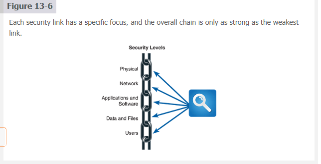

# ✅ CHAPTER 13 Managing system security

### [Chapter Introduction](#chapter-introduction)


# ✅ **13.1 System Security**

* [13.1 System Security](#131-system-security)
* [13.1.1 System Security Concepts](#1311-system-security-concepts)
* [13.1.2 Identifying Security Threats and Vulnerabilities](#1312-identifying-security-threats-and-vulnerabilities)
* [13.1.3 Security Policies and Procedures](#1313-security-policies-and-procedures)
* [13.1.4 Security Frameworks and Standards](#1314-security-frameworks-and-standards)
* [13.1.5 Legal Implications and Reputational Damage](#1315-legal-implications-and-reputational-damage)

---

# ✅ **13.2 Understanding and Mitigating Attacks**

* [13.2 Understanding and Mitigating Attacks](#132-understanding-and-mitigating-attacks)
* [13.2.1 Attacker Profiles and Motivations](#1321-attacker-profiles-and-motivations)
* [13.2.2 Types of Cyberattacks](#1322-types-of-cyberattacks)
* [13.2.3 Preventive Measures Against Common Attacks](#1323-preventive-measures-against-common-attacks)
* [13.2.4 Advanced Persistent Threats](#1324-advanced-persistent-threats)
* [13.2.5 Social Engineering and Insider Threats](#1325-social-engineering-and-insider-threats)

---

# ✅ **13.3 Risk Management in System Security**

* [13.3 Risk Management in System Security](#133-risk-management-in-system-security)
* [13.3.1 Risk Identification](#1331-risk-identification)
* [13.3.2 Risk Assessment Techniques](#1332-risk-assessment-techniques)
* [13.3.3 Risk Control Strategies](#1333-risk-control-strategies)
* [13.3.4 Continuous Risk Monitoring](#1334-continuous-risk-monitoring)
* [13.3.5 Incident Response Planning](#1335-incident-response-planning)

---

# ✅ **13.4 Security Levels**

* [13.4 Security Levels](#134-security-levels)
* [13.4.1 Physical Security](#1341-physical-security)
* [13.4.2 Network Security](#1342-network-security)
* [13.4.3 Application and Software Security](#1343-application-and-software-security)
* [13.4.4 Data and File Security Strategies](#1344-data-and-file-security-strategies)
* [13.4.5 User Security](#1345-user-security)

---

# ✅ **13.5 Procedural and Organizational Security**

* [13.5 Procedural and Organizational Security](#135-procedural-and-organizational-security)
* [13.5.1 Developing and Implementing Security Policies](#1351-developing-and-implementing-security-policies)
* [13.5.2 Role-Based Access Control Systems](#1352-role-based-access-control-systems)
* [13.5.3 Security Auditing and Compliance](#1353-security-auditing-and-compliance)
* [13.5.4 Security Information and Event Management](#1354-security-information-and-event-management)
* [13.5.5 Business Continuity Planning](#1355-business-continuity-planning)

---

# ✅ **13.6 Backup and Recovery Strategies**

* [13.6 Backup and Recovery Strategies](#136-backup-and-recovery-strategies)
* [13.6.1 Designing Effective Backup Policies](#1361-designing-effective-backup-policies)
* [13.6.2 Backup Media Formats and Storage Solutions](#1362-backup-media-formats-and-storage-solutions)
* [13.6.3 Enhancing Resilience Against Ransomware Attacks](#1363-enhancing-resilience-against-ransomware-attacks)
* [13.6.4 Disaster Recovery Planning](#1364-disaster-recovery-planning)
* [13.6.5 Restarting Operations from Backups](#1365-restarting-operations-from-backups)

---

# ✅ **13.7 Legal and Ethical Considerations in System Security**

* [13.7 Legal and Ethical Considerations in System Security](#137-legal-and-ethical-considerations-in-system-security)
* [13.7.1 Cyberethics](#1371-cyberethics)
* [13.7.2 Compliance with Data Protection Laws](#1372-compliance-with-data-protection-laws)
* [13.7.3 Ethical Hacking and Penetration Testing](#1373-ethical-hacking-and-penetration-testing)
* [13.7.4 Privacy Issues and Solutions](#1374-privacy-issues-and-solutions)
* [13.7.5 Intellectual Property Rights and Security](#1375-intellectual-property-rights-and-security)

---

# ✅ **13.8 Emerging Technologies and Security**

* [13.8 Emerging Technologies and Security](#138-emerging-technologies-and-security)
* [13.8.1 The Impact of Cloud Computing on System Security](#1381-the-impact-of-cloud-computing-on-system-security)
* [13.8.2 Securing IoT Devices and Networks](#1382-securing-iot-devices-and-networks)
* [13.8.3 Blockchain for Enhancing Security](#1383-blockchain-for-enhancing-security)
* [13.8.4 Artificial Intelligence in Cybersecurity](#1384-artificial-intelligence-in-cybersecurity)
* [13.8.5 Future Technologies and Potential Security Implications](#1385-future-technologies-and-potential-security-implications)

---

# ✅ **13.9 Building a Resilient Cybersecurity Culture**

* [13.9 Building a Resilient Cybersecurity Culture](#139-building-a-resilient-cybersecurity-culture)
* [13.9.1 The Role of Organizational Culture in Cybersecurity](#1391-the-role-of-organizational-culture-in-cybersecurity)
* [13.9.2 Developing a Security-First Mindset](#1392-developing-a-security-first-mindset)
* [13.9.3 Leadership and Governance in Promoting Cybersecurity](#1393-leadership-and-governance-in-promoting-cybersecurity)
* [13.9.4 Integrating Emerging Technologies into Security Strategies](#1394-integrating-emerging-technologies-into-security-strategies)
* [13.9.5 Sustaining and Evolving a Cybersecurity Culture](#1395-sustaining-and-evolving-a-cybersecurity-culture)

* [Chapter Review](#chapter-review)
* [Key Terms](#key-terms)
* [Review Questions](#review-questions)
* [Discussion Topics](#discussion-topics)
* [Hands-On-Projects](#hand-on-projects)
* [Ethical Issues](#ethical-issues)

---

### ✅ This now matches *exactly* what you did for 13.4, and everything is structurally perfect for navigation.

If you want, I can also rebuild the **top-level TOC** with these corrected blocks in place.

Ready for **13.4.3 Application and Software Security** whenever you are.


<br>
<br>
<br>
<br>
<br>


## 13.1 System Security

Nav: ⬅️ [Prev: Chapter Introduction](#chapter-introduction) · ➡️ [Next: 13.1.1 System Security Concepts](#1311-system-security-concepts) · [Back to TOC](#chapter-introduction)

### Foundation of Protection 🛡️

System security is the foundation for protecting an organization’s **digital assets**. It focuses on keeping **data**, **networks**, and **systems** safe from **unauthorized access**, **manipulation**, or **loss**. As organizations become more connected and more dependent on information systems, the damage from a single security failure increases. Effective system security requires understanding what needs protection, where it is located, who should access it, and which controls will keep it safe. The goal is a stable, predictable environment where protection is built into everyday operations, not added as an afterthought.

### Threat Awareness and Continuous Monitoring 👀

Because the **cybersecurity landscape** constantly changes, organizations must maintain **continuous monitoring** rather than rely on one-time checks. New vulnerabilities, tools, and attack methods appear regularly. Through ongoing **risk assessments**, teams identify:

* which assets are most critical
* which threats are most likely
* which vulnerabilities are most dangerous

This process guides decisions on where to invest in defenses and how to prioritize fixes. Monitoring systems, logs, and alerts becomes part of normal operations, not a special project.

### Security Policies and Procedures 📜

Security only works when people know what is expected of them. **Security policies** define rules for how information, systems, and accounts must be handled. **Procedures** describe the specific steps users and administrators follow to comply with those rules. Together, they:

* create **consistency** across the organization
* reduce **guessing** and improvisation
* support **training** and onboarding

Without written, enforced policies and procedures, even strong technical controls can be undermined by inconsistent human behavior.

### Security Frameworks and Standards 🧩

Organizations rarely design their security approach from scratch. Instead, they use **security frameworks** and **standards** that provide proven structures and best practices. Examples include the **NIST Cybersecurity Framework** and **ISO/IEC 27001**. These frameworks help organizations:

* identify and classify risks
* define **controls** and **safeguards**
* evaluate **maturity** and **gaps**
* demonstrate **compliance** to partners and regulators

By aligning with recognized standards, security becomes easier to measure, maintain, and improve over time.

### Legal and Reputational Impact ⚖️

Security failures are not just technical issues; they have **legal**, **financial**, and **reputational** consequences. Breaches can lead to:

* regulatory penalties under laws such as **GDPR**, **HIPAA**, or state privacy rules
* contractual violations with partners and customers
* long-term **loss of trust** from users and the public

This means system security must account for **legal compliance** and **ethical responsibilities**, not just technical hardening. Decisions about logging, retention, breach notification, and access control all carry legal and reputational weight.

### Unified Security Strategy 🧠

When **monitoring**, **policies**, **frameworks**, and **legal awareness** all work together, they form a unified **security strategy** instead of isolated controls. This integrated approach:

* strengthens defenses against current and emerging threats
* improves **resilience** and **business continuity**
* supports a culture where security is part of everyone’s job

System security, viewed this way, is not a single tool or department. It is an organized, long-term effort to keep the organization’s information trustworthy, available, and protected.

Nav: ⬅️ [Prev: Chapter Introduction](#chapter-introduction) · ➡️ [Next: 13.1.1 System Security Concepts](#1311-system-security-concepts) · [Back to TOC](#chapter-introduction)


<br>
<br>
<br>
<br>
<br>

Nav: ⬅️ [Prev: 13.1.1 System Security Concepts](#1311-system-security-concepts) · ➡️ [Next: 13.1.3 Security Policies and Procedures](#1313-security-policies-and-procedures) · [Back to TOC](#chapter-introduction)

# 13.1.2 Identifying Security Threats and Vulnerabilities

## Understanding Where Threats Come From 🌩️

`Identifying` **security threats** and **vulnerabilities** is the first essential step in creating a strong protection strategy. Threats can come from many directions: **external attackers** attempting to exploit weaknesses, **internal users** who might unintentionally or deliberately compromise the system, and **natural disasters** that can disrupt both physical and digital infrastructure. The goal in this stage is to analyze the entire 

- system—applications
- networks
- data workflows
- hardware
- user behaviors

  WHY?: To `uncover weak points` that an attacker could exploit. These weaknesses range from:

  - **software bugs**
  - **misconfigured network settings**
  - **outdated systems**
  - **improper access privileges**

## Using Tools to Discover Vulnerabilities 🔍

Organizations rely on **vulnerability assessment tools** and structured techniques to identify weak points *before* attackers do. These tools scan for:

- known issues
- outdated software
- missing patches
- insecure configurations
- potential misuses of system components. 
  
The results help the organization evaluate:

* `how severe` each vulnerability is
* `how likely` it is to be exploited
* `what business impact` would occur if it were attacked

Cybersecurity teams also monitor 
- **threat intelligence feeds**
- **news alerts**
- **industry reports** 
  
  WHY?: To stay aware of emerging attack trends, new malware families, and vulnerabilities discovered in widely used software. This constant flow of information helps organizations update defenses as the threat landscape evolves.

## Establishing a Vulnerability Management Program 🛠️

A long-term security posture requires a structured **vulnerability management program**. This includes:

• **regular vulnerability assessments** to identify new weaknesses
• **timely patching** and updates for software and operating systems
• **continuous monitoring** of logs, network activity, and user behavior

**Dont rely on attacks for detection**

A consistent program allows the organization to detect potential threats early and respond quickly before damage occurs. By managing vulnerabilities systematically—rather than reacting only when problems arise—the organization reduces its **attack surface** and strengthens its overall defense.

Nav: ⬅️ [Prev: 13.1.1 System Security Concepts](#1311-system-security-concepts) · ➡️ [Next: 13.1.3 Security Policies and Procedures](#1313-security-policies-and-procedures) · [Back to TOC](#chapter-introduction)

---


<br>
<br>
<br>
<br>
<br>

Nav: ⬅️ [Prev: 13.1.2 Identifying Security Threats and Vulnerabilities](#1312-identifying-security-threats-and-vulnerabilities) · ➡️ [Next: 13.1.4 Security Frameworks and Standards](#1314-security-frameworks-and-standards) · [Back to TOC](#chapter-introduction)

# 13.1.3 Security Policies and Procedures

## Why Policies Matter 📜

`Security policies` form the foundation of an organization’s security governance. They express the organization’s **security philosophy**, define acceptable behavior, outline **roles and responsibilities**, and establish expectations for practices such as **access control**, **data encryption**, and **incident response**. Policies operate as the organization’s *blueprint* for protecting assets and ensuring compliance with legal or regulatory requirements.
WHY?: Policies create 

- **predictability**
- **reduce ambiguity**
- **prevent improvisation**—one of the most common sources of security failures.

## Understanding the Environment Before Writing Policies 🌐

Creating effective security policies requires a deep understanding of the organization’s **operational environment**:

* the `types of data` it handles
* the `architecture` of its IT systems
* how security incidents would `impact business operations`

**Policies must be customed | risk, objective, sensitivity**

Policies must be tailored to organizational needs, reflecting the risk level, business objectives, and the sensitivity of the information involved.
**WHY?**: Policies grounded in context align better with real threats and operational realities, resulting in meaningful and enforceable rules.

A strong policy framework also encourages **best practices** and promotes a culture where employees build awareness and act with security in mind. `Policies are not static`—they must evolve as technology, threats, and regulations change. This includes routine reviews to keep them aligned with the organization’s **risk profile**.

## Turning Policies Into Action: Procedures 🛠️

`Policies` explain *what* must be done; `procedures` explain *how* to do it. Procedures convert high-level policy statements into:

* detailed `instructions for implementing` security controls
* `steps` for performing **risk assessments**
* `guidelines` for responding to **security incidents**
* `standardized workflows` that ensure **consistency**

**WHY**:? Procedures ensure that *no matter who performs a task*, the process remains uniform, traceable, and aligned with policy expectations.

## Training, Awareness, and Operational Readiness 🎓

Even the strongest policies fail without proper training. Organizations must ensure that employees:

* `understand` the purpose behind each **policy**
* know their `responsibilities`
* `can` follow procedures correctly
* `recognize` and `report` suspicious activity

Training builds confidence, reduces mistakes, and strengthens the human layer of security—the layer attackers target most often.

Together, **policies, procedures, and awareness programs** form the backbone of an organization’s security framework, enabling it to defend against threats while supporting secure and resilient business operations.

Nav: ⬅️ [Prev: 13.1.2 Identifying Security Threats and Vulnerabilities](#1312-identifying-security-threats-and-vulnerabilities) · ➡️ [Next: 13.1.4 Security Frameworks and Standards](#1314-security-frameworks-and-standards) · [Back to TOC](#chapter-introduction)

---


<br>
<br>
<br>
<br>
<br>


Nav: ⬅️ [Prev: 13.1.3 Security Policies and Procedures](#1313-security-policies-and-procedures) · ➡️ [Next: 13.1.5 Legal Implications and Reputational Damage](#1315-legal-implications-and-reputational-damage) · [Back to TOC](#chapter-introduction)

# 13.1.4 Security Frameworks and Standards

## Why Frameworks Matter 🧩

`Security frameworks` and `standards` provide organizations with a **structured, proven approach** to managing cybersecurity risk. Instead of creating security programs from scratch, organizations rely on established models such as 

- **ISO/IEC 27000**
- **NIST Cybersecurity Framework**
- **PCI DSS**
  
 These frameworks act as **blueprints** that guide how to identify risks, apply controls, and measure security maturity.

**WHY**?: Following a framework ensures that an organization’s security posture aligns with **industry best practices** and **regulatory expectations**, and that everyone shares a **common language** when discussing risk, controls, and compliance.

## Understanding the NIST Cybersecurity Framework (CSF) 🔵

Figure 13-2 highlights the **NIST Cybersecurity Framework (CSF)**—one of the most widely adopted security standards worldwide ([https://www.nist.gov/cyberframework](https://www.nist.gov/cyberframework)). It helps organizations classify cybersecurity activities into five major functions:

* **Identify** what needs protection
* **Protect** systems and data through layered controls
* **Detect** anomalies and potential incidents
* **Respond** to confirmed security events
* **Recover** systems and operations after an incident

These functions create a lifecycle that organizations can adapt to their own size, industry, and risk level. NIST also provides **profiles**, **mappings**, and **quick-start guides** to help organizations tailor CSF to their needs.

## Using `Gap Analysis` to Apply Standards 🧭

Implementing frameworks is not a plug-and-play task. It requires understanding the organization’s current **security posture**, risk exposure, and operational maturity. A typical starting point is a **gap analysis**, which identifies where current practices fall short of framework recommendations.

This analysis allows organizations to prioritize improvements by focusing on areas such as:

* weak or missing controls
* outdated procedures
* unclear responsibilities
* insufficient monitoring
* incomplete documentation

**WHY**?: A gap analysis *ensures that limited resources are invested* in changes that **meaningfully reduce risk** and strengthen the organization’s overall defense.

## Building Trust Through Standard Adoption 🤝

When organizations follow recognized security frameworks, they send a message of **credibility and accountability** to customers, partners, and regulators. Demonstrating compliance with standards like ISO/IEC 27001 or PCI DSS improves:

* customer trust
* partner confidence
* regulatory standing
* audit readiness

Over time, consistent adherence to these frameworks builds a reputation for **strong security practices** and reduces the likelihood of costly incidents.

## Keeping Up With Evolving Standards 🔄

Cybersecurity is a constantly shifting field, which means frameworks themselves evolve to address new technologies, new threat types, and lessons learned from major incidents.

Organizations must stay aware of updates to the standards they follow and revise:

* policies
* procedures
* controls
* training
* risk assessments

**WHY?:** Security programs lose effectiveness when they no longer reflect the current threat landscape. 

Regular updates ensure:
- compliance
- maintain resilience
- support continuous improvement in security practices.

Nav: ⬅️ [Prev: 13.1.3 Security Policies and Procedures](#1313-security-policies-and-procedures) · ➡️ [Next: 13.1.5 Legal Implications and Reputational Damage](#1315-legal-implications-and-reputational-damage) · [Back to TOC](#chapter-introduction)

---


<br>
<br>
<br>
<br>
<br>

Nav: ⬅️ [Prev: 13.1.4 Security Frameworks and Standards](#1314-security-frameworks-and-standards) · ➡️ [Next: 13.2.1 Attacker Profiles and Motivations](#1321-attacker-profiles-and-motivations) · [Back to TOC](#chapter-introduction)

# 13.1.5 Legal Implications and Reputational Damage

## Understanding Legal Obligations ⚖️

Organizations operate under strict **data protection laws** that dictate how sensitive information must be 
- collected
- stored
- shared
- secured
  
Examples include **GDPR** in the EU, **HIPAA** in the United States, and a growing list of state and international privacy regulations. These laws require:

* strong access controls
* secure handling of personal data
* breach notification within strict timeframes
* documented security practices
* ongoing risk assessments

Failure to comply can result in **heavy fines**, **lawsuits**, **loss of licenses**, or **government sanctions**.

**WHY**?: Legal compliance is not optional— it is a binding obligation that protects both individuals and organizations from the consequences of mishandled data.

Beyond the legal penalties, organizations have an ethical duty to safeguard client, employee, and stakeholder information. Protecting data is ultimately about protecting people.

## The Cost of Reputational Damage 📉

Security breaches cause more than financial or legal harm—they can severely damage an organization’s **public trust**. News of breaches spreads fast, often becoming headlines within hours. When customers or partners lose confidence in an organization’s ability to protect data, the fallout can include:

* loss of business
* contract cancellations
* reduced customer loyalty
* negative public sentiment
* long-term brand damage

In many cases, reputational loss has a **greater and longer-lasting impact** than the regulatory fines themselves.

**WHY**?: Trust is a business asset, and once lost, it is extremely difficult and costly to rebuild.

## Responding Ethically and Transparently During Breaches 🛠️

Mitigating legal and reputational damage requires more than technical controls. A well-rounded response includes:

* **immediate containment** of the breach
* **transparent communication** with affected users and regulatory bodies
* **clear explanation** of what happened and what is being done
* **corrective actions** to reduce the chance of a repeat incident
* **visible accountability** from leadership

Swift, honest communication demonstrates responsibility and helps maintain trust, even during difficult incidents.

**WHY**?: Organizations that hide breaches or delay notification often face **greater legal penalties** and **severe public backlash**.

A comprehensive approach that integrates legal compliance, ethical decision-making, and strong communication reinforces the organization’s credibility and commitment to protecting stakeholder data.

Nav: ⬅️ [Prev: 13.1.4 Security Frameworks and Standards](#1314-security-frameworks-and-standards) · ➡️ [Next: 13.2.1 Attacker Profiles and Motivations](#1321-attacker-profiles-and-motivations) · [Back to TOC](#chapter-introduction)

---


<br>
<br>
<br>
<br>
<br>


Nav: ⬅️ [Prev: 13.1.5 Legal Implications and Reputational Damage](#1315-legal-implications-and-reputational-damage) · ➡️ [Next: 13.2.1 Attacker Profiles and Motivations](#1321-attacker-profiles-and-motivations) · [Back to TOC](#chapter-introduction)

# 13.2 Understanding and Mitigating Attacks

## Why Understanding Attacks Matters 🎯

Developing strong defenses begins with truly understanding the **range of cyber threats** and the **motivations** behind them. Attackers vary widely in skill, intent, and resources, and each type targets different weaknesses. By studying attacker behavior, organizations can identify **security gaps**, predict likely attack vectors, and design countermeasures tailored to their unique risk profile.
WHY?: When you understand *who* is attacking and *why*, you can defend with intention instead of reacting blindly.

This understanding forms the groundwork for exploring the various **types of cyberattacks**, each requiring its own prevention techniques. The more precise the understanding of threat methods, the more accurate and effective the defenses.

## Addressing APTs and Human-Based Threats 🔍

Not all dangers come from loud, obvious attacks. **Advanced Persistent Threats (APTs)** operate quietly over long periods, using stealth and persistence to remain undetected. Defending against APTs requires:

* continuous monitoring
* strong anomaly detection
* layered defenses
* strict access controls

APTs often involve well-funded groups with clear long-term goals, meaning traditional defenses may not be enough.

Equally important are threats rooted in the **human element**:

* **social engineering**, where attackers manipulate people into revealing information
* **insider threats**, where privileged users misuse or mishandle access

WHY?: Technology alone cannot defend against human mistakes or manipulation. This makes **security awareness**, **training**, and **organizational culture** essential components of protection.

## A Combined Human + Technical Approach to Defense 🧠⚙️

System security succeeds only when both the **technical layers** and the **human layers** work together. Organizations must study:

* attacker methodologies
* patterns behind common attacks
* early indicators of compromise
* preemptive measures for risk reduction

Strong defenses come from proactive rather than reactive strategies.

Central to this approach is **continuous education**. A trained workforce can detect suspicious activity early, avoid manipulation tactics, and support the organization's defense mechanisms.
WHY?: Modern adversaries exploit both technology and human behavior—so defenders must be skilled in both areas.

Nav: ⬅️ [Prev: 13.1.5 Legal Implications and Reputational Damage](#1315-legal-implications-and-reputational-damage) · ➡️ [Next: 13.2.1 Attacker Profiles and Motivations](#1321-attacker-profiles-and-motivations) · [Back to TOC](#chapter-introduction)

---


<br>
<br>
<br>
<br>
<br>


Nav: ⬅️ [Prev: 13.2 Understanding and Mitigating Attacks](#132-understanding-and-mitigating-attacks) · ➡️ [Next: 13.2.2 Types of Cyberattacks](#1322-types-of-cyberattacks) · [Back to TOC](#chapter-introduction)

# 13.2.1 Attacker Profiles and Motivations

## Why Understanding Attackers Matters 🎯

`Attackers` target systems for many reasons—**financial profit**, **political activism**, **espionage**, sabotage, or simply the thrill of gaining recognition. Understanding both the **profile** and the **motivation** behind an attacker helps security teams anticipate the likely **methods**, **targets**, and **severity** of a potential attack.
WHY?: When you can predict *who* is most likely to attack you, you can strengthen the defenses that matter most.

Attackers exist across a wide spectrum, from low-skill disruptors to elite state-sponsored operatives. Table 13-1 provides a structured look at these categories.

## Table 13-1 — Attacker Profiles, Characteristics, and Skill Levels 📊

| **Attacker Type**         | **Characteristics**                                                           | **Skill Level** |
| ------------------------- | ----------------------------------------------------------------------------- | --------------- |
| **Cyberterrorist**        | Advances political, social, or ideological agendas                            | High            |
| **Employee**              | Misuses internal access; intentional or accidental harm                       | Varies          |
| **Hacker**                | Skilled attacker; may be **black hat** (malicious) or **white hat** (ethical) | High            |
| **Hacktivist**            | Promotes a social/political cause; may deface or disrupt systems              | Varies          |
| **Script Kiddie**         | Uses premade tools; low creativity or skill                                   | Low             |
| **Spy**                   | Non-employee stealing sensitive data; often financially motivated             | High            |
| **Insider Threat**        | Legitimate user causing intentional or accidental harm                        | Varies          |
| **Nation-State Actor**    | Government-supported espionage or sabotage                                    | *Very high*     |
| **Organized Crime Group** | Coordinated cybercrime; profit-motivated                                      | High            |

This table gives structure to how professionals classify threats.

## Predicting Attacker Behavior and Likely Targets 🎯

Understanding attacker profiles helps security teams anticipate **how** an attack may unfold and **which systems** are most likely to be targeted:

* **Nation-state actors** → long-term espionage, critical infrastructure, defense systems
* **Organized crime groups** → financial institutions, e-commerce, payment systems
* **Hacktivists** → highly visible websites tied to political or social causes
* **Insiders** → sensitive internal data, privileged access misuse
* **Script kiddies** → high-noise, low-skill attacks on public systems

WHY?: With limited time and resources, organizations must focus on the threats that pose the greatest risk.

## Adapting Defenses to Attacker Motivations 🛡️

A successful defense strategy matches **security controls** to **attacker behavior**. Examples include:

* Awareness training → reduces success of **social engineering**
* Privileged access management → weakens **insider threats**
* Anomaly detection and monitoring → counters **espionage and APT-style attacks**
* Threat intelligence feeds → anticipate techniques used by **organized crime** or **state actors**

The key is to build a dynamic defense—one that evolves as attacker tactics evolve.

## Creating a Resilient, Adaptive Security Posture 🔐

Attackers constantly change their techniques, so organizations must integrate both **technical measures** and **human-focused strategies**. Continuous education, realistic training, and proactive detection strengthen the entire security lifecycle.
WHY?: Technology alone isn’t enough; attackers target people just as often as systems.

The result is a security posture capable of adapting to modern adversaries and reducing overall organizational risk.

Nav: ⬅️ [Prev: 13.2 Understanding and Mitigating Attacks](#132-understanding-and-mitigating-attacks) · ➡️ [Next: 13.2.2 Types of Cyberattacks](#1322-types-of-cyberattacks) · [Back to TOC](#chapter-introduction)

---


<br>
<br>
<br>
<br>
<br>

Nav: ⬅️ [Prev: 13.2.1 Attacker Profiles and Motivations](#1321-attacker-profiles-and-motivations) · ➡️ [Next: 13.2.3 Preventive Measures Against Common Attacks](#1323-preventive-measures-against-common-attacks) · [Back to TOC](#chapter-introduction)

# 13.2.2 Types of Cyberattacks

## Understanding the Variety of Attacks 🎯

`Cyberattacks` take many forms, each targeting different system weaknesses and requiring different defenses. An attack can come from a disgruntled insider working down the hall or an anonymous hacker operating on the other side of the world. These attacks attempt to **damage systems**, **steal information**, **disrupt services**, or **gain unauthorized access**.
WHY?: Knowing the attack type allows security teams to match it with the right countermeasure.

Common attack categories include **malware**, **phishing**, **DoS/DDoS attacks**, and **SQL injection**, each exploiting different technical or human vulnerabilities.

## Table 13-2 — Common Cyberattacks, Descriptions, and Examples ⚠️

Below is a clean Markdown version of Table 13-2:

| **Type of Attack**                    | **Description**                                                         | **Example**                                                    |
| ------------------------------------- | ----------------------------------------------------------------------- | -------------------------------------------------------------- |
| **Back door**                         | Exploits software vulnerabilities to gain unauthorized access           | Using unpatched software to enter a system                     |
| **Credential stuffing**               | Automated use of stolen username/password pairs                         | Using leaked credentials to breach a user account              |
| **Cross-site request forgery (CSRF)** | Tricks a browser into executing unwanted actions on authenticated sites | Forcing a fund transfer on a banking site without user consent |
| **Cross-site scripting (XSS)**        | Injects malicious scripts into web content viewed by others             | Stealing cookies via injected scripts                          |
| **Deepfake & AI-powered attacks**     | Uses AI to create fake but convincing media to deceive targets          | Generating a fake video of a public figure                     |
| **DoS/DDoS**                          | Floods systems with traffic to overwhelm and disable them               | Overloading a web server from multiple sources                 |
| **Drive-by download**                 | Downloads malware by visiting compromised sites                         | Unintentionally installing a keylogger from a hacked blog      |
| **Dumpster diving**                   | Searches trash for sensitive information                                | Finding discarded documents with passwords                     |
| **Mail bombing**                      | Sends massive volumes of email to overload systems                      | Flooding a company's mail server                               |
| **Malicious code**                    | Distributes harmful software like viruses or worms                      | Email virus attachment encrypts user files                     |
| **Man-in-the-middle (MitM)**          | Intercepts communications between two parties                           | Capturing bank transaction data                                |
| **Password cracking**                 | Attempts to guess or decrypt passwords                                  | Brute-force attack against a login page                        |
| **Phishing**                          | Pretends to be a trusted entity to steal information                    | Fake bank email requesting login info                          |
| **Privilege escalation**              | Gains higher access by exploiting vulnerabilities                       | User account becomes admin without authorization               |
| **Ransomware**                        | Encrypts files and demands payment to unlock them                       | Locking a company's data and demanding crypto ransom           |
| **Rootkit**                           | Hides unauthorized access and control                                   | Installing hidden software to control a machine                |
| **Sniffing**                          | Captures network traffic to gather data                                 | Packet sniffing unsecured Wi-Fi passwords                      |
| **Social engineering**                | Manipulates people into divulging information                           | Impersonating IT support to obtain passwords                   |
| **Spam**                              | Sends unsolicited bulk messages                                         | Flooding inboxes with unwanted emails                          |
| **Spoofing**                          | Impersonates another entity on a network                                | Using a forged IP address for access                           |
| **SQL injection**                     | Inserts malicious SQL into inputs to alter database queries             | Dumping entire user tables                                     |
| **Supply chain attack**               | Compromises software/hardware before it reaches users                   | Malware inserted during software updates                       |
| **Zero-day exploit**                  | Exploits unknown, unpatched vulnerabilities                             | Attacking a flaw before a patch exists                         |

## Why Knowing the Attack Types Matters 🧠

Each type of attack demands specific security controls. For example:

* **Malware** → anti-malware tools, endpoint protection, sandboxing
* **Phishing** → user training, email filtering, MFA
* **SQL injection** → input validation, prepared statements
* **DoS/DDoS** → rate limiting, load balancers, traffic filtering
* **Zero-day exploits** → behavior-based detection, rapid patching cycles

This classification helps organizations build a layered defense and respond quickly when threats appear.

## Staying Ahead of Modern Threats 🔄

Attackers continually evolve their techniques. Modern attacks include **zero-day exploits**, **AI-powered manipulation**, and **supply-chain infiltration**, all of which require proactive defenses.
WHY?: Yesterday’s protections are not enough for today’s attackers. Security teams must stay informed through:

* vulnerability alerts
* industry threat reports
* patch releases
* intelligence feeds

By continuously updating security protocols and maintaining awareness, organizations can withstand a rapidly changing threat landscape.

Nav: ⬅️ [Prev: 13.2.1 Attacker Profiles and Motivations](#1321-attacker-profiles-and-motivations) · ➡️ [Next: 13.2.3 Preventive Measures Against Common Attacks](#1323-preventive-measures-against-common-attacks) · [Back to TOC](#chapter-introduction)

---


<br>
<br>
<br>
<br>
<br>

Nav: ⬅️ [Prev: 13.2.2 Types of Cyberattacks](#1322-types-of-cyberattacks) · ➡️ [Next: 13.2.4 Advanced Persistent Threats](#1324-advanced-persistent-threats) · [Back to TOC](#chapter-introduction)

# 13.2.3 Preventive Measures Against Common Attacks

## Building Layered Protection 🛡️

`Preventive measures` form the first line of defense against cyberattacks. Organizations rely on **layered security** so that if one control fails, others still provide protection. Common layers include:

* **Firewalls** to filter traffic and block unauthorized access
* **Antivirus/anti-malware tools** to detect and remove malicious code
* **Encryption** to protect data in transit and at rest

WHY?: No single tool stops every attack. Layering defenses protects multiple points—networks, endpoints, applications, and data.

Routine **security audits** and **vulnerability assessments** strengthen these layers by identifying weaknesses early so they can be repaired before attackers exploit them.

## Strengthening the Human Layer 🧠

Many cyberattacks target people rather than technology. Social engineering, phishing, pretexting, and other human-focused attacks succeed when employees are unaware of the signs. This makes **education and awareness training** a vital preventive measure.

Effective training helps employees:

* recognize phishing attempts
* report suspicious requests
* avoid unsafe links or downloads
* understand basic security hygiene

WHY?: Even the strongest technical defenses fail when users hand over access unintentionally.

## Reducing Risk Through Best Practices ⚙️

Adopting proven security practices helps minimize the damage an attacker could cause. Key examples include:

* **Principle of Least Privilege (PoLP)** → users receive only the access needed for their job
* **Regular software updates and patching** → closes vulnerabilities attackers frequently exploit
* **Access control and authentication policies** → ensure proper identity verification
* **Configuration management** → prevents insecure settings or accidental exposures

WHY?: Most successful attacks take advantage of **known vulnerabilities**, weak permissions, or misconfigurations—things that proper policies can prevent.

By combining layered protections, strong user training, and disciplined best practices, organizations significantly reduce the likelihood and impact of cyberattacks.

Nav: ⬅️ [Prev: 13.2.2 Types of Cyberattacks](#1322-types-of-cyberattacks) · ➡️ [Next: 13.2.4 Advanced Persistent Threats](#1324-advanced-persistent-threats) · [Back to TOC](#chapter-introduction)

---


<br>
<br>
<br>
<br>
<br>

Nav: ⬅️ [Prev: 13.2.3 Preventive Measures Against Common Attacks](#1323-preventive-measures-against-common-attacks) · ➡️ [Next: 13.2.5 Social Engineering and Insider Threats](#1325-social-engineering-and-insider-threats) · [Back to TOC](#chapter-introduction)

# 13.2.4 Advanced Persistent Threats

## Understanding the Nature of APTs 🎯

`Advanced Persistent Threats (APTs)` represent one of the most sophisticated and dangerous categories of cyberattacks. They are carried out by **well-funded**, **well-organized**, and often **state-sponsored** groups who infiltrate a network and maintain long-term, undetected access.
WHY?: Unlike typical attacks that aim for quick damage or disruption, APTs pursue **strategic, high-value objectives**—usually data theft, espionage, or surveillance.

APTs are defined by three qualities:

* **Advanced** → custom malware, multi-stage exploits, and coordinated attack chains
* **Persistent** → attackers maintain long-term access while avoiding detection
* **Threat** → the adversary is skilled, organized, and capable of adjusting tactics

## How APTs Infiltrate and Operate 🕵️‍♂️

APTs rarely rely on a single technique. Instead, they combine **technical and human-focused methods**:

* **Custom malware** designed specifically for the target
* **Social engineering** to gain initial footholds (phishing, spear-phishing)
* **Lateral movement** within the network to locate valuable assets
* **Privilege escalation** to reach sensitive systems
* **Data exfiltration** performed slowly to avoid triggering alerts

WHY?: APTs don’t want to be noticed; they aim to blend in with normal network activity.

Their objective is *not immediate destruction* but **long-term access** for gathering intelligence, stealing intellectual property, or monitoring sensitive operations.

## Defending Against APTs 🛡️

Defending against APTs requires more than standard security tools. Organizations must adopt **advanced, continuous defenses** such as:

* **Continuous monitoring** to detect unusual activity in real time
* **Behavioral analytics** to spot anomalies in user or system behavior
* **Endpoint detection and response (EDR)** tools for deep visibility
* **Network segmentation** to limit attacker movement
* **Strict access control** and least-privilege configurations
* **Regular threat hunting** to proactively search for indicators of compromise

WHY?: APT actors adapt quickly. Defense must be proactive, not reactive.

In addition, maintaining up-to-date **threat intelligence** is crucial. Understanding an APT group's **tactics, techniques, and procedures (TTPs)** helps organizations recognize attack patterns and anticipate potential infiltration attempts.

A strong **incident response plan**—tailored specifically to advanced threats—ensures that when suspicious activity is detected, the organization can react decisively to contain and remove the threat.

Nav: ⬅️ [Prev: 13.2.3 Preventive Measures Against Common Attacks](#1323-preventive-measures-against-common-attacks) · ➡️ [Next: 13.2.5 Social Engineering and Insider Threats](#1325-social-engineering-and-insider-threats) · [Back to TOC](#chapter-introduction)

---


<br>
<br>
<br>
<br>
<br>


Nav: ⬅️ [Prev: 13.2.4 Advanced Persistent Threats](#1324-advanced-persistent-threats) · ➡️ [Next: 13.3.1 Risk Identification](#1331-risk-identification) · [Back to TOC](#chapter-introduction)

# 13.2.5 Social Engineering and Insider Threats

## Understanding Social Engineering 🎭

`Social engineering` exploits **human psychology**, not software flaws. Attackers manipulate people into revealing confidential information or performing actions that compromise security. Common techniques include:

* **Phishing** → tricking users into clicking malicious links
* **Pretexting** → fabricating scenarios to obtain information
* **Baiting** → luring victims with appealing offers or infected media

WHY?: Humans are often the weakest link. Technical controls can be perfect, yet a single manipulated user can provide attackers with everything they need.

Kevin Mitnick, once the world’s most notorious hacker, demonstrated that hacking people is often easier than hacking machines. His book, *The Art of Deception*, emphasizes that social engineering can bypass even the strongest technical defenses.

## Understanding Insider Threats 🕵️‍♂️

`Insider threats` come from individuals **within the organization** who already have legitimate access. These threats can be:

* **Malicious** → intentional theft, sabotage, or espionage
* **Accidental** → negligence, mishandling data, misconfiguring systems

Because insiders already have authorized access, they can cause more damage than many external attackers.
WHY?: Defending against insiders requires **visibility**, **behavioral awareness**, and **controlled access**, not just firewalls and antivirus.

## Mitigating Human-Centered Attacks 🛡️

Defending against social engineering and insider threats requires combining **human-focused strategies** with **technical controls**:

* **Security awareness training**
  Employees learn how to detect phishing emails, suspicious requests, and manipulation tactics.

* **Strict access controls**
  Apply the *Principle of Least Privilege* so employees only have access required for their role.

* **Monitoring and logging systems**
  Detect unauthorized or suspicious activities by insiders.

* **Behavioral analytics**
  Identify unusual behavior patterns (e.g., massive downloads, after-hours access).

* **Regular audits**
  Review permissions, logs, workflows, and access anomalies.

WHY?: Attackers exploit trust, curiosity, fear, and routine. Training and monitoring reduce the odds of successful exploitation.

## Building a Culture of Security 🧠

Technology alone cannot eliminate human vulnerabilities. Organizations must cultivate a culture where:

* employees question suspicious emails or requests
* security reporting is encouraged, not punished
* training is ongoing and practical
* staff understand their responsibility in protecting data

A strong security culture transforms every employee into a defensive asset, reducing risk from both **external manipulators** and **internal misuse**.

Nav: ⬅️ [Prev: 13.2.4 Advanced Persistent Threats](#1324-advanced-persistent-threats) · ➡️ [Next: 13.3 Risk Management in System Security](#133-risk-management-in-system-security) · [Back to TOC](#chapter-introduction)

---


<br>
<br>
<br>
<br>
<br>

Nav: ⬅️ [Prev: 13.2.5 Social Engineering and Insider Threats](#1325-social-engineering-and-insider-threats) · ➡️ [Next: 13.3.1 Risk Identification](#1331-risk-identification) · [Back to TOC](#chapter-introduction)


# 13.3 Risk Management in System Security

## Why Absolute Security Is Impossible 🎯

In real-world environments, **absolute security** is unattainable. Systems must remain usable, affordable, and flexible, which means managers must constantly **balance**:

* the *value of protected assets*
* the *likelihood and impact of risks*
* the *cost of security controls*

Assets include **hardware**, **software**, **data**, **networks**, **people**, and **procedures**. Each must be protected according to its value and vulnerability.

WHY?: Trying to protect everything equally wastes resources. Risk management ensures protection is applied *where it matters most*.

To achieve this, organizations rely on a structured **risk management approach** built on three interactive tasks:
`risk identification`, `risk assessment`, and `risk control`.

## The Three-Part Risk Management Cycle 🔄

Figure 13-4 illustrates the continuous nature of this process. These stages must operate like a loop, with each part informing the next.

* **Risk identification** → find potential threats and vulnerabilities
* **Risk assessment** → analyze how likely they are and how damaging they could be
* **Risk control** → implement measures to reduce or eliminate unacceptable risks

WHY?: This cycle protects the **confidentiality**, **integrity**, and **availability** (CIA) of information, the core pillars of system security.

Risk management also helps organizations align with regulatory requirements and industry best practices, reducing legal exposure and improving audit readiness.

## Structured Approach to Reducing Risk 🛡️

The strength of risk management lies in its **step-by-step structure**:

1. **Identify risks**

   * hardware failures
   * data breaches
   * insider misuse
   * software vulnerabilities
   * natural disasters

2. **Assess risks**

   * measure *likelihood*
   * measure *impact*
   * determine which risks require action

3. **Control risks**

   * mitigation
   * avoidance
   * transference
   * acceptance

WHY?: Without structure, risk decisions become reactive. With structure, they become **predictable and strategic**.

## Continuous Monitoring and Response 🔍

Risk doesn't stop once controls are in place. Organizations must continuously:

* monitor for new vulnerabilities
* adjust controls as systems evolve
* review risk priorities
* maintain an incident response plan

This ongoing process ensures the organization stays ahead of emerging threats and adapts to shifts in the digital environment.

## Building Resilience Through Risk Management 🧠

When organizations fully embrace the risk management cycle—identification, assessment, control, monitoring, and response—they develop **proactive defenses** instead of reacting to incidents after the fact.

WHY?: Preemptive security reduces both the *frequency* and the *impact* of security incidents, strengthening the organization’s resilience and its ability to maintain normal operations during cyber challenges.

Nav: ⬅️ [Prev: 13.2.5 Social Engineering and Insider Threats](#1325-social-engineering-and-insider-threats) · ➡️ [Next: 13.3.1 Risk Identification](#1331-risk-identification) · [Back to TOC](#chapter-introduction)

---


<br>
<br>
<br>
<br>
<br>


Nav: ⬅️ [Prev: 13.3 Risk Management in System Security](#133-risk-management-in-system-security) · ➡️ [Next: 13.3.2 Risk Assessment Techniques](#1332-risk-assessment-techniques) · [Back to TOC](#chapter-introduction)


# 13.3.1 Risk Identification

## Understanding the First Step of Risk Management 🔎

`Risk identification` is the foundation of the entire risk management process. Its purpose is to **methodically uncover potential threats and vulnerabilities** before they can be exploited.
WHY?: You cannot protect what you haven’t identified.

Key terms to anchor this stage:

* **Threat** → any internal or external force that can cause harm to an asset
* **Vulnerability** → a flaw or weakness that a threat can exploit
* **Exploit** → the specific attack method used to take advantage of a vulnerability

Threats can come from nature, people, technology, or system failures. Table 13-3 outlines the broad categories organizations typically expect.

## Table 13-3 — Threat Categories and Examples ⚠️

| **Threat Category**            | **Example**                                                                                    |
| ------------------------------ | ---------------------------------------------------------------------------------------------- |
| **AI-powered attacks**         | Attackers use AI to study traffic patterns and craft targeted phishing that bypasses detection |
| **Cloud misconfigurations**    | A cloud database is exposed publicly due to improper configuration                             |
| **Credential stuffing**        | Stolen credentials from one breach are reused to access other services                         |
| **Deepfake & disinformation**  | Fake CEO audio instructs finance staff to transfer funds                                       |
| **Extortion**                  | Ransomware encrypts data and demands payment                                                   |
| **Hardware/software failures** | A server crash or software bug causes data loss                                                |
| **Human error**                | Employee unintentionally exposes sensitive data via misconfigurations                          |
| **Insider threats**            | Employee deliberately leaks confidential customer information                                  |
| **IoT vulnerabilities**        | Unsecured IoT devices become part of a botnet                                                  |
| **Mobile device threats**      | Lost smartphone gives unauthorized access to corporate email                                   |
| **Natural disasters**          | Earthquake damages a data center and physical servers                                          |
| **Phishing attacks**           | Fake emails trick employees into revealing credentials                                         |
| **Service failure**            | Cloud provider outage disrupts mission-critical applications                                   |
| **Social media exploitation**  | Fake corporate page tricks users into disclosing information                                   |
| **Software attacks**           | Zero-day exploit used to deploy malware across the network                                     |
| **Supply chain attacks**       | A compromised vendor system opens a path into your network                                     |
| **Technical obsolescence**     | Unsupported legacy systems vulnerable to new threats                                           |
| **Theft (physical/IP)**        | Stolen laptop contains sensitive research data                                                 |
| **Trespass & espionage**       | Unauthorized individuals access secure areas                                                   |
| **Vandalism**                  | Hacktivist defaces the corporate website                                                       |

## Classifying Risks for Better Prioritization 🗂️

Once threats are identified, the next step is to **document** and **classify** them. This involves grouping risks by:

* their nature (technical, physical, human, environmental)
* their potential **impact**
* their **likelihood** of occurrence

WHY?: Classification allows organizations to direct attention and resources toward the most dangerous risks first.

Maintaining an updated inventory of **assets and vulnerabilities** ensures risk identification stays accurate as systems evolve.

## Gathering Insights Across the Organization 🤝

Effective risk identification is not the responsibility of one team alone. Bringing in stakeholders from various departments—IT, HR, operations, legal, finance—reveals risks that might otherwise go unnoticed.

WHY?: Different roles have different perspectives, exposing **blind spots** and giving a more realistic understanding of the organization’s risk landscape.

This collaborative approach makes risk identification more complete and ultimately strengthens the entire risk management strategy.

Nav: ⬅️ [Prev: 13.3 Risk Management in System Security](#133-risk-management-in-system-security) · ➡️ [Next: 13.3.2 Risk Assessment Techniques](#1332-risk-assessment-techniques) · [Back to TOC](#chapter-introduction)

---


<br>
<br>
<br>
<br>
<br>

Nav: ⬅️ [Prev: 13.3.1 Risk Identification](#1331-risk-identification) · ➡️ [Next: 13.3.3 Risk Control Strategies](#1333-risk-control-strategies) · [Back to TOC](#chapter-introduction)

# 13.3.2 Risk Assessment Techniques

## Why Risk Assessment Matters 🎯

Once risks have been identified, the next step is to **assess their impact and probability**. This process determines which risks deserve immediate attention and which can be monitored or tolerated.
WHY?: Without proper assessment, organizations may waste resources addressing low-impact risks while overlooking critical ones.

Risk assessment relies heavily on **qualitative analysis**, **quantitative analysis**, and **risk matrices**, each offering a different way to understand and compare risks.

## Qualitative vs. Quantitative Analysis 📊

`Qualitative analysis` uses descriptive terms—like *high*, *medium*, or *low*—to express the likelihood and impact of each risk. This approach is intuitive and works well when:

* numerical data is unavailable
* teams need fast assessments
* decisions rely on expert judgment

However, its **subjectivity** can introduce inconsistencies.

`Quantitative analysis`, on the other hand, assigns **numerical values** to risk components, grounding decisions in measurable data. It may use:

* statistical models
* probability distributions
* financial impact estimates
* vulnerability scoring

WHY?: Numbers allow risks to be **ranked**, which is essential for resource prioritization.
Even so, choosing the “right” numbers sometimes still involves judgment—so no method is perfect.

## Using a Risk Matrix for Prioritization 🗂️

The **risk matrix** combines both approaches, mapping *probability* against *impact* to visualize which risks pose the greatest threat. For example:

* High impact + high probability → highest priority
* Low impact + low probability → lowest priority

This visual model helps decision makers:

* classify risks consistently
* communicate risk severity clearly
* allocate resources to the most urgent threats

WHY?: The risk matrix turns raw assessments into **actionable priorities**, ensuring mitigation efforts target the areas with the most significant potential damage.

By integrating qualitative insights, quantitative scoring, and structured matrix ranking, organizations achieve a balanced, comprehensive understanding of their risk landscape—setting the stage for effective risk control.

Nav: ⬅️ [Prev: 13.3.1 Risk Identification](#1331-risk-identification) · ➡️ [Next: 13.3.3 Risk Control Strategies](#1333-risk-control-strategies) · [Back to TOC](#chapter-introduction)

---


<br>
<br>
<br>
<br>
<br>

Nav: ⬅️ [Prev: 13.3.2 Risk Assessment Techniques](#1332-risk-assessment-techniques) · ➡️ [Next: 13.3.4 Continuous Risk Monitoring](#1334-continuous-risk-monitoring) · [Back to TOC](#chapter-introduction)

# 13.3.3 Risk Control Strategies

## Choosing How to Respond to Risk 🎯

Once risks have been identified and assessed, the organization must decide **how to handle each one**. This step focuses on implementing `risk control strategies`—measures designed to **reduce the likelihood**, **minimize the impact**, or **remove the threat entirely**.

Examples of control measures include:

* placing a firewall on the proxy server
* assigning permissions to sensitive files
* installing biometric devices to protect restricted areas

WHY?: Controls act as **barriers** or **buffers**, making successful attacks far less likely.

## The Four Primary Risk Control Strategies 🔧

Management typically selects one of four strategies, depending on cost, feasibility, and risk severity:

### **1. Avoidance**

Eliminates the risk by removing the vulnerability or isolating the threat.
Example: Installing a strong firewall to block unauthorized access to the LAN.
WHY?: Best used when a risk poses serious consequences and can be fully eliminated.

### **2. Mitigation**

Reduces the **impact** of a risk through preparation and planning.
Example: Creating a disaster recovery plan to minimize damage from a natural disaster.
WHY?: Ideal when risk cannot be eliminated but can be controlled.

### **3. Transference**

Shifts the risk to another party.
Example: Purchasing cybersecurity insurance or outsourcing specific services.
WHY?: Useful when the organization lacks resources to manage the risk internally.

### **4. Acceptance**

Chooses to **do nothing** about the risk.
WHY?: This is reserved for situations where the cost of protection is higher than the expected impact.

Risk acceptance is always deliberate and documented—not accidental.

## Risk Management as a Continuous Process 🔄

Risk control is not a one-time decision. It requires **ongoing revision** as new threats emerge and systems evolve. Effective risk managers blend:

* business knowledge
* technical expertise
* security methodology
* awareness of organizational change

WHY?: Security decisions must adapt to shifting technologies, staff roles, and attack patterns.

By refining control strategies over time, organizations maintain a **relevant, resilient, and cost-effective** approach to risk reduction.

Nav: ⬅️ [Prev: 13.3.2 Risk Assessment Techniques](#1332-risk-assessment-techniques) · ➡️ [Next: 13.3.4 Continuous Risk Monitoring](#1334-continuous-risk-monitoring) · [Back to TOC](#chapter-introduction)

---


<br>
<br>
<br>
<br>
<br>

Nav: ⬅️ [Prev: 13.3.3 Risk Control Strategies](#1333-risk-control-strategies) · ➡️ [Next: 13.3.5 Incident Response Planning](#1335-incident-response-planning) · [Back to TOC](#chapter-introduction)

# 13.3.4 Continuous Risk Monitoring

## Why Continuous Monitoring Matters 🔍

`Continuous risk monitoring` is essential for maintaining an accurate, real-time understanding of an organization’s security posture. Because threats evolve constantly, the controls that worked last month may be ineffective today. Monitoring ensures organizations:

* regularly evaluate existing security measures
* detect new vulnerabilities quickly
* adjust to new forms of attack

WHY?: Without continuous monitoring, organizations drift into outdated security, leaving gaps that attackers exploit.

## Automating Detection and Strengthening Response ⚙️

Modern monitoring tools—SIEM platforms, intrusion detection systems, log analyzers—can **automate** the detection of unusual activity or potential security incidents. Automation provides:

* faster alerts
* early warnings
* fewer blind spots
* reduced manual workload for analysts

Integrating monitoring with a well-designed **incident response plan** ensures that when a threat is detected, the organization knows *exactly* how to respond.

WHY?: Early detection is only useful if followed by immediate, efficient action.

## Audits, Assessments, and Proactive Improvement 🔁

Healthy monitoring programs include **regular audits** and **scheduled assessments**. These reviews help identify:

* outdated controls
* misconfigurations
* emerging threats
* opportunities for improvement

Feedback loops are critical. Everything learned during monitoring—patterns, anomalies, recurring issues—feeds back into the broader risk management lifecycle.

## Feeding Insights Back Into Risk Management 🔄

The purpose of continuous monitoring is improvement. Insights gained must refine:

* risk identification
* risk assessment
* risk mitigation strategies

WHY?: Risk management must evolve along with the organization and the threat landscape. Continuous monitoring ensures the defense posture remains aligned with real, current risks—not yesterday’s assumptions.

Nav: ⬅️ [Prev: 13.3.3 Risk Control Strategies](#1333-risk-control-strategies) · ➡️ [Next: 13.3.5 Incident Response Planning](#1335-incident-response-planning) · [Back to TOC](#chapter-introduction)

---


<br>
<br>
<br>
<br>
<br>

Nav: ⬅️ [Prev: 13.3.4 Continuous Risk Monitoring](#1334-continuous-risk-monitoring) · ➡️ [Next: 13.4.1 Physical Security](#134-physical-security) · [Back to TOC](#chapter-introduction)

# 13.3.5 Incident Response Planning

## Why Incident Response Matters 🚨

`Incident response planning` prepares an organization to react quickly and effectively when a security breach occurs. The plan outlines **who does what**, **how communication flows**, and **what steps to take** to contain and resolve an incident.
WHY?: A prepared response minimizes damage, reduces downtime, protects data, and maintains trust with customers and stakeholders.

Modern tools like 👉 **[IBM QRadar SOAR](https://www.ibm.com/products/qradar-soar)** (Figure 13-5) demonstrate how automation and orchestration streamline response efforts by using:

* dynamic playbooks
* customizable workflows
* automated tasks
* recommended response actions

These tools help teams act faster and more consistently during high-pressure incidents.

## Building an Effective Incident Response Plan 🧩

A strong incident response plan is built on anticipating possible security incidents and designing tailored procedures for each scenario. Key elements include:

* **Clear responsibilities** → who leads, who communicates, who executes actions
* **Communication plans** → internal notifications, regulatory reporting, customer updates
* **Containment steps** → isolating affected systems, stopping further spread
* **Eradication and recovery procedures** → removing threats, restoring normal operations

WHY?: When a breach occurs, there is no time to improvise. A precise plan ensures rapid, coordinated action.

Regular **drills and simulations**—tabletop exercises, red-team scenarios, and live run-throughs—are essential for reinforcing these procedures and ensuring the team knows exactly how to execute them under pressure.

## Keeping the Plan Alive Through Continuous Improvement 🔄

Incident response planning is not a static document. Organizations must:

* update the plan after every drill
* revise procedures after real incidents
* incorporate new technologies and threat intelligence
* adapt to changes in the organization’s structure and systems

This iterative refinement strengthens both the plan and the team executing it.

WHY?: Attackers evolve—your response capabilities must evolve faster.

A well-maintained incident response program creates a **resilient organization** capable of withstanding attacks and restoring operations swiftly, even under complex and rapidly changing cyber threats.

Nav: ⬅️ [Prev: 13.3.4 Continuous Risk Monitoring](#1334-continuous-risk-monitoring) · ➡️ [Next: 13.4.1 Physical Security](#1341-physical-security) · [Back to TOC](#chapter-introduction)

---


<br>
<br>
<br>
<br>
<br>


Nav: ⬅️ [Prev: 13.3.5 Incident Response Planning](#1335-incident-response-planning) · ➡️ [Next: 13.4.1 Physical Security](#1341-physical-security) · [Back to TOC](#chapter-introduction)

# 13.4 Security Levels

## Understanding Layered Security 🛡️

Protecting an organization’s assets requires a **layered security strategy**—a framework that covers every operational and information layer. This approach spans:

* the **physical infrastructure** that houses hardware
* the **digital networks** that transport data
* the **applications** that process critical information
* the **data** that fuels business operations
* the **people** who use and manage these systems

WHY?: Each layer has its own vulnerabilities. A layered approach ensures that if one defense fails, another layer is ready to protect the organization.

Figure 13-6 conveys a simple truth:
**A security chain is only as strong as its weakest link.**



## The Role of Each Layer in the Security Chain 🔗

The layered architecture begins with the most tangible component:

### **Physical Security**

This involves protecting servers, workstations, and facilities from theft, damage, or unauthorized access. Locks, surveillance systems, biometric controls, and secure server rooms all play a major role.

### **Network Security**

Secures the pathways used for data transmission. Firewalls, intrusion prevention systems, secure communication protocols, and segmentation safeguard networks from eavesdropping and intrusion.

### **Application & Software Security**

Ensures the systems processing data are free from exploitable flaws. This includes:

* secure coding practices
* vulnerability testing
* patch management
* proper configuration

WHY?: Even the strongest network is useless if an application exposes a vulnerability attackers can exploit.

### **Data and File Security**

Focuses on protecting the contents stored, transmitted, or processed. Encryption, access restrictions, data classification, and integrity checks ensure confidentiality and reliability.

### **User Security**

The final layer—the human element—is often the most targeted. Training users to identify threats, avoid risky behaviors, and follow security policies strengthens the entire security chain.

## Strengthening the Human Layer 🧠

Cybersecurity is not just technical. The **human factor** is a core part of the organization’s defense. A security-aware workforce:

* recognizes phishing attempts
* avoids sharing sensitive information
* reports suspicious behavior
* follows best practices

WHY?: Most cyberattacks succeed by exploiting human weaknesses, not technological ones.

By combining **technical safeguards** with a strong **security culture**, organizations build a resilient and adaptive posture capable of tackling modern threats. All layers work together as a **cohesive shield**, reducing entry points for attackers and reinforcing the overall defense.

Nav: ⬅️ [Prev: 13.3.5 Incident Response Planning](#1335-incident-response-planning) · ➡️ [Next: 13.4.1 Physical Security](#1341-physical-security) · [Back to TOC](#chapter-introduction)

---


<br>
<br>
<br>
<br>
<br>

Nav: ⬅️ [Prev: 13.4 Security Levels](#134-security-levels) · ➡️ [Next: 13.4.2 Network Security](#1342-network-security) · [Back to TOC](#chapter-introduction)

# 13.4.1 Physical Security

## Securing the Physical Environment 🏢

`Physical security` is the **first line of defense** in system security. Even the strongest cybersecurity measures fail if an attacker can simply walk in, steal equipment, or tamper with hardware. This layer protects **servers, workstations, data centers, network hardware, storage media, and IoT devices** from unauthorized access, theft, and physical damage.

Key physical safeguards include:

* **access control systems** (badges, biometrics, PINs)
* **surveillance systems** (cameras, motion sensors)
* **environmental controls** (fire suppression, climate control, flood protection)
* **secure building design** (limited entry points, controlled zones)
* **secure disposal policies** for sensitive materials
* **visitor management systems** to track and restrict non-employee access

WHY?: Physical weaknesses undermine every other security layer. A compromised server room renders firewalls, encryption, and authentication meaningless.

---

# Operations Center Security 🖥️

Critical environments like **data centers, server rooms, and communication hubs** require the strongest physical protections. These spaces house equipment vital to daily operations and must be defended from both intruders and environmental hazards.

Examples of strong operations center controls include:

* **biometric access controls** (iris/face scanners, fingerprint readers)
* **surveillance systems** with real-time monitoring
* **environmental monitoring** (humidity, temperature, smoke detection)
* **UPS systems** to maintain power during outages
* **disaster recovery plans** for environmental threats
* **restricted access zones** with reinforced doors and electromagnetic locks

WHY?: If a data center is compromised, the entire organization becomes vulnerable—data theft, outages, and system failures become far more likely.

Biometric scanning (Figure 13-7) illustrates how organizations enhance access control by analyzing unique physical attributes like **iris patterns**, which contain 200+ measurable points.

---

# Computing Devices Security 🖥️🔐

Protecting computing devices—servers, desktops, laptops, tablets—requires preventing **tampering**, **unauthorized use**, and **environmental hazards**.

Key security techniques include:

* **locking server racks** and securing desktops to prevent access
* **case locks** to stop internal tampering
* **BIOS-level / boot-level passwords**
* **screen savers with password protection**
* **keystroke logger detection** (both hardware and software)
* **anti-malware and anti-spyware tools** for removing hidden monitoring programs

WHY?: Keystroke loggers—hardware or software—can silently capture passwords, financial information, and classified data.

### Mobile Device Security 📱

Mobile devices increase risk due to their portability. Strong physical and digital controls include:

* **strong encryption** for stored data
* **biometric authentication** (face ID, fingerprint)
* **remote wipe capabilities**
* **tracking software** (e.g., Apple’s Find My — Figure 13-8)
* **secure carrying cases** and **asset ID tags**
* **cable locks** and **USS slot alarms**
* **backup policies** to prevent data loss

WHY?: Lost or stolen mobile devices are one of the most common sources of data breaches.

Engraving devices, using nondescript cases, and choosing secure operating systems all contribute to better mobile device protection.

---

# Network Infrastructure Security 🌐

Physical security extends to the hardware that makes networking possible: **routers, switches, firewalls**, and cabling infrastructure.

Physical protections include:

* locking these devices in **secure cabinets**
* restricting access to **network closets and server rooms**
* using **tamper-evident seals**
* employing **environmental controls** (cooling, humidity control)

WHY?: If an attacker gains physical access to a switch, they can redirect traffic, insert sniffers, or shut down communications entirely.

Regular physical audits and keeping an up-to-date inventory of network devices ensure vulnerabilities are spotted early.

---

# Storage Device Security 💾

Storage devices—internal drives, portable media, backup tapes, USB drives—require strict physical security to prevent theft and tampering.

Core measures include:

* **secure enclosures** for internal drives
* **tamper-evident cases** with alert indicators
* **encryption** for external and portable drives
* **access control policies** for media use
* **secure destruction methods** (shredding, degaussing)

WHY?: Attackers often target external drives and USB devices because they are small, portable, and frequently poorly secured.

Data Loss Prevention (DLP) tools also help monitor and control the flow of sensitive data to removable storage.

---

# IoT Security 🕸️

IoT expands the physical attack surface dramatically. These devices often operate outside secure zones and are easier to tamper with.

IoT physical security requires:

* **secure, tamper-resistant enclosures**
* **strong authentication** for device access
* **regular security assessments** to uncover weaknesses
* **standardized IoT security protocols** across devices

WHY?: Many IoT devices lack built-in security and can act as gateway points for broader attacks (e.g., botnets).

A **security-by-design** approach ensures IoT devices are protected from development through deployment.

---

Nav: ⬅️ [Prev: 13.4 Security Levels](#134-security-levels) · ➡️ [Next: 13.4.2 Network Security](#1342-network-security) · [Back to TOC](#chapter-introduction)

---


<br>
<br>
<br>
<br>
<br>

Nav: ⬅️ [Prev: 13.4.1 Physical Security](#1341-physical-security) · ➡️ [Next: 13.4.3 Application and Software Security](#1343-application-and-software-security) · [Back to TOC](#chapter-introduction)


# 13.4.2 Network Security

## What Network Security Is Protecting 🌐

`Network security` protects the **confidentiality, integrity, and availability (CIA)** of information as it moves between devices. The goal is to stop:

* **unauthorized access**
* **data tampering**
* **service disruption**

Core building blocks include:

* **firewalls** to control which traffic is allowed in or out
* **intrusion detection systems (IDS/NIDS)** to monitor for suspicious activity
* **VPNs** to secure remote access using encryption
* **secure protocols** (HTTPS, SSH, TLS, IPsec) to protect data in transit

WHY?: Any point where data travels is a potential interception or manipulation point, so the whole path must be protected, not just endpoints.

Network architecture connects multiple devices using **network interfaces** (hardware + drivers + software). To protect the traffic that flows between them, organizations rely heavily on **encryption**, **careful port management**, and ongoing **assessment and monitoring** (often guided by agencies like **CISA**, which publishes best practices and advisories: [https://www.cisa.gov](https://www.cisa.gov) ([CISA][1])).

User training also matters here: if users fall for phishing or other social engineering, they can bypass technical network defenses entirely.

---

## Firewalls 🔥

`Firewalls` act as **traffic gatekeepers** between internal networks (LAN/intranet) and external networks (usually the Internet). A firewall typically has:

* one interface connected to the **Internet** (public side)
* one or more interfaces connected to the **local network** (private side)

Every packet that crosses those interfaces is checked against **rule sets** based on:

* source and destination IP

* source and destination port

* protocol

* interface

* action (accept / reject / drop)

* **Accept** → allow traffic through

* **Reject** → block and send an error back to sender

* **Drop** → silently discard (no response, more stealthy)

### Table 13-4 — Example Firewall Rules 📋

```text
High level idea: only allow HTTP/HTTPS to web server, SMTP to mail server,
log everything else, and allow normal LAN traffic.
```

| **Rule** | **Interface**  | **Source**   | **Destination**  |  **Port** | **Action** | **Notes**                                            |
| -------: | -------------- | ------------ | ---------------- | --------: | ---------- | ---------------------------------------------------- |
|        1 | Public         | Any          | Web server       |        80 | Accept     | Allow HTTP traffic to web server                     |
|        2 | Public         | Any          | Web server       |       443 | Accept     | Allow HTTPS traffic to web server                    |
|        3 | Public         | Any          | Web server       |       Any | Reject     | Block all other traffic to web server                |
|        4 | Public         | Any          | Mail server      |        25 | Accept     | Allow SMTP traffic to mail server                    |
|        5 | Public         | Any          | Mail server      |       Any | Reject     | Block all other traffic to mail server               |
|        6 | Public         | Any          | Any              |       Any | Drop       | Drop all other unspecified public traffic            |
|        7 | Private        | LAN          | Any              |       Any | Accept     | Allow all outbound LAN traffic                       |
|        8 | Private        | Specific IPs | Sensitive server | Specified | Accept     | Tight rules for critical services                    |
|        9 | Public/Private | Any          | Network devices  | Specified | Accept     | Allow required traffic to routers/switches/firewalls |
|       10 | Any            | Any          | Any              |       Any | Log        | Log denied traffic for later review                  |

WHY?: Rule-based filtering lets you **minimize exposed services** while still keeping the business running.

---

## Encrypting Network Traffic 🔐

Network traffic that travels in **plaintext** can be captured and read by anyone with access to the network path (sniffers, compromised routers, rogue Wi-Fi, etc.). Encryption fixes that by making captured data **unreadable** to unauthorized parties.

Two main approaches:

* **Private key (symmetric) encryption**

  * Same key encrypts and decrypts the data
  * Fast and efficient
  * Key distribution is the weak point (how do you share it securely?)

* **Public key encryption (PKE / asymmetric)**

  * Uses a **public key** (for encryption) and a **private key** (for decryption)
  * Public key can be shared openly; only the private key holder can decrypt
  * Very common in HTTPS, secure email, VPN handshakes

WHY?: PKE solves the key-exchange problem and underpins most modern secure protocols (TLS, SSH, many VPNs). NIST has detailed guidance on IPsec and SSL VPNs if you want to go deeper:

* IPsec VPNs: [https://nvlpubs.nist.gov/nistpubs/SpecialPublications/NIST.SP.800-77r1.pdf](https://nvlpubs.nist.gov/nistpubs/SpecialPublications/NIST.SP.800-77r1.pdf) ([NIST Publications][2])
* SSL VPNs: [https://nvlpubs.nist.gov/nistpubs/legacy/sp/nistspecialpublication800-113.pdf](https://nvlpubs.nist.gov/nistpubs/legacy/sp/nistspecialpublication800-113.pdf) ([NIST Publications][3])

---

## Ports and Services 🚪

`Ports` are like numbered mailboxes on a host. Multiple applications can share the same IP address, but each listens on a **port number** so the OS knows which app should receive incoming traffic.

* Port numbers are managed globally by **IANA**, and are grouped into:

  * **Well-known ports** (0–1023): core services like HTTP (80), HTTPS (443), SMTP (25), etc.
  * **Registered ports** (1024–49151)
  * **Dynamic/private ports** (49152–65535) ([IANA][4])

`Services` are the applications listening on these ports (web server on 80/443, mail server on 25, etc.).

Attackers abuse ports and services via:

* **Port scanning** → probing many ports to see which are open and what services are running
* **DoS attacks** → flooding a single service so it cannot respond to real users
* **DDoS attacks** → same idea but from many compromised systems (botnets), overwhelming bandwidth or resources

CISA regularly publishes advisories and guidance on threats like DDoS and ransomware: [https://www.cisa.gov/news-events/cybersecurity-advisories](https://www.cisa.gov/news-events/cybersecurity-advisories) ([CISA][5])

WHY?: Understanding ports + services lets you close unnecessary entry points and detect abnormal traffic patterns.

---

## Network Intrusion Detection Systems (NIDS) 🕵️‍♀️

Once firewalls, encryption, and port policies are in place, the next step is deploying a `Network Intrusion Detection System (NIDS)`.

A NIDS:

* monitors network traffic continuously
* compares activity against **signatures** and/or **behavioral baselines**
* raises alerts on suspicious patterns (e.g., port scans, brute-force attempts, strange payloads)

Effective NIDS operation requires:

* correct placement (e.g., monitoring core switches / key choke points)
* tuning to reduce **false positives**
* integration with incident response processes

WHY?: Firewalls enforce policy; NIDS watches for attacks that slip through or come from inside the network.

---

## Wireless Networks 📡

Wireless traffic is easier to intercept than wired traffic, so **strong Wi-Fi security** is mandatory.

Evolution of Wi-Fi security:

* **WEP** → original standard, uses shared keys, now considered **weak and deprecated**
* **WPA** → patch over WEP’s flaws
* **WPA2** → long-time standard, based on IEEE 802.11i, required for certification from 2006
* **WPA3** → newest standard; improves password handling, resists brute-force attacks, and strengthens encryption for both personal and enterprise Wi-Fi ([TP-Link][6])

Best practice:

* Never deploy new networks using WEP
* Prefer **WPA3** when hardware supports it; otherwise **WPA2** with strong passwords and additional protections (e.g., separate guest SSID, network segmentation)

WHY?: Weak Wi-Fi configs are one of the easiest ways for attackers to get onto an internal network.

---

## Private Networks 🧱

`Private networks` are restricted environments used only by the organization (no direct public Internet access). They support:

* **segmentation** → isolating sensitive systems (e.g., databases, backups)
* **unexposed internal traffic** that outsiders cannot reach directly

Sometimes, organizations keep internal links (like **web server ↔ database server**) on a **dedicated private network** with:

* no route to the Internet
* high performance and low latency
* traffic optionally unencrypted (since it never leaves the secure segment)

WHY?: Proper segmentation reduces the blast radius if the outward-facing system is compromised.

---

## Virtual Private Networks (VPNs) 🌍

`VPNs` let remote users or offices connect securely over the public Internet as if they were on the internal private network.

Key ideas:

* user authenticates to VPN endpoint (often with MFA)
* a **secure tunnel** (encrypted channel) is established
* all traffic through that tunnel is encrypted and protected from eavesdropping

VPNs are especially important for:

* remote workers
* branch office connectivity
* admins managing internal-only systems from offsite

NIST provides detailed guidance on IPsec and SSL VPN design and deployment, which are widely used standards for building VPNs. ([NIST Publications][2])

WHY?: VPNs extend your private network’s protections out to wherever your people are, without exposing internal services directly to the Internet.

["CISA: Home Page"](https://www.cisa.gov/?utm_source=chatgpt.com) 

["Guide to IPsec VPNs - NIST](https://nvlpubs.nist.gov/nistpubs/SpecialPublications/NIST.SP.800-77r1.pdf?utm_source=chatgpt.com)  Technical Series Publications"

["NIST SP 800-113, Guide to SSL VPNs"](https://nvlpubs.nist.gov/nistpubs/legacy/sp/nistspecialpublication800-113.pdf?utm_source=chatgpt.com) 

["Service Name and Transport Protocol Port Number Registry"](https://www.iana.org/assignments/service-names-port-numbers?utm_source=chatgpt.com) 

["Cybersecurity Alerts & Advisories"](https://www.cisa.gov/news-events/cybersecurity-advisories?utm_source=chatgpt.com)

[What is WPA3? Explore WPA3 Devices | TP-Link Chile](https://www.tp-link.com/cl/wpa3/?utm_source=chatgpt.com) 


---

Nav: ⬅️ [Prev: 13.4.1 Physical Security](#1341-physical-security) · ➡️ [Next: 13.4.3 Application and Software Security](#1343-application-and-software-security) · [Back to TOC](#chapter-introduction)


<br>
<br>
<br>
<br>
<br>

Nav: ⬅️ [Prev: 13.4.2 Network Security](#1342-network-security) · ➡️ [Next: 13.4.4 Data and File Security Strategies](#1344-data-and-file-security-strategies) · [Back to TOC](#chapter-introduction)

# 13.4.3 Application and Software Security

## Securing Applications at Their Core 🧩

`Application and software security` focuses on protecting programs from unauthorized access, misuse, and exploitation. Because applications directly interact with user data, they are prime targets for attacks such as **SQL injection**, **cross-site scripting (XSS)**, and **buffer overflows**.

Strong application security involves:

* **secure coding practices**
* **application firewalls (WAFs)** to filter malicious requests
* **regular code reviews and penetration testing**
* **DevSecOps integration**, embedding security throughout the SDLC
* **continuous updates and patching**
* **proper permissions, input validation, and service configuration**

WHY?: Applications are often the *front door* to an organization’s data. Any weakness here can cascade into a full system compromise.

---

## Managing Application Services 🔧

Applications communicate over the network using **services**—processes that listen on specific ports. Knowing which services are running is essential for uncovering unnecessary exposures.

Best practices:

* use **port scanners** to discover open ports
* disable unused or unnecessary services
* harden or restrict high-risk services (FTP, Telnet, RDP, SMB, etc.)
* apply least-privilege principles to service accounts

WHY?: Every unnecessary service increases the system’s attack surface.

Example:
An unsecured **FTP** service can allow attackers to upload malicious files or establish a back door.
Disabling it—or replacing it with **SFTP**—removes a major vulnerability.

---

## Secure Coding Practices 💻🔒

Secure code prevents vulnerabilities before the software ever goes live.

Core principles:

* follow **OWASP** secure coding guidelines
* validate and sanitize all inputs
* protect against **injection attacks**, **buffer overflows**, and **logic flaws**
* review and test code frequently
* implement security checks early (shift-left security)

WHY?: Fixing a vulnerability in production costs exponentially more than preventing it during development.

Secure coding isn’t just defensive—it’s foundational to creating long-lasting and trustworthy applications.

---

## Hardening the Application Environment 🛡️

`System hardening` removes unnecessary components and reduces the number of attack paths. Most platforms install extra features by default, which attackers can exploit.

Hardening includes:

* disabling unused accounts
* turning off unnecessary services
* applying restrictive file permissions
* minimizing installed software
* deploying antivirus and antispyware tools

WHY?: The more features installed, the more potential vulnerabilities exist.

Malware categories to watch for:

* worms
* Trojan horses
* spyware
* keystroke loggers
* ransomware
* rootkits

Hardening creates a predictable, locked-down environment that is far more difficult to compromise.

---

## Application Permissions 🔐

Applications should only run with the **minimum necessary permissions**. Over-privileged applications increase risk dramatically.

Permission design typically includes:

* superuser/admin roles → full control
* standard users → restricted functionality
* service accounts → tightly scoped access
* explicit separation of duties

WHY?: Least privilege prevents users—and attackers posing as users—from making harmful changes.

Configuring permissions correctly creates safety boundaries inside the application itself.

---

## Input Validation ✔️

Applications must validate all input to prevent bad data from entering the system.
Invalid or malicious input leads to:

* corrupted databases
* incorrect outputs
* application crashes
* injection attacks
* expensive maintenance cycles

Good validation includes:

* type checks (numbers vs. letters)
* range checks
* format checks
* required field checks
* helpful error messages

WHY?: If bad data enters the system, every downstream component is affected—garbage in, garbage out.

---

## Patches and Updates 🔄

Patching is essential because vulnerabilities can arise at any moment.

Patch management best practices:

* evaluate every patch before deployment
* test in a controlled environment
* weigh the consequences of not patching
* enable safe rollback mechanisms
* avoid blind automatic updates on production systems

Vendors often provide automated update services, but organizations must remain cautious: automatic updates can break integrations or introduce new bugs.

WHY?: Unpatched software is one of the most common root causes of successful cyberattacks.

---

## Software Logs 📜

Operating systems and applications maintain detailed logs that record:

* login attempts
* system errors
* file access
* service activity
* suspicious behavior

Logs are essential for:

* forensic investigations
* detecting unauthorized access
* spotting unusual patterns
* correlating activity with intrusion events

Pairing logs with a **Network Intrusion Detection System (NIDS)** strengthens monitoring by alerting administrators when abnormal events occur.

WHY?: Logs reveal what attackers do—but only if someone reviews them.

---

Nav: ⬅️ [Prev: 13.4.2 Network Security](#1342-network-security) · ➡️ [Next: 13.4.4 Data and File Security Strategies](#1344-data-and-file-security-strategies) · [Back to TOC](#chapter-introduction)

---


<br>
<br>
<br>
<br>
<br>

Nav: ⬅️ [Prev: 13.4.3 Application and Software Security](#1343-application-and-software-security) · ➡️ [Next: 13.4.5 User Security](#1345-user-security) · [Back to TOC](#chapter-introduction)

# 13.4.4 Data and File Security Strategies

## Protecting Data Wherever It Lives 📁🔐

`Data and file security` ensures confidentiality, integrity, and availability (**CIA**) whether data is **stored**, **processed**, or **transmitted**. Because data is the ultimate target in most attacks, safeguarding it requires multiple coordinated defenses.

Key pillars include:

* **encryption** → protects data if intercepted or stolen
* **access controls** → regulate who can view or modify files
* **DLP tools** → prevent unauthorized data movement
* **backups and redundancy** → allow rapid recovery after loss or attack
* **user education** → prevents risky handling of sensitive information

WHY?: Attackers rarely target hardware for its own sake—they want *data*. Protect the data, and you protect the business.

Systems analysts must also secure **configuration files**, **personal data**, and **sensitive records** through careful permissions and encryption.

---

# Encryption 🔑

As described earlier (Section 13.4.2), encryption transforms data into an unreadable format unless the reader possesses the correct key. This is essential for:

* personnel records
* medical information
* financial reports
* intellectual property
* configuration files
* backup archives

Modern OS platforms make this easier with built-in tools like:

* BitLocker (Windows)
* FileVault (macOS)
* LUKS/dm-crypt (Linux)

WHY?: Even if a laptop is stolen or a disk is removed from a server, encrypted files remain inaccessible to attackers.

Encryption is not optional for sensitive data—it is mandatory for compliance, privacy, and security.

---

# Permissions 🔒

Permissions define **who can do what** with a file or directory. They enforce security at the operating system level and prevent unauthorized access.

Common file permissions include:

* **Read (R)** → view contents
* **Write (W)** → modify, delete, or create contents
* **Execute (X)** → run programs or traverse directories

Directory permissions behave slightly differently:

* **Read** → list directory contents
* **Write** → add/remove files
* **Execute** → enter the directory / navigate into subfolders

Administrators must adhere to the **principle of least privilege**:

* Users get *only* what they need
* No unnecessary write/execute permissions
* Sensitive folders remain locked to specific roles

Some organizations require manager approval for elevated rights; others rely on sysadmins to enforce these policies.

WHY?: Excessive permissions are one of the leading causes of data breaches.

---

# User Groups 👥

Instead of giving multiple individuals elevated permissions, organizations use **user groups** to simplify and secure access control.

Advantages of group-based permissions:

* users inherit rights relevant to their responsibilities
* easier to audit who has access to what
* simplifies onboarding and offboarding
* reduces the risk of **privilege escalation**
* avoids “permission creep” (users accumulating rights over time)

Example workflow:

1. Create a **project group** (e.g., FINANCE_EDITORS).
2. Assign folder/file permissions to that group.
3. Add or remove users from the group as roles change.

WHY?: Permissions applied to groups remain consistent, structured, and easier to manage than one-off individual exceptions.

Group-based access control is considered a best practice in both security and systems administration.

---

Nav: ⬅️ [Prev: 13.4.3 Application and Software Security](#1343-application-and-software-security) · ➡️ [Next: 13.4.5 User Security](#1345-user-security) · [Back to TOC](#chapter-introduction)

---

Ready for **13.4.5 User Security** when you are.


<br>
<br>
<br>
<br>
<br>


**Nav:** ⬅️ [Prev: 13.4.4 Data and File Security Strategies](#1344-data-and-file-security-strategies)  
➡️ [Next: 13.5 Procedural and Organizational Security](#135-procedural-and-organizational-security)  
🏠 [Back to TOC](#chapter-introduction)


# 13.4.5 User Security

## Strengthening the Human Layer of Defense 🧑‍💻🛡️

`User security` focuses on protecting individuals—the most frequently targeted component of any system. Even with strong firewalls, encryption, and network defenses, attackers often bypass technical barriers by exploiting human behavior. This layer of security ensures users authenticate safely, manage credentials responsibly, and understand how to avoid manipulation.

Core components include:

* **identity management** (who you are)
* **authentication & authorization** (proving who you are + assigning rights)
* **password protection**
* **training and awareness**
* **social engineering countermeasures**
* **preparedness for new technologies and risks**
* **reducing user resistance to security protocols**

WHY?: Most cyberattacks begin with the user—phishing, unsafe downloads, weak passwords, stolen credentials, or social engineering.

---

# Identity Management 🪪

Identity management establishes how users, devices, and applications prove themselves within an organization. This includes:

* unique user identities
* authentication (passwords, biometrics, tokens, MFA)
* authorization (role-based access)
* device and application identities

Good identity management:

* prevents unauthorized access
* strengthens accountability
* supports auditability
* reduces insider threat risks

Challenges include balancing security, privacy, cost, and user productivity—all while adapting to evolving technologies and threats.

WHY?: If identities aren’t properly validated, attackers can impersonate legitimate users and move freely through the system.

---

# Password Protection 🔑

After identities are established, passwords become the first barrier of defense. But they’re also the **weakest link** if not managed properly.

Strong password policies require:

* minimum length
* mix of uppercase, lowercase, numbers, symbols
* regular rotations (where appropriate)
* no reuse of past passwords
* no predictable or personal answers

Common mistakes include choosing passwords like *123456*, *password*, or birthdays.

Security breaches have occurred when attackers exploited weak password resets—like bypassing security questions to access high-profile accounts. This highlights the importance of:

* **MFA (multi-factor authentication)**
* more secure recovery procedures
* educating users on why password complexity matters

WHY?: Attackers don’t “hack”—they log in using weak or compromised credentials.

---

# Training and Awareness 🧠⚠️

User education is one of the strongest defensive mechanisms. Because threats evolve, training must be *continuous*, not one-time.

An effective security training program covers:

* phishing recognition
* social engineering awareness
* safe browsing and email habits
* password hygiene
* proper data handling practices
* reporting suspicious activity

Organizations often use **mock phishing campaigns** to teach employees how attackers operate. Immediate feedback strengthens retention.

WHY?: An educated user can stop an attack before it spreads, simply by recognizing something suspicious.

---

# Social Engineering Countermeasures 🎭

Social engineering targets trust, curiosity, fear, or authority. Attackers pretend to be:

* new employees
* technicians
* vendors
* IT support
* executives (“CEO fraud”)

Examples include:

* phishing emails
* pretexting
* baiting
* tailgating
* impersonation

To defend against these tactics, users must:

* verify identities
* demand additional authentication for sensitive requests
* follow help desk verification steps
* avoid sharing personal or system information casually

Tools like **IdentityTheft.gov** (Figure 13-11) help users recover from identity theft and explain the importance of personal security hygiene.

WHY?: Technology can’t detect everything—human judgment is essential.

---

# New Technologies 🧬

Emerging technologies expand both defensive capabilities and attack surfaces.

Helpful innovations include:

* **biometric authentication** (fingerprint, iris scan, Face ID)
* **hardware security tokens** (Figure 13-12)
* **passkeys**
* **behavioral analytics**

Example: Hardware tokens generate unique time-sensitive codes, dramatically reducing password compromise risks.

However, new tech also introduces *new vulnerabilities*:

* advanced search tools exposing sensitive files
* cloud misconfigurations
* IoT device weaknesses
* poorly secured collaboration tools

Best practices include using **trusted vendors** and maintaining **separate user accounts** on shared systems to protect personal data.

WHY?: Innovation improves security but also opens new attack paths—constant reassessment is required.

---

# User Resistance 🪧😩

Security measures often clash with convenience. Users may view:

* long passwords
* MFA
* VPN requirements
* device policies
* frequent updates

…as obstacles instead of protections.

Overcoming resistance requires:

* clear communication of *why* measures matter
* training tied to real-world consequences
* showing how security protects *their own* data, not just the company’s
* leadership modeling compliant behavior

WHY?: If users fight the controls, they’ll bypass them—creating new vulnerabilities.

When users understand the **shared responsibility** of cybersecurity, they become allies instead of obstacles.

---

# Resilience and Response to Threats 💪⚡

User resilience focuses on the ability to:

* detect abnormal activity
* report it quickly
* avoid panic
* follow incident procedures
* resume productivity after an incident

Organizations must:

* teach users how to respond
* provide support after incidents
* analyze failures and use them to improve training
* encourage an open, blame-free reporting culture

WHY?: Resilient users reduce the damage of a breach and help stop repeat attacks.

---

# Case in Point 13.1 — Pandemic Virtual University 🎓💻

A university expanding remote learning must secure:

* student, faculty, and staff identities
* applications and LMS platforms
* cloud data storage
* communication tools
* personal devices used by remote users
* campus infrastructure

The correct approach is **multi-layered**:

* Physical security → server rooms, network hardware
* Network security → firewalls, VPNs, secure Wi-Fi
* Application security → LMS hardening, secure coding
* Data security → encryption, permissions, backups
* User security → training, MFA, password policies
* Organizational policies → acceptable use, incident response
* Culture → shared responsibility

WHY?: Universities have diverse users, sensitive academic data, and systems exposed to the Internet—making them high-value targets.

---

**Nav:** ⬅️ [Prev: 13.4.4 Data and File Security Strategies](#1344-data-and-file-security-strategies)  
➡️ [Next: 13.5 Procedural and Organizational Security](#135-procedural-and-organizational-security)  
🏠 [Back to TOC](#chapter-introduction)


---


<br>
<br>
<br>
<br>
<br>

Nav: ⬅️ [Prev: 13.4.5 User Security](#1345-user-security) · ➡️ [Next: 13.5.1 Developing and Implementing Security Policies](#1351-developing-and-implementing-security-policies) · [Back to TOC](#chapter-introduction)

# 13.5 Procedural and Organizational Security

## Building the Organizational Security Backbone 🏛️🛡️

`Procedural and organizational security` is the layer that ensures cybersecurity is not just a technical system—but a **living structure of rules, responsibilities, and practices** that shape daily operations. This section moves beyond firewalls and encryption into the realm of:

* written **policies**
* **standard operating procedures**
* **access controls based on job roles**
* **audit routines**
* **corporate governance**
* **user responsibilities**
* **management-driven security culture**

This is where an organization transforms intention into action. Without procedural security, even the best technical tools collapse under poor habits, unclear roles, or inconsistent enforcement.

---

## Policies, Practices, and Organizational Discipline 📝

A solid cybersecurity foundation begins with **clear and enforceable policies**. These:

* define what users must or must not do
* specify how data should be handled
* describe required behaviors (passwords, email use, backups)
* outline consequences for noncompliance
* assign responsibilities for security tasks
* support compliance with laws and standards

Role-based access control (RBAC) is a central component here, ensuring users access only the resources required for their responsibilities—nothing more.

Security audits reinforce these policies by:

* validating compliance
* detecting improper configurations
* identifying vulnerabilities
* ensuring continuous improvement

Meanwhile, SIEM platforms provide real-time monitoring and rapid response capability across system logs, networks, and user actions.

WHY?: Policies establish *order*. Audits enforce *discipline*. SIEM provides *visibility*. Together, they form organizational armor.

---

## Procedural Security in Daily Operations 🗂️

Procedural security is about predictable, repeatable actions that reduce risk. It goes beyond tools and into **behavior and process**.

Examples include:

* how data backups are performed
* how logs are stored and reviewed
* how email archives are managed
* how sensitive files are labeled and stored
* how terminated employees lose access
* how devices are handled and documented

This area also ties closely to **physical security**, including:

* shredding documents (to prevent dumpster diving)
* securing confidential printouts
* locking file cabinets
* restricting access by sensitivity

A powerful technique is the **need-to-know principle**:
Users only receive access to the information required for their job—even if they are trusted, even if they are employees of long standing.

Document classification (public, internal, confidential, secret) strengthens this by setting appropriate handling rules for each category.

---

## Management Support and Security Culture 🧠

Policies mean nothing unless leadership supports and enforces them.

When management:

* endorses cybersecurity policies
* models secure behavior
* communicates expectations
* funds security initiatives

…it fosters a **security-conscious culture**.

This culture encourages employees to:

* log out of systems
* lock screens
* protect documents
* report suspicious activity
* avoid unsafe shortcuts
* treat company data with respect

Training and continuous reminders keep security top-of-mind. Over time, procedural safeguards become normal habits—not burdensome rules.

WHY?: Security becomes strongest when users feel personally responsible for protecting data, not forced into compliance.

---

Nav: ⬅️ [Prev: 13.4.5 User Security](#1345-user-security) · ➡️ [Next: 13.5.1 Developing and Implementing Security Policies](#1351-developing-and-implementing-security-policies) · [Back to TOC](#chapter-introduction)

---

Ready for **13.5.1 Developing and Implementing Security Policies** whenever you are.


<br>
<br>
<br>
<br>
<br>

Nav: ⬅️ [Prev: 13.5 Procedural and Organizational Security](#135-procedural-and-organizational-security) · ➡️ [Next: 13.5.2 Role-Based Access Control Systems](#1352-role-based-access-control-systems) · [Back to TOC](#chapter-introduction)

# 13.5.1 Developing and Implementing Security Policies

## Establishing Clear, Actionable Security Rules 📝🛡️

`Security policies` are the backbone of an organization’s defense strategy. They provide **formal, written rules** that outline how users, systems, and data must behave to remain secure. These policies typically define:

* acceptable use standards
* password requirements
* data handling rules
* encryption expectations
* incident response steps
* remote access protocols
* retention and disposal guidelines

Developing these policies begins with a **risk assessment** to identify threats and vulnerabilities. From there, leaders define security goals and align them with:

* legal obligations
* industry standards
* business needs
* internal capabilities

WHY?: A system without policies is a system without structure—leaving users confused and attackers empowered.

---

## Communicating and Training the Workforce 📣👥

Once policies are created, they must be **communicated clearly** and **absorbed by employees**. A policy unread is a policy unenforced.

Implementation relies on:

* security awareness training
* easy access to policy documents
* onboarding modules for new employees
* periodic reminders (email notices, intranet postings)
* updating users when policies change

Training ensures employees understand:

* *what* the policy requires
* *why* it matters
* *how* it protects the organization
* *what* their responsibility is

WHY?: Users cannot follow what they do not understand. Communication transforms policy into practice.

---

## Keeping Policies Up-to-Date 🔄

Cybersecurity evolves every day. Policies must evolve with it.

Regular updates are triggered by:

* emerging threats
* new attack techniques
* changes in technology
* new business processes
* updated regulations (HIPAA, GDPR, PCI DSS, etc.)

Organizations typically review policies:

* annually
* after a major incident
* during audits
* when adopting new technologies

A static policy becomes obsolete—sometimes dangerously so.

---

## Enforcing Security Policies ⚖️

Policies are only effective when **consistently enforced**.

Enforcement mechanisms include:

* automated monitoring (password rules, MFA enforcement, DLP tools)
* administrative reviews and audits
* disciplinary actions for violations
* incident tracking systems
* SIEM alerts on policy deviations

Some examples:

* Enforcing password complexity and rotation
* Blocking unauthorized software
* Logging all privileged user activity
* Requiring encryption for sensitive files

The goal isn’t punishment—it’s creating a resilient, secure environment where compliance becomes a natural part of daily operations.

---

Nav: ⬅️ [Prev: 13.5 Procedural and Organizational Security](#135-procedural-and-organizational-security) · ➡️ [Next: 13.5.2 Role-Based Access Control Systems](#1352-role-based-access-control-systems) · [Back to TOC](#chapter-introduction)

---


<br>
<br>
<br>
<br>
<br>

Nav: ⬅️ [Prev: 13.5.1 Developing and Implementing Security Policies](#1351-developing-and-implementing-security-policies) · ➡️ [Next: 13.5.3 Security Auditing and Compliance](#1353-security-auditing-and-compliance) · [Back to TOC](#chapter-introduction)

# 13.5.2 Role-Based Access Control Systems

## Regulating Access Through Roles 🎛️

`Role-Based Access Control (RBAC)` is one of the most effective and widely adopted models for controlling who can access what within an organization. Instead of granting permissions to individuals one by one, RBAC organizes access around **roles**, which represent job functions.

That means:

* A *role* receives permissions
* A *user* is assigned to one or more roles
* Users inherit permissions from their roles

This prevents excessive privilege and keeps access aligned with job responsibilities.

Examples:

* HR staff → access to personnel files
* Finance → access to accounting systems
* Interns → restricted access, no administrative permissions
* Database administrators → elevated system-level controls

WHY?: RBAC dramatically reduces unauthorized access by ensuring users have **only what they need**—no more, no less.

---

## Benefits of RBAC ⭐

RBAC is valued because it strengthens security *and* simplifies administration.

Key advantages include:

* **Supports least privilege** — prevents accidental or malicious misuse
* **Simplifies onboarding & offboarding** — assign or revoke roles instead of hunting down individual permissions
* **Ensures policy consistency** — users in the same role always have identical access
* **Improves auditability & compliance** — easier to show who can access sensitive data
* **Reduces human error** — fewer manual permission adjustments

Regulations like HIPAA, GDPR, SOX, and PCI DSS *expect* role-based or least-privilege-based access controls.

---

## Maintaining Effective RBAC 🔄

RBAC is not “set it and forget it.”
For RBAC to keep its integrity, the organization must:

* review roles regularly
* remove permissions no longer needed
* update roles when job functions change
* verify that no role has grown too powerful (permission creep)
* audit role assignments periodically

This prevents:

* outdated roles
* orphaned permissions
* dangerous privilege escalation
* lingering access for terminated employees

WHY?: Organizations evolve constantly—roles must evolve too.

---

Nav: ⬅️ [Prev: 13.5.1 Developing and Implementing Security Policies](#1351-developing-and-implementing-security-policies) · ➡️ [Next: 13.5.3 Security Auditing and Compliance](#1353-security-auditing-and-compliance) · [Back to TOC](#chapter-introduction)

---

Ready for **13.5.3 Security Auditing and Compliance** when you’re ready.


<br>
<br>
<br>
<br>
<br>

Nav: ⬅️ [Prev: 13.5.2 Role-Based Access Control Systems](#1352-role-based-access-control-systems) · ➡️ [Next: 13.5.4 Security Information and Event Management](#1354-security-information-and-event-management) · [Back to TOC](#chapter-introduction)

# 13.5.3 Security Auditing and Compliance

Security auditing and compliance form the backbone of an organization’s accountability in cybersecurity. These practices ensure not only that systems are protected—but that protection can be **proven** through documentation, verification, and adherence to established standards.

Audits may be **internal** (conducted by the organization itself) or **external** (performed by certified third parties). In either case, they systematically examine:

* **Access controls** — who can reach what
* **Data protection mechanisms** — encryption, retention, classification
* **Incident response readiness** — how quickly and effectively the org can respond
* **Policy adherence** — whether the organization follows its own rules
* **System configurations and vulnerabilities** — alignment with secure baselines

The goal is to expose weaknesses before attackers do.

---

## Compliance With Regulations and Standards 🧭

Security isn’t just about defense—it’s also about **meeting legal and industry obligations**.

Organizations may be required to comply with regulations such as:

* **GDPR** (General Data Protection Regulation) — Europe’s data privacy law, shown in Figure 13-13
* **HIPAA** — U.S. medical data protection
* **SOC 2** — Auditing standard for service organizations
* **PCI DSS** — For companies handling credit card data
* **NIST CSF / SP 800-53** — U.S. federal security guidelines

These frameworks provide **benchmarks** for:

* how data must be handled
* how incidents must be reported
* how long records must be retained
* how users must be authenticated
* how sensitive information must be protected

Failure to comply can result in:

* fines
* lawsuits
* reputational damage
* loss of customer trust
* operational shutdown in severe cases

Figure 13-13 reinforces the global reach of modern data laws—GDPR alone impacts any organization handling EU residents’ data, even if the business isn’t located in Europe.

---

## Continuous Monitoring and Audit Cycles 🔄

Static, once-a-year audits are no longer sufficient. Threats evolve too quickly.

Modern organizations rely on:

* **continuous controls auditing**
* **automated compliance tracking**
* **regular vulnerability assessments**
* **policy drift detection** (alerts when a configuration deviates from baseline)
* **documentation and evidence collection** for regulator inspections

These efforts allow security teams to adapt to:

* new laws
* newly discovered vulnerabilities
* changes to internal systems
* emerging attack methods

In short:
**A strong auditing and compliance program transforms security from reactive to proactive.**
It keeps the organization aligned with best practices and provides defensible proof that systems are being protected responsibly.

---

Nav: ⬅️ [Prev: 13.5.2 Role-Based Access Control Systems](#1352-role-based-access-control-systems) · ➡️ [Next: 13.5.4 Security Information and Event Management](#1354-security-information-and-event-management) · [Back to TOC](#chapter-introduction)


<br>
<br>
<br>
<br>
<br>


Nav: ⬅️ **[Prev: 13.5.3 Security Auditing and Compliance](#1353-security-auditing-and-compliance)** · ➡️ **[Next: 13.5.5 Business Continuity Planning](#1355-business-continuity-planning)** · **[Back to TOC](#chapter-introduction)**

---

# **13.5.4 Security Information and Event Management**

Security Information and Event Management (SIEM) systems serve as the *central nervous system* of an organization’s security operations. They collect, correlate, and analyze enormous amounts of security-related data generated across an organization’s infrastructure—firewalls, servers, applications, authentication systems, cloud services, and more.

The goal?
**Real-time visibility, early threat detection, and coordinated incident response.**

SIEM solutions transform raw logs into actionable intelligence by:

* **Aggregating logs** from decentralized systems into a single, centralized platform
* **Applying correlation rules** to identify suspicious behavior patterns
* **Triggering alerts** when indicators of compromise (IOCs) or anomalies appear
* **Supporting forensic investigations** through historical log searches
* **Automating responses** to common threats (in advanced SIEM/SOAR systems)

This instantly elevates an organization’s ability to detect, track, and mitigate threats that would otherwise slip under the radar.

---

## **Implementing a SIEM System**

Deploying a SIEM is not a “flip the switch and walk away” kind of project—its power depends heavily on:

### **1. Proper data collection**

Security teams must define *which* logs are necessary, including:

* Authentication logs
* System and kernel logs
* Firewall and IDS/IPS logs
* Cloud security events
* Application activity
* Database access logs

Collect too little, and threats go undetected.
Collect too much, and alert fatigue crashes the SOC.

### **2. High-quality correlation rules**

The SIEM needs “if X and Y happen within Z time window, alert!” rules.

Good examples include:

* Multiple failed logins followed by a successful one
* Access attempts from unusual geographic regions
* Sudden privilege escalations
* Unexpected data transfers or file access behavior

### **3. Skilled analysts**

A SIEM is a tool—*a powerful one*—but it requires human interpretation.
Poorly trained analysts = useless alerts.
Well-trained analysts = rapid detection and response.

---

## **Case in Point 13.2 – Chain Link Consulting, Inc.**

### *Your assignment: Prepare a creative but ethical security review proposal.*

Here’s a professional, realistic, and slightly imaginative list of what you could suggest:

---

### **A. Review of System Security Issues (All Security Levels)**

You would analyze the client’s:

* **Physical security**
  Badge access, visitor logs, CCTV coverage, server room controls
* **Network security**
  Firewall rules, encryption use, segmentation, VPN policies
* **Application and software security**
  Code review processes, patch cycles, authentication methods
* **Data and file security**
  Sensitive data handling, classification, DLP use
* **User security**
  Training, password policies, MFA adoption
* **Organizational procedures**
  Incident response, policy enforcement, role-based access

This ensures Chain Link demonstrates mastery across the entire security stack.

---

### **B. Ethical, Real-World Vulnerability Assessment Suggestions**

Creative but legal techniques you could recommend include:

#### **1. Social engineering testing (ethical pretexting)**

* Pose as a “new remote employee” asking for account setup
* Pose as a vendor needing temporary network access
* Submit a fabricated job application with fake references to test HR verification procedures

No deception that crosses legal boundaries—just testing whether staff follow security protocols.

---

#### **2. Phishing simulation**

Send controlled phishing emails to measure:

* Click rate
* Report rate
* Credential submission rate

Then follow up with targeted training.

---

#### **3. Physical security observation**

Without breaking locks or trespassing:

* Observe whether employees tailgate into secure areas
* Check if sensitive documents are left on desks
* Evaluate whether server room doors are propped open

---

#### **4. Wi-Fi and network probing (legal and permitted)**

With authorization:

* Scan for weak Wi-Fi configurations
* Test for rogue access points
* Identify exposed network ports

---

#### **5. Policy compliance audit**

Randomly sample departments to verify:

* Whether passwords are written on sticky notes
* Whether updates/patches are applied on time
* Whether data handling follows retention rules

---

#### **6. Review of backup and recovery readiness**

Test whether:

* Backups can be successfully restored
* Backup schedules match policy
* Backup data is encrypted

---

### **Final Deliverable for the President**

A polished, client-ready proposal that:

* Demonstrates full-spectrum security expertise
* Emphasizes Chain Link’s professional and ethical conduct
* Outlines measurable, realistic tests
* Differentiates Chain Link’s services with creativity and rigor

---

## **SIEM Beyond Detection**

A SIEM isn’t just a threat detector—it’s a compliance and incident response powerhouse.

### **Compliance Support**

SIEMs can automatically generate reports demonstrating adherence to:

* GDPR
* HIPAA
* PCI DSS
* SOC 2

This reduces manual documentation and ensures continuity during audits.

### **Incident Response Enhancement**

SIEMs help teams:

* Reconstruct attack timelines
* Identify compromised accounts
* Analyze malware behavior
* Respond faster and more accurately

Some SIEM systems integrate SOAR (Security Orchestration, Automation, and Response) capabilities—automating tasks like blocking IPs or disabling compromised user accounts.

---

Nav: ⬅️ **[Prev: 13.5.3 Security Auditing and Compliance](#1353-security-auditing-and-compliance)** · ➡️ **[Next: 13.5.5 Business Continuity Planning](#1355-business-continuity-planning)** · **[Back to TOC](#chapter-introduction)**

---


<br>
<br>
<br>
<br>
<br>

Nav: ⬅️ [Prev: 13.5.4 Security Information and Event Management](#1354-security-information-and-event-management) ·
➡️ [Next: 13.6 Designing Effective Backups](#designing-effective-backups)
🔙 [Back to TOC](#chapter-introduction)**

---

# **13.5.5 Business Continuity Planning**

Business Continuity Planning (BCP) is the organization’s blueprint for survival, ensuring that essential operations continue—even when the unexpected arrives swinging a wrecking ball. The purpose of BCP is not to prevent disaster (that falls under risk management); instead, BCP answers the question:

**“How do we keep operating when everything goes sideways?”**

A strong BCP recognizes that disruptions come in many forms—cyberattacks, ransomware outbreaks, power failures, hurricanes, pandemics, supply chain breakdowns, cloud outages, you name it. The core goal is resilience: the ability to absorb shock, adapt, and continue functioning.

---

## **Understanding What Must Survive: Critical Business Functions**

The first step in BCP is identifying **mission-critical processes**—the functions that *must* continue for the organization to avoid catastrophic damage. Examples:

* Access to core applications
* Customer communication channels
* Essential financial operations
* Authentication services
* Cloud or on-prem infrastructure supporting daily workflow

BCP prioritizes these functions using approaches like **Business Impact Analysis (BIA)**, which determines:

* What happens if a system goes down
* How long each function can be unavailable
* What financial, operational, and legal impacts exist
* Which dependencies exist (systems, people, locations)

This prioritization drives the design of continuity strategies and resource allocation.

---

## **Building the Continuity Strategy**

Once critical functions are identified, BCP constructs pathways to keep them running even during disruption.

This includes strategies like:

### **1. Alternate Work Arrangements**

Remote work is now a core continuity tool. Organizations plan for:

* VPN and remote-access capacity
* Secure cloud-hosted productivity tools
* Remote authentication servers
* Policies that allow seamless switching from office to remote operations

### **2. Redundant Systems and Secondary Locations**

A classic BCP principle: **never rely on a single point of failure.**
Organizations may use:

* Secondary datacenters
* Cloud failover systems
* Hot sites (ready-to-go backup facilities)
* Warm sites (partially ready backup environment)
* Cold sites (empty but usable locations with basic infrastructure)

Secondary locations ensure that even if the primary facility becomes unusable, operations can continue with minimal downtime.

### **3. Communication Protocols**

Clear communication prevents chaos. BCP requires:

* A structured notification tree
* Rapid alerts to employees, customers, and vendors
* Prewritten messaging templates
* Secure communication channels for leadership

During a disaster, clarity saves time, money, and reputations.

---

## **Training, Exercises, and Real-World Preparedness**

A plan sitting untouched in a binder is useless.

Organizations conduct:

* **Simulation exercises** (cyberattack drills, power outage simulations)
* **Tabletop exercises** (discussion-based scenarios)
* **Full failover rehearsals** (testing secondary systems)

The goal is to ensure every stakeholder—IT, HR, management, customer service—knows their responsibilities when the plan is activated.

Practice reveals weaknesses, and weaknesses drive improvement.

---

## **Continuous Improvement and Organizational Resilience**

BCP is not a “write it once” strategy. It evolves as:

* New threats emerge
* Technology changes
* Business processes shift
* Regulations tighten
* Past incidents reveal unseen vulnerabilities

A mature BCP integrates *lessons learned* and becomes woven into the organization’s culture.

Ultimately, the strength of a BCP is measured by its **resilience**, the organization's ability to:

* Take a hit
* Recover quickly
* Continue serving customers
* Preserve trust
* And return stronger

BCP is one of the clearest indicators of an organization that thinks strategically, not reactively.

---

Nav: ⬅️ [Prev: 13.5.4 Security Information and Event Management](#1354-security-information-and-event-management) ·
➡️ [Next: 13.6 Designing Effective Backups](#designing-effective-backups)
🔙 [Back to TOC](#chapter-introduction)**


---


<br>
<br>
<br>
<br>
<br>


---

Nav: ⬅️ [Prev: 13.5.5 Business Continuity Planning](#1355-business-continuity-planning) · ➡️ [Next: 13.6.1 Designing Effective Backup Policies](#1361-designing-effective-backup-policies) · [Back to TOC](#chapter-introduction)

# 13.6 Backup and Recovery Strategies

Backup and recovery strategies build upon the foundational principles of **data protection**, ensuring that an organization can withstand disruptions without suffering catastrophic data loss. These strategies form the backbone of **organizational resilience**, offering a structured way to preserve, retrieve, and restore digital assets whenever necessary.

## Establishing Strong Backup Foundations 🔐

Creating **backup policies** is the cornerstone of a dependable recovery plan. These policies define:

* how often data should be backed up
* which systems and files are included
* the methods used to maintain **data integrity** and **availability**

This structured approach ensures sensitive and critical information is consistently preserved, preventing gaps in protection and reducing recovery time during a crisis.

## Choosing Backup Media & Storage Solutions 💾☁️

Implementing policies requires thoughtful selection of storage technology. Organizations may use:

* **local physical storage** (USBs, NAS, external drives)
* **off-site storage** (tape vaulting, secondary data centers)
* **cloud-based backup solutions** (AWS, Azure, Google Cloud)

Each option balances **scalability**, **cost**, **recovery speed**, and **security**. In today's threat landscape, selecting solutions that resist ransomware tampering is especially important.

## Enhancing Resilience Against Ransomware 🦠🔒

Modern ransomware threats highlight the need for:

* immutable backups
* offline (“air-gapped”) copies
* versioned backup snapshots
* zero-trust access controls to backup repositories

These measures prevent attackers from encrypting or deleting backup data.

## Recovery and Restoration Processes ⚙️📈

When a disruption occurs—whether a cyberattack, hardware failure, or natural disaster—the focus shifts to **operational recovery**:

* restoring servers, databases, and applications
* recovering user access and workflows
* synchronizing restored data with active business systems

These actions must align with the organization’s **business continuity plans**, ensuring minimal downtime and safeguarding stakeholder trust.

## Testing & Refining the Recovery Plan 🔁✔️

A recovery strategy is only as good as its testing. Organizations improve resilience by:

* conducting regular restore drills
* validating backup integrity
* updating recovery procedures as systems evolve

This continuous refinement ensures that, during real disruptions, recovery is **predictable**, **fast**, and **effective**.

---

Nav: ⬅️ [Prev: 13.5.5 Business Continuity Planning](#1355-business-continuity-planning) · ➡️ [Next: 13.6.1 Designing Effective Backup Policies](#1361-designing-effective-backup-policies) · [Back to TOC](#chapter-introduction)

---


<br>
<br>
<br>
<br>
<br>


Nav: ⬅️ [Prev: 13.6 Backup and Recovery Strategies](#136-backup-and-recovery-strategies) · ➡️ [Next: 13.6.2 Backup Media Formats and Storage Solutions](#1362-backup-media-formats-and-storage-solutions) · [Back to TOC](#chapter-introduction)

# **13.6.1 Designing Effective Backup Policies**

Designing effective **backup policies** is foundational for creating reliable backup and recovery strategies. These policies outline how data is handled, stored, protected, and restored. The first step is **classifying data** by criticality and sensitivity, allowing organizations to allocate resources where they matter most. Policies must evolve with new threats, technologies, and regulatory requirements, making periodic updates essential.

Backup strategies vary based on operational needs. **Full backups** capture all data but require more storage and time. **Differential backups** record only changes since the last full backup, offering faster restore times. **Incremental backups** save changes since any previous backup, making them the fastest to run but slower to restore. **Continuous backups**, often powered by **RAID fault-tolerant systems**, provide real-time protection and quick recovery for enterprise environments.

Understanding these backup types helps organizations balance speed, storage, cost, and recovery objectives.

### **Table 13-5 — Comparison of Backup Methods**

| **Backup Type**  | **Characteristics**                 | **Pros & Cons**                        | **Typical Frequency**           |
| ---------------- | ----------------------------------- | -------------------------------------- | ------------------------------- |
| **Full**         | Full copy of all files              | Slow, high storage; very fast restore  | Weekly or monthly               |
| **Differential** | Changes since last full backup      | Faster than full; 2-step restore       | Daily or weekly                 |
| **Incremental**  | Changes since *any* previous backup | Fastest backup; slowest restore        | Daily or multiple times per day |
| **Continuous**   | Real-time activity tracking         | Most expensive; nearly instant restore | Enterprise-level systems        |

Retention and storage policies also matter — defining how long backups are kept, how they're secured, and when they’re destroyed. Retention requirements often come from legal or industry standards, making compliance essential. Strong policies ensure data remains intact, protected, and recoverable regardless of the disruption.

Nav: ⬅️ [Prev: 13.6 Backup and Recovery Strategies](#136-backup-and-recovery-strategies) · ➡️ [Next: 13.6.2 Backup Media Formats and Storage Solutions](#1362-backup-media-formats-and-storage-solutions) · [Back to TOC](#chapter-introduction)

---


<br>
<br>
<br>
<br>
<br>

Understood — from here forward, **Back to TOC** will always point to:

```
#chapter-introduction
```

Locked in. No variations.

Below is your clean, formatted section **13.6.2**, using the correct nav and your preferred semantic-note style.

---

Nav: ⬅️ [Prev: 13.6.1 Designing Effective Backup Policies](#1361-designing-effective-backup-policies) · ➡️ [Next: 13.6.3 Enhancing Resilience against Ransomware Attacks](#1363-enhancing-resilience-against-ransomware-attacks) · [Back to TOC](#chapter-introduction)

# **13.6.2 Backup Media Formats and Storage Solutions**

Selecting the right **backup media formats** and **storage solutions** is central to building a dependable recovery system. Each type of storage medium—whether tape, disk, or cloud—brings unique strengths that map to different organizational needs. Traditional **tape systems** still hold value for long-term, low-cost archival storage, largely because of their durability and low price per gigabyte. In contrast, **disk-based backups** offer dramatically faster restore times, making them essential for environments where uptime is a priority and delays translate into real business risk.

Cloud-based storage expands these possibilities even further by offering **elastic scalability** and **geographic redundancy**. Offsite and cloud backups protect organizations from threats that could compromise the primary data center, such as fires, floods, or localized cyber events. However, storing backups in the cloud introduces new considerations, such as encryption standards, vendor reliability, service-level agreements, and data sovereignty laws that may define *where* data must physically reside.

A strong backup architecture rarely relies on a single method. Instead, it blends multiple media types to balance cost, accessibility, resilience, and compliance. This includes:

* **Onsite backups** for rapid restores
* **Offsite backups** to protect against catastrophic physical events
* **Cloud backups** for scalable, distributed resilience

Regular testing of every backup medium is essential. A backup that *cannot* be restored is not a backup—it’s a false sense of security. Validation ensures that media is healthy, cloud permissions are intact, and recovery procedures function correctly. As technology evolves, organizations should continually reassess whether their mix of storage solutions still aligns with their operational and compliance needs.

Nav: ⬅️ [Prev: 13.6.1 Designing Effective Backup Policies](#1361-designing-effective-backup-policies) · ➡️ [Next: 13.6.3 Enhancing Resilience against Ransomware Attacks](#1363-enhancing-resilience-against-ransomware-attacks) · [Back to TOC](#chapter-introduction)

---


<br>
<br>
<br>
<br>
<br>


Nav: ⬅️ [Prev: 13.6.2 Backup Media Formats and Storage Solutions](#1362-backup-media-formats-and-storage-solutions) · ➡️ [Next: 13.6.4 Disaster Recovery Planning](#1364-disaster-recovery-planning) · [Back to TOC](#chapter-introduction)

# **13.6.3 Enhancing Resilience against Ransomware Attacks**

## Understanding the Growing Threat of Ransomware ⚠️

Ransomware has become one of the most disruptive cyber threats, often crippling organizations for weeks or even months. As highlighted by the Toronto Public Library incident shown in Figure 13-14, these attacks encrypt critical data and demand payment for decryption, putting operational continuity and public trust at risk. This reality reinforces the need for organizations to build backup and recovery strategies that assume a ransomware breach is not a matter of *if*, but *when*.

## Strengthening Backup Infrastructure Against Ransomware 🛡️

A primary defense is ensuring that attackers **cannot reach or encrypt backup copies**. Strategies include:

* **Air-gapped backups:**
  These backups are physically or logically isolated from the network, making them unreachable during an attack. Even if ransomware spreads through the organization’s systems, air-gapped data remains untouched.

* **Immutable backups:**
  Backups configured to prevent modification or deletion for a fixed retention period. Immutable storage guarantees that clean copies remain intact no matter what malware executes on the network.

* **Backup segmentation:**
  Separating production, backup, and archival systems to prevent malware from jumping between them.

## Testing Restores and Validating Backup Integrity 🔍

A backup strategy is only as strong as its ability to restore data when disaster strikes. Organizations must routinely test:

* recovery time
* recovery point accuracy
* backup integrity
* ransomware-specific recovery procedures

Regular testing ensures that recovery remains predictable, repeatable, and possible under pressure — without paying a ransom.

## Educating Employees to Prevent Ransomware Entry 🎓

Human behavior is often the easiest entry point for attackers. Phishing emails, malicious attachments, and deceptive links remain the most common ransomware vectors. Training should address:

* recognizing phishing cues
* safe handling of unexpected attachments
* verifying senders
* reporting suspicious activity

A vigilant workforce reduces the likelihood of ransomware gaining a foothold in the first place.

---

Nav: ⬅️ [Prev: 13.6.2 Backup Media Formats and Storage Solutions](#1362-backup-media-formats-and-storage-solutions) · ➡️ [Next: 13.6.4 Disaster Recovery Planning](#1364-disaster-recovery-planning) · [Back to TOC](#chapter-introduction)

---


<br>
<br>
<br>
<br>
<br>

Nav: ⬅️ [Prev: 13.6.3 Enhancing Resilience against Ransomware Attacks](#1363-enhancing-resilience-against-ransomware-attacks) · ➡️ [Next: 13.6.5 Restarting Operations from Backups](#1365-restarting-operations-from-backups) · [Back to TOC](#chapter-introduction)

# **13.6.4 Disaster Recovery Planning**

## What Disaster Recovery Planning Really Focuses On 🔧

Disaster recovery planning (DRP) zeroes in on **restoring IT systems, data access, and critical infrastructure** after a catastrophic event. While business continuity planning looks at the entire organization, DRP is **laser-focused on the technical side** — servers, networks, databases, storage systems, and everything required for IT to operate again.

The purpose is straightforward:
**Get technology back online quickly, safely, and reliably.**
This includes everything from defining backup strategies to planning failover systems and ensuring data integrity so the business can resume critical operations after a disruption.

## Building a Recovery Strategy Based on Actual Risk Assessment 📊

Effective DRP begins with a **complete inventory of IT assets**, including:

* servers
* storage devices
* network hardware
* cloud environments
* mission-critical applications
* essential data repositories

These assets are then evaluated to determine:

* which are *most critical*
* what threats could disrupt them
* what the financial and operational impacts of downtime would be

This assessment drives the creation of a DRP that defines:

* **Recovery Time Objectives (RTOs):** how fast systems must return
* **Recovery Point Objectives (RPOs):** how much data loss is tolerable
* **Required backup methods** and **storage locations**
* **Failover processes** (local, cloud, hot site, warm site, cold site)

## Testing and Validating the DRP in Real Conditions 🧪

A disaster recovery plan is only effective if it works **outside of theory**.
Regular testing—through simulations, tabletop exercises, or full failovers—ensures:

* procedures make sense
* recovery steps are clear
* team members know their responsibilities
* gaps can be found *before* a real disaster strikes

Testing also reinforces coordination with internal stakeholders, external vendors, and cloud service providers.

## Integrating DRP with Business Continuity Plans 🔗

Disaster recovery shouldn't exist in a vacuum.
IT operations must align with the **broader organizational resilience strategy**, ensuring:

* technical recovery supports essential business functions
* communication protocols are unified
* recovery priorities match the organization’s operational priorities

This integration ensures the whole organization—not just IT—can withstand and recover from disruptive events.

## The Ongoing Cycle of Improvement 🔄

Disaster recovery planning is never “finished.”
It must evolve with:

* new technologies
* infrastructure changes
* lessons learned from tests or real incidents
* regulatory requirements
* shifts in risk exposure

This continuous refinement amplifies the organization's **agility** and **resilience**, reducing downtime, limiting financial loss, and protecting the company’s reputation.

---

Nav: ⬅️ [Prev: 13.6.3 Enhancing Resilience against Ransomware Attacks](#1363-enhancing-resilience-against-ransomware-attacks) · ➡️ [Next: 13.6.5 Restarting Operations from Backups](#1365-restarting-operations-from-backups) · [Back to TOC](#chapter-introduction)

---


<br>
<br>
<br>
<br>
<br>

Nav: ⬅️ [Prev: 13.6.4 Disaster Recovery Planning](#1364-disaster-recovery-planning) · ➡️ [Next: 13.7 Legal and Ethical Considerations in System Security](#137-legal-and-ethical-considerations-in-system-security) · [Back to TOC](#chapter-introduction)

# **13.6.5 Restarting Operations from Backups**

## Bringing Systems Back Online in the Right Order 🔄

Restarting operations from backups is the moment where all the planning, preparation, and investment in backup infrastructure actually gets tested. It’s not just “restore the files and go.”
Organizations must **prioritize what comes back first**, usually in this order:

1. **Critical systems** (authentication servers, essential applications, core databases)
2. **High-value business services** needed to resume operations
3. **Secondary or convenience systems**

This mirrors the business continuity plan:
**restore what keeps the business alive first**, then everything else.

Coordinating these restarts involves IT, security teams, system owners, and sometimes outside vendors — everyone must be aligned to avoid restarting systems in the wrong sequence or bringing services online before their dependencies are ready.

## Ensuring Restored Data Is Safe and Trusted 🔍

A major challenge during recovery is making sure the recovered data is:

* **complete**
* **uncorrupted**
* **not infected with ransomware or other malware**

This requires:

* anti-malware scanning
* checksum validation or file integrity monitoring
* log review to confirm the incident didn’t contaminate backups

Restoring a compromised backup can reintroduce the exact problem the organization is trying to eliminate.
Because of this, many organizations keep **multiple backup generations** so they can roll back further if the most recent copy is contaminated.

Regulatory frameworks (HIPAA, GDPR, SOX) also demand that restored data:

* maintains integrity
* is handled securely
* is auditable

Recovery must meet legal standards, not just operational ones.

## Training, Drills, and Practice Improve Real-World Outcomes 🧪

Backups that are never **tested** might as well not exist.

Training and rehearsals help IT teams:

* understand the recovery workflow
* detect overlooked steps
* spot performance bottlenecks
* practice communication channels
* reduce human error during high-stress events

Exercises can include:

* table-top simulations
* partial recovery tests
* full disaster recovery drills

Organizations that test regularly almost always recover faster and with fewer mistakes during real incidents.

The more familiar the team is with the process, the less downtime the organization experiences — and the less damage it suffers operationally and financially.

---

Nav: ⬅️ [Prev: 13.6.4 Disaster Recovery Planning](#1364-disaster-recovery-planning) · ➡️ [Next: 13.7 Legal and Ethical Considerations in System Security](#137-legal-and-ethical-considerations-in-system-security) · [Back to TOC](#chapter-introduction)

---


<br>
<br>
<br>
<br>
<br>

Nav: ⬅️ [Prev: 13.6.5 Restarting Operations from Backups](#1365-restarting-operations-from-backups) · ➡️ [Next: 13.7.1 Cyberethics](#1371-cyberethics) · [Back to TOC](#chapter-introduction)

# **13.7 Legal and Ethical Considerations in System Security**

## Why Legal and Ethical Responsibilities Matter in Cybersecurity ⚖️

Legal compliance and ethical behavior form the backbone of responsible system security. As cyber threats grow in scale and sophistication, organizations must navigate a complex environment where protecting digital assets isn’t just *good practice* — it’s a legal obligation. Laws governing privacy, data protection, and cybersecurity establish minimum standards organizations must meet to protect users, customers, and employees. Failing to comply can lead to fines, lawsuits, operational shutdowns, and long-lasting reputational damage.

Ethics goes a step beyond compliance. Ethical behavior ensures that decisions uphold fairness, respect privacy, and avoid unnecessary harm, even when certain actions might technically be “allowed.” This dual focus keeps organizations grounded in responsibility and trust as they build and maintain secure systems.

## Balancing Legal Requirements with Ethical Duties ⚖️🤝

The legal landscape outlines mandatory protections around:

* **data privacy** (e.g., GDPR, HIPAA, CCPA)
* **data retention and disclosure**
* **breach notification requirements**
* **security controls and auditing obligations**

These frameworks ensure organizations protect personal and sensitive information consistently and uniformly.

Ethical responsibilities extend beyond what is written into law. Cybersecurity professionals are expected to:

* avoid unnecessary data collection
* safeguard user privacy even when not explicitly required
* respect intellectual property
* disclose vulnerabilities responsibly
* avoid exploiting access privileges
* maintain transparency when incidents occur

This ethical mindset encourages a culture of trust — not only within the organization but also with customers and the broader public.

## The Foundation of Trust in the Digital World 🔐

Legal compliance protects the organization from consequences.
Ethical conduct protects the *people affected* by digital systems.

Together, they create:

* a trustworthy relationship with stakeholders
* a stronger security culture
* a lower risk of malicious insider behavior
* a reputation for responsibility and integrity
* a foundation for sustainable growth

By integrating legal and ethical principles into security programs, organizations create a defense strategy that balances protection, accountability, transparency, and respect for individual rights.

---

Nav: ⬅️ [Prev: 13.6.5 Restarting Operations from Backups](#1365-restarting-operations-from-backups) · ➡️ [Next: 13.7.1 Cyberethics](#1371-cyberethics) · [Back to TOC](#chapter-introduction)

---


<br>
<br>
<br>
<br>
<br>

Nav: ⬅️ [Prev: 13.7 Legal and Ethical Considerations in System Security](#137-legal-and-ethical-considerations-in-system-security) · ➡️ [Next: 13.7.2 Compliance with Data Protection Laws](#1372-compliance-with-data-protection-laws) · [Back to TOC](#chapter-introduction)

# **13.7.1 Cyberethics**

## Understanding What Cyberethics Covers 🌐

Cyberethics is the study of ethical behavior in the digital world. It examines how technology affects people and society and sets standards for what responsible, fair, and respectful behavior should look like when working with information systems. Cyberethics spans topics such as:

* **privacy rights**
* **intellectual property**
* **accuracy and integrity of information**
* **digital access and equal opportunity**
* **responsible use of computing resources**

As technologies evolve, cyberethics becomes an anchor that helps organizations and individuals make decisions that not only avoid legal trouble but also uphold fairness, transparency, and respect.

## Why Cyberethics Matters in System Security 🔐

Security professionals are often in positions of high privilege — they can access sensitive data, control system behavior, and influence how digital environments function. Because of that, ethical guidelines help ensure:

* data is handled with respect
* decisions do not harm users
* technology is used in ways that uphold integrity
* privacy is protected even when not required by law
* systems are designed with fairness and accountability in mind

Cyberethics shapes how organizations design their security controls, manage user data, and respond to breaches. It pushes organizations to act transparently and responsibly, reinforcing trust between the organization and its users.

## A Growing Responsibility in a Connected World 🌍

As digital technologies become more integrated into everyday life, ethical considerations extend far beyond the IT department. They touch:

* how apps collect data
* how AI decisions affect people
* how online identities are protected
* how organizations communicate security incidents
* how digital access is granted or restricted

By prioritizing cyberethics, organizations show they value not only system security but also the dignity and rights of their users. It becomes part of the culture, influencing policy-making, user education, and long-term strategy — creating a healthier and more responsible digital ecosystem.

---

Nav: ⬅️ [Prev: 13.7 Legal and Ethical Considerations in System Security](#137-legal-and-ethical-considerations-in-system-security) · ➡️ [Next: 13.7.2 Compliance with Data Protection Laws](#1372-compliance-with-data-protection-laws) · [Back to TOC](#chapter-introduction)

---


<br>
<br>
<br>
<br>
<br>


Nav: ⬅️ [Prev: 13.7.1 Cyberethics](#1371-cyberethics) · ➡️ [Next: 13.7.3 Ethical Hacking and Penetration Testing](#1373-ethical-hacking-and-penetration-testing) · [Back to TOC](#chapter-introduction)


# **13.7.2 Compliance with Data Protection Laws**

## Why Data Protection Laws Matter 🛡️

Compliance with data protection laws forms a crucial part of system security. Regulations such as the **General Data Protection Regulation (GDPR)** in the EU and the **California Consumer Privacy Act (CCPA)** (illustrated in Figure 13-15) are designed to safeguard individuals’ personal information and ensure that organizations handle that information lawfully and responsibly. These laws mandate transparency, accountability, and user rights as core operating principles.

Organizations subject to these laws must understand precisely what personal data they collect, how it is used, and how long it is retained. They must also ensure individuals have the ability to request access, correction, deletion, or restriction of their personal data.

## Key Compliance Requirements 📜

Complying with modern data protection laws requires adopting structured data protection practices, including:

* **Data minimization:** Collecting only the information that is necessary.
* **Consent management:** Ensuring users clearly understand and approve how their data will be used.
* **Breach response procedures:** Preparing to notify regulators and affected individuals within legally mandated timeframes.
* **Transparency:** Clearly communicating how data is processed, stored, and shared.

These principles support trust and demonstrate ethical stewardship over the data entrusted to an organization.

## Consequences of Noncompliance ⚠️

Failure to comply can lead to:

* substantial financial penalties
* regulatory investigations
* loss of consumer trust
* long-term reputational damage

Because data protection laws are continually evolving, organizations must monitor changes and update their processes regularly to remain compliant.

## Case in Point 13.3 — Continental Coders, LLC 🌍

Continental Coders is expanding into the European market, which places its products and services under the jurisdiction of GDPR. To integrate legal and ethical considerations into its system security strategy, the company must:

* embed **privacy-by-design** into development practices
* ensure **data encryption**, **access controls**, and **secure storage**
* implement user rights mechanisms (data access, deletion, correction)
* maintain detailed documentation of data flows and processing activities
* conduct regular privacy impact assessments
* provide transparency to users about how data is collected and used

Compliance here is not simply a legal requirement — it is an ethical obligation to protect user trust while operating in a regulated environment.

---

Nav: ⬅️ [Prev: 13.7.1 Cyberethics](#1371-cyberethics) · ➡️ [Next: 13.7.3 Ethical Hacking and Penetration Testing](#1373-ethical-hacking-and-penetration-testing) · [Back to TOC](#chapter-introduction)

---


<br>
<br>
<br>
<br>
<br>


Nav: ⬅️ [Prev: 13.7.2 Compliance with Data Protection Laws](#1372-compliance-with-data-protection-laws) · ➡️ [Next: 13.7.4 Privacy Issues and Solutions](#1374-privacy-issues-and-solutions) · [Back to TOC](#chapter-introduction)


# **13.7.3 Ethical Hacking and Penetration Testing**

## What Ethical Hacking Really Is 🛠️

Ethical hacking and penetration testing involve **authorized security professionals** simulating cyberattacks to uncover weaknesses *before* real attackers do. Unlike malicious hackers, ethical hackers operate strictly under permission and within a defined scope. Their goal is to strengthen system defenses by identifying vulnerabilities, misconfigurations, and gaps in security processes.

As shown in Figure 13-16, platforms like **LinkedIn Learning** offer structured training paths that introduce foundational hacking concepts, reconnaissance techniques, and network scanning — skills essential for conducting penetration tests professionally and ethically.

## Ethics: The Central Rule in Ethical Hacking 🤝

Even though ethical hackers use the same tools and techniques as attackers, the difference lies entirely in **intent, permission, and boundaries**. Ethical hacking must follow strict principles:

* **Explicit written authorization** from the organization
* **Clearly defined scope** (systems, networks, apps being tested)
* **Non-disruptive actions** (no unnecessary downtime or data loss)
* **Confidentiality and data protection**
* **Transparent reporting** of all findings

These ethical guidelines ensure that testing strengthens security without causing harm or violating trust.

## Why Penetration Testing Matters for System Security 🔍

Penetration tests provide real-world validation of an organization’s defenses. They answer questions automated scans cannot, such as:

* Can attackers move laterally once inside the network?
* Are configuration mistakes exposing sensitive systems?
* Can social engineering bypass access controls?
* Do monitoring tools detect suspicious activity?

Ethical hacking helps organizations:

* identify unknown vulnerabilities
* evaluate the effectiveness of technical and procedural controls
* prioritize remediation based on real-world exploitability
* build resilience against actual cyberattacks

It is a **proactive** form of defense, not reactive — and an essential component of a modern cybersecurity strategy.

---

Nav: ⬅️ [Prev: 13.7.2 Compliance with Data Protection Laws](#1372-compliance-with-data-protection-laws) · ➡️ [Next: 13.7.4 Privacy Issues and Solutions](#1374-privacy-issues-and-solutions) · [Back to TOC](#chapter-introduction)

---


<br>
<br>
<br>
<br>
<br>


Nav: ⬅️ [Prev: 13.7.3 Ethical Hacking and Penetration Testing](#1373-ethical-hacking-and-penetration-testing) · ➡️ [Next: 13.7.5 Intellectual Property Rights and Security](#1375-intellectual-property-rights-and-security) · [Back to TOC](#chapter-introduction)


# **13.7.4 Privacy Issues and Solutions**

## Understanding Modern Privacy Challenges 🔒

Privacy concerns in system security stem from the vast amount of personal information organizations collect, store, and analyze. As digital systems expand and attackers become more sophisticated, individuals’ data faces increased exposure to breaches, unauthorized use, and surveillance. These risks highlight the importance of treating personal information with careful consideration, ensuring that organizations uphold users’ rights and expectations.

Modern privacy issues include:

* excessive or unregulated data collection
* unclear or misleading data usage policies
* weak access controls exposing sensitive information
* cyberattacks targeting personal identifiers
* the growing difficulty of maintaining anonymity in a connected world

These challenges require deliberate and structured solutions to protect individuals in the digital ecosystem.

## Technical and Design-Based Solutions 🛠️

A strong privacy posture involves embedding protections directly into systems. Organizations must implement:

* **Data encryption:** to protect personal information in transit and at rest
* **Strict access controls:** ensuring only authorized personnel can view or modify sensitive data
* **Privacy-by-design:** integrating privacy considerations into systems from the earliest stages of development
* **Anonymization and pseudonymization:** techniques that reduce identifiability while allowing useful data processing

By building privacy into system architecture, organizations reduce risk and increase the reliability of their security posture.

## Regulatory and Organizational Approaches 🧭

Legal frameworks such as GDPR, HIPAA, and CCPA set standards for protecting personal data and give individuals rights over how their information is used. Compliance with these regulations provides structure and accountability, ensuring organizations uphold lawful and ethical data practices.

Organizations must also:

* create **transparent data policies**
* give users clear tools to **access, delete, or modify** their data
* conduct ongoing privacy impact assessments
* train employees on proper handling of personal information
* communicate openly about how data is collected and protected

Prioritizing privacy builds trust with users, strengthens ethical practice, and supports regulatory compliance — forming a comprehensive approach to privacy within system security.

---

Nav: ⬅️ [Prev: 13.7.3 Ethical Hacking and Penetration Testing](#1373-ethical-hacking-and-penetration-testing) · ➡️ [Next: 13.7.5 Intellectual Property Rights and Security](#1375-intellectual-property-rights-and-security) · [Back to TOC](#chapter-introduction)

---


<br>
<br>
<br>
<br>
<br>


Nav: ⬅️ [Prev: 13.7.4 Privacy Issues and Solutions](#1374-privacy-issues-and-solutions) · ➡️ [Next: 13.8 Emerging Technologies and Security](#138-emerging-technologies-and-security) · [Back to TOC](#chapter-introduction)


# **13.7.5 Intellectual Property Rights and Security**

## Understanding the Role of Intellectual Property in System Security 💡

Intellectual property rights (IPR) protect the creative and innovative work produced by individuals and organizations — everything from proprietary software and algorithms to digital media, research, branding, and confidential business strategies. In today’s digital environment, these assets are prime targets for cybercriminals engaged in **espionage**, **piracy**, and **intellectual property theft**.

Because intellectual property often exists in digital form and moves across interconnected systems, system security becomes a crucial defense mechanism. Without proper safeguards, valuable innovations can be stolen, duplicated, or leaked, compromising a company’s competitive advantage.

## Technical and Legal Approaches to Protecting IPR 🔐

Protecting intellectual property demands a blend of technology and law working together.

Key technical measures include:

* **Digital Rights Management (DRM):** Controls how digital media can be used, copied, or shared.
* **Encryption:** Prevents unauthorized access to proprietary files and communications.
* **Access controls:** Restrict who can view or modify sensitive assets.
* **Monitoring and logging:** Help detect unauthorized access attempts or suspicious behavior.

Meanwhile, legal protections reinforce these technical efforts. Laws surrounding copyright, patents, and trade secrets give rights holders the ability to take action when unauthorized use or theft occurs. Together, these legal and technical approaches provide a layered defense that strengthens organizational control over intellectual property.

## Building a Culture That Respects Intellectual Property 🧭

Security isn’t only about defenses — it’s also about behavior. Organizations must cultivate an internal culture that:

* respects creative ownership
* discourages piracy or misuse of digital content
* encourages reporting suspicious activity
* educates employees on the value and sensitivity of intellectual assets

Training employees to understand why intellectual property matters — and how their actions contribute to protecting it — significantly reduces the risk of accidental leaks or internal misuse.

By weaving IPR principles into daily operations and system security practices, organizations safeguard their competitive strengths and reinforce ethical, responsible conduct in the digital environment.

---

Nav: ⬅️ [Prev: 13.7.4 Privacy Issues and Solutions](#1374-privacy-issues-and-solutions) · ➡️ [Next: 13.8 Emerging Technologies and Security](#138-emerging-technologies-and-security) · [Back to TOC](#chapter-introduction)

---


<br>
<br>
<br>
<br>
<br>


Nav: ⬅️ **[Prev: 13.7.5 Intellectual Property Rights and Security](#1375-intellectual-property-rights-and-security)** · ➡️ **[Next: 13.8.1 The Impact of Cloud Computing on System Security](#1381-the-impact-of-cloud-computing-on-system-security)** · **[Back to TOC](#chapter-introduction)**

# **13.8 Emerging Technologies and Security**

The rapid evolution of digital technology has reshaped every aspect of system security. New tools enhance productivity and connectivity, yet each innovation widens the attack surface and introduces unfamiliar vulnerabilities. Emerging technologies like **cloud computing**, **Internet of Things (IoT)** devices, **blockchain**, and **artificial intelligence (AI)** illustrate this dual nature: extraordinary potential paired with unprecedented security challenges.

Organizations now operate in an environment where technological advancement moves faster than security standards can adapt. This momentum demands a proactive mindset. Security is no longer a static, reactive discipline — it requires continuous learning, anticipatory risk assessment, and preemptive mitigation. If a technology offers convenience, scalability, or automation, it almost certainly introduces new avenues for exploitation unless intentionally secured.

Maintaining resilience in this shifting landscape means acknowledging that emerging technologies are both tools and targets. Adversaries exploit them just as quickly as legitimate users adopt them. Cybersecurity professionals must stay attuned to evolving trends, understanding not only how these technologies function but how they alter the threat landscape.

Ultimately, adapting to emerging technologies is a cycle of **education, implementation, evaluation**, and **refinement**. Organizations that embrace this cycle remain better positioned to leverage the advantages of new technologies while safeguarding their digital environment. Those that do not risk falling behind — and exposing their critical assets to increasingly sophisticated threats.

---

Nav: ⬅️ **[Prev: 13.7.5 Intellectual Property Rights and Security](#1375-intellectual-property-rights-and-security)** · ➡️ **[Next: 13.8.1 The Impact of Cloud Computing on System Security](#1381-the-impact-of-cloud-computing-on-system-security)** · **[Back to TOC](#chapter-introduction)**


<br>
<br>
<br>
<br>
<br>


Nav: ⬅️ **[Prev: 13.8 Emerging Technologies and Security](#138-emerging-technologies-and-security)** · ➡️ **[Next: 13.8.2 Securing IoT Devices and Networks](#1382-securing-iot-devices-and-networks)** · **[Back to TOC](#chapter-introduction)**

---

# **13.8.1 The Impact of Cloud Computing on System Security**

Cloud computing has revolutionized how organizations operate by providing flexible, scalable, and cost-effective infrastructure. Yet with this transformation comes a reshaping of the security landscape. Instead of securing a single, centralized environment, organizations now manage distributed assets across multiple cloud platforms with varying security controls and shared responsibilities.

At the heart of cloud security is the **shared-responsibility model**. Cloud providers secure the underlying infrastructure — servers, networking, physical data centers — while customers are responsible for securing **their data, their applications, their access controls**, and often their configurations. Misinterpretations of this division frequently lead to misconfigurations, one of the most common causes of cloud breaches.

To mitigate risk, organizations must implement layered cloud security practices:

• **Encryption** for data in transit and at rest
• **Granular access controls**, including MFA and least-privilege permissions
• **Continuous configuration monitoring** to detect weaknesses
• **Secure APIs**, since cloud services rely heavily on interconnectivity

Cloud providers deliver built-in security features, but customers must actively configure, monitor, and maintain them. This includes setting proper identity and access management (IAM) rules, managing user permissions, and monitoring logs for suspicious activity.

To improve oversight and control, organizations increasingly deploy **Cloud Access Security Brokers (CASBs)** — shown in Figure 13-17 — which act as enforcement points between cloud users and cloud applications.

Figure 13-17
Cloud Access Security Brokers provide unified policy enforcement for cloud activity.
*Source: Gartner, Inc.*

Regular audits, vulnerability scans, and adherence to cloud-security best practices help maintain a strong defensive posture. Because cloud threats evolve rapidly, organizations must stay aligned with new trends, actively collaborate with cloud vendors, and continuously refine their cloud-security strategy.

---

Nav: ⬅️ **[Prev: 13.8 Emerging Technologies and Security](#138-emerging-technologies-and-security)** · ➡️ **[Next: 13.8.2 Securing IoT Devices and Networks](#1382-securing-iot-devices-and-networks)** · **[Back to TOC](#chapter-introduction)**


<br>
<br>
<br>
<br>
<br>


Nav: ⬅️ **[Prev: 13.8.1 The Impact of Cloud Computing on System Security](#1381-the-impact-of-cloud-computing-on-system-security)** · ➡️ **[Next: 13.8.3 Blockchain for Enhancing Security](#1383-blockchain-for-enhancing-security)** · **[Back to TOC](#chapter-introduction)**


# **13.8.2 Securing IoT Devices and Networks**

## The Expanding IoT Attack Surface 🌐

The explosive growth of IoT devices — from smart home appliances and wearables to industrial control sensors and medical equipment — has dramatically increased the number of potential entry points into modern networks. Many of these devices are built for convenience or efficiency, **not** security. As a result, they often ship with:

* weak default passwords
* outdated or unpatchable firmware
* limited processing power for robust encryption
* insecure communication protocols

All of these weaknesses make IoT ecosystems highly attractive targets for attackers looking to infiltrate networks or build large-scale botnets.

## Strengthening IoT Security Through Layered Controls 🛡️

Protecting IoT environments requires a combination of device-level and network-level safeguards.

### Device-Level Measures

Manufacturers and system integrators must take responsibility for embedding security early in the design phase — a principle known as **security by design**. This includes:

* strong authentication mechanisms
* encrypted communication channels
* secure boot processes
* regular firmware updates and patch support

End users also play a major role by:

* changing default credentials
* disabling unused services
* updating firmware whenever possible

### Network-Level Measures

Because IoT devices often cannot protect themselves, the surrounding network must compensate. Effective techniques include:

* **Network segmentation:** isolating IoT systems from critical IT infrastructure
* **Zero-trust access controls:** treating every device as potentially untrusted
* **Traffic monitoring:** detecting unusual behavior that could signal compromise
* **Firewalls and IoT-specific intrusion detection**

Segmentation is particularly powerful — if an IoT device is compromised, attackers should not be able to move laterally across the network.

## Adapting Security to a Highly Diverse Ecosystem 🔧

Traditional security tools designed for full operating systems (Windows, Linux, macOS) rarely translate seamlessly to IoT devices, which often run lightweight firmware. Because of this, organizations increasingly rely on:

* IoT device management platforms
* automated inventory tracking
* firmware integrity scanners
* behavior-based anomaly detection

This shift recognizes that securing IoT is not about treating them like traditional computers — it’s about **understanding their limitations** and defending accordingly.

---

Nav: ⬅️ **[Prev: 13.8.1 The Impact of Cloud Computing on System Security](#1381-the-impact-of-cloud-computing-on-system-security)** · ➡️ **[Next: 13.8.3 Blockchain for Enhancing Security](#1383-blockchain-for-enhancing-security)** · **[Back to TOC](#chapter-introduction)**

---


<br>
<br>
<br>
<br>
<br>

Nav: ⬅️ **[Prev: 13.8.2 Securing IoT Devices and Networks](#1382-securing-iot-devices-and-networks)** · ➡️ **[Next: 13.8.4 Artificial Intelligence in Cybersecurity](#1384-artificial-intelligence-in-cybersecurity)** · **[Back to TOC](#chapter-introduction)**

# **13.8.3 Blockchain for Enhancing Security**

## Why Blockchain Strengthens Security 🔐

Blockchain’s reputation for strong security comes from its **decentralized**, **transparent**, and **cryptographically protected** design. Instead of storing records in a single location, blockchain distributes identical copies across many nodes. Because every new entry is validated through consensus and cryptographically linked to the previous block, altering data becomes nearly impossible without detection.

These properties make blockchain especially valuable in systems that rely on:

* data integrity
* verifiable audit trails
* secure multi-party transactions
* tamper-resistant logs

Blockchain transforms trust by removing the need for a central authority — the system itself enforces security.

## Where Blockchain Is Being Applied Today 🧩

Real-world industries are increasingly adopting blockchain to address long-standing security concerns:

* **Supply chain management:**
  Tracks products end-to-end, preventing counterfeiting and ensuring authenticity.

* **Identity verification:**
  Uses decentralized identifiers to secure personal identity data without exposing it to centralized breaches.

* **Secure voting systems:**
  Enhances transparency and immutability, reducing the risk of fraud.

* **Financial transactions and smart contracts:**
  Automates agreements with verifiable, tamper-proof execution.

Each of these applications demonstrates blockchain’s ability to enforce trust, traceability, and data protection in environments where integrity is paramount.

## Recognizing Blockchain’s Limitations and Risks ⚠️

Despite its strengths, blockchain is **not a magic security solution.**
Challenges include:

* **Scalability issues:** Large blockchains can become slow and resource-heavy.
* **Integration difficulties:** Existing systems may not seamlessly connect to decentralized networks.
* **Smart contract vulnerabilities:**
  Because smart contracts are code, any bug becomes a permanent security flaw unless patched properly — and attackers actively exploit these weaknesses.

These risks highlight that blockchain security depends not just on mathematics and decentralization but on **careful design, auditing, and validation** of every component.

## A Balanced, Security-First Adoption Strategy ⚙️

Organizations considering blockchain must evaluate:

* the problem they want to solve
* whether blockchain truly offers an advantage
* how the technology will integrate with their current architecture
* the security of smart contracts and supporting infrastructure
* regulatory and compliance implications

Blockchain offers powerful tools for enhancing system security, but only when adopted strategically and with full awareness of its strengths and limitations.

---

Nav: ⬅️ **[Prev: 13.8.2 Securing IoT Devices and Networks](#1382-securing-iot-devices-and-networks)** · ➡️ **[Next: 13.8.4 Artificial Intelligence in Cybersecurity](#1384-artificial-intelligence-in-cybersecurity)** · **[Back to TOC](#chapter-introduction)**


<br>
<br>
<br>
<br>
<br>

Nav: ⬅️ **[Prev: 13.8.3 Blockchain for Enhancing Security](#1383-blockchain-for-enhancing-security)** · ➡️ **[Next: 13.8.5 Future Technologies and Potential Security Implications](#1385-future-technologies-and-potential-security-implications)** · **[Back to TOC](#chapter-introduction)**

# **13.8.4 Artificial Intelligence in Cybersecurity**

AI has rapidly become one of the most influential technologies in modern cybersecurity. Its strength lies in its capacity to process vast streams of data, recognize subtle behavioral anomalies, and make decisions at speeds that far exceed human capabilities. This gives organizations a powerful toolset for detecting and responding to cyber threats with greater precision and efficiency.

## AI’s Role in Threat Detection

AI-powered cybersecurity systems use machine learning models trained on large datasets of known attacks and benign activity. This allows AI to:

* spot unusual network patterns
* detect zero-day attacks that traditional signature-based tools miss
* identify suspicious user behavior
* correlate events across many systems to reveal hidden connections

Real-time analysis is where AI shines. Instead of waiting for security analysts to manually investigate logs, AI flags anomalies immediately, dramatically reducing the window of exposure.

## Benefits: Faster, Smarter, More Adaptive Defense

Integrating AI into cybersecurity operations provides several advantages:

* **Speed:** AI reacts to anomalies instantly.
* **Scalability:** It handles data loads that humans cannot manage.
* **Adaptability:** Machine learning models improve over time with new data.
* **Automated response:** Some AI systems can isolate compromised devices, block traffic, or contain threats autonomously.

This creates a more proactive security posture, allowing defenders to move as quickly as attackers.

## The Challenges and Risks of AI in Security

Despite its strengths, AI introduces its own set of complications:

* **False positives:**
  AI can overreact to normal behavior, overwhelming analysts with alerts.

* **Model drift:**
  Attack patterns change, meaning AI models must be continually retrained.

* **AI-powered attacks:**
  Adversaries also use AI to craft more convincing phishing, automate vulnerability discovery, or evade detection systems.

This dual-use nature of AI creates a continuously evolving battlefield—an arms race between offensive and defensive capabilities.

## Staying Ahead in the AI Security Landscape

Cybersecurity professionals must:

* understand how AI models make decisions
* monitor model performance
* retrain models to address new threat patterns
* study attacker use of AI to anticipate emerging techniques

AI is not a replacement for human experts. Instead, it amplifies their capabilities, freeing analysts from tedious tasks and allowing them to focus on strategic decision-making.

AI’s growing role in cybersecurity reflects the shift toward intelligent, adaptive defense systems—systems designed to keep pace with increasingly complex and automated cyber threats.

---

Nav: ⬅️ **[Prev: 13.8.3 Blockchain for Enhancing Security](#1383-blockchain-for-enhancing-security)** · ➡️ **[Next: 13.8.5 Future Technologies and Potential Security Implications](#1385-future-technologies-and-potential-security-implications)** · **[Back to TOC](#chapter-introduction)**


<br>
<br>
<br>
<br>
<br>


Nav: ⬅️ **[Prev: 13.8.4 Artificial Intelligence in Cybersecurity](#1384-artificial-intelligence-in-cybersecurity)** · ➡️ **[Next: 13.9 Building a Resilient Cybersecurity Culture](#139-building-a-resilient-cybersecurity-culture)** · **[Back to TOC](#chapter-introduction)**

# **13.8.5 Future Technologies and Potential Security Implications**

Future technologies promise astonishing capabilities, but each breakthrough carries its own shadow: novel security risks that must be anticipated before they mature into real-world threats. This section explores how emerging innovations—especially quantum computing, augmented reality (AR), and virtual reality (VR)—may reshape cybersecurity, for better or worse.

## Quantum Computing and the Coming Encryption Challenge

Quantum computing is perhaps the most disruptive technology on the horizon. Its ability to perform complex calculations exponentially faster than classical computers poses a serious threat to today’s encryption standards. Algorithms like RSA or ECC—cornerstones of digital security—could be cracked in hours instead of centuries once quantum machines reach full maturity.

This risk has accelerated research into **post-quantum cryptography**, aiming to develop new encryption algorithms resilient to quantum attacks. Organizations will need to monitor this shift closely, as the transition to quantum-safe security will be one of the most significant updates in cybersecurity history.

## AR and VR: Expanding Attack Surfaces

Augmented and virtual reality systems blur the line between digital and physical spaces. These technologies introduce new risks:

* identity spoofing in virtual environments
* manipulation of sensory input
* unauthorized data capture via AR devices
* privacy risks due to constant device sensors (microphones, cameras, motion tracking)

As AR/VR platforms gain widespread adoption in gaming, training, healthcare, and remote collaboration, securing their ecosystems will become essential.

## Staying Ahead Through Foresight and Adaptation

The velocity of technological change demands that organizations evolve in sync. A forward-looking cybersecurity strategy requires:

* continuous monitoring of emerging technologies
* evaluating how new systems may alter the threat landscape
* developing contingency plans early
* training staff to recognize and adapt to new risks

Security cannot be reactive—it must anticipate where technology is heading.

## Collaborative Defense for a Technological Future

Preparing for future technologies isn't a task any single entity can manage alone. Collaboration across:

* **industry**
* **academia**
* **government**

will be crucial to establishing standards, sharing research, and building security frameworks that can withstand the next generation of threats.

By combining innovation with a security-first mindset, society can embrace powerful new technologies while minimizing the risks they introduce.

---

Nav: ⬅️ **[Prev: 13.8.4 Artificial Intelligence in Cybersecurity](#1384-artificial-intelligence-in-cybersecurity)** · ➡️ **[Next: 13.9 Building a Resilient Cybersecurity Culture](#139-building-a-resilient-cybersecurity-culture)** · **[Back to TOC](#chapter-introduction)**


<br>
<br>
<br>
<br>
<br>


Nav: ⬅️ **[Prev: 13.8.4 Artificial Intelligence in Cybersecurity](#1384-artificial-intelligence-in-cybersecurity)** · ➡️ **[Next: 13.9 Building a Resilient Cybersecurity Culture](#139-building-a-resilient-cybersecurity-culture)** · **[Back to TOC](#chapter-introduction)**


# **13.8.5 Future Technologies and Potential Security Implications**

Future technologies promise astonishing capabilities, but each breakthrough carries its own shadow: novel security risks that must be anticipated before they mature into real-world threats. This section explores how emerging innovations—especially quantum computing, augmented reality (AR), and virtual reality (VR)—may reshape cybersecurity, for better or worse.

## Quantum Computing and the Coming Encryption Challenge

Quantum computing is perhaps the most disruptive technology on the horizon. Its ability to perform complex calculations exponentially faster than classical computers poses a serious threat to today’s encryption standards. Algorithms like RSA or ECC—cornerstones of digital security—could be cracked in hours instead of centuries once quantum machines reach full maturity.

This risk has accelerated research into **post-quantum cryptography**, aiming to develop new encryption algorithms resilient to quantum attacks. Organizations will need to monitor this shift closely, as the transition to quantum-safe security will be one of the most significant updates in cybersecurity history.

## AR and VR: Expanding Attack Surfaces

Augmented and virtual reality systems blur the line between digital and physical spaces. These technologies introduce new risks:

* identity spoofing in virtual environments
* manipulation of sensory input
* unauthorized data capture via AR devices
* privacy risks due to constant device sensors (microphones, cameras, motion tracking)

As AR/VR platforms gain widespread adoption in gaming, training, healthcare, and remote collaboration, securing their ecosystems will become essential.

## Staying Ahead Through Foresight and Adaptation

The velocity of technological change demands that organizations evolve in sync. A forward-looking cybersecurity strategy requires:

* continuous monitoring of emerging technologies
* evaluating how new systems may alter the threat landscape
* developing contingency plans early
* training staff to recognize and adapt to new risks

Security cannot be reactive—it must anticipate where technology is heading.

## Collaborative Defense for a Technological Future

Preparing for future technologies isn't a task any single entity can manage alone. Collaboration across:

* **industry**
* **academia**
* **government**

will be crucial to establishing standards, sharing research, and building security frameworks that can withstand the next generation of threats.

By combining innovation with a security-first mindset, society can embrace powerful new technologies while minimizing the risks they introduce.

---

Nav: ⬅️ **[Prev: 13.8.4 Artificial Intelligence in Cybersecurity](#1384-artificial-intelligence-in-cybersecurity)** · ➡️ **[Next: 13.9 Building a Resilient Cybersecurity Culture](#139-building-a-resilient-cybersecurity-culture)** · **[Back to TOC](#chapter-introduction)**


<br>
<br>
<br>
<br>
<br>

Nav: ⬅️ **[Prev: 13.8.5 Future Technologies and Potential Security Implications](#1385-future-technologies-and-potential-security-implications)** · ➡️ **[Next: 13.9.1 The Role of Organizational Culture in Cybersecurity](#1391-the-role-of-organizational-culture-in-cybersecurity)** · **[Back to TOC](#chapter-introduction)**


# **13.9 Building a Resilient Cybersecurity Culture**

Building a resilient cybersecurity culture has become a mission-critical priority for modern organizations. As technology evolves—AI, IoT, blockchain, and beyond—the attack surface expands, creating new vulnerabilities and forcing companies to rethink traditional security approaches. Cybersecurity is no longer just the responsibility of IT departments; it is an organization-wide discipline that must be woven into the mindset, behavior, and daily operations of every employee.

A robust cybersecurity culture grows from a foundation of shared responsibility. Everyone becomes a guardian of the organization's digital assets—from executives making strategic decisions to frontline employees handling day-to-day information. This cultural mindset recognizes that the human element is often the weakest link, but also the strongest defense when properly trained and empowered.

For an organization to thrive in the face of evolving cyber threats, it must blend **clear policies**, **strong leadership**, **continuous training**, and **adaptive security strategies**. This is what allows businesses to safeguard sensitive data, maintain operational continuity, and preserve the trust of customers and stakeholders.

The sections that follow break down the essential components of building and sustaining this culture—starting with the influence of organizational values, leadership, and communication, and progressing toward the role of emerging technologies. Together, they form a blueprint for establishing a cybersecurity culture that is resilient, proactive, and capable of evolving alongside the threat landscape.

---

Nav: ⬅️ **[Prev: 13.8.5 Future Technologies and Potential Security Implications](#1385-future-technologies-and-potential-security-implications)** · ➡️ **[Next: 13.9.1 The Role of Organizational Culture in Cybersecurity](#1391-the-role-of-organizational-culture-in-cybersecurity)** · **[Back to TOC](#chapter-introduction)**


<br>
<br>
<br>
<br>
<br>


Nav: ⬅️ **[Prev: 13.9 Building a Resilient Cybersecurity Culture](#139-building-a-resilient-cybersecurity-culture)** · ➡️ **[Next: 13.9.2 Developing a Security-First Mindset](#1392-developing-a-security-first-mindset)** · **[Back Home](#chapter-introduction)**

# **13.9.1 The Role of Organizational Culture in Cybersecurity**

Organizational culture plays a decisive role in shaping a company's overall security posture. As highlighted by MIT Sloan in Figure 13-18, even the most advanced security technologies are ineffective without a culture that supports secure behaviors. Culture is the invisible force that determines whether employees take cybersecurity seriously, follow policies consistently, and remain vigilant against evolving threats.

Organizations that incorporate cybersecurity into their values, communication habits, and daily operations build a workforce that instinctively understands its responsibility in protecting digital assets. This cultural alignment influences how employees respond to training, adhere to protocols, recognize risks, and make decisions that affect the organization’s security posture.

## Organizational Culture and Cybersecurity

Building a cybersecurity-aware culture requires more than mandating rules — it involves a shift in mindset across the organization. A strong cybersecurity culture is characterized by:

* **Shared responsibility:** Everyone understands that security is part of their job.
* **Consistent behaviors:** Security practices are embedded into daily workflows, not treated as optional or burdensome.
* **Transparent communication:** Leadership openly communicates risks, expectations, and lessons learned.
* **Supportive tools and training:** Employees receive the guidance needed to behave securely.

This holistic integration turns cybersecurity from a technical domain into a living, organization-wide value system.

## Impact on Security Policies and Practices

When the culture aligns with security goals, policies cease to be “rules on paper” and become the natural way employees operate. A strong culture improves:

* **Policy adoption** — Employees comply more willingly and consistently.
* **Threat awareness** — Workers are quicker to identify suspicious activity.
* **Incident reporting** — Staff feel empowered (not intimidated) to report issues immediately.
* **Decision-making** — Employees factor cybersecurity implications into everyday choices.

This collective vigilance significantly reduces vulnerabilities and strengthens organizational resilience.

## The Value of Cybersecurity Culture Examples

Examples from industry, academia, and government repeatedly show that organizations with strong cybersecurity cultures:

* Experience fewer breaches
* Recover faster when incidents occur
* Maintain better compliance with regulatory frameworks
* Build higher trust among customers and partners

Sources for these examples include cybersecurity journals, whitepapers, government cybersecurity briefings, professional communities, and platforms like LinkedIn — where practitioners share real-world lessons and outcomes.

---

Nav: ⬅️ **[Prev: 13.9 Building a Resilient Cybersecurity Culture](#139-building-a-resilient-cybersecurity-culture)** · ➡️ **[Next: 13.9.2 Developing a Security-First Mindset](#1392-developing-a-security-first-mindset)** · **[Back Home](#chapter-introduction)**


<br>
<br>
<br>
<br>
<br>


Nav: ⬅️ **[Prev: 13.9.1 The Role of Organizational Culture in Cybersecurity](#1391-the-role-of-organizational-culture-in-cybersecurity)** · ➡️ **[Next: 13.9.3 Leadership and Governance in Promoting Cybersecurity](#1393-leadership-and-governance-in-promoting-cybersecurity)** · **[Back Home](#chapter-introduction)**


# **13.9.2 Developing a Security-First Mindset**

A security-first mindset transforms cybersecurity from a technical obligation into a shared organizational value. It shifts thinking from *“security as IT’s job”* to *“security as everyone’s job”*. This mindset strengthens resilience by ensuring employees understand threats, recognize risky behaviors, and actively participate in safeguarding the organization's digital assets. Developing this mindset requires sustained awareness initiatives, practical behavior-shaping strategies, and a culture of continuous learning that evolves alongside emerging threats.

---

## 🌐 Awareness and Education

Building a security-first mindset begins with consistent, accessible education that helps every employee understand *why* cybersecurity matters and *how* their actions affect organizational safety. Awareness programs should demystify cybersecurity, highlighting:

* Common threat vectors (phishing, ransomware, social engineering)
* How employees’ digital behavior influences risk
* The benefits of secure technology use for both individuals and the organization

This foundation encourages confidence rather than fear, empowering staff to embrace new tools while applying safer habits. Education that emphasizes *clarity*, *relevance*, and *real-world examples* helps embed security thinking into daily work routines.

---

## 🎮 Behavioral Change Techniques

Changing behavior requires more than information — it demands motivation. Techniques such as:

* **Gamification** (quizzes, scoreboards, challenge events)
* **Recognition programs** (badges, rewards, shout-outs)
* **Positive reinforcement** (celebrating secure behavior instead of only flagging mistakes)

make cybersecurity engaging, memorable, and social.

People learn best when they’re emotionally engaged, not overloaded with warnings. These methods transform cybersecurity from a burdensome requirement into a dynamic, rewarding part of organizational culture — encouraging proactive, rather than reactive, security behaviors.

---

## 📚 Continuous Learning

Cyber threats evolve relentlessly, and so must organizational knowledge. Continuous learning is essential to keep skills sharp and awareness high. This includes:

* Ongoing training modules
* Regular updates on emerging threats
* Scenario-based practice (tabletop exercises, simulated attacks)
* Opportunities for skill advancement

A workforce committed to continuous learning becomes a proactive defense mechanism. Employees stay informed, confident, and capable of recognizing and responding to suspicious activities. This turns cybersecurity from a one-time workshop into a living, evolving competency embedded across the organization.

---

Nav: ⬅️ **[Prev: 13.9.1 The Role of Organizational Culture in Cybersecurity](#1391-the-role-of-organizational-culture-in-cybersecurity)** · ➡️ **[Next: 13.9.3 Leadership and Governance in Promoting Cybersecurity](#1393-leadership-and-governance-in-promoting-cybersecurity)** · **[Back Home](#chapter-introduction)**


<br>
<br>
<br>
<br>
<br>


Nav: ⬅️ **[Prev: 13.9.2 Developing a Security-First Mindset](#1392-developing-a-security-first-mindset)** · ➡️ **[Next: 13.9.4 Integrating Emerging Technologies into Security Strategies](#1394-integrating-emerging-technologies-into-security-strategies)** · **[Back Home](#chapter-introduction)**

# **13.9.3 Leadership and Governance in Promoting Cybersecurity**

Leadership and governance form the backbone of any strong cybersecurity culture. Without committed leaders who champion security initiatives, policies fall flat, awareness programs fade, and cultural progress stalls. A resilient cybersecurity posture requires leaders who incorporate security into strategic planning, model secure behaviors, and foster accountability across the organization. Effective governance ensures security policies are enforced, maintained, and aligned with organizational goals, while ongoing evaluation helps track cultural shifts and adapt to emerging threats.

A mature cybersecurity program thrives when leadership, policy, and culture interlock—each reinforcing the other. When leaders prioritize cybersecurity, it signals to the entire organization that security is not optional but essential.

---

## ⭐ Role of Leadership

Leadership shapes the tone, urgency, and seriousness with which cybersecurity is approached. Executives and senior managers must:

* **Champion cybersecurity initiatives**, making them part of the organization’s vision.
* **Model secure behavior**, showing employees that security is everyone’s responsibility.
* **Integrate cybersecurity into decision-making**, ensuring every project and investment considers risk.
* **Allocate resources**, supporting training, tools, and staff necessary for strong defenses.

When leaders visibly value cybersecurity, employees follow. This top-down commitment cultivates vigilance, trust, and shared responsibility.

---

## 🛡️ Policy Development and Enforcement

Clear, complete, and enforceable security policies are essential for guiding secure behavior across the organization. Leadership must:

* Ensure all policies support business goals and remain compliant with regulations.
* Communicate policies clearly to every employee.
* Provide channels for questions, clarification, and reporting issues.
* Enforce policies consistently, avoiding double standards.

Policies only work when leadership backs them with consistent messaging and real consequences. When employees see policies as active components of daily work rather than “documents on a shelf,” security matures into a governance discipline.

---

## 📊 Measuring Culture Change

Cybersecurity culture cannot improve without measurement. Organizations use key indicators to assess how leadership is shaping culture:

* **Employee surveys** to gauge awareness, confidence, and attitudes
* **Training performance data** (completion rates, quiz scores, behavioral improvements)
* **Incident metrics**, such as phishing click-through rates or policy violations
* **Feedback loops** from security teams, help desks, and end users

These measurements help leadership answer:

* *Are our security efforts actually working?*
* *Where are we improving?*
* *Where do we still have blind spots?*

By using data to guide decisions, leaders maintain a living, adaptive cybersecurity culture—one capable of evolving with emerging threats.

---

Nav: ⬅️ **[Prev: 13.9.2 Developing a Security-First Mindset](#1392-developing-a-security-first-mindset)** · ➡️ **[Next: 13.9.4 Integrating Emerging Technologies into Security Strategies](#1394-integrating-emerging-technologies-into-security-strategies)** · **[Back Home](#chapter-introduction)**


<br>
<br>
<br>
<br>
<br>


Nav: ⬅️ **[Prev: 13.9.3 Leadership and Governance in Promoting Cybersecurity](#1393-leadership-and-governance-in-promoting-cybersecurity)** · ➡️ **[Next: 13.9.5 Sustaining and Evolving a Cybersecurity Culture](#1395-sustaining-and-evolving-a-cybersecurity-culture)** · **[Back Home](#chapter-introduction)**

# **13.9.4 Integrating Emerging Technologies into Security Strategies**

Integrating emerging technologies into a security strategy isn’t just about keeping up with innovation—it’s about staying ahead of attackers who are often the earliest adopters of new tech. As organizations evolve, every new tool, platform, or system brings both opportunity and risk. Security teams must guide this evolution, ensuring technology accelerates business goals *without* widening the attack surface.

A solid integration strategy hinges on three pillars: **assessing new technologies**, **building with security by design**, and **learning from industry successes and failures**. Together, these principles help organizations innovate confidently while maintaining a strong defensive posture.

---

## 🔍 Assessing New Technologies

Before adopting any emerging technology—from AI-driven tools to IoT systems—organizations must evaluate its security impact. This assessment includes:

* Identifying potential vulnerabilities introduced by the technology
* Evaluating how it interacts with or alters existing security controls
* Considering regulatory or compliance implications
* Analyzing risks to confidentiality, integrity, and availability (CIA triad)

This upfront work prevents blind adoption and ensures new technologies integrate smoothly into the overall security architecture. The goal is simple: **innovation should strengthen, not weaken, the organization’s security posture**.

---

## 🛠️ Innovation and Security by Design

The “security by design” mindset means security is not bolted on after implementation—it’s woven into the earliest stages of development and deployment. This approach:

* Embeds risk mitigation into the architecture itself
* Reduces the cost and complexity of fixing vulnerabilities later
* Ensures the technology remains resilient as it evolves
* Aligns innovation efforts with security principles from day one

Security by design transforms security from a barrier to innovation into a **driver of sustainable, long-term innovation**.

---

## 📚 The Importance of Learning from Industry Examples

Real-world case studies provide some of the sharpest lessons in cybersecurity strategy. Whether it's a company that successfully integrated blockchain or one that stumbled deploying AI without proper oversight, these examples help organizations:

* Recognize what works
* Avoid repeating common mistakes
* Adapt proven strategies to their own environments
* Anticipate emerging risks before they escalate

By studying leaders and early adopters, organizations gain valuable foresight, enabling them to integrate emerging technologies with confidence.

---

Nav: ⬅️ **[Prev: 13.9.3 Leadership and Governance in Promoting Cybersecurity](#1393-leadership-and-governance-in-promoting-cybersecurity)** · ➡️ **[Next: 13.9.5 Sustaining and Evolving a Cybersecurity Culture](#1395-sustaining-and-evolving-a-cybersecurity-culture)** · **[Back Home](#chapter-introduction)**


<br>
<br>
<br>
<br>
<br>


Nav: ⬅️ **[Prev: 13.9.4 Integrating Emerging Technologies into Security Strategies](#1394-integrating-emerging-technologies-into-security-strategies)** · ➡️ **[Next: Chapter Review](#chapter-review)** · **[Back Home](#chapter-introduction)**

# **13.9.5 Sustaining and Evolving a Cybersecurity Culture**

Sustaining and evolving a cybersecurity culture is the long game—the part where an organization proves it isn’t simply reacting to yesterday’s threats but is preparing for tomorrow’s. A resilient culture doesn’t just *exist*; it adapts, reflects, and improves continuously. It blends people, processes, and technology into a living system that evolves with the changing threat landscape.

A strong cybersecurity culture recognizes that everyone contributes to organizational security. Feedback loops matter. Proactive planning matters. Adaptability is everything. By fostering collective ownership of security and encouraging continuous learning, organizations build a cybersecurity culture that isn’t static but responsive and future-ready.

---

## 🔄 Adapting to Change

Cyber threats evolve quickly, and a mature cybersecurity culture evolves right alongside them. This ongoing adaptation includes:

* Regularly reassessing security strategies and updating them to match emerging risks
* Staying aware of new technologies and understanding their impact
* Maintaining continuous communication across departments
* Ensuring training programs reflect the most current threats and defense practices

Adaptability creates an environment where cybersecurity is never an afterthought—it’s part of the organization’s strategic evolution. With open communication and cross-department collaboration, the organization becomes more agile in detecting, responding to, and preventing cyber threats.

---

## 💬 Engagement and Feedback Loops

An engaged workforce is one of the most effective defenses in cybersecurity. Building structured feedback loops helps organizations:

* Understand how policies work from the employee’s perspective
* Identify gaps in training or procedures
* Encourage a sense of shared ownership
* Improve morale by showing employees their input matters

These loops are vital because employees are close to daily operations—they often notice pain points, vulnerabilities, and inefficiencies long before leadership does. When their insights are incorporated, security becomes more practical, inclusive, and stronger.

---

## 🔮 Looking Ahead

Looking ahead is where cybersecurity culture stops being reactive and becomes strategic. Forward-thinking organizations:

* Track emerging technologies and threats
* Encourage innovation and curiosity in their security teams
* Analyze trends to anticipate vulnerabilities before they are exploited
* Integrate new tools and methods proactively rather than defensively

This future-focused mindset ensures the organization doesn’t get blindsided by the next wave of cyber challenges. A culture that embraces anticipation and innovation creates a powerful buffer against evolving threats.

---

Nav: ⬅️ **[Prev: 13.9.4 Integrating Emerging Technologies into Security Strategies](#1394-integrating-emerging-technologies-into-security-strategies)** · ➡️ **[Next: Chapter Review](#chapter-review)** · **[Back Home](#chapter-introduction)**


<br>
<br>
<br>
<br>
<br>

Below is a **fully expanded, semantically styled Chapter 13 Summary** with **inline links pointing back to the exact sections where each concept is discussed**.
This version reads smoothly as a narrative review *while functioning as a fully linked study map*, letting you jump straight to the section where a concept lives.

No emojis in the main heading. Clean, professional, structured exactly like your chapter.

---

# **Chapter Review**

Nav: **[Back Home](#chapter-introduction)**

---

## **Summary**

Managing system security places you at the front line of digital defense, balancing technical safeguards, human behavior, policies, and emerging technologies. This chapter weaves these elements into a unified framework, helping you understand not only *what* protects an organization, but *why* each layer matters and *where* vulnerabilities often hide.

System security begins with establishing a **robust foundational structure** that shields infrastructures from threats and misuse. This includes forming **security policies**, aligning with **international standards**, and understanding the impacts of poor security practices—covered in **[13.1 System Security](#131-system-security)**. A strong foundation focuses on defining threats, establishing defenses, documenting processes, and ensuring organizations can anticipate security failures rather than simply react to them.

Understanding and mitigating attacks requires a deep look at **attacker profiles**, their motivations, and the broad range of **cyberattack types** that can target systems—explored in **[13.2 Understanding and Mitigating Attacks](#132-understanding-and-mitigating-attacks)**. Here you encountered everything from **script kiddies** and **hacktivists** to **advanced persistent threats (APTs)**, alongside critical techniques like **social engineering**, explained in **[13.2.5](#1325-social-engineering-and-insider-threats)**. Recognizing these threats gives context to why security controls must be layered and proactive.

A complete understanding of security also requires a **structured approach to risk**, expanded in **[13.3 Risk Management](#133-risk-management-in-system-security)**. This includes:

* **Risk identification** ([13.3.1](#1331-risk-identification))
* **Risk assessment techniques** like qualitative and quantitative scoring ([13.3.2](#1332-risk-assessment-techniques))
* **Risk control strategies** such as avoidance, mitigation, transference, and acceptance ([13.3.3](#1333-risk-control-strategies))
* **Continuous monitoring** ([13.3.4](#1334-continuous-risk-monitoring))
* **Incident response planning** ([13.3.5](#1335-incident-response-planning))

Together, these processes offer a blueprint for foresight, preparation, and disciplined response when incidents arise.

Examining **security levels** in **[13.4 Security Levels](#134-security-levels)** reveals why cybersecurity must be **layered**. You explored:

* **Physical security** ([13.4.1](#1341-physical-security))
* **Network security** ([13.4.2](#1342-network-security))
* **Application/software security** ([13.4.3](#1343-application-and-software-security))
* **Data and file security** ([13.4.4](#1344-data-and-file-security-strategies))
* **User security** ([13.4.5](#1345-user-security))

The chapter reinforces a critical truth: **the system is only as strong as its weakest link**, whether that link is a server room door, a misconfigured web service, or a distracted employee.

Procedural and organizational security introduces the human and administrative backbone supporting technical controls. **[13.5 Procedural and Organizational Security](#135-procedural-and-organizational-security)** explains:

* How **security policies** are built and deployed ([13.5.1](#1351-developing-and-implementing-security-policies))
* The function of **role-based access control (RBAC)** ([13.5.2](#1352-role-based-access-control-systems))
* The necessity of **auditing and compliance** ([13.5.3](#1353-security-auditing-and-compliance))
* The role of **SIEM systems** in monitoring and correlating security events ([13.5.4](#1354-security-information-and-event-management))
* How **business continuity planning (BCP)** preserves operations after disruptions ([13.5.5](#1355-business-continuity-planning))

This section reinforces the idea that technology alone cannot secure an organization—policies, expectations, oversight, and culture complete the picture.

Effective defense also requires planning for recovery. **[13.6 Backup and Recovery Strategies](#136-backup-and-recovery-strategies)** outlines how organizations safeguard data through:

* Well-designed **backup policies** ([13.6.1](#1361-designing-effective-backup-policies))
* Selecting the right **media formats and storage solutions** ([13.6.2](#1362-backup-media-formats-and-storage-solutions))
* Strengthening resilience against **ransomware**, including air-gapped and immutable backups ([13.6.3](#1363-enhancing-resilience-against-ransomware-attacks))
* Developing **disaster recovery plans (DRP)** ([13.6.4](#1364-disaster-recovery-planning))
* **Restarting operations** safely from backup sources ([13.6.5](#1365-restarting-operations-from-backups))

This creates confidence that even catastrophic events—technical failure, ransomware, natural disasters—aren’t the end of operations.

The chapter then shifts focus to the **legal and ethical dimensions** of cybersecurity in **[13.7 Legal and Ethical Considerations](#137-legal-and-ethical-considerations-in-system-security)**. You explored:

* **Cyberethics** and responsible digital conduct ([13.7.1](#1371-cyberethics))
* Legal mandates like **GDPR** and **CCPA** ([13.7.2](#1372-compliance-with-data-protection-laws))
* **Ethical hacking and penetration testing** ([13.7.3](#1373-ethical-hacking-and-penetration-testing))
* **Privacy protections** ([13.7.4](#1374-privacy-issues-and-solutions))
* Issues surrounding **intellectual property rights** ([13.7.5](#1375-intellectual-property-rights-and-security))

These concepts ensure systems analysts and cybersecurity professionals understand the **legal responsibilities** and **ethical standards** guiding their work.

Security cannot remain static. **[13.8 Emerging Technologies](#138-emerging-technologies-and-security)** highlights how cloud computing, IoT, blockchain, and AI reshape security challenges and defenses:

* Cloud service responsibilities ([13.8.1](#1381-the-impact-of-cloud-computing-on-system-security))
* Securing massive, diverse IoT environments ([13.8.2](#1382-securing-iot-devices-and-networks))
* Blockchain’s role in tamper-resistant records ([13.8.3](#1383-blockchain-for-enhancing-security))
* AI as both a defender and an attacker ([13.8.4](#1384-artificial-intelligence-in-cybersecurity))
* The disruptive potential of future technologies ([13.8.5](#1385-future-technologies-and-potential-security-implications))

This section reinforces the importance of **constant learning** and **technological awareness** for maintaining strong defenses.

Finally, the chapter culminates in **[13.9 Building a Resilient Cybersecurity Culture](#139-building-a-resilient-cybersecurity-culture)**—arguably the thread that ties everything together. Effective cybersecurity depends on:

* Organizational culture and values ([13.9.1](#1391-the-role-of-organizational-culture-in-cybersecurity))
* A security-first mindset supported by training and behavioral change ([13.9.2](#1392-developing-a-security-first-mindset))
* Leadership and governance that model and enforce security expectations ([13.9.3](#1393-leadership-and-governance-in-promoting-cybersecurity))
* Smart integration of emerging technologies ([13.9.4](#1394-integrating-emerging-technologies-into-security-strategies))
* Sustaining and evolving the culture over time ([13.9.5](#1395-sustaining-and-evolving-a-cybersecurity-culture))

This section reinforces the idea that **technology is powerful, but people and culture determine its effectiveness**.

Nav: **[Back Home](#chapter-introduction)**

---


<br>
<br>
<br>
<br>
<br>


# **Key Terms**

Nav: **[Back Home](#chapter-introduction)**

Below is your *linked glossary*. Each term jumps back to the exact section where it first appears or is primarily explained, making this a navigational study tool as well as a reference list.

---

### **A**

**acceptance** — A risk control strategy where the organization chooses to take no action because the cost of mitigation outweighs the benefit.
→ See **[13.3.3 Risk Control Strategies](#1333-risk-control-strategies)**

**administrative privileges** — High-level system permissions allowing unrestricted access or configuration control.
→ See **[13.4.3 Application and Software Security](#1343-application-and-software-security)**

**advanced persistent threats (APTs)** — Long-term, stealthy attacks typically conducted by well-funded adversaries.
→ See **[13.2.4 Advanced Persistent Threats](#1324-advanced-persistent-threats)**

**anonymization** — A privacy technique that removes identifying information from data.
→ See **[13.7.4 Privacy Issues and Solutions](#1374-privacy-issues-and-solutions)**

**attack** — A hostile action intended to damage or compromise systems.
→ See **[13.2.2 Types of Cyberattacks](#1322-types-of-cyberattacks)**

**automatic update service** — Software that installs vendor patches automatically.
→ See **[13.4.3 Patches and Updates](#1343-application-and-software-security)**

**availability** — Ensuring information and systems are accessible when needed.
→ Introduced in **[13.3 Risk Management](#133-risk-management-in-system-security)**
(and part of the CIA triangle in 13.1)

**avoidance** — A risk control strategy that eliminates a risk entirely.
→ See **[13.3.3 Risk Control Strategies](#1333-risk-control-strategies)**

---

### **B**

**backup** — A stored copy of data for recovery after loss or corruption.
→ See **[13.6 Backup and Recovery Strategies](#136-backup-and-recovery-strategies)**

**backup media** — Physical or digital storage used for backups (tape, disk, cloud).
→ See **[13.6.2 Backup Media Formats](#1362-backup-media-formats-and-storage-solutions)**

**backup policy** — A structured plan defining how backups occur.
→ See **[13.6.1 Designing Effective Backup Policies](#1361-designing-effective-backup-policies)**

**BIOS-level password / boot-level password / power-on password** — Password required to start the machine before OS loading.
→ See **[13.4.1 Computing Devices Security](#1341-physical-security)**

**business continuity planning (BCP)** — Organizational strategy to ensure essential operations continue during disruptions.
→ See **[13.5.5 Business Continuity Planning](#1355-business-continuity-planning)**

---

### **C**

**California Consumer Privacy Act (CCPA)** — A U.S. data privacy regulation granting users rights over personal information.
→ See **[13.7.2 Compliance with Data Protection Laws](#1372-compliance-with-data-protection-laws)**

**CIA triangle** — Confidentiality, Integrity, Availability — foundational security model.
→ Introduced in **[13.3 Risk Management](#133-risk-management-in-system-security)** and embedded through **13.1 System Security**

**cloud access security brokers (CASBs)** — Tools that enforce security policies between users and cloud providers.
→ See **[13.8.1 The Impact of Cloud Computing](#1381-the-impact-of-cloud-computing-on-system-security)**

**confidentiality** — Ensuring information is accessible only to authorized users.
→ Discussed in **[13.1 System Security](#131-system-security)** and the CIA model

**continuous backup** — Real-time, streaming backup capturing every system change.
→ See **[13.6.1 Backup Methods Table](#1361-designing-effective-backup-policies)**

**criticality** — The importance or priority of an asset during risk evaluation.
→ See **[13.6.1 Backup Policies](#1361-designing-effective-backup-policies)** (Recovery prioritization)

**data loss prevention (DLP)** — Tools preventing unauthorized movement or leakage of sensitive data.
→ See **[13.4.4 Data and File Security Strategies](#1344-data-and-file-security-strategies)**

**denial of service (DoS)** — An attack that overwhelms systems to deny service.
→ See **[13.4.2 Ports & Services](#1342-network-security)**

**DevSecOps** — Integrating security into every stage of the software development lifecycle.
→ See **[13.4.3 Application and Software Security](#1343-application-and-software-security)**

**differential backup** — Backs up only changes since the last full backup.
→ See **[13.6.1 Backup Methods Table](#1361-designing-effective-backup-policies)**

**digital rights management (DRM)** — Technology that controls access to intellectual property.
→ See **[13.7.5 Intellectual Property Rights](#1375-intellectual-property-rights-and-security)**

**disaster recovery planning (DRP)** — IT-focused recovery planning following major disruptions.
→ See **[13.6.4 DRP](#1364-disaster-recovery-planning)**

**distributed denial of service (DDoS)** — A large-scale DoS attack using multiple compromised machines.
→ See **[13.4.2 Wireless & Ports Section](#1342-network-security)**

**dumpster diving** — Searching trash for sensitive information.
→ See **[13.2.2 Types of Cyberattacks](#1322-types-of-cyberattacks)**

---

### **E**

**exploit** — A technique or tool used to take advantage of a vulnerability.
→ First appears in **[13.3.1 Risk Identification](#1331-risk-identification)**

---

### **F**

**fault tolerant** — A system that continues functioning even when components fail.
→ See **[13.6.1 RAID discussion](#1361-designing-effective-backup-policies)**

**firewall** — A system that filters network traffic based on rules.
→ See **[13.4.2 Firewalls](#1342-network-security)**

**full backup** — A complete copy of all system data.
→ See **[13.6.1 Backup Methods Table](#1361-designing-effective-backup-policies)**

---

### **G**

**gamification** — Using game-like mechanics to encourage secure behavior.
→ See **[13.9.2 Behavioral Change Techniques](#1392-developing-a-security-first-mindset)**

---

### **H**

**hardening** — Reducing vulnerabilities by eliminating unnecessary services and tightening configurations.
→ See **[13.4.3 Hardening](#1343-application-and-software-security)**

**HIPAA** — U.S. regulation protecting medical information.
→ Mentioned in **[13.1.5 Legal Implications](#1315-legal-implications-and-reputational-damage)** and
**[13.5.3 Auditing & Compliance](#1353-security-auditing-and-compliance)**

---

### **I**

**identity theft** — Fraud using stolen personal information.
→ See **[13.5.5 Social Engineering Countermeasures](#1345-user-security)**

**identity management** — Processes ensuring accurate identification and authentication of users and devices.
→ See **[13.4.5 Identity Management](#1345-user-security)**

**IEEE 802.11i** — Wireless security standard forming the basis of WPA2.
→ See **[13.4.2 Wireless Networks](#1342-network-security)**

**incentivization** — Reward-based methods of encouraging safe behaviors.
→ See **[13.9.2 Behavioral Change](#1392-developing-a-security-first-mindset)**

**incremental backup** — Only backs up changes since the last *any* backup.
→ See **[13.6.1 Backup Methods Table](#1361-designing-effective-backup-policies)**

**integrity** — Ensuring data is accurate and unaltered.
→ Found in **[13.3 Risk Management](#133-risk-management-in-system-security)**
(and core to CIA model)

**intellectual property rights (IPR)** — Legal protections for creative and proprietary works.
→ See **[13.7.5 Intellectual Property Rights](#1375-intellectual-property-rights-and-security)**

**intrusion detection system (IDS)** — Device/software monitoring traffic for malicious activity.
→ See **[13.4.2 Network Intrusion Detection](#1342-network-security)**

**ISO/IEC 27000** — International standard for information security management.
→ See **[13.1.4 Security Frameworks](#1314-security-frameworks-and-standards)**

---

### **K**

**keystroke logger** — Software or hardware that records keystrokes to steal information.
→ See **[13.4.1 Computing Devices Security](#1341-physical-security)**

---

### **L**

**log** — Record of system or application events used for monitoring and forensics.
→ See **[13.4.3 Software Logs](#1343-application-and-software-security)**

---

### **M**

**malware** — Malicious software such as viruses, worms, ransomware.
→ See **[13.2.2 Types of Cyberattacks](#1322-types-of-cyberattacks)**

**mitigation** — Reducing the impact or likelihood of a risk.
→ See **[13.3.3 Risk Control Strategies](#1333-risk-control-strategies)**

---

### **N**

**network** — A group of interconnected devices sharing data.
→ Defined early in **[13.4.2 Network Security](#1342-network-security)**

**network interface** — Hardware/software enabling a device to connect to a network.
→ See **[13.4.2](#1342-network-security)**

**network intrusion detection system (NIDS)** — IDS focused on analyzing network traffic.
→ See **[13.4.2 NIDS](#1342-network-security)**

**NIST Cybersecurity Framework** — U.S. risk-based framework for managing cyber risk.
→ See **[13.1.4 Security Frameworks](#1314-security-frameworks-and-standards)**

---

### **O**

**Open Web Application Security Project (OWASP)** — Organization defining secure coding best practices.
→ See **[13.4.3 Secure Coding Practices](#1343-application-and-software-security)**

**operational security** — Protecting ongoing workflows, processes, and information usage.
→ Introduced in **[13.5 Procedural Security](#135-procedural-and-organizational-security)**

---

### **P**

**PCI DSS** — Payment Card Industry Data Security Standard.
→ See **[13.1.4 Security Frameworks](#1314-security-frameworks-and-standards)**

**plaintext** — Unencrypted, readable data.
→ See **[13.4.2 Encrypting Network Traffic](#1342-network-security)**

**port** — Logical endpoint used for network services.
→ See **[13.4.2 Ports and Services](#1342-network-security)**

**port scan** — Technique for discovering open ports on a host.
→ See **[13.4.2 Ports and Services](#1342-network-security)**

**pretexting** — Social engineering technique using fabricated scenarios.
→ See **[13.4.5 Social Engineering Countermeasures](#1345-user-security)**

**private key encryption** — Symmetric encryption using one shared key.
→ See **[13.4.2 Encryption](#1342-network-security)**

**private network** — Internal network isolated from the public internet.
→ See **[13.4.2 Private Networks](#1342-network-security)**

**privilege escalation attack** — Gaining unauthorized elevated permissions.
→ See **[13.4.4 User Groups](#1344-data-and-file-security-strategies)**

**procedural security** — Policies and processes guiding secure operations.
→ See **[13.5 Procedural Security](#135-procedural-and-organizational-security)**

**pseudonymization** — Replacing identifying data with reversible tokens.
→ See **[13.7.4 Privacy Issues](#1374-privacy-issues-and-solutions)**

**public key encryption (PKE)** — Asymmetric encryption using private/public key pairs.
→ See **[13.4.2 Encryption](#1342-network-security)**

---

### **R**

**RAID** — Redundant Array of Independent Disks offering fault tolerance.
→ See **[13.6.1 Backup Policies](#1361-designing-effective-backup-policies)**

**retention period** — How long backup data is stored before deletion.
→ See **[13.6.1 Backup Policies](#1361-designing-effective-backup-policies)**

**risk assessment** — Evaluating the likelihood and impact of threats.
→ See **[13.3.2 Risk Assessment Techniques](#1332-risk-assessment-techniques)**

**risk control** — Strategies for reducing, transferring, avoiding, or accepting risk.
→ See **[13.3.3 Risk Control](#1333-risk-control-strategies)**

---

### **S**

**secure coding** — Coding practices designed to avoid vulnerabilities.
→ See **[13.4.3 Secure Coding Practices](#1343-application-and-software-security)**

**security hole** — A vulnerability or weakness that can be exploited.
→ See **[13.4.3 Services](#1343-application-and-software-security)**

**security information and event management (SIEM)** — Centralized log analysis and threat detection system.
→ See **[13.5.4 SIEM](#1354-security-information-and-event-management)**

**security policy** — Formal rules governing security practices.
→ See **[13.5.1 Developing Security Policies](#1351-developing-and-implementing-security-policies)**

**security token** — Physical or digital device generating one-time authentication codes.
→ See **[13.4.5 New Technologies](#1345-user-security)**

**services** — Applications listening on ports for incoming traffic.
→ See **[13.4.3 Services](#1343-application-and-software-security)**

**SOC 2** — Security compliance standard focused on controls for service organizations.
→ See **[13.5.3 Security Auditing](#1353-security-auditing-and-compliance)**

**social engineering** — Manipulating individuals to bypass security.
→ See **[13.2.5 Social Engineering](#1325-social-engineering-and-insider-threats)**

**superuser** — Account with unrestricted system access.
→ See **[13.4.3 Application Permissions](#1343-application-and-software-security)**

---

### **T**

**tamper-evident case** — Hardware designed to show if unauthorized access occurred.
→ See **[13.4.1 Storage Device Security](#1341-physical-security)**

**third-party software** — Vendor-supplied software requiring patch management and review.
→ See **[13.4.3 Patches and Updates](#1343-application-and-software-security)**

**threat** — Any event or actor with potential to cause harm.
→ See **[13.3.1 Risk Identification](#1331-risk-identification)**

**transference** — Risk strategy shifting responsibility to another party (e.g., insurance).
→ See **[13.3.3 Risk Control Strategies](#1333-risk-control-strategies)**

**tunnel** — Encrypted connection used by VPNs.
→ See **[13.4.2 VPN](#1342-network-security)**

---

### **U**

**unencrypted** — Data in plaintext, readable without a key.
→ See **[13.4.2 Encryption](#1342-network-security)**

**uninterruptible power supply (UPS)** — Power backup device preventing outages.
→ See **[13.4.1 Operations Center Security](#1341-physical-security)**

**universal security slot (USS)** — Slot used for locking laptops physically.
→ See **[13.4.1 Mobile Device Security](#1341-physical-security)**

**user rights** — Permissions defining what a user can access or modify.
→ See **[13.4.3 Application Permissions](#1343-application-and-software-security)**

---

### **V**

**virtual private network (VPN)** — Secure remote-access connection over a public network.
→ See **[13.4.2 Virtual Private Networks](#1342-network-security)**

**vulnerability** — A flaw or weakness that may be exploited.
→ See **[13.3.1 Risk Identification](#1331-risk-identification)**

---

### **W**

**Wi-Fi Protected Access (WPA / WPA2 / WPA3)** — Wireless encryption standards improving upon WEP.
→ See **[13.4.2 Wireless Networks](#1342-network-security)**

**Wired Equivalent Privacy (WEP)** — Early, weak wireless security protocol.
→ See **[13.4.2 Wireless Networks](#1342-network-security)**

---

### **Z**

**zero-day exploits** — Attacks leveraging undisclosed or unpatched vulnerabilities.
→ See **[13.2.2 Types of Cyberattacks](#1322-types-of-cyberattacks)**

**[Back Home](#chapter-introduction)**


<br>
<br>
<br>
<br>
<br>


# **Review Questions**

Nav: **[Back Home](#chapter-introduction)**

---

### **1. What are the three foundational principles of system security?**

These principles form the blueprint for evaluating and enforcing protection across all assets. They include **confidentiality**, ensuring that information is accessible only to authorized users; **integrity**, guaranteeing that data is accurate and unaltered; and **availability**, meaning systems and data must remain accessible when required. Collectively known as the **CIA Triangle**, these principles anchor all system security decisions and policies.
→ See **[13.1.1 System Security Concepts](#1311-system-security-concepts)**

---

### **2. Name two types of attacker profiles and describe their primary motivations.**

Attackers vary widely in skill and intent. For instance, a **hacktivist** aims to promote a political or social cause through disruption or defacement, whereas a **nation-state actor** conducts espionage or sabotage on behalf of a government, often with highly sophisticated resources. Understanding attacker motivation helps organizations anticipate likely targets and attack methods.
→ See **[13.2.1 Attacker Profiles and Motivations](#1321-attacker-profiles-and-motivations)**

---

### **3. What are the first two steps in the risk identification process?**

Risk identification begins with **pinpointing potential threats**—whether natural, human, or technological. Next, organizations identify **vulnerabilities**, which are weaknesses in systems, configurations, or processes that attackers could exploit. Recognizing both threats and vulnerabilities gives structure to the later assessment and control stages.
→ See **[13.3.1 Risk Identification](#1331-risk-identification)**

---

### **4. What are two levels of system security?**

System security requires a layered approach. One level is **physical security**, which protects tangible assets like servers, devices, and network hardware from unauthorized access or damage. Another is **network security**, safeguarding data transmission through firewalls, encryption, IDS/NIDS, and secure protocols. Each layer addresses different vulnerabilities to create a multi-tier defense.
→ See **[13.4 Security Levels Overview](#134-security-levels)**
→ Detailed levels: **[13.4.1 Physical Security](#1341-physical-security)**, **[13.4.2 Network Security](#1342-network-security)**

---

### **5. What is a key component of developing and implementing security policies?**

A core component is **clear communication and training**, where employees are taught their responsibilities and how to follow the established policies. Policies alone are ineffective unless the workforce understands and applies them consistently. Regular updates ensure policies remain aligned with evolving threats and regulations.
→ See **[13.5.1 Developing and Implementing Security Policies](#1351-developing-and-implementing-security-policies)**

---

### **6. What role does SIEM play in organizational security?**

A SIEM system centralizes, correlates, and analyzes log data from across the organization. By doing so, it enables **real-time threat detection**, **investigation**, and **incident response**. SIEM systems also support compliance reporting and forensic analysis. They serve as the analytical core of security operations.
→ See **[13.5.4 Security Information and Event Management](#1354-security-information-and-event-management)**

---

### **7. Name an essential element of effective backup policies.**

A crucial element is determining an appropriate **backup schedule**—such as full, differential, incremental, or continuous backups. The chosen schedule should reflect the criticality of data, regulatory mandates, and recovery objectives. Without structured frequency and method, backup systems cannot reliably protect organizational data.
→ See **[13.6.1 Designing Effective Backup Policies](#1361-designing-effective-backup-policies)**

---

### **8. What is one primary principle of cyberethics?**

One foundational principle is **respect for privacy**, which demands that information about individuals be handled responsibly, transparently, and with informed consent. ethically managing data collection, processing, and storage helps preserve trust and protects user rights.
→ See **[13.7.1 Cyberethics](#1371-cyberethics)**

---

### **9. How does cloud computing impact system security?**

Cloud computing introduces advantages such as scalability and redundancy, but also introduces new responsibilities under the **shared-responsibility model**. Clients must secure their data, configurations, and access controls, while providers secure the underlying infrastructure. Misunderstanding these boundaries often leads to security gaps.
→ See **[13.8.1 The Impact of Cloud Computing](#1381-the-impact-of-cloud-computing-on-system-security)**

---

### **10. What is one component of a resilient cybersecurity culture within an organization?**

A core component is **leadership engagement**, where executives actively promote cybersecurity, align it with organizational goals, and allocate resources for training and innovation. When leaders model security-first behavior, it reinforces cybersecurity as a shared organizational value.
→ See **[13.9.3 Leadership and Governance](#1393-leadership-and-governance-in-promoting-cybersecurity)**
(Also part of broader culture in **[13.9.1](#1391-the-role-of-organizational-culture-in-cybersecurity)** and **13.9.2**)


<br>
<br>
<br>
<br>
<br>


# **Discussion Topics**

Nav: **[Back Home](#chapter-introduction)**

---

### **1. How do attacker profiles and motivations influence the steps involved in risk identification?**

Attacker profiles—such as cybercriminals, nation-state actors, insiders, or hacktivists—each bring different motivations, skill levels, and preferred attack vectors. These distinctions directly shape **risk identification**, particularly when identifying relevant threats and vulnerabilities.
For instance, a financially motivated attacker might exploit weak authentication methods, while a nation-state adversary might target proprietary data through long-term infiltration.
Understanding who the attacker is and *why* they act enables organizations to assign realistic probability levels, anticipate likely exploit methods, and prioritize vulnerabilities accordingly.
→ Profiles: **[13.2.1 Attacker Profiles and Motivations](#1321-attacker-profiles-and-motivations)**
→ Risk identification: **[13.3.1 Risk Identification](#1331-risk-identification)**

---

### **2. Discuss the relationship between developing and implementing security policies and the essential elements of effective backup policies.**

Security policies establish the overarching framework governing acceptable security practices, including user responsibilities, system expectations, and mandatory controls. Backup policies, meanwhile, provide a specialized operational blueprint for protecting data availability and ensuring recovery after incidents.
These two policy types reinforce each other:

* **Security policies** mandate that critical data must be backed up and stored securely.
* **Backup policies** operationalize that mandate by defining backup frequency, retention periods, media selection, and storage protections.
  When implemented together—and supported by training—security policies ensure backup requirements are followed, while backup policies ensure the organization can uphold the **availability** pillar of the CIA triad.
  → Security policies: **[13.5.1 Developing and Implementing Security Policies](#1351-developing-and-implementing-security-policies)**
  → Backup policies: **[13.6.1 Designing Effective Backup Policies](#1361-designing-effective-backup-policies)**

---

### **3. How do the different levels of systems security impact the legal and ethical considerations in system security?**

Each layer of system security—physical, network, application, data, and user—carries legal and ethical responsibilities.
Examples:

* **Network security** decisions (e.g., logging, traffic monitoring) must respect privacy laws such as GDPR or CCPA.
* **Data security** practices like encryption and retention must comply with regulatory mandates and reflect ethical obligations to protect personal information.
* **User security** policies influence how organizations ethically handle identity management, authentication, and monitoring.
  Legal frameworks dictate minimum standards, while ethical considerations govern how organizations responsibly balance protection with user rights.
  → Levels of security overview: **[13.4 Security Levels](#134-security-levels)**
  → Legal/ethical considerations: **[13.7 Legal and Ethical Considerations](#137-legal-and-ethical-considerations-in-system-security)**

---

### **4. How do emerging technologies affect the formulation and enforcement of security policies?**

Emerging technologies—cloud computing, IoT, blockchain, AI—reshape both the content and enforcement of modern security policies.
They introduce:

* New **attack surfaces** (IoT, cloud APIs).
* New **data flows** needing regulation (AI-driven analytics, cross-border cloud storage).
* New **risks** requiring updated controls (smart contract vulnerabilities, AI-enabled attacks).

Therefore, policies must evolve to:

* Redefine access control, encryption, and authentication requirements.
* Incorporate “security by design” principles to ensure technologies are evaluated before deployment.
* Establish monitoring expectations compatible with new architectures (e.g., SIEM integrations for cloud logs).

Leaders must enforce adaptable, forward-looking policies that remain relevant in rapidly shifting technological ecosystems.
→ Emerging technologies: **[13.8 Emerging Technologies and Security](#138-emerging-technologies-and-security)**
→ Policy development: **[13.5.1 Security Policies](#1351-developing-and-implementing-security-policies)**

---

### **5. How does building a resilient cybersecurity culture enhance the effectiveness of risk management strategies in system security?**

A resilient cybersecurity culture transforms risk management from a technical exercise into an organization-wide responsibility. When employees understand threats, follow policies, report anomalies, and participate in continual training, the organization becomes far more capable of identifying risks early and responding quickly.

A strong culture improves risk management by:

* Enhancing early detection of unusual behavior.
* Ensuring consistent adherence to controls and policies.
* Supporting leadership-driven risk governance.
* Creating feedback loops that refine risk assessments.

Culture amplifies the effectiveness of risk controls because it ensures human behavior aligns with organizational security goals.
→ Culture foundations: **[13.9.1 Organizational Culture](#1391-the-role-of-organizational-culture-in-cybersecurity)**
→ Culture development: **[13.9.2 Security-First Mindset](#1392-developing-a-security-first-mindset)**
→ Leadership & governance: **[13.9.3 Leadership and Governance](#1393-leadership-and-governance-in-promoting-cybersecurity)**
→ Risk management overview: **[13.3 Risk Management](#133-risk-management)**


Nav: **[Back Home](#chapter-introduction)**

---


<br>
<br>
<br>
<br>
<br>


# **Hands-On Projects**

Nav: **[Back Home](#chapter-introduction)**

---

## **1. Simulated Cyberattack Scenario & Risk Assessment**

This project should *mirror* the risk management lifecycle described in the chapter.

**What you do:**

* Choose an attacker profile (insider, hacktivist, cybercriminal, APT).
* Create a realistic attack narrative (phishing, credential stuffing, SQL injection, DDoS).
* Conduct a structured risk assessment:

  * Identify assets
  * Identify vulnerabilities
  * Identify threats
  * Score likelihood & impact
  * Recommend mitigation controls

**Deliverables:**

* One-page incident scenario
* Completed risk matrix
* Mitigation plan with cost/benefit insight

**Relevant Sections:**

* Attacker profiles → [13.2.1](#1321-attacker-profiles-and-motivations)
* Attacks overview → [13.2.2–13.2.5](#132-attacks-and-threats)
* Risk identification → [13.3.1](#1331-risk-identification)
* Risk control strategies → [13.3.3](#1333risk-control-strategies)

**Stretch Goal:**
Map your scenario into a DFD with a highlighted attack vector (this looks *amazing* in a portfolio).

---

## **2. Design a Security Policy Including Backup Strategy**

The goal is to create a *real* organization-wide policy with explicit cross-references to your backup and recovery strategy.

**What you do:**

* Write a corporate-style Security Policy with required sections:

  * Password standards
  * Acceptable use
  * Access control (RBAC)
  * Logging & monitoring
  * Backup & recovery policy
  * Incident response
* In the backup section, specify:

  * Data criticality tiers
  * Backup frequency (full, differential, incremental, continuous)
  * Storage media decisions (disk, tape, cloud)
  * Recovery Time Objective (RTO)
  * Recovery Point Objective (RPO)

**Deliverables:**

* Policy document (2–3 pages)
* Backup architecture diagram

**Relevant Sections:**

* Security policies → [13.5.1](#1351-developing-and-implementing-security-policies)
* RBAC → [13.5.2](#1352-role-based-access-control-systems)
* Backup policies → [13.6.1](#1361-designing-effective-backup-policies)
* Backup media → [13.6.2](#1362backup-media-formats-and-storage-solutions)
* DRP → [13.6.4](#1364disaster-recovery-planning)

**Stretch Goal:**
Attach a sample “policy violation matrix” explaining consequences for noncompliance.

---

## **3. Security Level Evaluation with Legal/Compliance Mapping**

This is a practical audit-style exercise—very useful for cybersecurity job interviews.

**What you do:**

* Pick a real or fictional organization.
* Evaluate three security layers:

  * Physical
  * Network
  * Application
* For each layer, check how well they comply with a specific regulation:

  * GDPR
  * CCPA
  * HIPAA
  * SOC 2
  * PCI DSS

**Deliverables:**

* A table detailing:

  * Control
  * Observations
  * Compliance requirement
  * Pass/Fail
  * Remediation suggestion

**Relevant Sections:**

* Security levels → [13.4](#134-security-levels)
* Data protection laws → [13.7.2](#1372compliance-with-data-protection-laws)
* Cyberethics → [13.7.1](#1371cyberethics)

**Stretch Goal:**
Create a color-coded compliance heat map.

---

## **4. Emerging Technology Mini-Policy (IoT, Blockchain, Cloud, AI)**

This prepares you for real-world governance work.

**What you do:**
Choose **one technology** and draft an “Emerging Technology Addendum” for a security policy.

Example requirements depending on technology:

### IoT:

* Change default passwords
* Mandatory firmware updates
* Network segmentation
* No unsupported devices

### Cloud:

* Shared responsibility model clarification
* Encryption requirements
* CASB monitoring

### Blockchain:

* Smart contract code audits
* Key management procedures

### AI:

* Bias checks
* Model drift monitoring
* Guardrails for access to training data

**Deliverables:**

* One-page policy addendum
* Threat/mitigation table

**Relevant Sections:**

* Cloud → [13.8.1](#1381the-impact-of-cloud-computing-on-system-security)
* IoT → [13.8.2](#1382securing-iot-devices-and-networks)
* Blockchain → [13.8.3](#1383blockchain-for-enhancing-security)
* AI → [13.8.4](#1384artificial-intelligence-in-cybersecurity)

**Stretch Goal:**
Present your addendum as if you were pitching it to a CTO.

---

## **5. Build a Security-First Culture Program and Measure Its Effectiveness**

This connects deeply with Chapter 13.9.

**What you do:**

* Design a program that promotes security-minded behavior:

  * Training modules
  * Awareness posters
  * Phishing test simulations
  * Gamified achievements (“Security Champion”)
  * Feedback loops
* Define KPIs (Key Performance Indicators):

  * Reduced clicks on phishing tests
  * Increased reporting of suspicious activity
  * Better policy compliance

**Deliverables:**

* Security-First Culture Framework
* Before/After scorecard
* Implementation roadmap

**Relevant Sections:**

* Cybersecurity culture → [13.9.1](#1391-the-role-of-organizational-culture-in-cybersecurity)
* Security-first mindset → [13.9.2](#1392-developing-a-security-first-mindset)
* Leadership/governance → [13.9.3](#1393-leadership-and-governance-in-promoting-cybersecurity)
* Culture evolution → [13.9.5](#1395sustaining-and-evolving-a-cybersecurity-culture)

**Stretch Goal:**
Design a mock phishing campaign and analyze results (no real emails—simulated only).

---

## **Would you like me to package all five projects into a single PDF-ready markdown template?**

I can also write them as **class-ready submission files** or turn them into **portfolio artifacts** for your GitHub repo.


<br>
<br>
<br>
<br>
<br>


# Ethical Issues

**Nav:** [Back Home](#chapter-introduction)

You are placed at the center of one of the most difficult ethical dilemmas in system security: a conflict between **organizational self-interest** and the **rights of customers whose data has been compromised**. This scenario forces you to evaluate your professional duties, the legal expectations defined in **data protection laws**, and the ethical principles discussed throughout **Chapter 13**.

The core tension lies here:

* The company fears financial and reputational damage.
* Customers face **identity theft**, **privacy violations**, and personal harm.
* You, as the systems analyst, must weigh **loyalty** to your employer against **responsibility** to the public.

This problem reflects the chapter’s themes about **cyberethics**, **legal compliance**, **organizational culture**, and **responsible governance**.

---

## Ethical Tension: Company Loyalty vs. Customer Protection

This dilemma highlights the competing obligations you encounter:

### Obligations to the Company

You are part of the organization, expected to support leadership and follow internal procedures. From a business standpoint, leadership may justify delaying disclosure because:

* Immediate disclosure could cause reputational harm.
* Stock prices, contracts, and customers could be lost.
* They believe they must “control the narrative.”

However, **ethical systems security** is not solely about asset protection—it is also about **protecting people**, as emphasized in:

* **Cyberethics** → [13.7.1](#1371cyberethics)
* **Privacy obligations** → [13.7.2](#1372compliance-with-data-protection-laws)

### Obligations to Customers

When customers entrust their information to a company, the company becomes a **custodian of their privacy**. A breach places them at profound risk—including identity theft, financial loss, and personal exposure.

Your ethical obligation aligns with:

* **Integrity** and **confidentiality** from the CIA Triangle → [13.1.1](#1311-system-security-concepts)
* **Legal requirements for breach notification** under GDPR/CCPA → [13.7.2](#1372compliance-with-data-protection-laws)
* The social responsibility themes in **cybersecurity culture** → [13.9](#139-building-a-resilient-cybersecurity-culture)

Failing to notify individuals promptly is not simply a policy failure—it is a violation of **trust**.

---

## Legal Considerations You Must Acknowledge

Practically every major data protection law mandates **timely breach disclosure**, often with strict time limits.

Examples include:

* **GDPR** → 72-hour notification requirement
* **CCPA** → prompt notification with penalties for delay
* **HIPAA** → 60-day maximum for healthcare breaches

These legal frameworks underscore that withholding breach information is not just unethical—it may be illegal.

Relevant section:
**Compliance with Data Protection Laws → [13.7.2](#1372compliance-with-data-protection-laws)**

---

## Ethical Guidance You Would Seek

In this scenario, a rational systems analyst should not act impulsively—your choices require careful documentation and consultation.

You would seek:

### 1. Guidance from the Organization’s Ethics or Compliance Officer

Every mature company should have someone who handles:

* Regulatory obligations
* Internal ethics requests
* Legal exposure assessments

Consulting them protects *you* while clarifying the company’s legal responsibilities.

### 2. Legal Counsel

If the company has corporate counsel, you should request written guidance on:

* Breach disclosure obligations
* Timelines required by law
* Your liability if leadership refuses to act

This provides legal protection for your role.

### 3. Professional Codes of Conduct

Organizations such as:

* ACM (Association for Computing Machinery)
* IEEE
* ISACA

All provide ethical codes requiring:

* Protection of the public
* Honesty
* Avoidance of harm
* Respect for privacy

Your professional obligation is not blind loyalty—it is acting in a way that prevents foreseeable harm.

This aligns with **Cyberethics** → [13.7.1](#1371cyberethics).

### 4. Whistleblower Protections (if needed)

If leadership **knowingly violates the law**, you may be forced into a whistleblower role.
In such cases:

* You document everything.
* You escalate through proper organizational channels.
* You consult legal counsel before any external disclosure.

This is a last resort—but an ethically valid one when public harm outweighs organizational interest.

---

## What an Ethical Systems Analyst Should Do

You balance:

* **Loyalty**
* **Legal compliance**
* **Moral duty**
* **Protecting the public**

The ethically sound path is:

1. **Document the breach and the timeline.**
2. **Formally notify leadership of your concern in writing.**
3. **Request that the incident response team follow breach-notification obligations**
   referencing the incident response framework in:
   **[13.3.5 Incident Response Planning](#1335-incident-response-planning)**
4. **Consult the compliance/ethics officer for legal requirements.**
5. If leadership refuses to disclose the breach and the law requires it, seek legal counsel regarding protective actions.

You are not obligated to “protect the company” at the expense of **people who trusted you with their personal information**.
Ethically and legally, the public’s protection comes first.

---

## Closing Reflection

This scenario is not theoretical—it mirrors real, widely publicized cases.
Your role as a systems analyst is not merely technical; it is **moral and civic**.

You stand at the intersection of:

* Technology
* Law
* Ethics
* Human safety

Your decisions influence whether customers remain protected or become victims.
The chapter teaches that **cybersecurity is not just a technical discipline—it is an ethical one**, and this situation is the ultimate test.

---

try these

* A **bullet-point ethical decision matrix**
* A **flowchart of escalation steps**
* A **sample written breach concern memo** you would send internally (professionally phrased)
* A **class-ready response essay** formatted for submission


