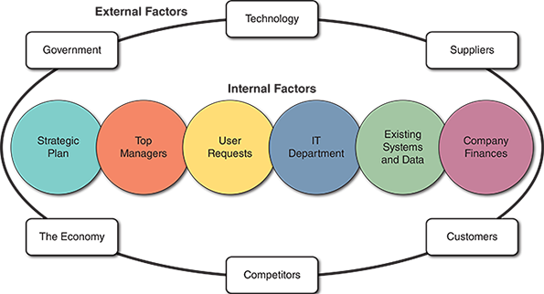

# crirtical Success Factors (video)
First, you have to make a business case to the team.

CSFs are the things you have to do or plan, which, if not accomplished will lead to certain failure.

- CRITICAL TO ORANIZATIONAL VIABILITY
- BENEFIT THE ENTNIRE ORGANIZATION
- ALIGN WITH ORGANIZATIONAL GOALS

Questions you should ask yourself:

- WILL IT WORK?
- WHY DO IT?
- CHANCES OF SUCCESS?
- OBSTACLES? can you break into this tough niche market?
- CHALLANGES
- WEAKNESSES

There are software tools that can help you with CSF, 
metrics used for this is:
1. COST OF INVESTMENT
2. PAYBACK PERIOD
3. RETURN ON INVESTMENT
4. MARKET PENETRATION

# Chapter Introduction

When you finish with this chapter, you should be able to.

1. Described the strategic planning process.
2. Explain how tools can support strategic planning.
3. Explained the concept of business case.
4. Summarize the six main reasons for systems request.
5. Describe the two factors affecting systems projects.
6. Explain how systems requests are processed.
7. Explain how systems request feasibility is assessed.
8. Explain how systems requests are prioritized.
9. Conduct a preliminary investigation.

Chapter two explains how to analyze a business case. This chapter also explains why it is essential to understand:
- business operations and requirements
- how informations technology (IT) projects support a company's overall strategic plan
- How systems projects are started
- How systems analyst conduct a feasibility study and perform preliminary investigations
    - Which concludes with a management report

The chapter includes three case in point discussion questions to help contextualize the concepts described in the text. The scenario described in the Ethical Issues section of the end of chapter exercises asked the system analyst to consider the implications of granting preferential treatment to a system enhancement request when the request originates with a friend of the project's manager.

# 2.1 strategic Planning
`Strategic planning` is identifying long term organizational goals, strategies and resources. A strategic plan looks beyond day-to-day activities and focuses on a horizon of 3510 or more years.

IT managers have to prepare for long range needs such as a new data warehouse, even as they handle immediate problems, such as a logic bug but in the payroll system. In most companies, the IT team reviews each IT related proposal, project, and system requests to determine if it presents a strong business case or justification. The following section provides an overview of strategic planning, a description of SWOT analysis and look at the role of the IT department.
## 2.1.1 Strategic Planning Overview
Strategic planning starts with a `mission statement` that reflects the firm's vision, purpose and values. Mission statements usually focus on long term challenges and goals. The importance of the firm's stakeholders and a commitment to the firm's role as a corporate citizen. For example, Google's mission statement posted on its website is stated succinctly as _"to organize the world's information and make it universally accessible and useful"_.

With the mission statement as a backdrop, a firm develops short term goals and objectives. For example, the company might establish one year, 3 year, and five year plans for expanding market share. Next, the company might create a list of shorter term objectives to achieve those goals. For example, if it wants to increase online orders by 30% next year, a company might set quarterly objectives with monthly milestones. High priority objectives are called critical success factors. A `critical success factor` must be achieved to fulfill the company's mission.

Objectives also might include tactical plans, such as creating a new website and training a special customer support group to answer email inquiries. Finally, the objectives translate into day-to-day business operations supported by IT and other corporate resources. The outcome is a set of business results that affect company stakeholders.
### Case in Point: *Pets for Rent*
Pets for Rent is an innovative company that brings puppies to corporate meetings. The company's CEO, says that having puppies in a room with employees in an informal setting helped breakdown communication barriers and foster a great sense of teamwork and comradery. Since this is a new company, the CEO has asked you if a mission statement is necessary. After you review the chapter material, write a brief memo with your views. Be sure to include (and not so good) examples of actual mission statements you find online.

## 2.1.2 SWOT Analysis

The letters SWOT stand for strengths, weaknesses, opportunities and threats. A `SWOT analysis` can focus on a specific product or project, as operating division, an entire company, or admission statements. The aim is to avoid seeking unrealistic, unprofitable, or unachievable goals.  

 An Enterprise SWOT analysis usually begins with these questions:

 - What are our strengths and how can we use them to achieve our business goals?
 - What are our weaknesses and how can we reduce or eliminate them?
 - What are our opportunities and how do we plan to take advantage of them?
 - What are our threats and how can we assess, manage and respond to the possible risks?

 A SWOT Analysis examines a firm's technical, human and financial resources. In Figure 2-1, the bulleted list show a typical strengths and weaknesses, opportunities and threats for an organization considering expanding its web-based online operations.

 As the swap process continues, management reviews specific resources, business operations and valuable assets. For example, suppose that the company owns a vital patent. A SWAT review for the patent might resemble Figure 2-2.

 There is no standard approach to strategic planning. Some managers believe the firm's mission statement should be inspirational to its stakeholders. Others feel that unless a firm starts with a realistic SWAT assessment, it might develop an unachievable mission statement. Most companies view the strategic planning process as a dynamic interaction. The company's mission statement reflects a long term horizon but sets achievable and consistent goals with real world conditions.

## 2.1.3 The Role of the IT Department
A systems analyst should be interested in strategic planning because it reflects a higher level of involvement in supporting the project's direction. For example, while working on the same project, one analyst might say, "I am using a CASE tool", while the other says " I am helping the company succeed in a major new business venture". Systems analysis should focus on the IT department's more significant strategic role, even as they carry out through day-to-day technical tasks.

Experienced analysts no planning is essential for IT, project success and will start as early as possible. Careful planning can help ensure that.

- The project's support overall business strategy and operational needs.

- The project scope is well defined and clearly stated.

- The project goals are realistic, achievable, *and* tied to specific statement assumptions, constraints, factors and other inputs.

During the planning process, management and IT should be closely linked. In the past a typical IT department handled all aspects of systems development and consulted users only when the department wanted user input. Today's systems development is much more team oriented. In addition, new approaches to systems development, such as _agile methods_, typically involve groups of *users*, *managers* and *IT staff* working together right from the start of the project.

Although Team oriented development is the norm, some companies still see the role of the IT department as a gatekeeper responsible for screening and evaluating systems requests. Should the IT department perform the initial evaluation or should a cross functional team do it? The answer probably depends on the company size, the nature of the system's request, and the scale of the project. For example, in smaller companies or firms where only one person has IT skills, that person ask as the coordinator and consults closely with the users and managers to evaluate systems requests. Larger firms are likelier to use an evaluation team or a systems review committee.

# 2.2 Strategic Planning Tools
Irrespective of the development strategy used, many organizations still rely on the IT group to provide guidance when selecting tools to support strategic planning activities. Some analysts stick to traditional text based methods using Microsoft Word tables to provide structure and clarity. Others prefer a spreadsheet such as Microsoft Excel because it is easy to display priorities and the relative importance of planning assumptions.
 New. New.

 A more sophisticated approach uses a CASE tool to define and document the overall environment. Such devices can integrate various statements, entities, data elements and graphical models into an overall structure. The result is more consistant, better quality and much less effort for the systems analyst. Figure 2-3 Shows a cloud based road mapping software product from Roadmonk that provides integrated support for product strategy, visioning, development and communication. Other strategic planning tools are not CASE tools, but techniques sometimes supported by software programs. For example, mind maps, balanced scorecards, and gap analysis are all valuable techniques that can be part of strategic planning in an organization. And the central rule of the system analyst is to know when these tools and techniques can best be used in particular project context.

# 2.3 The Business Case
During the systems planning phase, the IT team reviews a request to determine if it presents a strong business case. The term business case refers to a proposal's reasons or justification. In addition, the analyst must consider the company's overall mission objectives and IT needs to perform the review.

 A business case should be comprehensive yet easy to understand. We should clearly describe the project, justify proceedings and estimate its financial impact. Specifically, the business case should answer questions such as the following:

 - Why are we doing this project?

- What is the project about?

- How does this solution address key business issues?

- How does this solution address key business issues?

- How much will it cost and how long will it take?

- Will we suffer a productivity loss during the transition?

- Who will work on the project?

- What is the return on investment and payback?
- What are the risks of doing the project? What are the risks of not doing the project?

- Which metrics will be used to measure the success of the project?

- What alternatives exist?

 Examples of business cases, both good and bad, can be found online. Search for sample business case and examine the structure and content of some available examples, comparing and contrasting business cases for different areas. Such as government contracts versus private enterprises is particularly instructive.

# 2.4 System Requests
The starting point for most information systems projects is called a Systems request, a formal way of asking for IT support. For example, a systems request might propose enhancements for an existing system, correcting problems, replacing an older system, or developing an entirely new information system to support a company's current and future business needs.

Figure 2-4 Shows that the six main reasons for systems requests are stronger controls, reduce costs, more information, better performance to improved customer service, and more support for new products and services.

### Stronger Controls
A system must have adequate controls to ensure that data is secure and accurate. This is becoming increasingly important given the number of data breaches that occur daily. In addition for specific application areas. (E. G, health care and financial services), there are standards that the company must follow to ensure compliance with applicable laws.

Some standard security controls include passwords, various levels of user access, and encryption or coding data to keep it safe from unauthorized users. In addition, hardware based security controls include a biometrics devices that can identify a person by a retina scan or by mapping a fingerprint pattern. The technology uses infrared scanners that create images with thousands of measurements of personal physical characteristics, as shown in Figure 2-5, Which displays Apple's face ID security mechanism on the iPhone.

In addition to being secure, data must be accurate. Controls should minimize data entry errors whenever possible. For example, if a user enters an invalid customer number, the order processing system should reject the entry immediately and prompt the user to enter a valid number. Data and tree controls must be effective without being excessive. If a system requires users to confirm every item within Are you sure Y/N? message, internal users and customers might complain that the system is not user friendly.

### Reduced Costs
The current system could be expensive to operate or maintain due to technical problems, designed weaknesses or changing business demands. It might be possible to adapt the system to newer technology or upgrade it. On the other hand, a cost benefit analysis might show that a new system would be more cost effective and provide better support for long term objectives.

### More Information
The system might produce information that is insufficient, incomplete, or unable to support the company's changing information needs. For example, a system that tracks customer orders might not be capable of analyzing and predicting marketing trends. However, in the face of intense competition and rapid produ product development cycles, managers need to best information to make significant decisions on planning, designing, and marketing new products and services.

### Better Performance
The current system might not meet performance requirements. For example, it might respond slowly to data inquiries at certain times, or be unable to support company growth. Performance limitations also occur when a system designed for a specific hardware configuration becomes obsolete when new hardware is introduced.

### Improved Service 
Systems requests often aim to improve service to customers or users within the company. For instance, allowing mutual fund investors to check their account balances on the website, storing data on a rental car customer preferences, or creating an online college registration system provides valuable services and increases customer satisfaction.

### More Support for new Products and Services
New products and services often require new types or levels of IT support. For example, a software vendor might offer an automatic upgraded service for subscribers, or a package delivery company might add a special service for RFID tagged shipments. In situations like these, additional IT support will likely be required. At the other end of the spectrum, product absolescence can also be an important factor in IT planning. As new products enter the marketplace, vendors often announce that they will no longer provide support for older versions. A lack of vendor support would be important consideration in deciding whether or not to upgrade.

# 2.5 Factors Affecting System Projects
Internal and external factor affect every company's business decisions, and IT projects are no exception. Figure 2-6 shows internal and external factors that shape corporate IT choices.

## 2.5.1 Internal Factors
Internal factors originating from changes in company policies and standards can impact the project. Examples are changes in product standards, quality standards, the company's infrastructure and the location of resources. Other internal factors include the strategic plan, top managers, user request, IT department, existing systems and data and company finances.

### Strategic Plan
A company's strategic plan sets its overall direction and impacts. It projects company goals and objectives that need IT support will generate system requests and influence IT priorities. A strategic plan emphasizes technology creates a favorable climate for IT projects throughout the organization.

### Top Managers
Because significant resources are required, top management usually initiates large scale projects. Those decisions often result from strategic business goals that require new IT systems, more information for decision making processes, or better support for mission critical information systems.

### User Requests
As users rely more heavily on information systems to perform their jobs, they will likely request even more IT services and support. For example, sales reps might ask for improvements to the company's website, a more robust sales analysis report, a network to link all sales locations, or an online system that instantly lets customers obtain their order status. Or users might not be satisfied with the current system because it is difficult to learn or lacks flexibility. In addition, they might want information systems to support business requirements that did not even exist when the system was first developed.

### Information Technology Department
Systems project requests also come from the IT department. IT staff members often make recommendations based on their knowledge of business operations and technology trends. IT proposals might be strict technical, such as replacing specific network components, or suggestions might be more business oriented, such as proposing a new reporting or data collection system.

### Existing Systems and Data
Errors or problems in existing systems can trigger requests for system projects. Analysts sometimes spend too much time reacting to day-to-day issues with older systems without looking at underlying causes. This approach can turn an information system into a patchwork of Corrections and changes that cannot support the company's overall business needs. This problem typically occurs with legacy systems which are older and less technologically advanced. When migrating to a new system, IT planners must plan a conversion of existing data, as described in detail later in this book.

### Company Finances
A companies financial status can affect systems projects. If the company is going through a difficult time, the project may be postponed until more cash is available to finance the effort. On the other hand, if the company is enjoying financial success, the decision to embark on a new project may be easier to make.

## 2.5.2 External Factors

External factors include technology suppliers, customers, competitors, the economy and the government. The `PESTEL framework` can help in assessing these external factors. The framework is based on six environmental types, political, economic, social, technical, environmental and legal.
### Technology
Changing technology is a major force affecting business and society. For example, the rapid growth of telecommunications, increased computing power and continues miniaturization of electronic components has created new industries and technologies, including the proliferation of smartphones and the app ecosystem.

 Technology also dramatically reshapes existing business operations. For example, the success of scanner technology resulted in universal barcoding that now affects virtually all products. However, some industry experts predict that barcode technology, which is many decades old, will be overshadowed by `electronic product code EPC`. Technology that uses RFID tags to identify and monitor the movement of each product from the factory floor to the retail checkout counter.

 Quick Response Codes QR codes as shown in Figure 2-7 are like bar codes but squares in shape. They contain more information than traditional bar codes but less than RFID tags. However, they are less expensive than RFID tags and can be printed on almost anything, including online advertisements.

 The` Internet of Things IoT` is a near development involving almost all electronic devices communicating over a computer network. The communication can use radio signals as with RFID tags, digital messages or other means. Iot devices can be sensors, sending important information to centralized data storage and processing nodes. Iot devices also raised new security and privacy concerns that the systems analysts must consider.

### Suppliers
With the growth of` electronic data interchange (EDI)`relationships with suppliers are critically important. For example, an automobile company might require that suppliers code their parts in a specific manner to match the autos companies inventory control system. EDI also enables `Just In Time JIT` inventory systems that rely on computer to computer data exchange to minimize unnecessary inventory. The purpose of AJIT system is to provide the right products at the right place and time.

Blockchain technology is a promising mechanism for managing supply chains more powerfully than before. This is because blockchain provides inefficient, secure and transparent distributed Ledger system. Large companies like IBM already use blockchain to improve customer operations such as new light technologies shown in 2-8. According to the IBM blockchain "_**client success Stories**_" website related to sustainability, "_Newlight technologies create high performance consumer goods from greenhouse gas. Blockchain ensures product processes and environmental impact can be tracked, audited and communicated_". In other words, IBM, miss. Blockchain technology ensures transparency and trust in Newlight's operations.
### Customers
Customers are vitally important to any business. Information systems that interact with customers usually receive top priority. Many companies implement customer relationship management. CRM systems that integrate all customer related events and transactions including marketing, sales and customer service activities. Vendor oriented CRM systems are often interconnected with supply chain management "SCM" systems. CRM components can provide automated responses to sales inquiries, online order processing, and inventory tracking. Some suppliers use robots for order fulfillments, such as the robotic Drive units from Amazon Robotics that Amazon.com uses in their warehouses.

 Another RFID. Application is called electronic proof of delivery (EPOD.) Using EPOD, a supplier uses RFID tags on each crate case or shipment unit to create a digital shipping list. The customer receives the list and scans the incoming shipments. If a discrepancy is detected, it is reported and adjusted automatically. Minor shipping inconsistencies might not otherwise be traced because they would be expensive to investigate manually. This is an example of technology related cost control.
### Competitors
Competitors drives many information systems decisions. For example, if one cellular telephone provider offers a new digital device, other firms must watch. The plan to remain competitive. In addition, new product research and development, marketing, sales, and service require IT support.
### The Economy
Economic activity has powerful influence on corporate information management. In a period of economic expansion, firms must be ready with scalable systems that can handle additional volume and growth. However, predicting the business cycle is not in exact science, and careful research and planning are essential.
### Government
Federal, state and local government regulations directly affect the design of corporate information systems. For example, up to date IRS reporting requirements must be designed into a payroll package.
# 2.6 Processing System Requests
In most organizations, the IT department receives more systems requests than it can handle. As a result, many organizations assign responsibility for evaluating systems requests to a group of key managers and users. Many companies call this group a `Systems Review Committee` or `Computer Resources Committee`. Regardless of the name, the objective is to use several analysts' combined judgments, and experience to evaluate project requests.

## 2.6.1 System Request Forms
Many organizations use a special form for systems request. Similar to the online example for tracking requests as shown in 2-9. A properly designed form streamlined request process and ensures consistency. The form must be easy to understand and include clear instructions. It should have enough space for all required information and indicate what supporting documents are needed. Most companies use online system request forms that users submit electronically because the form can be processed automatically.

 When the assistance request form is received, a system analyst or IT manager examines it to determine what IT resources are required for the preliminary investigation. A design person or a committee then decides whether to proceed with preliminary investigation. Sometimes a situation requires an immediate response. For example, if the problem involves a mission critical system, an IT maintenance team must restore normal operations immediately. When the system functions correctly, the team reviews and prepares a system request to document the work performed.
## 2.6.2 System Request Tools
When a number of requests submitted through automated forms becomes significant, or if requests originate from internal sources and external customers, special purpose system request tools can help manage the workflow. For example, Figure 2, Dash 10 illustrates the service request capabilities from Integrity that capture, manage, and route requests to system analysis based on definable business rules. In this way requests are tracked and analyzed for improved performance.

## 2.6.3 System review Commitee
Most large companies use a systems review committee to evaluate systems request instead of relying on a single individual, a committee approach provides a variety of experiences in knowledge. In addition, with a broader viewpoint, a committee can establish priorities more effectively than an individual, and one person's bias is less likely to affect the decisions.

 A typical committee comprises the IT Director and several managers or representatives from other departments. In addition, the IT director usually serves as a technical consultant to ensure that committee members are aware of crucial issues, problems and opportunities.

 Although a committee offers many advantages, some disadvantages exist. For example, action on request must wait until the committee meets. Another potential drawback of a committee is that members might favor projects requested by their departments, and internal political differences could delay important decisions.

 Many smaller companies rely on one person to evaluate systems requests instead of a. However, suppose only one person has the necessary IT, skills and experience. In that case, that person must consult closely with users and managers throughout the company to ensure that business and operational needs are considered carefully.

 Whether one person or a committee is responsible, the goal is to evaluate the request and set priorities. For example, suppose your request must be reviewed.

1. The marketing group wants to analyze customer spending habits and forecast future trends. 

2. The Technical Support group wants a cellular link so service representatives can instantly download technical data.

3. The accounting department wants to redesign customer statements and allow Internet. access.

 4. The production staff wants an inventory control system to exchange data without major suppliers.

 Which projects should the firm pursue? What criteria should be applied? How should priorities be determined to answer those questions, the individual or the committee must assess of the feasibility of each request.

### Case 2.2: Attaway. Airlines, Part 1
You are the IT Director at Attaway Airlines, a small regional air carrier. You chair the company's systems review committee and deal with strong disagreements about 2 key projects. The marketing manager says it is vital to have a new computerized reservation system that can provide better customer service and reduce operational cost. The vice president of finance is equally adamant that a new accounting system is needed immediately because it will be costly to adjust the current system to new federal reporting requirements. The Vice President outranks the marketing manager, and the Vice President is your boss. The next meeting is set at 9:00 AM tomorrow. How will you prepare for the rigorous discussions likely to occur at the meeting? What questions and issues should be raised?

# 2.7 Assessing Request Feasibility
As described earlier, a systems request must pass several tests to see whether it is worthwhile to proceed further. The first step is to identify and eliminate systems requests that are not feasible. For example, a request would not be feasible if it required hardware or software that the company already had rejected.

 Even if the request is feasible, it might not be necessary. For example, requesting multiple report versions (e.g, a spreadsheet and a graphics series) could require considerable design and programming effort. A better alternative might be downloading the server data to a personal computer based software package and showing users how to produce their own reports. In this case, training users would be a better investment than making reports for them.

 Sometimes assessing request feasibility is simple and can be done in a few hours if the request involves a new system or significant change. However, extensive fact finding and investigation in the form of feasibility studies are required.

## 2.7.1 Feasibility Studies
A feasibility study uses four main yardsticks to measure a proposal operational feasibility, economic feasibility, technical feasibility, and schedule feasibility. How much effort should go into feasibility study depends on the nature of the request. For example, if a department wants an existing report sorted in a different order, the analysts can decide quickly whether the request is feasible. On the other hand, a proposal by the marketing department for a new market research system to predict sale trends would require much more effort. In either case, the system analysts should ask these important questions.

- Is the proposal desirable in an operational sense? Is it a practical approach that will solve a problem or take advantage of an opportunity to achieve company goals?

- Is the proposal technically feasible? Are there necessary technical resources and people available for the project?

- Is the proposal economically desirable? What are the projected savings and cost? Are other intangible factors involved, such as customer satisfaction or company image? Is the problem worth solving and will the request result in a sound business investment?

- Can the proposal be accomplished within an acceptable time frame?

To obtain more information about a systems request, initial fact binding might be accomplished by studying organizational charts, performing interviews, reviewing current documentation, observing operations, and surveying users. Sometimes developing prototypes can provide additional insight into the feasibility of the request. If the system's request is approved, more intensive fact finding will continue during the system analysis phase.

## 2.7.2 Operational Feasibility
Operational feasibility means that a proposed system will be used effectively after it has been developed. If users struggle with a new system, it will not produce the expected benefits. Organizational culture can also affect operational feasibility. For instance, a system that works well in a highly structured workplace might be unpopular in a more relaxed corporate culture. Operational feasibility is difficult to measure precisely, but must be studied very carefully. The following questions would help predict the system's operational feasibility.

- Does management support the project? To user support the project. Is the current system well liked and effectively used? Do users see the need for change?

- Will the new system result in a workforce reduction? If so, what will happen to the affected employees?

- Will the new system require training for users? If so, is the company prepared to provide the necessary resources for training current employees?

- Will users be involved in planning the new system right from the start?

- Will the new system place new demands on users or require any operational changes? For example, will any information be less accessible or produce less frequently? Will performance decline in any way? If so, will an overall gain to the organization outweigh individual losses?

- Will customers experience adverse effects in any way, either temporarily or permanently?

- Will any risk of the company's image or goodwill result?

- Does the development schedule conflict with other company priorities?

- Do legal or ethical issues need to be considered? For example, protecting customer data privacy (_Whether explicit in law or expected by the customer_) has become paramount.

## 2.7.3 Economic Feasibility
`Economic feasibility` means that the projected benefits of the proposed system outweigh the estimated costs, usually considered the `total cost of ownership (TCO)`, which includes ongoing support and maintanance costs as well as acquisition costs. To determine TCO, the anlyst must estimate costs in each of the following

- People, including IT staff and users.

- Hardware and equipment.

- Software, including in house development as well as purchases from vendors.

- Formal and informal training, including peer to peer support.

- Licenses and fees.

- Consulting expenses.

- Facility cost.

- The estimated cost of not developing the system or postponing the project.

`Tangible costs` such as those listed above can usually be measured in dollars, but `intangible cost` also must be considered. For example, low employee morale might not have an intermediate dollar impact, but certainly will affect the company's performance.

In addition to cost, tangible and int....the preliminary investigation phase 
In addition to cost, tangible and intangible benefits, the company must be assessed. The system's review committee will use those figures and cost estimates to decide whether to pursue the project beyond the preliminary investigation phase

`Tangible benefits` or benefits that can be measured in dollars. Tangible benefits result from a decrease in expenses and increase in revenues are both. Examples of tangible benefits include the following.

- A new scheduling system that reduces over time.

- An online package tracking system that improves services and decreases the need for clerical staff.

- A sophisticated inventory control system that cuts excess inventory and eliminates production delays.

Intangible benefits are advantages that are difficult to measure in dollars but are important to the company. Examples of intangible benefits include the following.

- A user friendly system that improves employee job satisfaction.

- A sales tracking system that supplies better information for marketing decisions.

- A new website that enhances the company's image.

 The development timetable must also be considered because some benefits might occur when the system is operational, but others might only arise later.

## 2.7.4 Technical Feasibility
`Technical feasibility` refers to the technical resources needed to develop, purchase, install or operate this system. When assessing technical feasibility an analysts should consider the following points.

- Does the company have the necessary hardware, software and network resources? If not, can those resources be acquired without difficulty?

- Does the company have the needed technical expertise? If not, can it be acquired?

- Does the proposed platform have sufficient capacity for future needs? If not, can it be expanded?

- Will a prototype be required?

- Will the hardware and software environment be reliable? Will it integrate with other company information systems now and in the future? Will it interface properly with external systems operated by customers and suppliers?

- With a combination of hardware and software supply adequate performance. Do clear expectations and performance specifications exist?

- Will the system be able to handle future transaction volume and company growth?
Remember that system request not technically feasible, can be resubmitted as new hardware, software or as expertise becomes available. Development costs might decrease, or the value of benefits might increase enough that a system request eventually becomes feasible. Conversely, an initially feasible project can be rejected later.

## 2.7.5 Schedule Feasibility
S`chedule feasibility` means a project can be implemented in an acceptable time frame. A systems analyst must consider the interaction between time and cost when assessing schedule feasibility. For example, speeding up a project schedule might make a project feasible, but much more expensive.

 Other issues that relate to schedule feasibility include the following:
 - Can the company or the IT team control the factors that affect the schedule feasibility?
 - Has manager been established a firm timetable for the project?
 - What conditions must be satisfied during the development of the system?
 - Will an accelerated schedule pose any risks? If so, are the risks acceptable?
 - Will project management techniques be available to coordinate and control the project?
 - Will a project manager be appointed?

 Various project management tools like Microsoft Projects and techniques like gaunt charts and network diagrams are described later in the book.

# 2.8 Setting Priorities
After rejecting system requests that are not feasible, the Systems Review Committee must establish priorities for the remaining items. If tools are used as part of the review process, the request may already be in a particularly or fully sorted order. The highest priority goes to the project requests that provide the most significant benefit at the lowest cost in the shortest time. However, many factors influence project evaluation. More details on project tasks and priorities are discussed later in the book.

## 2.8.1 Dynamic Priorities
It is important to note that many projects are dynamic in nature. For example, projects that have adopted an agile methodology are prone to rapid changes throughout the SDLC. These changes can cost request priorities to change as well.

 For example, acquisition costs might increase over time, making the project more expensive than anticipated. This can affect the economic feasibility of several requests. In addition, managers and users sometimes lose confidence in a project. For all those reasons, feasibility analysis and priority setting are ongoing tasks that must be performed throughout the system's development process.

## 2.8.2 Factors That Affect Priority
When assessing a project's priority, a systems and analysts should consider the following:
- Will the proposed system reduce costs? Where, when, how, by how much?

- Will the system increased revenue for the company. Where? When? How? By how much?

- Will the systems project result in more information or produce better results? How? Are the results measurable?

- Would the system serve customer better?

- Will the system serve the organization better?

- Can the project be implemented in a reasonable time frame? How long will results last?

- Are the necessary financial, human and technical resources available?

Few projects will score high in all areas. Some proposals might not reduce costs, but will provide important new features. Other systems might reduce operating costs substantially, but require the purchase or lease of additional hardware. Finally, some systems might be desirable but require several years of development before producing significant benefits.

 The analysts should use tangible costs and benefits that can be measured in dollars whenever possible. However, the proposal might involve intangible benefits, such as enhancing the organization's image, raising employee morale or improving customer service. These examples are harder to measure, but should also be considered.

## 2.8.3 Discretionary and Nondiscretionary Projects

# 2.9 The Preliminary Investigation
## 2.9.1 Planning the Preliminary Investigation
## 2.9.2 Performing the Preliminary Investigation
## 2.9.3 Summarizing the Preliminary Investigation
# Chapter Review
# Key Terms
# Discussion Topics
# Ethical Issues

