# Chapter 5 — Data Flow Modeling (Skeleton)

## Table of Contents

* [Chapter Introduction](#chapter-introduction)
* [5.1 Logical versus Physical Models](#51-logical-versus-physical-models)
* [5.2 Data Flow Diagrams](#52-data-flow-diagrams)
* [5.3 Data Flow Diagram Symbols](#53-data-flow-diagram-symbols)

  * [5.3.1 Process Symbols](#531-process-symbols)
  * [5.3.2 Data Flow Symbols](#532-data-flow-symbols)
  * [5.3.3 Data Store Symbols](#533-data-store-symbols)
  * [5.3.4 Entity Symbols](#534-entity-symbols)
  * [5.3.5 Using DFD Symbols](#535-using-dfd-symbols)
* [5.4 Drawing Data Flow Diagrams](#54-drawing-data-flow-diagrams)
* [5.5 Drawing a Context Diagram](#55-drawing-a-context-diagram)

  * [5.5.1 Example: Grading System](#551-example-context-diagram-for-a-grading-system)
  * [5.5.2 Example: Order System](#552-example-context-diagram-for-an-order-system)
* [5.6 Drawing a Diagram 0 DFD](#56-drawing-a-diagram-0-dfd)

  * [5.6.1 Example: Grading System](#561-example-diagram-0-dfd-for-a-grading-system)
  * [5.6.2 Example: Order System](#562-example-diagram-0-dfd-for-an-order-system)
* [5.7 Drawing Lower-Level DFDs](#57-drawing-lower-level-dfds)

  * [5.7.1 Leveling Examples](#571-leveling-examples)
  * [5.7.2 Balancing Examples](#572-balancing-examples)
* [5.8 Data Dictionary](#58-data-dictionary)

  * [5.8.1 Documenting the Data Elements](#581-documenting-the-data-elements)
  * [5.8.2 Documenting the Data Flows](#582-documenting-the-data-flows)
  * [5.8.3 Documenting the Data Stores](#583-documenting-the-data-stores)
  * [5.8.4 Documenting the Processes](#584-documenting-the-processes)
  * [5.8.5 Documenting the Entities](#585-documenting-the-entities)
  * [5.8.6 Documenting the Records](#586-documenting-the-records)
  * [5.8.7 Data Dictionary Reports](#587-data-dictionary-reports)
* [5.9 Process Description Tools in Modular Design](#59-process-description-tools-in-modular-design)

  * [5.9.1 Process Descriptions in Object-Oriented Development](#591-process-descriptions-in-object-oriented-development)
  * [5.9.2 Modular Design](#592-modular-design)
  * [5.9.3 Structured English](#593-structured-english)
  * [5.9.4 Decision Tables](#594-decision-tables)
  * [5.9.5 Decision Trees](#595-decision-trees)
* [Chapter Review](#chapter-review)

---

## Chapter Introduction

**Learning Objecives**
When you finish this chapter, you should be able to:

1. Describe the relationship between logical and physical models.
2. Explain data flow diagrams.
3. Draw the four basic data flow diagram symbols.
4. Explain the six guidelines used when drawing data flow diagrams.
5. Draw context diagrams.
6. Draw diagram 0 data flow diagrams.
7. Draw lower-level data flow diagrams.
8. Create a data dictionary.
9. Apply process description tools in modular design.

Chapter 5 is the second of three chapters in the Systems analysis phase of the SDLC. This chapter discusses data and process modeling techniques that analyst use to show how the system transforms data into useful information. Data and process modeling involves three main items:

- Data flow diagrams
- Data dictionary
- Process descriptions

This chapter includes three case in point discussion questions to help contextualize the concepts described in the text. The scenario described in the **Ethical Issues** section explores how a system analyst should handle their new IT Manager's persistent request for propriety information from the analyst's previous employer (A competitor).

**Nav:** ➡️ [Next: 5.1 Logical vs Physical](#51-logical-versus-physical-models) · [Back to TOC](#table-of-contents)

---

## 5.1 Logical versus Physical Models

During the requirements engineering process described in the previous chapter, fact-finding techniques were used to investigate the current system and identify user requirements. This chapter and the next explain how that information is used to develop a logical model of A proposed system and document the system requirements. `A logical model` **shows what the system must do**, `regardless of how it will be implemented physically`. Later in the systems design phase, a `physical model` is **built** that **describes how the system will be constructed**.

 While structured analysis tools are used to develop a logical model for a new information system, such tools also **can be used to create physical models** of an information system. A physical model `shows how the system's requirements are implemented`. During the systems design phase, a physical model of the new information system follows the logical model and involves operational tasks and techniques.

logical model = "what"
Phisical model = "how"

To understand our relationship between logical and physical models, consider the beginning of the systems analysis phase. The physical operations of the existing system were studied before the logical model to understand how the current tasks are carried out in the existing system. Many systems analyst create a physical model of the current system and then develop a logical model before tackling a logical model of the new system. Performing that extra step allows them to understand the current system better.

 Many analysts follow a `Four Model` approach, which means that they develop a physical model of the current system, a logical model of the current system, a logical model of the new system, and the physical model of the new system. 

 > logical and physical of current and new system is made.

 The primary **benefit** of the four model approach is that it provides a `clear picture of current system functions` before any modifications or improvements are made. That is important because mistakes made early in systems development will affect later SDLC phases and can result in unhappy users and additional costs. Taking extra steps to avoid these potentially costly mistakes can prove worthwhile. Another advantage is that a news information `systems requirements are often quite similar to those of the current` information system, especially where their proposal is **based on new computer technology** rather than many new requirements. Adapting to current system's logical model to the new one in these cases is a straightforward process.


 The only **disadvantage** of the four model approach is the `added time and cost needed` to develop a logical and physical model of the current system. Most projects have very tight schedules that _might need more time_ to create the current system models. Additionally, users and managers want to see progress on the new system. They are much less concerned about documenting the current system. The systems analyst `must empathize the importance of careful documentation` and ((**resist the pressure**)) to hurry the development process at the risk of creating serious problems later.

  > Most time requirements are very similar if approval is based on adopting new technologies; With that being said the **Four Model** approach should not be intimidating. Its worth the time and money. Yes money and time are the downside, so do not give in the pressure to speed it up. Mistakes could be costly!


**Nav:** ⬅️ [Prev: Introduction](#chapter-introduction) · ➡️ [Next: 5.2 DFDs](#52-data-flow-diagrams) · [Back to TOC](#table-of-contents)

---


## 5.2 Data Flow Diagrams

Systems Analyst use many graphical techniques to describe an information system. One popular method is to draw a set of dataflow diagrams (DFDs). A `DFD` uses various symbols to show **how the system transforms input data into useful information**. Other graphical tools include: 
- Object models, as explained in the chapter on **Object modeling.**
- Entity Relationship diagrams, which are described in the chapter on **Data Design.**

During the `systems analysis phase` of the SDLC, the systems analyst creates a visual model of the information system using a set of DFDS. In his Seminole book, _The Visual Display of Quantitative Information_, author and renowned academic Edward Tuft provides guidance on creating effective diagrams to convey complex information concisely. ADFD is an example of this `visual explanation` of system **behavior**.

ADFD shows `how data moves` through an information system, but does **NOT** show program logic or processing steps. A set of DFDS provides a logical model that shows _what_ the system does, not _how_ it does it. That distinction is important because focusing on implementation issues at this point would restrict the search for the most effective system design.

> Besides the tools we are covered in those chapters, this introduces DFDs, which are diagrams that show WHAT the system should do, not how. How is data moving? If you focus on implementation, you are going to limit how effective system design. We are not there yet, as we are still in the `Analysis Phase`

**Nav:** ⬅️ [Prev: 5.1](#51-logical-versus-physical-models) · ➡️ [Next: 5.3 Symbols](#53-data-flow-diagram-symbols) · [Back to TOC](#table-of-contents)

---


## 5.3 Data Flow Diagram Symbols

Data flow diagrams use four basic symbols representing `processes`, `data flows`, `data stores`, and `entities`. Several versions of DFD symbols exist, but they all serve the same purpose. The FDA examples in this textbook use _Gane Sarson symbols_. _Yourdan symbols_ are another popular symbol set. **Figure 5-1** shows examples of both versions. In this text, symbols are referenced using all capital letters for the symbol name.

Figure 5-1
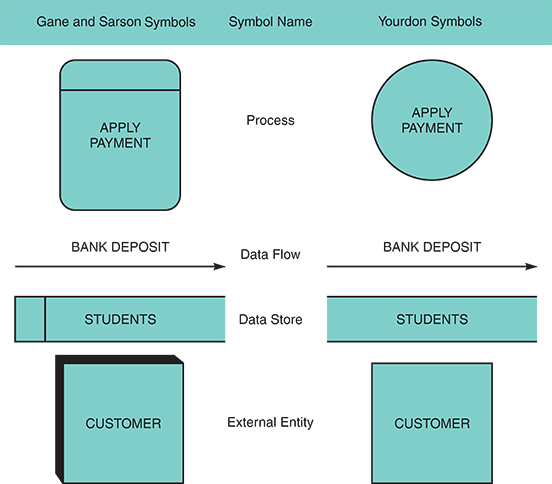

**Nav:** ⬅️ [Prev: 5.2](#52-data-flow-diagrams) · ➡️ [Next: 5.4 Drawing DFDs](#54-drawing-data-flow-diagrams) · [Back to TOC](#table-of-contents)


### 5.3.1 Process Symbols

A process receives input data and produces output with a different **content**, **form**, or `both`. For instance, calculating pay uses two `inputs (pay rate and hours worked)` To produce one `output (total pay)`. Processes can be very **simple** or quite **complex**. In a typical company, processes might include: 

- calculating sales trends
- filling online insurance claims
- ordering inventory from a supplier's system
- verifying email addresses for web customers. 

Processes contain **`business logic`**, also called **business rules**, which transforms the data and produces the required results.

The gain in Sarson symbol for a `process is a triangle with rounded corners`. The name of the process **appears inside the rectangle**. The process name identifies a _specific function_ and consists of a verb (and an adjective if necessary) followed by a singular noun.

Processes may be:
- APPLY RENT PAYMENT (verb, [adjective] noun)
- CALCULATE COMMISSION
- ASSIGN FINAL GRADE
- VERIFY ORDER
- FILL ORDER

Processing details are NOT shown in DFD. For example, there might be a process named `DEPOSIT PAYMENT`. The process symbol does not reveal the business logic for the `DEPOSIT PAYMENT` process. A process description is created to **document the logic** as explained later in this chapter.

In a DFD, a process symbol can be called a `black box` because the process's inputs, outputs, and general functions are known, but the underlying details and `logic are hidden`. By showing processes as black boxes, an analyst can create DFS that show how the system functions but avoid unnecessary detail and clutter. When analysts want to show additional levels of detail, they **can zoom in on a process symbol** and _create a more in depth DFD_ that illustrates the process's internal workings, which` might reveal even more processes`, data flows and data stores. In this manner, the information system can be modeled as a series of increasingly detailed pictures.

The network router shown in **Figure 5-2** is an example of a black box. An observer can see cables that carry data into and out of the router, but the router's internal operations are not revealed. Only the results are apparent.


[⬆️ Back to 5.3](#53-data-flow-diagram-symbols) · [Back to TOC](#table-of-contents)


### 5.3.2 Data Flow Symbols

A `data flow` is a `path for data to move from one part of the information system to another`. A data flow in a DFD **represents 1 or more data items**. For example, a data flow could consist of a `single` data item (such as a student ID number) `Or a set of data` (such as a class roster with student ID numbers, names, and registration dates for a specific class) Although a DFD does not show the detailed contents of a data flow, that information is included in the _data dictionary_, which is described later in this chapter.

The symbol for a data flow is `a line with a single or double Arrowhead`. The data flow name appears above, below or alongside the line. A data flow name includes a _singular noun_ and an _adjective_ (_if needed_). Examples of dataflow names are `DEPOSIT`, `INVOICE`, `PAYMENTS`, `STUDENT GRADE`, `ORDER`, and `COMMISISON`. Exceptions to the singular name are dataflow names such as `GRADING PARAMETERS`. Where he singular name could mislead the analyst into thinking a **single parameter** or **data** item exists.

> The exception described here indicates that sometimes using a singular name could be misleading. If we use grading parameter. It might sound like only one parameter is being passed, but in reality the system is passing multiple grading criteria. So for grading parameter. It would be more accurate if you did grading parameters, plural.

**Figure 5-3** shows correct examples of data flow and process symbols connections. Because a `process changes the data's content or form`, `at least one` data flow must **enter** and one data flow must **exit** each process symbol, as in the CREATE INVOICE process.

 A symbol can have more than one outgoing data flow as shown in the **GRADE STUDENT WORK** process, or more than one incoming data flow as shown in the **CALCULATE GROSS PAY** process. A process also can connect to any other symbol, including another process symbol, as shown by the connection between `VERIFY` order and `ASSEMBLE` order in **Figure 5-3**. A day to flow therefore must have a process symbol on **at least one end**.

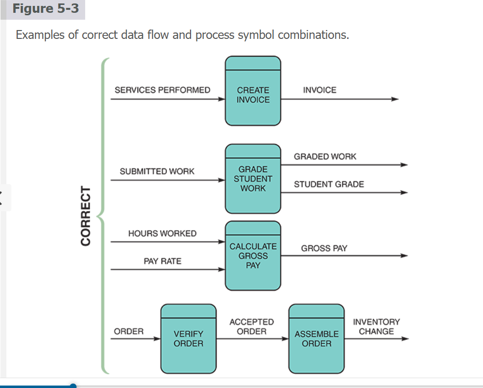

The **Figure 5-4** shows three dataflow and process combinations that **must be avoided**:

- **Spontaneous generation**. For instance, the `APPLY INSURANCE PREMIUM` process produces output **without input** data flow. Because it has no input. The process is called a spontaneous generation process. 

- **Black hole**. `CALCULATE GROSS PAY` pay is called a black hole process, which is a process that has input but produces **no output**.

- **Gray hole**. A Gray hole is a process with **at least** `one input and one output`, but the input is insufficient to generate the output shown. For example, a date of birth input cannot produce a final grade output in the `CALCULATE GRADE` process. 


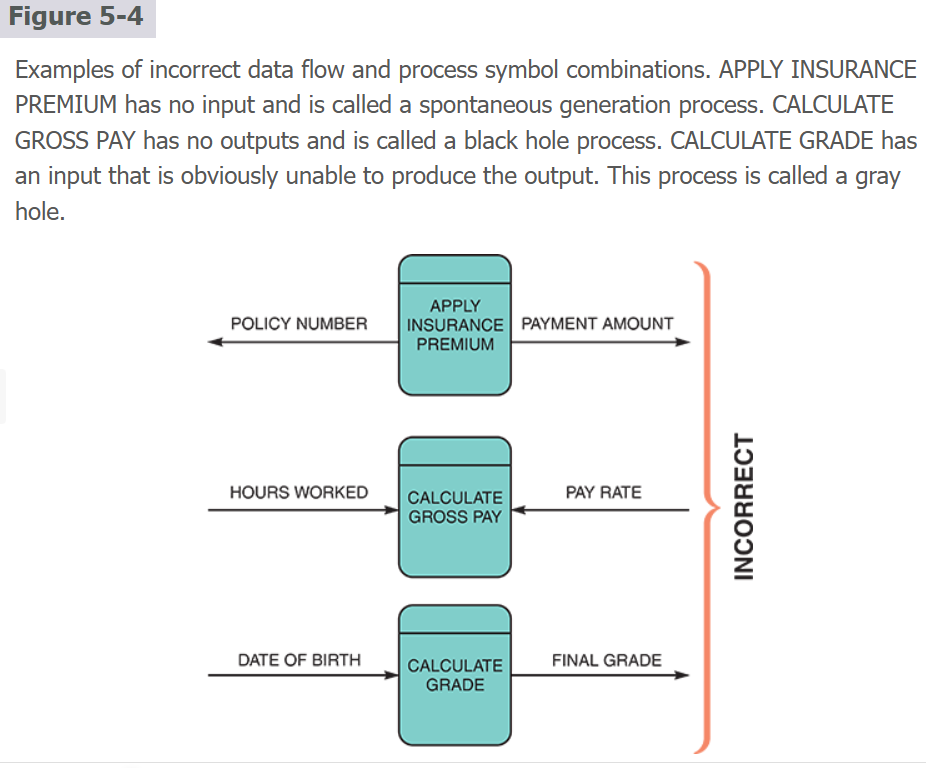

Figure 5-4:
Examples of incorrect data flow and process symbols combinations:

`APPLY INSURANCE PREMIUM` has no input and is called a **spontaneous generation** process.

`CALCULATE GROSS PAY` has no outputs and is called a **black hole** process. 

`CALCULATE GRADE` has an input that is obviously unable to produce the output. This process is called a **Gray hole**.

> Spontaneous generation black holes and Gray holes are logically impossible in ADFD because a process must act on input shown by an incoming data flow and produce output represented by an outgoing data flow.

[⬆️ Back to 5.3](#53-data-flow-diagram-symbols) · [Back to TOC](#table-of-contents)


### 5.3.3 Data Store Symbols

A `data store` is used in a DFD to represent data that the system stores because one or more processes `need to use the data later`. For instance, instructors need to store student scores on tests and assignments during the semester to assign final grades at the end of the term. Similarly, a company store's employee salary and deduction data during the year to print W2 forms with total earnings and deductions at the end of the year. `DFD does not show the detailed contents` of a data store. The specific structure and data elements are defined in the _data dictionary_, which is discussed later in this chapter.

The physical characteristics of a data store are unimportant because the logical model is the only concern at this point. Also, the time that the data is stored is unimportant. It can be a matter of seconds while a transaction is processed, or a period of months while data is accumulated for year end processing. What is important is that a process needs access to the data at some later time.

 In DFD, the Gane in Sarson symbol for a data store is a `flat rectangle that is open on the right side, enclosed on the left side`. The name of the data store appears between the lines and identifies the data it contains. A data store name is a plural name consisting of a **noun** and **adjective** (_if needed_). Examples of data store names are `STUDENTS`, `ACCOUNTS REVEIVABLE`, `PRODUCTS`, `DAILY PAYMENTS`, `PURCHASE ORDERS`, `OUTSTANDING CHECKS`, `INSURANCE POLICIES`, and `EMPLOYEES`. **Exceptions** to the plural name rule are collective nouns that represent multiple occurrences of objects. For example, `GRADEBOOK` represents a group of students and their scores.

 A database store` must be connected to a process with a data flow`. Figure 5-5 illustrates typical examples of data stores. Because data stores represent data storage for use by another process in the future. Each data store has **at least 1 incoming and outgoing data** flow. It is connected to a process symbol with a data flow.

 ![Figure 5-5]Figures/(image-4.png)

 Violations of the rule that Data store `must have at least one incoming and one outgoing dataflow` are shown in **Figure 5-6**. In the first example, two data stores are misconnected because no process is between them. Also, courses has no incoming data flow and students has no outgoing data flow. In the second and third examples, the data stores lack either in outgoing or incoming data flow.

 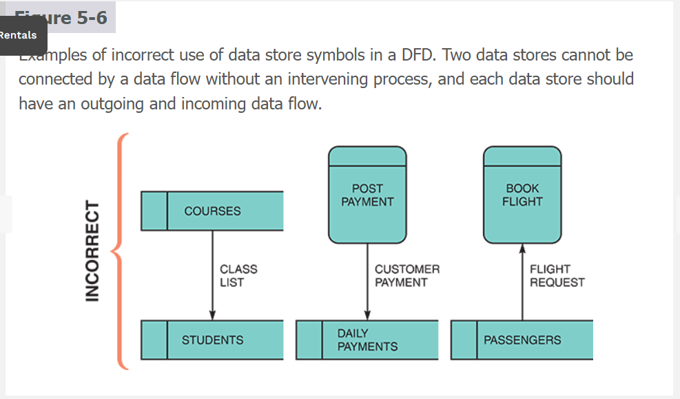

 There is an **exception** to the requirement that the data store must have at least one incoming and outgoing data flow. In some situations, a data store has no input data flow `because it contains fixed reference data, not updated by the system`. For example, consider a data store called `TAX TABLE`, which contains withholding tax data that a company downloads from the Internal Revenue Service. When the company runs its payroll to `CALCULATE WITHOLDING` process **accesses data from this data store**. This could be represented as one way outgoing data flow from the tax `TABLE DATA` store into the `CALCULATE WITHOLDING` process on a DFD.

 > A rule of thumb to see if it's an exception would be to ask yourself will I use this information later. If the answer is yes, then the exception applies and you can have a one way outgoing data flow.

[⬆️ Back to 5.3](#53-data-flow-diagram-symbols) · [Back to TOC](#table-of-contents)


### 5.3.4 Entity Symbols

The symbol for an `entity is a rectangle` which _may be shaded_ to make it look 3 dimensional. The name of the entity appears inside the symbol.

ADFD shows `only external entities that provide the data` to the system `or receive output` from the system. A DFD shows the boundaries of the system and how the system interfaces with the outside world. For example, a Customer entity submits an order to an order processing system. Other examples of entities include a patient who supplies data to a medical records system, homeowner who receives a bill from A City property tax system, or an accounts payable system that receives data from the company's purchasing system.

DFD entities are also called `terminators` because they are `data origins or final destinations`. An **entity that supplies data** to the system is called a `source`, and an **entity that receives data** from a system is a `sink`. An entity name is the singular form of a department outside organization, other information system, or person. An external entity can be a source, sync, or both. But each entity `must be connected to a process` by a data flow. Figures 57 and 58 show correct and incorrect examples of this rule, respectively.

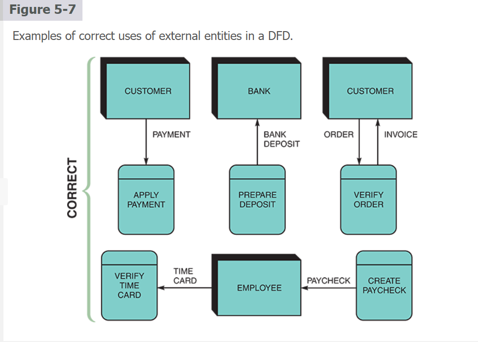
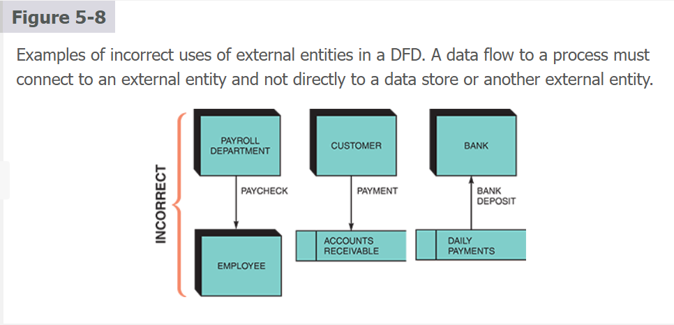

[⬆️ Back to 5.3](#53-data-flow-diagram-symbols) · [Back to TOC](#table-of-contents)


### 5.3.5 Using DFD Symbols

With an understanding of the proper use of DFD symbols, the next step is to construct diagrams that use these symbols. Figure 59 shows a summary of the rules for using DFD symbols.

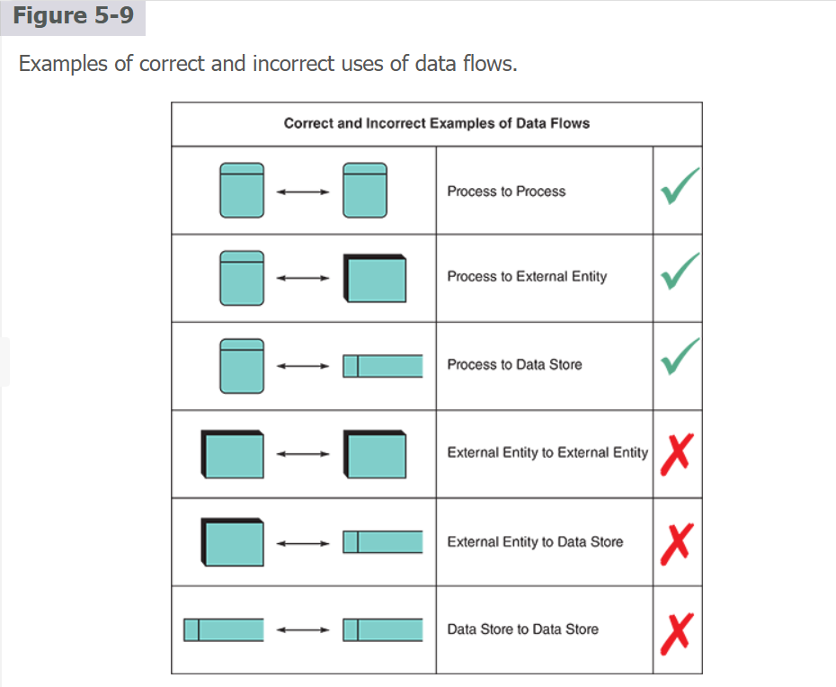

[⬆️ Back to 5.3](#53-data-flow-diagram-symbols) · [Back to TOC](#table-of-contents)

---


## 5.4 Drawing Data Flow Diagrams

During requirements engineering, interviews, questionnaires and other techniques were used **to gather facts about the system** and it was explained how the _various people_, _departments_, `data and processes fit together to support business operations`. 

Now a graphical information system `model is created` **based** on the fact finding results.

To explain how to draw DFDS, examples of two information systems will be used. The first example is a grading system that instructors use to assign final grades based on students scores during the term. The second example is an order system, a acompany uses to enter orders and apply payments against a customer's balance.

When drawing a context diagram and other DFDS, these **guidelines** `should be followed`:

- Draw the context diagram so it fits on one page. (_See the next section for more details about context diagrams_).

- `Use the name` of the information system `as the process name` in the context diagram. For example, the process name in **Figure 5-10** is `GRADING SYSTEM`.          

- Notice that the `process name is the same as the system name`. This is because the context diagram `shows the entire information system` as a **single process**. For processes in lower-level DFDs, **use a verb followed by a descriptive noun**, such as `ESTABLISH GRADEBOOK`, `ASSIGN FINAL` `GRADE`, or `PRODUCE GRADE REPORT`.

  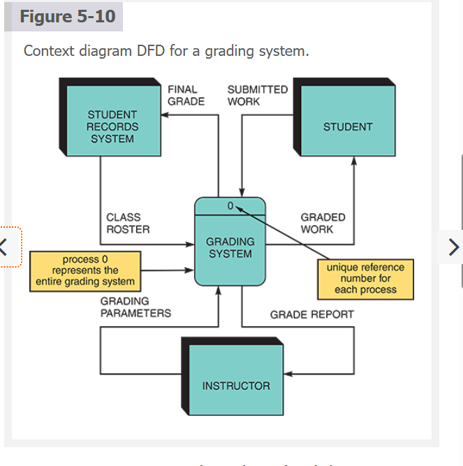

- `Use unique names` within each set of symbols. For instance, the diagram in **Figure 5-10** shows only one entity named `STUDENT` and one data flow called `FINAL GRADE`. Whenever the entity `STUDENT` appears on any other DFD in the grading system, **it is the same entity**. Whenever the `FINAL GRADE` data flow appears, it is the same data flow. The naming convention `also applies to data stores.`

> You can use the same name as long as it refers to the same entity.The entity name `STUDENT` appears in two entities. the records system and the student itself. student entity also lives in the records system.

- `Do not cross lines`. One way to achieve that goal is to `restrict the number of symbols` in any DFD.**At most, 9 process symbols** should be included on lower-level diagrams with multiple processes. Including more than nine symbols usually signals that the diagram is **too complex** and that the analysis should be reconsidered. `Another way to avoid crossing lines is to duplicate an entity or data store`. When duplicating a symbol on a diagram, document the duplication to avoid possible confusion. A special notation, `such as an asterisk`, next to the symbol name and inside the duplicated symbols signifies that they are duplicated on the diagram.

> Given that lines represent Data Flows between processes, data stores, and external entities and when lines cross over it gets visually confusing, harder to trace the flow of data, and a signal the digram is showing too much at once. You can either limit to 9 OR use asterist  next to symbol name to indicate, duplication.

- `Provide a unique name and reference number for each process`. Because it is the highest-level DFD, the context diagram contains process 0, representing the entire information system but `not the internal workings`. To describe the next level of detail inside process 0, create a DFD named diagram 0, revealing additional processes that must be named and numbered. As lower-level DFDs are created, assign unique names and reference numbers to all processes until the logical model is completed.

> You can think of it as the Birds Eye view of the entire system as it contains only one process called process 0. Which represents the entire information system in one process. (not the internal logic) **It is like the Homepage of a website**. These sub processes show `how data moves` internally within the system.

> These unique names and numbers matter. Because every process at every level must have a distinct name and number, which avoids confusion and helps analysts trace data flow accurately. As we go deeper, we continue assigning these unique identifiers until the logical model is complete. Oh, no, it's not Sarah.

- **Obtain** as much `user input and feedback` as possible. The main objective is to ensure that the model is accurate, easy to understand, and meets the needs of its users.

**Nav:** ⬅️ [Prev: 5.3](#53-data-flow-diagram-symbols) · ➡️ [Next: 5.5 Context Diagram](#55-drawing-a-context-diagram) · [Back to TOC](#table-of-contents)

---


## 5.5 Drawing a Context Diagram

The first step in constructing a set of DFDs, is to draw a `context diagram`. A context diagram is a top level view within information system that `shows the systems boundaries and scope`. To draw a context diagram, start replacing a **single process symbol in the center of the page**. The symbol represents the entire information system and is identified as process zero (The number zero, not the letter 0) Then, **place the system entities around the perimeter** of the page and u**se data flows to connect the entities** to the central process. Data stores are not shown in the context diagram _because they are contained within the system and remain hidden_ until more detailed diagrams are created.

 To determine which **entities** and **data flows** to place in the context diagram, `begin by reviewing the system's requirements to identify all external data sources and destinations`. During that process, **identify** the `entities`, the `name` and `content` of the data flows, `and the direction` of the data flows. _If that is done carefully_, and the job of fact finding was done well in the previous stage, drawing the context diagram should be relatively easy. Now review the following context diagram examples. 

**Nav:** ⬅️ [Prev: 5.4](#54-drawing-data-flow-diagrams) · ➡️ [Next: 5.6 Diagram 0](#56-drawing-a-diagram-0-dfd) · [Back to TOC](#table-of-contents)

### 5.5.1 Example Context Diagram for a Grading System

The context diagram for a grading system is shown in `Figure 5-10`. The `GRADING SYSTEM` process is at the center of the diagram. 

The three entities (`STUDENT RECORDS SYSTEM`, `STUDENT`, and `INSTRUCTOR`) are placed around the central process.

Interaction among the main process and the entities involves `six different data flows`. 

The `STUDENT RECORDS SYSTEM` entity **supplies data** through the `CLASS ROSTER` **data flow** and **receives data** through the `FINAL GRADE` **data flow**. 

The `STUDENT` entity **delivers data** through the `SUBMITTED WORK` **data flow** and receives data through the `GRADED WORK` data flow. 

_Finally_, the `INSTRUCTOR` entity provides data through the `GRADING PARAMETER`S data flow and receives data through the `GRADE REPORT` data flow.

[⬆️ Back to 5.5](#55-drawing-a-context-diagram) · [Back to TOC](#table-of-contents)


### 5.5.2 Example Context Diagram for an Order System

The context diagram for an order system is shown in `Figure 5-11`. Notice that the **ORDER SYSTEM process is at the center of the diagram**, and _five entities_ surround the process. 

Three entities, **SALES REP**, **BANK**, and **ACCOUNTING**,`have single incoming data flows` for COMMISSION, BANK DEPOSIT, and CASH RECEIPTS ENTRY, respectively. 

The **WAREHOUSE** entity `has one incoming data flow`—**PICKING LIST**—a report showing the items ordered and their quantity, location, and sequence to pick from the warehouse. The WAREHOUSE entity has one outgoing data flow: **COMPLETED ORDER**. 

Finally, the CUSTOMER entity `has two outgoing data flows`, **ORDER** and **PAYMENT**, and two incoming data flows, **ORDER REJECT NOTICE** and **INVOICE**.


The context diagram for the order system appears m**ore complex than the grading system** because it `has two more entities` and `three more data flows`. What makes one system more complex than another is: 
- the number of `components`
- the number of `levels`
- the `degree of interaction` among its processes, entities, data stores, and data flows.

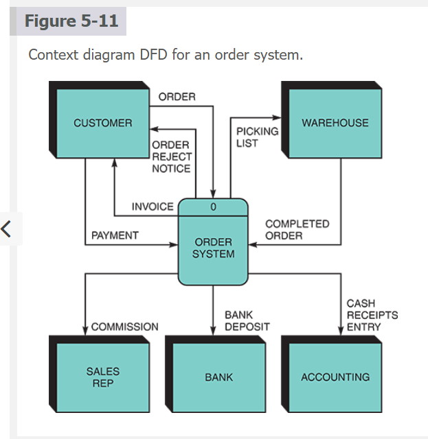

[⬆️ Back to 5.5](#55-drawing-a-context-diagram) · [Back to TOC](#table-of-contents)

---


## 5.6 Drawing a Diagram 0 DFD

The previous section explained how a context diagram provides the most general view of an information system and contains a single process symbol, which is like a `black box`. To show the detail inside the black box, a DFD diagram 0 is created. `Diagram 0` (the numeral zero, not the letter O) `provides an overview of all the components that interact to form the overall system`. It **zooms in** on the system and `shows major internal processes, data flows, and data stores`. 

Diagram 0 `also repeats the entities and data flows` in the context diagram. When the context diagram is expanded into DFD diagram 0, `all the connections that flow into and out of process 0 must be retained`.


**Nav:** ⬅️ [Prev: 5.5](#55-drawing-a-context-diagram) · ➡️ [Next: 5.7 Lower-Level DFDs](#57-drawing-lower-level-dfds) · [Back to TOC](#table-of-contents)


### 5.6.1 Example Diagram 0 DFD for a Grading System

**Figure 5-12** shows a context diagram at the top and diagram 0 DFD beneath. Notice that `diagram 0 is an expansion of process 0`. Also, notice that the same three entities (STUDENT RECORDS SYSTEM, STUDENT, and INSTRUCTOR) and the same six data flows (FINAL GRADE, CLASS ROSTER, SUBMITTED WORK, GRADED WORK, GRADING PARAMETERS, and GRADE REPORT) appear in both diagrams. In addition, diagram 0 expands process 0 to `reveal four internal processes`, **one data store**, and **five additional data flows.**

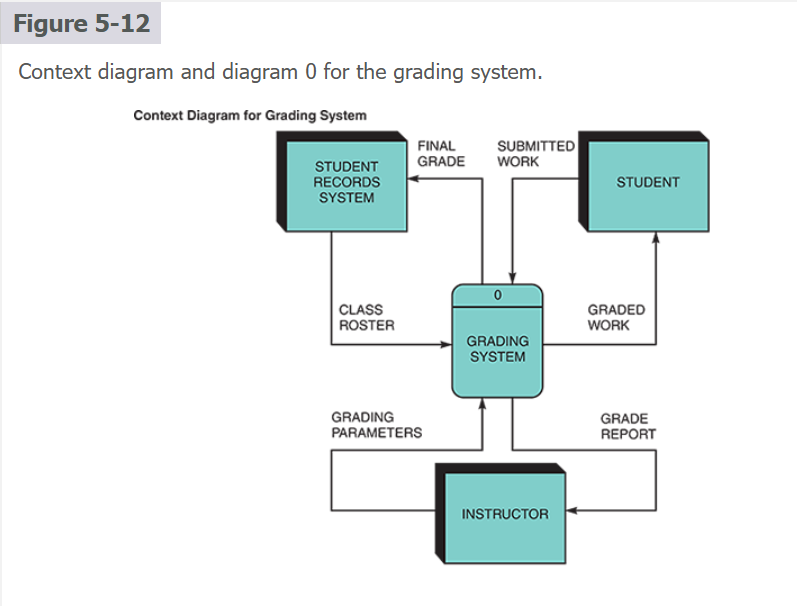
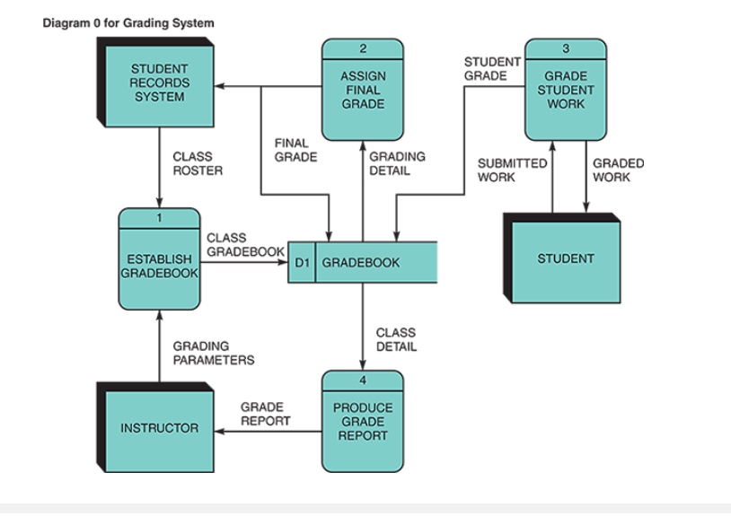


### We could zoom out even more on one process
Notice that each process in `diagram 0 has a reference number`: **ESTABLISH GRADEBOOK** is 1, **ASSIGN FINAL GRADE** is 2, **GRADE STUDENT WORK** is 3, and **PRODUCE GRADE REPORT** is 4. These reference numbers are significant because they identify a series of DFDs. If more detail were needed for ESTABLISH GRADEBOOK, for example, a diagram 1 would be drawn because ESTABLISH GRADEBOOK is process 1.

> If more detail were needed for established gradebook, for example a diagram `one would be drawn` because **established gradebook is process 1**. In diagram zero we already expanded process 0, the entire system into several sub processes. If you want to zoom in further on 1 of those subclasses, say establish Gradebook, you create a new diagram called Diagram 1. This diagram one would show the internal logic of process 1.0 just like diagram zero showed the internal logic of process 0.

### No particular order is set in stone; must show in Process Descriptions

The process numbers `do not suggest that the processes are accomplished in sequential order`. Each process is **always** considered _available_, _active_, and _awaiting processing data_. If processes must be performed in a specific sequence, the information should be documented in the **process descriptions** (discussed later in this chapter), not in the DFD.

### Divergent Data

The FINAL GRADE data flow output from the ASSIGN FINAL GRADE process is a diverging data flow that **becomes an input** to the `STUDENT RECORDS SYSTEM entity` **and** the `GRADEBOOK data store`. A `diverging data flow is a data flow in which the same data travels to two or more locations`. In that situation, a diverging data flow is the best way to show the flow rather than two identical data flows, which could be misleading.

> So this means that the same piece of data is sent two or more places in the system.

ASSIGN FINAL GRADE(process) **-->** FINAL GRADE(_data flow_) **-->** GRADEBOOK(entity)
ASSIGN FINAL GRADE(process) **-->** FINAL GRADE(_data flow_) **-->** STUDENT RECORDS SYSTEM(_Data Store_)

Divergent Data

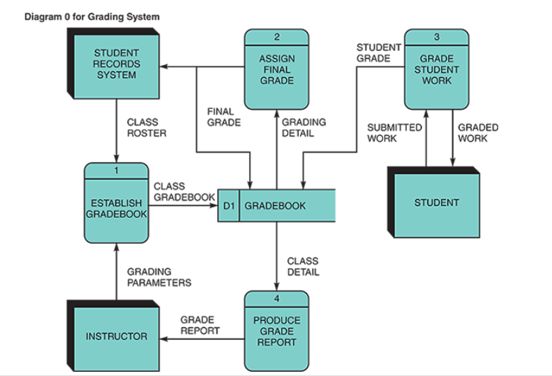

### double/single arrowhead

A **double**-headed arrow `can connect the symbols if the same data flows in both directions`. 

**To identify specific data flows** into and out of a symbol, **separate data flow symbols with single arrowheads** should be used. For example, in `Figure 5-12`, the separate data flows (SUBMITTED WORK and GRADED WORK) _go into and out_ of the GRADE STUDENT WORK process.

> AS you can see in the same figure, using single arrow heads to `identifies the ins and out`

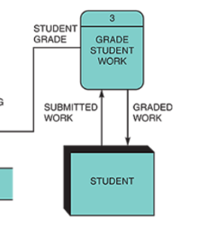

### partitioned/decomposed

Because `diagram 0` is an exploded version of **process 0**, it shows considerably _more detail than the context diagram_. Diagram 0 can also be called a `partitioned` or `decomposed view` of `process 0`. 

### parent/child diagrams

When a DFD is exploded, the higher-level diagram is called the `parent diagram` and the lower-level diagram is referred to as the `child diagram`. The grading system is simple enough that no additional DFDs are needed to model the system. At that point, **the four processes**, the **one data store**, and the **10 data flows** `can be documented in the data dictionary.`

This is ready to be added into the Data Dictionary
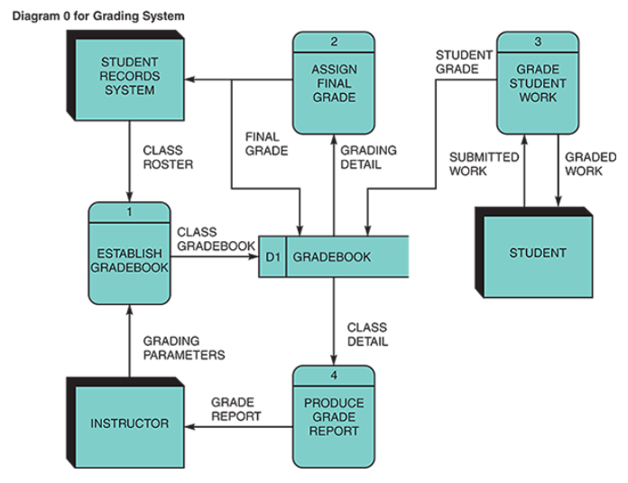

> if not more child diagrams are needed it is ready to be added into the Data Dictionary

### Functional Primitives

When a set of DFDs is created for a system, the processing logic is broken down into smaller units, called `functional primitives`, which _programmers_ will **use to develop code**. 

A functional primitive is a process that consists of `a single function that is not exploded further`. For example, each of the four processes shown in the lower portion of Figure 5-12 is a functional primitive(_shown in last image_). The logic for a functional primitive `is documented by writing a process description` in the **data dictionary**.

### Ready for DOCS

Later, when the logical design is implemented as a physical system, _programmers_ will transform each functional primitive `into program code and modules` that carry out the **required** steps. 

### How will I Know when To Explode Diagrams Further?

Deciding whether to explode a process further or determine that it is a functional primitive is a `matter of experience`, `judgment`, and `interaction with programmers` who must _translate_ the **logical design** into **code**.


[⬆️ Back to 5.6](#56-drawing-a-diagram-0-dfd) · [Back to TOC](#table-of-contents)


### 5.6.2 Example Diagram 0 DFD for an Order System

`Figure 5-13` shows a **diagram 0** DFD for an order system. Process 0 on the order system’s context diagram is exploded to reveal: 
- 3 processes (**FILL ORDER**, **CREATE INVOICE**, and **APPLY PAYMENT**) 
- 2 additional data flows (**INVOICE DETAIL** and **PAYMENT DETAIL**)
- 1 data store (**ACCOUNTS RECEIVABLE**)
- 1 diverging data flow (**INVOICE**).

Figure 5-13
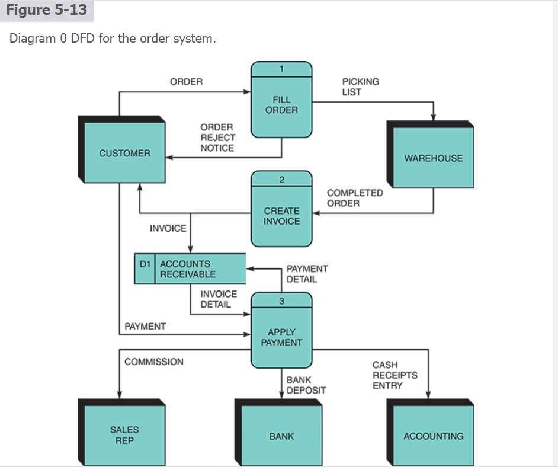

The following walkthrough explains the DFD shown in Figure 5-13.

- A `CUSTOMER` submits an `ORDER`(1 input). Depending on the processing logic, the `FILL ORDER` process _either_ sends an `ORDER REJECT NOTICE`(1 output) back to the customer or sends a `PICKING LIST`(1 ouput) to the `WAREHOUSE`.
> A customer send an order request to the fill order process. From there we could eaither get rejected or send a picking list to the warehouse.


- A `COMPLETED ORDER` from the `WAREHOUSE` is input to the `CREATE INVOICE` process(1 input), which outputs an `INVOICE` to _both_ the `CUSTOMER` process and the `ACCOUNTS RECEIVABLE` data store(2 outputs).


- A `CUSTOMER` makes a `PAYMENT`(1 output) that is processed by `APPLY PAYMENT`. `APPLY PAYMENT` **requires** `INVOICE DETAIL` input(_for APPLY PAYMENT its input BUT for the ACCOUNTS RECEIVABLE, this is its output)_ from the `ACCOUNTS RECEIVABLE` data store(1 output) along with the `PAYMENT`. `APPLY PAYMENT` also outputs` PAYMENT DETAIL`(3 output) back to the `ACCOUNTS RECEIVABLE` data store **and** outputs `COMMISSION` to the `SALES REP`, `BANK DEPOSIT` to the `BANK`, and `CASH RECEIPTS ENTRY` to ACCOUNTING.

The walkthrough of diagram 0 illustrates the basic requirements of the order system. Examine the detailed description of each separate process to learn more.

[⬆️ Back to 5.6](#56-drawing-a-diagram-0-dfd) · [Back to TOC](#table-of-contents)

---


## 5.7 Drawing Lower-Level DFDs

This section’s examples of lower-level DFDs are based on the example order system. To create lower-level diagrams, **leveling and balancing techniques must be used**. `Leveling` draws increasingly detailed diagrams **until all functional primitives are identified**. `Balancing` **maintains consistency** among DFDs `by ensuring that input and output data flows align properly`. Leveling and balancing are described in more detail in the following sections.

**Nav:** ⬅️ [Prev: 5.6](#56-drawing-a-diagram-0-dfd) · ➡️ [Next: 5.8 Data Dictionary](#58-data-dictionary) · [Back to TOC](#table-of-contents)


### 5.7.1 Leveling Examples

`Leveling` uses **a series of increasingly detailed DFDs to describe an information system**. For example, a system might consist of dozens or hundreds of separate processes. Using leveling, an analyst `starts with an overall view`, which is a **context diagram** with a **single** process symbol. 

`Next`, the analyst **creates diagram 0**, which shows **more detail**. The analyst continues to create lower-level DFDs `until all processes are identified as functional primitives` representing single processing functions. 

More complex systems have more processes; analysts must work through many levels to determine the functional primitives. Leveling also is called `exploding`, `partitioning`, or `decomposing`.

### exploted views for leveling

**Figures 5-13** and **5-14** provide an example of `leveling`. Figure 5-13 shows diagram 0 for an order system, with the `FILL ORDER` process labeled as process 1. Now consider Figure 5-14, which provides an exploded view of the `FILL ORDER` process. Notice that `FILL ORDER` (process 1) consists of three processes: `VERIFY ORDER` (process 1.1), `PREPARE REJECT NOTICE` (process 1.2), and `ASSEMBLE ORDER` (process 1.3).

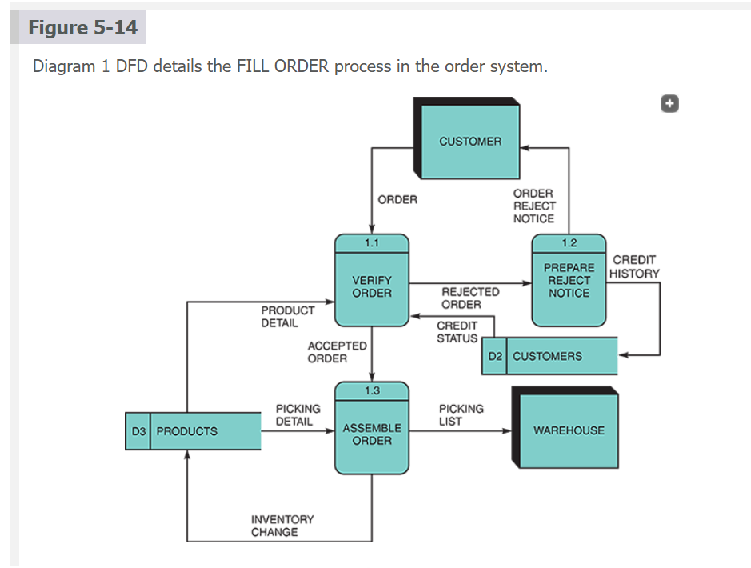

### numbering processes

As Figure 5-14 shows, all processes are numbered using a **decimal notation** consisting of the `parent’s reference number`, a `decimal point`, and a `sequence number within the new diagram`. In **Figure 5-14**, the _parent process of diagram 1 is process 1_, so the processes in diagram 1 have reference numbers 1.1, 1.2, and 1.3. If process 1.3, `ASSEMBLE ORDER`, is **decomposed further**, then it would appear in diagram 1.3, and the processes in diagram 1.3 would be numbered as `1.3.1`, `1.3.2`, `1.3.3`, and so on. This numbering technique makes it easy to integrate and identify all DFDs.

### Why does the child have 2 data stores?

When **Figures 5-13 and 5-14** are compared, it is apparent that Figure 5-14 (the exploded `FILL ORDER` process) shows two data stores (`CUSTOMERS` and `PRODUCTS`) that do not appear in Figure 5-13, which is the parent DFD. **Why not**? 

The answer is based on a **simple rule**: When drawing DFDs, `a data store is shown only when two or more processes use that data store`. 

The `CUSTOMERS` and `PRODUCTS` data stores **are internal** to the `FILL ORDER` process, so the analyst did not show them on diagram 0, which is the parent. However, when the `FILL ORDER` process is exploded into a diagram 1 DFD, `three processes (1.1, 1.2, and 1.3) interacting with the two data stores` are now shown.

### Some entities can be left out on purpose

Now compare **Figures 5-14** and **5-15**. Figure 5-15 shows the same data flows but not the `CUSTOMER` and `WAREHOUSE` entities. Analysts often use this technique **to simplify** a DFD and `reduce unnecessary clutter`. Because the missing symbols appear on the parent DFD, that diagram **can be used to identify the source or destination** of the data flows.

Image-18
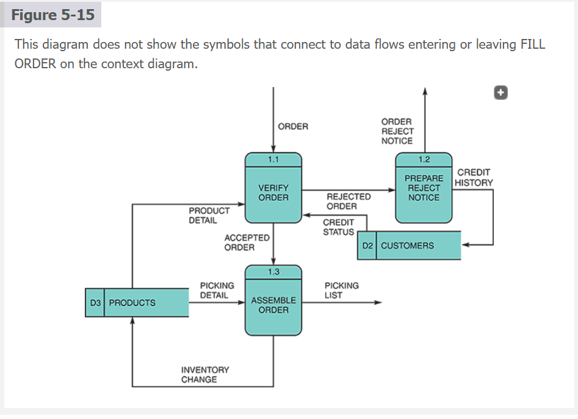

[⬆️ Back to 5.7](#57-drawing-lower-level-dfds) · [Back to TOC](#table-of-contents)


### 5.7.2 Balancing Examples

`Balancing` **ensures that the input and output data flows of the parent DFD are maintained on the child DFD**. For example, Figure 5-16 shows two DFDs: the order system diagram 0 is at the top of the figure and the exploded diagram 3 DFD is at the bottom.

**Figure 5-16**

The order system diagram 0 is shown at the top of the figure, and the exploded diagram 3 DFD (for the `APPLY PAYMENT` process) is shown at the bottom. The two DFDs are `balanced` **because the child diagram at the bottom has the same input and output flows** as the parent process 3 shown at the top.

Figure 5-16
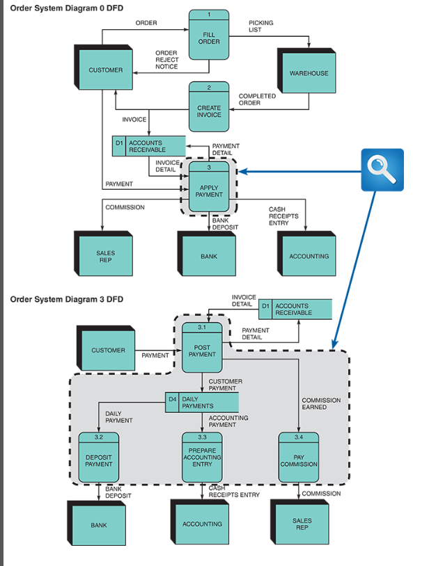

### How Do I Confirm a balanced DFD?

The two DFDs are balanced because the `child diagram at the bottom has the same input and output flows as the parent process 3` shown at the top. To **verify** the balancing, notice that the parent process 3, `APPLY PAYMENT`, **has 1 incoming data flow from an external entity** `and` **3 outgoing data flows to external entities**. Examine the child DFD, which is diagram 3. Ignore the internal data flows and count the data flows to and from external entities. From the diagram, it is evident that the three processes maintain `the same 1 incoming and 3 outgoing data flows` as the parent process.

> At the higher level. This shows one input which is the customer payment and three outputs to the Commission to the bank and cash  receipts entry. This is the contract the parent process makes with the outside world. Now if we expand 3.0 into sub processes. Inside you'll see more detail the invoice details, payment details, internal data stores and flows between sub processes. But when checking balancing, you ignore those internal flows and only count the **external** flows. The child diagram was still net out to one input and three outputs to external entities just like the parent.

### parent and Child input/output must match to be balanced

`Another example of balancing` is shown in **Figures 5-17** and **5-18**. Figure 5-17 shows a sample context diagram. The `process 0` symbol has **2 input flows and 2 output flows**. Process 0 can be considered a **black box**, with no internal detail shown. In Figure 5-18, process 0 (the parent DFD) is exploded into the next level of detail. Now `3 processes`, `2 data stores`, and `4 internal data flows` are visible. Notice that the details of process 0 are shown inside a dashed line, just as if the inside of the process was visible.

Figure 5-17
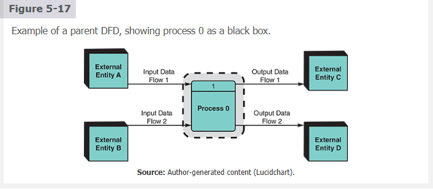
Figure 5-18
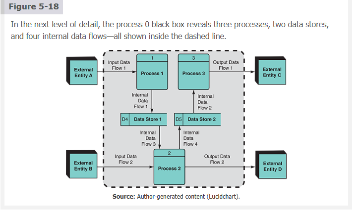

The DFDs in Figures 5-17 and 5-18 are `balanced` because **the four data flows into and out of process 0 are maintained** on the child DFD. The `DFDs also are leveled` because each **internal process is numbered** to show that it is a child of the parent process.

Figure 5-19
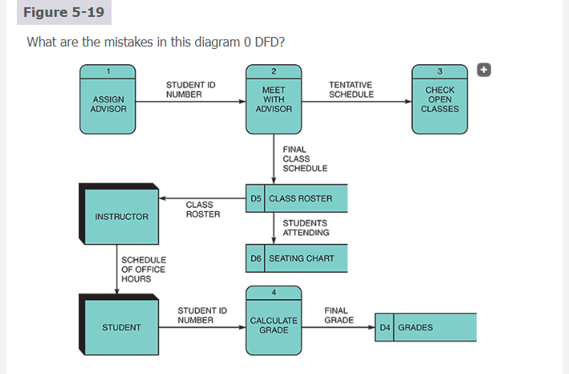

[⬆️ Back to 5.7](#57-drawing-lower-level-dfds) · [Back to TOC](#table-of-contents)

---


## 5.8 Data Dictionary

A set of DFDs produces a logical system model. Still, the `details within those DFDs are documented separately` in a **data dictionary**, which contains information about data, such as its 
- meaning
- relationships to other data
- origin
- usage
- format

A data dictionary typically includes the following:

- **Data element descriptions**. Also called a `data item` or `field`, a `data element` is the _smallest_ piece of **data that has meaning within an information system**. 


    This includes the names of all data elements in a syste, the `meaning of these data elements`, and the `abbreviations or codes used to represent them`. Data elements are **combined** into **records**, also called `data structures`. 
        
    A record is a `meaningful combination` of **related** data elements _included in a data flow or retained in a data store.


- **Attribute/property definitions**. This includes the **characteristics** of the data elements, like the `type of data` (e.g., integer, real number, character, date), `length of the data field, the allowable range of values`, the `default value`, and whether the field is a `key or part of a key`.

- **Relationship descriptions**. `Describes` relationships between data elements or groups of data elements.

- **Rules and constraints**. `Business rules` or `integrity` constraints associated with the data. This can include `conditions` that must be true before a transaction can occur `or after` it has occurred.

- **Other metadata**. Other important information about the data, including `ownership`, `security`, or `privacy` information, `data origin` (source), `data usage`, and so on.

### identifying relationships

`Significant relationships` exist among the items in a data dictionary. For example, **data stores** and **data flows** are based on` data structures` composed of **data elements**. 

**Data flows** are `connected` to **data stores**, **entities**, and **processes**.

### Documentation is difficul to maintain; Use modern tools

 `Accurately` documenting these relationships is essential so the data dictionary is `consistent` with the DFDs. The **more complex** the system, the **more difficult** it is to maintain full and accurate documentation. Fortunately, modern tools simplify the task by flowing documentation automatically from the modeling diagrams into the central repository, along with information entered by the user.

 ### Data Repositories

A **data repository** ensures data consistency, especially when multiple systems require the same data. In a large company, for example, the **sales**, **accounting**, and **shipping** systems all might use a data element called `CUSTOMER NUMBER`. 

Once the `CUSTOMER NUMBER` element has been defined in the repository, other processes can access it, data flows, and data stores. The result is that all systems across the enterprise can share up-to-date and consistent data.

> Add Data Repository is a centralized storage location where definitions of data elements are kept. It's not just raw data itself, but the metadata, the rules, formats, and meanings of data items. Think of it as a dictionary of the system's data.

**why this matters?**:

In large organizations, multiple systems often need to use the same data element. A **Sales** system uses it to track orders, **Accounting** system uses it for billing and **Shipping** system uses it for deliveries.

**Nav:** ⬅️ [Prev: 5.7](#57-drawing-lower-level-dfds) · ➡️ [Next: 5.9 Process Description Tools](#59-process-description-tools-in-modular-design) · [Back to TOC](#table-of-contents)


### 5.8.1 Documenting the Data Elements

`Every` data element in the data dictionary `must be documented`. Some analysts like to record their notes on online or manual forms. Others prefer to enter the information directly into a repository. Irrespective of the specific tool used, **the objective is to provide clear, comprehensive information** about the data and processes that` make up the system`.

The following data element attributes are usually documented in the `data dictionary`:

- `Data element name or label`. The data element’s **standard name**, which should be _meaningful_ to users.

- `Alias`. Any name(s) other than the standard data element name; this **alternate name** is called an alias. For example, suppose there is a data element named CURRENT BALANCE. Users might refer to it by alternate names such as OUTSTANDING BALANCE, CUSTOMER BALANCE, RECEIVABLE BALANCE, or AMOUNT OWED.

- `Type` and `length`. Type refers to whether the data element contains numeric, alphabetic, or character values. Length is the **maximum number of characters** for an alphabetic or character data element or the maximum number of digits and **decimal positions** for a numeric data element. In addition to text and numeric data, `sounds and images can be stored digitally`. In some systems, these binary data objects are managed and processed as traditional data elements are. For example, an employee record might include a digitized photo image of the person.

- `Default value`. The default value is the value for the data element **if a value is not entered for it**. For example, all new customers might have a default value of $500 for the CREDIT LIMIT data element.

- `Acceptable values`. Specification of the data element’s domain, which is the **set of values permitted** for the data element. These values **can be specifically listed** or **referenced** in a table or selected from a specified range of values. 

    Also, **indicate if a value for the data element is optional**. Some data elements have additional validity rules. For example, an employee’s salary **must** be within the range defined for the employee’s job classification.

- `Source`. The **origin** of the data element’s values. The source could be a specific **form**, a **department** or **outside organization**, another **information system**, or the result of a **calculation**.

- `Security`. Identification of the individual or department with **access or update privileges** for each data element. For example, only a credit manager can change a credit limit, while sales reps are authorized to access data in a read-only mode.

- `Responsible user(s)`. Identification of the user(s) responsible for entering and changing values for the data element. if there is an error you know who to contact.

- `Description` and `comments`. This part of the documentation allows the entry of **additional notes.**

[⬆️ Back to 5.8](#58-data-dictionary) · [Back to TOC](#table-of-contents)


### 5.8.2 Documenting the Data Flows

In addition to documenting each data element, `all data flows` in the data dictionary **must** be documented. Although terms can vary, the typical attributes are as follows:

- `Data flow name` or `label`. The data flow **name** as it appears on the DFDs.

- `Description`. **Describes** the data **flow** and its **purpose**.

- `Alternate name(s)`. **Aliases** for the DFD data flow name(s).

- `Origin`. The DFD beginning, or **source**, for the data flow; the origin can be a `process`, a `data store`, or an `entity`.

- `Destination`. The DFD **ending point(s)** for the _data flow_; the destination can be a `process`, a `data store`, or an `entity`.

- `Record`. Each data flow represents **a group of related elements called a record or data structure**. In most data dictionaries, records are defined separately from the data flows and data stores. When records are defined, more than one data flow or data store can use the same record if necessary.

> Each arrow in a DFD is a data flow, and it isn't just a single item, it usually represents a bundle of related data elements. For example, a great report flow might include elements like student ID, course, ID, final grade, and comments. This bundle of elements right here is called a record or a data structure.

**Why define records seperately?**

**Answer**: In the data dictionary you don't just define flows and stores. You also defined the records they carry. 

This separation allows you to reuse the same record definition across **multiple flows** or **stores** and _avoids duplication_ and _inconsistency_.

- `Volume` and `frequency`. Describes the expected number of occurrences** for the data flow `per unit of time`. For example, if a company has 300 employees, a TIME CARD data flow would involve 300 transactions and records **each week** as employees submit their work-hour data.

[⬆️ Back to 5.8](#58-data-dictionary) · [Back to TOC](#table-of-contents)


### 5.8.3 Documenting the Data Stores

Every DFD `data store` in the data dictionary `must be documented`. Typical characteristics of a data store are as follows:

- `Data store name` or `label`. The data store **name** as it appears on the DFDs.

- `Description`. Describes the **data store** and its **purpose**.

- `Alternate name(s)`. **Aliases** for the DFD **data store** name.

- `Attributes`. Standard DFD **names that enter or leave** the data store.

    > Here attributes are referred to the individual data elements that make up a record inside a data store. When documenting a data stored in the repository, you don't just say gradebook or customer file, you also list the attribute fields that are stored in here. For example, a `gradebook` data store might have attributes like `student ID, course ID, assignment score, final grade.`

- `Volume` and `frequency`. Describes the **estimated number of records** in the data store and **how frequently** they are `updated`.

[⬆️ Back to 5.8](#58-data-dictionary) · [Back to TOC](#table-of-contents)


### 5.8.4 Documenting the Processes

Every DFD process in the data dictionary must be documented. The documentation includes a description of the process’s characteristics and, for functional primitives, a process description, which is a model that documents the processing steps and business logic.

The following are typical characteristics of a process:

- `Process name` or `label`. The process **name** as it appears on the DFDs.

- `Description`. A brief statement of the process’s **purpose**.

- `Process number`. A reference number that **identifies the process** and indicates relationships among various levels in the system.

- `Process description`. This section includes the **input and output data flows**. 

    For **functional primitives**, the process description **also documents the processing steps** and **business logic**.
    
    _Section 5.9 explains how to write process descriptions._

[⬆️ Back to 5.8](#58-data-dictionary) · [Back to TOC](#table-of-contents)


### 5.8.5 Documenting the Entities

The `data dictionary can describe all external entities` interacting with the system by documenting all entities. Typical characteristics of an entity include the following:

- `Entity name`. The entity **name** as it appears on the DFDs.

- `Description`. A brief **explanation** of the entity and its **purpose**.

- `Alternate name(s)`. Any **aliases** for the entity name.

- `Input data flows`. The standard DFD **names for the input data flows** to the entity.

- `Output data flows`. The standard DFD **names for the data flows leaving** the entity.

[⬆️ Back to 5.8](#58-data-dictionary) · [Back to TOC](#table-of-contents)


### 5.8.6 Documenting the Records

A `record` is a `data structure` containing **related** data elements stored and processed together. `Data flows and data stores consist of records that must be documented in the data dictionary`. Typical characteristics of a record include the following:

`Record` or `data structure name`. The **record name** as it appears in the related **data flow** and **data store** entries in the data dictionary.

`Definition` or `description`. A brief **explanation** of the record. Think of it as the **what and why**

`Alternate name(s)`. Any **aliases** for the record name.

`Attributes`. A list of all the **data elements**, or **fields**, included in the record. The data element names must match exactly those entered in the data dictionary.


[⬆️ Back to 5.8](#58-data-dictionary) · [Back to TOC](#table-of-contents)


### 5.8.7 Data Dictionary Reports

The data dictionary serves as an `information system’s central storehouse of documentation`. A **data dictionary** is created when the system is **developed** and is **updated constantly** as the system is _implemented_, _operated_, and _maintained_. In addition to describing each data element, data flow, data store, record, entity, and process, the `data dictionary documents the relationships among these components`.

Many valuable reports can be obtained from a data dictionary, including the following:

- An `alphabetized list` of all data elements by **name**.

- A `report` describing each data element and **indicating** the `user` or `department` responsible for _data entry, updating, or deletion._

- A report of all `data flows` and `data stores` using a _particular_ data element.

- Detailed reports showing `all characteristics` of data elements, records, data flows, processes, or any other selected item stored in the data dictionary.

[⬆️ Back to 5.8](#58-data-dictionary) · [Back to TOC](#table-of-contents)

---


## 5.9 Process Description Tools in Modular Design

A **process description** documents the details of a functional primitive and represents a specific set of processing steps and business logic. When a functional primitive is analyzed, the processing steps are broken down into smaller units in a modular design process. Using a set of process description tools, a model is created that is accurate, complete, and concise. Typical process description tools include structured English, decision tables, and decision trees.

**Nav:** ⬅️ [Prev: 5.8](#58-data-dictionary) · ➡️ [Next: Chapter Review](#chapter-review) · [Back to TOC](#table-of-contents)


### 5.9.1 Process Descriptions in Object-Oriented Development

This chapter deals with **structured analysis**, but process descriptions `can also be used in object-oriented development`, as described later in the book. Recall that O-O analysis **combines data and the processes that act on the data** into things called `objects`. Similar objects can be grouped into `classes`, and O-O processes are called `methods`. Although O-O programmers use different terminology, they create the same kind of modular coding structures, except that the processes (methods) are stored inside the objects rather than as separate components.

[⬆️ Back to 5.9](#59-process-description-tools-in-modular-design) · [Back to TOC](#table-of-contents)


### 5.9.2 Modular Design

`Modular design` is based on combinations of three logical structures, sometimes called **control structures**, which serve as _building blocks_ for the process. Each logical structure must have a `single` **entry** and **exit point**. The three structures are:
 - sequence
- selection
- iteration. 

A `rectangle` represents a **step or process**, a `diamond` shape represents a **condition or decision**, and the logic follows the lines in the direction indicated by the **arrows**.

1. `Sequence`. The completion of steps in **sequential order**, one after another, as shown in Figure 5-20. One or more steps _might represent a subprocess_ containing additional logical structures.

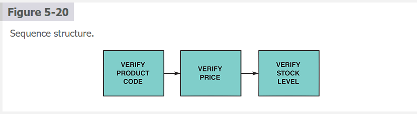

`Selection`. The **completion of one of two or more process steps** based on the results of a _test_ or _condition_. In the example shown in **Figure 5-21**, the system tests the input; if the hours are greater than 40, it performs the `CALCULATE OVERTIME PAY` process.

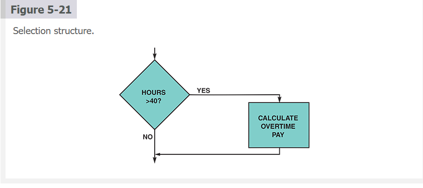

`Iteration`. The completion of a process step is **repeated** `until a specific condition changes`, as shown in Figure 5-22. An example of iteration is a process that prints paychecks until the payroll file ends. Iteration also is called **looping**.

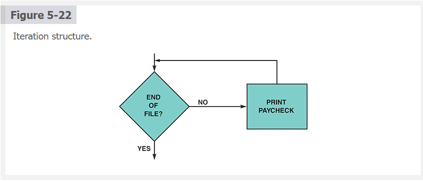

`Sequence`, `selection`, and `iteration` structures can be **combined** in various ways to describe processing logic.

[⬆️ Back to 5.9](#59-process-description-tools-in-modular-design) · [Back to TOC](#table-of-contents)


### 5.9.3 Structured English

**Structured English** is a subset of standard English that _describes_ logical processes **clearly** and **accurately**. When using structured English, be mindful of the following guidelines:

- Use only the 3 building blocks of `sequence`, `selection`, and `iteration`.

- Use `indentation` for **readability**.

- Use a `limited vocabulary`, including **standard terms** in the data dictionary `and` **specific words** that describe the processing rules.

An example of structured English appears in `Figure 5-23`, which shows the `VERIFY ORDER` process that was illustrated earlier. Notice that the structured English version documents the logic that will be **coded** into the system. Structured English can help make process descriptions accurate and understandable to users and system developers.

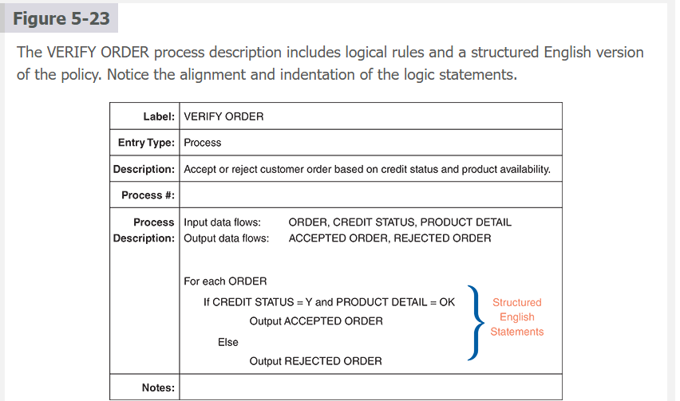

Structured English `might look familiar to programming students` because it **resembles pseudocode** used in program design. Although the techniques are similar, the **primary purpose of structured English is to describe the underlying business logic**. At the same time, programmers, who are concerned with coding, mainly use _pseudocode as a shorthand notation_ for the actual code.

Following structured English rules ensures that process descriptions are understandable to users who must confirm the process is correct and to other analysts and programmers who must design the information system from the descriptions.

[⬆️ Back to 5.9](#59-process-description-tools-in-modular-design) · [Back to TOC](#table-of-contents)


### 5.9.4 Decision Tables

A **decision table** is a logical structure that `shows every combination of conditions and outcomes`. Analysts often use decision tables to describe a `process` and ensure they have considered all possible situations. Decision tables can be created using _Microsoft PowerPoint, Word, or Excel_.

`Tables with one condition`. If a process has a single condition, there are **only two possibilities—yes or no**. Either the condition is present or not, so there are only two rules. For example, to trigger an overtime calculation, the process condition might be: Are the hours greater than 40? If so, the calculation is made. Otherwise, it is not.

`Tables with two conditions`. Suppose there is a need to create a decision table based on the `VERIFY ORDER` business process shown in **Table 5-1.** When documenting a process, it is important to list every possibility. In this example, the process description contains two conditions: product stock status and customer credit status. If **both** conditions are met, the order is accepted. Otherwise, the order is rejected.


`After all the conditions and outcomes have been identified`, the next step is to **create a decision table** similar to the one shown in `Figure 5-24`. 

Notice that **each condition has two possible values**, so the number of rules doubles when another condition is added. For example, one condition creates two rules, two conditions create four rules, three conditions create eight rules, and so on. Four possibilities exist in the two-condition example in Figure 5-24, but Rule 1 is the only combination that will accept an order.

So this decision table was built after you have identified all the conditions yes, no, true, false, present absence and the possible outcomes. Each condition is binary(two possible values).

```
1 condition = 2 rules
2 consition = 4 rules
3 condition = 8 values (2^3)(binary * N of conditions)
4 condition = 16 values
```

Decision Table


`Tables with three conditions`. Suppose the company now decides that the credit manager can waive the customer credit requirement, as shown in **Table 5-2**. That creates a third condition, so there will be eight possible rules. The new decision table might resemble the one shown in **Table 5-3.**

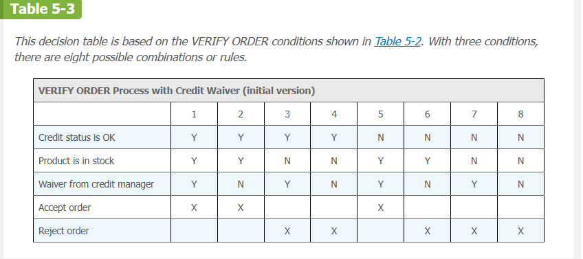

`First`, the **Y-N patterns must be filled** in, as shown in `Table 5-3`. Using patterns like these is the best way to **ensure all combinations appear**. The first condition uses a pattern of Y-Y-Y-Y followed by N-N-N-N; the second condition uses a repeating Y-Y-N-N pattern; and the pattern in the third condition is a series of Y-Ns.

The next step is **crucial**, `regardless of the number of conditions`. Each numbered column, or rule, represents a different set of conditions. The logic must be carefully analyzed, and the outcome for each rule `must be shown`. Before going further, study `Table 5-3` to be sure the logical outcome for each of the eight rules is _understood_.

### not all outcomes are considered right?

When all the outcomes have been determined, `the next step is simplifying the table`. Some rules might be **duplicates**, **redundant**, or **unrealistic** in a multicondition table. To simplify the table, follow these steps:

1. Study each combination of conditions and outcomes. When there are rules with **3 conditions**, `only one or two of them may control the outcome`, and the other conditions _do not matter_.

2. **If conditions do not affect the outcome**, mark them with `dashes (-)`, as shown in the first table in **Figure 5-25**.


3. Now combine and renumber the rules, as shown in the second table in Figure 5-25.

### What to do once you Id the ones that do not matter in the Table

After following these steps, **Rules 1** and **2** can be combined because **credit status is okay** in both rules, so the `waiver would not matter`. 

Rules` 3, 4, 7, and 8` also can be combined because the **product is not in stock**, so `other conditions do not matter`. 

The result is that instead of 8 possibilities, `only four` logical rules control the `Verify Order` process.

`Multiple outcomes`. Besides multiple conditions, decision tables can have **more than two possible outcomes**. For example, the sales promotion policy shown in `Table 5-4` includes **3 conditions**: 
- Was the customer a preferred customer?
- did the customer order $1,000 or more?
- did the customer use the company charge card? 

Based on these conditions, four possible actions can occur, as shown in the decision table in `Table 5-5`.

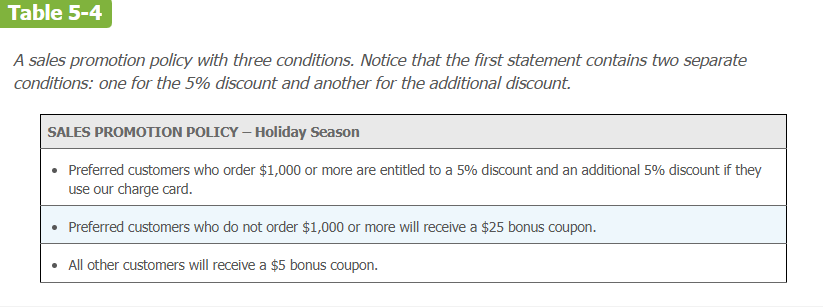


As explained in the preceding section, **most tables can be simplified**, and this one is no exception. After studying the conditions and outcomes, the following becomes apparent:

- In Rule 1, `all three conditions are met`, so both 5% discounts apply.

- In Rule 2, a preferred customer orders $1,000 or more `but does not use the charge card`, so only one 5% discount applies.

- Rules 3 and 4 can be combined into a single rule. **Why**? If preferred customers do not order $1,000 or more, it does not matter whether they use the charge card—either way, they earn only a $25 bonus coupon. Therefore, Rules 3 and 4 are a single rule.

- Rules `5, 6, 7, and 8 can also be combined into a single rule`: If the person is not a preferred customer, they can only receive a $5 bonus coupon, and the other conditions do not matter. A dash is inserted if a condition is irrelevant, as shown in `Table 5-6`.

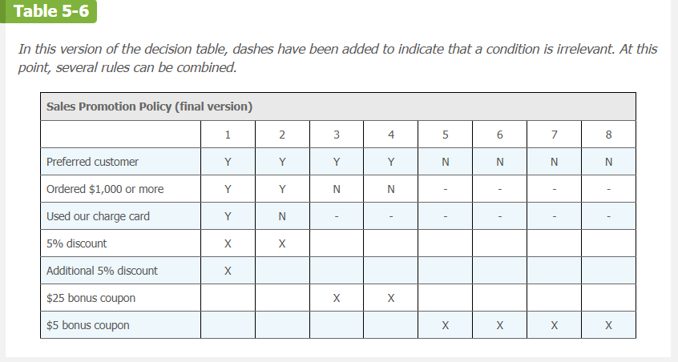

If dashes are added for rules that are not relevant, the table should resemble the one shown in `Table 5-6`. When the results are combined and simplified, **only four rules remain**: `Rule 1`, `Rule 2`, `Rule 3` (a combination of initial Rules 3 and 4), and `Rule 4` (a combination of initial Rules 5, 6, 7, and 8).

Decision tables are often the `best way to describe complex conditions`. Many analysts use decision tables because they are easy to construct and understand, and programmers find it easy to work from a decision table when developing code.

`Table 5-6`
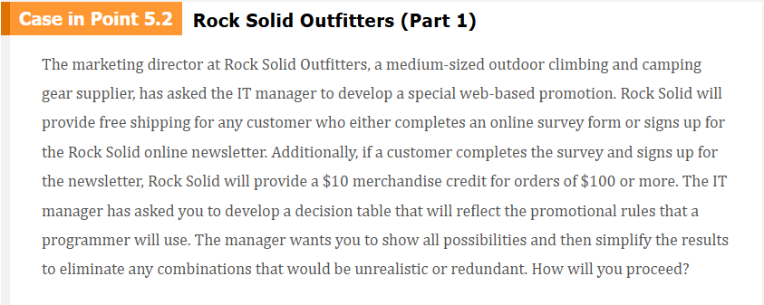

[⬆️ Back to 5.9](#59-process-description-tools-in-modular-design) · [Back to TOC](#table-of-contents)

### 5.9.5 Decision Trees

A **decision tree** is a graphical representation of a decision table’s `conditions`, `actions`, and `rules`. Decision trees show the logic structure in a **horizontal form** that resembles a _tree with the roots at the left and the branches to the right_. Like flowcharts, decision trees are useful ways to present the system to management. Decision trees and decision tables provide the same results but in different forms. In many situations, a graphic is the **most effective** means of communication.

`Figure 5-26` is based on the sales promotion policy shown in `Table 5-4`. A decision tree is read from `left to right`, with the conditions along the various branches and the actions at the far right. Because the example has two conditions with four resulting sets of actions, the example has four terminating branches at the right side of the tree.

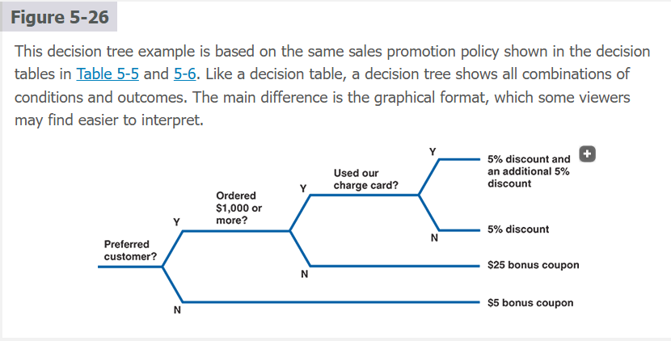

Whether to use a decision table or a decision tree often is a matter of _personal preference_. A decision table might be a better way to `handle complex combinations of conditions`. On the other hand, a decision tree is an effective way to describe a relatively simple process.


[⬆️ Back to 5.9](#59-process-description-tools-in-modular-design) · [Back to TOC](#table-of-contents)

---

## Chapter Review

Structured analysis tools can be used to develop a logical model during one systems analysis phase and a physical model during the systems design phase. Many analysts use a four-model approach, which involves a physical model of the current system, a logical model of the current system, a logical model of the new system, and a physical model of the new system.

During data and process modeling, a systems analyst develops graphical models to show how the system transforms data into useful information. The end product of data and process modeling is a logical model that will support business operations and meet user needs. Data and process modeling involves three main tools: data flow diagrams, a data dictionary, and process descriptions.

Data flow diagrams (DFDs) graphically show the movement and transformation of data in the information system. DFDs use four symbols: The process symbol transforms data, the data flow symbol shows data movement, the data store symbol shows data at rest, and the external entity symbol represents someone or something connected to the information system. Various rules and techniques are used to name, number, arrange, and annotate the set of DFDs to make them consistent and understandable.

A set of DFDs is like a pyramid with a context diagram at the top. The context diagram represents the information system’s scope and external connections, not internal workings. Diagram 0 displays the information system’s major processes, data stores, and data flows and is the exploded version of the context diagram’s process symbol, representing the entire information system. Lower-level DFDs show additional detail of the information system through the leveling technique of numbering and partitioning. Leveling continues until the functional primitive processes are reached; they are not decomposed further and are documented with process descriptions. All diagrams must be balanced to ensure their consistency and accuracy.

The data dictionary is the central documentation tool for structured analysis. All data elements, data flows, data stores, processes, entities, and records are documented in the data dictionary. Consolidating documentation in one location allows the analyst to verify the information system’s accuracy and consistency more easily and generate useful reports.

Each functional primitive process is documented using structured English, decision tables, and decision trees. Structured English uses a subset of standard English that defines each process with combinations of the basic building blocks of sequence, selection, and iteration. Using decision tables or decision trees can also document the logic.

**Nav:** ⬅️ [Prev: 5.9](#59-process-description-tools-in-modular-design) · [Back to TOC](#table-of-contents)
