## Introduction

**Learning objectives**:
- Demonstrate how object-oriented analysis can describe an information system.
- Explain what an object represents in an information system.
- Explain object attributes.
- Explain object methods.
- Explain object messages.
- Explain classes.
- Explain relationships among objects and classes.
- Describe an object-oriented system using UML.
- Explain how tools can support object modeling.

This is chapter is the 3rd of three chapters in the SDLC.
This chapter discusses object modeling techniques analysts used to create a logical model of the information system. In addition to structured analysis, Object oriented analysis is another way to represent and design an information system.

 The chapter includes three case in point discussion questions to help contextualize the concepts described in the text. The scenario and the `Ethical Issues` section considers a situation where an employee wants to skip training course and take the certification exam. Just give the course the employee requests a copy of the learning materials from someone else who took it.

 ## 6-1 Object-Oriented Analysis

 As stated previously, the most popular systems development options are structured analysis, `object-oriented (O-O) analysis`, and agile methods. Table 1-1, shown earlier, highlights the three alternatives and describes some pros and cons for each approach.

 `Table 1-1`
 | **Category** | **Structured Analysis** | **Object-Oriented Analysis** | **Agile Methods** |
|---------------|--------------------------|------------------------------|-------------------|
| **Description** | Represents the system in terms of data and the processes that act upon that data. Development is organized into phases with deliverables and milestones to measure progress. The waterfall model typically includes **five** phases: `requirements`, `design`, `construction`, `testing`, and `maintenance & evolution`. Iteration is possible among the phases. | Views the system in terms of objects that combine data and processes. **Objects** represent actual `people`, `things`, `transactions`, and `events`. Compared with structured analysis, O-O phases are more interactive and can use the waterfall model or one that emphasizes greater iteration. | Stresses intense team-based effort. Breaks development into short cycles (iterations) that add functionality. Each cycle is designed, built, and tested continuously to reduce major risks through incremental steps. |
| **Modeling Tools** | Data flow diagrams (DFDs) and process descriptions (see Chapter 5). Also uses business process modeling. | Object-oriented diagrams depicting system actors, methods, and messages (see Chapter 6). Also uses business process modeling. | Tools that enhance communication—collaborative software, brainstorming tools, whiteboards. Business process modeling integrates well with agile methods. |
| **Pros** | Traditional and well-established. Relies heavily on written documentation. Frequent phase iteration can provide flexibility comparable to newer methods. Well-suited to traditional project management tools and techniques. | Integrates easily with object-oriented programming languages. Code is modular and reusable, reducing cost and development time. Easy to maintain and expand because new objects can be created using inherited properties. | Very flexible and efficient in handling change. Encourages team interaction and community-based values. Frequent deliverables continually validate the project and reduce risk. |
| **Cons** | Changes can be costly, especially in later phases. Requirements defined early may change during development. Users might not fully understand their needs until they see tangible examples of system features. | A newer method that may be less familiar to team members. Interaction among objects and classes can become complex in large systems. | Requires high levels of technical and communication skill. Lack of structure and documentation can introduce risk. Projects may experience scope creep as requirements evolve. |

O-O analysis describes an information system by identifying things called objects. An `object` represents a real `person`, `place`, `event`, or `transaction`. For example, when a patient makes an appointment to see a doctor, the patient is an object, the doctor is an object, and the appointment itself is an object. The end product of O-O analysis is an `object model representing the information system in terms of objects and O-O concepts.`

O-O analysis has gained substantial popularity in systems analysis and design for several reasons, each contributing to this approach’s effectiveness, efficiency, and adaptability in developing complex software systems. Some of the key reasons for its popularity include:

**Real-world representation**. 

O-O analysis is popular for representing real-world entities, behaviors, and interactions. By defining objects that represent real-world entities, O-O analysis allows analysts to intuitively model and understand complex systems, making the conceptualization and design process more natural and straightforward.

**Modularity and encapsulation**. 

O-O analysis promotes the development of modular and encapsulated components, where each object is a self-contained unit with its attributes and behaviors. `This modularity facilitates easier maintenance, modification, and extension of systems`, as changes to one object do not necessarily impact others, reducing the risk of unintended consequences when models and related artifacts are modified.

**Reusability (Inheritance)**. 

Objects created through O-O analysis are often reusable across different projects. This reusability reduces development time and effort and promotes consistency and reliability across different systems, contributing to more efficient and cohesive software development.

**Integration with O-O programming languages**. 

O-O analysis integrates seamlessly with O-O programming languages like Java, C++, and Python. This integration ensures coherence among systems analysis, design, and implementation phases, allowing developers to transition smoothly from conceptual models to actual code, thereby reducing the likelihood of discrepancies between design and implementation.

**Scalability**. 

The structure provided by O-O analysis supports the development of scalable systems. The modularity and reusability inherent to O-O approaches allow systems to grow and evolve efficiently, accommodating new requirements and functionality with less effort and disruption.

**Enhanced communication**.

O-O analysis utilizes the` Unified Modeling Language (UML)`, a popular method of visualizing and documenting information systems. As discussed earlier in the book, UML provides a standardized way of representing system components and their interactions. These visual models are effective communication tools, enabling `clearer understanding and discussion among developers, analysts, and nontechnical stakeholders`. In this chapter, the UML is used to develop object models. 

The first step is understanding basic O-O terms, including objects, attributes, methods, messages, and classes. These terms are explained in the following sections.

**Support for design patterns (several backed up copies)**.

 O-O analysis provides a foundation for implementing design patterns, which are `proven solutions` to common design problems. The use of design patterns promotes best practices, improves code reliability and maintainability, and reduces the occurrence of bugs and errors.

**Flexibility and maintenance**. 

The O-O approach allows for` more straightforward modifications` and `enhancements` in the system. If a particular object needs to be altered, it can be done without affecting other parts of the system, making maintenance and updating of systems more manageable.

**Enhanced security**. 

O-O analysis offers an added layer of security through encapsulation, where the internal state of every object is protected from outside access. By `restricting access to the internal components and exposing only what is necessary, encapsulation provides a precise mechanism for controlling interactions with objects, preventing unintended interference and misuse`. This enhanced security is crucial in developing robust and secure applications, particularly in environments where data sensitivity and integrity are paramount.

**Efficient problem solving**.

 O-O analysis aids in efficient problem solving by allowing analysts and developers to `focus on high-level abstraction` and `decomposition` of the system into manageable, logical components (objects). This approach facilitates a clearer understanding of the system’s complexities and a more organized, systematic way of addressing each component’s functionalities and interactions. Enabling analysts to tackle problems in segments rather than dealing with the system as a whole fosters more effective and accurate solutions, leading to the development of more reliable and high-quality systems.

**Case in Point 6.1**

TravelBiz
TravelBiz is a nationwide travel agency that specializes in business travel. It has decided to expand into the vacation travel market by launching a new business division called TravelFun. The information technology (IT) director assigned two systems analysts to create a flexible and efficient information system for the new division. One analyst wants to use traditional analysis and modeling techniques for the project, while the other wants to use an O-O methodology. Which approach would you suggest and why?

## 6.2 Objects

In O-O analysis, objects are crucial foundational elements representing the instances of classes, and they are at the `core` of understanding and defining the system’s `behavior` and `structure`. In systems analysis and design, **objects are the functional units that interact and collaborate to realize the system’s intended functionalities.**

An object represents a `person`, `place`, `event`, or `transaction` that is significant to the information system. In an earlier chapter, data flow diagrams (DFDs) were created that treated data and processes separately. `An object, however, includes data and the processes that affect that data`. 

> a Method/Function is made up atttributes/properties that define the data that will be used and the code is the logic or systems behavior like placing an order or running a trasaction.

For example, a customer object has a name, an address, an account number, and a current balance. Customer objects also can perform specific tasks, such as placing an order, paying a bill, and changing their address.

The `accurate representation and interaction of objects are essential for developing robust, reliable systems that reflect real-world entities and their interactions`. Analysts can create secure, maintainable, and adaptable systems capable of evolving to meet changing needs and requirements through proper object definition, encapsulation, and interaction.

### 6.2.1 Examples

Consider a simplistic example of how the UML might describe a family with parents and children. UML represents an object as a rounded rectangle with the object name at the top, followed by the object's attributes and methods. `Figure 6-1` shows a parent object with attributes such as name, age, sex, and hair color. If there are two parents, there are two instances of the parent object. The parent object can perform methods like reading a bedtime story, driving a carpool van, or preparing. A school lunch. Receives a message. It performs an action or method.

`Figure 6-1`
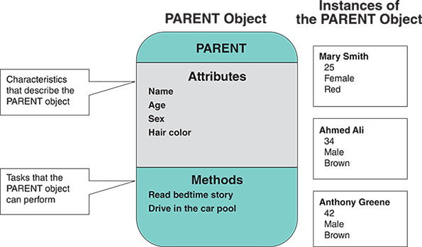

For example, the message GOOD NIGHT from a child might tell the PARENT object to read a bedtime story, while DRIVE from another parent signals that it is the PARENT object’s turn to drive in the carpool.

Continuing with the family example, the CHILD object in Figure 6-2 possesses the same attributes as the PARENT object and an additional attribute that shows the number of siblings. A CHILD object performs certain methods, such as picking up toys, eating dinner, playing, cooperating, and getting ready for bed. A PARENT can send specific messages that the CHILD object will understand and signal it to perform appropriate tasks. For example, the DINNER’S READY message tells a CHILD object to come to the table, while the SHARE WITH YOUR SIBLING message tells a CHILD object to cooperate with other CHILD objects.

`Figure 6-2`
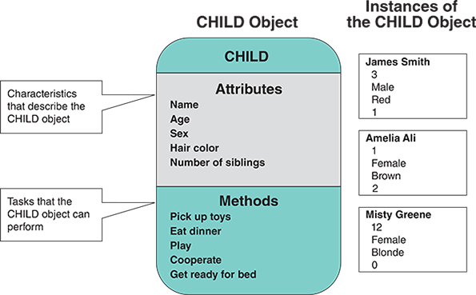

In O-O analysis, objects are the fundamental building blocks used to represent real-world entities within a system. An object has certain attributes, which are characteristics that describe the object. If_ objects are like nouns_, `attributes are like adjectives` that describe the characteristics of an object.

For example, in a system modeling a library, a BOOK object might have attributes such as title, author, ISBN, publication date, and genre. These attributes hold the data or information pertinent to the object and differentiate one object from another within the same class. `Some objects might have a few attributes; others might have dozens`. In an O-O system, objects can `inherit`, or `acquire`, _specific_ attributes from other objects.

`Attributes are usually represented as variables within the class definition` in O-O programming languages, and they can have different **data types**, such as _string_, _integer_, or _date_, depending on the nature of the attribute. For instance, a birth**date** attribute would typically be of the date **data type**, while a name attribute would be of the string data type.

#### They can have more than one state

Objects can have a specific attribute called a `state`. The state of an object is an **adjective** that describes the `object’s current status`. For example, depending on the state, a `student` can be a **future**, **present**, or **past** student. Similarly, a `bank account` can be **active**, **inactive**, **closed**, or **frozen**.

In O-O analysis, identifying the correct attributes for each object is crucial, as `it determines how accurately the real-world entity is represented within the system`. By ensuring that each object has the appropriate attributes, analysts can create more realistic and functional models of the entities within the system.

## 6.4 Methods

In O-O analysis, a system is conceived as a collection of interacting objects representing entities from the system’s real-world domain. In addition to attributes, an object has `methods`, which are tasks or functions that the object performs when it receives a `message`, or command, to do so.

Methods `perform operations`, `manipulate` object attributes, and `implement` the object’s behavior within a system. They **define how** the object can interact with other objects and the outside world. In systems analysis and design, understanding object methods is `essential in defining the interactions and functionalities` within the system.

Some of the significant characteristics of object methods include:

- **Interaction and collaboration**. Object methods facilitate interaction and collaboration between objects within a system, enabling the realization of complex behaviors and processes by coordinating simpler, well-defined operations.

- **Encapsulation and security**. Methods allow for encapsulation, a core principle of O-O design, where the internal state of an object is protected and access to it is controlled through well-defined interfaces, enhancing security and integrity.

- **Flexibility and maintainability**. Defining behaviors as methods allows for more flexible and maintainable models. If an object needs to change its behavior, only the methods related to that behavior must be modified, reducing the impact on the rest of the system.

- **Clarity and understandability**. Methods provide a clear and structured way to represent the functionalities of objects, making it easier for developers to understand and work with the system.

- **Enhanced modularity and reusability**. Object methods contribute to an O-O design’s enhanced modularity and reusability. Objects can be designed as modular components by encapsulating specific behaviors within methods, where each method has a single responsibility or function. This modularity allows objects and their methods to be reused across different system parts or even in other projects, promoting reusability and reducing development time and effort.

### 6.4.1 Example

Consider a server who prepares fries in a fast-food restaurant. A systems analyst might describe the operation as MORE FRIES, as shown in Figure 6-3. The MORE FRIES method includes the steps required to heat the oil, fill the fry basket with frozen potato strips, lower it into the hot oil, check for readiness, remove the basket when ready, drain the oil, pour the fries into a warming tray, and add salt.

Figure 6-3
The MORE FRIES method requires the server to perform seven specific steps.

Method:

MORE FRIES

Steps:

Heat oil

Fill fry basket with frozen potato strips

Lower basket into hot oil

Check for readiness

When ready, raise basket and let drain

Pour fries into warming tray

Add salt

----

## 6.5 Messages

Messages are how objects communicate and interact with each other within a system, serving as the conduits for invoking behaviors and exchanging information. In systems analysis and design, a message is a call from one object to another, requesting a certain operation to be performed or aiming to access information. When an object receives a message, it responds by executing a method associated with the message, effectively acting on the request or providing the needed information.

`Polymorphism` allows objects of different classes to respond differently to the same message (method call). It enables objects to be treated as instances of their parent class, leading to simpler code and fewer errors. It enables one interface to be used for different data types, allowing for the implementation of elegant software designs that can handle new, unforeseen circumstances and data types. In practical terms, polymorphism allows for overriding and overloading methods, providing flexibility and extensibility in designing robust and versatile software applications.

An object can be viewed as a “black box” because a message to the object triggers changes within it without specifying how the changes must be carried out. A gasoline pump is an example of a black box. When economy-grade gas is selected at a pump, it is unnecessary to consider how the pump determines the correct price and picks the proper fuel.

The black box concept is an example of encapsulation, meaning all data and methods are self-contained. A black box does not want or need outside interference. By limiting access to internal processes, an object prevents its internal code from being altered by another object or process. Encapsulation allows objects to be used as modular components anywhere in the system because objects send and receive messages but do not alter the internal methods of other objects.

Object messages are pivotal in O-O analysis and design, acting as the mechanism through which objects invoke behaviors and share information. They play a critical role in defining and designing the interactions and behaviors within a system, contributing to its modularity, clarity, and reliability. Some of the significant features of object messages include:

- **Defining interactions**. 

    In systems analysis, understanding and defining the messages that objects can send and receive is crucial for outlining the interactions within the system. It helps create clear and concise models of how different components will cooperate to fulfill the system’s requirements and achieve desired outcomes.

- **Designing behaviors**. 

    In the design phase, messages help detail objects’ behaviors and responsibilities, aiding developers in structuring the code to ensure that objects interact seamlessly and reliably. Properly designed messages contribute to the robustness and reliability of the system, preventing errors and inconsistencies.

- **Enhancing modularity and decoupling**. 

    Messages contribute to the modularity and decoupling of objects within a system. Decoupling refers to reducing the dependencies between different system parts to improve modularity and facilitate manageability, changeability, and scalability. Because objects interact through well-defined messages, changes in one object’s internal structure or methods do not necessarily affect others as long as the message interfaces remain consistent.

- **Enabling parallel development**. 

    Because messages act as defined interfaces between objects, other teams can design and develop different parts of a system in parallel if the agreed-upon messages are adhered to. This parallel development can significantly reduce development time and allow more flexible project management.

- **Enhancing clarity and understandability**. 

    By elucidating the interactions between objects, messages aid in creating more understandable and manageable system representations. This clarity is crucial for analysts and stakeholders to comprehend the system’s structure and behavior, facilitating effective communication, troubleshooting, and enhancements.

### 6.5.1 Examples

A message is a command that tells an object to perform a particular method. For example, the message PICK UP TOYS directs the CHILD class to perform all the necessary steps to pick up the toys. The CHILD class understands the message and executes the method.

In Figure 6-4, the message GOOD NIGHT signals the PARENT object to read a bedtime story, but the same message to the CHILD object signals it to get ready for bed. The same message would tell the dog to sleep if the family also had a DOG object.

`Figure 6-4`

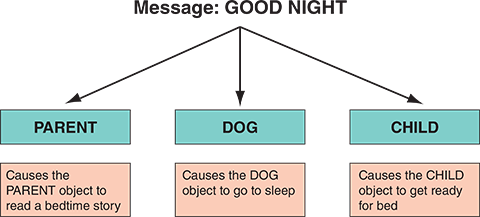

O-O designs are typically implemented with O-O programming languages. A significant advantage of O-O designs is that systems analysts can save time and avoid errors by using modular objects. Programmers can translate the designs into code, working with reusable program modules that have been tested and verified.

For example, in Figure 6-5, an INSTRUCTOR object sends an ENTER GRADE message to an instance of the STUDENT RECORD class. Notice that the INSTRUCTOR object and STUDENT RECORD class could be reused, with minor modifications, in other school information systems where many of the attributes and methods would be similar.

Figure 6-5

## 6.6 Classes

An object belongs to a group or category called a `class`. Classes are foundational elements, providing a blueprint or template from which objects are created. Classes serve as the structural basis defining the properties (attributes) and actions (methods) that instances of the class (objects) will possess and can perform. Classes play a pivotal role in the organization, structure, and functionality of O-O systems.

For example, a Honda Civic belongs to a class called CAR. An `instance` is a specific member of a class. A Toyota Camry is another instance of the CAR class. At an auto dealership, numerous cases of the CAR class may be observed: the TRUCK class, the MINIVAN class, and the SPORT UTILITY VEHICLE class, among others.

Objects within a class can be grouped into `subclasses`, which are more specific categories within a class. For example, TRUCK objects represent a subclass within the VEHICLE class; other subclasses are called CAR, MINIVAN, and SCHOOL BUS, as shown in Figure 6-6. Notice that all four subclasses `share common traits` of the VEHICLE class, such as make, model, year, weight, and color. Each subclass **also** can possess `uncommon characteristics`, such as a load limit for the TRUCK or an emergency exit location for the SCHOOL BUS.

Figure 6-6
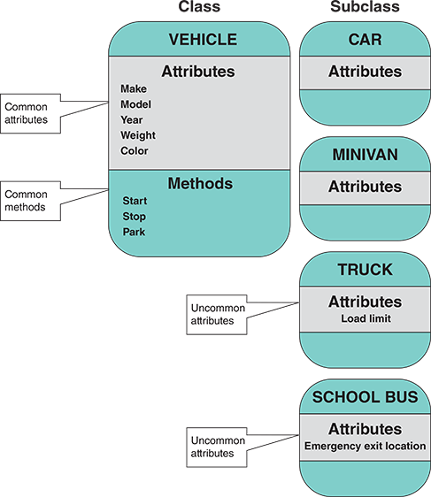

A class can belong to a more general category called a `superclass`. For example, a NOVEL class belongs to a superclass called BOOK because all novels are books in this example. The NOVEL class can have subclasses called HARDCOVER, PAPERBACK, and DIGITAL.

### 6.6.1 Example

Consider a fitness center, illustrated in Figure 6-7, with students, instructors, class schedules, and a registration process. As shown in Figure 6-8, the EMPLOYEE class belongs to the PERSON superclass because every employee is a person, and the INSTRUCTOR class is a subclass of EMPLOYEE.

`Figure 6-7`

`Figure 6-8`
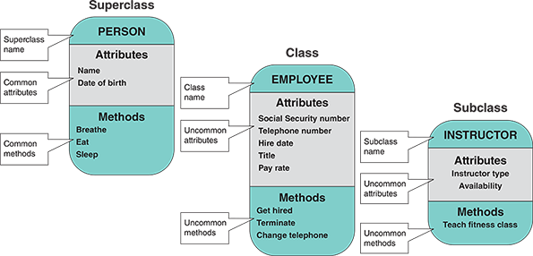

## 6.7 Relationships among Objects and Classes

`Relationships` enable objects to communicate and interact as they perform business functions and transactions required by the system. Relationships describe what objects need to know about each other, how objects respond to changes in other objects, and the effects of membership in classes, superclasses, and subclasses. Some relationships are more robust than others (just as a relationship between family members is stronger than between casual acquaintances). The strongest relationship is called `inheritance`. Inheritance enables an object, called a `child`, to derive one or more of its attributes from another object, called a `parent`. In the example in Figure 6-9, the INSTRUCTOR object (child) inherits many traits from the EMPLOYEE object (parent), including Social Security number, phone number, and hire date. **The INSTRUCTOR object can also possess additional attributes, such as the type of instructor**. Because all employees share certain attributes, those attributes are assumed through inheritance and do not need to be repeated in the INSTRUCTOR object.

`Figure 6-9`
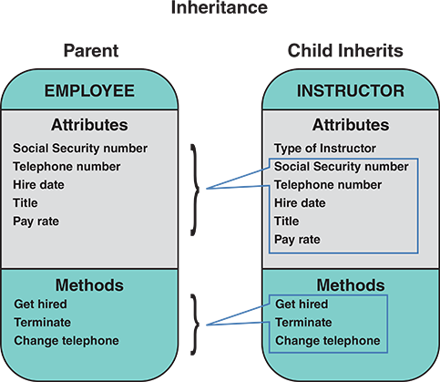

After identifying objects, classes, and relationships, an `object relationship diagram` can be prepared to provide an overview of the system. That model is used as a guide to continue to develop additional diagrams and documentation. Figure 6-10 shows an object relationship diagram for a fitness center. Notice that the model shows the objects and their interactions to perform business functions and transactions.

`Figure 6-10`
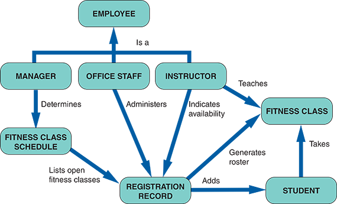
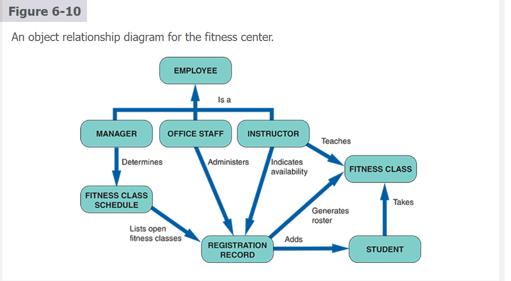

## 6.8 The Unified Modeling Language

Just as structured analysis uses **DFDs** to model data and processes, systems analysts use `UML` to describe O-O systems. An earlier chapter explained that UML is a popular technique for documenting and modeling a system. UML uses a set of symbols to graphically represent the various components and relationships within a system. Although UML can be used for business process and requirements modeling, it is mainly used to support O-O system analysis and develop object models.

### 6.8.1 Use Case Modeling

A `use case` represents the **steps** in a specific business _function or process_. An external entity, called an `actor`, initiates a use case by asking the system to perform a function or process. For example, a PATIENT (actor) can MAKE APPOINTMENT (use case) in a medical office system, as shown in Figure 6-11.

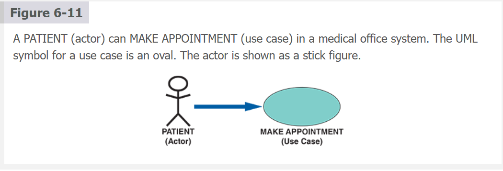

Notice that the UML symbol for a use case is an oval with a label that describes the action or event. The actor is shown as a stick figure with a label identifying the actor’s role. The line from the actor to the use case is `called an association` because it links a particular actor to a use case.

Use cases also **can interact** with other use cases.

 _When a use case incorporates the outcome of another use case, we say the **second** case uses the **first** case_. 
 
 UML indicates the relationship with an arrow pointing at the use case. Figure 6-12 shows an example in which a student adds a fitness class and PRODUCE FITNESS CLASS ROSTER uses the results of ADD FITNESS CLASS to generate a new fitness class roster. Similarly, if an instructor changes their availability, UPDATE INSTRUCTOR INFORMATION uses the CHANGE AVAILABILITY use case to update the instructor’s information.

`Figure 6-12`
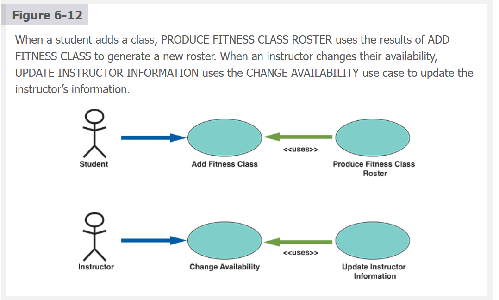

Review the information gathered during the requirements modeling phase to create use cases. The objective is to identify the actors and the functions or transactions they initiate. For each use case, develop a use case description as a table. A **use case description** documents the `name of the use case`, the `actor`, the `use case`, a `step-by-step list of the tasks` and `actions required for successful completion`, and a d`escription of alternative courses of action, preconditions`, `postconditions`, and `assumptions`.

 Figure 6-13 shows an example of the ADD NEW STUDENT use case for the fitness

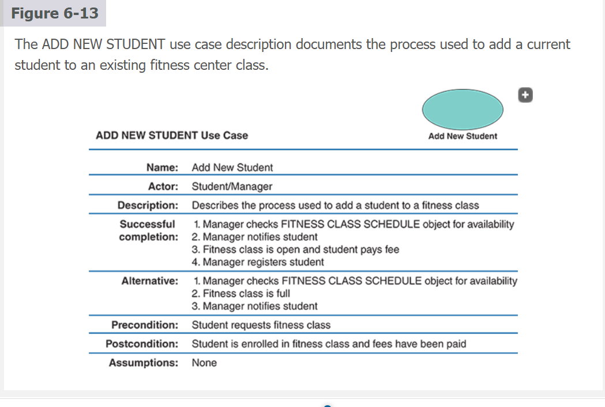

All related transactions should be grouped into a single use case when use cases are identified. For example, when a hotel customer reserves a room, the reservation system blocks out a room, updates the occupancy forecast, and sends the customer a confirmation. Those events are all part of a single `use case called RESERVE ROOM`, and the specific actions are step-by-step tasks within the use case.

### 6.8.2 Use Case Diagrams

A use case diagram is a visual summary of several related use cases within a system or subsystem. Consider a typical auto service department, as shown in Figure 6-14. The service department involves customers, service writers who prepare work orders and invoices, and mechanics who perform the work. Figure 6-15 shows the auto service department’s possible use case diagram.

`Figure 6-15`

When creating a use case diagram, the first step is identifying the system boundary, represented by a rectangle. The system boundary shows what is included in the system (inside the rectangle) and what is not included in the system (outside the rectangle). After the system boundary is identified, use cases are placed on the diagram, the actors are added, and the relationships are shown.

#### Case in Point 6.2

**Hilltop Motors**

You were hired by Hilltop Motors as a consultant to help the company plan a new information system. Hilltop is an old-line dealership whose prior owner was slow to change. A new management team has taken over, eager to develop a first-class system. You are reviewing the service department, which is undergoing a significant expansion. You create a model of the service department in the form of a use case diagram. The main actors in the service operation are customers, service writers who prepare work orders and invoices, and mechanics who perform the work. You are meeting with the management team tomorrow morning. How would you create a draft of the diagram to present to them?

### 6.8.3 Class Diagrams

A class diagram shows a use case’s object classes and relationships. Like a _DFD_, a `class diagram is a logical model that evolves into a physical model and becomes a functioning information system`. 

**Entities**, **data stores**, and **processes** are transformed into data structures and program code in structured analysis. Similarly, class diagrams evolve into code modules, data objects, and other system components.

In a class diagram, each class appears as a rectangle, with the class name at the top, followed by the class’s attributes and methods. Lines show relationships between classes and have labels identifying the action that relates the two classes. To create a class diagram, review the use case and determine the classes participating in the underlying business process.

The class diagram also includes `cardinality`, which **describes how instances of one class relate to another**. For example, an employee might have earned no vacation days, one vacation day, or many. Similarly, an employee might have no spouse or one spouse. Figure 6-16 shows various UML notations and cardinality examples. Notice that in the figure, the first column shows a UML notation symbol that identifies the relationship in the second column. The third column provides a typical example of the relationship described in the last column. In the first row of the figure, the UML notation 0..* identifies zero or many relations. An example is an employee with no payroll deductions or many deductions.

`Figure 6-15`
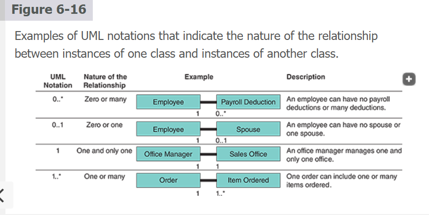

Figure 6-17 shows a `class diagram` for a sales order use case. Notice that the sales office has one sales manager with anywhere from zero to many sales reps. Each sales rep can have anywhere from zero to many customers, but each customer has only one sales rep.

`Figure 6-17`
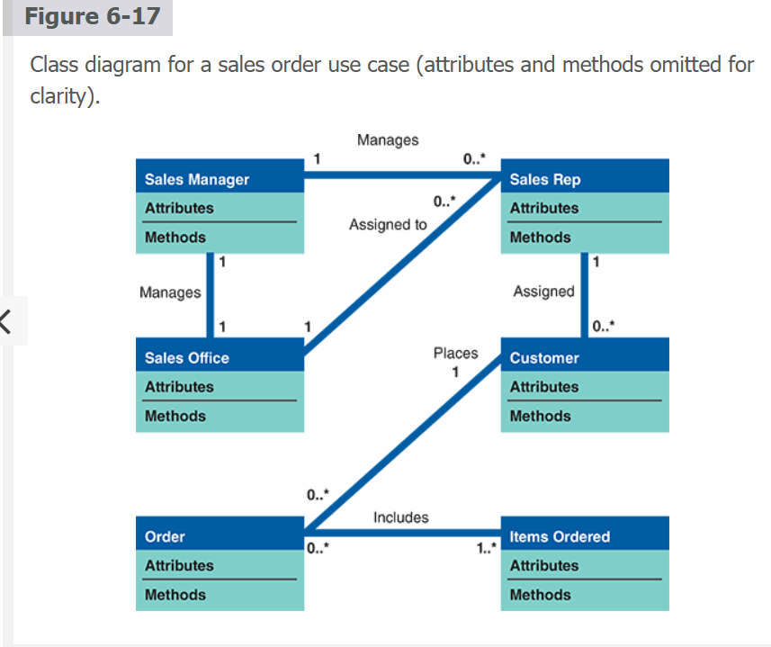

`Case in Point 6.3`

**Train the Trainer, Inc.**

Train the Trainer develops seminars and workshops for corporate training managers who train their employees. Your job at Train the Trainer is to assemble the training materials. Right now, you are up against a deadline. The new object modeling seminar has a chapter on cardinality, and the client wants you to come up with at least three more examples for each of the four cardinality categories listed in Figure 6-16. The four categories are zero or many, zero or one, one and only one, and one or many. Even though you are under pressure, you are determined to use realistic and familiar examples for the students. What examples will you submit?

### 6.8.4 Sequence Diagrams

A sequence diagram is a dynamic model of a use case, `showing the interaction among classes during a specified period`. A sequence diagram graphically documents the **use case** by showing the `classes`, the `messages`, and the `timing` of the messages.

Sequence diagrams include symbols that represent classes, lifelines, messages, and focuses. These symbols are shown in Figure 6-18.

`Figure 6-18`
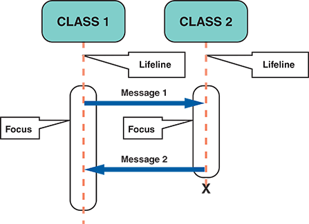

**Classes**. A class is identified by a rounded rectangle with the name inside. Classes that send or receive messages are shown at the top of the sequence diagram.

**Lifelines**. A lifeline is identified by a dashed line. The lifeline represents the time the object above it can interact with the other objects in the use case. An X marks the end of the lifeline.

**Messages**. A message is identified by a line showing the direction between two objects. The label shows the name of the message and can include additional information about the contents.

**Focuses**. A narrow vertical shape that covers the lifeline identifies a focus. The focus indicates when an object sends or receives a message.

`Figure 6-19` shows a sequence diagram for the fitness center example’s ADD NEW STUDENT use case. Notice that the vertical position of each message indicates the timing of the message.

`Figure 6-19`
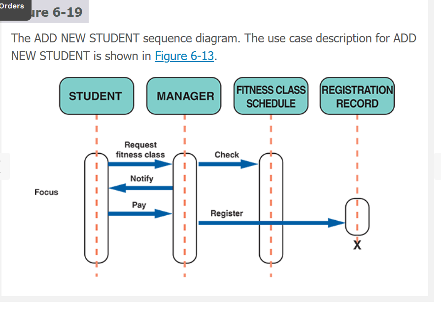

### 6.8.5 State Transition Diagrams
Earlier in this chapter, it was explained that state refers to an object’s current status. A **state transition diagram** shows how an object changes from one state to another `depending on events that affect the object.` All possible states must be documented in the state transition diagram, as shown in Figure 6-20. A bank account, for example, could be opened as a NEW account, changed to an ACTIVE or EXISTING account, and eventually become a CLOSED or FORMER account. Another possible state for a bank account could be FROZEN if the account’s assets are legally attached.

`Figure 6-20`
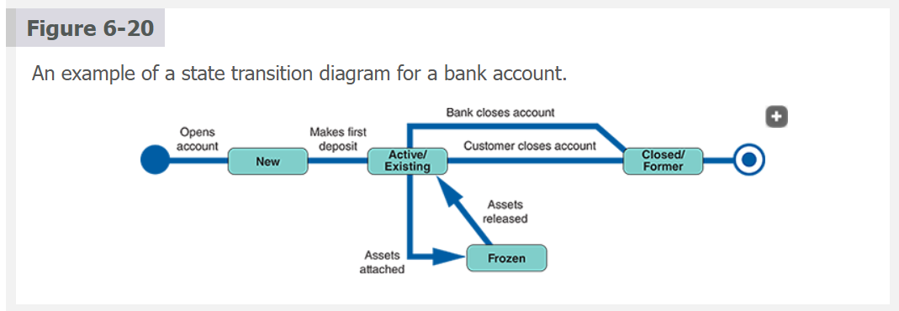

In a state transition diagram, the `states appear as rounded rectangles with the state names inside`. The small circle to the left is the **initial** state, or the point where the object first interacts with the system. _Reading from left to right_, the lines show direction and describe the action or event that causes a transition from one state to another. The circle at the right with a hollow border is the **final** state.

### 6.8.6 Activity Diagrams

An **activity diagram** resembles a horizontal flowchart that shows actions and events as they occur. Activity diagrams show the order in which the actions occur and identify the outcomes. Figure 6-21 shows an activity diagram for a cash withdrawal at an ATM. Notice that the customer initiates the activity by inserting an ATM card and requesting cash. Activity diagrams can also display multiple use cases in a grid, where classes are shown as vertical bars and actions appear as horizontal arrows.

`Figure 6-21`
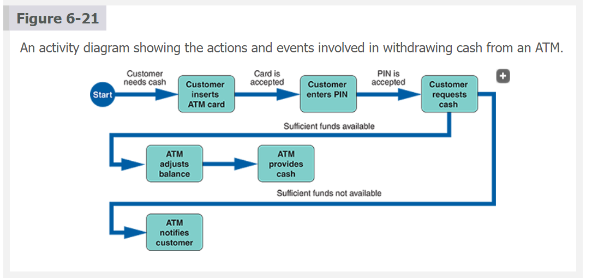

Sequence, state transition, and activity diagrams are dynamic modeling tools that can help a systems analyst understand how objects behave and interact with the system.

### 6.8.7 Business Processing Modeling

In addition to sequence and activity diagrams, business process models (BPMs) can `represent a system’s people, events, and interactions`. BPMs were previously discussed as a requirement diagramming tool, but they can be used anytime during systems development. A BPM works well with object modeling because both methods focus on the actors and their behavior.

## 6.9 Tools

Object modeling requires many types of diagrams to represent the proposed system. Creating the diagrams by hand is time-consuming and tedious, so systems analysts rely on tools to speed up the process and provide an overall framework for documenting the system components. In addition, tools ensure consistency and provide standard links so that once objects are described and used in one part of the design, they can be reused multiple times without further effort.

Many computer-aided software engineering (CASE) tools are tailored to UML. Tools such as Visio are popular for drawing UML diagrams. Still, they lack semantics: they help create visually pleasing figures but do not know the meaning of the underlying artifacts. This means a systems analyst can create diagrams that appear correct but need to be revised according to the rules of UML.

Proper systems modeling tools, such as Cameo Systems Modeler or IBM’s Rational product family, are typically used to overcome this shortcoming. These tools understand the meaning of the diagrams they help create, which supports creating syntactically and semantically correct UML diagrams. These tools also provide traceability, an essential feature in the SDLC that links design artifacts backward to requirements and forward to development and testing.

## Summary

This chapter introduced object modeling, a popular technique that describes a system in terms of objects. Objects represent real people, places, events, and transactions. Unlike structured analysis, which treats data and processes separately, objects include data and processes that can affect the data. During implementation, systems analysts and programmers transform objects into program code modules that can be optimized, tested, and reused as often as necessary.

O-O terms include attributes, methods, messages, and classes. Attributes are characteristics that describe the object. Methods are tasks or functions the object performs when receiving a command. Objects can send messages, or commands, which require other objects to perform specific methods, or tasks. Polymorphism is the concept that a message gives different meanings to different objects. An object resembles a black box with encapsulated, or self-contained, data and methods.

Classes include objects that have similar attributes, or characteristics. Individual members of a class are called object instances. Objects within a class can be grouped into subclasses, which are more specific categories within the class. A class also can belong to a more general category called a superclass.

After identifying objects, classes, and relationships, an object relationship diagram can be prepared that shows the objects and how they interact to perform business functions and transactions. The most robust relationship between objects is inheritance.

The Unified Modeling Language (UML) is a widely used method of visualizing and documenting an information system. UML techniques include use cases, use case diagrams, class diagrams, sequence diagrams, state transition diagrams, and activity diagrams.

A use case describes a business situation initiated by an actor interacting with the information system. Each use case represents a specific transaction, or scenario. A use case diagram is a visual summary of related use cases within a system or subsystem. A class diagram illustrates a detailed view of a single use case, showing the classes that participate in the underlying business transaction and the relationship among class instances, called cardinality. A sequence diagram is a dynamic model of a use case, showing the interaction among classes during a specified period. Sequence diagrams include lifelines, messages, and focuses. A state transition diagram shows how an object changes from one state to another depending on events that affect the object. An activity diagram resembles a horizontal flowchart that shows actions and events as they occur in a system.

In addition to object models, business process modeling can represent a system’s people, events, and interactions.

CASE tools provide an overall framework for system documentation. These tools can speed development, ensure consistency, and provide standard links that enable reuse during O-O analysis.
