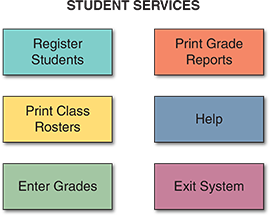
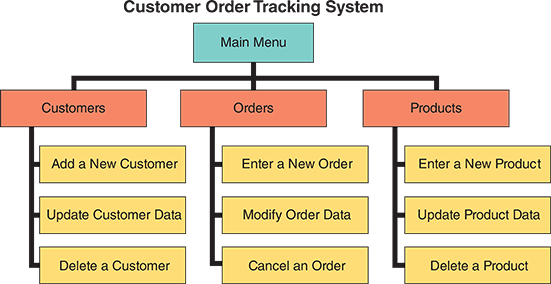
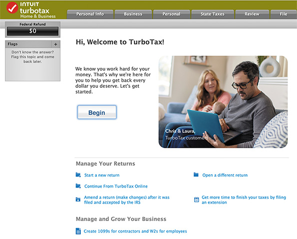
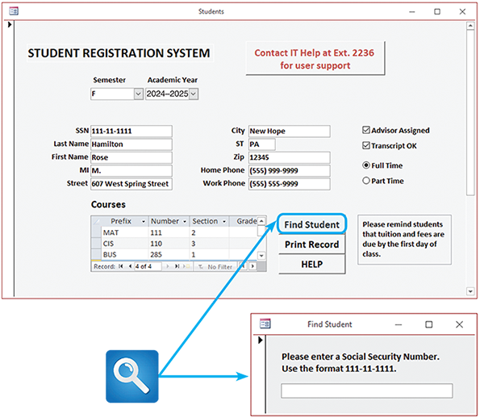
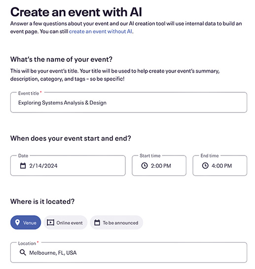
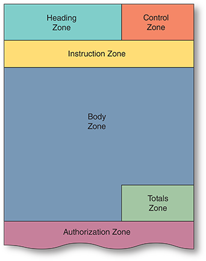
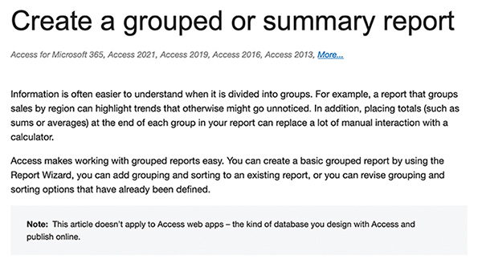

# Chapter 7 — User Interface Design

## Table of Contents

* [Chapter Introduction](#chapter-introduction)
* [7.1 User Interfaces](#71-user-interfaces)
* [7.2 Human–Computer Interaction](#72-human–computer-interaction)
* [7.3 Seven Habits of Successful Interface Designers](#73-seven-habits-of-successful-interface-designers)

  * [7.3.1 Understand the Business](#731-understand-the-business)
  * [7.3.2 Maximize Graphical Effectiveness](#732-maximize-graphical-effectiveness)
  * [7.3.3 Think Like a User](#733-think-like-a-user)
  * [7.3.4 Use Models and Prototypes](#734-use-models-and-prototypes)
  * [7.3.5 Focus on Usability](#735-focus-on-usability)
  * [7.3.6 Invite Feedback](#736-invite-feedback)
  * [7.3.7 Document Everything](#737-document-everything)
* [7.4 Guidelines for User Interface Design](#74-guidelines-for-user-interface-design)

  * [7.4.1 Create an Interface That Is Easy to Learn and Use](#741-create-an-interface-that-is-easy-to-learn-and-use)
  * [7.4.2 Enhance User Productivity](#742-enhance-user-productivity)
  * [7.4.3 Provide Flexibility](#743-provide-flexibility)
  * [7.4.4 Provide Users with Help and Feedback](#744-provide-users-with-help-and-feedback)
  * [7.4.5 Create an Attractive Layout and Design](#745-create-an-attractive-layout-and-design)
  * [7.4.6 Enhance the Interface](#746-enhance-the-interface)
  * [7.4.7 Focus on Data Entry Screens](#747-focus-on-data-entry-screens)
  * [7.4.8 Use Validation Rules](#748-use-validation-rules)
  * [7.4.9 Manage Data Effectively](#749-manage-data-effectively)
  * [7.4.10 Reduce Input Volume](#7410-reduce-input-volume)
* [7.5 Source Document and Form Design](#75-source-document-and-form-design)
* [7.6 Printed Output](#76-printed-output)

  * [7.6.1 Report Design](#761-report-design)
  * [7.6.2 Report Design Principles](#762-report-design-principles)
  * [7.6.3 Types of Reports](#763-types-of-reports)
* [7.7 Technology Issues](#77-technology-issues)

  * [7.7.1 Input Technology](#771-input-technology)
  * [7.7.2 Output Technology](#772-output-technology)
  * [7.7.3 Input/Output Technology Linkage](#773-inputoutput-technology-linkage)
* [7.8 Control and Security Issues](#78-control-and-security-issues)

  * [7.8.1 Input Control and Security](#781-input-control-and-security)
  * [7.8.2 Output Control and Security](#782-output-control-and-security)
  * [7.8.3 Input and Output Control and Security](#783-input-and-output-control-and-security)
* [7.9 Emerging Trends](#79-emerging-trends)

  * [7.9.1 Responsive Web Design](#791-responsive-web-design)
  * [7.9.2 Prototyping](#792-prototyping)
  * [7.9.3 Wearable Computing](#793-wearable-computing)
* [Chapter Review](#chapter-review)

---

## Chapter Introduction

➡️ [Next: 7.1 User Interfaces](#71-user-interfaces) · 📘 [Back to TOC](#table-of-contents)

Learning Objectives
When you finish this chapter, you should be able to:

- [ ] Explain user interfaces.
- [ ] Explain the concept of human–computer interaction.
- [ ] Summarize the seven habits of successful interface designers.
- [ ] Summarize the 10 guidelines for user interface design.
- [ ] Design effective source documents and forms.
- [ ] Explain report design techniques for printed output.
- [ ] Discuss output and input technology issues.
- [ ] Describe output and input security and control issues.
- [ ] Explain emerging user interface trends.

Chapter 7 is the first of three chapters in the systems design phase of the SDLC. User interface design is the first task in this phase. Designing the interface is extremely important because everyone wants a system that is easy to learn and use. This chapter explains how to design an effective user interface and how to handle data security and control issues. The chapter emphasizes the importance of user feedback and involvement in all design decisions.

The chapter includes three “Case in Point” discussion questions to help contextualize the concepts described in the text. The scenario described in the “Ethical Issues” section considers the ethical (and possibly legal) constraints on how far the creative work of others can be used without crediting the source—for example, in the design of a company’s website.

**Nav:**
⬅️ [Prev: — Start of Chapter —](#chapter-7--user-interface-design) · 🔝 [Back to Top of This Section](#chapter-introduction) · 📘 [Back to TOC](#table-of-contents)

---

## 7.1 User Interfaces

➡️ [Next: 7.2 Human–Computer Interaction](#72-human–computer-interaction) · 📘 [Back to TOC](#table-of-contents)

A **user interface (UI)** describes how users interact with a computer system and consists of all the hardware, software, screens, menus, functions, output, and features that affect two-way communications between the user and the computer. The UI is the key to usability, including user satisfaction, business function support, and system effectiveness.

Traditionally, a chapter on UI design started with a discussion of output because **output is what users touch**, view, and need to do their jobs. 

Today, the situation is different for several important reasons:

**users have more control**
- Users can design their output. System designers are more aware of user _needs_ and _desires_. A system can maintain data integrity and allow users to `view`, `sort`, `filter`, and `examine data` in any way that helps them do their jobs. There was a time when the MIS department made those choices, and users had little or no say in the matter. Today, successful applications are designed quite differently—the system developer identifies user needs and then creates a design that will satisfy users and meet corporate requirements.

**Historically, MIS controlled system output and structure**
- Centralized IT departments no longer produce reams of printed reports. Those reports often gathered dust while sitting on top of file cabinets. While a few examples might persist, customer-designed output is the overwhelming trend. The customer might be an individual user or a community of users, such as a department. As discussed earlier in the book, the IT team must understand user requirements before creating a solution.

**From comman-line to GUI**
- The UI has evolved into a two-way channel with powerful output capability, and most user information needs can be met with screen-generated data, which a user can print, view, or save. Well into the 1980s and beyond, a UI was a blank character-based screen, which might or might not offer menu choices. If a user entered a command improperly, the system responded with an error message, frustrating and stifling productivity. Many hardware-centric vendors did not understand the importance of the UI and its implications.

 

**Apple then Microsoft**

Apple pioneered UI development, introducing the **Graphical user interface (GUI)**, complete with mouse and screen icons, in the early 1980s. At that point, only a few companies were ready for this concept. When Microsoft jumped on the GUI bandwagon with its Windows operating system (OS), the corporate doors swung open, and everyone from managers on down said, “How did we ever do without this?”

**UI is essential**

Many industry leaders believe that the best interfaces are the ones that users do not even notice—they make sense because they do what users expect. For example, as shown in Figure 7‑1, Apple believes designing an exceptional UI is essential to a successful product. Apple has long distinguished itself from its competitors by the intuitiveness of its products. Apple’s command of the market suggests that consumers are willing to pay a premium for products that “just work.”

**Used to consist of process-controls | output then input**

When developing older systems, analysts typically designed all the printed and screen output first, then worked on the inputs necessary to produce the results. Often, the UI mainly consisted of process-control screens that allowed the user to send commands to the system. That approach worked well with traditional systems that transformed input data into structured output.

**The Shift**

As information management evolved from centralized data processing to dynamic, enterprise-wide systems, the primary focus shifted from the IT department to the users. The IT group became a supplier of information technology rather than a supplier of information. Today, the focus is on users within and outside the company, how they communicate with the information system, and how the system supports the firm’s business operations.

In a **user-centered** system, the `distinction blurs between input, output, and the interface itself`. Most users work with a varied mix of input, screen output, and data queries as they perform their day-to-day job functions. Because all those tasks require interaction with the computer system, the UI is vital in the systems design phase.

**Nav:**
⬅️ [Prev: Introduction](#chapter-introduction) · 🔝 [Back to Top of This Section](#71-user-interfaces) · 📘 [Back to TOC](#table-of-contents)

---

 
 

## 7.2 Human–Computer Interaction

➡️ [Next: 7.3 Seven Habits of Successful Interface Designers](#73-seven-habits-of-successful-interface-designers) · 📘 [Back to TOC](#table-of-contents)

A UI is based on fundamental principles of human–computer interaction. **Human–computer interaction (HCI)** `describes the relationship between computers and those who use them to perform their jobs`, like the worker shown in Figure 7‑2. HCI concepts apply to everything from smartphones to global networks. In its broadest sense, HCI includes all the communications and instructions necessary to enter input into the system and obtain output through screen displays or printed reports.

**Different types of HCI**

HCI encompasses a variety of methods that facilitate how humans interact with computers, adapting to technological advances and user needs. **GUIs** offer intuitive, visual-based interaction using windows, icons, and menus, primarily navigated via pointing devices like a mouse. **Command-line interfaces (CLIs)** allow interaction through text-based commands, `offering power and efficiency` for skilled users. In smartphones and tablets, touch interfaces enable direct manipulation through gestures like _tapping_ and _swiping_. **Voice user interfaces (VUIs)** employ voice commands for interaction, exemplified by virtual assistants. **Gesture-based interfaces** recognize and respond to physical movements and are increasingly used in gaming and virtual environments. **Augmented reality (AR)** and **virtual reality (VR)** offer immersive experiences, blending digital and physical worlds. Each type serves different user requirements and application contexts, marking the diverse evolution of HCI.

**The best UIs are the ones you cannot see..**

A systems analyst designs UIs for software developed in-house and customizes interfaces for various commercial packages and user productivity applications. The main objective is to create a user-friendly, easy-to-learn design, blending different types of HCI as needed. `Designers strive to translate user behavior, needs, and desires into interfaces users don’t notice`. IBM has stated that the best UIs are “almost transparent—you can see right through the interface to your work.” In other words, a **Transparent Interface** does not distract the user and calls no attention to itself.

Industry leaders Microsoft and IBM both devote considerable resources to UI research. Figure 7‑3 describes IBM Research’s work on HCI. They aim to “_design systems that are easier and more delightful for people to use_.”

**IBM/Microsoft invest heavily in HCI | Bad UI could cost millions in some industries**

Because HCI significantly impacts user productivity, it gets lots of attention—especially where multimillion-dollar issues are concerned. For example, software usability substantially impacts the medical profession, particularly physicians, who often struggle with poorly designed **electronic health record (EHR)** systems. Physicians often multitask, answering a question about one patient while prescribing medication for another. EHR software was not designed around that type of workflow.

`Case in Point 7.1`
**Casual Observer Software**

Casual Observer Software’s main product is a program that monitors and analyzes user keystrokes and mouse clicks to learn more about how employees use their computer systems. The problem is that some users feel this is an unwarranted intrusion into their privacy and prefer not to be observed. Some even fear the data could be used for other reasons, including performance appraisal. You are a consultant hired by a client firm trying to decide whether to use this software.

Before you advise the client, remember the Hawthorne Effect, which suggests that employees might behave differently when they know they are being observed. Finally, consider the ethical issues that might be involved in this situation. What will you advise your client, and why?

**Nav:**
⬅️ [Prev: 7.1 User Interfaces](#71-user-interfaces) · 🔝 [Back to Top of This Section](#72-human–computer-interaction) · 📘 [Back to TOC](#table-of-contents)

---

 
 

## 7.3 Seven Habits of Successful Interface Designers

➡️ [Next: 7.4 Guidelines for User Interface Design](#74-guidelines-for-user-interface-design) · 📘 [Back to TOC](#table-of-contents)

Although IT professionals have different views about interface design, most agree that good design depends on **seven fundamental principles**. Successful interface designers use these basic principles as a matter of course—they become habits. These desirable habits are described in the following sections.

 

### 7.3.1 Understand the Business

The interface designer must understand the underlying business functions and how the system supports individual, departmental, and enterprise goals. This comprehensive understanding involves grasping the fundamental business operations and recognizing how the proposed system aligns with the goals at various levels, from individual employees to entire departments and the enterprise. Such knowledge is crucial because the primary purpose of any system is to facilitate and enhance the efficiency of business operations. Therefore, an interface designer must focus on the aesthetic and usability aspects of the design and ensure that the interface serves the broader business objectives effectively.

**FDD; Good staraing point**

A good starting point is analyzing a **functional decomposition diagram (FDD)** to design an effective and user-centric interface. As described earlier in the book, an `FDD is a tool that visually represents the business’s functions`. It starts by outlining the major functions and then delves into more detailed levels. This breakdown helps in understanding not just the high-level operations of the business but also the intricate, day-to-day tasks that employees engage in. By using an FDD, an interface designer can identify the critical functions that users need to perform and ensure that these tasks are supported and streamlined through the interface. This process helps in bridging the gap between system capabilities and user requirements.

Using an FDD in interface design is **particularly valuable**; it provides a structured approach to understanding user tasks. It also `acts as a checklist`, guiding the designer to include all necessary elements in the interface. This ensures the final design is aesthetically pleasing, intuitive, and functionally comprehensive, covering all aspects of user tasks as the business functions dictate. Such an approach guarantees that the interface looks good and aligns perfectly with the business processes and user needs, ultimately leading to a more effective and successful system implementation.

 

### 7.3.2 Maximize Graphical Effectiveness

**Most are visual**

Maximizing graphical effectiveness in UI design is crucial for creating user-friendly and efficient systems. Numerous studies have demonstrated that people generally learn and comprehend better **visually**. This principle is a key reason behind the widespread success and popularity of operating systems like Apple’s iOS and Microsoft Windows, renowned for their GUIs. With their intuitive design and visual appeal, these interfaces facilitate easy learning and use, even for those new to technology. A well-crafted interface that leverages these visual strengths can `significantly enhance a user’s ability` to quickly learn and adapt to a new system, thereby increasing productivity and user satisfaction.

**Multiple Windows**

Graphical interfaces offer several practical advantages in a systems environment. One notable feature is the `ability to display and interact with multiple windows on a single screen`, a functionality that is indispensable in today’s multitasking work culture. This feature allows users to efficiently navigate between different tasks or applications without losing context, enhancing workflow and productivity. A well-designed GUI also enables seamless data transfer between programs, simplifying many complex tasks that would otherwise require cumbersome steps. This integration and ease of use are fundamental in designing systems that cater to the evolving needs of users in a dynamic technological landscape.

**Data Entry must be Efficient and Error-Free**

Regarding data entry, the importance of adhering to specific design guidelines becomes even more pronounced. In later sections of this chapter, detailed guidelines on data entry screen design are discussed, underscoring the need for interfaces that are not only visually appealing but also **functionally efficient**. `These guidelines ensure that data entry, a fundamental component of many systems, is streamlined and error-free`. Adherence to these principles ensures that the interface supports users in their tasks effectively, reducing the likelihood of errors and enhancing overall *data integrity*. In sum, maximizing graphical effectiveness in interface design is not just about aesthetics; it’s about creating an intuitive environment that aligns with user needs and system functionalities.

 

### 7.3.3 Think Like a User

Adopting a user-centric mindset is fundamental for a systems analyst aiming to create effective and intuitive interfaces. Understanding potential users’ varied experience, knowledge, and skill levels is crucial. This understanding becomes even more important when dealing with a diverse user base, where capabilities range from novice to highly experienced. An effective interface should cater to this spectrum, offering flexibility and adaptability to accommodate all users. This approach ensures that the system is accessible and user-friendly for everyone, irrespective of their prior experience or technical proficiency. The goal is to create a system that is not only functional but also inclusive, ensuring that no user feels alienated or overwhelmed by the technology.

To develop a genuinely user-centered interface, designers must immerse themselves in the mindset of the users, seeing and experiencing the system as they would. This involves using language, terms, and metaphors that are familiar and relatable to the users. For instance, users often have real-world experience with interactive systems like automobiles, automated teller machines (ATMs), or microwave ovens, which provide immediate and understandable feedback. Drawing parallels from these everyday experiences, users naturally expect similar levels of clarity and responsiveness from computer systems. Therefore, a system that leverages familiar concepts and feedback mechanisms can significantly enhance user comfort and efficiency. It’s about creating an environment where users can intuitively navigate and interact with the system without a steep learning curve, thus making technology more approachable and user-friendly.

In addition to conceptually understanding the user’s perspective, practical considerations are equally important. This includes meticulous attention to the details of input and output processes. Inputs should be designed to be intuitive, straightforward, and forgiving of errors, reducing the likelihood of user frustration and mistakes. This aspect is particularly critical in scenarios where incorrect input can lead to significant problems or inefficiencies. On the output side, the information presented to users must be attractive, easy to comprehend, and appropriately detailed. It should provide users with the necessary information clearly and concisely, avoiding unnecessary complexity or ambiguity. By carefully examining and refining these interaction points, designers can create a system that offers a more pleasant and efficient experience, ultimately leading to higher user satisfaction and better system adoption.

### 7.3.4 Use Models and Prototypes

The interface holds a place of paramount importance from a user’s perspective. It’s the primary medium users have for interacting with the system, often for extended periods. This high level of interaction makes the interface not just a component of the system but the face of the system itself. For this reason, the interface must be designed with the user’s needs and preferences in mind. Constructing models and prototypes is essential in this process, as they serve as a preliminary interface version for user testing and approval. These prototypes provide a tangible interface representation, allowing users to interact, give feedback, and ensure that the final product meets their expectations and requirements. Therefore, the role of an interface designer transcends mere aesthetics; it involves understanding and implementing the functional needs and usability aspects that define the user experience.

The process of interface design benefits greatly from early and extensive user feedback. One effective method for initiating this feedback loop is to use **storyboards**. `A storyboard presents initial screen designs as a series of sketches, displaying the general layout and design of the interface`. This visual representation is instrumental in conveying the proposed design to users, enabling them to envision how the interface will look and function. Storyboards can be created using specialized software or even through freehand drawing, offering flexibility in the design process. The key advantage of storyboards is that they facilitate early user involvement, allowing for adjustments and improvements based on user reactions before the design is fully implemented. This early engagement with users ensures the user-centered design process focuses on real-world applicability and usability.

Finally, comprehensive user testing of all aspects of the interface design is critical. The interface is scrutinized during this testing phase, with users providing feedback on usability, functionality, and overall user experience. Various methods can be employed to gather user input, such as **conducting interviews, administering questionnaires, and observing user interactions with the interface**. 

Additionally, using software to record and measure user interactions provides valuable **usability metrics** data. This data can offer insights into how users navigate the interface, identify potential areas for improvement, and assess overall usability. By incorporating this user feedback and data into the design process, interface designers can refine and optimize the interface, ensuring it effectively meets users’ needs. This iterative design, testing, and refinement process is crucial in creating a functional, efficient, intuitive, and user-friendly interface.

 

### 7.3.5 Focus on Usability

The design of the UI is a critical aspect that directly impacts the usability and effectiveness of the information system. A well-designed UI `should encompass all the tasks, commands, and communications between the users and the system`. The primary goal is to create an interface that is intuitive and easy to navigate, ensuring users can interact with the system efficiently to complete their tasks. The opening screen of the interface plays a pivotal role, as it sets the tone for the user’s interaction with the system. It should present the main options clearly and concisely, as demonstrated in the example in Figure 7‑4. This initial presentation helps users quickly grasp the system’s capabilities and how to navigate it, providing a solid foundation for their subsequent interactions.

 
Figure 7-4

 

**Find the Right Balance in Presented Choices**

Each screen within the interface `should logically lead to subsequent screens, offering more specific options and functionalities`. This hierarchical design is crucial in managing the flow of information and user actions within the system. The **challenge** lies in striking the right balance in the number of choices presented on each screen. Too many options can overwhelm and confuse users, making the interface cumbersome and challenging to navigate. On the other hand, offering too few options can result in excessive submenu levels, complicating the navigation process and potentially frustrating users. `The objective is to offer a reasonable number of choices on each screen, enough to provide necessary functionality but not so many that it becomes overwhelming`. This balance ensures that users can find what they need quickly and efficiently, enhancing the overall user experience.

**Defaults and Flexibility for Users**

An _effective strategy_ in interface design is to `prioritize the presentation of options based on their frequency of use or importance`. Presenting the most-used choice as the default option is practical, as it aligns with most users’ needs and expectations. However, it’s equally important to provide users the flexibility to select other alternatives if their needs differ from the default. This flexibility allows for a more personalized and user-centric experience, catering to a broader range of user requirements. By carefully considering these design elements, `interface designers can create a system that is not only functional but also adaptable to the diverse needs of its users`, ultimately leading to a more successful and user-friendly information system.

### 7.3.6 Invite Feedback

Launching a system **is not the end** of the design process; it is a critical phase in the system’s ongoing development and refinement. Once a system becomes operational, continuous monitoring and evaluation of its usage are essential. `This post-launch phase is crucial for understanding how the system is utilized in real-world scenarios and identifying any unforeseen issues or areas for improvement`. Systems analysts play a pivotal role here, observing and surveying users to gauge how well the system features are being used. This can include tracking which features are most frequently used, which are ignored, and any difficulties users encounter. Such continuous assessment is vital for ensuring that the system `not only functions as intended but also meets the evolving needs of its users`.

**Real-word usage will always best simualtions**

During full-scale operations, specific problems or inefficiencies in the system that were not noticeable during prototype testing may become apparent. This is common, as real-world usage often presents scenarios and challenges that are `difficult to simulate in a controlled testing environment`. The feedback from users during this phase is **invaluable**, providing insights into practical issues and user experiences that _may have been overlooked earlier_. For example, users might find certain features confusing or inadequate for their needs. This user feedback is a gold mine of information that can guide further refinements and enhancements to the system.

**Help Screens**

Based on the feedback and observations gathered, there might be a need for revisions in various aspects of the system, such as the help screens or other UI elements.**Help screens** are crucial; `they guide users through the system and help resolve common queries or problems`. If these screens are unhelpful or challenging to understand, they can significantly hinder users’ ability to use the system effectively. Therefore, redesigning these screens based on user input can dramatically enhance the system’s usability. Similarly, other design changes may be required to allow the system to reach its full potential. These modifications, driven by **real user experiences** and **feedback**, ensure that the system continuously evolves and improves, ultimately leading to a more effective, user-friendly, and successful system.

 

### 7.3.7 Document Everything

Documentation plays a pivotal role, especially when it comes to the design of UIs. Detailed documentation of all screen designs is not just a formality—it’s a crucial resource for future development and maintenance. For programmers and other team members who will work on or modify the system in the future, having a comprehensive, well-documented set of designs is invaluable. This documentation should include every aspect of the screen designs, including layout, functionality, and user interactions. If CASE tools or screen generators are employed in the design process, organizing and saving these designs in a structured format, akin to a menu tree, is beneficial. This hierarchical organization helps maintain clarity and ease of navigation through the various elements of the interface, facilitating easier understanding and implementation by the programming team.

Moreover, the documentation process extends beyond technical schematics and includes user-approved sketches and storyboards. These user-centric elements are key in documenting the evolution of the UI design, showcasing how user feedback and testing have shaped the final product. These sketches and storyboards serve as a tangible record of the decisions made and provide valuable context for why certain design choices were preferred. They can also be an essential reference when making future changes or updates to the system, ensuring that any modifications align with the original user requirements and design intent. This comprehensive documentation bridges the initial user-centered design principles and the technical implementation, ensuring coherence and consistency throughout the system’s life cycle.

Applying basic, user-centered design principles is at the heart of creating a successful UI, where a systems analyst’s expertise becomes crucial. These principles guide the design process to ensure the interface is intuitive, efficient, and tailored to the users’ needs. From the initial planning stages to the final delivery, every step should be informed by a deep understanding of the end users—their preferences, behaviors, and challenges. By prioritizing the user experience in the design process, a systems analyst can develop an interface that meets the system’s technical requirements and provides a seamless and satisfying user experience. The meticulous documentation of each step in this process further solidifies the effectiveness of the design, providing a clear blueprint for current and future development efforts. This approach underscores the importance of a user-centered perspective in systems analysis and design, ensuring the creation of functional and user-friendly interfaces.

**Nav:**
⬅️ [Prev: 7.2 Human–Computer Interaction](#72-human–computer-interaction) · 🔝 [Back to Top of This Section](#73-seven-habits-of-successful-interface-designers) · 📘 [Back to TOC](#table-of-contents)

---

 
 

## 7.4 Guidelines for User Interface Design

➡️ [Next: 7.5 Source Document and Form Design](#75-source-document-and-form-design) · 📘 [Back to TOC](#table-of-contents)

The effectiveness of a system is primarily determined by its UI. User satisfaction and usability accurately measure success, no matter how advanced the underlying technology. This underscores the importance of UI design, which should be approached with the user’s needs and preferences at the forefront. Over the years, industry best practices have distilled a set of general guidelines for successful UI design. These guidelines emphasize the importance of the design’s **simplicity**, **clarity**, **consistency**, and **responsiveness**. They are based on the premise that an intuitive and user-friendly interface enhances user engagement and productivity. However, it’s crucial to note that `these guidelines often overlap`, as many core principles are interrelated and contribute to a cohesive user experience.

**Purpose of the 8 Golden Rules**

For example, Ben Shneiderman, an emeritus professor at the University of Maryland and noted expert in HCI, crafted “Eight Golden Rules of Interface Design.” These principles are aimed at creating user-friendly and efficient interfaces. They emphasize the importance of consistency in design elements and actions across the interface, **enabling expert users to utilize shortcuts** for quicker navigation. The rules advocate for informative feedback responding to user actions and structured dialogs that provide a sense of completion. They emphasize the importance of **error prevention** and **easy error handling**, allowing for reversible actions to **reduce user anxiety** and **encourage exploration**. Additionally, these guidelines stress the need for interfaces that support users’ sense of control and **minimize their short-term memory load**, making interactions more intuitive and reducing cognitive strain. These rules enhance the user experience by making interfaces more accessible, efficient, and engaging.

While these guidelines offer a solid foundation for UI design, it’s important to recognize that there is `no one-size-fits-all approach`. The guidelines are particularly tailored for traditional systems development, `serving as a starting point` from which designers can adapt and innovate according to the specific needs of their project. However, UI development for the web, mobile apps, or wearable devices presents additional challenges and considerations. These platforms have unique constraints and opportunities, such as varying **screen sizes**, **touch interfaces**, and **contextual usage** (like on-the-go use for mobile apps). As such, while the general guidelines provide a helpful framework, designers working on web or mobile interfaces must also consider platform-specific factors to ensure their designs are effective in those environments.

**Advantages For Different Contexts**

Moreover, HCI usability varies significantly between devices such as keyboards, touchscreens, and voice control, offering distinct advantages for different contexts. **Keyboards** are highly efficient for text input and complex command execution, and favored for their precision and speed, especially in professional or typing-intensive environments. **Touchscreens** offer intuitive and direct interaction, excelling in ease of use for navigating graphical interfaces, and are ideal for mobile or tablet use where quick, straightforward access is required. **Voice control** provides a hands-free experience and is excellent for multitasking or accessibility, allowing natural language use for commands and searches. However, it can sometimes struggle with accuracy and complex commands. Each method caters to different user needs and scenarios, making their effectiveness context-dependent.

The most crucial aspect to remember in UI design is that adherence to guidelines **should not be dogmatic**. The primary goal is to `create an interface that resonates with its users, fulfilling their needs and preferences`. This means that **not all guideline recommendations will apply** universally to every project. The best UI is tailored to its specific user base, considering their behaviors, preferences, and context. Designers must be willing to adapt, experiment, and sometimes even disregard certain guidelines to achieve a more user-centric design. In essence, the effectiveness of an interface is determined by its ability to connect with its users and provide them with a seamless, intuitive, and satisfying experience. This user-centered approach is at the heart of successful interface design in systems analysis and design.

 

### 7.4.1 Create an Interface That Is Easy to Learn and Use

Creating an interface that is easy to learn and use is crucial because it significantly enhances user adoption and satisfaction, ensuring that users `can quickly become proficient without extensive training or frustration`. An intuitive interface improves efficiency and productivity, as users spend less time figuring out how to use the system and more time accomplishing their tasks effectively. Furthermore, it broadens the accessibility of the technology, making it usable for a diverse range of people with varying levels of technical proficiency, thus expanding its potential user base.

The following **UI design guidelines** support these goals:

- Focus on system design objectives rather than calling attention to the interface.

- Create a design that is easy to understand and remember.

- Maintain a standard design in all interface **modules**, including color, screen       placements, fonts, and the overall “look and feel.”

- Provide commands, actions, and system responses that are consistent and predictable.

- Allow users to correct errors quickly.

- Clearly label all controls, buttons, and icons.

- Make it easy to navigate or return to any level in the menu structure.

It’s also helpful to select familiar images that users can understand and to provide logical, concise, and clear instructions on the screen. For example, the top screen in Figure 7‑5 shows four control buttons, but none has an obvious meaning. In the bottom screen, the first five messages provide little or no information. The last message is the only one that is easy to understand.

### 7.4.2 Enhance User Productivity

The interface is where a user interacts with the system, so it can dramatically affect productivity. The user becomes more productive if the interface empowers them and enables them to handle more complex tasks. Conversely, if the interface is difficult to work with, productivity declines.

The following UI design guidelines support **productivity enhancements**:

- Organize tasks, commands, and functions in groups resembling business operations. Group functions and submenu items in a multilevel menu hierarchy, or tree, that is logical and reflects how users typically perform the tasks. `Figure 7‑6` shows an example of a menu hierarchy for an order tracking system.

Figure 7-6

- Create **alphabetical** menu lists or place the selections **used frequently** `at the top of the menu list`. No universally accepted approach to menu item placement exists. The best strategy is to design a prototype and obtain feedback from users. Some applications even allow menus to show recently used commands first. Some users like that feature, but others find it distracting. The `best approach is to offer a choice and let users decide`.

- Provide **shortcuts for experienced users** so they can avoid multiple menu levels. Shortcuts can be created using hotkeys that allow a user to press the Alt key plus the underlined letter of a command.

- Use **default values** if most values in a field are the same. For example, if 90% of a firm’s customers live in Albuquerque, use it as the default value in the City field.

- Use a **duplicate value function** that enables users to insert the value from the same field in the previous record, but allow them to turn this feature on or off.

- Provide a **fast-find feature** that displays a list of possible values when users enter the first few letters.

- Consider a **natural language** feature that allows users to type commands or requests in customary text phrases, if available. For example, many applications allow users to request help by typing a question into a dialog box. The software then uses natural language technology to retrieve a list of topics that match the request.` Natural language technology is used in speech recognition systems, text-to-speech synthesizers, automated voice response systems, web search engines, text editors, and language instruction materials.`

A productivity-optimized interface enhances user satisfaction, as users are more likely to have a positive experience with a system that enables them to work seamlessly and intuitively. Furthermore, in a competitive market, systems that boost user productivity can stand out, offering a distinct advantage by attracting and retaining users who value an efficient and streamlined workflow.

 

### 7.4.3 Provide Flexibility

**Hardcoding may be a simple solution--but it does NOT Scale**

Flexibility within UIs is crucial for accommodating diverse user needs and preferences. Consider a scenario in which a user requires a screen display of all customer balances exceeding $5,000 in an accounts receivable system. One way to approach this is by coding the program to automatically check customer balances against a fixed value of $5,000. This method is straightforward for programmers and users, requiring no additional input or interaction from the user to generate the desired display. It offers simplicity and ease of use, which can be beneficial when user requirements are consistent and unlikely to change. However, this simple approach lacks flexibility and may not cater to the varying needs of different users or changing business requirements.

**Default Values for beginners**

A more flexible approach would `allow users to input the amount themselves`. Or, start with a default value that displays automatically. This method introduces an element of user control and customization, enabling users to adjust parameters based on their specific needs at any given time. For instance, the system could present a default value of $5,000 and allow users to accept it by pressing ENTER, or they could enter a different amount per their requirement. This design strategy caters to the initial scenario and accommodates various other use cases, making the system more versatile and user-friendly. It empowers users by allowing them to define their parameters, leading to a more personalized and effective user experience.

**Give the user Choices**(let them feel empowered!)

Incorporating several alternatives and choices within the system design often represents the best strategy for balancing simplicity and flexibility. By offering multiple options, the `system can cater to a broader range of user preferences and scenarios`, allowing users to select the best approach. This could mean providing default values for quick tasks while also allowing customization for more specific requirements. Such a design philosophy ensures the system is functional and adaptable to its users’ diverse and evolving needs. In essence, flexibility in system design is about understanding and accommodating the unique ways in which different users interact with the system, thereby enhancing overall usability and user satisfaction.

### 7.4.4 Provide Users with Help and Feedback

**Encountering diffultiies, empower users, and usability**

Designing a sound help system UI is important for several reasons. 
`First`, it directly impacts user **support** and **satisfaction**, providing users with easy access to assistance and information when they encounter difficulties, which can reduce frustration and improve their overall experience. `Second`, a well-designed help system **empowers users to find solutions independently**, potentially reducing the reliance on direct customer support and lowering support costs. `Finally`, it contributes to the **usability** of the overall system; a good help system can act as a learning tool, helping users understand and utilize the full range of functionalities offered, thereby enhancing their efficiency and effectiveness in using the product or service.

**Users can compound their frustration**

Help systems should not slow users down because they `are intended to aid, not hinder`, the user experience. When users seek help, it’s often because they’ve encountered a barrier in their workflow, so the help system `needs to provide efficient and effective assistance` to minimize **disruption** and **frustration**. If the help system is intrusive or slows down the user, it can compound their frustration, negatively impacting their overall experience and productivity. Ideally, help should be easily accessible and available in the background, hidden from those who don’t need it. This design approach ensures that users who require assistance can quickly and effortlessly access it without interrupting their workflow.

Consider the following when **designing a Help System UI**:

- Ensure that help is always available on demand. Help screens should provide information about menu choices, procedures, shortcuts, and errors.

- Provide user-selected help and context-sensitive help. User-selected help displays information when the user requests it. The user eventually reaches a screen with the desired information by making appropriate choices through the menus and submenus. Figure 7‑7 shows the main help screen for the student registration system referenced earlier. Context-sensitive help offers assistance for the task in progress.

- Provide a direct route for users to return to where help was requested. Title every help screen to identify the topic and keep the text simple and concise. Insert blank lines between paragraphs to make help text easier to read and provide examples where appropriate.

- Include contact information, such as a phone extension or email address, if a department or help desk is responsible for assisting users.

- Require user confirmation before data deletion (“Are you sure?”) and provide a method of recovering data that is deleted inadvertently. Build safeguards that prevent critical data from being changed or erased.

- Provide an “Undo” key or a menu choice allowing the user to undo the most recent command or action results.

- When a user-entered command contains an error, highlight the erroneous part, and allow the user to correct it without retyping the entire command.

- Use hypertext links to assist users as they navigate help topics.

- Display messages at a logical place on the screen and be consistent.

- Alert users to lengthy processing times or delays. Give users an on-screen progress report, particularly if the delay is prolonged.

- Allow messages to remain on the screen long enough for users to read them. In some cases, the screen should display messages until the user takes some action.

- Let the user know whether the task or operation was successful. For example, use messages such as “Update completed,” “All transactions have been posted,” or “The ID number was not found.”

- Provide a text explanation if an icon or image is used on a control button. This can be accomplished using a “mouse hover” to display a pop-up box explaining the icon or image when the mouse is moved over the button.

- Use messages that are specific, understandable, and professional. Avoid cute, cryptic, or vague messages, such as “ERROR—You have entered an unacceptable value” or “Error DE-4-16.” Better examples are:

    - Enter a number from 1 (low) to 5 (high)

    - Customer number must be numeric

    - Please reenter a numeric value

    - Call the Accounting Department, ext. 239, for assistance

### 7.4.5 Create an Attractive Layout and Design

This is subjective because people differ on what is attractive. The analyst should consider color, layout, and ease of use. Screen mock-ups and menu trees can be created and tried on users to get their input. If in doubt, err on the side of doing a bit less. For example, blinking messages initially may seem like a good idea, but there might be better choices for the interface design. Also, avoid too many fonts, styles, and sizes, which can be distracting. Each separate style should communicate something—a different level of detail, another topic, mandatory versus optional actions, and so on.

Consider the following:

- Use appropriate colors to highlight different screen areas; avoid gaudy and bright colors.

- Use special effects sparingly. For example, animation and sound might be effective in some situations, but too many special effects can be distracting and annoying to a user, especially if they must view the impact repeatedly.

- Use hyperlinks that allow users to navigate to related topics.

- Group related objects and information. Visualize the screen the way a user will see it and simulate the tasks that the user will perform.

- Keep screen displays uncluttered, with enough white space to create an attractive, readable design.

- Display titles, messages, and instructions on all screens consistently and in the same general locations.

- Use consistent terminology. For example, do not use “delete,” “cancel,” and “erase” to indicate the same action. Similarly, the same sound should always signal the same event.

- Ensure that commands always will have the same effect. For example, if the BACK control button returns a user to the prior screen, the BACK command should always perform that function throughout the application.

- When the user enters data that fills a field, do not move automatically to the next field. Instead, the user must confirm the entry by pressing the Enter or Tab key at the end of every fill-in field.

- Remember that users are accustomed to a pattern of red meaning “stop,” yellow indicating caution, and green equaling “go.” Stick to that pattern and use it when appropriate to reinforce on-screen instructions.

- Provide a keystroke alternative for each menu command with easy-to-remember letters, such as F for File, X for Exit, and H for Help.

- Use familiar commands such as Cut, Copy, and Paste, if possible.

- Provide a Windows look and feel in the interface design if users are familiar with Windows-based applications.

- Avoid complex terms and technical jargon; instead, select words from everyday business processes and the vocabulary of a typical user.

Creating an attractive layout and design is crucial for several reasons. First, it significantly impacts user engagement and retention; a visually appealing interface draws users in and encourages longer and more frequent interactions with the system. Second, a well-designed layout aids usability, as it helps organize information in an intuitive and accessible manner, making it easier for users to navigate and find what they need. Finally, an attractive design contributes to the overall user experience, creating a positive impression and enhancing the perceived credibility and professionalism of the product or service, which is especially important in competitive markets.

### 7.4.6 Enhance the Interface

A designer can include many features, such as `menu bars`, `toolbars`, `dialog boxes`, `text boxes`, `toggle buttons`, `list boxes`, `scroll bars`, `drop-down list boxes`, `option buttons`, `check boxes`, `command buttons`, and `calendar controls`. 

Screen design requires a sense of aesthetics as well as technical skills. User feedback should be obtained early and often as the design process continues.

The UI can be enhanced by keeping the following guidelines in mind **during design**:

- The opening screen is significant because it introduces the application and lets users view the primary options. The starting point can be a **switchboard** with well-placed command buttons that `allow users to navigate the system`. Figure 7‑8 shows the switchboard of TurboTax, a tax preparation program. The main options are displayed on an uncluttered screen. Adding the picture showing a typical couple preparing their tax returns provides the user a sense of calm and confidence—something vital for users who are likely to be confused and nervous when beginning the tax preparation process.

Figure 7-8

- Use a **command button** to initiate an action, such as printing a form or requesting help. For example, when a user clicks the Find Student command button in `Figure 7‑9`, a dialog box opens with instructions.

Figure 7-9

- If a software package is being used, check to see if it allows the creation of customized **menu bars** and toolbars. If so, consider these options.

- Add a shortcut feature that lets users select a menu command by clicking the desired choice or pressing the Alt key plus the underlined letter. Some forms also use a **toolbar** that contains icons or buttons representing shortcuts for executing common commands.

- If variable input data is needed, provide a **dialog box** that explains what is required.

- A **toggle button** makes it easy to show `on or off` status—clicking the toggle button switches to the other state.

- Use **list boxes** that display the available choices. If the list does not fit in the box, a **scroll bar** allows the user to move through the available options. Also, provide another way to enter data that does not align with a specific list choice.

- Use an **option button**, or **radio button**, to control user choices. For example, if the user can select only one option, display a suitable message (“Choose one item”), but if there is no restriction, display a different message (“Choose all that apply”). Use a black dot to show selected options.

- If **check boxes** are used to select one or more choices from a group, show the choices with a checkmark or an X.

- When dates must be entered, use a **calendar control** that allows the user to select a date that the system will use as a field value.

**Do not Overload**

Note that a UI becomes too enhanced and cluttered when it includes excessive features, controls, or information that overwhelm rather than aid the user, leading to a confusing and distracting experience. Overloading a UI with too many elements can make it difficult for users to locate the needed functions, reducing efficiency and increasing the likelihood of errors. The key to effective UI design is balance: offering sufficient functionality and customization options while maintaining simplicity, clarity, and ease of navigation.

 

### 7.4.7 Focus on Data Entry Screens

**Data entry** is especially important because it is in the job description of so many users. Focusing on data entry screens is vital, as it directly `impacts the accuracy and efficiency of data input`, which are crucial for maintaining data integrity in _critical_ applications. Focusing on data entry screens is `also vital for reducing cognitive load on users`, as well-organized and intuitive screens simplify inputting information, allowing users to complete tasks with "less mental effort" and **more focus.**

The following guidelines should be kept in mind:

- Whenever possible, use a data entry method called **form filling**, where a blank form that duplicates or resembles the source document is completed on the screen.

- Restrict user access to screen locations where data is entered. For example, in the Eventbrite event management screen shown in `Figure 7‑10`, the system should initially position the insertion point in the first data entry location. After the user enters an event title, the insertion point should move automatically to the entry location for the next field (Date). A user should be able to position the insertion point only in places where data is entered on the form.

Figure 7-10

- Provide a **Cancel button** or another way to leave the data entry screen without entering the current record. Because the application shown in Figure 7‑10 is web-based, users can exit by selecting the “Back” button of the browser (not shown).

- Provide a **descriptive caption** for every field and show the user where to enter the data and the required field size. Typically, white boxes show the location and length of each field. Other methods to indicate field locations are video highlighting, underscores, special symbols, or a combination of these features.

- Provide a **means for users to move** among fields on the form in a standard order or in any order they choose. Users can override the regular field order in a GUI and select field locations using the mouse or arrow keys.

- Allow users to **add**, **change**, **delete**, and **view** records. Messages such as `“Apply these changes? (Y/N)” or “Delete this record? (Y/N)”` should require users to confirm their actions. Highlighting the letter N as a **default** response will avoid problems if the user accidentally presses the Enter key.

- Design the screen form layout to **match the layout of the source document**. If the source document fields start at the top of the form and run down in a column, the input screen should use the same design.

- Display a **sample format** if a user must enter values in a field in a specific format. For example, **provide an on-screen instruction** to let users know that the date format is MMDDYY, and give an example if the user must enter separators, such as slashes.

    - In addition to the sample format in the preceding rule, it might be better to `use an input mask, a template or a pattern that restricts data entry and prevents errors`. Microsoft Access provides standard input masks for fields such as dates, phone numbers, postal codes, and Social Security numbers, as shown in `Table 7‑1`. In addition, custom input masks can be created, as shown in Table 7‑2. A mask can have a specific format. For example, if a user enters text in lowercase letters, the input mask >L<???????????? will capitalize the first letter automatically.

 

`Table 7‑1` - Microsoft Access Input Mask Examples
Microsoft Access provides input masks for phone numbers, digits, and mixed data.

| **Input Mask** | **Provides This Type of Value** | **Notes** |
|----------------|----------------------------------|------------|
| `(000) 000-0000` | `(206) 555-0199` | In this case, you must enter an area code because that section of the mask `(000, enclosed in parentheses)` uses the **0 placeholder**. |
| `(999) 000-0000!` | `(206) 555-0199` `( ) 555-0199` | In this case, the area code section uses the **9 placeholder**, so area codes are optional. Also, the exclamation point `(!)` causes the mask to fill in from left to right. |
| `(000) AAA-AAAA` | `(206) 555-TELE` | Allows substitution of the last four digits of a U.S.-style phone number with **letters**. The `0` placeholder in the area code section makes the area code **mandatory**. |
| `#999` | `-20` `2000` | Any positive or negative number, no more than four characters, and with no thousands separator or decimal places. |
| `>L????L?000L0` | `GREENGR339M3` `MAY R 452B7` | A combination of **mandatory (L)** and **optional (?)** letters and **mandatory numbers (0)**. The greater-than sign `(>)` forces users to enter all letters in uppercase. To use an input mask of this type, you must set the **data type** for the table field to *Text* or *Memo*. |

`Table 7-2`
**Custom Character Input Masks in Microsoft Access**

Custom character input masks can be created in Microsoft Access.

| **Character** | **Explanation** |
|----------------|-----------------|
| `0` | User **must** enter a digit (0 to 9). |
| `9` | User **can** enter a digit (0 to 9). |
| `#` | User **can** enter a digit, space, or plus/minus sign. If skipped, Access enters a **blank space**. |
| `L` | User **must** enter a letter. |
| `?` | User **can** enter a letter. |
| `A` | User **must** enter a letter **or** a digit. |
| `a` | User **can** enter a letter **or** a digit. |
| `&` | User **must** enter either a **character or a space**. |
| `C` | User **can** enter **characters or spaces**. |

- **Do not require users to type leading zeroes for numeric fields**. For example, if a three-digit project number is 045, the user should be able to type 45 instead of 045 before pressing the Enter key. An exception to that rule might occur when entering a date, where a leading zero is needed to identify single-digit months or days, such as 06-04-2013.

- **Do not require users to type trailing zeroes for numbers that include decimals**. For example, when a user types a 98, the system should interpret the value as 98.00 if the field has been formatted to contain numbers with two decimal places. The decimal point is needed only to indicate nonzero decimal places, such as 98.76.

- **Display default values** so users can press the Enter key to accept the suggested value. If the default value is not appropriate, the user can change it.

- **Use a default value when a field value will be constant for successive records or throughout the data entry session**. For example, if records are input in order by date, the date used in the first transaction should be the default date until a new date is entered; then, the new date becomes the default value.

- **Display a list of acceptable field values** and **provide meaningful error messages** if the user enters an unacceptable value. An even better method is to provide a drop-down list box containing acceptable values that allow the user to select a value by clicking it.

- Provide users with an **opportunity to confirm** the accuracy of input data before entering it by displaying a message such as `“Add this record? (Y/N).”` A positive response (Y) adds the record, clears the entry fields, and positions the insertion point in the first field so the user can input another record. If the response is negative (N), the current record is not added, and the user can correct the errors.

Data entry screens `should also anticipate future needs`. Consider a parts inventory database containing a one-character category field, such as E for electrical, M for mechanical, or H for hydraulic. The design works well, but what if the company breaks these overall groups into more specific segments? A better design would anticipate possible expansion to two or more characters. For example, in 1999, there was widespread concern about the Y2K issue because many older programs used only two characters to store the year and would not recognize the start of the new century (and millennium).

 

### 7.4.8 Use Validation Rules

`Reducing input errors improves data quality`. One way to reduce input errors is to **eliminate unnecessary data entry**. For example, a user cannot misspell a customer name if it is entered automatically based on the user entering the customer ID. Similarly, an outdated item price cannot be used if the item price is retrieved from a master file instead of being entered manually. 

The best defense against incorrect data is `identifying and correcting errors using data validation rules` before entry. `Table 7‑3` shows a data validation rule that improves input quality by testing the data and rejecting any entry that fails to meet specified conditions. The design can include at least eight types of data validation rules. Microsoft Access also provides validation rule operators for common tests, as shown in `Table 7‑4`.

### Table 7-3  
**Microsoft Access Validation Rules**

Microsoft Access provides validation rules that can improve data quality by requiring the input to meet specific requirements or conditions.

| **Validation Rule** | **Validation Text** |
|----------------------|---------------------|
| `<>0` | Enter a nonzero value. |
| `>=0` | Value must be zero or greater.   *or*   You must enter a positive number. |
| `0 or >100` | Value must be either 0 or greater than 100. |
| `BETWEEN 0 AND 1` | Enter a value with a percent sign (for use with a field that stores number values as percentages). |
| `<#01/01/2007#` | Enter a date before 2007. |
| `>=#01/01/2007# AND <#01/01/2008#` | Date must occur in 2007. |
| `<Date()` | Birth date cannot be in the future. |

*Source: Microsoft Corporation*

### Table 7-4  
**Microsoft Access Validation Rule Operators**

Microsoft Access provides validation rule operators for common tests.

| **Operator** | **Function** | **Example** |
|---------------|--------------|--------------|
| `NOT` | Tests for converse values. Use before any comparison operator except `IS NOT NULL`. | `NOT > 10` (same as `<=10`) |
| `IN` | Tests for values equal to existing members in a list. Comparison value must be a comma-separated list enclosed in parentheses. | `IN ("Tokyo","Paris","Moscow")` |
| `BETWEEN` | Tests for a range of values. You must use two comparison values — low and high — separated with the `AND` operator. | `BETWEEN 100 AND 1000` (same as `>=100 AND <=1000`) |
| `LIKE` | Matches pattern strings in Text and Memo fields. | `LIKE "Geo*"` |

The following `data validation checks` are beneficial to overall UI design:

- A **sequence check** can be used when the data `must be in some predetermined sequence`. Suppose the user must enter work orders in a numerical sequence; in that case, an out-of-sequence order number indicates an error. If the user must enter transactions chronologically, then a transaction with an out-of-sequence date means a mistake.

- An **existence check** can apply to _mandatory data items_. For example, if an employee record requires a Social Security number, an existence check would `only allow users to save it once they enter a suitable value` in the Social Security number field.

- A **data type check** can test to ensure that a data item fits the `required data type`. For example, a numeric field must have only numbers or numeric symbols, and an alphabetic field can contain only the characters A through Z (or a through z).

- A **range check** can be used to` verify that data items fall between a specified minimum and maximum value`. The daily hours worked by an employee, for example, must fall within the range of 0 to 24. This test is called a limit check when the validation check involves a minimum or a maximum value but not both. Checking that a payment amount exceeds zero but not specifying a maximum value is an example of a limit check.

- A **reasonableness check** identifies values that are questionable but not necessarily wrong. For example, input payment values of $.05 and $5,000,000.00 pass a simple limit check for a payment value greater than zero, yet `both values could be errors`. Similarly, _a daily-hours-worked value of 24 passes a 0 to 24 range check_; however, the value seems unusual, and the system should verify it using a reasonableness check.

- A **validity check** can be used for `data items with specific values`. For example, if an inventory system has 20 valid item classes, then any input item that does not match one of the valid classes will fail the check. 

Verifying that a customer number on an order matches a customer number in the customer file is another validity check. Because the `value entered must refer to another value`, that type of check is also called **referential integrity**, which is explained later in the book.

Another validity check might `verify that a new customer number does not match a number already stored` in the customer master file.

- **A combination check** is performed on two or more fields to ensure they are consistent or reasonable. Even though all the fields involved in a combination check might pass their validation checks, the combination of the field `values might be inconsistent or unreasonable`. For example, if an order input for 30 units of a particular item has an input discount rate applicable only for purchases of 100 or more units, then the combination is invalid; either the input order quantity or the input discount rate is incorrect.

**Batch controls** are totals used to verify batch input. They can check data items such as record counts and numeric field totals. For example, before entering a batch of orders, a user might calculate the total number of orders and the sum of all the order quantities. When the batch of orders is entered, the order system calculates the same two totals. A data entry error occurs if the system totals do not match the input totals. Unlike the other validation checks, batch controls do not identify specific errors. For example, if the sum of all the order quantities does not match the batch control total, the only thing known is that one or more orders in that batch were entered incorrectly or not input. The batch control totals are often called **hash totals** because `they are not meaningful numbers but are helpful for comparison purposes.`

 

### 7.4.9 Manage Data Effectively

In addition to its effect on users, data management impacts company **efficiency**, **productivity**, and **security**. To reduce input errors, data should be entered and verified as soon as possible, and each data item should have a specific `type`, such as alphabetic, numeric, or alphanumeric, and a range of acceptable values.

**The closer the input is to the moment and location where the data originates, the fewer errors and delays occur.**

It is important to collect input data as close to its source as possible—for instance, using barcode scanners rather than manual forms on a warehouse freight dock or having salespeople use tablets to record orders rather than filling in source documents. Automated data capture is the easiest, most accurate, and least expensive data input strategy.

In an efficient design, `data is entered only once`. For example, if input data for a payroll system is also needed for a human resources system, the analyst could design an interface to transfer data automatically, or a central data storage area could be created that both systems can access. **Normalization** (described later in the book) is a set of rules that can help avoid data design problems. A secure system also includes **audit trails** that can log every instance of data entry and changes. For example, the system should record when a customer’s credit limit was set, by whom, and any other information necessary to construct the history of a transaction.

 

### 7.4.10 Reduce Input Volume

Reducing input volume is crucial because it streamlines the data entry process, making it faster and less cumbersome for users. This efficiency saves time and minimizes the likelihood of errors, which are more common with extensive or repetitive data entry tasks. Therefore, the analyst should reduce the required data items for each transaction.

Consider the following guidelines to accomplish this task:

- **Only input a data item if the system needs it**. A completed order form, for example, might contain the name of the clerk who took the order. If the system does not require that data, the user should not enter it.

- **Do not input data the user can retrieve from system files** or **calculate from other data**. This reduces input errors and data inconsistencies.

- **Automate repetitive data entry where possible**. Automation can significantly reduce the volume of manual input for fields that often contain the same value or a predictable pattern of values. For instance, if a user enters multiple records in which a particular field (like a department name or a location) remains constant, the system can auto-fill that field based on the first entry or a set pattern. This speeds up data entry and minimizes the risk of errors that can occur with repetitive manual entry.

- **Do not input constant data**. If orders are in batches with the same date, then a user should enter the order date only once for the first order in the batch. If orders are entered online, the user can retrieve the order date automatically using the current system date.

- **Use codes**. Codes are shorter than the data they represent, and coded input can reduce data entry time. Codes are discussed in more detail later in the book.

This is the final guideline, but it affects all the rest. Reducing input volume in UI design enhances simplicity and clarity, aligning with guidelines that emphasize creating user-friendly and intuitive interfaces. This streamlines tasks and minimizes users’ time on data entry, allowing them to focus on more critical aspects of their work.

Case in Point 7.2
**Boolean Toys**
Suppose you are a systems analyst studying the order processing system at Boolean Toys, a fast-growing software developer for preschool children. You know that many data entry users have complained about the input screens. Some users would prefer to rearrange the order of the fields, others would like to change the background color on their screens, and others want shortcuts that would allow them to avoid a series of introductory screens.

What if Boolean users could customize their data entry screens without assistance from the IT staff by using a menu-driven utility program? What would be the pros and cons of such an approach? When should a systems analyst decide on a design issue, and when should users be allowed to select what works best for them?

**Nav:**
⬅️ [Prev: 7.3 Seven Habits of Successful Interface Designers](#73-seven-habits-of-successful-interface-designers) · 🔝 [Back to Top of This Section](#74-guidelines-for-user-interface-design) · 📘 [Back to TOC](#table-of-contents)

---

 
 

## 7.5 Source Document and Form Design

➡️ [Next: 7.6 Printed Output](#76-printed-output) · 📘 [Back to TOC](#table-of-contents)

No matter how data enters an information system, the `output quality is only as good as the quality of the input`. The term **garbage in, garbage out (GIGO)** is familiar to IT professionals, who know that the best time to avoid problems is when the data is entered. `The main objective is to ensure input data quality, accuracy, and timeliness`. Unfortunately, the “paperless office” dream has never been realized. Even with RFID technology and automated data capture, we still enter data on source documents and forms. Instead of a human–computer interface, systems analysts must deal with the challenge of a human–paper interface.

A **source document** `collects` input data, `triggers` or `authorizes` an input action, and `provides a record of the original transaction`. During the input design stage, the analyst develops source documents that are easy to complete and use for data entry. Source documents are generally paper-based but also can be provided online. Either way, the design considerations are the same.

Consider a time when completing a poorly designed form was a struggle. There might have been insufficient space, confusing instructions, or poor organization—all symptoms of incorrect **form layout**.

A good form layout makes the form `easy to complete and provides enough vertical and horizontal space` for users to enter the data. A form should indicate data entry positions using blank lines or boxes and descriptive captions. Also, consider using check boxes whenever possible so users can select choices easily. However, be sure to include an option for any input that does not match a specific check box.

The placement of information on a form is also important. Source documents typically include most of the zones shown in `Figure 7‑11`. The heading zone usually contains the `company name` or `logo` and the `title and number` of the form. The control zone contains codes, identification information, numbers, and dates for storing completed forms. The instruction zone includes instructions for completing the form. The central part of the form, called the body zone, usually takes up at least half of the space on the form and contains captions and areas for entering variable data. If totals are included on the form, they appear in the `totals zone`. Finally, the `authorization zone` has any required signatures.

Figure 7-11

Information should flow on a form from `left to right and top to bottom` to match the way users read documents naturally. That layout makes the form easy for the person who completes the form and for users who enter data into the system using the completed form.

The same user-friendly design principles apply to **printed forms** such as invoices and monthly statements, except that heading information is usually preprinted. Column headings should be short but descriptive, avoiding nonstandard abbreviations, with reasonable spacing between columns for better readability.

The order and placement of printed fields should be logical, and totals should be identified clearly. When designing a preprinted form, contact the vendor for advice on paper sizes, type styles and sizes, paper and ink colors, field placement, and other essential form details. `The goal is to design an attractive, readable, and practical form`.

Layout and design are also important in web-based forms. Many resources can help with designing efficient, user-friendly forms. These include websites that must conform to the U.S. Government’s accessibility guidelines, available at http://www.section508.gov.

**Nav:**
⬅️ [Prev: 7.4 Guidelines for User Interface Design](#74-guidelines-for-user-interface-design) · 🔝 [Back to Top of This Section](#75-source-document-and-form-design) · 📘 [Back to TOC](#table-of-contents)

---

 
 

## 7.6 Printed Output

➡️ [Next: 7.7 Technology Issues](#77-technology-issues) · 📘 [Back to TOC](#table-of-contents)

Before **designing printed output**, there are several questions to consider:

- **Why** is this delivered as printed output rather than screen-based information, allowing users to view, print, or save it as needed?

- **Who** wants the information, **why** is it needed, and **how** will it be `used`?

- **What** specific information will be included?

- Will the printed output be designed for a **specific device**?

- **When** and **how** will the information be `delivered`, and **how often** must it be `updated`?

- Do **security** or **confidentiality** issues exist? **How** will they be `managed`?

The `design process should begin once these questions have been answered!`. Some information was gathered during the systems analysis phase. To gain a better understanding, the analyst should meet with users to determine their desired output. Prototypes and mock-ups can be used to obtain feedback throughout the design process.

 

### 7.6.1 Report Design

Although many organizations strive to reduce the flow of paper and printed reports, _only some firms have been able to eliminate printed output_. Because they are portable, printed reports are convenient and even necessary in some situations. Many users find it handy to view screen output and print the information they need for a discussion or business meeting. The printed output is also used in **turnaround documents** in the same or another information system. In some places, the phone or utility bill, for example, might be a turnaround document printed by the company’s billing system. When the required portion of the bill is returned with payment, the bill is scanned into the company’s accounts receivable system to record the payment accurately.

Designers use a variety of styles, fonts, and images to produce attractive and user-friendly reports. Whether printed or viewed on-screen, reports must be easy to read and well organized. `Rightly or wrongly, some managers judge an entire project by the quality of the reports they receive`.

Database programs like Microsoft Access include various report design tools, including a Report Wizard, a menu-driven feature designers can use to create reports quickly and easily. Many online web-based database systems also provide similar report design guidelines.

Although most reports are designed graphically, some systems still produce one or more **character-based reports** that use a character set with fixed spacing. Printing character-based reports on high-speed impact printers is a fast, inexpensive method for producing large-scale reports, such as payroll, inventory reports, or registration rosters at a school. This is especially true if multiple copies are required.

Users should approve all report designs in advance. The best approach is to prepare a sample report, a **mock-up** or prototype, for users to review. The sample should include typical field values and contain enough records to show all the design features. Depending on the type of printed output needed, a Microsoft Word document can be created, or a report generator can be used to generate mock-up reports.

 

### 7.6.2 Report Design Principles

Printed reports must be attractive, professional, and easy to read. For example, a well-designed report should provide totals and subtotals for numeric fields. In the report shown in Figure 7‑12, notice that when the value of a control field such as Store Number changes, a **control break** occurs. A control break usually causes specific actions, such as printing subtotals for a group of records. That type of detail report is called a **control break report**. To produce a control break report, the records must be arranged, or sorted, in **control field order**.

Figure 7-12

Good report design requires effort and attention to detail. To produce a well-designed report, the analyst must consider design features such as report headers and footers, page headers and footers, column headings and alignment, column spacing, field order, and grouping of detail lines.

**Report Headers and Footers**
Every report should have a report header and footer. The **report header**, which appears at the beginning of the report, identifies the report and contains the report title, date, and other necessary information. The **report footer**, which appears at the end of the report, can include grand totals for numeric fields and additional end-of-report details, as shown in Figure 7‑12.

**Page Headers and Footers**
Every page should include a **page header**, which appears at the top and consists of the column headings identifying the data. Titles should be short but descriptive. Avoid abbreviations unless the users will understand them clearly. A **page header** or a page footer, which appears at the bottom of the page, is used to display the report title and the page number.

Database programs like Microsoft Access make it easy to create groups and subgroups based on particular fields. The report can also calculate and display totals, averages, record counts, and other data for any group or subgroup. For example, a large company might want to see total sales and number of sales broken down by product within each of the 50 states. The information shown in Figure 7‑13 is part of Access’s online help, which refers to a step-by-step process for creating multilevel grouping.

Figure 7-13

**Repeating Fields**
Report design is an art, not a science. User involvement is essential, but users often don’t know what they want without seeing samples. For example, consider the issue of repeating fields. The sample report in `Figure 7‑12` repeats the store number on every row. `Is that a good thing?` The best advice is to ask users what they think and be guided accordingly. A similar issue exists for the overtime hours column. Is it better to print the zero-overtime data or only print actual hours so the data stands out clearly? Again, the preferred answer is usually the one that works best for users.

**Consistent Design**
Look and feel are important to users, so reports should be **uniform and consistent**. When a system produces `multiple reports, each should share common design elements`. For example, the date and page numbers should be printed in the same place on each report page. Abbreviations used in reports also should be consistent. For example, when indicating a numeric value, it is confusing for one report to use #, another NO, and a third NUM. Items in a report also should be consistent. If one report displays the inventory location as a shelf number column followed by a bin number column, that same layout should be used on all inventory location reports

 

### 7.6.3 Types of Reports

To be helpful, a report must include the information a user needs. From a user’s point of view, a report with too little information is of no value. Too much information, however, can make a report confusing and challenging to understand. When designing reports, the essential goal is to match the report to the user’s specific information needs. Depending on their job functions, users might need one or more of the reports described in the following sections.

**Detail Reports**
A **detail report** produces one or more lines of output for each record processed. `A detail report can be lengthy because it contains one or more lines for each record`. Consider, for example, a large auto parts business. If the firm stocks 3,000 parts, the detail report would include 3,000 detail lines on approximately 50 printed pages. A user who wants to locate any part in short supply has to examine 3,000 detail lines to find the critical items. A better alternative might be an exception report.

**Exception Reports**
An **exception report** displays only those records that meet specific conditions. Exception reports are helpful when the user wants information only on records that might require action but does not need to know the details. For example, a credit manager might use an exception report to identify only those customers with past-due accounts, or a customer service manager might want a report on all packages not delivered within a specified period.

**Summary Reports**
Upper-level managers often want to see total figures and do not need supporting details. A sales manager, for example, might want to know the total sales for each sales representative but not want a detailed report listing every sale they made. In that case, a **summary report** is appropriate. Similarly, a personnel manager might need to know the total regular and overtime hours worked by employees in each store but might not be interested in the number of hours worked by each employee.

`Case in Point 7.3`
**Lazy Eddie**
Lazy Eddie is a furniture chain specializing in recliners. Their management has asked you to review the large number of printed reports distributed to Lazy Eddie’s 35 store managers. Management is unsure that the store managers read or use the reports, even though they say they want them. Store visits have shown many of the reports end up stacked on top of filing cabinets, seemingly untouched.

To determine if store managers use printed reports, management has asked you to create a procedure requiring users to review and justify their information needs. You could design a form asking if the information is still required and why. You could get users to decide if a report is worth the cost of producing it. How do you proceed?

**Nav:**
⬅️ [Prev: 7.5 Source Document and Form Design](#75-source-document-and-form-design) · 🔝 [Back to Top of This Section](#76-printed-output) · 📘 [Back to TOC](#table-of-contents)

---

## 7.7 Technology Issues

➡️ [Next: 7.8 Control and Security Issues](#78-control-and-security-issues) · 📘 [Back to TOC](#table-of-contents)

### 7.7.1 Input Technology

*(notes)*

### 7.7.2 Output Technology

*(notes)*

### 7.7.3 Input/Output Technology Linkage

*(notes)*

**Nav:**
⬅️ [Prev: 7.6 Printed Output](#76-printed-output) · 🔝 [Back to Top of This Section](#77-technology-issues) · 📘 [Back to TOC](#table-of-contents)

---

## 7.8 Control and Security Issues

➡️ [Next: 7.9 Emerging Trends](#79-emerging-trends) · 📘 [Back to TOC](#table-of-contents)

### 7.8.1 Input Control and Security

*(notes)*

### 7.8.2 Output Control and Security

*(notes)*

### 7.8.3 Input and Output Control and Security

*(notes)*

**Nav:**
⬅️ [Prev: 7.7 Technology Issues](#77-technology-issues) · 🔝 [Back to Top of This Section](#78-control-and-security-issues) · 📘 [Back to TOC](#table-of-contents)

---

## 7.9 Emerging Trends

➡️ [Next: Chapter Review](#chapter-review) · 📘 [Back to TOC](#table-of-contents)

### 7.9.1 Responsive Web Design

*(notes)*

### 7.9.2 Prototyping

*(notes)*

### 7.9.3 Wearable Computing

*(notes)*

**Nav:**
⬅️ [Prev: 7.8 Control and Security Issues](#78-control-and-security-issues) · 🔝 [Back to Top of This Section](#79-emerging-trends) · 📘 [Back to TOC](#table-of-contents)

---

## Chapter Review

➡️ [Next: — End of Chapter —](#chapter-review) · 📘 [Back to TOC](#table-of-contents)

*(Summary, key terms, review questions, discussion topics, ethical issues, hands-on projects.)*

**Nav:**
⬅️ [Prev: 7.9 Emerging Trends](#79-emerging-trends) · 🔝 [Back to Top of This Section](#chapter-review) · 📘 [Back to TOC](#table-of-contents)

---

¿Quieres que incruste tu **SDLC Phase Tracker + Deliverable Checklist + Common Pitfalls + Self-Check Q&A** debajo de cada sección principal ahora, o prefieres mantener este esqueleto limpio y los agregamos cuando empieces a llenar notas?
