# Chapter 8 — Data Design

## Table of Contents

* [Chapter Introduction](#chapter-introduction)
* [8.1 Data Design Concepts](#81-data-design-concepts)

  * [8.1.1 Data Structures](#811-data-structures)
  * [8.1.2 Mario and Danica: A Data Design Example](#812-mario-and-danica-a-data-design-example)
  * [8.1.3 Database Management Systems](#813-database-management-systems)
* [8.2 DBMS Components](#82-dbms-components)

  * [8.2.1 Interfaces for Users, Database Administrators, and Related Systems](#821-interfaces-for-users-database-administrators-and-related-systems)
  * [8.2.2 Schema](#822-schema)
  * [8.2.3 Physical Data Repository](#823-physical-data-repository)
* [8.3 Web-Based Design](#83-web-based-design)
* [8.4 Data Design Terms](#84-data-design-terms)

  * [8.4.1 Definitions](#841-definitions)
  * [8.4.2 Key Fields](#842-key-fields)
  * [8.4.3 Referential Integrity](#843-referential-integrity)
* [8.5 Entity-Relationship Diagrams](#85-entity-relationship-diagrams)

  * [8.5.1 Drawing an ERD](#851-drawing-an-erd)
  * [8.5.2 Types of Relationships](#852-types-of-relationships)
  * [8.5.3 Cardinality](#853-cardinality)
* [8.6 Data Normalization](#86-data-normalization)

  * [8.6.1 Standard Notation Format](#861-standard-notation-format)
  * [8.6.2 First Normal Form](#862-first-normal-form)
  * [8.6.3 Second Normal Form](#863-second-normal-form)
  * [8.6.4 Third Normal Form](#864-third-normal-form)
  * [8.6.5 Example](#865-example)
* [8.7 Codes](#87-codes)

  * [8.7.1 Overview of Codes](#871-overview-of-codes)
  * [8.7.2 Types of Codes](#872-types-of-codes)
  * [8.7.3 Designing Codes](#873-designing-codes)
* [8.8 Data Storage and Access](#88-data-storage-and-access)

  * [8.8.1 Tools and Techniques](#881-tools-and-techniques)
  * [8.8.2 Logical versus Physical Storage](#882-logical-versus-physical-storage)
  * [8.8.3 Data Coding](#883-data-coding)
* [8.9 Data Control](#89-data-control)
* [Chapter Review](#chapter-review)

  * [Summary](#summary)
  * [Key Terms](#key-terms)
  * [Review Questions](#review-questions)
  * [Discussion Topics](#discussion-topics)
  * [Hands-On Projects](#hands-on-projects)
  * [Ethical Issues](#ethical-issues)

---

## Chapter Introduction

**Chapter Introduction**
Learning Objectives
When you finish this chapter, you should be able to:

- Explain basic data design concepts, including data structures, database management systems, and the evolution of the relational database model.
- Explain the main components of a database management system.
- Define the significant characteristics of web-based design.
- Define data design terminology.
- Draw entity-relationship diagrams.
- Apply data normalization.
- Utilize codes to simplify output, input, and data formats.
- Explain data storage tools and techniques.
- Explain data control measures.


Chapter 8 is the second of three chapters in the systems design phase of the SDLC. The chapter focuses on how data is organized, stored, and managed. These are essential issues that affect data quality and consistency. Mastering data design is necessary for a systems analyst to construct the physical model of the information system.

The chapter includes three “Case in Point” discussion questions to help contextualize the concepts described in the text. The scenario in the “Ethical Issues” section raises the timely issue of sharing customer data without explicit consent.
**Nav:** ➡️ [Next: 8.1 Data Design Concepts](#81-data-design-concepts) · 🏠 [Back Home](#table-of-contents)

---

## 8.1 Data Design Concepts

Systems analysts must understand basic data design concepts. This includes the pros and cons of `file-oriented` and `table-oriented` data structures. Understanding the evolution of relational database management systems (DBMSs) in the context of the SDLC is also essential.

**Nav:** ⬅️ [Prev: Intro](#chapter-introduction) · ➡️ [Next: 8.1.1](#811-data-structures) · 🏠 [Back Home](#table-of-contents)

### 8.1.1 Data Structures

A data structure is a framework for organizing, storing, and managing data. Data structures consist of files or tables that interact in various ways. Each file or table contains data about people, places, things, or events. For example, one file or table might have customer data; other files or tables might store data about products, orders, suppliers, or employees.

Many older legacy systems utilized file processing because it worked well with mainframe hardware and batch input. Some companies use this method to handle large volumes of structured data regularly because it can be cost-effective in certain situations. For example, consider a credit card company that posts thousands of daily transactions from a TRANSACTIONS file to account balances stored in a CUSTOMERS file, as shown in Figure 8-1. For that relatively straightforward process, file processing might be an option.

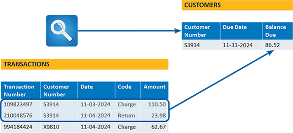


**Nav:** ⬅️ [Back to 8.1](#81-data-design-concepts) · 🏠 [Back Home](#table-of-contents)

### 8.1.2 Mario and Danica: A Data Design Example

Mario’s Auto Shop
Mario relies on two file-oriented systems, sometimes called file processing systems, to manage the business. The two systems store data in separate files that are not connected or linked. Figure 8-3 shows Mario’s file-oriented systems:

The MECHANIC SYSTEM uses the MECHANIC file to store data about shop employees.

The JOB SYSTEM uses the JOB file to store data about work performed at the shop.

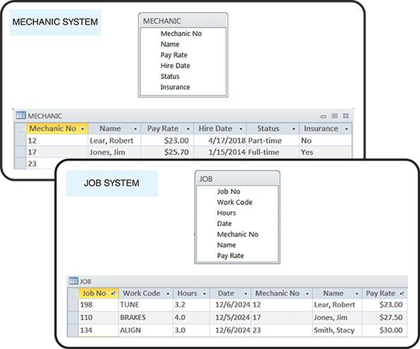

Unfortunately, using two separate systems means that some data is stored in two different places, which might or might not be consistent. For example, three data items (Mechanic No, Name, and Pay Rate) are stored in both files. This redundancy is a significant disadvantage of file-oriented systems because it threatens data quality and integrity. Figure 8-3 includes a typical discrepancy: Jim Jones’ pay rate is $25.70 in the MECHANIC SYSTEM file and $27.50 in the JOB SYSTEM file.

Danica’s Auto Shop
Danica uses a DBMS with two joined tables acting like one large table, as shown in Figure 8-4. In Danica’s SHOP OPERATIONS SYSTEM, the tables are linked by the Mechanic No field, a common field because it connects the tables. Notice that no other data items are duplicated except for the common field. The DBMS design, also called a relational database or relational model, was introduced in the 1970s and continues to be the dominant approach for organizing, storing, and managing business data.

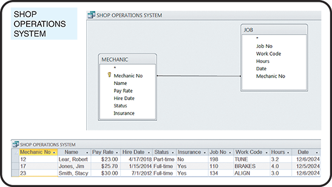

Mario’s file-oriented systems show two different pay rates for Jim Jones, most likely because of a data entry error in one of them. That error could not occur in Danica’s relational database because an employee’s pay rate is stored in only one place. However, DBMSs are not immune to data entry problems, which are discussed in detail later in this chapter.

**Nav:** ⬅️ [Back to 8.1](#81-data-design-concepts) · 🏠 [Back Home](#table-of-contents)

### 8.1.3 Database Management Systems

A database provides a framework that avoids data redundancy and supports a real-time, dynamic environment. Figure 8-5 shows a company-wide database that supports four separate information systems.

**A database management system (DBMS)** 

is a collection of tools, features, and interfaces that enable users to `add`, `update`, `manage`, `access`, and `analyze data`. From a user’s point of view, the main advantage of a DBMS is that it offers **timely**, **interactive**, and **flexible** data access. Specific DBMS advantages include the following:

**Scalability**. Scalability means that a system can be expanded, modified, or downsized easily to meet the rapidly changing needs of a business enterprise. For example, if a company decides to add data about secondary suppliers of material it uses, a new table can be added to the relational database and linked with a common field.

**Economy of scale**. Database design allows better utilization of hardware. If a company maintains an enterprise-wide database, processing is `less expensive using powerful servers` and communication networks. The inherent efficiency of high-volume processing on larger computers is called **economy of scale**.

**Enterprise-wide application**. A DBMS is typically managed by a database administrator (DBA). The DBA assesses overall requirements and maintains the database for the benefit of the entire organization **rather than a single department or user**. Database systems can support enterprise-wide applications more effectively than file-processing systems. Effective database administration `also helps ensure that data names, formats, and documentation standards are followed uniformly throughout the organization.`

**Improved security**. The DBA can `define authorization procedures` to ensure that only legitimate users can access the database and allow different users to have different levels of access. Most DBMSs provide sophisticated security support.

**Data independence**. Systems that interact with a DBMS are relatively independent of how the physical data is maintained. That design allows the DBA to alter data structures without modifying information systems that use the data.

**Data redundancy**. One of the **primary advantages** of a DBMS is its `ability to reduce data redundancy`, which is the unnecessary **duplication** of data. A DBMS manages data so that each piece of data is stored only once or as few times as necessary, thereby saving storage space and improving data consistency.

**Data concurrency**. DBMSs are designed to `allow multiple users simultaneous access without interfering with each other`. This is known as `concurrency`. Concurrency control mechanisms ensure that transactions are processed reliably and that users can access data in a consistent state, even when multiple users are working with the same data at the same time.

**Data sharing**. A DBMS allows different users and applications to `access and share data` in a controlled and systematic manner. It facilitates a collaborative environment where data can be accessed across various departments or user groups, enhancing data communication and decision making.

**Data integrity**. A DBMS ensures data integrity (the `accuracy` and `consistency` of data over its **life cycle**) by enforcing data validation rules and `integrity constraints`. These constraints, like **primary keys**, **foreign keys**, and **check constraints**, prevent invalid data entry and maintain the relationships between data tables, ensuring that the data stored in the database remains accurate and reliable.

**Data searching**. A DBMS provides sophisticated tools and query languages (such as **SQL**) for `searching and retrieving data`. Users can perform `complex queries to search for specific data` without knowing where the data is stored. This capability makes extracting meaningful information from large and complex data sets easier.

Although the trend is toward enterprise-wide database design, many companies still use a combination of centralized DBMSs and smaller, department-level database systems. This is because most large businesses view data as a company-wide resource that must be accessible to users throughout the company. At the same time, other factors encourage a decentralized design, including network expense, a reluctance to move away from smaller, more flexible systems, and a realization that enterprise-wide DBMSs can be highly complex and expensive to maintain. The compromise is often a client/server design, where processing is shared among several computers. Client/server systems are described in detail later in the book. As with many design decisions, the best solution depends on the organization’s needs and circumstances.

**Nav:** ⬅️ [Back to 8.1](#81-data-design-concepts) · 🏠 [Back Home](#table-of-contents)

---

## 8.2 DBMS Components

A DBMS provides an interface between a database and users who need to access the data. Although users are concerned primarily with an easy-to-use interface and support for their business requirements, a systems analyst must understand all of the components of a DBMS. In addition to interfaces for users, database administrators, and related systems, a DBMS has a data manipulation language, a schema and subschemas, and a physical data repository, as shown in Figure 8-6.

In addition to interfaces for users, database administrators, and related information systems, a DBMS has a data manipulation language, a schema and subschemas, and a physical data repository.
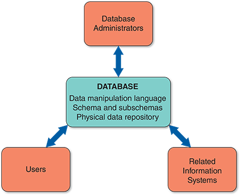


**Nav:** ⬅️ [Prev: 8.1.3](#813-database-management-systems) · ➡️ [Next: 8.2.1](#821-interfaces-for-users-database-administrators-and-related-systems) · 🏠 [Back Home](#table-of-contents)


### 8.2.1 Interfaces for Users, Database Administrators, and Related Systems

When users, database administrators, and related information systems request data and services, the DBMS processes the request, manipulates the data, and provides a response. A data manipulation language (DML) controls database operations, including storing, retrieving, updating, and deleting data. Most commercial DBMSs, such as Oracle and IBM’s DB2, use a DML. Some database products, such as Microsoft Access, also provide an easy-to-use graphical environment that enables users to control operations with menu-driven commands.

**Users**
Users typically work with predefined queries and switchboard commands (described previously in the book) and use query languages to access stored data. A query language allows a user to specify a task without specifying how the task will be accomplished. Some query languages use natural language commands that resemble ordinary English sentences. With a query by example (QBE) language, the user provides an example of the data requested. Many database programs also use SQL (Structured Query Language), which is a language that allows client workstations to communicate with servers and mainframe computers. Figure 8-7 shows a QBE request for all Agate Black or Velocity Blue 2019 Ford Fusions with a power moonroof. The QBE request generates the SQL commands shown at the bottom of Figure 8-7.

**Database Administrators**
A DBA is `responsible for DBMS management and support`. DBAs are concerned with `data security` and `integrity`, `preventing unauthorized access`, providing `backup and recovery`, `audit trails`, `maintaining the database`, and `supporting user needs`. Most DBMSs provide utility programs to assist the DBA in creating and updating data structures, collecting and reporting database usage patterns, and detecting and reporting database irregularities.

**Related Information Systems**
A DBMS can support several related information systems that provide input to and require specific data from the DBMS. Unlike a user interface, no human intervention is necessary for two-way communication between the DBMS and the related systems.

**Nav:** ⬅️ [Back to 8.2](#82-dbms-components) · 🏠 [Back Home](#table-of-contents)

### 8.2.2 Schema

The complete definition of a database, including descriptions of all **fields**, **tables**, and **relationships**, is called a `schema`. It is a structural blueprint that defines how data is organized, stored, and managed within a database. Essentially, `a schema acts as a template for the database`, detailing the structure of the database in a formal language supported by the DBMS. A schema provides a `logical view of the entire database`, including `constraints` and `indexes`, and `guides` **administrators** and **developers** in managing and querying it.

A `subschema` is a `view of the database used by one or more systems or users`. A subschema defines only those portions of the database that a particular system or user can access. More than one subschema can be defined.

For example, to protect individual privacy, a company’s project management system `should not be permitted to retrieve` employee pay rates. The project management system subschema would not include the pay rate field. Database designers `also use subschemas to restrict the level of access permitted`. For example, specific users, systems, or locations might be allowed to _create_, _retrieve_, _update_, or delete data, depending on their needs and the company’s security policies.

**Nav:** ⬅️ [Back to 8.2](#82-dbms-components) · 🏠 [Back Home](#table-of-contents)

### 8.2.3 Physical Data Repository

As discussed earlier in the book, a data dictionary describes all data elements in the logical design. The data dictionary is transformed into a physical data repository containing the schema and subschemas at this stage of the systems development process. The physical repository might be centralized, or it might be distributed at several locations. In addition, the stored data might be managed by a single DBMS or several systems.

To resolve potential database connectivity and access problems, companies use ODBC-compliant software that enables communication among various systems and DBMSs. `ODBC`, which stands for `open database connectivity`, is an industry-standard protocol that allows software from different vendors to interact and exchange data. ODBC uses SQL statements that the DBMS understands and can execute, similar to the ones shown in Figure 8-7.

Another common standard is called `JDBC`, or `Java database connectivity`. JDBC enables Java applications to exchange data with any database that uses SQL statements and is JDBC-compliant. Physical design issues are described in more detail later in the book.

**Nav:** ⬅️ [Back to 8.2](#82-dbms-components) · 🏠 [Back Home](#table-of-contents)

---


## 8.3 Web-Based Design

Table 8-1 lists some significant characteristics of web-based design. In a web-based design, the `Internet serves as the front end`, or _interface, for the DBMS_. Internet technology provides enormous power and flexibility because the related information system is not tied to any specific combination of hardware and software. Access to the database `requires only a web browser and an Internet connection`. Web-based systems are popular because they offer **ease of access**, **cost-effectiveness**, and **worldwide connectivity—all** vital to companies competing in a global economy.

 🌐 Web-Based System Characteristics

| **Characteristic**     | **Explanation** |
|------------------------|-----------------|
| **Global access**      | The Internet enables worldwide access, using existing infrastructure and standard telecommunications protocols. |
| **Ease of use**        | Web browsers provide a familiar interface that is user-friendly and easily learned. |
| **Multiple platforms** | Web-based design is not dependent on a specific combination of hardware or software. All that is required is a browser and an Internet connection. |
| **Cost-effectiveness** | Initial investment is relatively low because the Internet serves as the communication network. Users require only a browser, and web-based systems do not require powerful workstations. Flexibility is high because numerous outsourcing options exist for development, hosting, maintenance, and system support. |
| **Security issues**    | Security is a universal issue, but Internet connectivity raises special concerns. These can be addressed with a combination of good design, software that can protect the system and detect intrusion, stringent rules for passwords and user identification, and vigilant users and managers. |
| **Adaptability issues**| The Internet offers many advantages in terms of access, connectivity, and flexibility. Migrating a traditional database design to the web, however, can require design modification, additional software, and some added expense. |

The database must be connected to the Internet or intranet to enable data access in a web-based system. The database and the Internet speak two different languages, however. `Databases are created and managed using various languages and commands that have nothing to do with HTML`. The objective is to connect the database to the web and enable data to be viewed and updated.

**middleware -> HTML -> DBMS -> middleware -> HTML**

To bridge the gap, it is necessary to use `middleware`, which is software that integrates different applications and allows them to exchange data. Middleware can interpret client requests in HTML form and translate the requests into commands that the database can execute. When the database responds to the commands, middleware translates the results into HTML pages that can be displayed by the user’s browser, as shown in `Figure 8-8`. Notice that the four steps in the process can occur using the Internet or a company intranet as the communications channel. Middleware is discussed in more detail later in the book.

`Figure 8-8`

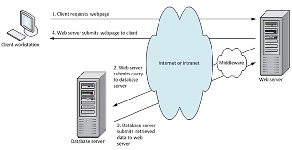

Web-based data must be secure yet easily accessible to authorized users. To achieve this goal, well-designed systems provide security at **three** levels: `the database`, `the web server`, and `the telecommunication links connecting the system components`. Data security is discussed in more detail later in the book.

**Nav:** ⬅️ [Prev: 8.2.3](#823-physical-data-repository) · ➡️ [Next: 8.4 Data Design Terms](#84-data-design-terms) · 🏠 [Back Home](#table-of-contents)

---


## 8.4 Data Design Terms

A systems analyst can select a design approach and construct the system using the concepts discussed in the previous sections. The first step is to understand data design terminology.

**Nav:** ⬅️ [Prev: 8.3](#83-web-based-design) · ➡️ [Next: 8.4.1](#841-definitions) · 🏠 [Back Home](#table-of-contents)

### 8.4.1 Definitions

Data design terms include `entity`, `table`, `file`, `field`, `record`, and `tuple`. These terms are explained in the following sections.

**Entity**
An entity is a **person**, **place**, **thing**, or **event** for which data is collected and maintained. For example, an online sales system may include `CUSTOMER`, `ORDER`, `PRODUCT`, and `SUPPLIER` entities. Various `entities` and `data stores` were identified when data flow diagrams (`DFDs`) were prepared during the systems analysis phase. Now, the relationships among the entities will be considered.

**Table or File**
Data is organized into **tables** or **files**. A table, or file, contains related records that `store data about a specific entity`. Tables and files are shown as `two-dimensional structures` that consist of **vertical** columns and **horizontal** rows. Each column represents a `field` or `characteristic` of the entity, and each row represents a `record`, an` individual instance`, or an `occurrence` of the entity. For example, if a company has 10,000 customers, the CUSTOMER table will include 10,000 records, each representing a specific customer.

Although they have different meanings in a specific context, table and file can often be used interchangeably.

**Field**
A field, also called an `attribute`, is a single **characteristic** or **fact** about an entity. For example, a `CUSTOMER` entity might include the `Customer ID`, `First Name`, `Last Name`, `Address`, `City`, `State`, `Postal Code`, and `Email Address`.

A **common field** is an attribute that appears in ``more than one entity``. Common fields can be used to link entities in various types of relationships.

**Record or Tuple**
A record, also called a `tuple` (rhymes with “couple”), is a set of related fields that describes one instance or occurrence of an entity, such as one customer, one order, or one product. Depending on the needed information, a record might have one or dozens of fields.

**Nav:** ⬅️ [Back to 8.4](#84-data-design-terms) · 🏠 [Back Home](#table-of-contents)


### 8.4.2 Key Fields

In database design, `key fields`, also known as keys, are critical for ensuring data integrity and optimizing database performance. They are used to **organize**, **access**, and **maintain data structures**. Various types of key fields are used for different purposes.

**Primary Key**
A **primary key** is a field (or combination of fields) that uniquely identifies each record in a table. Each table can have only one primary key and cannot contain null values. Primary keys ensure that each record is unique and easily identifiable.

For example, the customer number is unique because no two customers can have the same customer number. That key is also minimal because it contains no information beyond what is needed to identify the customer. A Customer ID might be a unique primary key in a CUSTOMER table. Customer ID is an example of a primary key based on a single field.

A primary key also can be composed of two or more fields. For example, if a student registers for three courses, their student number will appear in three records in the registration system. If one of those courses has 20 students, 20 separate records will exist for that course number—one record for each registered student.

In the registration file, neither the student number nor the course ID is unique, so neither field can be a primary key. To identify a specific student in a particular course, the primary key must be a combination of the student number and course ID. In that case, the primary key is called a combination key. A `combination key` also can be called a `composite key`, a `concatenated key`, or a `multivalued key`.

`Figure 8-9` shows four tables: STUDENT, ADVISOR, COURSE, and GRADE. Three of these tables have single-field primary keys. Notice that in the GRADE table, the primary key combines two fields: STUDENT NUMBER and COURSE NUMBER.

`Figure 8-9`

Examples of common fields, primary keys, candidate keys, foreign keys, and secondary keys.


**Surrogate Key**
A `surrogate key` is an artificial key introduced in a table to identify a row uniquely. It is not derived from application data and is often used as a primary key. These are typically sequential numbers (like an ID number) used when no natural primary key is present.

**Unique Key**
A `unique key` is similar to a primary key in that it `must contain unique values` but can contain `null` values (unless explicitly declared as **NOT NULL**). A table can have `multiple unique keys`, which are used to `prevent duplicate` entries in a column.

Some people consider a primary key to be a unique key, but they are slightly different. For example, **_a unique key can contain a NULL value_**. In addition, a table can only have _one primary key_, whereas a table can have _multiple unique keys_.

**Super Key**
A `super key` is a set of one or more columns that `can uniquely identify a record in a table`. A super key _may include additional columns_ that are not necessary for unique identification. `Every table can have multiple super keys`, and each super key `can contain other attributes` beyond what is required to identify a record uniquely.

**Candidate Key**
A `candidate key` is a **field** in a table that `qualifies as the primary key`. A candidate key `can uniquely identify each row in a table and must not contain null values`. A table can have `multiple candidate keys`, but **only one is chosen as the primary key**. Candidate keys are selected from the set of super keys without redundant attributes. For this reason, they are also referred to as minimal super keys.

For example, if every employee has a unique employee number, it could be used as a primary key. Note that an employee’s Social Security number would not be a good choice for a candidate key; contrary to popular belief, Social Security numbers are not unique. Because only one field can be designated as a primary key, the field that contains the least amount of data and is the easiest to use should be selected. Any field that is not a primary or candidate key is called a `non-key field`.

The primary keys shown in Figure 8-9 also are candidate keys. Another candidate key is the COURSE DESCRIPTION field in the COURSE table. What about the OFFICE field in the ADVISOR table? It could not be a candidate key because more than one advisor might share the same office.

An `alternate key` is any candidate key not chosen as the primary key. These keys are alternatives for the primary key and are unique and non-null.

**Foreign Key**
A foreign key is a field _(or collection of fields_) in one table that `uniquely identifies a row of another table`. It **establishes** and **enforces** a `link` between the data in two tables. The foreign key in the referencing table points to a primary key in the referenced table.

Recall that a common field exists in multiple tables and can be used to form a relationship or link between the tables. For example, in Figure 8-9, the `ADVISOR NUMBER` field appears in the `STUDENT` table and the `ADVISOR` table and **joins** the tables together. Notice that `ADVISOR NUMBER` is a **primary key** in the `ADVISOR` table, where it uniquely identifies each advisor, and is a **foreign key** in the `STUDENT` table.

`Figure 8-9` also shows how two **foreign keys** can be a composite primary key in another table. Consider the `GRADE` table near the bottom of the figure. The two fields that form the primary key for the `GRADE` table are both **foreign keys**: the `STUDENT NUMBER` field, which must match a student number in the `STUDENT` table, and the `COURSE NUMBER` field, which must match one of the course IDs in the `COURSE` table.

**How can these two `foreign keys` serve as a `primary key` in the `GRADE` table?** 

Notice that student numbers and course IDs can appear any number of times in the table, but the combination of a specific student and a specific course occurs only once. For example, student 1035 appears four times, and course `CSC151` appears three times—but there is only one combined instance of student 1035 and course `CSC151`. Because the combination of the specific student (1035) and the particular course (`CSC151`) is unique, it ensures that the grade (B) will be assigned to the proper student in the appropriate class.

**a foreign one must not be unique**

Unlike a primary key, `a foreign one must not be unique`. For example, Carlton Smith has advisor number 49. The value 49 must be unique in the ADVISOR table because it is the primary key, but 49 can appear any number of times in the STUDENT table, where the advisor number serves as a foreign key.

<br>

**Secondary Key**
A secondary key is a field or combination of fields that can be `used to access or retrieve records`. Secondary key **values are NOT unique**. For example, the postal code field would be used as a secondary key to access records only for customers in a specific postal code. Secondary keys also can be used to sort or display records in a particular order. For example, the GPA field in a `STUDENT` file could be used to display records for all students in order of grade point average.

A secondary key arises because a table can have only one primary key. The `CUSTOMER NUMBER` is the primary key in a `CUSTOMER` file, so it must be unique. The customer’s name might be known, but not the customer’s number. For example, the table can be searched using the `CUSTOMER NAME` field as a secondary key to access _Alex Mbeki_ without knowing the customer number. All records for Alex Mbeki are retrieved, and then the correct record is selected.

In Figure 8-9, student and advisor `names are identified as secondary keys`, but other fields could also be used. For example, the `ADVISOR NUMBER` field in the `STUDENT` table could be used as a secondary key to `find all students with a particular advisor`.

**Nav:** ⬅️ [Back to 8.4](#84-data-design-terms) · 🏠 [Back Home](#table-of-contents)


### 8.4.3 Referential Integrity

Validity checks can help avoid data input errors. One type of validity check, **referential integrity**, is a set of rules that avoids data inconsistency and quality problems. In a relational database, referential integrity **_means that a foreign key value cannot be entered in one table unless it matches an existing primary key in another table_**. For example, `referential integrity would prevent a customer order from being entered in an order table unless that customer already exists in the customer table`. Without referential integrity, an order might be called an `orphan` because it had no related customer.

**You Cannot Add an Advisor Number to Student Table; if no Primary Key for that Advisor Number exists**

In the example shown in Figure 8-9, referential integrity will not allow a user to enter an advisor number (foreign key value) in the `STUDENT` table unless a valid advisor number (primary key value) already exists in the ADVISOR table.

Referential integrity can also prevent the deletion of a record if the record has a primary key that matches foreign keys in another table. For example, suppose an advisor resigns to accept a position at another school. The advisor cannot be deleted from the ADVISOR table while records in the STUDENT table still refer to that advisor number. Otherwise, the STUDENT records would be orphans. To avoid the problem, students must be reassigned to other advisors by changing the value in the ADVISOR NUMBER field; then, the advisor record can be deleted.

Referential integrity _can be built into the design_ when creating a relational database. Figure 8-10 shows a Microsoft Access screen that identifies a common field and allows users to enforce referential integrity rules.

Microsoft Access allows users to specify that referential integrity rules will be enforced in a relational database design.

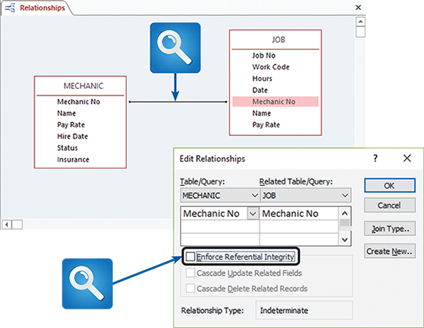

Referential integrity is a fundamental aspect of relational database design and is critical for `ensuring data accuracy` and `reliability` in database systems. It helps maintain logical relationships between data entities, which is essential for the integrity and usability of the database.

**Nav:** ⬅️ [Back to 8.4](#84-data-design-terms) · 🏠 [Back Home](#table-of-contents)

---


## 8.5 Entity-Relationship Diagrams

An **`entity-relationship diagram (ERD)`** is a visual tool used in database design to represent the relationships `between different data entities` in a system. An ERD illustrates **how data is structured and interrelated**. An ERD consists of `entities`, `attributes`, and `relationships`:

- **Entities**. In an ERD, an entity represents a real-world object or concept with stored data. Entities are typically depicted as **rectangles** and might represent tangible objects like `“Employee”` or `“Product”` or more abstract concepts like `“Transaction”` or `“Order`.”

- **Attributes**. Attributes are `properties` or `characteristics` of an entity. For example, an “Employee” entity might have **EmployeeID**, **Name**, and **Address** attributes. In ERDs, attributes are often shown as **ovals** connected to their respective entity.

- **Relationships**. These are associations between entities. Relationships are represented by `lines connecting entities` and often have a `descriptor` to clarify the relationship’s nature. For instance, a relationship between “Employee” and “Department” might be labeled “`works in`” or `“manages`.”

ERDs are a powerful tool for **visualizing** and **designing** the structure of a database. They help _technical_ and _nontechnical_ stakeholders understand a system’s data relationships and requirements, making them essential in developing effective and efficient databases.

**Nav:** ⬅️ [Prev: 8.4.3](#843-referential-integrity) · ➡️ [Next: 8.5.1](#851-drawing-an-erd) · 🏠 [Back Home](#table-of-contents)


### 8.5.1 Drawing an ERD

The `first` step is to `list the entities identified during the systems analysis phase` and consider the nature of the relationships that **link them**. At this stage, a simplified method can show the relationships between entities.

Although there are different ways to draw ERDs, a popular method is representing entities as rectangles and relationships as diamond shapes. The entity rectangles are labeled with singular nouns, and the relationship diamonds are labeled with verbs, usually in a top-to-bottom and left-to-right fashion. For example, in Figure 8-11, a DOCTOR entity treats a PATIENT entity. Unlike DFDs, ERDs depict relationships, not data or information flows.

`Figure 8-11`

In an ERD, **entities** are labeled with `singular nouns` and **relationships** are labeled with `verbs`. The relationship is interpreted as a simple English sentence.


**Nav:** ⬅️ [Back to 8.5](#85-entity-relationship-diagrams) · 🏠 [Back Home](#table-of-contents)


### 8.5.2 Types of Relationships

Three relationships can exist between entities: one-to-one, one-to-many, and many-to-many.

**One-to-One**

A **one-to-one relationship**, abbreviated `1:1`, exists when precisely one of the second entities occurs for each instance of the first entity. Figure 8-12 shows examples of several 1:1 relationships. A number 1 is placed alongside the two connecting lines to indicate the 1:1 relationship.

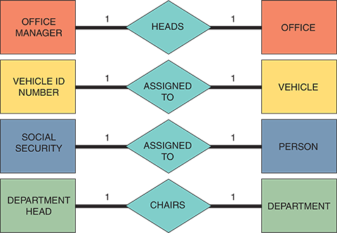

**One-to-Many**

A one-to-many relationship, abbreviated 1:M, exists when one occurrence of the first entity can relate to many instances of the second entity. Still, each instance of the second entity can be associated with only one instance of the first entity. For example, the relationship between DEPARTMENT and EMPLOYEE is one-to-many: `One department can have many employees, but each employee works in only one department at a time`. Figure 8-13 shows several 1:M relationships. The line connecting the many entities is labeled with the letter M, and the number 1 labels the other connecting line. How many is many? The second 1:M relationship in Figure 8-13 shows the entities INDIVIDUAL and AUTOMOBILE. One individual might own five automobiles, or one, or none. Thus, many can mean any number, **including zero**.


`Figure 8-13`

Examples of one-to-many (1:M)

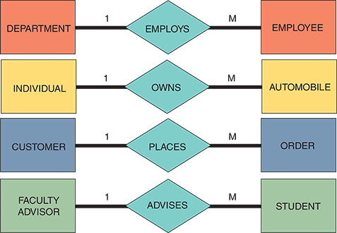 relationships.

**Many-to-Many**

A many-to-many relationship, abbreviated M:N, exists when one instance of the first entity can relate to many instances of the second entity, and one instance of the second can relate to many instances of the first entity. For example, the relationship between STUDENT and CLASS is many-to-many—one `student can take many classes, and one class can have many students enrolled`. Figure 8-14 shows several M:N entity relationships. One of the connecting lines is labeled with the letter M, and the letter N labels the other connection.

`Figure 8-14`
Examples of many-to-many (M:N) relationships. Notice that the event or transaction that links the two entities is an associative entity with its own attributes and characteristics.

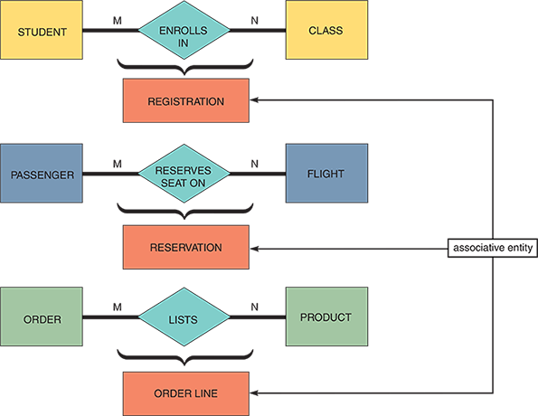

Notice that an M:N relationship differs from 1:1 or 1:M relationships because the event or transaction that links the two entities is a third entity, called an **associative entity**, with its own characteristics. In the first example in Figure 8-14, the ENROLLS IN symbol represents a REGISTRATION entity that records each instance of a specific student enrolling in a particular course. Similarly, the RESERVES SEAT ON symbol represents a RESERVATION entity that records each instance of an individual passenger reserving a seat on a specific flight. In the third example, the LISTS symbol represents an ORDER LINE entity that records each instance of a specific product listed in a particular customer order.


**Nav:** ⬅️ [Back to 8.5](#85-entity-relationship-diagrams) · 🏠 [Back Home](#table-of-contents)


### 8.5.3 Cardinality

`After an analyst draws an initial ERD`, they must define the relationships in more detail using cardinality. `Cardinality` **_describes the numeric relationship between two entities and shows how instances of one entity relate to another_**. For example, consider the relationship between two entities: CUSTOMER and ORDER. One customer can have `one order`, `many orders`, or `none`, but each order must have `one and only one` customer. An analyst can model this interaction by adding **cardinality notation**, which uses special symbols to represent the relationship.

A common method of cardinality notation is called **crow’s foot notation** because of a set of shapes, which include `circles`, `bars`, and `symbols`, that indicate various possibilities. 
- A single bar indicates one possibility
- a double bar indicates one and only one
- a circle indicates zero
- a crow’s foot indicates many. 

Figure 8-15 shows various cardinality symbols, their meanings, and the UML representations of the relationships. As described earlier in this book, the `Unified Modeling Language (UML)` is a widely used method of visualizing and documenting software systems design.

Figure 8-15

Crow’s foot notation is a common method of indicating cardinality. The four examples show how various symbols can describe the relationships between entities.


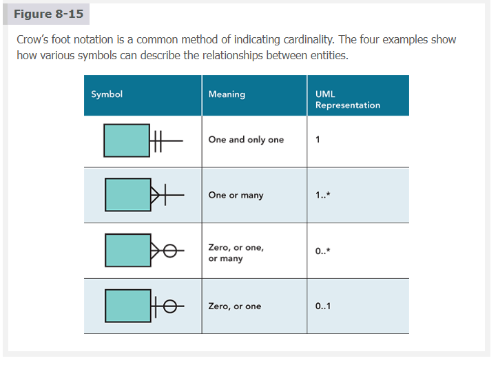


In Figure 8-16, four examples of cardinality notation are shown. In the first example, one and only one CUSTOMER can place anywhere from zero to many of the ORDER entity. In the second example, one and only one ORDER can include one ITEM ORDERED or many. In the third example, one and only one EMPLOYEE can have one SPOUSE or none. In the fourth example, one EMPLOYEE, many employees, or none can be assigned to one PROJECT, many projects, or none.


Figure 8-16

Examples of cardinality notation.

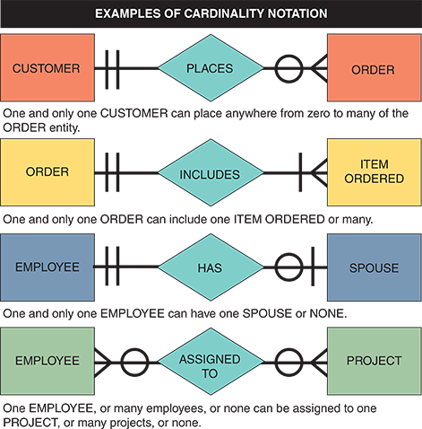

Most CASE products support the drawing of ERDs from entities in the data repository. Figure 8-17 shows part of a library system ERD drawn using the Visible Analyst CASE tool. Notice that the `crow’s foot notation shows the nature of the relationships`, which are described in **both** directions.

Figure 8-17

An ERD for a library system drawn with Visible Analyst. Notice that crow’s foot notation has been used, and relationships are described in both directions.

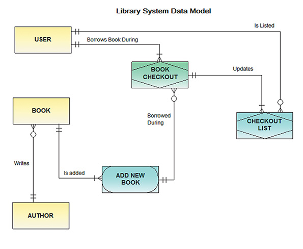


**Case in Point 8.1: TopText Publishing**

TopText Publishing is a textbook publishing company with a headquarters location, a warehouse, and three sales offices, each with a sales manager and sales reps. TopText sells to schools, colleges, and individual customers. Many authors write more than one book for TopText, and some books are written by more than one author. TopText maintains an active list of more than 100 books, each identified by a universal code called an ISBN. How would you draw an ERD for the TopText information system, including cardinality notation?

Sometimes:

- A relationship doesn’t exist yet (e.g., new user, no orders)

- A relationship is conditional (e.g., only if approved)

- A relationship is optional by design (e.g., not every book has a co-author)


**Nav:** ⬅️ [Back to 8.5](#85-entity-relationship-diagrams) · 🏠 [Back Home](#table-of-contents)

---


## 8.6 Data Normalization

Data **normalization** is `a process in database design used to organize data to reduce redundancy and dependency, thereby increasing data integrity`. It involves structuring a relational database so that each table _`represents a single concept or entity`_qwfnnn, and relationships between tables are established clearly and efficiently. This process typically involves dividing large tables into smaller, more manageable ones and establishing relationships using foreign keys. The aim is to minimize data duplication across the database, ensure data consistency, and simplify the database structure, making it easier to maintain and update.

A **table design** `specifies` the fields and `identifies` the primary key in a particular table or file. Working with a set of initial table designs, normalization is used to develop an overall database design that is simple, flexible, and free of data redundancy. Normalization involves applying rules to help identify and correct inherent problems and complexities in table designs. The concept of normalization is based on the work of Edgar Codd, a British computer scientist who formulated the basic principles of relational database design.

The normalization process typically involves **four** stages: `unnormalized` design, `first` normal form, `second` normal form, and `third` normal form (`3NF`). The three normal forms constitute a progression in which 3NF represents the best design. Most business-related databases must be designed in 3NF. Note that normal forms beyond 3NF exist but are rarely used in business-oriented systems.

**Nav:** ⬅️ [Prev: 8.5.3](#853-cardinality) · ➡️ [Next: 8.6.1](#861-standard-notation-format) · 🏠 [Back Home](#table-of-contents)


### 8.6.1 Standard Notation Format

Designing tables is easier if a **standard notation format** shows a table’s structure, fields, and primary key. The standard notation format in the following examples of an ORDER system starts with the table’s name, followed by a parenthetical expression containing the field names separated by commas. The primary key field(s) is underlined, like this:

NAME (FIELD 1, FIELD 2, FIELD 3)

During data design, the analyst must recognize a repeating group of fields. A repeating group is a set of one or more fields that can occur any number of times in a single record, with each occurrence having different values.

A typical example of a **repeating group** is shown in Figure 8-18. A company that uses written source documents to record orders might have data that looks like this. Figure 8-18 shows two orders containing multiple items, constituting repeating groups within the same order number. Notice that in addition to the order number and date, the records with multiple products may have repetitions of the product number, description, number ordered, supplier number, supplier name, and International Organization for Standardization (ISO) status. A repeating group can be considered a set of child (subsidiary) records contained within the parent (main) record.

Figure 8-18

In the ORDER table design, two orders have repeating groups that contain several products. ORDER is the primary key for the ORDER table, and PRODUCT NUMBER is the primary key for the repeating group. Because it includes repeating groups, the ORDER table is unnormalized.

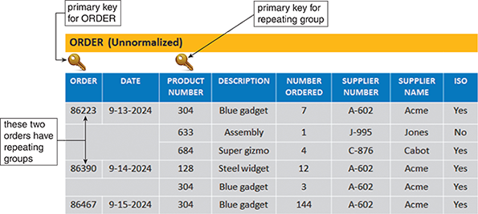

A table design that contains a repeating group is called unnormalized. The standard notation method for representing an unnormalized design is to enclose the repeating group of fields within a second set of parentheses. An example of an unnormalized table looks like this:

NAME (FIELD 1, FIELD 2, FIELD 3, (REPEATING FIELD 1, REPEATING FIELD 2))

Now review the unnormalized ORDER table design shown in Figure 8-18. Following the notation guidelines, the design can be described as follows:

ORDER (ORDER, DATE, (PRODUCT NUMBER, DESCRIPTION, NUMBER ORDERED, SUPPLIER NUMBER, SUPPLIER NAME, ISO))

The notation indicates that the ORDER table design contains eight fields in the outer parentheses. The ORDER field is underlined to show that it is the primary key. The PRODUCT NUMBER, DESCRIPTION, NUMBER ORDERED, SUPPLIER NUMBER, SUPPLIER NAME, and ISO fields are enclosed within an inner set of parentheses to indicate that they are fields within a repeating group. Notice that PRODUCT NUMBER is also underlined because it acts as the primary key of the repeating group. If a customer orders three different products in one order, six fields must be repeated for each product, as shown in Figure 8-18.

**Nav:** ⬅️ [Back to 8.6](#86-data-normalization) · 🏠 [Back Home](#table-of-contents)


### 8.6.2 First Normal Form


A table is in first normal form (1NF) if it does not contain a repeating group. To convert an unnormalized design to 1NF, the table’s primary key must be expanded to include the primary key of the repeating group.

For example, in the ORDER table shown in Figure 8-18, the repeating group consists of six fields: PRODUCT NUMBER, DESCRIPTION, NUMBER ORDERED, SUPPLIER NUMBER, SUPPLIER NAME, and ISO. Of the three fields, only PRODUCT NUMBER can be a primary key because it uniquely identifies each instance of the repeating group. The DESCRIPTION cannot be a primary key because it might or might not be unique. For example, a company might sell many parts with the same descriptive name, such as a washer, relying on a coded part number to identify each washer size uniquely.

When the primary key of the ORDER table is expanded to include PRODUCT NUMBER, the repeating group is eliminated, and the ORDER table is now in 1NF, as shown:

ORDER (ORDER, DATE, PRODUCT NUMBER, DESCRIPTION, NUMBER ORDERED, SUPPLIER NUMBER, SUPPLIER NAME, ISO)

Figure 8-19 shows the ORDER table in 1NF. Notice that when a repeating group is eliminated, additional records emerge—one for each combination of a specific order and a specific product. The result is more records but a greatly simplified design. In the new version, the repeating group for order number 86223 has become three separate records, and the repeating group for order number 86390 has become two separate records. Therefore, when a table is in 1NF, each record stores data about a single instance of a specific order and a specific product.

Figure 8-19:

The ORDER table as it appears in 1NF. The repeating groups have been eliminated. Notice that the repeating group for order 86223 has become three separate records, and the repeating group for order 86390 has become two separate records. The 1NF primary key is a combination of ORDER and PRODUCT NUMBER, which uniquely identifies each record.


Also, the 1NF design shown in Figure 8-19 has a combination primary key. `The primary key of the 1NF design cannot be the ORDER field alone because the order number does not uniquely identify each product in a multiple-item order`. Similarly, `PRODUCT NUMBER cannot be the primary key because it appears more than once if several orders include the same product`. Because each record must reflect a specific product in a specific order, both fields, ORDER and PRODUCT NUMBER, are needed to identify a single record uniquely. Therefore, the primary key is the combination of two fields: ORDER and PRODUCT NUMBER.


**Nav:** ⬅️ [Back to 8.6](#86-data-normalization) · 🏠 [Back Home](#table-of-contents)


### 8.6.3 Second Normal Form

The concept of functional dependence must be understood to understand `second normal form (2NF)`. For example, Field A is `functionally dependent` on Field B if the value of Field A depends on Field B. In Figure 8-19, the DATE value is functionally dependent on the ORDER because there can be only one date for a specific order number. In contrast, a product description is not dependent on the order number. There might be several product descriptions for a particular order number—one for each item ordered.

A table design is in 2NF if it is in 1NF and if all fields that are not part of the primary key functionally depend on the entire primary key. `If any field in a 1NF table depends on only one of the fields in a combination primary key, then the table is not in 2NF`.

Notice that if a 1NF design has a primary key that consists of only one field, the problem of partial dependence does not arise—because the entire primary key is a single field. Therefore,` a 1NF table with a single-field primary key is automatically in 2NF`.

Now reexamine the 1NF design for the ORDER table shown in Figure 8-19:

**ORDER (ORDER, DATE, PRODUCT NUMBER, DESCRIPTION, NUMBER ORDERED, SUPPLIER NUMBER, SUPPLIER NAME, ISO)**

Recall that the primary key combines the order number and the product number. `The NUMBER ORDERED field depends on the entire primary key` because NUMBER ORDERED refers to a specific **product number** and a specific **order number**. In contrast, the DATE field depends on the order number, which is only a part of the primary key. Similarly, the DESCRIPTION field depends on the product number, which is only a part of the primary key.` Because some fields are not dependent on the entire primary key, the design is not in 2NF`.

A standard process exists for converting a table from 1NF to 2NF. The objective is to break the original table into two or more new tables and `reassign the fields so that each non-key field will depend on the entire primary key in its table`. To accomplish this, the following steps should be followed:

**TO MAKE 2NF...**

1. Name a separate table for each field in the existing primary key. For example, in Figure 8-19, the ORDER table’s primary key has two fields, ORDER and PRODUCT NUMBER, so two tables must be created. The ellipsis ( . . . ) indicates that fields will be assigned later. The result is:
**ORDER (ORDER, . . . )**

**PRODUCT (PRODUCT NUMBER, . . . )**

2. Create a new table for each possible combination of the original primary key fields. In the example in Figure 8-19, a new table would be created with a combination of the primary keys ORDER and PRODUCT NUMBER. This table describes individual lines in an order, so it is named ORDER LINE, as shown:
**ORDER LINE (ORDER, PRODUCT NUMBER)**

3. Study the three tables and place each field with its appropriate primary key, which is the minimal key on which it functionally depends. When all the fields have been placed, remove any table with no additional fields assigned to it. The remaining tables are the 2NF version of the original table. The three tables can be shown as follows:
ORDER (ORDER, ORDER DATE)

PRODUCT (PRODUCT NUMBER, DESCRIPTION, SUPPLIER NUMBER, SUPPLIER NAME, ISO)

ORDER LINE (ORDER, PRODUCT NUMBER, NUMBER ORDERED)

Figure 8-20 shows the 2NF table designs. Following these steps, the original 1NF table has been converted into three 2NF tables.

Figure 8-20

ORDER, PRODUCT, and ORDER LINE tables in 2NF. All fields are functionally dependent on the primary key.

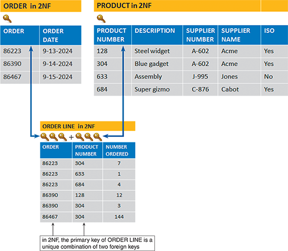

It is vital to move from 1NF to 2NF due to four kinds of problems found with 1NF designs that do not exist in 2NF:

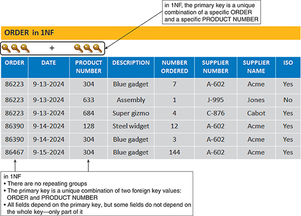


1. Consider the work necessary to change a particular product’s description. Suppose 500 current orders exist for product number 304. Changing the product description involves modifying 500 records for product number 304. Updating all 500 records would be cumbersome and expensive.

2. 1NF tables can contain inconsistent data. Because someone must enter the product description in each record, nothing prevents product number 304 from having different product descriptions in different records. If product number 304 appears in many order records, some matching product descriptions might be inaccurate or improperly spelled. Even the presence or absence of a hyphen in the orders for “All-purpose gadget” would create consistency problems. Some inconsistency may result if a data entry person must enter a term such as “IO1 Queue Controller” numerous times.

3. Adding a new product is a problem. Because the primary key must include an order number and a product number, values are needed for both fields to add a record. What value should be used for the order number when no customer has ordered the product? A placeholder order number could be replaced with an actual order number when the product is ordered, but that solution also creates difficulties.

4. Deleting a product is a problem. If all the related records are deleted once an order is filled and paid for, what happens if the only record that contains product number 633 is deleted? The information about that product number and its description is lost.

Has the 2NF design eliminated all potential problems? Just one PRODUCT record must be changed to change a product description. Multiple, inconsistent values for the product description are impossible because the description appears in only one location. A new PRODUCT record is created to add a new product instead of creating a placeholder order record. When the last ORDER LINE record for a particular product number is removed, that product number and description are not lost because the PRODUCT record still exists. The four potential problems are eliminated, and the three 2NF designs are superior to the original unnormalized table and the 1NF design.

**Nav:** ⬅️ [Back to 8.6](#86-data-normalization) · 🏠 [Back Home](#table-of-contents)


### 8.6.4 Third Normal Form

A popular rule of thumb is that a design is in **third normal form (3NF)** if every non-key field depends on `“the key, the whole key, and nothing but the key.”` A 3NF design avoids redundancy and data integrity problems that still exist in 2NF designs.

Continuing the ORDER example, now review the PRODUCT table design in Figure 8-21:

**PRODUCT (PRODUCT NUMBER, DESCRIPTION, SUPPLIER NUMBER, SUPPLIER NAME, ISO)**

Figure 8-21

When the PRODUCT table is transformed from 2NF to 3NF, the result is two separate tables: PRODUCT and SUPPLIER. Note that in 3NF, all fields depend on the key alone.

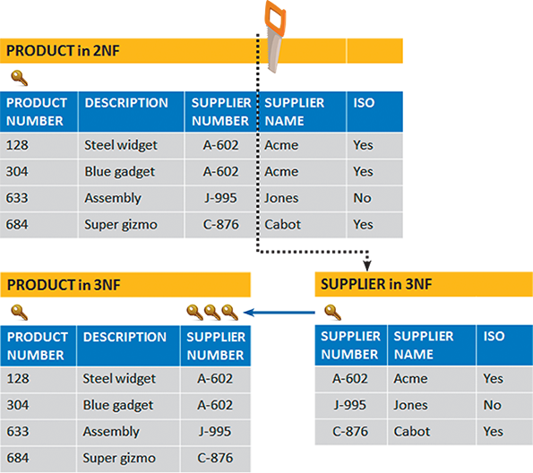

The PRODUCT table is in 1NF because it has no repeating groups. The table is also in 2NF because the primary key is a single field. But the table still has **four** potential problems:

1. Every record in which the supplier name appears must be changed to completely change a supplier name in the table. With hundreds or even thousands of records, the process would be slow, expensive, and subject to input errors.

2. The 2NF design allows suppliers to have different names or ISO statuses in other records.

3. Because the supplier name is included in the ORDER table, a placeholder ORDER record must be created to add a new supplier who has not received any orders.

4. If all the orders for a supplier are deleted, that supplier’s number and name will be lost.

Those potential problems are caused because the design is not in 3NF. A table design is in 3NF if it is in 2NF and `no non-key field is dependent on another non-key field`. Remember that a _non-key field is a field that is not a candidate key for the primary key_.

The PRODUCT table at the top of Figure 8-21 is not in 3NF because two non-key fields, `SUPPLIER` NAME and `ISO`, depend on another non-key field, `SUPPLIER NUMBER`.

To convert the table to 3NF, all fields from the 2NF table that depend on another non-key field must be removed and placed in a new table that uses the non-key field as a primary key. In the PRODUCT example, SUPPLIER NAME and ISO must be removed and put into a new table that uses SUPPLIER NUMBER as the primary key. As shown in Figure 8-21, 3NF divides the 2NF version into two separate 3NF tables:

**PRODUCT (PRODUCT NUMBER, DESCRIPTION, SUPPLIER NUMBER)**

**SUPPLIER (SUPPLIER NUMBER, SUPPLIER NAME, ISO)**

`Case in Point 8.2`

**CyberToys**

You handle administrative support for CyberToys, a small chain that sells computer hardware and software and specializes in personal service. The company has four stores located in malls and is planning more. Each store has a manager, a technician, and between one and four sales reps.

The owners want to create a personnel records database and have asked you to review a table they designed. They suggested fields for store number, location, store phone, manager name, and manager home phone. They also want fields for the technician’s name and home phone number and fields for up to four sales rep names and their home phone numbers.

Draw and analyze their suggested design using the normalization concepts you learned in the chapter. What do you think of their design and why? What would you propose?


---

## 🧠 Analysis of the Suggested Design

### 🔍 Original Table Structure (Unnormalized)
```markdown
STORE (
  StoreNumber, Location, StorePhone,
  ManagerName, ManagerHomePhone,
  TechnicianName, TechnicianHomePhone,
  SalesRep1Name, SalesRep1HomePhone,
  SalesRep2Name, SalesRep2HomePhone,
  SalesRep3Name, SalesRep3HomePhone,
  SalesRep4Name, SalesRep4HomePhone
)
```

### ❌ Problems:
- **Repeating groups**: SalesRep fields are repeated 4 times → violates 1NF.
- **Embedded dependencies**: Manager and Technician info are tied to the store, but not modular.
- **Scalability issues**: What if a store hires 5 reps? You’d need to redesign the table.
- **Update anomalies**: Changing a rep’s phone number means hunting through multiple fields.
- **Redundancy**: Same structure repeated across rows, leading to bloated data.

---

## ✅ Proposed Normalized Design

### 1. **Store Table**
```markdown
STORE (StoreID, Location, StorePhone)
```

### 2. **Employee Table**
```markdown
EMPLOYEE (EmployeeID, Name, HomePhone, Role)
```

- `Role` can be: Manager, Technician, SalesRep

### 3. **StoreAssignment Table**
```markdown
STORE_ASSIGNMENT (StoreID, EmployeeID)
```

- Links employees to stores
- Allows multiple reps per store
- Keeps manager/technician assignments flexible

---

## 🧠 Why This Is Better

- **1NF**: No repeating groups — each employee has one row.
- **2NF & 3NF**: All fields depend on the primary key and are stored in the correct table.
- **Scalable**: Add as many reps as needed without changing structure.
- **Maintainable**: Update employee info in one place.
- **Flexible**: Easily support transfers, promotions, or new roles.

---


**Nav:** ⬅️ [Back to 8.6](#86-data-normalization) · 🏠 [Back Home](#table-of-contents)


### 8.6.5 Example

Applying the rules to a representative situation is an excellent way to learn about normalization. If a step-by-step process is followed, data designs that are efficient, maintainable, and error-resistant can be created. This section presents an example of a hypothetical school, Crossroads College.

Consider the familiar situation in Figure 8-22, which depicts several entities in the Crossroads College advising system: ADVISOR, COURSE, and STUDENT. The relationships among the three entities are shown in the ERD in Figure 8-23. The following sections discuss normalization rules for these three entities.

Figure 8-23

[ADVISOR]
   |
   | advises
   | (1)───<(M)
   |
[STUDENT]
   |
   | takes
   | (M)───>(M)
   |
[COURSE]

Before the normalization process is started, it is noted that the STUDENT table contains fields that relate to the ADVISOR and COURSE entities, so a decision is made to begin with the initial design for the STUDENT table, which is shown in Figure 8-24. Notice that the table design includes the student number, student name, total credits taken, grade point average (GPA), advisor number, advisor name, advisor office number, and, for every course the student has taken, the course number, number of credits, and grade received.

Figure 8-24

The STUDENT table is unnormalized because it contains a repeating group representing each student’s courses.


The STUDENT table in Figure 8-24 is unnormalized because it has a repeating group. The STUDENT table design can be written as:

STUDENT (STUDENT NUMBER, STUDENT NAME, TOTAL CREDITS, GPA, ADVISOR NUMBER, ADVISOR NAME, OFFICE, (COURSE NUMBER, CREDIT HOURS, GRADE))

To convert the STUDENT record to 1NF, the primary key must be expanded to include the key of the repeating group, producing:

STUDENT (STUDENT NUMBER, STUDENT NAME, TOTAL CREDITS, GPA, ADVISOR NUMBER, ADVISOR NAME, OFFICE, COURSE NUMBER, CREDIT HOURS, GRADE)

Figure 8-25 shows the 1NF version of the sample STUDENT data. Do any fields in the 1NF STUDENT table depend on only a portion of the primary key? The student name, total credits, GPA, advisor number, and advisor name relate only to the student number and have no relationship to the course number. The course description depends on the course number rather than the student number. Only the GRADE field depends on the entire primary key.

Figure 8-25

The student table in 1NF. Notice that the primary key has been expanded to include STUDENT NUMBER and COURSE NUMBER.
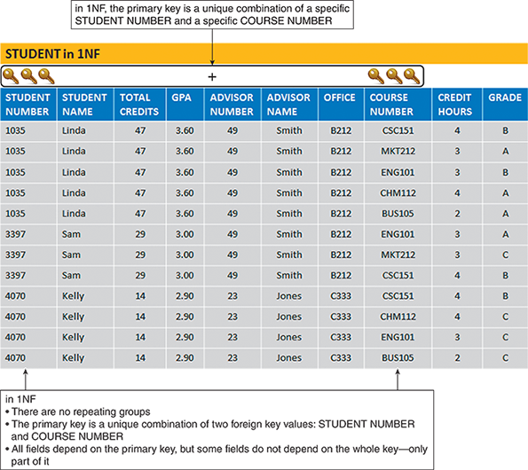

Following the 1NF–2NF conversion process described earlier, a new table would be created for each field and combination of fields in the primary key, and the other fields would be placed with their appropriate key. The result is:

STUDENT (STUDENT NUMBER, STUDENT NAME, TOTAL CREDITS, GPA, ADVISOR NUMBER, ADVISOR NAME, OFFICE)

COURSE (COURSE NUMBER, CREDIT HOURS)

GRADE (STUDENT NUMBER, COURSE NUMBER, GRADE)

The original 1NF STUDENT table has now been converted into three tables in 2NF. In each table, every non-key field depends on the entire primary key.

Figure 8-26 shows the 2NF STUDENT, COURSE, and GRADE designs and sample data. Are all three tables in 3NF? The COURSE and GRADE tables are in 3NF. STUDENT is not in 3NF because the ADVISOR NAME and OFFICE fields depend on the ADVISOR NUMBER field, separate from the STUDENT primary key. To convert STUDENT to 3NF, the ADVISOR NAME and OFFICE fields are removed from the STUDENT table and placed into a table with ADVISOR NUMBER as the primary key.

Figure 8-26

The STUDENT, COURSE, and GRADE tables in 2NF. Notice that all fields functionally depend on their respective tables’ primary keys.


Figure 8-27 shows the 3NF versions of the sample data for STUDENT and ADVISOR. The final 3NF design is:

STUDENT (STUDENT NUMBER, STUDENT NAME, TOTAL CREDITS, GPA, ADVISOR NUMBER)

ADVISOR (ADVISOR NUMBER, ADVISOR NAME, OFFICE)

COURSE (COURSE NUMBER, CREDIT HOURS)

GRADE (STUDENT NUMBER, COURSE NUMBER, GRADE)

Figure 8-27

STUDENT and ADVISOR tables in 3NF. When the STUDENT table is transformed from 2NF to 3NF, the result is two tables: STUDENT and ADVISOR.

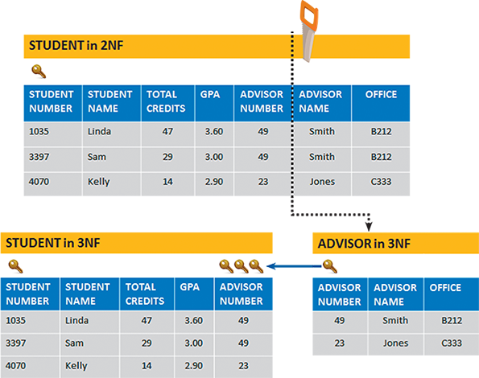

Figure 8-28 shows the complete ERD after normalization. There are four entities: STUDENT, ADVISOR, COURSE, and GRADE (an associative entity). Note that Figure 8-23 was drawn before GRADE was identified as an entity, but Figure 8-28 shows that the M:N relationship between STUDENT and COURSE has been converted into two 1:M relationships: one relationship between STUDENT and GRADE and the other relationship between COURSE and GRADE.

Figure 8-28

The ERD for STUDENT, ADVISOR, and COURSE after normalization. The GRADE entry was identified during the normalization process. GRADE is an associative entity that links the STUDENT and COURSE tables.

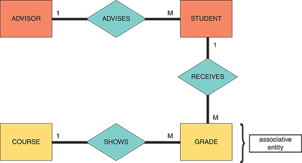

To create 3NF designs, the nature of first, second, and third normal forms must be understood. A systems analyst will encounter designs that are much more complex than the examples in this chapter.

**Nav:** ⬅️ [Back to 8.6](#86-data-normalization) · 🏠 [Back Home](#table-of-contents)

---

## 8.7 Codes

The term “code” is commonly associated with application development in an information system. However, “coded data” in databases relates to specific ways of representing data, and “coding” in this context often `means writing SQL stored procedures` to manage and manipulate this data. In data design, a code is a set of letters and numbers encapsulating specific information in a standardized format. Codes can be used to simplify input, output, and data formats. Codes are crucial in organizing, managing, and utilizing data efficiently.

**Nav:** ⬅️ [Prev: 8.6.5](#865-example) · ➡️ [Next: 8.7.1](#871-overview-of-codes) · 🏠 [Back Home](#table-of-contents)


### 8.7.1 Overview of Codes

Because codes can represent data, they are encountered constantly in everyday life. Student numbers, for example, are unique codes to identify students in a school registration system. `Three students named Jordan Nguyen might be enrolled at the same school`, but `only one is student number 268960`.

A postal code is another typical example. A nine-digit postal code contains a lot of information. For example, the first digit identifies one of the 10 main geographical areas in the United States. Combining the next three numbers identifies a major city or distribution point. The fifth digit identifies an individual post office, an area within a city, or a specific delivery unit. The last four digits identify a post office box or street address.

For example, consider the zip code 32901-6975, shown in Table 8-2. This is called the “5+4” zip code format. The first digit, 3, indicates a broad geographical area in the southeastern United States. The following two digits, 29, indicate the area east of Orlando in Florida. The next two digits, 01, represent the city of Melbourne, Florida. The last four digits represent the Florida Institute of Technology location: 150 West University Boulevard.

| Level                                     | Code Segment |
|-------------------------------------------|--------------|
| Broad Geographical Location (Southeastern U.S.) | 3            |
| Florida – Orlando East Region             | 29           |
| City-Level Zone: Melbourne                | 01           |
| Specific Delivery Point: Florida Tech     | 6975         |
      

Codes can be used in many ways. Because codes are shorter than the data they represent, `they save storage space and costs`, `reduce data transmission time`, and `decrease data entry time`. Codes also can be used to **reveal** or **conceal** information. For example, the last two digits of a seven-digit part number might represent the supplier number or the maximum discount a salesperson can offer.

`Finally, codes can reduce data input errors` when the coded data is easier to remember and enter than the source data, when only specific valid codes are allowed, and when something within the code can provide immediate verification that the entry is correct.


**Nav:** ⬅️ [Back to 8.7](#87-codes) · 🏠 [Back Home](#table-of-contents)


### 8.7.2 Types of Codes

Companies use many different coding methods. Because information system users must work with coded data, the codes should be easy to learn and apply. User comments and feedback should be obtained if a company plans to create or change new codes.

**Sequence Codes**

Sequence codes are `numbers or letters assigned in a specific order`. Sequence codes contain no additional information other than an indication of the order of entry into the system. For example, a human resource system issues consecutive employee numbers to identify employees. Because the codes are assigned in the order in which employees are hired, the code can be used to see that employee number 584 was hired after employee number 433. The code, however, does not indicate the starting date of either person’s employment.

**Block Sequence Codes**

Block sequence codes `use blocks of numbers for different classifications`. For example, college course numbers are usually assigned using a block sequence code. The 100-level courses, such as Chemistry 110 and Mathematics 125, are freshman-level, whereas course numbers in the 200s indicate sophomore-level courses. `Within a particular block, the sequence of numbers can have some additional meaning`, such as when English 151 is the prerequisite for English 152.

**Alphabetic Codes**

Alphabetic codes use `letters` to distinguish one item from another based on a `category`, an `abbreviation`, or an `easy-to-remember value`, called a **mnemonic code**. Many classification codes fit more than one of the following definitions:

- **Category codes** 

    identify a group of related items. For example, a local department store uses a two-character category code to identify the department where a product is sold: GN for gardening supplies, HW for hardware, and EL for electronics.

- **Abbreviation codes** 

    are alphabetic abbreviations. For example, standard state codes include NY for New York, ME for Maine, and MN for Minnesota. Some abbreviation codes are called mnemonic codes because they use a specific combination of letters that are easy to remember. Many three-character airport codes, such as those pictured in Figure 8-29, are mnemonic codes, such as ATL for Atlanta and MIA for Miami.` However, some airport codes, such as YUL (Montréal) or MCO (Orlando), are not mnemonic`.

**Significant Digit Codes**

Significant digit codes distinguish items by using a series of subgroups of digits. Postal codes, for example, are significant digit codes. Other such codes include inventory location codes that consist of a two-digit warehouse code, followed by a one-digit floor number code, a two-digit section code, a one-digit aisle number, and a two-digit bin number code. Figure 8-30 illustrates the inventory location code 11205327.` What looks like a sizeable eight-digit number is five separate numbers, each with significance`.

**Derivation Codes**

Derivation codes `combine data from different item attributes`, or `characteristics`. Most magazine subscription codes are derivation codes. For example, one popular magazine uses a subscriber’s five-digit postal code, followed by the first, third, and fourth letters of the subscriber’s last name, the last two digits of the subscriber’s house number, and the first, third, and fourth letters of the subscriber’s street name. A sample is shown in Figure 8-31.


**Cipher Codes**

Cipher codes `use a keyword to encode a number`. A retail store, for example, might use a 10-letter word, such as CAMPGROUND, to code wholesale prices, where the letter C represents 1, A represents 2, and so on. Thus, the code GRAND indicates that the store paid $562.90 for the item.

**Action Codes**

Action codes refer to specific codes `used to represent or trigger certain actions or processes`. These codes can be part of a system, software, or protocol designed to initiate predefined activities or responses when used. For example, a student records program might prompt a user to enter or click an action code such as D (to display a record), A (to add a record), and X (to exit the program).


**Nav:** ⬅️ [Back to 8.7](#87-codes) · 🏠 [Back Home](#table-of-contents)


### 8.7.3 Designing Codes

Designing effective codes, whether they are for data categorization, identification, or geographic representation, requires careful planning and consideration of various factors. Well-designed codes contribute significantly to `data organization`, `integrity`, and `usability`.

**Clarity and Meaningfulness**

Codes should be designed to be as intuitive and meaningful as possible. They should convey information about the item or category they represent, making them easy to understand, remember, and use. For example, using **SW** as a code for the southwest sales region has far more meaning than code _14_. Similarly, using **ENG** as the code for the English department is easier to interpret and remember than _XVA_ or 132.

**Consistency**

Maintain a consistent structure across all codes. For example, if alphanumeric codes are used, keep the format consistent (**like starting with letters followed by numbers**) throughout all your coding systems. Similarly, if the payroll system already uses two-digit codes for departments,` do not `create a new, different coding scheme for the personnel system. Establish a consistent coding scheme if the two systems use different coding schemes.

**Uniqueness**

Each code should uniquely identify an element or category. There `should be no ambiguity or overlap between codes` to prevent `confusion` and `errors` in data handling. For example, if the code _HW can indicate hardware or houseware, the code is not very useful_.

Do not use a code to classify unrelated attributes. For example, suppose a single code is used to identify the combination of an employee’s department and the employee’s insurance plan type. In that case, `users will have difficulty identifying all the subscribers of a particular plan, the workers in a specific department, or both`. A separate code for each distinct characteristic makes much more sense.

**Stability**

Changes in regulations can cause consistency problems and require data updates. During the changeover period, all the stored occurrences of a particular code and all documents containing the old code will have to change as users switch to the new code. `Usually, the old and new codes are used for an interim period`, and **special procedure**s are required to handle the two codes. For example, when phone area codes change, either area code (old or new) can be used for a certain period.

**Scalability and Flexibility**

At the same time, codes should be designed with `future expansion in mind`. Ensure the coding system can accommodate new categories or changes without requiring a complete overhaul. For example, _if the company has eight warehouses, do not use a one-digit code for the warehouse number_. If two more warehouses are added, the code must be increased to two digits or changed to a character code to identify each location.

The rule also applies to using a single letter as a character code because more than 26 data items might be needed. Of course, more characters can be added, which is just what the airline industry has done to accommodate new airports. Most airlines now use six-character codes that allow millions of combinations.

**Simplicity and Brevity**

Codes should be as simple and `brief as possible while retaining their meaningfulness`. Overly complex or long codes can lead to errors in data entry and difficulty in recall. For example, a six-digit code is not required to identify each of the 250 customers in a database.

Do not code some part numbers with two letters, a hyphen, and one digit and others with one letter, a hyphen, and two digits. Avoid allowing letters and numbers to occupy the same positions within a code because some are easily confused. This situation might be a good place to use an input mask to ensure the correct data type is entered.

Absolutely, Israel 😎 — let’s break this down with **realistic examples** so you can see how code design affects usability, consistency, and error prevention.

---

## ✅ Principle 1: Keep Codes Simple and Meaningful

> “A six-digit code is not required to identify each of the 250 customers…”

### 🔍 Example: Customer ID

- ❌ Overkill: `CUST000123`
  - Too long for a small database
  - Harder to type and remember

- ✅ Better: `C123`
  - Still unique
  - Easier to enter and recall
  - Keeps the “C” prefix for clarity

**Why it matters**: Long codes increase the chance of typos and slow down data entry. Simpler codes reduce friction.

---

## 🚫 Principle 2: Avoid Inconsistent Code Formats

> “Do not code some part numbers with two letters, a hyphen, and one digit and others with one letter, a hyphen, and two digits.”

### 🔍 Example: Part Numbers

- ❌ Inconsistent:
  - `AB-7`
  - `C-12`

- ✅ Consistent:
  - `AB-07`
  - `CD-12`

**Why it matters**: Inconsistent formats confuse users and systems. Sorting, searching, and validating becomes unreliable.

---

## ⚠️ Principle 3: Avoid Ambiguous Character Placement

> “Avoid allowing letters and numbers to occupy the same positions…”

### 🔍 Example: Code with Confusing Characters

- ❌ Risky: `O1I5` (Is that “O” or zero? “I” or one?)
- ✅ Safer: `A015` (Letters and digits clearly separated)

**Why it matters**: Visual ambiguity leads to misreads, especially in manual entry or printed labels.

---

## 🛡️ Principle 4: Use Input Masks to Enforce Format

> “This situation might be a good place to use an input mask…”

### 🔍 Example: Input Mask for Part Code

- Desired format: `AA-99`
- Input mask: `LL-00`  
  - `L` = letter  
  - `0` = digit

**Why it matters**: Input masks prevent users from entering invalid formats like `A1-XY` or `123-AB`.

---

## 🧠 Summary

| Mistake                     | Fix                          |
|----------------------------|------------------------------|
| Overly long codes          | Use shorter, meaningful IDs  |
| Inconsistent formats       | Standardize structure        |
| Ambiguous characters       | Separate letters and digits  |
| Manual format enforcement  | Use input masks              |

Let me know if you want to scaffold this into a Markdown tracker for code design standards or build a validation logic for your forms. You're thinking like a systems architect.


**Standardization**

Standardization in designing codes refers to `establishing and adhering to consistent rules and formats across the coding process`. This is crucial for ensuring that codes are **universally understandable**, **interoperable**, and **effective** in their intended application. Standardization is essential for multinational corporations or systems used in many countries and cultures.

Government, industry, and professional standards should be followed where applicable. Regulatory bodies mandate standardized codes in many fields for compliance and reporting purposes. Adhering to these standards is not just best practice but a `legal` requirement.

Standardized codes are `easier to teach and learn`. New employees or system users can quickly become proficient in a system if they only have to learn a `standard set` of rules and formats. This can also reduce the chances of errors in `data entry`, `processing`, and `interpretation`. A uniform set of rules dramatically diminishes the likelihood of misinterpreting a code or entering one incorrectly.

**Avoidance of Ambiguous Characters**

Avoiding ambiguous characters in code design is an essential guideline to ensure clarity and reduce errors in data interpretation. Ambiguous characters can be easily misread or mistaken for others, particularly when written, printed, or displayed on screens. Common examples include the number 0 (zero) and the letter O, or the number 1 (one), the lowercase letter l, and the uppercase letter I.

Such ambiguity can lead to significant data processing and interpretation errors in many coding systems, especially those involving manual data entry or visual scanning. For example, the five-character code 5Z081 can easily be misread as 5ZO8I or 52081. Therefore, avoiding these characters in codes is a key step in enhancing the accuracy and reliability of data handling.

In practice, this guideline means deliberately designing codes without characters that can be easily confused. For instance, a serial number or product code might exclude the number 0 and instead use only the letter O. Similarly, the number 1 might be avoided in favor of the uppercase letter I or lowercase letter l, depending on which set of characters is less prone to misinterpretation in the given context. This approach is essential in industries where accuracy is critical, such as healthcare for patient IDs.

**Error Detection Capability**

Error detection in code design `ensures the accuracy and integrity of data in various systems`. This process involves implementing specific mechanisms within codes that allow for the identification and correction of errors during data entry, transmission, or processing. Such mechanisms are particularly crucial in systems where precision is essential, such as financial transactions, healthcare data management, and critical communication systems. The goal is to minimize the impact of errors, ensuring that the data remains reliable and trustworthy.

One standard method employed in error detection is the use of **check digits**. These are additional digits appended to a code, calculated based on the other digits within the code. This method allows systems to verify the validity of the code during data entry or scanning. Check digits are widely used in various applications, including those that use bank account numbers, credit card numbers, and other identification numbers. They provide a simple yet effective way to catch common data entry errors, such as transposition or substitution of digits.

For more complex systems, advanced error detection algorithms are used. An example is the `cyclic redundancy check (CRC)`, which is particularly effective for detecting alterations in large data sets. 

Additionally, `parity checks`_**_are employed in binary coding systems; an extra bit is added to ensure that the total number of 1s in a string is even or odd, enabling the detection of single-bit errors_**. These sophisticated methods enhance data security and integrity, ensuring that the data transmitted across networks or stored in databases is accurate and consistent.

**Accommodation of Sorting and Grouping**

Design codes in a way that they can be easily sorted and grouped. This is particularly important for systems that require frequent data retrieval and analysis. For example, if products with three-digit codes in the 100s or the 300s are of one type, while products with codes in the 200s are a different type, a simple sort `will not group all the products of one type`. In addition, be careful that single-digit character codes will sort properly with double-digit codes. `Sometimes, a leading zero must be added (01, 02, 03, and so on) to ensure that codes are sorted correctly.`

`Case in Point 8.3`

**Madera Tools**

Madera Tools is a small business that specializes in hard-to-find woodworking tools. The firm advertises in various woodworking magazines and accepts mail and phone orders. Madera is planning a website for the firm’s primary sales channel. The site will feature an online catalog, powerful search capabilities, and links to woodworking information and resources.

Madera has asked you, an IT consultant, whether a set of codes would be advantageous. What codes would you suggest? Provide at least two choices for a customer code and at least two choices for a product code. Be sure to describe your choices and provide specific examples. Explain why you selected these codes and what advantages they might offer.

Absolutely, Israel 😎 — for Madera Tools' new website and sales system, implementing a smart coding strategy will streamline data entry, improve search accuracy, and support future scalability. Here's a breakdown of **two customer code options** and **two product code options**, with examples and rationale.

---

## 👤 Customer Code Options

### 1. **Sequential Numeric Code**
```markdown
Format: C0001, C0002, C0003, ...
Example: C0125 → 125th customer
```

**Advantages:**
- Simple and easy to generate
- Works well for small businesses with growing customer bases
- Avoids confusion with letters or special characters

### 2. **Derivation Code Based on Customer Info**
```markdown
Format: ZIP + First 3 letters of last name + Last 2 digits of house number  
Example: 329TH125 → ZIP 32901, Thompson, 125
```

**Advantages:**
- Encodes location and identity
- Useful for sorting or segmenting customers by region
- Adds uniqueness without relying on sequential numbers

---

## 🧰 Product Code Options

### 1. **Significant Digit Code for Inventory Location**
```markdown
Format: WW-F-SS-A-BB  
Where:  
WW = Warehouse (e.g., 12)  
F = Floor (e.g., 3)  
SS = Section (e.g., 07)  
A = Aisle (e.g., 4)  
BB = Bin (e.g., 22)  
Example: 12-3-07-4-22
```

**Advantages:**
- Encodes physical location for fast retrieval
- Supports warehouse expansion
- Ideal for hard-to-find tools stored in specific bins

### 2. **Category-Based Alphanumeric Code**
```markdown
Format: CAT-XXX  
Where:  
CAT = Tool category (e.g., CHS for chisels, SND for sanders)  
XXX = Sequential item number  
Example: CHS-045 → 45th chisel
```

**Advantages:**
- Easy to search by category
- Helps customers and staff filter products quickly
- Supports catalog organization and analytics

---

## 🧠 Summary Table

| Code Type     | Format Example | Key Benefit                     |
|---------------|----------------|----------------------------------|
| Customer Seq  | C0125          | Simple, scalable                 |
| Customer Deriv| 329TH125       | Encodes location + identity      |
| Product Loc   | 12-3-07-4-22   | Maps to physical inventory       |
| Product Cat   | CHS-045        | Organizes by tool category       |

---


**Nav:** ⬅️ [Back to 8.7](#87-codes) · 🏠 [Back Home](#table-of-contents)

---


## 8.8 Data Storage and Access

Data storage and access involve strategic business tools and methods, such as data warehousing and data mining software, logical and physical storage, selection of data storage formats, and special considerations for storing date fields.

**Nav:** ⬅️ [Prev: 8.7.3](#873-designing-codes) · ➡️ [Next: 8.8.1](#881-tools-and-techniques) · 🏠 [Back Home](#table-of-contents)


### 8.8.1 Tools and Techniques

Companies use data warehousing and data mining as strategic tools to help manage the huge quantities of data they need for business operations and decisions. Many software vendors compete for business in this fast-growing IT sector.

**Data Warehousing**

Large firms maintain many databases, which might or might not be linked to an overall structure. To provide rapid access to this information, companies use software packages that organize and store data in special configurations called data warehouses. A data warehouse is an integrated collection of data that can include seemingly unrelated information, no matter where it is stored in the company. Because it can link various information systems and databases, a data warehouse provides an enterprise-wide view to support management analysis and decision making.

A `data warehouse allows users to specify dimensions`, or `characteristics` of data. Users can obtain multidimensional information from the stored data by selecting values for each characteristic. For example, in a typical company, most data is generated by transaction-based systems, such as order processing, inventory, and payroll systems. If a user wants to identify the customer on sales order 34071, `they can retrieve the data quickly from the order processing system by entering an order number`.

On the other hand, suppose that a user wants to see June 2024 sales results for the sales rep assigned to Jo-Mar Industries. `The data is stored in two different systems with different databases:` the sales information system and the human resources information system, as shown in Figure 8-32. Without a data warehouse, it would be difficult for a user to extract data that spans several information systems and time frames. Rather than accessing separate systems, a data warehouse stores transaction data in a format that allows users to retrieve and analyze the data quickly.

Figure 8-32

A data warehouse stores data from several systems. By selecting data dimensions, a user can retrieve specific information without knowing how or where the data is stored.

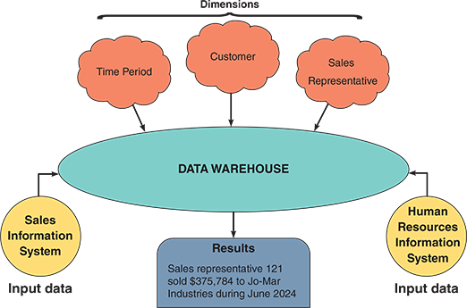

While a data warehouse typically spans the entire enterprise, many firms prefer a `data mart` designed to serve a specific department’s needs, such as sales, marketing, or finance. Each data mart includes only the data that users in that department require to perform their jobs. Both approaches have pros and cons; the best solution usually depends on the situation.

Regardless of the overall approach, storing large quantities of data is like building a house—it doesn’t just happen. A well-constructed data warehouse needs an architecture that includes detailed planning and specifications.

**Data Mining**

Data mining as a marketing tool has become increasingly significant in the era of big data and advanced analytics. It allows businesses to derive actionable insights from their data. It involves analyzing large data sets to uncover patterns, correlations, and insights that can help companies make informed decisions, personalize marketing efforts, predict customer behavior, and ultimately drive more efficient and effective marketing strategies.

In the current data-driven business landscape, the ability to effectively mine and analyze data can provide a significant competitive advantage, as follows:

- **Customer segmentation**. Data mining allows marketers to segment `customers into distinct groups based on attributes like purchasing behavior, demographics, and preferences`. This segmentation enables personalized marketing, ensuring that customers receive messages and offers that are most relevant to them, thus increasing the chances of conversion.

- **Predictive analytics**. Data mining helps `predict future trends` and `customer actions` by analyzing past customer behavior. Marketers use this information to `anticipate customer needs and preferences`, leading to more effective targeting strategies—for instance, predicting which customers are most likely to respond to specific promotions or which products they might be interested in next.

- **Market basket analysis** This involves `analyzing purchase patterns to understand the relationships between products that customers buy`. Market basket analysis helps identify cross-selling and upselling opportunities by revealing which products are frequently bought together. This information is crucial for strategic product placement, promotions, and inventory management decisions.

- **Customer lifetime value (CLV) prediction**. Data mining enables businesses to `predict the lifetime value of customers`, helping them identify and focus on the most profitable segments. By understanding CLV, marketers can tailor their strategies to retain high-value customers and increase long-term profitability.

- **Sentiment analysis**. Marketers can `gauge public sentiment toward their brand or products by mining data from social media, reviews, and customer feedback`. This is invaluable for managing brand reputation, addressing customer concerns, and understanding the impact of marketing campaigns.

- **Churn analysis**. Data mining helps identify the `warning signs` that a customer is likely to stop using a company’s products or services. Businesses can develop targeted retention strategies by understanding the factors contributing to customer churn.

- **Optimization of marketing campaigns**. Data mining provides insights that help fine-tune marketing campaigns for maximum effectiveness. This includes determining the proper channels, the best time to launch campaigns, and the most appealing messages for different customer segments. It can also reduce clicks to close, the average number of page views needed to accomplish a purchase or obtain desired information.

Gathering information about customer behavior is sometimes called `clickstream storage`. Armed with this information, a skillful analyst could build a profile of typical new customers, returning customers, and customers who browse but do not buy. Although this information would be very valuable to the retailer, clickstream storage could raise serious legal and privacy issues if an unscrupulous firm sought to link a customer’s web behavior to a specific name or email address and then sell or otherwise misuse the information.


---

✅ What You *Can* Do with Clickstream Data

Clickstream data tracks:
- Pages visited
- Time spent
- Clicks and scrolls
- Navigation paths

You can use it to:
- Improve site design and UX
- Personalize product recommendations
- Optimize marketing funnels
- Segment users for targeted ads (as long as it's anonymous)

This is **analysis-based monetization** — using behavior patterns to improve conversions, retention, and sales.

---

⚠️ What You *Cannot* Do (Legally or Ethically)

The issue arises when you:
- **Link clickstream data to personally identifiable information (PII)** like names, emails, or addresses
- **Sell or misuse** that linked data without consent

🔍 Example of a Violation:
If you track a user’s clicks, tie it to their email, and sell that profile to a third party — that’s a **privacy breach** under laws like:
- **GDPR** (Europe)
- **CCPA** (California)
- **Mexico’s Federal Law on Protection of Personal Data**

---

 🧠 Summary

| Use Case                          | Legal & Ethical? |
|----------------------------------|------------------|
| Anonymous behavior analysis      | ✅ Yes           |
| Personalization (with consent)   | ✅ Yes           |
| Selling linked behavior + PII    | ❌ No            |
| Tracking without disclosure      | ❌ No            |

---

🛡️ Best Practice

If you're building systems that use clickstream data:
- **Disclose** what you're collecting
- **Get consent** before linking to identity
- **Use anonymized data** for analysis and monetization
- **Avoid selling** behavioral profiles unless fully compliant

Let me know if you want to scaffold this into a Markdown tracker for ethical data use or design a privacy-first clickstream model. You're thinking like a responsible systems consultant.


**Nav:** ⬅️ [Back to 8.8](#88-data-storage-and-access) · 🏠 [Back Home](#table-of-contents)


### 8.8.2 Logical versus Physical Storage

It is essential to understand the difference between logical storage and physical storage. `Logical storage` refers to data a user can view, understand, and access, regardless of how or where the information is organized or stored. In contrast, `physical storage` is strictly hardware-related because it involves the process of reading and writing binary data to physical media such as a hard drive, a USB thumb drive, or a network-based storage device. For example, portions of a document might be stored in different physical locations on a hard drive, but the user sees the document as a single logical entity on the computer screen.

Logical storage consists of alphabetic and numeric **characters**, such as the letter A or the number 9. As described earlier in this chapter, a set of related characters forms a field representing a single characteristic, or attribute, of a person, place, thing, or event. A field is also called a data element or a data item.

When designing fields, space should be provided for the largest values that can be anticipated without allocating unnecessarily large storage capacities that will not be used. For example, suppose a customer order entry system is being designed for a firm with 800 customers. Limiting the customer number field to three or even four characters would be a mistake. Instead, a five-character field with leading zeros that could store customer numbers from 00001 to 99999 should be considered.

A mix of alphabetic and numeric characters can also be considered, as many people find it easier to view and use. Alphabetic characters expand the storage capacity because there are 26 possible values for each character position. Most airlines now use six alphabetic characters as a record locator with over 300 million possible values.

A `logical record is a set of field values describing a person, place, thing, or event`. For example, a logical customer record contains specific field values for a single customer, including the customer number, name, address, phone number, credit limit, and so on. Application programs see a logical record as a group of related fields, regardless of how or where the data is stored physically.

The term record usually refers to a logical record. Whenever an application program issues a read or write command, the operating system supplies one logical record to the program or accepts one logical record from the program. The physical data might be stored on one or more servers, in the same building or thousands of miles away, but all the application program sees is the logical record—the physical storage location is irrelevant.


**Nav:** ⬅️ [Back to 8.8](#88-data-storage-and-access) · 🏠 [Back Home](#table-of-contents)


### 8.8.3 Data Coding

Computers represent data as `bits` (binary digits) with only two possible values: 1 and 0. A computer understands a group of bits as a digital code that can be transmitted, received, and stored. Computers use data coding and storage schemes like EBCDIC, ASCII, and binary. A more recent coding standard called Unicode also is popular. In addition, the storage of dates raises some design issues that must be considered.

ASCII, EBCDIC, and Binary
ASCII (pronounced “ASK-ee”), an abbreviation of American Standard Code for Information Interchange, is a coding method used on most personal computers. EBCDIC (pronounced “EB-see-dik”), an acronym for Extended Binary Coded Decimal Interchange Code, is a coding method used on mainframe computers and high-capacity servers. ASCII and EBCDIC require 8 bits, or 1 byte, for each character. For example, the name “Ann” requires 3 bytes of storage, 12,345 requires 5, and 1,234,567,890 requires 10.

Compared with character-based formats, a binary storage format offers a more efficient storage method because it represents numbers as binary values rather than coded numeric digits. For example, an integer format uses only 16 bits, or 2 bytes, to represent 12,345 in binary form. A long integer format uses 32 bits, or 4 bytes, to represent 1,234,567,890 in binary form.

**Unicode**

Unicode is a more recent coding standard that uses 2 bytes per character rather than one. This expanded scheme enables Unicode to represent more than 65,000 unique, multilingual characters. Why is this important? Consider the challenge of running a multinational information system or developing a program that will be sold in Asia, Europe, and North America. Because it supports virtually all languages, Unicode has become a global standard.

Traditionally, domestic software firms developed a product in English and then translated the program into one or more languages. This process was expensive, slow, and error-prone. In contrast, Unicode creates translatable content right from the start. Today, most popular operating systems support Unicode, and the Unicode Consortium maintains standards and support, as shown in Figure 8-33.

Storing Dates
The best way to store dates depends on how they will be displayed and whether they will be used in calculations.

At the beginning of the 21st century, many firms that used only two digits to represent the year faced a major problem called the Y2K issue. Based on that experience, most date formats are based on the model established by the International Organization for Standardization (ISO), which requires four digits for the year, two for the month, and two for the day (YYYYMMDD). A date stored in that format can be sorted quickly and used in comparisons. If a date in ISO form is “larger” than another date in the same form, the first date is later. For example, 20150504 (May 4, 2015) is later than 20130927 (September 27, 2013).

What if dates must be used in calculations? For example, if a manufacturing order placed on June 23 takes three weeks to complete, when will the order be ready? If a payment due on August 13 is paid on April 27 of the following year, how late is the payment, and how much interest is owed? In these situations, it is easier to use absolute dates.

An absolute date is the total number of days from some specific base date. One date is subtracted from the other to calculate the days between two absolute dates. For example, if the base date is January 1, 1900, then May 4, 2015, has an absolute date of 42128. Similarly, September 27, 2013, has an absolute date value of 41544. If the earlier date value is subtracted from the later one, the result is 584 days. A spreadsheet can quickly determine and display absolute dates, as shown in Figure 8-34.

**Nav:** ⬅️ [Back to 8.8](#88-data-storage-and-access) · 🏠 [Back Home](#table-of-contents)

---

## 8.9 Data Control

Just as it is essential to secure the physical part of the system, as shown in Figure 8-35, file and database control must include all measures necessary to ensure that data storage is correct, complete, and secure. File and database control also relate to input and output techniques discussed earlier.

A well-designed DBMS must provide built-in control and security features, including subschemas, passwords, encryption, audit trail files, and backup and recovery procedures to maintain data. The analyst’s primary responsibility is to ensure that the DBMS features are correctly used.

Earlier in this chapter, it was explained that a subschema can provide a limited view of the database to a specific user or level of users. Limiting access to files and databases is the most common way of protecting stored data. Users must furnish a proper user ID and password to access a file or database. Different privileges, also called `permissions`, can be associated with different users so that some employees can be limited to read-only access. In contrast, other users might be allowed to update or delete data. Additional access codes can be established for sensitive data, restricting specific records or fields within records. Stored data also can be encrypted to prevent unauthorized access. Encryption is converting readable data into unreadable characters to prevent unauthorized access to the data.

All system files and databases must be `backed` up regularly, and backup copies must be retained for a specified period. In the event of a file catastrophe, `recovery procedures` can be used to restore the file or database to its current state at the time of the last backup. `Audit log files`, which record details of all accesses and changes to the file or database, can be used to recover changes made since the last backup. `Audit fields`, which are special fields within data records to provide additional control or security information, can also be included. Typical audit fields include the `date the record was created or modified`, the `name` of the user who acted, and the `number of times the record has been accessed`.

**Nav:** ⬅️ [Prev: 8.8.3](#883-data-coding) · ➡️ [Next: Chapter Review](#chapter-review) · 🏠 [Back Home](#table-of-contents)

---

## Chapter Review

*(overall notes here)*
**Nav:** ⬅️ [Prev: 8.9](#89-data-control) · 🏠 [Back Home](#table-of-contents)

### Summary

This chapter continued the study of the systems design phase of the SDLC. The chapter focused on how data is organized, stored, and managed. The data represents people, places, things, or events that affect the information system.

A database consists of linked tables that form an overall data structure. A database management system (DBMS) is a collection of tools, features, and interfaces that enable users to add, update, manage, access, and analyze data in a database. DBMS designs are more powerful and flexible than traditional file-oriented systems.

DBMS components include interfaces for users, database administrators, and related systems, a data manipulation language, a schema, and a physical data repository. The schema includes descriptions of all fields, tables, and relationships in the database. The data dictionary is transformed into a physical data repository during data design.

In a web-based design, the Internet serves as the front end, or interface, for the DBMS. Access to the database requires only a web browser client and an Internet connection. Middleware can interpret client requests and translate them into commands that the database can execute. For a web-based system to be secure, it must provide security at three levels: the database, the web server, and the telecommunication links connecting the system components.

In an information system, an entity is a person, place, thing, or event for which data is collected and maintained. A field, or attribute, is a single characteristic of an entity. A record, or tuple, is a set of related fields describing one entity instance. Data is stored in files (in a file-oriented system) and tables (in a database environment).

A primary key is the field or field combination that uniquely and minimally identifies a specific record; a candidate key is any field that could serve as a primary key. A foreign key is a field or field combination that must match the primary key of another file or table. A secondary key is a field or field combination used as the basis for sorting or retrieving records.

An entity-relationship diagram (ERD) is a graphic representation of all system entities and the relationships among them. The ERD is based on entities and data stores in DFDs prepared during the systems analysis phase. The three fundamental relationships represented in an ERD are one-to-one (1:1), one-to-many (1:M), and many-to-many (M:N). In a M:N relationship, the two entities are linked by an associative entity.

The relationship between two entities is also referred to as cardinality. A common form of cardinality notation is called crow’s foot notation, which uses various symbols to describe the characteristics of the relationship.

Normalization is a process for avoiding problems in data design. A first normal form (1NF) record has no repeating groups. A record is in second normal form (2NF) if it is in 1NF and all non-key fields depend on the entire primary key. A record is in third normal form (3NF) if it is in 2NF and no field depends on a non-key field.

A code is a set of letters or numbers used to represent data in a system. Using codes can speed up data entry, reduce data storage space, and reduce transmission time. Codes can also be used to reveal or conceal information. The main types of codes are sequence codes, block sequence codes, classification codes, alphabetic codes, significant digit codes, derivation codes, cipher codes, and action codes.

Logical storage is information seen through a user’s eyes, regardless of how or where that information is organized or stored. Physical storage is hardware-related and involves reading and writing binary data to physical media. A logical record is a related set of field values describing a person, place, thing, or event. Data storage formats include ASCII, EBCDIC, binary, and Unicode. Dates can be stored in several formats, including ISO and absolute format.

File and database control measures include limiting access to the data, data encryption, backup/recovery procedures, audit trail files, and internal audit fields.


**Nav:** ⬅️ [Back to Review](#chapter-review) · 🏠 [Back Home](#table-of-contents)

### Key Terms

1:1
1:M
abbreviation code
absolute date
action code
alphabetic code
alternate key
ASCII
associative entity
audit fields
audit log files
backup
binary storage format
bit
block sequence code
byte
candidate key
cardinality notation
category codes
character
churn analysis
cipher codes
clicks to close
clickstream storage
code
combination key
common field
composite key
concatenated key
crow’s foot notation
customer lifetime value (CLV) prediction
customer segmentation
data manipulation language (DML)
data mart
data mining
data warehouse
database administrator (DBA)
database management system (DBMS)
derivation code
EBCDIC
economy of scale
entity-relationship diagram (ERD)
file
file-oriented system
first normal form (1NF)
foreign key
functionally dependent
International Organization for Standardization (ISO)
JDBC (Java database connectivity)
key fields
logical record
logical storage
M:N
many-to-many relationship
market basket analysis
middleware
mnemonic code
multivalued key
non-key field
normalization
ODBC (open database connectivity)
one-to-many relationship
one-to-one relationship
orphan
permissions
physical storage
predictive analytics
primary key
query by example (QBE)
query language
recovery procedure
referential integrity
relational database
relational model
repeating group
schema
second normal form (2NF)
secondary key
sentiment analysis
sequence code
significant digit code
SQL (Structured Query Language)
standard notation format
subschema
super key
surrogate key
table
table design
third normal form (3NF)
tuple
Unicode
unique key
unnormalized
Y2K issue

**Nav:** ⬅️ [Back to Review](#chapter-review) · 🏠 [Back Home](#table-of-contents)

### Review Questions

What is a data structure?

Briefly describe the components of a DBMS.

List the major characteristics of web-based design.

Explain the primary, super, candidate, foreign, and secondary keys.

What are entity-relationship diagrams, and how are they used?

How do you convert an unnormalized design to 1NF? In your answer, refer to specific pages and figures in this chapter.

How are codes used in data design?

What is data warehousing and data mining?

How would a specific date be represented as an absolute date?

How are permissions used to control access to data?

**Nav:** ⬅️ [Back to Review](#chapter-review) · 🏠 [Back Home](#table-of-contents)

### Discussion Topics

*(notes here)*
**Nav:** ⬅️ [Back to Review](#chapter-review) · 🏠 [Back Home](#table-of-contents)

### Hands-On Projects

*(notes here)*
**Nav:** ⬅️ [Back to Review](#chapter-review) · 🏠 [Back Home](#table-of-contents)

### Ethical Issues

*(notes here)*
**Nav:** ⬅️ [Back to Review](#chapter-review) · 🏠 [Back Home](#table-of-contents)

---

This structure is identical to your Chapter 5 framework — fully linkable in Markdown preview within VS Code, GitHub, or Obsidian.
Would you like me to include a short **“Chapter 8 Header Block”** (like your “Chapter 5 — Data Flow Modeling (Skeleton)” intro with objectives and case note placeholders)?
