Perfect — here’s the **entire Chapter 9 — System Architecture skeleton**, fully built out and formatted exactly like your Chapter 8 notes.
Every section includes navigation links (`Prev · Next · Back to TOC`) so you can scroll smoothly while writing.

---

# Chapter 9 — System Architecture

## Table of Contents

* [Chapter Introduction](#chapter-introduction)
* [9.1 Architecture Checklist](#91-architecture-checklist)

  * [9.1.1 Corporate Organization and Culture](#911-corporate-organization-and-culture)
  * [9.1.2 Enterprise Resource Planning](#912-enterprise-resource-planning)
  * [9.1.3 Scalability](#913-scalability)
  * [9.1.4 Web Integration](#914-web-integration)
  * [9.1.5 Legacy Systems](#915-legacy-systems)
  * [9.1.6 Processing Options](#916-processing-options)
  * [9.1.7 Security](#917-security)
  * [9.1.8 Compliance](#918-compliance)
  * [9.1.9 Corporate Portals](#919-corporate-portals)
* [9.2 The Evolution of System Architecture](#92-the-evolution-of-system-architecture)

  * [9.2.1 Mainframe Architecture](#921-mainframe-architecture)
  * [9.2.2 Personal Computers](#922-personal-computers)
  * [9.2.3 Network Evolution](#923-network-evolution)
* [9.3 Client/Server Architecture](#93-clientserver-architecture)

  * [9.3.1 The Client’s Role](#931-the-clients-role)
  * [9.3.2 Client/Server Tiers](#932-clientserver-tiers)
  * [9.3.3 Middleware](#933-middleware)
  * [9.3.4 Cost–Benefit Issues](#934-costbenefit-issues)
  * [9.3.5 Performance Issues](#935-performance-issues)
* [9.4 The Impact of the Internet](#94-the-impact-of-the-internet)

  * [9.4.1 Internet-Based Architecture](#941-internet-based-architecture)
  * [9.4.2 Cloud Computing](#942-cloud-computing)
  * [9.4.3 Web 2.0](#943-web-20)
* [9.5 E-Commerce Architecture](#95-e-commerce-architecture)

  * [9.5.1 In-House Solutions](#951-in-house-solutions)
  * [9.5.2 Packaged Solutions](#952-packaged-solutions)
  * [9.5.3 Application Service Providers](#953-application-service-providers)
* [9.6 Processing Methods](#96-processing-methods)

  * [9.6.1 Online Processing](#961-online-processing)
  * [9.6.2 Batch Processing](#962-batch-processing)
  * [9.6.3 Example](#963-example)
* [9.7 Network Models](#97-network-models)

  * [9.7.1 The OSI Model](#971-the-osi-model)
  * [9.7.2 Topologies](#972-topologies)
* [9.8 Network Devices](#98-network-devices)
* [9.9 Wireless Networks](#99-wireless-networks)

  * [9.9.1 Standards](#991-standards)
  * [9.9.2 Topologies](#992-topologies)
  * [9.9.3 Trends](#993-trends)
* [Chapter Review](#chapter-review)

  * [Summary](#summary)
  * [Key Terms](#key-terms)
  * [Review Questions](#review-questions)
  * [Discussion Topics](#discussion-topics)
  * [Hands-On Projects](#hands-on-projects)
  * [Ethical Issues](#ethical-issues)

---

## Chapter Introduction

Chapter Introduction
Learning Objectives
When you finish this chapter, you should be able to:

Provide a checklist of issues to consider when selecting a system architecture.
Trace the evolution of system architecture from mainframes to current designs.
Explain client/server architecture.
Describe the impact of the Internet on system architecture.
Compare in-house e-commerce development with packaged solutions and service providers.
Explain online and batch processing.
Describe network models and topologies.
Explain network devices, including routers, gateways, and proxy servers.
Describe wireless networking, including standards, topologies, and trends.
Chapter 9 is the final chapter in the systems design phase of the SDLC. This chapter describes system architecture, which translates the logical design of an information system into a physical blueprint. Designing the system architecture requires consideration of servers, clients, processing methods, networks, and related issues.

The chapter includes three “Case in Point” discussion questions to help contextualize the concepts described in the text. The scenario described in the “Ethical Issues” section explores the trade-offs between the potential benefits of installing tracking software on users’ computers to improve the system’s response to typical usage patterns versus the ethical issues related to invasion of privacy by constant monitoring of employees’ online activity.

**Nav:** ➡️ [Next: 9.1 Architecture Checklist](#91-architecture-checklist) · [Back to TOC](#table-of-contents)

---

## 9.1 Architecture Checklist

At this point in the SDLC, the objective is to determine an overall architecture to implement the information system. System architecture translates the logical design of an information system into a physical structure that includes `hardware`, `software`, `data`, `network support`, `processing methods`, and `security`. System architecture is an organized framework that conceptualizes system elements, their relationships, and the principles guiding its design and evolution. It is a vital aspect of any complex system development. It acts as a roadmap for the project, guides the team through the intricacies of design and implementation, and ensures that the end product is effective, efficient, and aligned with the intended purpose.

Hardware architecture involves the physical components of a system, like servers, computers, networks, and data centers. Software architecture includes the design decisions for `software applications`, `encompassing the frameworks`, `programming languages`, and `interfaces selected`. Data architecture focuses on **how** the system stores, manages, and processes data. Network architecture relates to the design of communication networks, including the layout of network devices and connections.

`The end product of the systems design phase is the system design specification`. If this document is approved, the next step is systems implementation. Just as an architect begins a project with a list of the owner’s requirements, a systems analyst must consider several issues affecting the architecture choice. This is done with an overall architecture checklist:

- Corporate organization and culture

- Enterprise resource planning

- Scalability

- Web integration

- Legacy systems

- Processing options

- Security

- Compliance

- Corporate portals

**Nav:** ⬅️ [Prev: Introduction](#chapter-introduction) · ➡️ [Next: 9.1.1 Corporate Organization and Culture](#911-corporate-organization-and-culture) · [Back to TOC](#table-of-contents)

---

### 9.1.1 Corporate Organization and Culture

To be successful, an information system must perform well in a company’s organization and culture. For example, consider two large bicycle brands, Green Bikes and Blue Bikes. Each firm has three operating divisions: an Asian subsidiary that manufactures the bicycles, a factory in Los Angeles that produces bike accessories and clothing, and a Canada-based plant that makes bike carriers, racks, and custom trailers.

The two firms are similar but have very different organizations and corporate cultures. **Green Bikes is highly centralized** and oversees day-to-day operations from its Los Angeles office. Blue Bikes also has a Los Angeles executive office but allows its three business units to operate separately, with minimal corporate oversight. Both firms are successful, and their managerial styles will likely remain the same.

Suppose both firms asked a consultant to suggest an IT architecture to boost productivity and reduce costs. How might corporate organization and culture issues affect the consultant’s recommendation? There is no easy answer to that question. The best approach would probably be to study day-to-day business functions, talk to users at all levels, and focus on operational feasibility issues, as was done earlier in the development process.

**Nav:** ⬅️ [Prev: 9.1](#91-architecture-checklist) · ➡️ [Next: 9.1.2 Enterprise Resource Planning](#912-enterprise-resource-planning) · [Back to TOC](#table-of-contents)

---

### 9.1.2 Enterprise Resource Planning

Many companies use enterprise resource planning (ERP) software to establish a company-wide strategy for using IT that includes a specific architecture and standards for data, processing, networks, and user interface design. A primary advantage of ERP is that it describes a particular hardware and software environment, also called a platform, which ensures connectivity and easy integration of future systems, including in-house software and commercial packages.

Many companies are extending internal ERP systems to their suppliers and customers using a supply chain management (SCM) concept. For example, in an integrated supply chain system, a customer order could cause a manufacturing system to schedule a work order, which triggers a call for more parts from one or more suppliers. In a dynamic, highly competitive economy, SCM can help companies achieve faster response, better customer service, and lower operating costs.

Oracle is an example of a company offering ERP solutions. As shown in Figure 9-1, Oracle’s ERP products are cloud-based services that support employee collaboration, provide access to information from mobile devices, and deliver data analytics capabilities to gain insight into business processes.

**Nav:** ⬅️ [Prev: 9.1.1](#911-corporate-organization-and-culture) · ➡️ [Next: 9.1.3 Scalability](#913-scalability) · [Back to TOC](#table-of-contents)

---

### 9.1.3 Scalability

A network is composed of individual nodes. A **node** represents `a physical device, wired or wireless, that can send, receive, or manage network data`. For example, nodes can be servers, computers, shared printers, mass storage devices, wireless access points, or tablets.

Scalability, sometimes also called **extensibility**, refers to a system’s ability to expand, change, or downsize to meet the changing needs of a business enterprise. Scalability is crucial in implementing volume-related systems, such as transaction processing systems. A scalable system is necessary to support a dynamic, growing business.

For example, a scalable network could handle anywhere from a few dozen to thousands of nodes, and a scalable DBMS could support the acquisition of an entire new sales division. When investing large amounts of money in a project, management is especially concerned about scalability issues affecting the system’s life expectancy.

**Nav:** ⬅️ [Prev: 9.1.2](#912-enterprise-resource-planning) · ➡️ [Next: 9.1.4 Web Integration](#914-web-integration) · [Back to TOC](#table-of-contents)

---

### 9.1.4 Web Integration

An information system includes **applications**, which are programs that handle input, manage processing logic, and provide required output. The systems analyst must know if a new application will be part of an e-commerce strategy and the degree of integration with other web-based components.

A **web-centric** architecture is a system design with core functionalities and services built around web technologies and Internet protocols. This enables a company to integrate the new application into its e-commerce strategy. In this architecture, web servers, browsers, and Internet-based technologies are central to the system’s operation, facilitating communication, data exchange, and application delivery. Even where e-commerce is not involved, a web-centric application can run on the Internet or a company intranet or extranet.

`A web-based application avoids many connectivity and compatibility problems from different hardware environments.` A firm’s external business partners can import and export data in a web-based environment using standard web browsers. This approach is particularly prevalent in modern system development, emphasizing scalability, accessibility, and cross-platform compatibility through web-based interfaces and services.

**Nav:** ⬅️ [Prev: 9.1.3](#913-scalability) · ➡️ [Next: 9.1.5 Legacy Systems](#915-legacy-systems) · [Back to TOC](#table-of-contents)

---

### 9.1.5 Legacy Systems

A new system might have to interface with one or more legacy systems, which are older systems that use outdated technology but still are functional. These systems are often critical to the daily operations of an organization but may pose challenges due to their age, incompatibility with modern systems, and difficulty in maintenance and integration. `Legacy systems typically persist due to the high costs, risks, and complexities involved in replacing or upgrading` them and the potential disruption to business operations.

Interfacing a new system with a legacy system involves analysis of data formats and compatibility. Sometimes, a company will need to convert legacy file data, which can be expensive and time-consuming. For example, a new marketing information system might need to report sales data to a server-based accounting system and obtain product cost data from a legacy manufacturing system. Middleware, discussed later in this chapter, might be required to pass data between new and legacy systems.

To select the best architecture, the analyst must know if the new application will eventually replace or coexist with the legacy system. Coexisting with a legacy system presents significant challenges, including integration difficulties, as these outdated systems often struggle to communicate effectively with modern technologies, leading to fragmented and complex IT architectures. Maintenance and support become increasingly challenging with the need for specialized skills and the high costs of keeping older systems operational. Additionally, legacy systems pose security risks due to their incompatibility with current security standards and protocols, necessitating extra protective measures and potentially exposing the organization to cyber threats.

**Nav:** ⬅️ [Prev: 9.1.4](#914-web-integration) · ➡️ [Next: 9.1.6 Processing Options](#916-processing-options) · [Back to TOC](#table-of-contents)

---

### 9.1.6 Processing Options

In planning the architecture, designers also must consider how the system will process data: online or in batches. Online and batch processing are two fundamentally different data processing approaches, and each significantly impacts system architecture. The choice between these methods depends on the task’s nature, the data volume, and the required processing speed.

For example, a high-capacity transaction processing system, such as an order entry system, requires more network, processing, and data storage resources than a monthly billing system that handles data in batches. Also, if the system must operate online, 24 hours a day and seven days a week (24/7), provision must be made for backup and speedy recovery in case of system failure.

**online or batch?**

In many cases, systems incorporate both online and batch processing for different aspects of their operations. This hybrid approach can offer the benefits of real-time processing for critical tasks while leveraging batch processing for less time-sensitive functions. The system architecture in such cases becomes more complex, as it must support the characteristics of both processing types, often leading to a multilayered architecture where different layers or components are optimized for either online or batch processing. These characteristics are described in Section 9.6, with examples of each type.

**Nav:** ⬅️ [Prev: 9.1.5](#915-legacy-systems) · ➡️ [Next: 9.1.7 Security](#917-security) · [Back to TOC](#table-of-contents)

---

### 9.1.7 Security

The role of architecture in system security is pivotal, as it lays the foundational framework for implementing robust security measures throughout the system’s life cycle. A well-designed architectural framework integrates security considerations from the onset, embedding them into every system layer, from hardware and network infrastructure to software applications and data management. This approach ensures that security is not an afterthought but a core component of the system’s design, facilitating identifying and mitigating vulnerabilities, enforcing data integrity, and maintaining confidentiality and availability of services. By prioritizing security in the architectural design, organizations can effectively safeguard against potential threats and cyberattacks, ensuring a resilient and secure environment for their operations and data.

Web-based systems introduce additional security concerns, as critical data must be protected in the Internet environment. From the simple password protection shown in Figure 9-2 to complex intrusion detection systems, security threats and defenses are a significant concern in this context. Security is critical when data or processing is performed at remote locations rather than a centralized facility.

Firms that use e-commerce applications must assure customers that their data is safe and secure. The lamentable number of high-profile security breaches in large corporations in recent years suggests that security issues should play an even more prominent role in system architecture considerations. System security concepts and strategies are discussed in detail later in the book.

**Nav:** ⬅️ [Prev: 9.1.6](#916-processing-options) · ➡️ [Next: 9.1.8 Compliance](#918-compliance) · [Back to TOC](#table-of-contents)

---

### 9.1.8 Compliance

Ensuring compliance with legal and regulatory standards is essential to system architecture. This process thoroughly examines the system to ensure it aligns with all relevant laws and industry-specific regulations. These standards can vary widely, depending on factors such as the geographical location of the organization and the specific industry it operates in. For instance, systems that handle personal data need to adhere to privacy laws like the **General Data Protection Regulation (GDPR)** in the European Union or the **Health Insurance Portability and Accountability Act (HIPAA**) in the United States healthcare sector.

Noncompliance with these legal and regulatory requirements can seriously affect an organization. It can lead to hefty legal penalties, including fines and sanctions, which can be financially damaging. Beyond the direct financial impact, noncompliance can harm an organization’s reputation and erode customer trust. This loss of trust can have long-term implications for customer relationships and business sustainability.

Given these stakes, organizations must conduct regular and thorough systems reviews, and the chosen architecture must support these reviews. These audits should assess compliance with all applicable laws and regulations. Maintaining compliance is an ongoing process as legal and regulatory environments continually evolve. Keeping up to date with these changes and adapting the system architecture accordingly are vital to ensure continuous compliance and protect the organization from potential risks associated with noncompliance.


**Nav:** ⬅️ [Prev: 9.1.7](#917-security) · ➡️ [Next: 9.1.9 Corporate Portals](#919-corporate-portals) · [Back to TOC](#table-of-contents)

---

### 9.1.9 Corporate Portals

Depending on the system, the planned architecture might include a corporate portal. A **portal** is an entrance to a multifunction website. After entering a portal, a user can navigate to a destination using various tools and features provided by the portal designer. A **corporate portal** provides access to customers, employees, suppliers, and the public. A well-designed portal can integrate with various other systems and provide a consistent look and feel across multiple organizational divisions.

**🛠️ Planning for Portal Integration**

Incorporating a corporate portal into an organization’s system architecture demands careful planning and consideration of various factors. It requires a balance among integration capabilities, scalability, security, user experience, and efficient data management. While the ultimate goal is to create a seamless, secure, and effective environment for users to access and interact with corporate resources and services, several issues must be considered.

Implementing a corporate portal significantly impacts system architecture by necessitating robust integration and interoperability with various existing systems. This includes legacy systems, third-party applications, and modern cloud-based services. To achieve a smooth integration, the architecture often requires the incorporation of middleware or extensive use of APIs. This integration layer ensures that disparate systems can communicate effectively, but it also adds complexity to the overall system architecture, requiring careful design and management to maintain system efficiency and reliability.

Corporate portals also influence system architecture through their scalability and performance demands. The portal must be capable of handling varying levels of user traffic and data load, necessitating an architecture that can dynamically adjust and allocate resources as needed. This includes implementing caching and load-balancing techniques to ensure the portal remains responsive and available, even under high demand. Such considerations require a scalable and flexible architectural approach, often leading to the adoption of cloud-based solutions or distributed architectures that can efficiently manage the load and maintain optimal performance.

Introducing a corporate portal places heightened emphasis on security within the system architecture. A portal often provides access to sensitive business data and personal information, so robust security mechanisms are crucial. This includes secure authentication and authorization processes to control access and measures to protect data in transit and at rest. The architecture must comply with various data protection standards and regulations, requiring a comprehensive security strategy encompassing network security, data encryption, and regular security audits to safeguard against potential breaches and vulnerabilities.

`Case in Point 9.1`

**ABC Systems**

You are a systems analyst at ABC Systems, a fast-growing IT consulting firm that provides a wide range of services to companies that want to establish e-commerce operations. During the last 18 months, ABC acquired two smaller firms and set up a new division specializing in supply chain management. Aligning ABC’s internal systems was challenging, and top management was unhappy with the integration cost and the timetable. To avoid future problems, you suggest an ERP strategy and plan to present your views at tomorrow’s staff meeting. ABC’s management team is very informal and prefers a loose, flexible management style. How will you persuade them that ERP is the way to go?

Good — this case is the perfect way to close out Section 9.1 because it forces you to apply every idea we’ve discussed (organization + culture + ERP + scalability + security + integration).
Let’s reason through it like a systems analyst who has to **sell an architectural vision to non-technical managers.**

---

## 🧭 1. Problem Context

* **ABC Systems** has grown fast and acquired two smaller firms plus a new supply-chain division.
* Each unit likely brought its own databases, accounting apps, and customer systems → **data silos**.
* Integration was painful: duplicated customer data, mismatched invoices, separate HR/payroll systems, and slow reporting.
* Management’s frustration isn’t about technology; it’s about cost, coordination, and time.

So the root problem isn’t bad software — it’s **fragmented architecture**.

---

## 🧩 2. How You Frame ERP to This Audience

The key is to speak **their language — efficiency, control, and cost reduction**, not database schemas or middleware.

### Opening Hook

> “Right now, each new acquisition forces us to stitch together multiple systems. We spend months reconciling data instead of serving clients. ERP gives us one backbone so every division speaks the same language from day one.”

### Plain Definition

> “ERP is an integrated information system that unifies finance, HR, projects, supply chain, and customer data in one platform. Instead of ten tools trying to sync, we have one central database and one consistent workflow.”

---

## ⚙️ 3. Aligning ERP with ABC’s “Loose, Flexible” Culture

They like autonomy — so don’t pitch ERP as a rigid control mechanism.
Present it as a **framework that preserves flexibility while improving visibility**.

| Concern (Management)                | Analyst’s Reframe                                                                                       |
| ----------------------------------- | ------------------------------------------------------------------------------------------------------- |
| “We don’t want bureaucracy.”        | ERP automates reporting and reduces paperwork, freeing divisions to focus on clients.                   |
| “We like flexibility.”              | Modern cloud-based ERP is modular — each division can enable only the modules it needs.                 |
| “Integration is too costly.”        | Once ERP is in place, acquisitions plug in faster because data formats and interfaces are standardized. |
| “We don’t want another IT project.” | This is not another system — it’s a unification of existing systems into one sustainable platform.      |

---

## 🧮 4. Technical Reasoning (You’d Explain if They Ask “Why It Works”)

1. **Single Source of Truth** – one SQL database shared across divisions prevents duplicate customer or invoice records.
2. **Common Business Logic** – one set of stored procedures or APIs for accounting, payroll, and SCM.
3. **Extensible Architecture** – new modules (e.g., Supply Chain, CRM) can be added without rewriting core systems.
4. **Integration Ready** – exposes standard REST/EDI interfaces for partners and clients.
5. **Cloud Deployment Option** – scalable, lower maintenance, accessible anywhere.

In short, ERP turns integration from an *ad-hoc* project into a *repeatable pattern.*

---

## 💬 5. How You’d Pitch It in the Meeting

> “Each time we merge with another firm, we rebuild the same connections — new payroll syncs, new customer imports, new supply-chain links. ERP eliminates that chaos.
> It gives us one platform where data, processes, and permissions are unified.
> Because it’s modular, each division keeps its agility, but management gains a real-time dashboard of the entire company.
> Long term, this lowers integration cost, shortens onboarding time, and improves client response.”

Then summarize benefits in their terms:

* Faster mergers and onboarding
* Lower IT maintenance cost
* Consistent data for better decisions
* Real-time insight into projects and finances
* Easier compliance and security management

---

## 🧩 6. How You’d Show It Visually (Optional Slide)

```
Before ERP:                      After ERP:
 ┌────────────┐                   ┌────────────────────────────┐
 │ HR System  │                   │        ERP Platform        │
 ├────────────┤   manual export    │   • Finance   • HR         │
 │ Finance    │ --------------→    │   • Projects • SupplyChain │
 ├────────────┤                   └────────────────────────────┘
 │ CRM        │  ←── data import
 └────────────┘                   ↑
                                 Single sign-on, shared DB
```

---

## 🧠 7. Analyst’s Closing Argument

> “Our growth strategy depends on absorbing new teams quickly. ERP gives us a consistent backbone that scales with every new acquisition. It’s not about tighter control — it’s about removing friction so our people and our data move at the same speed.”

---

So, to round off Section 9.1:
ERP is your *architectural solution* to the organizational pain ABC just experienced.
It satisfies the checklist’s main items — corporate culture alignment, scalability, web integration, legacy coexistence, and security — all in one framework.

Would you like me to craft the **short presentation outline** you could actually deliver in that staff meeting (intro, visuals, talking points, and conclusion)? It would show exactly how to pitch ERP in under five minutes.


**Nav:** ⬅️ [Prev: 9.1.8](#918-compliance) · ➡️ [Next: 9.2 The Evolution of System Architecture](#92-the-evolution-of-system-architecture) · [Back to TOC](#table-of-contents)

---


## 9.2 The Evolution of System Architecture

Every business information system must carry out three main functions:

1. Manage applications that perform the processing logic.

2. Handle data storage and access.

3. Provide an interface that allows users to interact with the system.

Depending on the architecture, the three functions are performed on a server or a client or are divided between the server and client. During system design, the analyst must determine where the functions will be carried out and ascertain the advantages and disadvantages of each design approach.

**Nav:** ⬅️ [Prev: 9.1.9](#919-corporate-portals) · ➡️ [Next: 9.2.1 Mainframe Architecture](#921-mainframe-architecture) · [Back to TOC](#table-of-contents)

---

### 9.2.1 Mainframe Architecture

A **server** is a computer that supplies data, processing services, or other support to one or more computers, called **clients**. The earliest servers were mainframe computers, and a system design in which the server performs all the processing is sometimes described as **mainframe architecture**. Although the server does not have to be a mainframe, the term “mainframe architecture” typically describes a multiuser environment in which the server is significantly more powerful than the clients. A systems analyst should know the history of mainframe architecture to understand the server’s role in modern system design.

In the 1960s, mainframe architecture was the only choice. In addition to centralized data processing, the earliest systems performed all data input and output at a central location, often called a data processing center. Data was delivered or transmitted in some manner to the data processing center, where it was entered into the system. Users in the organization had only input or output capability for printed reports that a corporate IT department distributed.

As network technology advanced, companies installed terminals at remote locations so that users could enter and access data from anywhere in the organization, regardless of where the centralized computer was located. A terminal included a keyboard and display screen to handle input and output but lacked independent processing capability. In a centralized design, as shown in Figure 9-3, the remote user’s keystrokes are transmitted from their terminal to the mainframe, which responds by sending screen output back to the user’s screen.

Mainframe computers, known for their robustness, offer high reliability and availability, exceptional processing power for handling large volumes of transactions, and superior scalability, making them ideal for large organizations with intensive data processing needs. They also provide advanced security features and a centralized computing environment, simplifying data management and IT operations. For these reasons, mainframe architecture is still used in industries that require large amounts of processing that can be done at a central location. For example, a bank might update customer balances each night using a mainframe.

However, these advantages come with significant downsides, including high initial and ongoing maintenance costs, the complexity of the systems requiring specialized skills, limited flexibility for specific applications, and potential challenges in integrating newer technologies and cloud services. This combination of factors makes mainframes a powerful but complex and expensive solution suited for specific organizational needs and contexts. In a blend of old and new technology, organizations are moving some of their data processing off their mainframes and into the cloud, as discussed in Section 9.4.2. Indeed, a mainframe can be used to implement part of a cloud computing infrastructure.


**Nav:** ⬅️ [Prev: 9.2](#92-the-evolution-of-system-architecture) · ➡️ [Next: 9.2.2 Personal Computers](#922-personal-computers) · [Back to TOC](#table-of-contents)

---

### 9.2.2 Personal Computers

When PC technology exploded in the 1990s, it fundamentally transformed system architecture, shifting the paradigm from centralized to distributed computing. This shift enabled the widespread distribution of processing power and data storage across individual workstations, reducing reliance on large, centralized mainframes or minicomputers. It led to the development of networked environments and client/server architectures, where PCs (clients) could access shared resources and services hosted on servers.

The PC revolution also spurred the development of user-friendly graphical interfaces and software applications tailored for individual productivity, changing how users interact with computers and data. This democratization of computing power not only made technology more accessible to a broader audience but also fostered innovation in software development, networking, and data management, laying the groundwork for today’s diverse and interconnected IT ecosystems.

Although stand-alone PCs improved employee productivity and allowed users to perform tasks that previously required IT department assistance, stand-alone computing could be inefficient and expensive. Maintaining data on individual workstations raised significant concerns about data security, integrity, and consistency. Protecting and backing up valuable business data was impossible without a central storage location, and companies were exposed to enormous risks. In some cases, users frustrated by a lack of support and services from the IT department created and managed their databases. In addition to security concerns, this led to data inconsistency and unreliability.


**Nav:** ⬅️ [Prev: 9.2.1](#921-mainframe-architecture) · ➡️ [Next: 9.2.3 Network Evolution](#923-network-evolution) · [Back to TOC](#table-of-contents)

---

### 9.2.3 Network Evolution

As technology became available, companies resolved the problems of stand-alone computing by joining clients into a `local area network (LAN)` that allows the sharing of data and hardware resources, as shown in Figure 9-4. One or more LANs, in turn, can connect to a centralized server. Further technological advances have made it possible to create powerful networks that use satellite links, high-speed fiber-optic lines, or the Internet to share data.

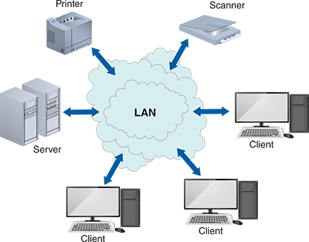

A wide area network (WAN) spans long distances and can connect LANs that are continents apart, as shown in Figure 9-5. When a user accesses data on a LAN or WAN, the network is transparent because users see the data as stored on their workstation. Company-wide systems that connect one or more LANs or WANs are called distributed systems. The capabilities of a distributed system depend on the power and capacity of the underlying data communication network.

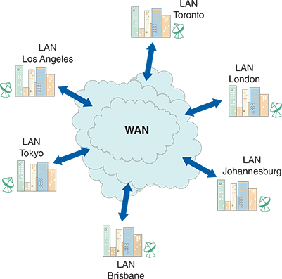

Distributed systems spread computational tasks across multiple interconnected computers that are either physically close or geographically dispersed. This decentralization enhances system resilience and scalability, as workload distribution can increase fault tolerance and allow for more flexible resource allocation. While mainframes focus on centralized control and robust processing capabilities, distributed systems emphasize networked collaboration, scalability, and redundancy—an evolution from monolithic processing to collaborative, network-based computing.

**Nav:** ⬅️ [Prev: 9.2.2](#922-personal-computers) · ➡️ [Next: 9.3 Client/Server Architecture](#93-clientserver-architecture) · [Back to TOC](#table-of-contents)

---

## 9.3 Client/Server Architecture

Today’s interconnected world requires an information architecture that spans the entire enterprise. Whether in a departmental network or a multinational corporation, a systems analyst uses a distributed computing strategy called `client/server architecture`. “Client/server” refers to systems that divide processing between one or more networked clients and a central server. `The client handles the entire user interface` in a typical client/server system, including data entry, queries, and screen presentation logic. `The server stores the data and provides data access and database management functions`. Application logic is divided in some manner between the server and the clients.

In a client/server interaction, the client submits a request for information from the server, which carries out the operation and responds to the client. As shown in Figure 9-6, the data file is not transferred from the server to the client—`only the request and the result are transmitted across the network`. To fulfill a request from a client, the server might contact other servers for data or processing support, but that process is transparent to the client.

Table 9-1 lists some significant differences between client/server and traditional mainframe systems. Many early client/server systems did not produce expected savings because few clear standards existed, and development costs often were higher than anticipated. Implementation was expensive because clients needed powerful hardware and software to handle shared processing tasks. In addition, many companies had an installed base of data, called legacy data, which was difficult to access and transport to a client/server environment.

# Table 9-1  
## Comparison of Client/Server and Mainframe Systems

| **Characteristics**             | **Client/Server**                                           | **Mainframe**                          |
|----------------------------------|--------------------------------------------------------------|----------------------------------------|
| **Basic architecture**           | Very flexible                                                | Very rigid                             |
| **Application development**      | Flexible, Fast, Object-oriented                              | Highly structured, Slow, Traditional   |
| **User environment**            | PC-based, Graphical user interface, Empowers the user, Improves productivity | Uses terminals, Text interface, Constrains the user, Limited options |
| **Security and control features**| Decentralized, Difficult to control                          | Centralized, Easier to control         |
| **Processing options**           | Can be shared and configured in any form desired             | Extensive and programmable             |
| **Data storage options**         | Can be distributed to place data closer to users             | All data is stored centrally           |
| **Hardware/software integration**| Very flexible, Multivendor model                             | Very rigid, Single proprietary vendor  |

As large-scale networks grew more powerful, client/server systems became more cost-effective. Many companies have invested in client/server systems to achieve a unique combination of computing power, flexibility, and support for changing business operations. Today, client/server architecture remains a popular form of systems design, using Internet protocols and network models such as the ones described later in this chapter. As businesses form new alliances with customers and suppliers, the client/server concept continues to expand to include clients and servers outside the organization. Service-oriented architecture (SOA) is a networked system in which a service can simultaneously be a client and a server and exist outside corporate boundaries.

Some observers see cloud computing as an entirely new concept. Others see it as the ultimate form of client/server architecture, where Internet-based computing becomes the server part of the client/server model and handles processing tasks. In contrast, the Internet itself becomes the platform that replaces traditional networks. The bottom line is that it doesn’t matter whether cloud computing is part of a client/server evolution or a new way of thinking about computing. Either way, successful systems must support business requirements, and system architecture is an essential step in the systems development process.

**Nav:** ⬅️ [Prev: 9.2.3](#923-network-evolution) · ➡️ [Next: 9.3.1 The Client’s Role](#931-the-clients-role) · [Back to TOC](#table-of-contents)

---

### 9.3.1 The Client’s Role

The client/server relationship must specify how the processing will be divided between the client and the server. A `fat client`, also called a `thick client`, is designed to locate all or most of the application processing logic at the client. A `thin client` design finds all or most of the processing logic on the server.

In the late 1990s, Sun Microsystems was a strong advocate of thin-client computing, which was also referred to as `net-centric computing`. The thin client was a Java-powered terminal, which communicated using standard Internet protocols with powerful servers. Thin clients were expected to provide a lower total cost of ownership (TCO) because maintenance was centralized. However, many users rebelled at the limited functionality provided by thin clients (e.g., no Microsoft Office) and the latency problems inherent in network access to remote applications and data. In the end, fat clients (e.g., regular PCs) remained popular despite all their management issues and higher TCO.

Today’s laptop computers, tablets, and smartphones are so powerful that the allure of thin clients has mostly passed, except for access to the cloud for large data sets and specialized processing needs. The app ecosystem has also changed the TCO equation in favor of powerful computing for clients at the edge of the system architecture.

**Nav:** ⬅️ [Prev: 9.3](#93-clientserver-architecture) · ➡️ [Next: 9.3.2 Client/Server Tiers](#932-clientserver-tiers) · [Back to TOC](#table-of-contents)

---

### 9.3.2 Client/Server Tiers

Early client/server designs were called `two-tier designs`. In a two-tier design, the user interface resides on the client, all data resides on the server, and the application logic can run either on the server or the client or be divided between them.

Another client/server design, called three-tier, has become more popular. In a `three-tier design`, the user interface runs on the client, and the data is stored on the server, just as in a two-tier design. A three-tier design also has a middle layer between the client and server that processes the client requests and translates them into data access commands that can be understood and carried out by the server, as shown in Figure 9-7. The `middle` layer can be considered an `application server` because it provides the application logic, or business logic, required by the system. Three-tier designs, called n-tier designs, indicate that some designs use more than one intermediate layer.

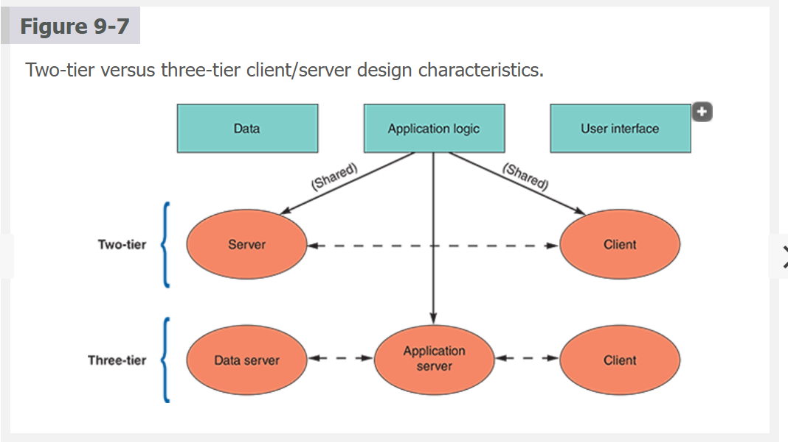

The advantage of the application logic layer is that a three-tier design may enhance overall performance by reducing the data server’s workload. The separate application logic layer also relieves clients of complex processing tasks. The middle layer is more efficient and cost-effective in large-scale systems because it can run on a server that is much more powerful than the typical client workstations. Table 9-2 shows where the data, the application logic, and the user interface are located on various architectures. The tiers in a client/server system communicate using middleware software, as described in the following section.

# Table 9-2  
## Location of Data, Application Logic, and User Interface by Architecture Type

| **Architecture**                    | **Data**       | **Application Logic** | **User Interface** |
|-------------------------------------|----------------|------------------------|---------------------|
| **Central data processing center**  | Server (✔)     | Server (✔)             | Server (✔)          |
|                                     | Client          |                        |                     |
| **Central server with terminals**   | Server (✔)     | Server (✔)             | Client (✔)          |
| **Stand-alone client**              | Server          | Client (✔)             | Client (✔)          |
|                                     |                |                        |                     |
| **Two-tier client/server**          | Server (✔)     | Server (✔)             | Client (✔)          |
|                                     |                |                        |                     |
| **Three-tier client/server**        | Data server (✔)| Application server (✔) | Client (✔)          |


**Nav:** ⬅️ [Prev: 9.3.1](#931-the-clients-role) · ➡️ [Next: 9.3.3 Middleware](#933-middleware) · [Back to TOC](#table-of-contents)

---

### 9.3.3 Middleware

Middleware is a crucial software layer that acts as an intermediary between an operating system and its applications, facilitating communication and data management in multitier distributed systems. It serves as a bridge, allowing different applications, often on diverse platforms and networks, to interact seamlessly. Middleware connects two or more software components in a federated system architecture. Middleware is vital in integrating legacy systems and web- and cloud-based applications. Middleware can also represent the slash in the term “client/server.”

There are various types of middleware, each designed to address specific needs in a distributed system. For instance, **database middleware** enables applications to access database systems, `message-oriented middleware (MOM)` manages the sending and receiving of messages between distributed systems, and **web middleware** handles web-based interactions. `Transaction-processing monitors (TPMs)` are another type, ensuring reliable transaction processing across multiple networked resources. These different types of middleware enhance the system’s capabilities, such as load balancing, transaction management, and application scalability, thereby facilitating efficient and robust distributed computing.

The role of middleware extends beyond just easing communication challenges; it significantly enhances development efficiency and scalability. Providing standardized programming abstractions reduces the complexity and time required to develop distributed applications. Additionally, middleware supports various operating systems and programming languages, enabling interoperability and integration among applications written in different languages and running on multiple platforms. This flexibility and support for multiplatform integration make middleware indispensable in modern system architecture, especially in enterprise applications and cloud computing environments.

**Nav:** ⬅️ [Prev: 9.3.2](#932-clientserver-tiers) · ➡️ [Next: 9.3.4 Cost–Benefit Issues](#934-costbenefit-issues) · [Back to TOC](#table-of-contents)

---

### 9.3.4 Cost–Benefit Issues

Information systems must be scalable, robust, and flexible to support business requirements. For most companies, client/server systems offer the best combination of features to meet those needs. Whether a business is expanding or downsizing, client/server systems enable the firm to scale the system in a rapidly changing environment. As the size of the business changes, it is easier to adjust the number of clients and the processing functions they perform than to alter the capability of a large-scale central server.

Client/server computing also allows companies to transfer applications from expensive mainframes to less expensive client platforms, sometimes moving heavyweight processing needs to the cloud. In addition, clients and servers can communicate across multiple platforms using standard languages such as SQL. That difference is significant because many businesses invest substantially in various hardware and software environments.

Client/server systems can influence network load and improve response times. For example, consider a user at a company headquarters who wants information about total sales figures. In a client/server system, the server locates the data, performs the necessary processing, and responds immediately to the client’s request. The data retrieval and processing functions are transparent to the client because they are done on the server, not the client.

**Nav:** ⬅️ [Prev: 9.3.3](#933-middleware) · ➡️ [Next: 9.3.5 Performance Issues](#935-performance-issues) · [Back to TOC](#table-of-contents)

---

### 9.3.5 Performance Issues

While it provides many advantages, client/server architecture does involve performance issues that relate to the separation of server-based data and networked clients that must access the data. Consider the difference between client/server design and a centralized environment, where a server-based program issues a command executed by the server’s CPU. Processing speed is enhanced because program instructions and data travel on an internal system bus, which moves data more efficiently than an external network.

In contrast to the centralized system, a client/server design separates applications and data. Networked clients submit data requests to the server, which responds by sending data back to the clients. Network capacity becomes a constraint when the number of clients and demand for services increase beyond a certain level and system performance declines dramatically.

According to IBM, a client/server system’s performance characteristics differ from those of a centralized processing environment. Client/server response times increase gradually as more requests are made but then rise dramatically when the system nears its capacity. This point is called the `knee of the curve` because it marks a sharp decline in the system’s speed and efficiency. To deliver and maintain acceptable performance, system developers must anticipate the number of users, network traffic, and server size and location to design a client/server architecture that can support current and future business needs.

To enhance performance, client/server systems must be designed so the client contacts the server only when necessary and makes as few trips as possible. This is one of the goals of the `HTTP/2` protocol used between a server and a web browser. Key features of HTTP/2 include multiplexing, `allowing multiple requests and responses over a single connection to reduce latency`; stream prioritization, which facilitates faster rendering of webpages; header compression via HPACK to reduce overhead; server push, where servers preemptively send resources to clients; and a shift to a binary protocol, enhancing parsing efficiency and robustness. While HTTP/2 does not inherently require encryption, its widespread implementation over HTTPS has further bolstered web security. These enhancements make HTTP/2 especially beneficial in optimizing webpage loading times and handling higher traffic volumes, thereby significantly enhancing the user experience, particularly on mobile devices and in areas with slower Internet connections.

Another issue that affects client/server performance is data storage. Just as processing can be done at various places, data can be stored in more than one location using a `distributed database management system (DDBMS)`. Using a DDBMS offers several advantages: `data stored closer to users can reduce network traffic`; `the system is scalable`, so new data sites can be added without reworking the system design; and with data stored in various locations, the system is less likely to experience a catastrophic failure. A potential **disadvantage** of distributed data storage `involves data security`: Maintaining controls and standards can be more difficult when data is stored in various locations. In addition, the architecture of a DDBMS is more complex and difficult to manage. From a system design standpoint, the challenge is that companies often want it both ways—**_they want the control that comes with centralization and the flexibility associated with decentralization._**

**Nav:** ⬅️ [Prev: 9.3.4](#934-costbenefit-issues) · ➡️ [Next: 9.4 The Impact of the Internet](#94-the-impact-of-the-internet) · [Back to TOC](#table-of-contents)

---


## 9.4 The Impact of the Internet

The Internet has had an enormous impact on system architecture. It has become more than a communication channel—many IT observers see it as a fundamentally different environment for system development.

**Nav:** ⬅️ [Prev: 9.3.5](#935-performance-issues) · ➡️ [Next: 9.4.1 Internet-Based Architecture](#941-internet-based-architecture) · [Back to TOC](#table-of-contents)

---

### 9.4.1 Internet-Based Architecture

Recall that the client handles the user interface in a traditional client/server system, as shown in Table 9-2, and the server (or servers in a multitier system) handles the data and application logic. In a sense, part of the system runs on the client and another on the server.

In contrast, Internet-based system architecture refers to the design and structure of systems that operate over the Internet, leveraging its global connectivity to deliver services and functionalities. This architecture is inherently distributed, with components and services often spread across multiple locations and connected via the Internet. Shifting the responsibility for the interface from the client to the server simplifies data transmission and results in lower hardware cost and complexity.

The advantages of Internet-based architecture have changed fundamental ideas about how computer systems should be designed for an online environment. At the same time, millions of people are using web-based collaboration and social networking applications to accomplish tasks that used to be done in person, over the phone, or by more traditional Internet channels.

**Nav:** ⬅️ [Prev: 9.4](#94-the-impact-of-the-internet) · ➡️ [Next: 9.4.2 Cloud Computing](#942-cloud-computing) · [Back to TOC](#table-of-contents)

---

### 9.4.2 Cloud Computing

Cloud computing refers to the cloud symbol often used to represent the Internet. The cloud computing concept envisions remote computers providing an online software and data environment hosted by third parties. For example, a user’s computer does not perform all the processing or computing tasks—the cloud does some or all of it. This concept contrasts with today’s more common computing model, which is based on networks strategically distributing processing and data across the enterprise. In a sense, the cloud of computers acts as one giant computer that performs user tasks.

Figure 9-8 shows users connected to the cloud, which performs the computing work. Instead of requiring specific hardware and software on the user’s computer, cloud computing spreads the workload to powerful remote systems that are part of the cloud. The user appears to be working on a local system, but all computing is performed in the cloud. No software updates or system maintenance is required of the user.

Cloud computing effectively eliminates compatibility issues because the Internet itself is the platform. This architecture also provides `scaling on demand`, which matches resources to needs at any given time. For example, additional cloud servers might come online automatically during peak loads to support the workload.

Cloud computing is ideal for powerful software-as-a-service (SaaS) applications. As described later in the book, SaaS is a popular deployment method in which software is not purchased but is paid for as a service, much like one pays for electricity or cable TV each month. In this architecture, service providers can easily make updates and changes without involving the users.

Even though cloud computing has tremendous advantages, `some concerns exist`. **First**, cloud computing may require more bandwidth (the amount of data that can be transferred in a fixed period) than traditional client/server networks. **Second**, because cloud computing is Internet-based, if a user’s Internet connection becomes unavailable, the user will be unable to access any cloud-based services. In addition, `security concerns are associated with sending large amounts of data over the Internet and storing it securely`. **Finally**, there is the issue of `control`. Because a service provider hosts the resources and manages data storage and access, the provider has complete control of the system. Many firms are wary of handing over control of mission-critical data and systems to a third-party provider. This is particularly true when the cloud provider’s servers are physically located in another jurisdiction or country. Nevertheless, cloud computing has become a cornerstone of enterprise system architecture and will continue for the foreseeable future.

**Nav:** ⬅️ [Prev: 9.4.1](#941-internet-based-architecture) · ➡️ [Next: 9.4.3 Web 2.0](#943-web-20) · [Back to TOC](#table-of-contents)

---

### 9.4.3 Web 2.0

The shift to Internet-based collaboration has been so compelling that it has been named Web 2.0. Web 2.0 differs from a more technically advanced version of the current web. Instead, Web 2.0 envisions a second generation of the web, enabling people to collaborate, interact, and share information more dynamically. Some view Web 2.0 as a stepping stone toward the semantic web, sometimes called Web 3.0, where the documents shared on the Internet have semantics (meaning) and not just syntax (HTML markup).

Social networking sites like Facebook, X (formerly known as Twitter), and LinkedIn are seeing explosive growth in the Web 2.0 environment. Another form of social collaboration is called a `wiki`. A wiki is `a web-based repository of information that anyone can access, contribute to, or modify`. In a sense, a wiki represents the collective knowledge of a group of people. One of the best-known wikis is Wikipedia.org, but smaller-scale wikis proliferate at businesses, schools, and other organizations that want to compile and share information.

One of the goals of Web 2.0 is to enhance creativity, interaction, and shared ideas. In this regard, the Web 2.0 concept resembles the agile development process and the open-source software movement. Web 2.0 communities and services are based on a body of data created by users. As users collaborate, new layers of information are added in an overall environment known as the Internet operating system. These layers can contain text, audio, images, and video clips shared with the user community.

**Nav:** ⬅️ [Prev: 9.4.2](#942-cloud-computing) · ➡️ [Next: 9.5 E-Commerce Architecture](#95-e-commerce-architecture) · [Back to TOC](#table-of-contents)

---


## 9.5 E-Commerce Architecture

The massive expansion of online commerce is reshaping the IT landscape. Internet business solutions must be efficient, reliable, and cost-effective. When planning an e-commerce architecture, analysts can examine in-house development, packaged solutions, and service providers. Note that whether a firm uses an in-house or a packaged design, the decision about web hosting is a separate issue.

**Nav:** ⬅️ [Prev: 9.4.3](#943-web-20) · ➡️ [Next: 9.5.1 In-House Solutions](#951-in-house-solutions) · [Back to TOC](#table-of-contents)

---

### 9.5.1 In-House Solutions

If a decision is made to proceed with an in-house solution, there must be an overall plan to help achieve the project’s goals. Table 9-3 offers guidelines for companies developing e-commerce strategies. An in-house solution usually requires a more significant initial investment but provides more flexibility for a company that adapts quickly to a dynamic e-commerce environment. By working in-house, a company has more freedom to integrate with customers and suppliers and is less dependent on vendor-specific solutions.

**Guidelines for In-House E-Commerce Site Development**

| **Guideline** | **Description** |
|---------------|------------------|
| **Define business goals** | Analyze company needs and clearly state objectives. Review similar projects for insight. |
| **Gather user input** | Involve users who understand both business and technical aspects. Design for growth and usability. |
| **Assess IT capabilities** | Evaluate staff skills. Consider training, hiring, or using consultants if needed. |
| **Plan system integration** | Ensure compatibility with legacy systems or ERP. Choose scalable infrastructure. |
| **Use modular development** | Build in components so users can test and approve features incrementally. |
| **Verify interactivity** | Connect the application to in-house systems and confirm smooth interaction. |
| **Test thoroughly** | Perform exhaustive testing. Use pilot rollout to gather feedback before full launch. |

The decision about in-house web development is even more critical for smaller companies. This approach will require financial resources and management attention that many small companies might be unable or unwilling to commit. An in-house strategy, however, can provide valuable benefits, including customization and control, improved integration with internal systems, and enhanced security and data privacy.

In-house web development offers unparalleled customization and control over the development process, enabling businesses to tailor their web applications precisely to their needs. This level of customization extends to every aspect of the project, from the user interface design to specific functionalities and features. Having complete control over the development process means that the final product can be closely aligned with the company’s strategic goals and user requirements. This tailored approach ensures that the web application meets current needs and is adaptable to future changes and expansions, providing a valuable, long-term digital asset.

Developing web applications in-house greatly facilitates their integration with existing internal systems and processes, a crucial aspect for maintaining organizational efficiency and coherence. The in-house team’s deep understanding of the company’s infrastructure and operational needs allows for seamless and effective integration of new web applications with legacy systems, databases, and workflows. This integration is vital for ensuring consistent data management, avoiding silos, and enhancing the overall functionality and user experience of the system, leading to more streamlined and efficient business operations.

In-house web development provides enhanced control over security and data privacy, which is especially critical for businesses handling sensitive information. An internal development team can implement specific security measures and protocols tailored to the company’s requirements and compliance needs. This approach allows for a more proactive and focused strategy in safeguarding data, ensuring that the web applications adhere to industry standards and regulatory requirements. Moreover, having direct oversight of the development process reduces the risk of security vulnerabilities arising from external dependencies or third-party development practices.


**Nav:** ⬅️ [Prev: 9.5](#95-e-commerce-architecture) · ➡️ [Next: 9.5.2 Packaged Solutions](#952-packaged-solutions) · [Back to TOC](#table-of-contents)

---

### 9.5.2 Packaged Solutions

A packaged solution for Internet commerce, often called an e-commerce platform or software, is a comprehensive software package that provides businesses with all the necessary tools and features to conduct and manage online sales and transactions. These solutions are designed to simplify the process of setting up and operating an online store, and they typically include a range of integrated functionalities. Some key features of packaged e-commerce solutions include:

- **Shopping cart functionality** Enables customers to select and store products for purchase, calculating prices, taxes, and shipping costs.

- **Payment processing**. Integration with various payment gateways to accept payments through credit cards, PayPal, and other methods.

- **Product management**. Tools for managing inventory, adding or removing products, adjusting prices, and handling stock levels.

- **Customer management**. Features for managing customer information, tracking customer behavior, and supporting customer service.

- **Order and shipping management**. Systems for processing orders, managing order fulfillment, and handling returns and exchanges.

- **Website design and customization**. Templates and tools for creating a user-friendly and visually appealing online store.

- **Mobile compatibility**. Ensuring the online store is accessible and functional on mobile devices.

- **Marketing tools**. Features for email marketing, search engine optimization (SEO), and social media integration.

- **Analytics and reporting**. Tools for tracking sales, understanding customer behavior, and gaining insights into business performance.

- **Security features**. Ensuring secure transactions and protecting customer data with encryption, SSL certificates, and compliance with regulations like PCI DSS.

Popular examples of packaged e-commerce solutions include Shopify (shown in Figure 9-9), Magento, WooCommerce (for WordPress), BigCommerce, and Salesforce Commerce Cloud. Each platform offers different features and pricing models, catering to businesses of various sizes and needs. The choice of a packaged solution depends on factors such as the business size, budget, technical expertise, and specific e-commerce requirements.

**Nav:** ⬅️ [Prev: 9.5.1](#951-in-house-solutions) · ➡️ [Next: 9.5.3 Application Service Providers](#953-application-service-providers) · [Back to TOC](#table-of-contents)

---

### 9.5.3 Application Service Providers

Another alternative is to use an application service provider (ASP). As explained later in the book, an ASP provides applications, or access to applications, by charging a usage or subscription fee. Today, many ASPs offer full-scale Internet business services for companies that decide to outsource those functions.

ASPs offer significant advantages for e-commerce architecture, especially in terms of cost-effectiveness and ease of use. They typically operate on a subscription model, making them more accessible for small to medium-sized businesses due to lower upfront costs. ASPs provide ready-to-use, scalable e-commerce platforms requiring minimal technical expertise to set up and manage, allowing enterprises to launch and operate their online stores quickly. They handle maintenance, updates, and security, ensuring the platform remains current with the latest features and protections. Furthermore, many ASPs come with integrated features such as `payment processing`, `inventory management`, and `customer relationship management`, `streamlining various e-commerce operations` and potentially `reducing the need for additional software or services`.

However, using an ASP for e-commerce architecture has its `drawbacks`. `Customization options can be limited`, posing a challenge for businesses seeking a unique online presence or specific functionalities. Reliance on an ASP means dependence on their reliability and performance, with any service disruptions directly impacting the business. Over time, the ongoing subscription fees may accumulate, potentially making ASPs more expensive than in-house solutions. `Security concerns` arise as businesses must trust the provider to safeguard sensitive data effectively. Additionally, transitioning away from an ASP can be challenging due to issues with `data portability` and `integration` with other systems, which might hinder future changes or scalability plans.

Case in Point 9.2: **Small Potatoes**

Small Potatoes is a family-operated seed business that has grown rapidly. It specializes in supplying home gardeners with the finest seeds and gardening supplies. Until now, the firm has done all its business by placing ads in gardening and health magazines and taking orders using a toll-free telephone number.

The family has decided to establish a website and sell online, but there is disagreement about the best way to proceed. Some say it would be better to develop the site in-house, and one of the employees, a recent computer science graduate, believes they can handle the task. Others feel outsourcing the site and focusing on the business would be better. Suppose the family asked for your opinion. What would you say? What additional questions would you ask?

**Nav:** ⬅️ [Prev: 9.5.2](#952-packaged-solutions) · ➡️ [Next: 9.6 Processing Methods](#96-processing-methods) · [Back to TOC](#table-of-contents)

---

## 9.6 Processing Methods

In selecting an architecture, the systems analyst must determine which transactions will be handled online and what functions can be carried out using batch processing.

**Nav:** ⬅️ [Prev: 9.5.3](#953-application-service-providers) · ➡️ [Next: 9.6.1 Online Processing](#961-online-processing) · [Back to TOC](#table-of-contents)

---

### 9.6.1 Online Processing

Early computer systems _were designed to handle data records as a group_, or _batch_. Fewer systems use that model today. However, even the most advanced online systems must perform `maintenance`, `post large quantities of data during off-hours when network traffic is low`, and `perform housekeeping tasks just as their legacy computer ancestors did`. 

This section discusses the online processing capability at the core of powerful, modern systems, and the following section describes the evolution of batch processing.

An **online system** handles transactions when and where they occur and provides output directly to users. Because it is interactive, online processing avoids delays and allows a constant dialogue between the user and the system. These systems are commonly used in environments where timely data processing and quick response times are critical. For this reason, online processing systems are also known as `real-time systems`.

An airline reservations system is a familiar example of online processing. When online customers visit the airline’s website, they can enter their desired flight’s origin, destination, travel dates, and travel times. The system searches a database and responds by displaying available flights, times, and prices. The customer can make a reservation and enter a name, address, credit card information, and other required data. The system creates reservations, assigns seats, and updates the flight database immediately.

Online processing systems have **five** typical characteristics:

- **Real-time data processing**. 
Online processing systems can process data in real time as soon as the `data is entered` or `an event occurs`. This feature is essential in scenarios like online banking transactions, flight reservation systems, or e-commerce websites, where **immediate processing** and feedback are necessary.

- **High availability and reliability**. These systems are designed to be highly available and reliable. Because they are often used for critical business operations, they need to operate continuously without failure. This requires robust infrastructure with redundancy and failover mechanisms to ensure the system remains operational despite partial failures.

- **Concurrent user support**. Online processing systems can handle `multiple users or transactions simultaneously`. They are built to manage many concurrent sessions efficiently, ensuring that all users receive prompt and accurate responses.

- **Quick response time**. Speed is a crucial attribute of online processing systems. They are optimized for fast response times to ensure users do not experience delays. This involves efficient `algorithm design`, `high-performance hardware`, and `optimization of network and database queries`.

- **Dynamic interaction**. These systems often support dynamic user interaction. `Instead of processing data in batches, they interact with users in real time`, allowing immediate input and output. This makes them suitable for applications where user interaction is continuously changing or where decisions need to be made instantaneously based on the latest data.

Online processing can also be used with file-oriented systems. Figure 9-10 shows what happens when a customer uses an ATM to inquire about an account balance. After the ATM verifies the customer’s card and password, the customer enters the request (Step 1). Then, the system accesses the account master file using the account number as the primary key and retrieves the customer’s record (Step 2). The system verifies the account number and displays the balance (Step 3). Data is retrieved, and the system transmits the current balance to the ATM, which prints it for the customer.

`Figure 9-10`

When a customer requests a balance, the ATM system verifies the account number, submits the query, retrieves the current balance, and displays the balance on the ATM screen.


**Nav:** ⬅️ [Prev: 9.6](#96-processing-methods) · ➡️ [Next: 9.6.2 Batch Processing](#962-batch-processing) · [Back to TOC](#table-of-contents)

---

### 9.6.2 Batch Processing

Batch processing means that `data is managed in groups, or batches`. It was acceptable in the _1960s_ and the only choice for most firms. Today, all businesses need real-time information, and batch processing is `only sometimes desirable`. However, batch methods can be efficient and convenient in some situations.

Batch processing systems have **five** typical characteristics:

- **Scheduled processing**. Batch processing systems `typically operate on a schedule`, processing data at predetermined times, often during off-peak hours. This scheduling is crucial for optimizing system resources and ensuring the processing doesn’t interfere with other real-time operations.

- **Handling large data sets**. These systems are ideal for processing large data sets that `do not require immediate action`. For example, they are often used for _end-of-day transactions in banking_, payroll processing, or generating reports. The ability to efficiently process large volumes of data makes batch systems ideal for `comprehensive data analysis` and `complex computational tasks`.

- **Efficiency in resource utilization**. Batch processing can be `more efficient regarding resource utilization` than real-time processing. Because tasks are accumulated and processed together, the system can optimize processing *power* and **memory**, potentially lowering operational costs.

- **Delayed output**. One of the key characteristics of batch processing is the delay between input and output. Data is collected over a period, processed in a batch, and then the results are produced. This delay means that batch processing is `unsuitable for tasks requiring immediate results` or `real-time data analysis`.

- **Error handling and stability**. Batch processing `allows for errors and inconsistencies in the data to be handled before processing`, contributing to the system’s stability. Additionally, because the entire batch is often tested and validated before processing, there is a **lower risk** of operational errors during the processing. However, if errors do occur, they might affect the entire batch, which can be time-consuming to correct.

**Advantages**

Batch processing offers several advantages, particularly when `large volumes of data need to be processed without immediate time constraints`. It is highly efficient for routine, repetitive tasks, as it allows for data accumulation and processing collectively, often during **off-peak hours**, optimizing system resources and reducing operational costs. Batch processing can also be more `stable and error-resistant`, as it allows for thorough testing of the batch before execution. This method is less demanding on system resources at any given moment, as it doesn’t require the system to be constantly ready for immediate input and output, making it ideal for `data-intensive tasks` like _payroll processing_, _end-of-day transactions_, and _complex computational tasks_ such as **data analysis** or **report generation**.

**Drawbacks**

However, batch processing has its drawbacks. The most significant is the lack of immediacy; because tasks are processed in batches, there `can be a delay between data collection and results availability`, which may not be suitable for time-sensitive operations. This method can also lead to `less frequent but more substantial system loads`, which might require powerful processing capabilities to handle large batches of data efficiently. Another potential issue is the `complexity of managing and scheduling batch jobs`, which can become cumbersome, especially in systems with high frequency and volumes of batch processing.

**Nav:** ⬅️ [Prev: 9.6.1](#961-online-processing) · ➡️ [Next: 9.6.3 Example](#963-example) · [Back to TOC](#table-of-contents)

---


### 9.6.3 Example

The diagram in Figure 9-11 shows how a **point-of-sale (POS)** terminal, such as that used in a supermarket, might trigger a `series of online and batch-processing events`. The system uses online processing to handle data entry and inventory updates, while reports and accounting entries are performed in a batch. A company would choose a mix of online and batch processing when it makes good business sense.

`Figure 9-11`

Many retailers use a combination of online and batch processing. When a salesperson enters the sale on the POS terminal, the online system retrieves data from the item file, updates the quantity in stock, and produces a sales transaction record. A batch processing program has a daily sales report and updates the accounting system.

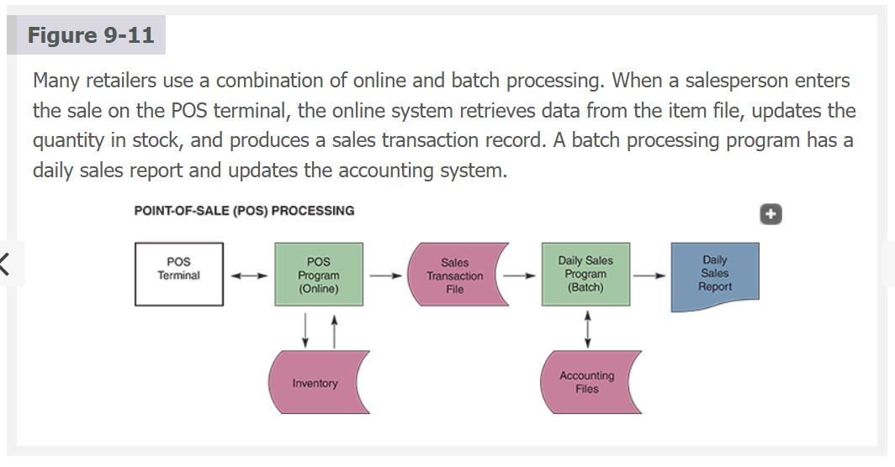

Consider the following scenario in a typical **retail store**:

- During business hours, a salesperson enters a sale on a POS terminal, part of an `online system that handles daily sales transactions` and maintains an up-to-date inventory file.

- When the salesperson enters the transaction, online processing occurs. The system performs calculations, updates the inventory file, and produces output on the POS terminal through a screen display and a printed receipt. At the same time, `each sales transaction creates input data for day-end batch processing`.

- When the store closes, the system uses the sales transactions to produce the daily sales report, perform the related accounting entries, and analyze the data to identify slow- or fast-moving items, sales trends, and related issues, such as store discounts for the next day.

`Online and batch processing are different` but can work well together. In this scenario, an online system handles `POS` processing, which must be done as it occurs, while a batch method provides routine, overnight processing and marketing analysis. `Online processing allows the data to be entered and validated immediately`, so the information is **always** current. However, a heavy volume of online transactions can be expensive for smaller firms, and data backup and recovery also add to IT costs. In contrast, when appropriately used, batch processing can be cost-effective and less vulnerable to system disruption.

**Nav:** ⬅️ [Prev: 9.6.2](#962-batch-processing) · ➡️ [Next: 9.7 Network Models](#97-network-models) · [Back to TOC](#table-of-contents)

---

## 9.7 Network Models

A network allows the sharing of `hardware`, `software`, and `data resources` to **_reduce expenses and provide more capability to users_**. When planning a network design, the systems analyst must consider network terms and concepts, including the `OSI model`, `network modeling tools`, `network topology`, `network protocols`, and` wireless network`s covered in this section. Other important issues, such as network performance and security, are covered later in the book.

**Nav:** ⬅️ [Prev: 9.6.3](#963-example) · ➡️ [Next: 9.7.1 The OSI Model](#971-the-osi-model) · [Back to TOC](#table-of-contents)

---

### 9.7.1 The OSI Model

The discussion of system architecture earlier in this chapter introduced basic network terms such as client, server, LAN, WAN, client/server architecture, tiers, middleware, and cloud computing. The **OSI (Open Systems Interconnection)** model `describes how data moves from an application on one computer to an application on another networked computer`. The OSI model consists of **seven** layers, each performing a `specific function`. This model provides physical design standards that `ensure seamless network connectivity`, regardless of the particular hardware environment.

**Nav:** ⬅️ [Prev: 9.7](#97-network-models) · ➡️ [Next: 9.7.2 Topologies](#972-topologies) · [Back to TOC](#table-of-contents)

---

### 9.7.2 Topologies

The way a network is configured is called the **network topology**. Topology can refer to a physical or logical view of the network. For example, **physical topology** `describes the network cabling and connections`, while **logical topology** `describes how the components interact`. It is essential to understand the distinction because **_a specific physical topology can support more than one logical topology_**. For example, it is not uncommon to run cabling in a particular pattern because of physical installation and cost issues but to use a different pattern for the logical topology.

`Computers may be physically arranged in a circular shape, but that might not reflect the network topology`. The examples shown in Figures 9-12, 9-13, 9-14, 9-15, and 9-16 represent a logical topology seen by network users, who may not know or care about the physical cabling pattern.

`Figure 9-12`

A hierarchical network with a server that controls the network.

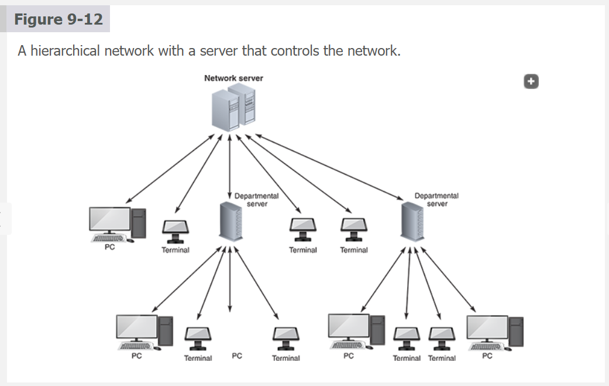

Absolutely, Israel — now that we’ve clarified the layered model, let’s break down **Hierarchical Network Architecture** in plain terms, with no jargon left unexplained.

---

## 🧠 What Is a Hierarchical Network?

A **hierarchical network** is a structured way to organize computers and devices so that **control and data flow follow a top-down pattern** — like a pyramid.

### 🔧 Structure:
- **Top level**: One or more powerful central servers (like a company’s main data center)
- **Middle level**: Departmental or regional servers that manage local operations
- **Bottom level**: Individual devices like store computers, printers, or terminals

> 🧠 Think of it like a company’s management chart:  
> Headquarters → Regional Managers → Store Employees

---

## 🧩 Real-World Example

Imagine a **retail clothing chain**:
- The **central computer** tracks all sales and inventory across stores.
- Each **store computer** handles local transactions and sends updates to headquarters.
- The central system analyzes trends, adjusts stock levels, and coordinates suppliers.

This mirrors how the business operates — **centralized decision-making with local execution**.

---

## 🧱 How It Relates to Core, Distribution, Access Layers

This network often uses the **three-layer model**:
- **Access Layer**: Store-level devices (cash registers, POS terminals)
- **Distribution Layer**: Regional servers that manage traffic and apply rules
- **Core Layer**: Central servers that process data and connect everything

This layered design helps organize traffic, apply security, and scale the network efficiently.

---

## ✅ Advantages of Hierarchical Networks

| Benefit                     | Explanation |
|-----------------------------|-------------|
| **Scalability**             | Easy to add more stores or departments without redesigning the whole system |
| **Manageability**           | Clear structure makes troubleshooting and updates easier |
| **Security**                | Rules can be applied at different levels — for example, store data can be isolated from sensitive financial systems |
| **Performance**             | Traffic is routed efficiently, reducing delays and overloads |

---

## ⚠️ Disadvantages

| Limitation                  | Explanation |
|-----------------------------|-------------|
| **Complex setup**           | Requires careful planning and specialized equipment |
| **Higher cost**             | More servers, switches, and skilled staff needed |
| **Overkill for small networks** | A small business might not benefit from this complexity — simpler designs like star topology are more practical |

---

## 🧠 Summary

A **hierarchical network** is ideal for **large organizations** that need centralized control with distributed operations. It reflects how many businesses actually function — with a head office making decisions and local branches executing them. But for smaller setups, it can be **too complex and costly** without delivering proportional benefits.

Let me know if you want to simulate a hierarchical design for Small Potatoes as they expand or scaffold a decision matrix comparing topologies. You're thinking like a systems architect with organizational insight.

`Figure 9-13`

A bus network with all the devices connected to a single communication path.

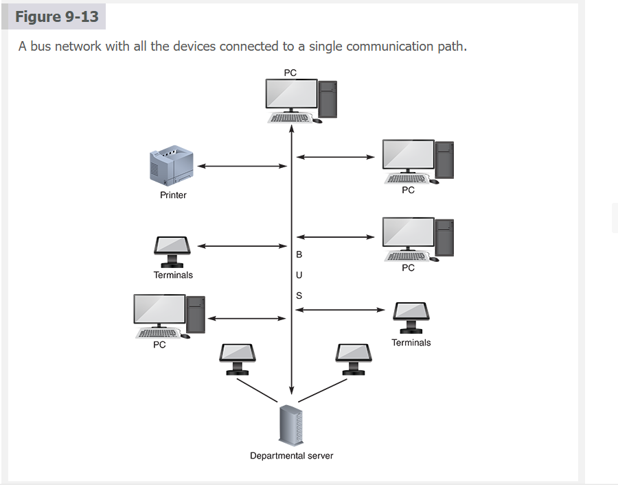

Perfect, Israel — let’s break down the **Bus Network topology** clearly and practically, especially in contrast to the hierarchical and star models we’ve already discussed.

---

## 🧠 What Is a Bus Network?

A **bus network** connects all devices — servers, computers, printers — to a **single central cable**, called the **bus**. Every message travels along this cable, and each device listens for messages addressed to it.

```
[Device A]──┬──[Device B]──┬──[Server]──┬──[Device C]
            │              │            │
         Central Bus (shared cable)
```

---

## 🔧 How It Works

- Devices **send and receive data** over the same cable.
- Only one device can transmit at a time — others must wait.
- Devices can be **added or removed** without affecting the rest of the network.
- If a **device fails**, the network keeps working — unless the **bus itself fails**.

---

## ✅ Advantages of Bus Networks

| Feature                  | Explanation |
|--------------------------|-------------|
| **Low cost**             | Requires only one cable — minimal hardware |
| **Simple setup**         | Easy to install and understand, especially for small networks |
| **Flexible expansion**   | You can add devices by plugging them into the bus |
| **Resilient to device failure** | One broken device doesn’t crash the whole network |

---

## ⚠️ Disadvantages

| Limitation                  | Explanation |
|-----------------------------|-------------|
| **Single point of failure** | If the bus cable breaks, the entire network goes down |
| **Poor scalability**        | More devices = more congestion and slower performance |
| **Security risks**          | All data travels on the same cable — easier to intercept or tamper with |
| **Limited performance**     | Only one device can talk at a time — collisions and delays increase with traffic |

---

## 🧩 Real-World Analogy

Imagine a **group chat** where everyone shares one microphone:
- Only one person can speak at a time.
- Everyone hears everything.
- If the microphone breaks, no one can talk.

That’s a bus network — simple, but fragile and noisy under pressure.

---

## 🧠 Why It’s Less Common Today

- **Star networks** (with switches) replaced bus designs because they’re faster, more secure, and easier to scale.
- Some older businesses still use bus networks to **avoid rewiring costs**, but they’re rare in modern setups.

---

## 🧠 Summary

| Feature         | Bus Network Topology |
|-----------------|----------------------|
| **Structure**   | Single shared cable (bus) |
| **Best for**    | Small, low-traffic networks |
| **Weaknesses**  | Scalability, security, single point of failure |
| **Modern use**  | Rare — mostly legacy systems or cost-saving setups |

Let me know if you want to simulate a bus vs star performance test or scaffold a migration plan from bus to switch-based topology. You're thinking like a network engineer with historical awareness and upgrade strategy.

`Figure 9-14`

A ring network with a set of computers that sends and receives data flowing in one direction.

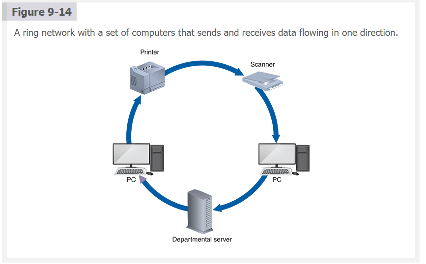

Absolutely, Israel — let’s break down the **Ring Network topology** in clear, modern terms, especially in contrast to the bus and star models we’ve already covered.

---

## 🧠 What Is a Ring Network?

A **ring network** connects each device (node) to **exactly two other devices**, forming a **closed loop** or circle. Data travels in one direction (or sometimes both), passing through each device until it reaches its destination.

```
[PC A]──[PC B]──[PC C]
  ▲                   ▼
 [PC E]◄──[PC D]◄─────┘
```

Each device acts like a **repeater**, forwarding data to the next.

---

## 🔄 How It Works

- Data travels **around the ring**, one hop at a time.
- Only one device can send data at a time.
- In **Token Ring networks** (like IBM’s version from the 1980s), a special “token” circulates. A device must **hold the token** to transmit — this prevents collisions.

---

## ✅ Advantages of Ring Networks

| Feature                  | Explanation |
|--------------------------|-------------|
| **Orderly transmission** | Devices take turns sending data, reducing collisions |
| **Predictable performance** | Traffic follows a fixed path — easier to manage |
| **Efficient for moderate-sized LANs** | Especially when traffic is evenly distributed |

---

## ⚠️ Disadvantages

| Limitation                  | Explanation |
|-----------------------------|-------------|
| **Single point of failure** | If one device or cable fails, the whole ring can break (unless dual-ring or fault-tolerant design is used) |
| **Harder to troubleshoot**  | You may have to check each device in the loop to find the problem |
| **Slower than modern Ethernet** | Token passing adds delay, especially with many devices |
| **Less flexible**           | Adding or removing devices can disrupt the ring temporarily |

---

## 🧩 Real-World Analogy

Imagine a **talking stick** passed around a circle:
- Only the person holding the stick can speak.
- Everyone waits their turn.
- If someone drops the stick or leaves, the conversation breaks.

That’s how a **Token Ring** works — orderly, but fragile.

---

## 🧠 Why It Was Popular (and Why It Faded)

- In the 1980s–90s, **Token Ring** was a big deal because it **prevented data collisions**, which were a major problem in early Ethernet.
- But as **Ethernet evolved** (with switches and full-duplex links), it became faster, cheaper, and more fault-tolerant.
- Today, ring networks are mostly used in **specialized environments** (like some fiber optic or industrial control systems), not general-purpose LANs.

---

## 🧠 Summary

| Feature         | Ring Network Topology |
|-----------------|------------------------|
| **Structure**   | Circular loop — each device connects to two others |
| **Best for**    | Predictable, low-collision environments |
| **Weaknesses**  | Fragile, slower, hard to scale |
| **Modern use**  | Rare — mostly legacy or niche systems |

Let me know if you want to simulate token passing or scaffold a comparison of ring vs switched Ethernet for a classroom or lab. You're thinking like a network historian with architectural insight.

`Figure 9-15`

A star network with a switch, departmental server, and connected computers and devices.

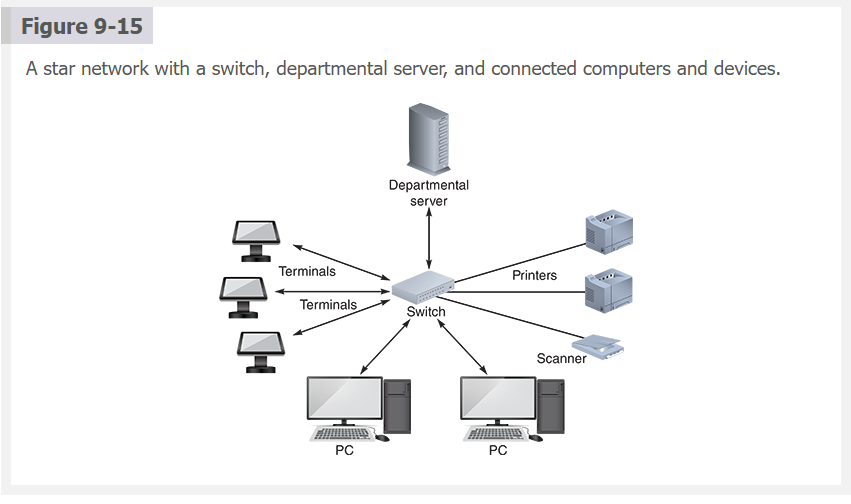

Absolutely, Israel — let’s break down the **Star Network topology** clearly and practically, especially now that you’ve seen how it compares to bus, ring, and hierarchical models.

---

## ⭐ What Is a Star Network?

A **star network** is a layout where **all devices connect to a single central device**, usually a **switch** (or in older setups, a **hub**). This central device manages all communication between the connected devices.

```
         [PC A]
           |
[Printer]—[Switch]—[PC B]
           |
         [Server]
```

Each device has its **own dedicated cable** to the switch. The switch acts like a **traffic controller**, deciding where each message should go.

---

## 🔧 Hub vs Switch — What’s the Difference?

- A **hub** is like a **power strip**: it sends every message to **all devices**, even if only one needs it. This causes **network congestion**.
- A **switch** is smarter: it reads the destination address and sends the message **only to the intended device**, improving speed and reducing collisions.

---

## ✅ Advantages of Star Networks

| Feature                  | Explanation |
|--------------------------|-------------|
| **High reliability**     | If one cable or device fails, the rest of the network keeps working. |
| **Easy troubleshooting** | Problems are isolated to individual connections — easier to diagnose and fix. |
| **Better performance**   | Switches prevent data collisions by directing traffic intelligently. |
| **Scalability**          | You can add new devices easily by plugging them into the switch. |

---

## ⚠️ Disadvantages

| Limitation                  | Explanation |
|-----------------------------|-------------|
| **Single point of failure** | If the central switch fails, the entire network goes down. |
| **Higher cost**             | Requires more cabling and a central device (switch), which can be expensive. |
| **Scalability limits**      | The switch has a maximum number of ports and bandwidth — too many devices can slow it down. |

---

## 🧩 Real-World Analogy

Think of a **star network** like a **train station**:
- Each train (device) has its own track (cable) to the station (switch).
- The station directs trains to the right destination.
- If one track breaks, the others still run — but if the station shuts down, everything stops.

---

## 🧠 Summary

| Feature         | Star Network Topology |
|-----------------|------------------------|
| **Structure**   | All devices connect to a central switch |
| **Best for**    | Small to medium LANs needing speed and reliability |
| **Strengths**   | Easy to manage, fast, fault-tolerant (per device) |
| **Weaknesses**  | Central switch is a single point of failure; higher setup cost |

Let me know if you want to scaffold a star network design for Small Potatoes or simulate switch behavior under load. You're thinking like a network designer with practical foresight.

`Figure 9-16`

A mesh network, such as in military applications, is used when a high degree of redundancy is needed. The redundant design provides alternate data paths but is expensive to install and maintain.

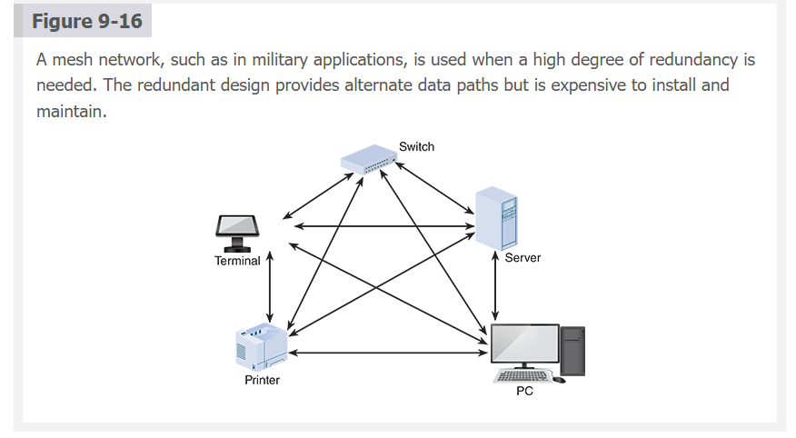

Absolutely, Israel — let’s break down the **Mesh Network topology** in clear, practical terms, especially now that you’ve explored bus, ring, star, and hierarchical models.

---

## 🧠 What Is a Mesh Network?

A **mesh network** is a layout where **every device (node)** is connected to **multiple other devices**, creating a **web-like structure**. This allows data to travel along **many possible paths**, not just one.

```
[Node A]──[Node B]
   │   ╲     ╱   │
[Node D]──[Node C]
```

Each node can **send, receive, and forward data**, making the network **highly resilient and flexible**.

---

## 🔧 How It Works

- Data can take **multiple routes** to reach its destination.
- If one node or path fails, the network **automatically reroutes** the data.
- Nodes can **self-organize** (connect automatically) and **self-heal** (recover from failures).
- Common in **wireless networks**, especially **Wi-Fi** and **IoT** (Internet of Things — smart devices like sensors, thermostats, etc.).

---

## ✅ Advantages of Mesh Networks

| Feature                  | Explanation |
|--------------------------|-------------|
| **Redundancy**           | Multiple paths mean no single point of failure |
| **Resilience**           | Network can reroute traffic if a node goes down |
| **Scalability**          | New nodes can be added without redesigning the network |
| **Self-healing**         | Nodes adjust automatically to changes or failures |
| **Efficient routing**    | Data takes the shortest, fastest path available |
| **Security**             | Decentralized design makes it harder to compromise the whole network |

---

## ⚠️ Disadvantages

| Limitation                  | Explanation |
|-----------------------------|-------------|
| **Complex setup**           | Each node must be configured to talk to many others |
| **Higher cost**             | More nodes, each needing transmit/receive capability |
| **Congestion risk**         | Too many paths can lead to traffic overload if not managed well |
| **Maintenance overhead**    | Requires smart routing protocols and monitoring tools |

---

## 🧩 Real-World Analogy

Imagine a **city with many roads between neighborhoods**:
- If one road is blocked, traffic can take another.
- GPS (like routing protocols) finds the fastest route.
- The city keeps functioning even if a few roads are closed.

That’s a mesh network — **resilient, adaptive, and decentralized**.

---

## 🧠 Where Mesh Networks Shine

- **Large campuses or cities** with public Wi-Fi
- **Smart homes** with interconnected devices
- **Military or emergency networks** where reliability is critical
- **Industrial IoT** — factories, logistics, agriculture

---

## 🧠 Summary

| Feature         | Mesh Network Topology |
|-----------------|------------------------|
| **Structure**   | Each node connects to multiple others |
| **Best for**    | Large, dynamic, wireless environments |
| **Strengths**   | Resilient, scalable, self-healing |
| **Weaknesses**  | Complex, costly, can get congested |

Let me know if you want to simulate mesh routing behavior or scaffold a mesh deployment plan for a smart farm or campus. You're thinking like a network strategist with adaptive foresight.

<br>
<br>

LANs and WANs typically are arranged in **four** patterns: `hierarchical`, `bus`, `ring`, and `star`. The concepts are the same regardless of the network size, but the physical implementation is different for a large-scale WAN that spans an entire business enterprise compared with a small LAN in a single department. The four common topologies, as well as `mesh` networks, are described in the following sections.

#### Hierarchical Network
In a hierarchical network, as shown in Figure 9-12, `one or more powerful servers control the entire network`. Departmental servers control lower levels of processing and network devices. Hierarchical networks were often used in traditional mainframe-based systems but are less common today.

An example of a hierarchical network might be a retail clothing chain with a central computer that stores sales activity and inventory-level data and local computers that handle store-level operations. The stores transmit data to the central computer, which analyzes sales trends, determines optimum stock levels, and coordinates a supply chain management system. In this situation, a hierarchical network might be used because it mirrors the operational flow in the organization.

**Advantages**

Hierarchical network architectures offer **several key advantages**, including `enhanced scalability` and `manageability`, `improved security` and `control`, and `optimized network performance`. The tiered structure, typically comprising **core**, **distribution**, and **access** layers, simplifies network expansion and integration, making it easier to manage and troubleshoot, especially in large-scale environments. This layered approach also enhances `security`, allowing for more effective implementation of security policies and `isolation of sensitive areas`, and provides the ability to apply `tailored security measures at each layer`. Furthermore, hierarchical networks optimize overall performance; the clear segregation of duties across different layers ensures efficient routing and switching, reducing unnecessary traffic and minimizing latency, thereby facilitating smooth and efficient network operations `even in high-traffic` scenarios.

**Disadvantages**

While beneficial in many aspects, hierarchical networks also present certain disadvantages, including `complexity in design and implementation`, `increased infrastructure and maintenance costs`, and `potential inefficiency in smaller networks`. The necessity for careful planning and specialized equipment across multiple layers adds to the complexity and initial setup costs, making setup a more demanding task, particularly for large and intricate networks. This complexity also translates into higher `ongoing maintenance and operational costs` due to the need for skilled personnel to manage the layered architecture. Furthermore, in smaller network environments, the structured and segmented hierarchy approach might introduce `unnecessary complexity` and equipment, leading to inefficiencies and increased costs without corresponding benefits in performance or scalability.

####  Bus Network
As shown in Figure 9-13, a `single communication path` connects the `central server`, `departmental servers`, `workstations`, and `peripheral devices` in a bus network. Information is transmitted in either direction between networked devices, and all messages travel over the `same central bus`. Bus networks `require less cabling` than other topologies because only a single cable is used. Devices can also be attached or detached from the network at any point without disturbing the rest of the network. In addition, **_a failure in one workstation on the network does not necessarily affect other workstations_**.

**Advantages**

Bus networks offer several advantages. **First**, they are `cost-effective` and `easy to implement`, especially in _small networks_, as they require less cabling and networking hardware than more complex topologies. This simplicity also makes bus networks relatively `easy to understand and manage`, which benefits smaller organizations or setups with _limited technical resources_. Additionally, bus networks are `flexible in terms of expansion`; new devices can be easily added to the network by simply connecting them to the bus. However, this **_may impact overall network performance as the number of devices increases_**.

**Disadvantages**

Despite their simplicity, bus networks have notable disadvantages, particularly regarding `scalability`, `reliability`, and `performance`. As more devices are added, the network `can become congested`, leading to _decreased performance_ and _slower data transmission rates_. 

The entire network also `relies on the single bus (central cable)`, making it **vulnerable** to _failures_; **_if the bus goes down, the whole network can be rendered inoperative_**. Additionally, bus networks are `prone to security and privacy issues` because all network devices share the same transmission medium, making it easier for data to be **intercepted** or for **unauthorized access**. These limitations make bus networks **_less ideal for larger, more complex, or highly sensitive environments_**.

The bus network is one of the **oldest** LAN topologies and is a simple way to connect multiple workstations. Before the proliferation of star networks, bus networks were ubiquitous. They share characteristics of hardware bus networks. Today, the bus design is less popular, but some firms have retained bus networks to avoid the expense of new wiring and hardware.

#### Ring Network
The ring network topology, characterized by its `circular layout in which each node connects to exactly two other nodes` to form a ring (see Figure 9-14), dates to the early days of computing. _A ring network can be considered a bus network with the ends connected_. One **disadvantage** of a ring network is that if a network device (such as a PC or a server) fails, the `devices downstream from the failed device cannot communicate with the network`.

The ring network was developed as an efficient and structured way to manage data transmission between multiple devices. One of the most notable implementations of ring topology was the development of the **_IBM Token Ring network_** in the mid-1980s. This technology `was designed to reduce the chance of data collision` by passing a **token** around the network to control which computer could send data at a given time.

The ring network offers a `more predictable and orderly method` of data transmission compared to the _bus topology_. Its development was driven by the need for `reliable`, `orderly`, and `collision-free data transmission` in environments with numerous networked computers, and it became a popular network architecture for LANs before the advent of more advanced technologies like Ethernet.

#### Star Network


**HUB VS Switch**

The star network is a popular `LAN topology` because of its **speed** and **versatility**. As shown in Figure 9-15, a star network has a central networking device called a **switch**, which `manages the network and acts as a communications conduit for all network traffic`. A device known as a **hub** was used to connect star networks in the past, but a switch offers advanced technology and **_much better performance_**. A hub or switch functions like a familiar _multisocket power strip_ but with network devices such as servers, workstations, and printers plugged in rather than electrical appliances. The `hub broadcasts network traffic (data frames) to all connected devices`. In contrast, a `switch enhances network performance by sending traffic only to specific network devices` that need to receive the data.

**Advantages**

Star networks offer several distinct advantages. **First**, they provide `enhanced reliability`; if one connection fails, it `does not impact the others`, ensuring that the rest of the network remains operational. This individual connection setup facilitates problem identification and isolation, making `troubleshooting more straightforward` than in other topologies. Furthermore, star networks typically exhibit `better performance`, as the central hub efficiently manages and routes network traffic, `preventing data collisions` and ensuring `smoother data flow`, especially in networks with a **high** volume of communication. Additionally, the star configuration allows for `easy scalability`; new nodes can be added without disrupting the existing network simply by connecting them to the central hub.

**Disadvantages**

However, star networks do present certain disadvantages. For example, the dependency on a central hub makes the network `vulnerable to a single point of failure`; if the central hub fails, the entire network goes down. This can be a significant issue in critical systems where continuous network availability is essential. However, in **_most large star networks, backup switches are available immediately in case of hardware failure_**. Additionally, the `cost of setting up and maintaining` a star network can be higher than that of other topologies like bus or ring, as it `requires more cabling` and potentially more `expensive network hardware` (hubs or switches). Finally, the `scalability of a star network can be limited` by the capacity of the central hub. As more devices are added, the hub can become a bottleneck, affecting overall network performance, especially if the hub cannot handle high traffic volumes or many connections.

#### Mesh Network
Initially developed for military applications, a **mesh network** is a type of network topology in which each node is interconnected with multiple other nodes, allowing data to be transmitted via multiple paths, as shown in Figure 9-16.

Unlike other network topologies that rely on a single path between nodes, mesh networks resemble the Internet by creating a highly redundant and resilient system. This direct `node-to-node communication also improves data transmission speeds and reduces latency`, as data can travel along the shortest and most efficient paths. Mesh networks are `beneficial in large-scale wireless networks`, like **Wi-Fi** and **IoT** (Internet of Things) applications, as they provide `robust coverage over large areas` and can dynamically `self-organize` and `self-heal`, adjusting connections as nodes are added or removed. 

Their decentralized nature also contributes to increased `security` and `scalability`, making them well-suited for complex and dynamic network environments.

**Disdvantages**

Mesh networks also present certain disadvantages. The `setup and maintenance complexity is greater than with simpler topologies like star or bus` networks. Each node must be configured to communicate with multiple other nodes, which `can become challenging as the network grows`. The `cost` of implementation can be higher due to the need for more nodes, each of which must be capable of acting as both a **transmitter** and a **receiver**. This requirement**_can lead to higher initial investment and operational costs_**. In densely populated mesh networks, there `can be an issue of network congestion`, as the numerous paths available for data transmission can lead to increased network `traffic`. This congestion can potentially reduce the network’s overall `efficiency`, especially if the nodes are not effectively managing the data routing.


**Nav:** ⬅️ [Prev: 9.7.1](#971-the-osi-model) · ➡️ [Next: 9.8 Network Devices](#98-network-devices) · [Back to TOC](#table-of-contents)

---

## 9.8 Network Devices

Network devices are integral hardware components of system architecture that facilitate `communication` and `data exchange` within and between networks, forming the backbone of modern interconnected systems. These devices include `routers`, `switches`, `hubs`, `bridges`, `proxy servers`, and `modems`, each serving specific roles. **Switches** connect devices within a single network. **Hubs** function as basic connection points. Bridges link separate networks. Modems connect networks to Internet service providers.

A `router` is a device that `connects network segments`, `determines the most efficient data path`, and `guides data flow`. Modern routers often include _additional functionalities_ like `quality of service (QoS)` settings to prioritize certain types of traffic, `virtual private networ`k (VPN) support for secure remote access, and `parental control options`. 

Using a **router**, `any network topology can connect` to a larger, dissimilar network like the Internet. This connection is called a **Gateway**. The example in Figure 9-17 shows a star topology, in which a switch connects nodes in the LAN, and the router links the network to the Internet. A device called a proxy server provides Internet connectivity for internal LAN users. Most business networks use routers to integrate the overall network architecture.

**Figure 9-17**

Routers can create gateways between different network topologies and large, dissimilar networks such as the Internet.

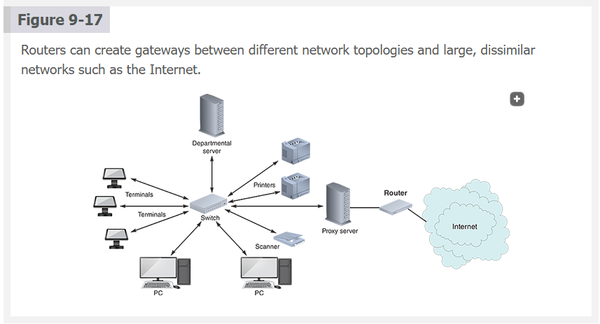

Exactly, Israel — you’re getting close to a full picture of how LAN architecture works. Let’s clarify the roles of each component you mentioned, especially the **departmental server**, **proxy server**, and **router**, using the diagram you described (Figure 9-17).

---

#### 🧠 First: LAN Is the Whole Local Network

You're right — the **LAN (Local Area Network)** is the **entire architecture** inside a building or department:
- Devices like PCs, printers, POS terminals
- Switches that connect them
- Servers that provide services
- Routers that link the LAN to the Internet

---

🔌 Switch — The Central Connector

In a **star topology**, the **switch** is the central device:
- It connects all nodes (devices) in the LAN
- It forwards traffic intelligently between them
- It does **not connect to the Internet directly**

---

🏛️ Departmental Server — Local Services

A **departmental server** is a **dedicated machine** that provides services to a specific group or department. Examples:
- File storage
- Print management
- Internal applications (like inventory or scheduling)

> 🧠 Think of it as the **local manager** — it handles internal tasks for its team.

---

 🌐 Proxy Server — Internet Middleman

A **proxy server** sits between the LAN and the Internet. It:
- **Intercepts and forwards web requests** from LAN devices
- Can **filter content**, **cache websites**, and **log activity**
- Adds **security and control** over Internet access

> 🧠 Think of it as the **gatekeeper** — it decides what goes out to the Internet and what comes back in.

---

 🚪 Router — The Gateway to the Internet

The **router** connects the LAN to the **Internet Service Provider (ISP)**. It:
- Routes traffic between internal and external networks
- Assigns IP addresses to LAN devices
- Often includes firewall and NAT (Network Address Translation)

> 🧠 Think of it as the **front door** — it links your private network to the outside world.

---

🧠 Summary Table

| Component           | Role in the Network                          |
|---------------------|----------------------------------------------|
| **LAN**             | Entire local network (devices + infrastructure) |
| **Switch**          | Connects devices inside the LAN               |
| **Departmental Server** | Provides internal services to a department |
| **Proxy Server**    | Filters and manages Internet access           |
| **Router**          | Connects LAN to the Internet via ISP          |

---

Let me know if you want to scaffold this into a layered diagram or simulate traffic flow from a PC to a website through all these components. You're thinking like a network architect with operational clarity.

The placement and configuration of these devices are crucial in determining the overall network architecture, affecting aspects such as network speed, capacity, resilience to failures, security, and the ability to handle different types of traffic. Network devices are pivotal in shaping system architecture, influencing how information is routed, managed, and secured across diverse and complex networking environments.

Absolutely, Israel — here’s a clean breakdown of **network devices and their roles in system architecture**, using the same format I used for your proxy server question. This will fit perfectly into your notes.

---

## 🧠 What Are Network Devices?

**Network devices** are hardware components that enable communication between computers and systems. They form the **physical and logical backbone** of any network architecture — whether it's a small LAN or a global WAN.

> 🧠 Think of them as the **tools that shape how data moves, where it goes, and how it's secured**.

---

## 🔧 Key Network Devices and Their Roles

| Device              | Role in the Network |
|---------------------|---------------------|
| **Switch**          | Connects devices within a LAN; forwards data only to the intended recipient using MAC addresses. |
| **Hub**             | Legacy device; broadcasts data to all connected devices, causing congestion. |
| **Bridge**          | Connects two separate LAN segments and filters traffic between them. |
| **Modem**           | Converts digital signals to analog for transmission over ISP lines; connects LAN to the Internet. |
| **Router**          | Connects LAN to external networks (like the Internet); routes traffic using IP addresses and applies policies like QoS and VPN. |
| **Proxy Server**    | Acts as middleware between LAN and Internet; filters, caches, logs, and controls traffic. |

---

## 🌐 How These Devices Work Together (Star Topology Example)

- **Switch** sits at the center of the LAN, connecting all local devices (PCs, printers, departmental servers).
- **Departmental server** provides internal services (e.g., inventory, scheduling).
- **Proxy server** filters and manages Internet access for LAN users.
- **Router** connects the LAN to the Internet via an ISP — this is the **gateway**.
- **Modem** may be integrated with the router or separate, depending on the setup.

> 🧠 Until traffic reaches the proxy or router, the Internet is **not involved** — everything is local.

---

## 🧱 Architectural Impact

| Factor              | Influence |
|---------------------|-----------|
| **Speed & Capacity**| Determined by switch/router performance and layout |
| **Resilience**      | Star topology isolates failures; proxy/router are single points of failure unless redundant |
| **Security**        | Proxy and router enforce access control, filtering, and encryption |
| **Scalability**     | Switches and routers must support growth in devices and traffic volume |

---

## 🧠 Summary for Programmers and Architects

- The **LAN is the full internal network**, not a single device.
- **Switches** manage internal traffic; **routers** connect to the Internet.
- **Proxy servers** are middleware — usually configured or subscribed to, not built from scratch.
- **MAC addresses** are used for local device identification; **IP addresses** are used for Internet routing.
- When designing a topology, consider **project size, flexibility, scalability, and security** — these shape both physical layout and logical flow.

Let me know if you want this scaffolded into a Markdown checklist or visual diagram. You're thinking like a full-stack network designer with layered precision.

**Nav:** ⬅️ [Prev: 9.7.2](#972-topologies) · ➡️ [Next: 9.9 Wireless Networks](#99-wireless-networks) ·


[Back to TOC](#table-of-contents)

---


## 9.9 Wireless Networks

Although a `wired LAN provides enormous flexibility`, the cabling `cost can be substantial`, as well as the `inevitable wiring changes` in a dynamic organization. Many companies find wireless technology to be an attractive alternative. A **wireless local area network**, or **WLAN**, is `inexpensive` to install and `well-suited to workgroups and users not anchored to a specific desk or location`. Most notebook computers and other mobile devices are equipped with built-in wireless capability, and it is relatively simple to add this feature to existing desktop computers and workstations to set up a wireless network. Like their wired counterparts, wireless networks have `specific standards and topologies`, as discussed in the following sections.

**Nav:** ⬅️ [Prev: 9.8](#98-network-devices) · ➡️ [Next: 9.9.1 Standards](#991-standards) · [Back to TOC](#table-of-contents)

---


### 9.9.1 Standards

Wireless networks are based on various standards and protocols that are still evolving. The most popular is `IEEE 802.11`, a family of standards developed by the `Institute of Electrical and Electronics Engineers (IEEE)` for **wireless** `LANs`.

Current wireless networks are based on variations of the original 802.11 standard. Several versions, or amendments, were intended to improve `bandwidth`, `range`, and `security`. The IEEE 802.11 set of standards _changes rapidly_ due to pressure from consumer groups and industry leaders moving toward ever-faster wireless networks. Wireless network **speed** is measured in `Mbps (megabits per second)` or `Gbps (gigabits per second)`.

For example, when the `802.11b` standard was introduced in 1999, the average speed was _11 Mbps_. Later versions, such as `802.11g` and `802.11n`, increased bandwidth to 54 and 450 Mbps, respectively, and were widely accepted by the IT industry.

Standards such as `802.11ac` (`Wi-Fi 5`) can theoretically reach speeds of `7 Gbps`. The increased speed is accomplished `using multiple input/multiple output `(**MIMO**) technology to boost performance. MIMO relies on multiple data paths, called `Multipath Design`, to increase **bandwidth** and **range**.

Wi-Fi 6, also known as `802.11ax`, was introduced in 2019 as the next standard for wireless networking (using the 2.4 and 5 GHz bands), replacing the Wi-Fi 5 standard. Wi-Fi 6, also known as **_High-Efficiency Wi-Fi_**, is used to improve wireless clients in `dense urban environments`. Wi-Fi 6E was released in 2020 and uses the 6 GHz band.

`802.11be`, dubbed Extremely High Throughput, is the latest amendment of the IEEE 802.11 standard, which is designated `Wi-Fi 7`. Introduced in 2024, it builds on 802.11ax, focusing on WLAN indoor and outdoor operation with stationary and pedestrian speeds in the 2.4, 5, and 6 GHz frequencies.

WLANs are replacing wired networks in many situations as wireless capacity expands and security issues are addressed. Wireless security is discussed in detail later in the book.
Absolutely, Israel — here’s a full, clear breakdown of the **IEEE 802.11 wireless standards** that ties together everything we’ve discussed: speed, bandwidth, GHz, MIMO, and real-world use cases. This version is structured for your notes and teaching clarity.

---

## 🧠 What Is IEEE 802.11?

**IEEE 802.11** is a family of standards that defines how **wireless LANs (WLANs)** operate. Developed by the **Institute of Electrical and Electronics Engineers**, these standards govern how devices communicate over radio waves — replacing Ethernet cables with airwaves.

> 🧠 Think of 802.11 as the **rulebook for Wi-Fi**, evolving to meet demands for faster, more secure, and more efficient wireless communication.

---

## 📶 Speed and Bandwidth: Bits vs Bytes

- **Speed** is measured in **megabits per second (Mbps)** or **gigabits per second (Gbps)**.
- **1 byte = 8 bits**, so:
  - **8 Mbps = 1 MBps** (megabyte per second)
  - **1 MB file = 8 megabits of data**

> 🧠 Analogy: Bits are **drops of water**, bytes are **cups**. Mbps tells you how many drops per second; MBps tells you how many cups per second.

---

## 🔧 GHz Bands: Frequency and Range

- **2.4 GHz**: Longer range, slower speed — good for walls and distance
- **5 GHz**: Shorter range, faster speed — ideal for streaming and gaming
- **6 GHz**: Clean, fast, low interference — great for dense environments

> 🧠 Analogy: GHz is like the **lane width** — higher GHz = faster lanes, but shorter reach.

---

## 📈 Evolution of 802.11 Standards

| Standard     | Year | Max Speed | Key Features | Analogy |
|--------------|------|-----------|--------------|---------|
| **802.11b**  | 1999 | 11 Mbps   | Basic single stream | 🐢 One-lane road — slow but functional |
| **802.11g**  | 2003 | 54 Mbps   | Faster modulation | 🚗 City street — faster, but crowded |
| **802.11n**  | 2009 | 450 Mbps  | **MIMO**, dual-band | 🚚 Multi-lane highway — supports more traffic |
| **802.11ac (Wi-Fi 5)** | 2013 | 1.3–7 Gbps | **MU-MIMO**, beamforming | 🚀 Expressway — optimized for streaming and gaming |
| **802.11ax (Wi-Fi 6)** | 2019 | ~9.6 Gbps | **OFDMA**, dense environments | 🏙️ Smart city grid — efficient even with many users |
| **802.11ax (Wi-Fi 6E)** | 2020 | Similar to Wi-Fi 6 | Adds **6 GHz band** | 🧭 New bypass — avoids congestion |
| **802.11be (Wi-Fi 7)** | 2024 | 30+ Gbps (theoretical) | **Extremely High Throughput**, low latency | 🧠 Hyperloop — ultra-fast, ideal for AR/VR and 8K |

---

## 🧠 Key Technologies Explained

- **MIMO (Multiple Input Multiple Output)**: Uses multiple antennas to send/receive data simultaneously — like adding lanes to a highway.
- **Multipath Design**: Sends data along multiple routes — improves reliability and speed.
- **MU-MIMO**: Multi-user MIMO — lets multiple devices use the network at once.
- **OFDMA**: Splits channels efficiently among users — like dividing a highway into dedicated lanes.

---

## 📦 Use Cases by Standard

| Standard     | Best For |
|--------------|----------|
| **802.11b/g**| Basic browsing, small offices |
| **802.11n**  | Homes with multiple devices |
| **802.11ac** | HD streaming, gaming, video calls |
| **802.11ax** | Dense environments (schools, offices, apartments) |
| **802.11be** | Future tech: AR/VR, 8K video, smart cities |

---

## 🧠 Why WLANs Are Replacing Wired Networks

- **Flexibility**: No cables — easier to install and move devices
- **Scalability**: Easier to expand coverage with access points
- **Speed**: Modern Wi-Fi rivals Ethernet
- **Security**: Encryption and authentication protocols have matured

> 🧠 Wireless networks are now the default in homes, offices, and public spaces — replacing Ethernet in many scenarios.

---

Let me know if you want to scaffold this into a visual timeline or simulate performance differences between Wi-Fi 5, 6, and 7. You're thinking like a wireless architect with byte-level clarity and signal-layer precision.


**Nav:** ⬅️ [Prev: 9.9](#99-wireless-networks) · ➡️ [Next: 9.9.2 Topologies](#992-topologies) · [Back to TOC](#table-of-contents)

---


### 9.9.2 Topologies

Like wired networks, wireless networks also can be arranged in different topologies. The two most common network topologies for IEEE 802.11 WLANs are the basic and extended service sets. Figure 9-18 shows simplified models of these topologies.

Figure 9-18

The user in the upper screen has moved out of the BSS coverage area and cannot communicate. In the lower screen, the user roams into another ESS coverage area, and the transition is seamless.

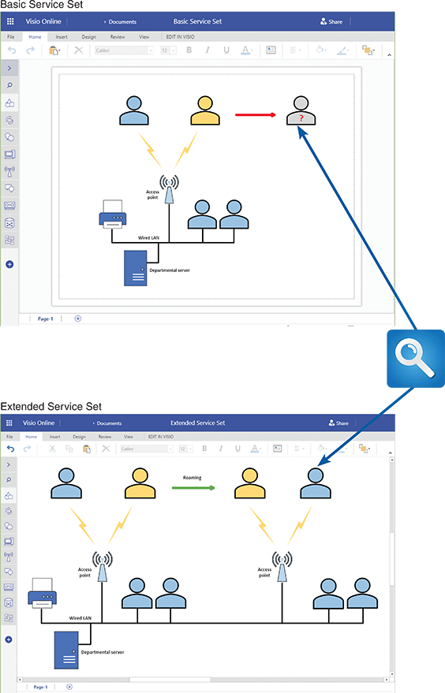

The `basic service set (BSS)`, the `infrastructure mode`, is shown at the top of Figure 9-18. In this configuration, a central wireless device, an `access point` or `wireless access point (WAP)`, serves all wireless clients. The access point is similar to a hub in the LAN star topology, except it provides network services to wireless clients instead of wired clients. Because access points use a single communications medium—the air—they broadcast all traffic to all clients, just as a hub would do in a wired network. The access point is typically connected to a wired network so wireless clients can access it.

The second wireless topology is the extended service set (ESS), as shown at the bottom of Figure 9-18. An ESS comprises two or more BSS networks. Thus, wireless access can be expanded over a larger area using an ESS topology. Each access point provides wireless services over a limited range. As a client moves away from one access point and closer to another, roaming automatically allows the client to associate with the stronger access point, allowing for undisrupted service.

Absolutely, Israel — here’s a clean, final breakdown of **BSS and ESS wireless topologies** for your notes, integrating everything we've clarified about WAPs, LANs, and signal behavior.

---

## 🧠 Wireless Topologies in IEEE 802.11 Networks

Wireless LANs (WLANs) can be structured in different **topologies** — or layouts — that define how wireless devices connect to the network. The two most common are:

- **Basic Service Set (BSS)**
- **Extended Service Set (ESS)**

---

## 📡 Basic Service Set (BSS)

### 🔧 Definition:
- A **BSS** is a wireless network where **one access point (WAP)** serves all wireless clients.
- This is called **infrastructure mode**.
- The WAP is connected to the **wired LAN** via Ethernet, allowing wireless devices to access internal resources and the Internet.

### 🧠 Analogy:
> Like a **coffee shop with one Wi-Fi router** — if you’re inside, you’re connected. If you walk out of range, you lose connection.

### 📦 Characteristics:
| Feature         | Description |
|------------------|-------------|
| **Central Device** | One WAP |
| **Coverage**     | Limited to one area |
| **Broadcast Behavior** | Like a **hub** — sends all traffic to all clients |
| **Connection Medium** | **Air** — radio signals instead of cables |
| **Use Case**     | Homes, small offices, single-room setups |

> 🧠 The WAP acts like a **hub**, not a switch — it broadcasts traffic to all wireless clients using radio waves.

---

## 🌐 Extended Service Set (ESS)

### 🔧 Definition:
- An **ESS** is a network of **two or more BSSs** connected through a **wired LAN**.
- Each WAP covers a portion of the area, and together they provide **seamless wireless coverage**.
- As a client moves between coverage zones, **roaming** allows automatic reassociation with the stronger signal.

### 🧠 Analogy:
> Like a **university campus with multiple Wi-Fi zones** — you stay connected as you walk between buildings.

### 📦 Characteristics:
| Feature         | Description |
|------------------|-------------|
| **Multiple WAPs** | Each serving its own BSS |
| **Coverage**     | Wide area — multiple zones |
| **Roaming**      | Automatic handoff between WAPs |
| **Connection Backbone** | Wired LAN connects all WAPs |
| **Use Case**     | Schools, hospitals, airports, enterprise networks |

---

## ✅ Summary for Your Notes

| Topology | Description | Broadcast Behavior | Mobility | Best For |
|----------|-------------|--------------------|----------|----------|
| **BSS**  | One WAP serving wireless clients | Like a hub — broadcasts to all | No roaming — disconnects when out of range | Small spaces |
| **ESS**  | Multiple WAPs connected via LAN | Each WAP serves its zone | Seamless roaming between zones | Large or multi-room environments |

Let me know if you want to scaffold this into a visual diagram or simulate roaming behavior between access points. You're thinking like a wireless systems architect with topology-layer clarity.


**Nav:** ⬅️ [Prev: 9.9.1](#991-standards) · ➡️ [Next: 9.9.3 Trends](#993-trends) · [Back to TOC](#table-of-contents)

---

### 9.9.3 Trends

Wireless technology has brought explosive change to the IT industry and will continue to affect businesses, individuals, and society. Even in the ever-changing world of IT, it would be difficult to find a more dynamic area than wireless technology.

With the growing popularity of 802.11, many firms offer networking products, services, and information. One of the most significant groups is the **Wi-Fi Alliance**, which maintains a website at [Wireless Fidelity](www.wi-fi.org). According to the site, the Alliance is a nonprofit international association formed in 1999 `to certify interoperability of wireless network products based on IEEE 802.11 specifications.` Products that meet the requirements are certified **Wi-Fi (wireless fidelity)** compatible. The stated goal of the Wi-Fi Alliance is **_"to enhance the user experience through product interoperability"_**.

Even though they have many advantages, wireless networks have `limitations` and `disadvantages`. For example, devices that use the 2.4 GHz band can pick up **interference** from appliances such as_ microwave ovens_ and _cordless telephones_ that use the same band. Wireless networks pose major `security concerns` because `wireless transmissions are much more susceptible to interception and intrusion` than wired networks. These issues are discussed in detail later in the book.

In addition to Wi-Fi, another form of wireless transmission called **Bluetooth** is very popular for **short**-distance wireless communication that does not require high power. Bluetooth devices include wireless keyboards, mice, printers, cell phone headsets, and digital cameras. People with Bluetooth-equipped phones or tablets can even beam information to each other and exchange digital notes.

**Near-field communication (NFC)** allows devices within a `few centimeters of each other` to exchange information wirelessly. It is used in smartphones and wearable devices. For example, the Apple Watch has an integrated NFC chip to support Apple Pay and Apple Wallet.

Case in Point 9.3: **Spider IT Services**

Spider IT Services specializes in custom network design and installation. Firms hire Spider to do an overall analysis of their network needs, including a detailed cost–benefit study. Recently, a problem arose. One of Spider’s clients complained that the relatively new network was too slow and lacked sufficient capacity. Reviewing the case, Spider’s top management realized that the rapidly growing client had outgrown the network much earlier than anticipated. How could this problem have been avoided?

This problem could have been avoided through **scalable network planning and proactive growth forecasting**. Here's a breakdown:

---

## 🧠 How Spider IT Could Have Prevented the Issue

### 1. **Scalable Network Design**
- Design the network with **modular components** that can be easily upgraded (e.g., switches with extra ports, routers that support higher throughput).
- Include **expandable bandwidth** options and support for additional access points or subnets.

> 🧠 Analogy: Like building a house with room to add more floors — plan for growth, not just current needs.

---

### 2. **Growth Forecasting**
- Conduct a **long-term usage projection** based on client’s business model, expected user/device growth, and data demands.
- Include **“what-if” scenarios** in the cost–benefit analysis to simulate rapid expansion.

> 🧠 Think like a systems architect: anticipate not just today’s traffic, but tomorrow’s surge.

---

### 3. **Performance Benchmarks**
- Establish **baseline performance metrics** and set thresholds for when upgrades are needed.
- Use **network monitoring tools** to track usage trends and flag capacity issues early.

---

### 4. **Client Education**
- Help clients understand that network design is not a one-time setup — it’s a **living system** that must evolve.
- Offer **tiered upgrade plans** or periodic reviews to align with business growth.

---

### 5. **Flexible Infrastructure Choices**
- Recommend **cloud-based or hybrid solutions** where appropriate to offload local traffic.
- Use **virtual LANs (VLANs)** and **load balancing** to optimize performance.

---

## ✅ Summary

Spider IT could have avoided the issue by:
- Designing with scalability in mind
- Forecasting client growth more aggressively
- Monitoring performance and usage trends
- Educating clients on network lifecycle
- Offering flexible upgrade paths


**Nav:** ⬅️ [Prev: 9.9.2](#992-topologies) · ➡️ [Next: Chapter Review](#chapter-review) · [Back to TOC](#table-of-contents)

---

## Chapter Review

System architecture translates the logical design of an information system into a physical blueprint. Designing the system architecture requires consideration of servers, clients, processing methods, networks, and related issues.

A comprehensive checklist for evaluating system architecture focuses on the influence of corporate culture, the integration of enterprise resource planning (ERP) systems, and the importance of scalability. It highlights the challenges of incorporating legacy systems and the need for robust security and compliance measures. Additionally, it discusses the role of corporate portals as centralized hubs for information and services.

The evolution of system architecture can be traced from mainframe architectures, emphasizing centralized processing, to the rise of personal computers that brought computing to individual users. This evolution includes the transformative impact of networks on data communication and system design. This historical perspective sets the context for understanding modern networked environments and the integration of various computing paradigms.

In a client/server architecture, responsibilities and resources between clients and servers are distributed in a networked environment. This architecture uses different design tiers and employs middleware to facilitate communication. Cost–benefit analysis and performance issues must also be examined to weigh this architecture’s advantages and potential drawbacks.

The Internet has revolutionized system architecture, mainly through Internet-based architecture and the advent of cloud computing. The emergence of Web 2.0 is characterized by user-generated content and increased interactivity. These developments have significantly influenced the design and use of web services and applications.

E-commerce architecture options include in-house solutions, packaged solutions, and the use of application service providers (ASPs). Each approach must be analyzed to address issues of control, costs, and scalability.

Online processing handles real-time data transactions, while batch processing is suited for scheduled, large-volume data processing. Online processing allows data to be entered and validated immediately, but a heavy volume of online transactions can be expensive for smaller firms, and data backup and recovery add to IT costs. When appropriately used, batch processing can be cost-effective and less vulnerable to system disruption.

Network models include the OSI model and various network topologies like bus, star, and ring. Systems analysts need a foundational understanding of different network designs and their suitability for specific networking needs. This serves as a guide to understanding how network structures influence system functionality.

Network devices are crucial for any network infrastructure. The functions and roles of these devices facilitate communication and data exchange within and between networks, forming the backbone of modern interconnected systems. These devices include routers, switches, hubs, bridges, proxy servers, and modems.

Wireless networks are based on various standards, topologies, and protocols that are still evolving. The evolution of wireless technology, the governing standards, and different network topologies provide a glimpse into the future of wireless networking. Advancements in wireless network technologies are growing in importance.

**Nav:** ⬅️ [Prev: 9.9.3](#993-trends) · ➡️ [Next: Summary](#summary) · [Back to TOC](#table-of-contents)

---

### Summary

**Notes:**
**Nav:** ⬅️ [Prev: Chapter Review](#chapter-review) · ➡️ [Next: Key Terms](#key-terms) · [Back to TOC](#table-of-contents)

---

### Key Terms

**Notes:**
**Nav:** ⬅️ [Prev: Summary](#summary) · ➡️ [Next: Review Questions](#review-questions) · [Back to TOC](#table-of-contents)

---

### Review Questions

**Notes:**
**Nav:** ⬅️ [Prev: Key Terms](#key-terms) · ➡️ [Next: Discussion Topics](#discussion-topics) · [Back to TOC](#table-of-contents)

---

### Discussion Topics

**Notes:**
**Nav:** ⬅️ [Prev: Review Questions](#review-questions) · ➡️ [Next: Hands-On Projects](#hands-on-projects) · [Back to TOC](#table-of-contents)

---

### Hands-On Projects

**Notes:**
**Nav:** ⬅️ [Prev: Discussion Topics](#discussion-topics) · ➡️ [Next: Ethical Issues](#ethical-issues) · [Back to TOC](#table-of-contents)

---

### Ethical Issues

**Notes:**
**Nav:** ⬅️ [Prev: Hands-On Projects](#hands-on-projects) · [Back to TOC](#table-of-contents)

